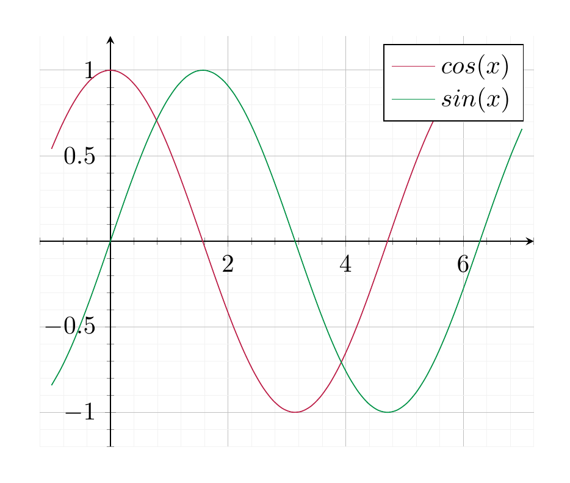

# Mathematical notation and terminology

## Sets

| Symbol | Reads | Explanation | Example |
|:---|:---|:---|:---|
| $\{ \ \dots \}$ | a set | The elements of the set are written inside the braces. | $\{1,2,3\}$ denotes the set consisting of the numbers 1, 2 and 3. |
| $\{ \dots | \dots \}$ | The set of all $\dots$ satisfying the condition $\dots$. | This denotes the set consisting of all objects satisfiying a certain condition. | $\{ \text{ all vegetables } V | \text{ I eat } V \text{ regularly } \}$ consists of all the vegetables that I eat regularly. |
| $\in$ | is an element of | If $M$ is a set the expression $x \in M$ means that $x$ is a member of $M$. | $\diamondsuit \in \{ \diamondsuit, \heartsuit, \spadesuit, \clubsuit \}$ |
| $\notin$ | is not an element of | If $M$ is a set the expression $x \in M$ means that $x$ is a member of $M$. | $\diamondsuit \notin \{ \heartsuit, \spadesuit, \clubsuit \}$ |
|  |  |  |  |
| $f : X \to Y$ | $f$ from $X$ to $Y$ | A function $f$ from a set $X$ to another set $Y$. | $f : \{ \text{Monday}, \dots, \text{Sunday} \} \to \{ \text{true, false} \}$ is some function that assigns to any weekday either true or false. For example, $f$ could indicate whether I go to school that day. |
| $\to$ | to | The regular arrow is the symbol for a function. |  |
| $\mapsto$ | maps to | $x \mapsto y$ indicates that a particular element $x \in X$ is sent to (or “mapped to”) the element $y \in Y$. | $\text{Sunday} \mapsto \text{false}$ |
| $X \times Y$ | The *product* of two sets $X$ and $Y$. | The product consists of pairs $(x, y)$, where $x \in X$ and $y \in Y$. | $\{0, 1\} \times \{ 0, 1\} = \{(0,0), (0, 1), (1,0), (1,1)\}$. |
| $X \subset Y$ | *subset* | $X$ is a subset of $Y$ if every element of $X$ is also an element of $Y$. | $\{1, 2\} \subset \{0, 1, 2\}$ |
| $X \subsetneq Y$ | *proper subset* | $X$ is a proper subset of $Y$ if $X \subset Y$ but $X \ne Y$ | $\{1, 2\} \subsetneq \{0, 1, 2\}$ |
| $X \cap Y$ | *intersection* of $X$ and $Y$ | The intersection consists of those elements that are contained in $X$ *and* in $Y$. $\{0, 1\} \cap \{-1, 0\} = \{ 0 \}$ |  |
| $X \cup Y$ | *union* of $X$ and $Y$ | The union consists of those elements that are contained in $X$ *or* in $Y$. $\{0, 1\} \cap \{-1, 0\} = \{-1, 0, 1 \}$ |  |
| $g \circ f$ | *composition* | If $f : X \to Y$ and $g : Y \to Z$ are two functions, then $g \circ f: X \to Z$ is the function sending $x \in X$ to $g(f(x))$. |  |

## Logic

| Symbol | Reads | Explanation | Example |
|:---|:---|:---|:---|
| $\Rightarrow$ | Implies | If $A$ and $B$ are two (mathematical) statements, then “$A \Rightarrow B$” means that if $A$ holds then $B$ also holds. | $x \ge 1 \Rightarrow x^2 \ge 1$ |
| $\Leftrightarrow$ | Equivalent | If $A$ and $B$ are two mathematical statements, then “$A \Leftrightarrow B$” is an abbreviation for $A \Rightarrow B$ *and* (at the same time) $B \Rightarrow A$. | $x \ge 0$ $\Leftrightarrow$ $x + 1 \ge 1$ |
| $:=$ | is defined to be |  | $x := 2$ means that we define the variable $x$ to take the value 2 |
|  |  |  |  |

## Numbers and arithmetic

| Symbol | Reads | Explanation | Example |
|:---|:---|:---|:---|
| ${{\bf Z}}$ |  | The set of all integers. | $-34, -1, 0, 1, 2, 18, \dots \in {{\bf Z}}$, $\frac 3 4 \notin {{\bf Z}}$ |
| ${{\bf Q}}$ |  | The set of all rational numbers. | $\frac {-3}{16}, -3.3, -1, 0, 2.4, \frac 3 4 \in {{\bf Q}}$, $\sqrt 3 \notin {{\bf Q}}$ |
| ${\bf R}$ |  | The set of all real numbers. | 0, 1, $-1$, $\frac 1 2$, $\sqrt 3$, $\pi$, $e \in {\bf R}$ |
| $\sum_{e=1}^n a_e$ | Sum | This is an abbreviation for the sum of the $a_e$, where $e$ runs from 1 to $n$. (Here $a_e$ can be any expression depending on $e$.) It can also be written as $a_1 + a_2 + \dots + a_e$. | $\sum_{e=1}^3 e^2 = 1^2 + 2^2 + 3^2 = 14$. |

# Trigonometric functions

Angles can be measured in degrees or in radians. These are converted as follows:

|        angle         |           radian           |
|:--------------------:|:--------------------------:|
|     (in degree)      |         (no unit)          |
|    $180^\circ$     |          $\pi$           |
|     $90^\circ$     |      $\frac \pi 2$       |
|      $\alpha$      | $\frac{\pi}{180} \alpha$ |
| $\frac {180}\pi r$ |           $r$            |

Geometrically, given an angle $\alpha$ (between 0 and $360^\circ$ as in the picture below), the radian is the length of the yellow circle segment as shown:

A rotation by a positive number is *counter-clockwise*; conversely negative numbers correspond to a *clockwise* rotation. For example, a rotation by $\frac \pi 2$ is a counter-clockwise rotation by $90^\circ$. A rotation by $-\frac \pi 4$ is a clockwise rotation by $45^\circ$.

Given any radian $r$, the ray that has an angle $r$ between itself and the positive $x$-axis meets the circle with radius 1 and mid-point $(0,0)$ in exactly one point $p$. The *trigonometric functions* $\sin$ and $\cos$ are defined to be the coordinates of that point:

\[
p = (\cos(r), \sin (r)).
\]

For example, we have the following values

| $r$ | 0 | $\pi/6$ (30°) | $\pi/4$ (45°) | $\pi/3$ (60°) | $\pi/2$ (90°) | $\dots$ |
|:--:|:--:|:--:|:--:|:--:|:--:|:--:|
| $\sin(r)$ | 0 | $\frac 12$ | $\sqrt 2$ | $\frac {\sqrt 3}2$ | 1 | $\dots$ |
| $\cos(r)$ | 1 | $\frac {\sqrt 3} 2$ | $\sqrt 2$ | $\frac 12$ | 0 | $\dots$ |

