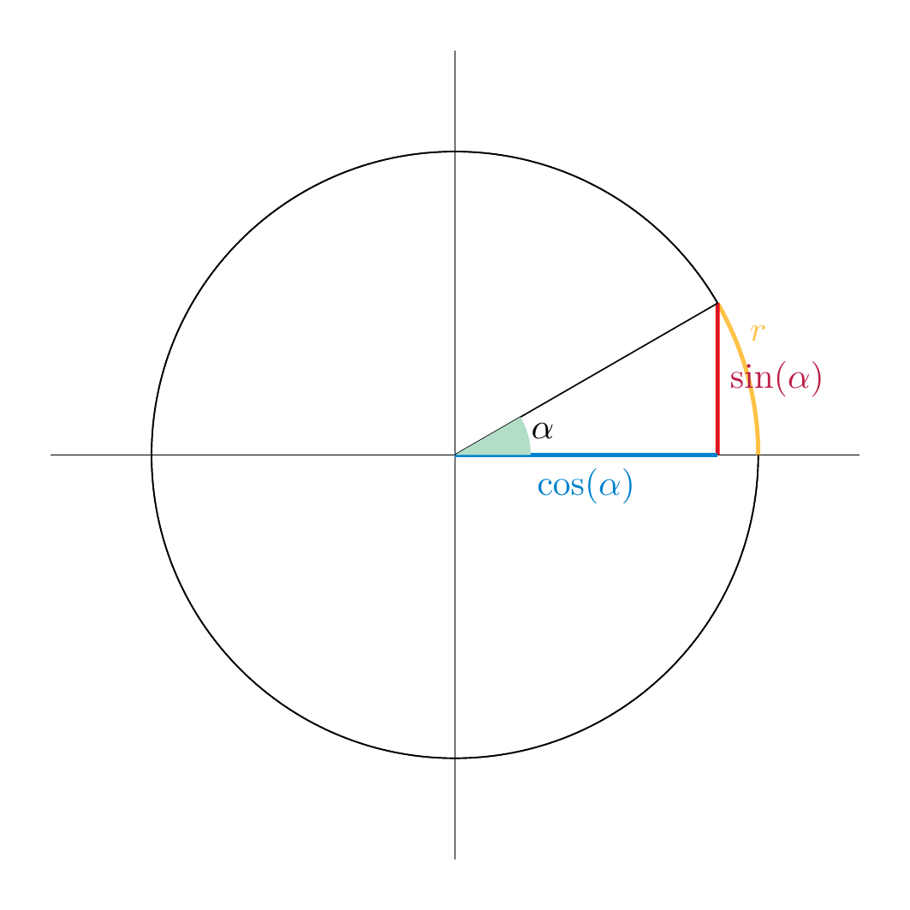
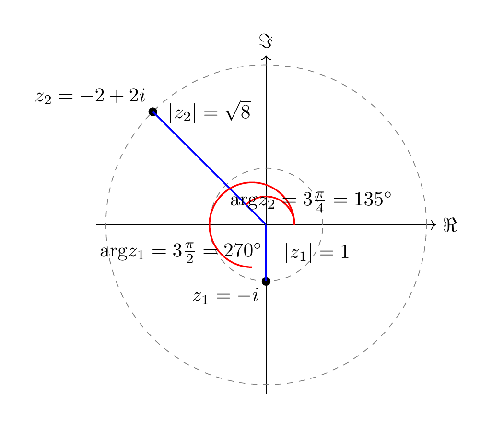
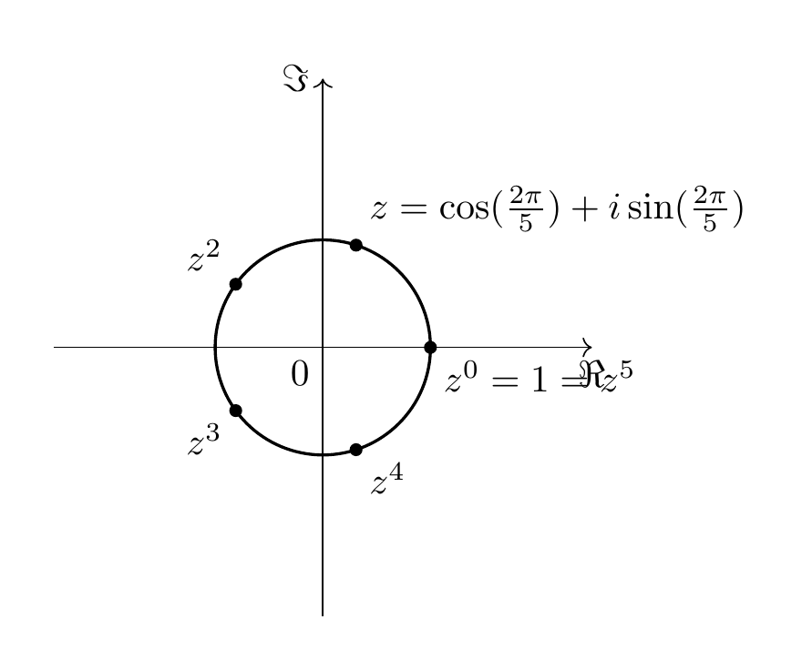

# The Complex Numbers

In this brief chapter, we survey some fundamental properties of the complex numbers, namely the basic arithmetic of complex numbers, the fundamental theorem of algebra and the complex exponential function.

## Basic Properties

<strong>Definition 1.1</strong>

 The *complex numbers* ${{\bf C}}$ are the set

\[
{{\bf C}} = \{(a,b), \text{ with } a, b \in {\bf R}\}.
\]

Addition and multiplication of complex numbers are defined by

\[
\begin{align*}
(a_1, b_1) + (a_2, b_2) & := (a_1+a_2, b_1+b_2) \\
(a_1, b_1) \cdot (a_2, b_2) & := (a_1a_2 - b_1 b_2, a_1 b_2 + a_2 b_1)
\end{align*}
\]

We usually write such a pair as

\[
a+ib := (a,b).
\]

This way of writing a complex number is also referred to as the *algebraic form*. In this notation, we obtain

\[
(a_1 + ib_1)(a_2+ib_2) = (a_1a_2 - b_1 b_2) + i(a_1 b_2+a_2b_1).
\]

In particular, the fundamental equation holds:

\[
i^2 (:=i i) = -1.
\]

We consider the real numbers ${\bf R}$ as the subset $\{(a,0), a \in {\bf R}\} = \{a+i0 \} \subset {{\bf C}}$. The *real part* and *imaginary part* are defined as

\[
\Re(a+ib) := a, \Im(a+ib) := b.
\]

Another customary notation is to write $z$ for complex numbers, i.e., $z = a + ib$.

The sum of complex numbers just amounts to adding the real part and the imaginary parts separately.

Sometimes, we refer to the set of complex numbers also as the complex plane, given that we can switch back and forth between writing $z = a+ib$ and $z=(a,b)$, i.e., a point on the plane specified by its two coordinates.

Regarding the geometric properties of ${{\bf C}}$, we use the following standard terms:

<strong>Definition 1.2</strong>

 The *complex conjugation* is the mapping

\[
\overline ? : {{\bf C}} \to {{\bf C}}, z = a+ib \mapsto \overline z := a-ib.
\]

The *absolute value* is the mapping

\[
| ? | : {{\bf C}} \to {\bf R}^{\ge 0}, z = a + ib \mapsto |z| := \sqrt{z \overline z} = \sqrt{a^2 + b^2}.
\]

Geometrically, the operation of taking the complex conjugation amounts to reflecting the points in the complex plane along the $x$-axis (also known as real axis). By the Pythagorean theorem, if we depict $z$ as a point in the plane with the coordinates $(a,b)$, then $|z|$ is the distance of that point to the origin. We note that $|z| = 0$ holds exactly if $z = 0$. If $z = a (=a+0b)$ happens to be a real number, then $|z| = |a|$ is the usual absolute value of a real number: $|a| = a$ if $a \ge 0$ and $|a|=-a$ if $a < 0$.

<strong>Lemma 1.3</strong>

 If $z \ne 0$ is a non-zero complex number, i.e., $z = a+ib$ with $a$ or $b$ (or both) being nonzero, then

\[
z^{-1} = \frac 1 z
\]

exists (as a complex number). It can be computed as

\[
z^{-1} = \frac{\overline z}{z \cdot \overline z}.
\]

<strong>Example 1.4</strong>

 If $z = 2+3i$, we compute $\overline z = 2-3i$, and $z \overline z = 2^2 + 3^2 = 13$. Thus $z^{-1} = (2-3i)/13 = \frac 2{13}-\frac 3{13}i$.

*Proof.* Indeed, if we multiply the above expression with $z$, we get

\[
z z^{-1} = z \frac{\overline z}{z \cdot \overline z} = 1.
\]

 ◻

Note how this formula is an actual simplification, since $z \cdot \overline z$ is a real (as opposed to complex) number, so dividing by it is easily done. It is also possible to state the above formula without referring to the complex conjugate, but the formula becomes less transparent:

\[
z^{-1} = \frac a{a^2+b^2}-\frac b{a^2+b^2}i.
\]

Given that we can form the reciprocal of any nonzero complex number, we can also divide any complex number $w \in {{\bf C}}$ like so:

\[
\frac w z = \frac{w \overline z}{z \overline z} = \frac{w \overline z}{|z|^2}.
\]

### Trigonometric form

The multiplication of complex numbers reveals its essence best by writing complex numbers in a different form, known as the trigonometric form.

For any two complex numbers $z_1 = a_1 + b_1 i, z_2 = a_2 + b_2 i \in {{\bf C}}$, one has

\[
\begin{align*}
|z_1 z_2|& = |a_1 a_2 - b_1 b_2 + (a_1b_2+a_2b_1)i| \\
& = \sqrt{(a_1 a_2 - b_1 b_2)^2 +(a_1b_2+a_2b_1)^2} \\
& = \sqrt{(a_1 a_2)^2 -2a_1a_2b_1b_2 + (b_1 b_2)^2 +(a_1b_2)^2+2a_1b_2a_2b_1 + (a_2b_1)^2} \\
& = \sqrt{(a_1^2 +b_1^2)(a_2^2 +b_2^2)} \\
& = |z_1||z_2|.
\end{align*}
\]

In particular, if $z \ne 0$, we have that $\frac z{|z|}$ is a complex number with absolute value 1. I.e., its distance to the origin is 1. Yet in other words, the complex number $\frac z{|z|}$ lies on the circle (around the origin) with radius 1, which is also known as the *unit circle*.

The angle $\alpha$ between the positive $x$-axis and the line segment joining the origin and the point $\frac z{|z|}$ is called the *argument* of $z$. It is denoted by ${\mathrm {arg}} z$, and is commonly measured in radian (not in degree).

It is therefore possible to write

\[
z = |z| \cdot (\cos \alpha + i \sin \alpha)
\]

<strong>(1.5)</strong>

 (or $z = |z| \cdot (\cos ({\mathrm {arg}} z) + i \sin ({\mathrm {arg}} z))$). Note that $|z|$ is a real number, $|z| \ge 0$. Also the argument $\alpha$ is a real number. It is common to require $\alpha$ to satisfy

\[
-\pi < \alpha \le \pi.
\]

This choice of the argument is called the *principal argument*. If we impose this requirement, there is a *unique* value of $\alpha$ such that <a href="#eq-z-trig-form" data-reference-type="eqref" data-reference="eq:z-trig-form">Equation (1.5)</a> holds. However, it may be possible to express $z$ in a similar form, but for a different value of the argument: indeed, adding (or subtracting $2 \pi$) to $\alpha$ amounts geometrically to rotating by $2 \pi = 360^\circ$ counter-clockwise (or, for subtracting, by $2 \pi$ but clockwise), which does not affect the resulting point.

More precisely, we have the following fact: an equation

\[
r \cdot (\cos \alpha + i \sin \alpha) = s \cdot (\cos \beta + i \sin \beta)
\]

holds exactly if

1.  $r = s$ and

2.  $\alpha - \beta$ is an integer multiple of $2 \pi$. We also say that $\alpha$ and $\beta$ are *equal modulo $2 \pi$* to express this, and write

\[
    \alpha \equiv \beta \mod 2 \pi.
\]

<strong>(1.6)</strong>

This ambiguity of the argument has to taken into account when solving equations involving complex numbers in trigonometric form. See <a href="#ex-complex-2" data-reference-type="ref+Label" data-reference="ex:complex-2">Exercise 1.5</a> and its solution for a worked example.

<strong>Example 1.7</strong>

- $z = 1 = 1+0i$ has absolute value $|z|=1$ and its argument is ${\mathrm {arg}} z = 0$.

- $z = -i$ has absolute value $|-i|=1$ and its argument is $3 \frac \pi 2$ (which amounts to $270^\circ$).

- $z=-2+2i$ has absolute value $|z|=\sqrt{8}=2 \sqrt 2$. Its (principal) argument is ${\mathrm {arg}} z = 3 \frac \pi 4$.

<strong>Lemma 1.8</strong>

 If $z_1, z_2 \in {{\bf C}}$ are given in trigonometric form, i.e.,

\[
z_1 = |z_1| (\cos ({\mathrm {arg}} z_1) + i \sin ({\mathrm {arg}} z_1))
\]

and likewise for $z_2$, the product $z_1 z_2$ is given by *multiplying* the absolute values, and *adding* the arguments. That is:

\[
z_1 z_2 = |z_1||z_2| \left ( \cos \left ({\mathrm {arg}} z_1 + {\mathrm {arg}} z_2 \right ) + i \sin \left ({\mathrm {arg}} z_1 + {\mathrm {arg}} z_2 \right ) \right ).
\]

*Proof.* We have already noted that $|z_1z_2|=|z_1||z_2|$. Concerning the arguments, let us write $\alpha_1 = {\mathrm {arg}} z_1$ and likewise $\alpha_2$. Then

\[
\begin{align*}
(\cos \alpha_1 + i \sin \alpha_1)(\cos \alpha_2 + i \sin \alpha_2) & = \cos \alpha_1 \cos \alpha_2 - \sin \alpha_1 \sin \alpha_2 + i \left (\sin \alpha_1 \cos \alpha_2 + \cos \alpha_1 \sin \alpha_2 \right) \\
& = \cos(\alpha_1 + \alpha_2) + i \sin(\alpha_1 + \alpha_2).
\end{align*}
\]

Here, the first equality is the definition of the multiplication of complex numbers, and the second equality holds by the *angle sum identities*. ◻

The following illustration is from Wikimedia[^1]

## The Fundamental Theorem of Algebra

We have noted above that we can perform addition, subtraction, multiplication and division for complex numbers (division by a non-zero number). These continue to satisfy the same rules that we are familiar with from the real numbers. That is, for any three complex numbers $v, w, z$ we have the following identities:

- $1\cdot z = z$, $0 + z = z$,

- $z(wv) = (zw)v$, $z+(w+v) = (z+w)+v$ (*associativity* of multiplication and of addition),

- $zw = wz$, $z+w = w+z$ (so-called *commutativity* of multiplication and of addition),

- $z(v+w) = zv+zw$ (*distributivity law*).

Each of these identities is checked by unraveling the definitions.

In the parlance of abstract algebra, one says that the complex numbers form a *field*, exactly as the real or the rational numbers do.

Why do we care (in linear algebra) about the complex numbers? The study of eigenvalues, a cornerstone of linear algebra and its applications throughout all sciences, is concerned with finding a zero of a given polynomial. We will apply the following theorem in <a href="../eigenvalues/#cor-cx-matrix-eigenvalues" data-reference-type="ref+Label" data-reference="cor:cx-matrix-eigenvalues">Corollary 6.10</a>.

<strong>Theorem 1.9</strong>

(*Fundamental theorem of algebra*)  Consider an equation of the form

\[
a_n z^n + a_{n-1} z^{n-1} + \dots + a_0 = 0,
\]

where $a_n, \dots, a_0$ are complex numbers. We assume that $a_n \ne 0$ and $n > 0$ (i.e., that the equation is not just of the form $a_0 = 0$). Then this equation has a complex solution, i.e., there is a complex number $z$ satisfying the above equation.

This is in marked contrast to the real numbers. For example,

\[
t^2 + 1 = 0
\]

has no real solution since $t^2+1$ is positive for all real numbers $t$. If we consider roots within the complex numbers, however, the situation changes: this polynomial has exactly two complex roots, namely $i$ and $-i$, since

\[
i^2 = i \cdot i = -1, \text{ and } (-i)^2 = (-i)(-i) = -1.
\]

The Fundamental Theorem of Algebra states a much stronger result: not only this polynomial, but every non-constant real polynomial equation, and more generally, every non-constant complex polynomial equation, has a complex solution.

This theorem is famous for a large number of independent proofs:

- There are short proofs only using basic calculus (such as the intermediate value theorem). For example .

- There is a beautiful proof whose essence can be understood purely graphically, as is explained for example in this video <https://www.youtube.com/watch?v=RBRVL6nP2Dk>. (However, to turn that geometric idea into a rigorous proof does require developing more theory.)

<strong>Example 1.10</strong>

 Let us consider as a special case the equation

\[
z^n - 1 = 0.
\]

I.e., $z^n = 1$. We are going to solve this equation using the trigonometric form. If $z = r (\cos \alpha + i \sin \alpha)$ we have

\[
z^n = r^n (\cos (n \alpha) + i \sin (n \alpha)).
\]

This will be equal to $1 = 1 \cdot (\cos 0 + i \sin 0)$ exactly if $r^n = 1$ and if $n \alpha - 0 = n \alpha$ is an integer multiple of $2 \pi$, say $n \alpha = 2 k \pi$, for an integer $k \in {{\bf Z}}$. Thus, $\alpha = \frac{2 k \pi} n$.

This is an illustration of the case $n = 5$, in which case there are 5 solutions. (Indeed, $\cos (\frac65 \cdot 2\pi) + \sin (\frac 65 \cdot 2 \pi) = \cos (\frac15 \cdot 2\pi) + \sin (\frac 15 \cdot 2 \pi)$ since winding around by $\frac 65 \cdot 2\pi = 432^\circ$ is the same as winding around by $\frac 15 \cdot 2 \pi = 72^\circ$.)

Slightly more generally, equations of the form

\[
z^n = w
\]

(for a natural number $n \ge 1$ and a fixed complex number $w$) can be conveniently solved as follows. Write $w = r (\cos \alpha + i \sin \alpha)$ in trigonometric form. Then there are $n$ solutions (distinct, unless $w = 0$) of the above equation, namely

\[
z = \sqrt[n]r (\cos (\frac{\alpha + 2k\pi}n) + i \sin \sin (\frac{\alpha + 2k\pi}n)),
\]

where $k \in \{0, 1, \dots, n-1\}$. This formula is known as *de Moivre’s formula*. See <a href="#ex-complex-3" data-reference-type="ref+Label" data-reference="ex:complex-3">Exercise 1.6</a> for a concrete example.

## The complex exponential function

In elementary real analysis, one defines the (real) exponential, sine and cosine function

\[
\exp : {\bf R} \to {\bf R}
\]

by means of the following Taylor series:

\[
\begin{align*}
\exp(x) & := \sum_{n=0}^\infty \frac{x^n}{n!} = 1 + x + \frac{x^2}2 + \frac{x^3}6 + \frac{x^4}{24} + \dots, \\
\sin(x) & := \sum_{n=0}^\infty \frac{(-1)^n x^{2n+1}}{(2n+1)!} = x - \frac{x^3}6 + \frac{x^5}{120} \mp \dots, \\
\cos(x) & := \sum_{n=0}^\infty \frac{(-1)^n x^{2n}}{(2n)!} = 1 - \frac{x^2}2 + \frac{x^4}{24} \mp \dots.
\end{align*}
\]

One proves there that these three series converge for all real numbers $x \in {\bf R}$, and that they define differentiable functions

\[
\exp, \sin, \cos: {\bf R} \to {\bf R}.
\]

Moreover, there is the fundamental differential equation

\[
\exp' = \exp,
\]

<strong>(1.11)</strong>

 i.e., the derivative of the exponential function *equals* the exponential function. In addition to this fundamental property, one has the facts that

\[
\exp(0)  = 1
\]

<strong>(1.12)</strong>

\[
\exp(x + y) = \exp x \cdot \exp y.
\]

<strong>(1.13)</strong>

In this section, we briefly deal the corresponding situation in the complex case, which turns out to be very similar and, in a sense, even better.

<strong>Definition and Lemma 1.14</strong>

 Let $z$ be any *complex* number. Then the exact same series as above,

\[
\sum_{n=0}^\infty \frac{z^n}{n!} = 1 + z + \frac{z^2}2 + \frac{z^3}6 + \frac{z^4}{24} + \dots,
\]

\[
\sum_{n=0}^\infty \frac{(-1)^n}{(2n+1)!}x^{2n+1} = x - \frac{x^3}6 + \frac{x^5}{120} \mp \dots,
\]

\[
\sum_{n=0}^\infty  \frac{(-1)^n}{(2n)!}x^{2n} = 1 - \frac{x^2}2 + \frac{x^4}{24} \mp \dots
\]

converge, i.e., they are a well-defined complex number. We denote them by $\exp(z)$, $\sin(z)$ and $\cos(z)$, respectively. (Some authors also write $e^z$ for $\exp (z)$).

In addition, the formula <a href="#eq-exp-group" data-reference-type="eqref" data-reference="eq:exp-group">Equation (1.13)</a> continues to hold for any two *complex numbers*.

*Proof.* The proof of the convergence is almost identical to the case of the real exponential, sine and cosine function. Very briefly, the point is that the denominators $n!$ etc. grow fast enough to ensure that the series converge. ◻

<strong>Remark 1.15</strong>

 The differential equation <a href="#eq-exp-diff" data-reference-type="eqref" data-reference="eq:exp-diff">Equation (1.11)</a> also continues to hold, but we refrain from stating it here in order to avoid a digression about the notion of complex differentiation.

Let us inspect <a href="#eq-exp-group" data-reference-type="eqref" data-reference="eq:exp-group">Equation (1.13)</a> in the special case $z = a+ib$. Then

\[
\exp z = \exp (a+ib) \stackrel{\text{\eqref{eq:exp-group}}} = \exp a \cdot \exp (ib).
\]

By its very definition, the first factor $\exp a$ is just the (usual) real exponential function, so the interesting part is to understand $\exp (ib)$.

<strong>Theorem 1.16</strong>

 For any complex number $z = ib$ we have the fundamental identity

\[
\exp (ib) = \cos b + i \sin b.
\]

In particular, for $b = \pi$, we have

\[
\exp (i\pi) = \cos \pi = -1.
\]

Equivalently, we have *Euler’s identity*

\[
\exp (i\pi) + 1 = 0.
\]

*Proof.* Inserting $z = ib$ into the definition of $\exp(z)$ gives

\[
\exp ib = \sum_{n=0}^\infty \frac{(ib)^n}{n!} = 1 + ib + \frac{(ib)^2}2 + \frac{(ib)^3}6 + \frac{(ib)^4}{24} + \dots
\]

We have $(ib)^n= i^n b^n$. We note that $i^n$ only depends on the residue of $n$ after dividing by 4, since $i=i^5=i^9$ etc. Indeed, $i^4 = i \cdot i \dot i \cdot i = (-1)(-1) = 1$. We group the terms in the above series according to even and odd $n$ (and basic calculus ensures that this is a legitimate process in this situation):

\[
\begin{align*}
\exp (ib) & = \sum_{n=0}^\infty \frac{(ib)^n}{n!} \\
& = \left (1 + \frac{(ib)^2}2 +  \frac{(ib)^4}{24} + \dots \right ) + \left ( (ib) + \frac{(ib)^3}6 + \frac{(ib)^5}{120} + \dots \right ) \\
& = \left (1 - \frac{b^2}2 +  \frac{b^4}{24} \mp \right ) + i \left ( b - \frac{b^3}6 + \frac{b^5}{120} \mp \dots \right ) \\
& = \cos b + i \sin b.
\end{align*}
\]

 ◻

## Exercises

Compute the following complex numbers in the form $z = a+ib$:

- $(1-i)(2+i)$

- $(1+i)^3 (:=(1+i)(1+i)(1+i))$

- $i^{89}$

- $e^{-i\pi}$

- $3 (\cos (\pi / 2) + i \sin (\pi / 2))$

- $\frac{\sqrt 3 + \sqrt 2 i}{\sqrt 2 - \sqrt 3 i}$

Depict these complex numbers on the complex plane.

Prove that a complex number $z$ is a real number exactly if $z = \overline z$.

Compute the trigonometric form of the following complex numbers:

- $\sqrt 3-i$.

- $(1-i)^5$

- $\frac{1+i}{(1-i)(\sqrt 3+i)}$

- $i^n$, where $n$ is a natural number.

<strong>Exercise 1.4</strong>

 (See <a href="#sol-ex-complex-1" data-reference-type="ref+Label" data-reference="sol--ex:complex-1">Solution 1.5.1</a>.) Compute the algebraic and the trigonometric form of $z = \left ( \frac{i-1}{i+1}\right )^3$.

<strong>Exercise 1.5</strong>

 (See <a href="#sol-ex-complex-2" data-reference-type="ref+Label" data-reference="sol--ex:complex-2">Solution 1.5.2</a>.) Find all complex numbers $z$ satisfying the equation

\[
z = 3i |z|\overline z.
\]

<strong>Exercise 1.6</strong>

 (See <a href="#sol-ex-complex-3" data-reference-type="ref+Label" data-reference="sol--ex:complex-3">Solution 1.5.3</a>.) Compute the solutions of the equation $(\overline z)^3 = 8i$ in algebraic and in trigonmetric form. Draw a picture of these solutions.

## Solutions to the exercises

<strong>Solution 1.5.1</strong>

 (See <a href="#ex-complex-1" data-reference-type="ref+Label" data-reference="ex:complex-1">Exercise 1.4</a>.) We have $\frac{i-1}{i+1} = \frac{(i-1)\overline{i+1}}{|i+1|^2} = \frac{(i-1)(1-i)}{2} = i$. Thus $z=i^3 = -i$ is the algebraic form. We have $|z|=1$ and ${\mathrm {arg}} z = \frac 32 \pi$, so

\[
z = \cos(\frac 32 \pi) + i \sin \frac 32 \pi.
\]

<strong>Solution 1.5.2</strong>

 (See <a href="#ex-complex-2" data-reference-type="ref+Label" data-reference="ex:complex-2">Exercise 1.5</a>.) In order to solve

\[
z = 3i |z|\overline z
\]

we would like to divide by $z$. This is only possible if $z \ne 0$, so we first consider the case $z = 0$. In this case both sides of the equation are equal to 0, so $z=0$ is indeed a solution. Now, we consider $z \ne 0$ and divide the above equation by $z$ and obtain

\[
1 = 3i |z| \frac{\overline z}z.
\]

There are different ways to solve this equation. One may put $z = a+ib$ and solve the resulting quadratic equation. For illustrational purposes, we rather consider the trigonometric form $z = r (\cos \alpha + i \sin \alpha)$. Then $\overline z = r (\cos \alpha - i \sin \alpha) = r (\cos (-\alpha) + i \sin (-\alpha))$, and

\[
|z| \frac{\overline z}z = r \frac{r (\cos (-\alpha) + i \sin (-\alpha))}{r (\cos (\alpha) + i \sin (\alpha))}.
\]

Note that $r = |z| \ne 0$, so we can cancel this in the right-hand fraction. We have

\[
\frac{\cos (-\alpha) + i \sin (-\alpha)}{\cos (\alpha) + i \sin (\alpha)} = \cos(-2\alpha) + i \sin(-2\alpha).
\]

We then obtain

\[
\frac 1{3i} = -\frac 13 i = |z| \frac{\overline z}z = r (\cos(-2\alpha) + i \sin(-2\alpha)).
\]

This implies $r = \frac 13$. Concerning the arguments, we have to be more careful: the above equation is equivalent to saying that

\[
-2 \alpha \equiv \frac 32 \pi \mod 2 \pi
\]

cf. around <a href="#eq-mod-2pi" data-reference-type="eqref" data-reference="eq:mod-2pi">Equation (1.6)</a>. There are two solutions: $-2 \alpha = \frac 32 \pi$ or $- 2\alpha = \frac 32 \pi + 2 \pi$. The former yields $\alpha = -\frac 34 \pi$, the latter $\alpha = \frac \pi 4$. (Of course, we can now add integer multiples of $2\pi$ to these values of $\alpha$, so $\alpha = \frac 54 \pi$ is another solution. However, this gives the same value for $z$.) The resulting solutions are

\[
z = \frac 1 3 (\cos(-\frac 34 \pi) + i \sin (-\frac 34 \pi))
\]

and

\[
z = \frac 1 3 (\cos(\frac 14 \pi) + i \sin (\frac 14 \pi)).
\]

To sum up, the above equation has three solutions, $z = 0$ and these two solutions.

<strong>Solution 1.5.3</strong>

 (See <a href="#ex-complex-3" data-reference-type="ref+Label" data-reference="ex:complex-3">Exercise 1.6</a>.) There are three solutions, namely

\[
z_0 = \sqrt 3 - i = 2 (\cos (-\pi/6) + i \sin(-\pi/6)),
\]

\[
z_1 = -\sqrt 3 - i = 2 (\cos (-5\pi/6) + i \sin(-5\pi/6)),
\]

\[
z_2 = 2i = 2 (\cos (-3\pi/2) + i \sin(-3\pi/2)).
\]

Here is a picture:

[^1]: By IkamusumeFan - Own work, CC BY-SA 4.0, <https://commons.wikimedia.org/w/index.php?curid=42024950>.
