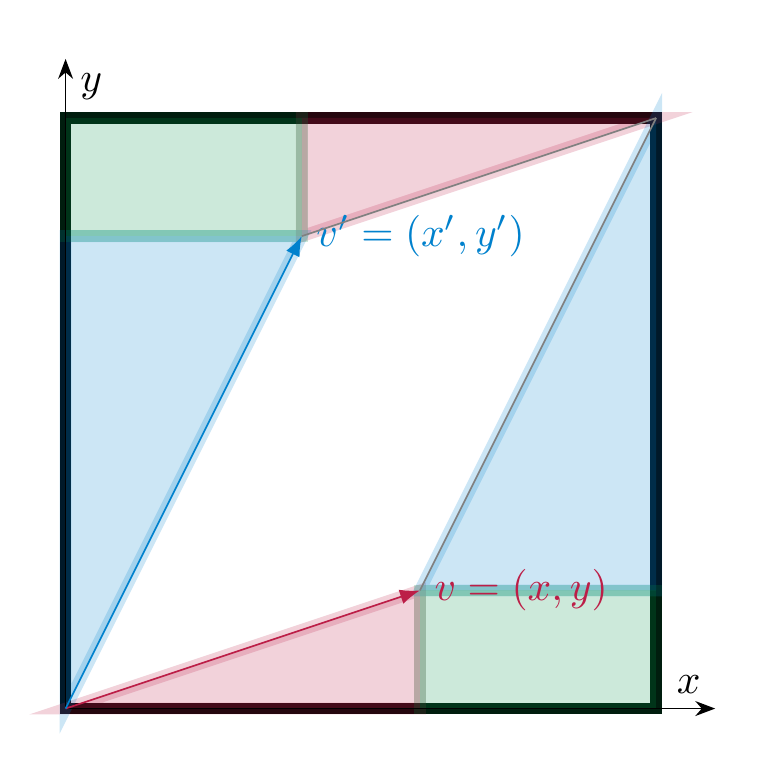

# Determinants

## Determinants of $2 \times 2$-matrices

We begin with the definition of determinants of $2 \times 2$-matrices.

<strong>Definition 5.1</strong> (Related exercises: <a href="../exercises-determinants/#ex-determinants-exercise-003">Exercise 5.3</a>)

 Let

\[
A  = \left ( \begin{array}{cc} a & b \\ c & d \end{array} \right )
\]

be a $2 \times 2$-matrix. The *determinant* of $A$ is defined as

\[
\det A := ad - bc.
\]

<strong>Example 5.2</strong>

- $\det \left ( \begin{array}{cc} 4 & 7 \\ 2 & -1 \end{array} \right ) = 4 \cdot (-1) - 7 \cdot 2 = -18$.

- $\det \left ( \begin{array}{cc} 1 & r \\ 0 & 1 \end{array} \right ) = 1 \cdot 1 - r \cdot 0 = 1$. In particular, $\det {\mathrm {id}}_2 = 1$.

- Consider a matrix $A = \left ( \begin{array}{cc} a & b \\ ra & rb \end{array} \right )$ whose second column is a multiple of the first (so that the columns are linearly dependent). Then

\[
  \det \left ( \begin{array}{cc} a & b \\ ra & rb \end{array} \right ) = a rb - bra = 0.
\]

  According to <a href="../maps-transpose/#cor-rows-columns-independent" data-reference-type="ref+Label" data-reference="cor:rows-columns-independent">Corollary 4.94</a>, $A$ is *not* invertible. This is an example of the fact alluded to above (cf. <a href="../determinants-invertibility-and-determinants/#thm-det-zero-niff-invertible" data-reference-type="ref+Label" data-reference="thm:det-zero-niff-invertible">Theorem 5.15</a>).

Determinants carry the following geometric meaning. Recall that the *absolute value* of a real number $r$ is defined as

\[
|r| := \left \{ \begin{array}{ll} r & r \ge 0 \\ -r & r < 0. \end{array} \right .
\]

For example, $|4| = 4$ and $|-5| = 5$.

<strong>Lemma 5.3</strong>

 Let

\[
A = (v \ v') = \left ( \begin{array}{cc} x & x' \\ y & y' \end{array} \right )
\]

be a $2 \times 2$-matrix, where $v$ and $v' \in {\bf R}^2$ are the two columns of $A$. Then

\[
| \det (A) | = \text{area}(v_1, v_2),
\]

where the right hand side denotes the area of the parallelogram spanned by the two vectors $v_1, v_2$.

*Proof.* We illustrate this geometrically in the case where all entries of $A$ are positive and the vectors $v$ and $v'$ lie as depicted, i.e., the angle from $v$ to $v'$ goes, informally speaking, counterclockwise. The area of the black rectangle is $(x+x')(y+y')$. The area of the two triangles whose long side is $v$ (resp. parallel to it), is $\frac{xy}2$, so the area of these two triangles together is $xy$. Likewise the total area of the triangles (parallel to) $v'$ is $x'y'$. Finally, the area of the rectangle at the bottom right, resp. top left corner of the large rectangle is $x'y$. Therefore, the area of the parallelogram is

\[
\begin{align*}
(x+x')(y+y') - xy - x'y' - 2x'y & = xy+x'y+xy'+x'y'-xy-x'y'-2x'y \\ & = xy' - x'y \\ &= \det A.
\end{align*}
\]

 ◻

<a href="#lem-abs-val-det" data-reference-type="ref+Label" data-reference="lem:abs-val-det">Lemma 5.3</a> does not give any information about the sign of the determinant. Regarding that, we observe the following:

<strong>Lemma 5.4</strong>

 Let $A = \left ( \begin{array}{cc} x_1 & x_2 \\ y_1 & y_2 \end{array} \right )$ and let

\[
\begin{align*}
A' & := \left ( \begin{array}{cc} x_2 & x_1 \\ y_2 & y_1 \end{array} \right )\\
A'' &:= \left ( \begin{array}{cc} y_1 & y_2 \\ x_1 & x_2 \end{array} \right )
\end{align*}
\]

be the matrices obtained from $A$ by swapping the two columns, resp. the two rows. Then

\[
\det A'' = \det A' = - \det A.
\]

In other words, swapping two rows or two columns will change the sign of the determinant.

*Proof.* This is directly clear from the definition. For example,

\[
\det A' = x_2 y_1 - y_2 x_1 = -(x_1 y_2 - x_2 y_1) = - \det A.
\]

 ◻

Thus, the determinant (as opposed to only its absolute value) records the area of the parallelogram spanned by the vectors and also the orientation.

<iframe src="../visualizations/determinant-2d.html" style="width:100%;height:520px;border:none;border-radius:6px;" loading="lazy"></iframe>

