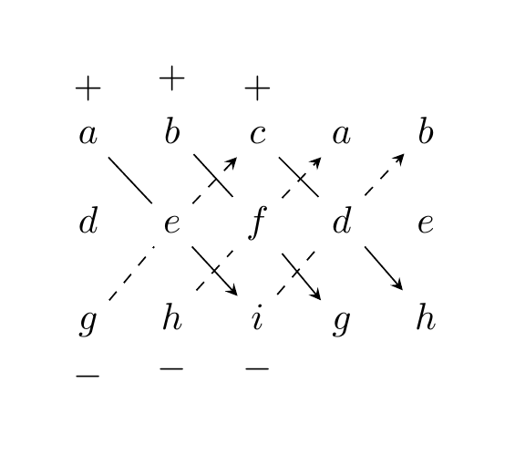

# Determinants of larger matrices

There are various (equivalent) approaches to defining determinants of larger matrices. The following one is satisfactory from both a conceptual and a practical standpoint.

<strong>Theorem 5.5</strong> (Related exercises: <a href="../exercises-determinants/#ex-determinants-exercise-002">Exercise 5.2</a>, <a href="../exercises-determinants/#ex-determinants-exercise-004">Exercise 5.4</a>)

 There is a *unique* function, called the *determinant*,

\[
\det : {\mathrm {Mat}}_{n \times n} \to {\bf R}
\]

with the following properties (throughout $A \in {\mathrm {Mat}}_{n \times n})$:

1.  $\det ({\mathrm {id}}_n) = 1$,

2.  If $A'$ results from $A$ by interchanging two rows, then

\[
    \det(A') = -\det(A).
\]

<strong>(5.6)</strong>

3.  Let us write a matrix as $\left ( \begin{array}{c} v_1 \\ \vdots \\ v_n \end{array} \right )$, i.e., $v_i \in {\bf R}^n$ is the $i$-th row of the matrix. Then for any $w \in {\bf R}^n$ and any $r \in {\bf R}$:

\[
    \det (\left ( \begin{array}{c} v_1 \\ \vdots \\ r v_i + w \\ \vdots \\ v_n \end{array} \right )) = 
        r \det (\left ( \begin{array}{c} v_1 \\ \vdots \\ v_i \\ \vdots \\ v_n \end{array} \right )) + 
        \det (\left ( \begin{array}{c} v_1 \\ \vdots \\ w \\ \vdots \\ v_n \end{array} \right )).
\]

<strong>Remark 5.7</strong> (Related exercises: <a href="../exercises-determinants/#ex-determinants-4-2">Exercise 5.6</a>)

 The above operations are somewhat like elementary operations (<a href="../systems-gaussian-elimination/#def-elementary-row-operations" data-reference-type="ref+Label" data-reference="def:elementary-row-operations">Definition 2.28</a>): if we take $w = 0$ above, then the formula says that multiplying any one row by $r$ (which may be zero, unlike in <a href="../systems-gaussian-elimination/#def-elementary-row-operations" data-reference-type="ref+Label" data-reference="def:elementary-row-operations">Definition 2.28</a>), then the determinant also gets multiplied by $r$. In particular, if $A$ has a zero row, then

\[
\det A = 0.
\]

<strong>(5.8)</strong>

<strong>Remark 5.9</strong> (Related exercises: <a href="../exercises-determinants/#ex-determinants-4-2">Exercise 5.6</a>)

 We also have

\[
\det A = 0
\]

whenever two rows of $A$ are equal: indeed, the matrix $A'$ obtained by interchanging these rows is equal to $A$, i.e., $A' = A$, so that $\det A = \det A'$. However, according to , we also have $\det A' = - \det A$. Taking this together, we have

\[
\det A = - \det A
\]

and this is only possible if $\det A = 0$.

<strong>Remark 5.10</strong>

 The preceding remark also implies that for $i \ne j$ and $r \in {\bf R}$

\[
\begin{align*}
\det \left ( \begin{array}{c} v_1 \\ \vdots \\ v_i + r v_j \\ \vdots \\ v_n \end{array} \right ) & =  
\det \left ( \begin{array}{c} v_1 \\ \vdots \\ v_i \\ \vdots \\ v_n \end{array} \right ) +
r \det \left ( \begin{array}{c} v_1 \\ \vdots \\ v_j \\ \vdots \\ v_n \end{array} \right ) & \text{where $v_j$ is in the $i$-th row!} \\
& = \det \left ( \begin{array}{c} v_1 \\ \vdots \\ v_i \\ \vdots \\ v_n \end{array} \right ) + r \left ( \begin{array}{c} \vdots \\ v_j \\ \vdots \\ v_j \\ \vdots \end{array} \right ) \\
& =  \det \left ( \begin{array}{c} v_1 \\ \vdots \\ v_i \\ \vdots \\ v_n \end{array} \right ) & \text{by the above remark.}
\end{align*}
\]

In other words, adding an arbitrary multiple of some row to another row does not affect the determinant.

In order to get a feeling for this theorem, let us apply it to a concrete matrix, say

\[
A = \left ( \begin{array}{ccc} -2 & 1 & 8 \\ 1 & 3 & 5 \\ 0 & 2 & 4 \end{array} \right ).
\]

Taking the theorem for granted, we will compute $\det A$ by stepwise applying the above rules and keeping track of how the determinant changes.

\[
\begin{align*}
\underbrace{\left ( \begin{array}{ccc} -2 & 1 & 8 \\ 1 & 3 & 5 \\ 0 & 2 & 4 \end{array} \right )}_{=A}
\leadsto & \underbrace{\left ( \begin{array}{ccc} 0 & 7 & 18 \\ 1 & 3 & 5 \\ 0 & 2 & 4 \end{array} \right )}_{=A_1} 
\leadsto \underbrace{\left ( \begin{array}{ccc} 0 & 1 & 6 \\ 1 & 3 & 5 \\ 0 & 2 & 4 \end{array} \right )}_{=A_2}
\leadsto \underbrace{\left ( \begin{array}{ccc} 0 & 1 & 6 \\ 1 & 3 & 5 \\ 0 & 0 & -8 \end{array} \right )}_{=A_3} \\
\leadsto & \underbrace{\left ( \begin{array}{ccc} 0 & 1 & 6 \\ 1 & 3 & 5 \\ 0 & 0 & 1 \end{array} \right )}_{=A_4}
\leadsto \underbrace{\left ( \begin{array}{ccc} 0 & 1 & 6 \\ 1 & 3 & 5 \\ 0 & 0 & 1 \end{array} \right )}_{=A_5}
\leadsto \underbrace{\left ( \begin{array}{ccc} 0 & 1 & 0 \\ 1 & 3 & 0 \\ 0 & 0 & 1 \end{array} \right )}_{=A_6} \\
\leadsto & \underbrace{\left ( \begin{array}{ccc} 0 & 1 & 0 \\ 1 & 0 & 0 \\ 0 & 0 & 1 \end{array} \right )}_{=A_7} 
\leadsto \underbrace{\left ( \begin{array}{ccc} 1 & 0 & 0 \\ 0 & 1 & 0 \\ 0 & 0 & 1 \end{array} \right )}_{=A_8 = {\mathrm {id}}_3}
\end{align*}
\]

From $A$ to $A_1$ to $A_2$ to $A_3$, we have added appropriate multiples of some row to another one, so that

\[
\det A = \det A_1 = \det A_2 = \det A_3.
\]

We obtain $A_4$ from $A_3$ by multiplying the last row with $- \frac 18$, so that $\det A_4 = -\frac 18 \det A_3$. From $A_4$ to $A_5$ to $A_6$ to $A_7$, we again added appropriate multiples to some other rows, so that

\[
\det A_4 = \det A_5 = \det A_6 = \det A_7.
\]

Finally, $A_8$ is obtained from $A_7$ by swapping the first two rows, so that

\[
1 = \det A_8 = - \det A_7.
\]

Taking this all together we see that

\[
\det A = \det A_3 = -8 \det A_4 = - 8 \det A_7 = + 8 \det A_8 = 8.
\]

This shows that the above abstract description of the determinant can be used to compute determinants in practice.

*Proof.* (of <a href="#thm-det-universal-property" data-reference-type="ref+Label" data-reference="thm:det-universal-property">Theorem 5.5</a>) We only sketch the proof idea: one basically proceeds, for a general square matrix, similarly to the computation above: one uses Gaussian elimination, i.e., elementary row operations to bring a given square matrix $A$ into reduced row-echelon form, say $A \leadsto A'$. The properties in <a href="#thm-det-universal-property" data-reference-type="ref+Label" data-reference="thm:det-universal-property">Theorem 5.5</a> then imply how to compute $\det A$ in terms of $\det A'$. If the resulting matrix $A'$ has a zero row, then $\det A' = 0$. If it has no zero row, then $A' = {\mathrm {id}}$, and $\det A' = 1$. ◻

## Small matrices

For practical purposes, it is useful to have an explicit formula at hand for small matrices:

For a $1 \times 1$-matrix $A$, i.e., $A = (a)$, we have

\[
\det A = a.
\]

The determinant of $2 \times 2$-matrices defined in <a href="../determinants-determinants-of-2-x-2-matrices/#def-det-2-x-2" data-reference-type="ref+Label" data-reference="def:det-2-x-2">Definition 5.1</a> satisfies the properties listed in <a href="#thm-det-universal-property" data-reference-type="ref+Label" data-reference="thm:det-universal-property">Theorem 5.5</a>.

- $\det {\mathrm {id}}_2 = \det \left ( \begin{array}{cc} 1 & 0 \\ 0 & 1 \end{array} \right ) = 1 \cdot 1 - 0 \cdot 0 = 1$.

- Swapping two rows yields a sign change in the determinant (<a href="../determinants-determinants-of-2-x-2-matrices/#lem-swap-2-x-2" data-reference-type="ref+Label" data-reference="lem:swap-2-x-2">Lemma 5.4</a>).

- 

\[
  \begin{align*}
  \det \left ( \begin{array}{cc} a & b \\ c + r e & d + rf \end{array} \right ) & = a(d+rf) - b(c+re) \\ & = ad-bc + r(af-be) \\ & = \det \left ( \begin{array}{cc} a & b \\ c & d \end{array} \right ) + r \det \left ( \begin{array}{cc} a & b \\ e & f \end{array} \right ).
  \end{align*}
\]

Thus, the definition of $\det$ for general matrices agrees with the one in <a href="../determinants-determinants-of-2-x-2-matrices/#def-det-2-x-2" data-reference-type="ref+Label" data-reference="def:det-2-x-2">Definition 5.1</a>.

<strong>Lemma 5.11</strong> (Related exercises: <a href="../exercises-determinants/#ex-determinants-exercise-001">Exercise 5.1</a>, <a href="../exercises-determinants/#ex-determinants-exercise-004">Exercise 5.4</a>, <a href="../exercises-determinants/#ex-determinants-exercise-005">Exercise 5.7</a>, <a href="../exercises-eigenvalues/#ex-eigenvalues-5-7">Exercise 6.14</a>, <a href="../exercises-eigenvalues/#ex-eigenvalues-5-9">Exercise 6.15</a>)

 For a $3 \times 3$-matrix one can show that the determinant is given by the so-called *Sarrus’ rule*:

\[
\det \left ( \begin{array}{ccc} a & b & c \\ d & e & f \\ g & h & i \end{array} \right ) = aei + bfg + cdh - ceg - bdi - afh.
\]

<strong>(5.12)</strong>

*Proof.* One can prove by direct computation, that the function defined in satisfies the conditions in <a href="#thm-det-universal-property" data-reference-type="ref+Label" data-reference="thm:det-universal-property">Theorem 5.5</a>. ◻

A way to remember this formula is to write

\[
\left ( \begin{array}{ccccc} a & b & c & a & b \\ d & e & f & d & e \\ g & h & i & g & h \end{array} \right )
\]

and take products of entries along the top-left-to-bottom-right diagonals with a positive sign, and the top-right-to-bottom-left diagonals with a negative sign:

Sarrus’ rule does not apply to larger matrices. Instead, for matrices of size $4 \times 4$, one can prove that $\det A$ is the sum of 24 expressions, each of which is a product of 4 entries of $A$. See <a href="../exercises-determinants/#ex-determinants-exercise-004" data-reference-type="ref+Label" data-reference="ex:determinants-exercise-004">Exercise 5.4</a> for a fully worked computation of a determinant of a $4 \times 4$-matrix using different methods.

