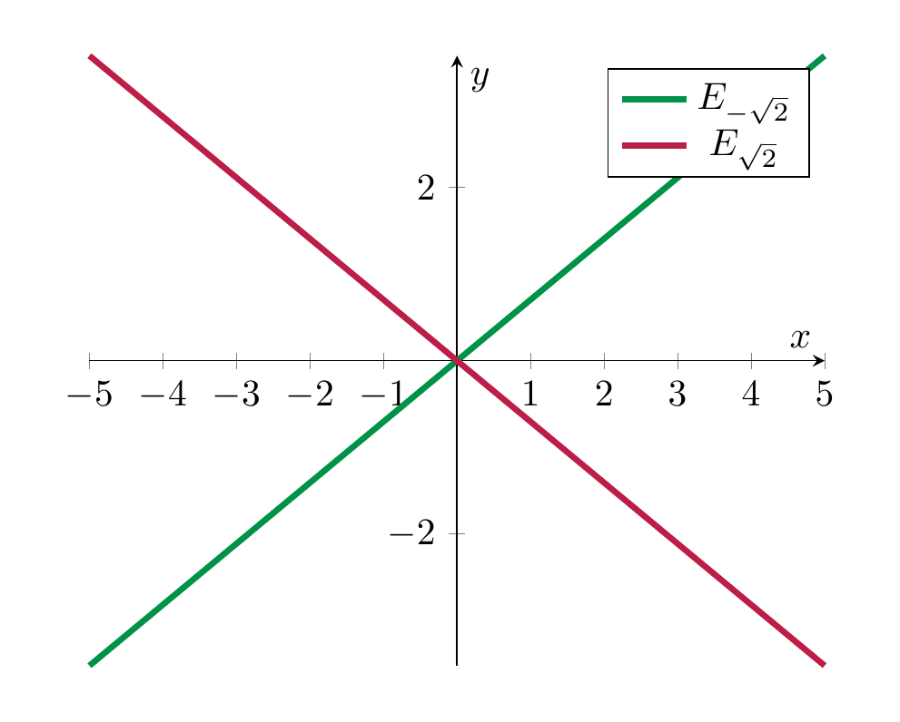

# Eigenspaces

In the above examples, the set of all eigenvectors for a given eigenvalue has a particularly nice shape. This is a general phenomenon:

<strong>Definition and Lemma 6.11</strong>

 Let $A \in {\mathrm {Mat}}_{n \times n}$ be a square matrix and $\lambda \in {\bf R}$ a fixed real number. The set

\[
E_\lambda := \{ v \in {\bf R}^n \ | \ A v = \lambda v \}
\]

is a subspace of ${\bf R}^n$. It is called the *eigenspace* of $A$ with respect to $\lambda$.

*Proof.* The equation $Av = \lambda v$ is equivalent to $(A - \lambda {\mathrm {id}})v = 0$, i.e., we have $E_\lambda = \ker (A - \lambda {\mathrm {id}})$. This is a subspace of ${\bf R}^n$ by <a href="../maps-kernel-and-image-1/#prop-ker-im-subspace" data-reference-type="ref+Label" data-reference="prop:ker-im-subspace">Proposition 4.23</a>. ◻

<strong>Remark 6.12</strong>

 If $\lambda$ above is *not* an eigenvalue, then $E_\lambda = \{ 0 \}$, i.e., the zero vector is the only one satisfying $Av = \lambda v$.

If $\lambda$ is an eigenvalue, then $E_\lambda$ consists of all the eigenvectors for the eigenvalue $\lambda$, together with the zero vector (which by definition is not an eigenvector).

<strong>Example 6.13</strong>

 We compute the eigenspaces of the matrix $A = \left ( \begin{array}{cc} 0 & -1 \\ -2 & 0 \end{array} \right )$. Its characteristic polynomial is

\[
\chi_A(t)=\det \left ( \begin{array}{cc} -\lambda & -1 \\ -2 & -\lambda \end{array} \right ) = \lambda^2 - 2.
\]

Its zeros, i.e., the eigenvalues of $A$ are $\lambda_{1/2} = \pm \sqrt 2$. The eigenspace for $\sqrt 2$ is the solution space of the homogeneous system

\[
\underbrace{\left ( \begin{array}{cc} -\sqrt 2 & -1 \\ -2 & -\sqrt 2 \end{array} \right )}_{= A - \sqrt 2 \cdot {\mathrm {id}} =: B} \left ( \begin{array}{c} x \\ y \end{array} \right ) = 0.
\]

We solve this by reducing the matrix $B$ to row-echelon form

\[
\left ( \begin{array}{cc} -\sqrt 2 & -1 \\ -2 & -\sqrt 2 \end{array} \right ) \leadsto \left ( \begin{array}{cc} 1 & \frac 1{\sqrt 2} \\ -2 & -\sqrt 2 \end{array} \right ) 
\leadsto \left ( \begin{array}{cc} 1 & \frac {\sqrt 2}2 \\ 0 & 0 \end{array} \right ).
\]

Thus, $y$ is a free variable and $x = - \frac{\sqrt 2}2 y$. Thus $E_{\sqrt 2}$ has dimension 1, a basis vector is $(-\frac{\sqrt 2}2, 1)$. Similarly, one computes the eigenspace for $\lambda = -\sqrt 2$:

\[
B = A + \sqrt 2 \cdot {\mathrm {id}} = \left ( \begin{array}{cc} \sqrt 2 & -1 \\ -2 & \sqrt 2 \end{array} \right ) \leadsto 
\left ( \begin{array}{cc} 1 & -\frac{1}{\sqrt 2} \\ -2 & \sqrt 2 \end{array} \right ) \leadsto
\left ( \begin{array}{cc} 1 & -\frac{\sqrt 2}{2} \\ 0 & 0 \end{array} \right ),
\]

so the eigenspace $E_{-\sqrt 2}$ is again one-dimensional, and a basis vector is $(\frac{\sqrt 2}2, 1)$. Here is a plot showing the two eigenspaces: the map $v \mapsto Av$ will stretch the vectors in $E_{\sqrt 2}$ by a factor of $\sqrt 2$, while those on the eigenspace $E_{-\sqrt 2}$ will be flipped and stretched by a factor of $\sqrt 2$:

