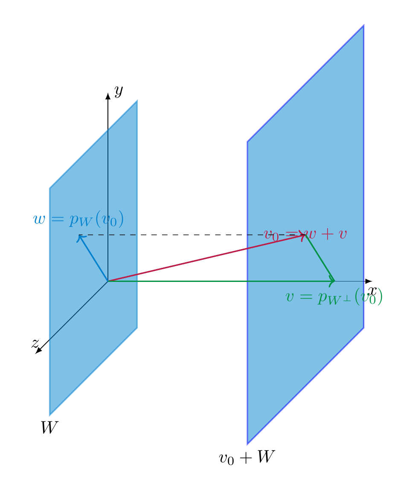

# Affine subspaces

<strong>Definition 7.40</strong>

 Let $V$ be a vector space. An *affine subspace* of $V$ is a subset of the form

\[
v_0 + W := \{v_0 + w \ | w \in W\}
\]

for an appropriate vector $v \in V$ and a sub*space* $W \subset V$.

In other words, an affine subspace is obtained by translating a subspace (i.e., a sub-vector space) by a certain vector. For example, any line or a plane in ${\bf R}^3$ that is not necessarily passing through the origin is an affine subspace. A key example of an affine subspace is the solution set of a (not necessarily homogeneous) linear system

\[
Ax = b.
\]

Indeed, by <a href="../maps-revisiting-linear-systems/#thm-solutions-inhomogeneous-system" data-reference-type="ref+Label" data-reference="thm:solutions-inhomogeneous-system">Theorem 4.37</a> its solution set is precisely an affine subspace. See also the illustration in <a href="../maps-revisiting-linear-systems/#rem-never-subspace" data-reference-type="ref+Label" data-reference="rem:never-subspace">Remark 4.38</a>.

<strong>Lemma 7.41</strong>

 Let $X = v + W \subset {\bf R}^n$ be an affine subspace. If $X = v' + W'$ for any vector $v' \in {\bf R}^n$ and a subspace $W' \subset {\bf R}^n$, then the following holds:

- $W = W'$ and

- $v - v' \in W$.

In other words, the sub-vector space $W$ is uniquely determined by $X$.

*Proof.* If $v + W = v' + W'$, then $v-v' \in W$. This implies

\[
W' = -v' + v' + W' = - v' + X = \underbrace{-v' + v}_{\in W} + W = W.
\]

Here we have used that for a subspace $A \subset {\bf R}^n$ (such as $A=W$), and an element $a \in A$, we have $a + A = A$. ◻

We can therefore define the dimension of an affine subspace as $\dim X = \dim W$, if $X = v + W$ as above.

<strong>Definition 7.42</strong> (Related exercises: <a href="../exercises-euclid/#ex-euclid-6-12">Exercise 7.13</a>, <a href="../exercises-euclid/#ex-euclid-6-7">Exercise 7.8</a>, <a href="../exercises-euclid/#ex-euclid-lines-plane">Exercise 7.14</a>)

 Let $X$, $X'$ be two affine subspaces. Let $W, W' \subset {\bf R}^n$ be the associated sub-vector spaces, as per <a href="#lem-base-affine-subspace" data-reference-type="ref+Label" data-reference="lem:base-affine-subspace">Lemma 7.41</a>.

- We say $X$ *intersects* $X'$ if $X \cap X' \ne \emptyset$.

- We say $X$ is *parallel* to $X'$ if $W \subset W'$ or if $W' \subset W$.

- We say that $X$ is *skew* to $X'$ if $W \cap W' = \{0\}$ and if $X \cap X' = \emptyset$.

<strong>Example 7.43</strong>

 We examine the relative position of the lines

\[
\begin{align*}
X & = (1,-3,5) + L(1,-1,2) = \{(1+t,-3-t,5+2t) \ | \ s \in {\bf R} \} \\
X' & = (4,-3,6) + L(-1,1,2) = \{(4-t,-3+t,6+2t) \ | \ t\in {\bf R} \}.
\end{align*}
\]

The two subspaces $W$ and $W'$ are spanned by $(1,-1,2)$ and $(-1,1,2)$, respectively. These two vectors are linearly independent, so that the lines are not parallel. We determine whether they have an intersection point by solving the system

\[
(1+s,-3-s,5+2s) = (4-t,-3+t,6+2t).
\]

Considering the first two equations gives $s+t=3$ and $s+t=0$, which has no solution. Thus $X \cap X' = \emptyset$, which means that the lines are skew.

<strong>Definition 7.44</strong>

 For two affine subspaces $X, X' \subset {\bf R}^n$ we say that two points $x \in X$, $x' \in X'$ *realize the minimal distance* of $X$ and $X'$ if

\[
d(x, x') \le d(x_1, x'_1)
\]

for any two points $x_1 \in X, x'_1 \in X'$. In this event, we also write $d(X, X') := d(x, x')$ for that minimal distance.

<strong>Proposition 7.45</strong> (Related exercises: <a href="../exercises-euclid/#ex-euclid-6-6">Exercise 7.7</a>, <a href="../exercises-euclid/#ex-euclid-6-8">Exercise 7.9</a>)

 Let $X = v_0 + W$ be an affine subspace of a Euclidean space $V$. There is a unique vector $v \in V$ characterized by the following equivalent properties:

1.  $v$ is an element of $X \cap W^\bot$,

2.  $v$ realizes the minimal distance of the origin to $W$.

This vector $v$ is given by

\[
v = p_{W^\bot}(v_0) = v_0 - p_W (v_0),
\]

i.e., the projection of $v_0$ onto the orthogonal complement $W^\bot$.

*Proof.* We first prove that $X \cap W^\bot$ contains $v$ as defined above. Indeed, by <a href="../euclid-euclidean-spaces/#thm-orthogonal-projection" data-reference-type="ref+Label" data-reference="thm:orthogonal-projection">Theorem 7.24</a>, we can write

\[
v_0 = w + v
\]

with uniquely determined $w = p_W(v_0) \in W$ and $v = p_{W^\bot}(v) \in W^\bot$. This means that $v = v_0 - w \in X \cap W^\bot$.

We now prove that $X \cap W^\bot$ consists only of that vector $v$. If another vector $v' \in W^\bot \cap X$, then $v' = v_0 + \tilde w$ for $\tilde w \in W$, so that $v - v' = w - \tilde w \in W \cap W^\bot = \{0\}$, so that $v = v'$.

We prove that this vector $v$ realizes the minimal distance to the origin. To this end, let $x \in X$ be any vector. We need to prove $|\hspace{-0.5mm}| {x} |\hspace{-0.5mm}| \ge |\hspace{-0.5mm}| {w} |\hspace{-0.5mm}|$. Then $w := v-x \in W$. We can then compute

\[
\begin{align*}
|\hspace{-0.5mm}| {x} |\hspace{-0.5mm}| & = |\hspace{-0.5mm}| {v+ w} |\hspace{-0.5mm}| \\ 
& = \sqrt{ {\left \langle v+w, v+w \right \rangle}} \\
& = \sqrt{ {\left \langle v, v \right \rangle} + 2 \underbrace{ {\left \langle v, w \right \rangle}}_{=0} + {\left \langle w, w \right \rangle} } & \text{by bilinearity and symmetry} \\
& = \sqrt{|\hspace{-0.5mm}| {v} |\hspace{-0.5mm}|^2 + |\hspace{-0.5mm}| {w} |\hspace{-0.5mm}|^2 } \\
& \ge |\hspace{-0.5mm}| {v} |\hspace{-0.5mm}|.
\end{align*}
\]

Here is a picture of the proof idea:

We finally show that a vector $x \in X$ with minimal distance to the origin agrees with $v$:

\[
\begin{align*}
|\hspace{-0.5mm}| {x} |\hspace{-0.5mm}|^2 & = |\hspace{-0.5mm}| {\underbrace{x-v}_{=: w\in W} + v} |\hspace{-0.5mm}|^2 \\
& = {\left \langle w+v, w+v \right \rangle} \\
& = |\hspace{-0.5mm}| {w} |\hspace{-0.5mm}|^2 + 2 \underbrace{ {\left \langle w, v \right \rangle}}_{=0} + |\hspace{-0.5mm}| {v} |\hspace{-0.5mm}|^2 & \text{(bilinearity)}\\
&= |\hspace{-0.5mm}| {w} |\hspace{-0.5mm}|^2 + |\hspace{-0.5mm}| {v} |\hspace{-0.5mm}|^2. & \text{ since }v \in W^\bot
\end{align*}
\]

Since $|\hspace{-0.5mm}| {x} |\hspace{-0.5mm}| = |\hspace{-0.5mm}| {v} |\hspace{-0.5mm}|$, this implies $|\hspace{-0.5mm}| {w} |\hspace{-0.5mm}|^2 = 0$, i.e., $w = 0$, i.e., $x = v$. ◻

<strong>Definition 7.46</strong>

 A *hyperplane* in ${\bf R}^n$ is an affine subspace $H$ of dimension $n-1$, i.e., an affine subspace of the form

\[
H = v_0 + W
\]

where $W$ is a subspace with $\dim W = n-1$.

For example, a line is a hyperplane in ${\bf R}^2$, and a plane is a hyperplane in ${\bf R}^3$.

<strong>Proposition 7.47</strong> (Related exercises: <a href="../exercises-euclid/#ex-euclid-6-9">Exercise 7.10</a>)

 Let $a = \left ( \begin{array}{c} a_1 \\ \vdots \\ a_n \end{array} \right ) \in {\bf R}^n$ be a *non-zero* (column) vector, and let $b \in {\bf R}$. Then the subset

\[
H := \{x \in {\bf R}^n \ | {\left \langle x, a \right \rangle} = b \}
\]

is a hyperplane. Its distance to the origin is given by

\[
d(0, H) = \frac {|b|}{|\hspace{-0.5mm}| {a} |\hspace{-0.5mm}|}.
\]

*Proof.* We show that $H$ is a hyperplane. Indeed, the equation ${\left \langle x, a \right \rangle} = b$, which can be rewritten as

\[
a_1 x_1 + \dots + a_n x_n = b
\]

is a (non-homogeneous) linear system and the matrix $\left ( \begin{array}{ccc} a_1 & \dots & a_n \end{array} \right )$ has rank 1, since the vector is nonzero. Therefore $H$ has dimension $n-1$.

Let $W := \{ x \in {\bf R}^n \ | {\left \langle x, a \right \rangle} = 0\}$ be the associated subspace. Then $H = v + W$ for some $v \in {\bf R}^n$, according to <a href="../maps-revisiting-linear-systems/#thm-solutions-inhomogeneous-system" data-reference-type="ref+Label" data-reference="thm:solutions-inhomogeneous-system">Theorem 4.37</a>. Thus, $a \in W^\bot$. If we set $\lambda := \frac b {|\hspace{-0.5mm}| {a} |\hspace{-0.5mm}|^2}$, we have $\lambda a\in H$:

\[
{\left \langle  \frac b {|\hspace{-0.5mm}| {a} |\hspace{-0.5mm}|^2} a, a \right \rangle} = \frac b {|\hspace{-0.5mm}| {a} |\hspace{-0.5mm}|^2} {\left \langle a, a \right \rangle} = b.
\]

Therefore $\lambda a \in H \cap W^\bot$. Thus, by <a href="#prop-min-affine-subspace" data-reference-type="ref+Label" data-reference="prop:min-affine-subspace">Proposition 7.45</a>, $\lambda a$ is the closest vector (in $H$) to the origin, and we have

\[
d(0, H) = |\hspace{-0.5mm}| {\lambda a} |\hspace{-0.5mm}| = \frac {|b|} {|\hspace{-0.5mm}| {a} |\hspace{-0.5mm}|}.
\]

 ◻

Above we saw that an equation of the form

\[
{\left \langle x, a \right \rangle} = b
\]

for fixed $a \ne 0$ and $b \in {\bf R}$ determines a hyperplane. Here is a converse to this statement.

<strong>Proposition 7.48</strong> (Related exercises: <a href="../exercises-euclid/#ex-euclid-lines-plane">Exercise 7.14</a>)

 (*Hesse normal form* of a hyperplane) Let $H = v_0 + W \subset {\bf R}^n$ be a hyperplane, and let $d = d(0, H)$ be its distance to the origin. Then there is a unique vector $a \in {\bf R}^n$ such that

1.  $|\hspace{-0.5mm}| {a} |\hspace{-0.5mm}| = 1$,

2.  $a \in H^\bot$,

3.  $H = \{ x \in {\bf R}^n \ | \ {\left \langle x, a \right \rangle} = d\}$.

This vector can be computed as

\[
a = \frac {v} {|\hspace{-0.5mm}| {v} |\hspace{-0.5mm}|},
\]

where $v$ is the unique element in $H \cap W^\bot$ or (equivalently) the point in $H$ that is closest to the origin.

The equation ${\left \langle x, a \right \rangle} = d$ (which is a linear equation in the unknowns $x_1, \dots, x_n$) is called the *Cartesian equation* of the hyperplane.

<strong>Example 7.49</strong>

 We continue the example in <a href="../euclid-euclidean-spaces/#ex-orthogonal-complement" data-reference-type="ref+Label" data-reference="ex:orthogonal-complement">Example 7.22</a>:

\[
\begin{align*}
W & = L (\left ( \begin{array}{c} 1 \\ 2 \\ 4 \end{array} \right ), \left ( \begin{array}{c} 1 \\ 1 \\ 0 \end{array} \right )) \\
W^\bot & = L (\left ( \begin{array}{c} 4 \\ -4 \\ 1 \end{array} \right )),
\end{align*}
\]

and consider the hyperplane $H = \left ( \begin{array}{c} 11 \\ 11 \\ 11 \end{array} \right ) + W$. We compute $H \cap W^\bot$, which by <a href="#prop-min-affine-subspace" data-reference-type="ref+Label" data-reference="prop:min-affine-subspace">Proposition 7.45</a> requires to find $w \in W$ and $v \in W^\bot$ such that

\[
\begin{align*}
v_0 = \left ( \begin{array}{c} 11 \\ 11 \\ 11 \end{array} \right ) & = w + v \\
& = a \left ( \begin{array}{c} 1 \\ 2 \\ 4 \end{array} \right ) + b \left ( \begin{array}{c} 1 \\ 1 \\ 0 \end{array} \right ) + c \left ( \begin{array}{c} 4 \\ -4 \\ 1 \end{array} \right ).
\end{align*}
\]

We compute the inverse of $A = \left ( \begin{array}{ccc} 1 & 1 & 4 \\ 2 & 1 & -4 \\ 4 & 0 & 1 \end{array} \right )$ using <a href="../maps-inverses/#thm-invertible-elimination" data-reference-type="ref+Label" data-reference="thm:invertible-elimination">Theorem 4.81</a> (alternatively, one can also use the adjugate matrix, as in <a href="../determinants-invertibility-and-determinants/#thm-det-zero-niff-invertible" data-reference-type="ref+Label" data-reference="thm:det-zero-niff-invertible">Theorem 5.15</a>). The result is

\[
A^{-1} = \frac 1 {33} \left ( \begin{array}{ccc} -1 & 1 & 8 \\ 18 & 15 & -12 \\ 4 & -4 & 1 \end{array} \right ).
\]

According to <a href="../maps-inverses/#thm-invertible-system" data-reference-type="ref+Label" data-reference="thm:invertible-system">Theorem 4.69</a>, the above system therefore has a unique solution, given by

\[
A^{-1} v_0 = \frac 13 \left ( \begin{array}{c} 8 \\ 21 \\ 1 \end{array} \right ).
\]

Thus, $c = \frac 13$ above, so that

\[
v = \frac 13 \left ( \begin{array}{c} 4 \\ -4 \\ 1 \end{array} \right ).
\]

According to <a href="#prop-min-affine-subspace" data-reference-type="ref+Label" data-reference="prop:min-affine-subspace">Proposition 7.45</a>, this is the closest vector in $H$ to the origin, and the distance of $H$ to the origin is given by

\[
d = |\hspace{-0.5mm}| {v} |\hspace{-0.5mm}| = \sqrt{\frac {33}9} = \sqrt{\frac{11}3}.
\]

In addition,

\[
a = \sqrt{\frac{11}{27}} \left ( \begin{array}{c} 4 \\ -4 \\ 1 \end{array} \right ).
\]

## Lower dimensional affine subspaces

This representation of hyperplanes can also be used to understand the geometry of subspaces of smaller dimension. For simplicity, we discuss this in the special case of lines in ${\bf R}^3$. A line $L \subset {\bf R}^3$ can be described in two ways.

<strong>Definition 7.50</strong>

  A line $L$ can be described as an affine subspace

\[
\begin{align}
L = v + L(w)
\end{align}
\]

<strong>(7.51)</strong>

 for appropriate vectors $v, w \in {\bf R}^3$. I.e., the points in $L$ are of the form $v + \lambda w$ for $\lambda \in {\bf R}$. This can be spelled out for each of the three components:

\[
\begin{align}
x_k = v_k + \lambda w_k \text{ for }k=1,2,3.
\end{align}
\]

<strong>(7.52)</strong>

 This system is referred to as the system of *vector equations* or *parametric equations*. The vector $w$ is referred to as the *direction vector* of the line.

<strong>Definition 7.53</strong>

 A line $L$ can also be described by a system of two equations

\[
\begin{align}
a_1 x_1+a_2 x_2+a_3 x_3 & = b \\
a'_1 x_1+a'_2 x_2+a'_3x_3  & = b'. \nonumber
\end{align}
\]

<strong>(7.54)</strong>

 This system is referred to as the system of *cartesian equations* of $L$. If we write $x = \left ( \begin{array}{c} x_1 \\ x_2 \\ x_3 \end{array} \right )$ etc., it can be rewritten more compactly as

\[
\begin{align*}
{\left \langle x, a \right \rangle} & = b \\
{\left \langle x, a' \right \rangle} & = b'.
\end{align*}
\]

Each of these two equations describes a hyperplane in ${\bf R}^3$, i.e., a plane, and the line is the intersection of these planes.

One can pass from <a href="#def-parametric-equation-line" data-reference-type="ref" data-reference="def:parametric-equation-line">Definition 7.50</a> to <a href="#def-cartesian-equation-line" data-reference-type="ref" data-reference="def:cartesian-equation-line">Definition 7.53</a> by eliminating $\lambda$ in <a href="#eqn-blah" data-reference-type="eqref" data-reference="eqn.blah">Equation (7.52)</a>. Conversely, in order to present $L$ as an affine subspace, i.e., in the form

\[
L = v + L(w),
\]

we solve the above linear system.

<strong>Example 7.55</strong>

 The following equations

\[
\begin{align*}
x + y - 1 & = 0 \\
3x+y-2z-1 & = 0\\
\end{align*}
\]

determine a line $L \subset {\bf R}^3$. We compute a representation $L = v + W$ by solving the system:

\[
\left ( \begin{array}{ccc|c} 1 & 1 & 0 & 1 \\ 3 & 1 & -2 & 1 \end{array} \right ) \leadsto \left ( \begin{array}{ccc|c} 1 & 1 & 0 & 1 \\ 0 & -2 & -2 & -2 \end{array} \right ),
\]

so the solutions are $y = 1-z$, $x = 1-y = z$, i.e.,

\[
L=\left ( \begin{array}{c} 0 \\ 1 \\ 0 \end{array} \right ) + L(\left ( \begin{array}{c} 1 \\ -1 \\ 1 \end{array} \right )).
\]

<strong>Example 7.56</strong>

 The line

\[
L = (1,0,1) + L(2,1,-1),
\]

is described by the vector equations

\[
\begin{align*}
x_1 & = 1+2\lambda \\
x_2 & = \lambda \\
x_3 &= 1-\lambda.
\end{align*}
\]

The cartesian equations can be determined by observing that $\lambda = x_2$, so that the other two equations read

\[
\begin{align*}
x_1 & = 1 + 2 x_2\\
x_3 &= 1-x_2 \\
\end{align*}
\]

which can be rewritten as

\[
\begin{align*}
x_1 - 2x_2 & = 1\\
x_2 + x_3 &= 1 \\
\end{align*}
\]

or, yet equivalently

\[
\begin{align*}
{\left \langle x, \left ( \begin{array}{c} 1 \\ -2 \\ 0 \end{array} \right ) \right \rangle} & = 1\\
{\left \langle x, \left ( \begin{array}{c} 0 \\ 1 \\ 1 \end{array} \right ) \right \rangle} &= 1.
\end{align*}
\]

The planes $P$ containing the given line $L$, i.e. such that $L \subset P$ can be characterized by the equation

\[
{\left \langle x, \lambda a + \lambda' a' \right \rangle} = \lambda b + \lambda' b',
\]

where $\lambda, \lambda' \in {\bf R}$ are arbitrary such that $\lambda a + \lambda' a' \ne 0$. Indeed, this equation does describe a (hyper)plane, and if $x \in L$, then it satisfies this latter equation.

<strong>Example 7.57</strong>

 The line defined by the equations

\[
L : x_2=0, x_3=1
\]

can be written as ${\left \langle x, \left ( \begin{array}{c} 0 \\ 1 \\ 0 \end{array} \right ) \right \rangle} = 0$ and ${\left \langle x, \left ( \begin{array}{c} 0 \\ 0 \\ 1 \end{array} \right ) \right \rangle} = 1$. (It can also be written as $\left ( \begin{array}{c} 0 \\ 1 \\ 0 \end{array} \right ) + L(\left ( \begin{array}{c} 1 \\ 0 \\ 0 \end{array} \right ))$.) Thus, the planes $P$ containing $L$ are all of the form

\[
{\left \langle x, \left ( \begin{array}{c} 0 \\ \lambda \\ \lambda' \end{array} \right ) \right \rangle} = \lambda',
\]

for arbitrary $\lambda, \lambda' \in {\bf R}$. Note that the vectors $\left ( \begin{array}{c} 0 \\ \lambda \\ \lambda' \end{array} \right )$ are precisely the vectors orthogonal to the vector $\left ( \begin{array}{c} 1 \\ 0 \\ 0 \end{array} \right )$.

Given another line $L' = v' + L(w')$, this conveniently allows to determine the plane $P$ that is parallel to $L'$. The line $L'$ is parallel to $P$ exactly if

\[
w' \bot \lambda a + \lambda' a'
\]

for appropriate $\lambda, \lambda' \in {\bf R}$.

<strong>Example 7.58</strong>

 Continueing the example above, let

\[
L' : z=2, x=y.
\]

It is given by $L' = \left ( \begin{array}{c} 0 \\ 0 \\ 2 \end{array} \right ) + L(\left ( \begin{array}{c} 1 \\ 1 \\ 0 \end{array} \right ))$. We solve the equation

\[
w' = \left ( \begin{array}{c} 1 \\ 1 \\ 0 \end{array} \right ) \bot \left ( \begin{array}{c} 0 \\ \lambda \\ \lambda' \end{array} \right ),
\]

it gives $\lambda=0$, and $\lambda' \ne 0$ is arbitrary. Thus, for any $\lambda'$, the plane defined by the equation

\[
{\left \langle x, \left ( \begin{array}{c} 0 \\ 0 \\ \lambda' \end{array} \right ) \right \rangle} = \lambda'
\]

is parallel to $L'$ and contains $L$. This gives the equation

\[
{\left \langle x, \left ( \begin{array}{c} 0 \\ 0 \\ 1 \end{array} \right ) \right \rangle} = 1
\]

or, more concretely, $x_3 = 1$.

