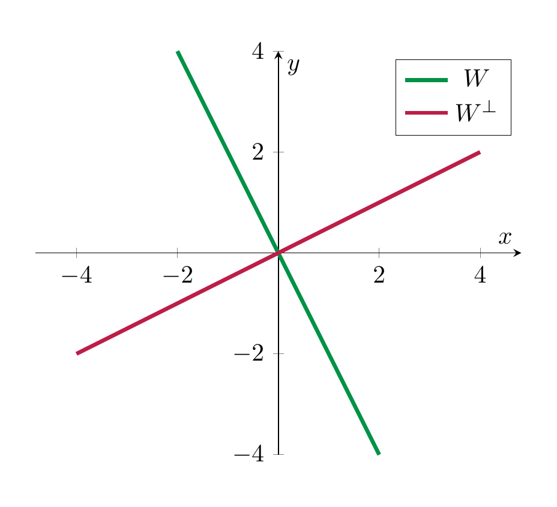
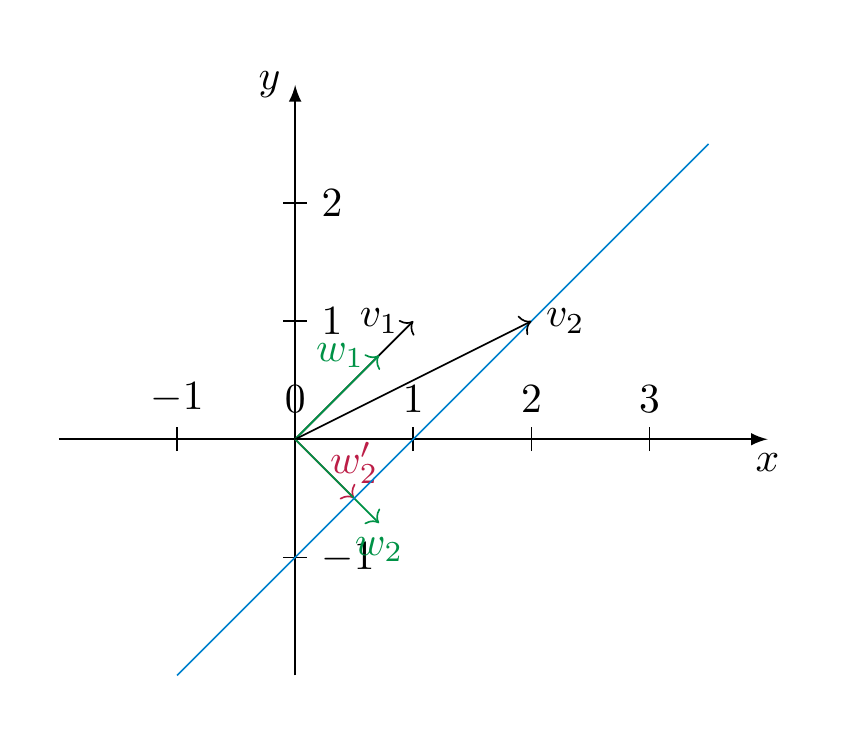

# Euclidean spaces

<strong>Definition 7.15</strong>

 A *Euclidean vector space* is a vector space $V$ together with a map

\[
{\left \langle -, - \right \rangle}: V \times V \to {\bf R}
\]

that is

- bilinear (i.e., ${\left \langle v, - \right \rangle}$ and ${\left \langle -, v \right \rangle} : V \to {\bf R}$ are linear for each $v \in V$),

- symmetric (i.e., ${\left \langle v, w \right \rangle} = {\left \langle w, v \right \rangle}$), and

- positive definite (${\left \langle v, v \right \rangle} > 0$ for each $v \ne 0$).

One also refers to the map ${\left \langle -, - \right \rangle}$ as the scalar product on $V$. We say $v, w$ are *orthogonal* if ${\left \langle v, w \right \rangle}=0$. We will indicate this by writing

\[
v \bot w.
\]

We call

\[
|\hspace{-0.5mm}| {v} |\hspace{-0.5mm}| := \sqrt { {\left \langle v, v \right \rangle}} (\in {\bf R}^{\ge 0})
\]

the norm of the vector $v$. For $v, w \in V$, the *distance* between $v$ and $w$ is defined as

\[
d(v,w) := |\hspace{-0.5mm}| {v-w} |\hspace{-0.5mm}|.
\]

<strong>Example 7.16</strong> (Related exercises: <a href="../exercises-euclid/#ex-euclid-poly-operator">Exercise 7.15</a>, <a href="../exercises-euclid/#ex-euclid-polynomials-gs">Exercise 7.1</a>)

1.  ${\bf R}^n$ with the above scalar product is an Euclidean vector space. More generally, for a symmetric, positive definite matrix $A$, ${\bf R}^n$ together ${\left \langle -, - \right \rangle_{A}}$ is an Euclidean space.

    In other words, the above turns the fundamental properties of ${\bf R}^n$, together with the standard scalar product (or, more generally ${\bf R}^n$ with the scalar product ${\left \langle -, - \right \rangle_{A}}$ given by a positive definite symmetric matrix $A$) into an abstrac definition, similarly to the way that a vector space is an abstraction of the key properties of ${\bf R}^n$.

2.  If $V$, together with some given scalar product ${\left \langle -, - \right \rangle}$ is a Euclidean space, then so is any subspace of $V$. In particular, any subspace of ${\bf R}^n$ with the standard scalar product is again an Euclidean space. For example, any plane inside ${\bf R}^3$ is an Euclidean space.

3.   One can use elementary properties of the integral to show that the vector space $C = C([-1,1])$ of continuous functions $f : [-1,1] \to {\bf R}$ with

\[
    {\left \langle f, g \right \rangle} := \int_{-1}^1 f(x)g(x)dx
\]

is an (infinite-dimensional) Euclidean space, which is of fundamental importance in analysis.

4.  As in <a href="../euclid-scalar-product/#ex-minkowski" data-reference-type="ref+Label" data-reference="ex:minkowski">Example 7.8</a>, consider again $V = {\bf R}^n$, but

\[
    {\left \langle v, w \right \rangle} := v_1 w_1 + \dots + v_{n-1} w_{n-1} - v_n w_n.
\]

This is bilinear and symmetric, but *not* positive definite, and therefore not a scalar product.

<strong>Proposition 7.17</strong>

 Let $(V, {\left \langle -, - \right \rangle})$ be an Euclidean space. For each $v, w \in V$, there holds:

1.  $|\hspace{-0.5mm}| {v} |\hspace{-0.5mm}| \ge 0$,

2.   $|\hspace{-0.5mm}| {v} |\hspace{-0.5mm}| = 0$ if and only if $v = 0$,

3.  $|\hspace{-0.5mm}| {rv} |\hspace{-0.5mm}| = |r| |\hspace{-0.5mm}| {v} |\hspace{-0.5mm}|$ for $r \in {\bf R}$,

*Proof.* The first and third statement is immediate. The second holds since ${\left \langle -, - \right \rangle}$ is (by definition) positive definite. ◻

The scalar product yields a crucial additional feature that general vector spaces do not possess. This is based on the following idea. Throughout, let $(V, {\left \langle -, - \right \rangle})$ be an Euclidean vector space.

<strong>Lemma 7.18</strong>

 Let $e \in V$ be a vector of norm 1, i.e., $|\hspace{-0.5mm}| {e} |\hspace{-0.5mm}| = 1$. Let $v \in V$ be any vector. Then the vector

\[
\tilde v := v - {\left \langle v, e \right \rangle} \cdot e
\]

is orthogonal to $e$ and we have the equation

\[
v = \tilde v +   {\left \langle v, e \right \rangle} \cdot e
\]

<strong>(7.19)</strong>

 expressing $v$ as a sum of a scalar multiple of $e$ and a vector that is orthogonal to $e$.

*Proof.* The orthogonality of $\tilde v$ and $e$ is a computation using the bilinearity of ${\left \langle -, - \right \rangle}$:

\[
\begin{align*}
{\left \langle \tilde v, e \right \rangle} &= 
{\left \langle v - {\left \langle v, e \right \rangle} \cdot e, e \right \rangle} \\
& = {\left \langle v, e \right \rangle} - {\left \langle {\left \langle v, e \right \rangle} \cdot e, e \right \rangle} \\
& = {\left \langle v, e \right \rangle} - {\left \langle v, e \right \rangle} \underbrace{ {\left \langle e, e \right \rangle}}_{=1} \\
& = 0.
\end{align*}
\]

The equation is obvious from the definition of $\tilde v$. ◻

We now extend the observation of <a href="#lem-rep-orthogonal" data-reference-type="ref+Label" data-reference="lem:rep-orthogonal">Lemma 7.18</a> to more than a single vector. To do so, we introduce some terminology.

<strong>Definition and Lemma 7.20</strong> (Related exercises: <a href="../exercises-euclid/#ex-euclid-6-9">Exercise 7.10</a>, <a href="../exercises-euclid/#ex-euclid-r4-projection">Exercise 7.3</a>)

 The *orthogonal complement* of a subset $M \subset V$ is defined as

\[
M^\bot := \{v \in V \ | \ {\left \langle v, m \right \rangle}= 0 \text{ for all } m \in M\}.
\]

This is a sub*space* of $V$.

For a subspace $W$, one has

\[
W \cap W^\bot = \{0\},
\]

<strong>(7.21)</strong>

The last assertion can be rephrased by saying that the zero vector is the only element in $W$ that is orthogonal to all vectors in $W$. Colloquially, this means that if $W$ gets larger, then $W^\bot$ gets smaller. This idea is made more precise (in terms of dimensions) in <a href="#cor-dim-u-bot" data-reference-type="ref+Label" data-reference="cor:dim-u-bot">Corollary 7.31</a> below. The last assertion is proved using the positive-definiteness of ${\left \langle -, - \right \rangle}$ (specifically, <a href="#prop-properties-nm" data-reference-type="ref+Label" data-reference="prop:properties-nm">Proposition 7.17</a><a href="#item-non-deg" data-reference-type="ref" data-reference="item--non-deg">2.</a>).

<strong>Example 7.22</strong>

 Consider the subspace $W = L (\left ( \begin{array}{c} 1 \\ 2 \\ 4 \end{array} \right ), \left ( \begin{array}{c} 1 \\ 1 \\ 0 \end{array} \right )) \subset {\bf R}^3$ (with its standard scalar product). We compute $W^\bot$. A vector $x = \left ( \begin{array}{c} x_1 \\ x_2 \\ x_3 \end{array} \right ) \in {\bf R}^3$ will be orthogonal to $W$ if and only if it is orthogonal to $v_1 = \left ( \begin{array}{c} 1 \\ 2 \\ 4 \end{array} \right )$ and $v_2 = \left ( \begin{array}{c} 1 \\ 1 \\ 0 \end{array} \right )$. This follows from the linearity of ${\left \langle x, - \right \rangle}$. We make the conditions $x \bot v_1$ and $x \bot v_2$ explicit:

\[
\begin{align*}
 x \bot v_1 & \Rightarrow x_1 + 2x_2 + 4 x_3 & = 0 \\
x \bot v_2 & \Rightarrow x_1 + x_2 & = 0.
\end{align*}
\]

We solve this homogeneous system

\[
\left ( \begin{array}{ccc} 1 & 2 & 4 \\ 1 & 1 & 0 \end{array} \right ) \leadsto \left ( \begin{array}{ccc} 1 & 2 & 4 \\ 0 & -1 & -4 \end{array} \right ) \leadsto \left ( \begin{array}{ccc} 1 & 2 & 4 \\ 0 & 1 & 4 \end{array} \right )
\]

which shows that $x_3$ is a free variable, and that the solution space of the system, i.e., $W^\bot$ is the subspace

\[
W^\bot = L(\left ( \begin{array}{c} 4 \\ -4 \\ 1 \end{array} \right )).
\]

<strong>Definition 7.23</strong>

 A family $v_1, \dots, v_n$ of vectors is called an *orthonormal system* if

- $|\hspace{-0.5mm}| {v_i} |\hspace{-0.5mm}| = 1$ (i.e., ${\left \langle v_i, v_i \right \rangle} = 1$) for all $i$,

- $v_i \bot v_j$ (i.e., ${\left \langle v_i, v_j \right \rangle} = 0$) for all $i \ne j$.

If the vectors additionally form a basis of $V$, then we speak of an *orthonormal basis*.

For example, the standard basis in ${\bf R}^n$ is an orthonormal basis (with respect to the standard scalar product).

<strong>Theorem 7.24</strong> (Related exercises: <a href="../exercises-euclid/#ex-euclid-6-1">Exercise 7.2</a>, <a href="../exercises-euclid/#ex-euclid-6-13">Exercise 7.17</a>, <a href="../exercises-euclid/#ex-euclid-6-6">Exercise 7.7</a>, <a href="../exercises-euclid/#ex-euclid-r4-projection">Exercise 7.3</a>, <a href="../exercises-euclid/#ex-euclid-u-r4-orth">Exercise 7.16</a>)

 Let $u_1, \dots, u_n$ be an orthonormal system (in an Euclidean space). Let $U = L(u_1, \dots, u_n) \subset V$ be the subspace spanned by these vectors. Then there is a unique linear map, called the *orthogonal projection*

\[
p : V \to U
\]

such that

1.   $p(u) = u$ for all $u \in U$,

2.   $p(v) - v \in U^\bot$ for all $v \in V$.

In particular, every vector $v \in V$ can be written as

\[
v = \underbrace{p(v)}_{\in U} + \underbrace{v - p(v)}_{\in U^\bot},
\]

i.e., a sum of a vector in $U$ and another one in its orthogonal complement $U^\bot$. This is the unique representation of $v$ in such a form.

The map $p$ is given by

\[
p(v) = \sum_{k=1}^n {\left \langle v, u_k \right \rangle} u_k.
\]

<strong>(7.25)</strong>

More generally, if $u_1, \dots, u_n$ is an orthogonal system (not necessarily orthonormal), then the map

\[
p(v) = \sum_{k=1}^n \frac{ {\left \langle v, u_k \right \rangle}}{ {\left \langle u_k, u_k \right \rangle}} u_k
\]

<strong>(7.26)</strong>

 is the orthogonal projection onto $U = L(u_1, \dots, u_n)$.

<strong>Example 7.27</strong>

 In $V = {\bf R}^3$, equipped with its standard scalar product, we consider $u_1 = (1, 0,0)$ and $u_2=(0,1,0)$. These form an orthonormal system. Then $U = L(u_1, u_2) = \{(x,y,0) | x,y \in {\bf R}\}$ is the $x$-$y$-plane; its orthogonal complement is $U^\bot = L((0,0,1)) = \{(0,0,z)|z \in {\bf R}\}$, the $z$-axis. The orthogonal projection as defined in sends a vector $v = (x,y,z)$ to

\[
p(v) = {\left \langle v, u_1 \right \rangle} u_1 + {\left \langle v, u_2 \right \rangle} u_2 = x u_1 + y u_2 = (x, y, 0).
\]

*Proof.* The map $p$ defined in is linear, since ${\left \langle -, u_k \right \rangle}$ is linear. It satisfies the two conditions. One checks this using that the $u_k$ form an orthonormal system, very similarly to the proof of <a href="#lem-rep-orthogonal" data-reference-type="ref+Label" data-reference="lem:rep-orthogonal">Lemma 7.18</a>.

If $q : V \to U$ is another map with these two properties, we have

\[
{\left \langle p(v) - q(v), u \right \rangle} = {\left \langle \underbrace{p(v)-v-(q(v)-v)}_{\in U^\bot}, u \right \rangle} = 0
\]

for all $v \in V$, $u \in U$. Since $q(v)$, $p(v) \in U$, we have $p(v)-q(v) \in U$. Thus, the vector $p(v)-q(v)$ is zero, by . This shows the unicity of $p$.

The final claim holds since $v = \underbrace{p(v)}_{\in U} + \underbrace{v - p(v)}_{\in U^\bot}$ is such a representation. If $v = u_1 + u_1'$ with $u_1 \in U$ and $u_1' \in U^\bot$ is another such representation, then $u-u_1 = u' - u_1'$ lies both in $U$ (left hand side), but also in $U^\bot$ (right hand side). However, again applying <a href="#prop-properties-nm" data-reference-type="ref+Label" data-reference="prop:properties-nm">Proposition 7.17</a><a href="#item-non-deg" data-reference-type="ref" data-reference="item--non-deg">2.</a> to $U$, we have $U \cap U^\bot = \{0\}$, so $u=u_1$ and $u' = u'_1$. ◻

<strong>Corollary 7.28</strong>

 Suppose $u_1, \dots, u_n$ form an orthonormal system (of a Euclidean vector space $(V, {\left \langle -, - \right \rangle})$) such that $V$ is spanned by these vectors. Then

- the following formula holds for any $v \in V$:

\[
  v = \sum_{k=1}^n {\left \langle v, u_i \right \rangle} u_i.
\]

<strong>(7.29)</strong>

- The vectors are necessarily linearly independent, i.e., they form an orthonormal *basis*.

*Proof.* We apply <a href="#thm-orthogonal-projection" data-reference-type="ref+Label" data-reference="thm:orthogonal-projection">Theorem 7.24</a> to these vectors. By the assumption $U = V$, so that by <a href="#item-p-u-id" data-reference-type="ref" data-reference="item--p.U.id">1.</a>, $p(v) = {\mathrm {id}}$. The first claim then holds by .

If $0 = \sum_{k=1}^n a_k u_k$ is a linear combination, we apply ${\left \langle -, u_l \right \rangle}$, for any $1 \le l \le n$, to :

\[
\begin{align*}
0 & = {\left \langle 0, u_l \right \rangle} \\
& = {\left \langle \sum_{k=1}^n a_k u_k, u_l \right \rangle} \\
& = \sum_{k=1}^{n} a_k {\left \langle u_k, u_l \right \rangle}.
\end{align*}
\]

In this sum, all terms except the one with $k=l$ are zero, since $u_k \bot u_l$ for $k \ne l$. We also have ${\left \langle u_l, u_l \right \rangle} = 1$, which shows that $a_l = 0$, and therefore the linear independence of the given vectors. ◻

<strong>Example 7.30</strong>

 The standard basis $e_1, \dots, e_n$ of ${\bf R}^n$ is an orthonormal basis. For $v = \left ( \begin{array}{c} v_1 \\ \vdots \\ v_n \end{array} \right )$, we have ${\left \langle e_i, v \right \rangle} = v_i$ and the representation in is the usual expansion of $v$:

\[
v = v_1 e_1 + \dots + v_n e_n.
\]

In general, the identity is a convenient way to compute the coordinates of a given vector in terms of an (orthonomal) basis.

Using these results, one can quickly prove:

<strong>Corollary 7.31</strong> (Related exercises: <a href="../exercises-euclid/#ex-euclid-6-1">Exercise 7.2</a>, <a href="../exercises-euclid/#ex-euclid-u-r4-orth">Exercise 7.16</a>)

 If $U \subset V$ is a subspace of a finite-dimensional Euclidean space then

\[
\dim U^\bot = \dim V - \dim U.
\]

Moreover, we then have following equality:

\[
U= (U^\bot)^\bot,
\]

i.e., the orthogonal complement of the orthogonal complement of $U$ is equal to $U$.

The presence of a positive definite (symmetric) matrix yields the following algorithmic device that constructs a particularly convenient set of vectors.

<strong>Proposition 7.32</strong>

 (*Gram–Schmidt orthogonalization*) Let $v_1, \dots, v_r$ be any set of linearly independent vectors (in an Euclidean space). Then the vectors $w_1, \dots, w_r$ defined inductively as follows are an orthonormal system: They are constructed as follows

\[
\begin{align*}
w_1 & := \frac 1 {|\hspace{-0.5mm}| {v_1} |\hspace{-0.5mm}|} v_1 & \text{(normalization)}\\
w'_2 & := v_2 - {\left \langle v_2, w_1 \right \rangle} w_1 & \text{(orthogonalization w.r.t. }L(w_1)\text{)} \\
w_2 & := \frac 1 {|\hspace{-0.5mm}| {w'_2} |\hspace{-0.5mm}|} w'_2 & \text{(normalization)}\\
\vdots \\
w'_r & := v_r - \sum_{k=1}^{r-1} {\left \langle v_r, w_k \right \rangle} \cdot {w_k} & \text{(orthogonalization w.r.t. }L(w_1, \dots, w_{r-1})\text{)} \\
w_r & :=  \frac 1 {|\hspace{-0.5mm}| {w'_r} |\hspace{-0.5mm}|} w'_r & \text{(normalization)}
\end{align*}
\]

We have

\[
L(v_1, \dots, v_r) = L(w_1, \dots, w_r).
\]

In particular, if the $v_i$ form a basis, then so do the $w_i$, i.e., they then form an orthonormal basis. Yet more in particular, this shows that any finite-dimensional Euclidean space admits an orthonormal basis.

*Proof.* In each step, the vector $w'_r$ is constructed in such a way that $w'_r$ is orthogonal to the preceding vectors $w_1, \dots, w_{r-1}$, cf. . The division by the norms of the vectors $w'_r$ ensures that $|\hspace{-0.5mm}| {w_r} |\hspace{-0.5mm}| = 1$. Note that this is possible since $|\hspace{-0.5mm}| {w'_r} |\hspace{-0.5mm}| > 0$ since $w'_r \ne 0$ and ${\left \langle -, - \right \rangle}$ is positive definite. ◻

<iframe src="../visualizations/orthogonal-projection-3d.html" style="width:100%;height:520px;border:none;border-radius:6px;" loading="lazy"></iframe>

<strong>Example 7.33</strong>

 We consider $A = {\mathrm {id}}_2$, i.e., the standard scalar product on ${\bf R}^2$ and $v_1 = \left ( \begin{array}{c} 1 \\ 1 \end{array} \right )$ and $v_2 = \left ( \begin{array}{c} 2 \\ 1 \end{array} \right )$. (One checks this is a basis of ${\bf R}^2$!) Then

\[
\begin{align*}
w_1 & = \frac 1{\sqrt 2} \left ( \begin{array}{c} 1 \\ 1 \end{array} \right ) \\
w'_2 & = v_2 - {\left \langle v_2, w_1 \right \rangle} w_1 \\
& = \left ( \begin{array}{c} 2 \\ 1 \end{array} \right ) - \frac 3{\sqrt 2} \cdot \frac 1 {\sqrt 2} \left ( \begin{array}{c} 1 \\ 1 \end{array} \right ) \\ 
& = \frac 12 \left ( \begin{array}{c} 1 \\ -1 \end{array} \right ) \\
w_2 & = \frac1{\sqrt 2} \left ( \begin{array}{c} 1 \\ -1 \end{array} \right ).
\end{align*}
\]

Here is an illustration of the method in this example. The blue line depicts the vectors of the form $v_2 + a w_1$ for $a \in {\bf R}$. The vector $w'_2$ is the vector on that line that is orthogonal to $w_1$:

<strong>Corollary 7.34</strong>

 Let $U \subset V$ be a subspace of a finite-dimensional Euclidean space $V$. Then there are two unique linear maps, called the *orthogonal projection* onto $U$, resp. onto $U^\bot$,

\[
\begin{align*}
p_U : & V \to U\\
p_{U^\bot} : & V \to U^\bot
\end{align*}
\]

such that every vector $v \in V$ can be written as

\[
v = p_U(v) + p_{U^\bot}(v).
\]

<strong>(7.35)</strong>

*Proof.* By <a href="#prop-gram-schmidt-orthogonalization" data-reference-type="ref+Label" data-reference="prop:gram-schmidt-orthogonalization">Proposition 7.32</a>, $U$ has an orthonormal basis, so we can apply <a href="#thm-orthogonal-projection" data-reference-type="ref+Label" data-reference="thm:orthogonal-projection">Theorem 7.24</a>, which gives us the orthogonal projection $p_U: V \to U$. If we define $p_{U^\bot}(v) := v - p_U(v)$, holds by design, moreover, $p_{U^\bot}(v) \in U^\bot$ again by <a href="#thm-orthogonal-projection" data-reference-type="ref+Label" data-reference="thm:orthogonal-projection">Theorem 7.24</a>. The unicity of a decomposition as in is again part of <a href="#thm-orthogonal-projection" data-reference-type="ref+Label" data-reference="thm:orthogonal-projection">Theorem 7.24</a>. ◻

