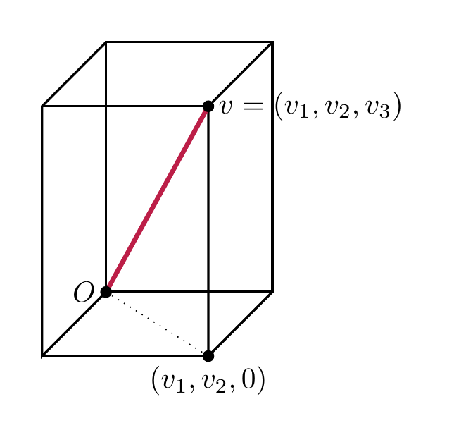
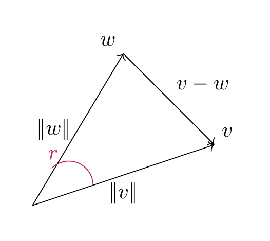
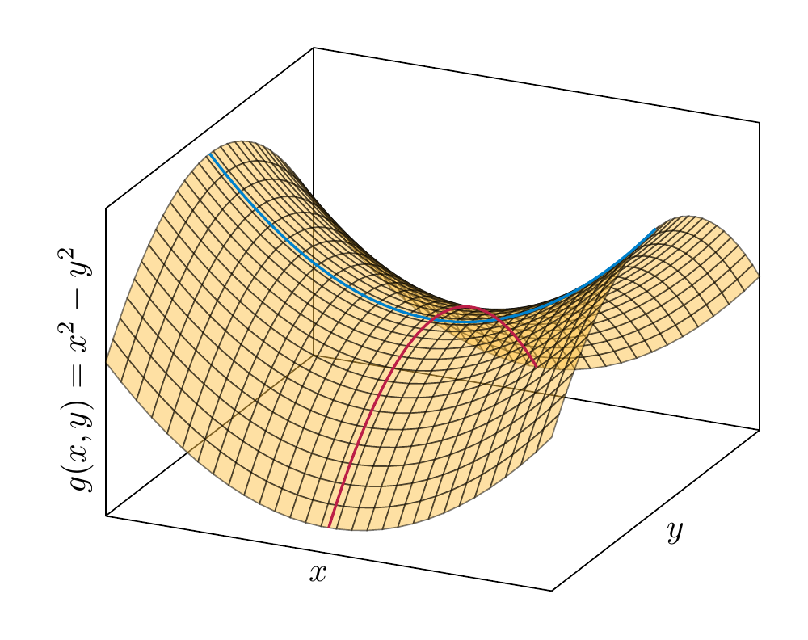
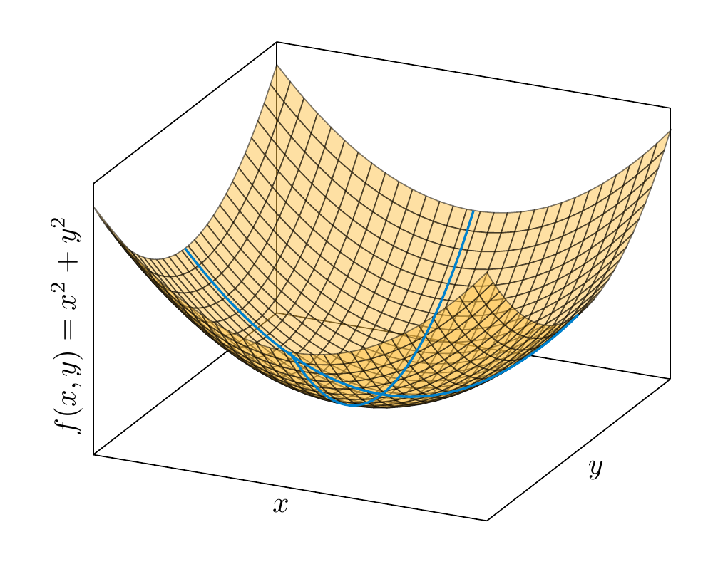

# Euclidean spaces

The definition of a (real) vector space encodes the existence (and good properties) of the addition of vectors and the scalar multiplication of vectors. The vector space ${\bf R}^n$ has, however, another important piece of structure, namely the distance between two points, and the property of vectors being orthogonal to each other.

## The scalar product on ${\bf R}^n$

<strong>Definition 7.1</strong>

 The *scalar product* of $v, w \in {\bf R}^n$ is defined as

\[
{\left \langle v, w \right \rangle} := v^T {\mathrm {id}} w = v^T w = v_1 w_1 + \dots + v_n w_n.
\]

(This is not to be confused with the scalar multiple of a vector, which is again a vector!)

<strong>Example 7.2</strong>

 The scalar product can be positive, zero, or negative:

- ${\left \langle \left ( \begin{array}{c} 1 \\ 2 \end{array} \right ), \left ( \begin{array}{c} -2 \\ 2 \end{array} \right ) \right \rangle} = 1 \cdot (-2) + 2 \cdot 2 = 2$

- ${\left \langle \left ( \begin{array}{c} 1 \\ 2 \end{array} \right ), \left ( \begin{array}{c} -2 \\ 1 \end{array} \right ) \right \rangle} = 1 \cdot (-2) + 2 \cdot 1 = 0$

- ${\left \langle \left ( \begin{array}{c} 1 \\ 2 \end{array} \right ), \left ( \begin{array}{c} -2 \\ 0 \end{array} \right ) \right \rangle} = 1 \cdot (-2) + 2 \cdot 0 = -2$

However, for any $v \in {\bf R}^n$, we have

\[
{\left \langle v, v \right \rangle} = \sum_{i=1}^n v_i^2 \ge 0
\]

<strong>(7.3)</strong>

 i.e., a scalar product of a vector with *itself* is always non-negative. This implies that

\[
|\hspace{-0.5mm}| {v} |\hspace{-0.5mm}| := \sqrt{\left \langle v, v \right \rangle} = \sqrt{v_1^2 + \dots + v_n^2}
\]

is a well-defined (real) number. It is called the *norm* of the vector $v$.

<strong>Lemma 7.4</strong>

 The norm $|\hspace{-0.5mm}| {v} |\hspace{-0.5mm}|$ is the length of the line segment from the origin to $v$.

For $v, w \in {\bf R}^2$, there holds

\[
{|\hspace{-0.5mm}| {v-w} |\hspace{-0.5mm}|}^2 = |\hspace{-0.5mm}| {v} |\hspace{-0.5mm}|^2 + |\hspace{-0.5mm}| {w} |\hspace{-0.5mm}|^2 - 2 |\hspace{-0.5mm}| {v} |\hspace{-0.5mm}| |\hspace{-0.5mm}| {w} |\hspace{-0.5mm}| \cos r,
\]

where $r$ is the angle between the vector $v$ and $w$.

*Proof.* The formula for the norm follows from repeatedly applying the *Pythagorean theorem*. Illustrating this for $n = 3$, we see that the line segment (shown dotted below) from the origin $O = (0,0,0)$ to the point $(v_1, v_2, 0)$ has length $\sqrt{v_1^2 + v_2^2}$. Therefore the length of the segment from $O$ to $v$ is

\[
\sqrt{\left (\sqrt{v_1^2 + v_2^2} \right)^2 + v_3^2} = \sqrt{v_1^2 + v_2^2 + v_3^2}.
\]

The formula for the norm of $v-w$ follows is a reformulation of the *law of cosines*.

 ◻

Given a square matrix $A \in {\mathrm {Mat}}_{n \times n}$, we have considered so far the linear map

\[
{\bf R}^n \to {\bf R}^n, v\mapsto A \cdot v.
\]

In addition to that, there is another fundamental map that one can associate to a matrix:

\[
{\left \langle -, - \right \rangle_{A}} : {\bf R}^n \times {\bf R}^n \to {\bf R}, (v, w) \mapsto {\left \langle v, w \right \rangle_{A}} := v^T \cdot A \cdot w.
\]

Here we regard $v$ and $w$ as column vectors, i.e., as $n \times 1$-matrices. Therefore, for $v = \left ( \begin{array}{c} v_1 \\ \vdots \\ v_n \end{array} \right )$, $v^T = \left ( \begin{array}{ccc} v_1 & \dots & v_n \end{array} \right )$ is a row vector (with $n$ entries). Therefore $v^T A$ is an $1 \times n$-matrix, so that $v^T A w$ is an $1 \times 1$-matrix, i.e., just a real number. We call this number the *scalar product* of $v$ and $w$ with respect to the given matrix $A$.

<strong>Lemma 7.5</strong> (Related exercises: <a href="../exercises-euclid/#ex-euclid-polynomials-gs">Exercise 7.1</a>)

 The scalar product has the following fundamental properties:

- If we fix $w \in {\bf R}^n$, then the maps

\[
  \begin{align*}
      {\left \langle ?, w \right \rangle} : & {\bf R}^n \to {\bf R}, v \mapsto {\left \langle v, w \right \rangle}\\
      {\left \langle w, ? \right \rangle} : & {\bf R}^n \to {\bf R}, v \mapsto {\left \langle w, v \right \rangle}
  \end{align*}
\]

  are linear (cf. <a href="../maps-definition-and-first-examples/#def-linear-map" data-reference-type="ref+Label" data-reference="def:linear-map">Definition 4.1</a>; e.g., for the first this means concretely that

\[
  {\left \langle rv+r'v', w \right \rangle} = r{\left \langle v, w \right \rangle} + r'{\left \langle v', w \right \rangle},
\]

  for $r, r' \in {\bf R}$, $v, v' \in {\bf R}^n$. We refer to this by saying that ${\left \langle -, - \right \rangle} : {\bf R}^n \times {\bf R}^n \to {\bf R}$ is a *bilinear form* (or as the *bilinearity* of the scalar product).

- We have

\[
  {\left \langle v, w \right \rangle} = {\left \langle w, v \right \rangle}.
\]

  This property is called *symmetry*.

*Proof.* By <a href="../maps-multiplication-of-a-matrix/#prop-matrix-linear-map" data-reference-type="ref+Label" data-reference="prop:matrix-linear-map">Proposition 4.19</a>, the map $w \mapsto v^T w = {\left \langle v, w \right \rangle}$ is linear. The proof of the linearity in the first argument is similar, or it follows from symmetry.

The identity ${\left \langle v, w \right \rangle} = {\left \langle w, v \right \rangle}$ is directly clear from the definition. One may also prove it using :

\[
(v^T w)^T = w^T (v^T)^T = w^T v.
\]

Noting that any $1 \times 1$-matrix (such as $v^T w$) is equal to its transpose, the left hand side equals ${\left \langle v, w \right \rangle}$, while the right equals ${\left \langle w, v \right \rangle}$. ◻

Using the bilinearity of ${\left \langle -, - \right \rangle}$, we can compute the following expression

\[
\begin{align*}
{|\hspace{-0.5mm}| {v-w} |\hspace{-0.5mm}|}^2 & = {\left \langle v-w, v-w \right \rangle} \\
& = {\left \langle v, v-w \right \rangle} - {\left \langle w, v-w \right \rangle} \\
& = {\left \langle v, v \right \rangle} - {\left \langle v, w \right \rangle} - {\left \langle w, v \right \rangle} + {\left \langle w, w \right \rangle} \\
& = {|\hspace{-0.5mm}| {v} |\hspace{-0.5mm}|}^2 + {|\hspace{-0.5mm}| {w} |\hspace{-0.5mm}|}^2 - 2 {\left \langle v, w \right \rangle}.
\end{align*}
\]

Comparing this with the cosine law above we see

\[
{\left \langle v, w \right \rangle} = |\hspace{-0.5mm}| {v} |\hspace{-0.5mm}| |\hspace{-0.5mm}| {w} |\hspace{-0.5mm}| \cos r.
\]

The factor $\cos r$ is equal to 0 precisely if $r = -\frac \pi 2, \frac \pi 2$ (i.e., $90^\circ$ or $-90^\circ$). In other words,

\[
{\left \langle v, w \right \rangle} = 0
\]

if the angle between the vectors $v$ and $w$ is $\pm 90^\circ$. This motivates the following definition.

<strong>Definition 7.6</strong>

 Two vectors $v, w \in {\bf R}^n$ are said to be *orthogonal* if

\[
{\left \langle v, w \right \rangle} = \sum_{i=1}^n v_i w_i = 0.
\]

## Positive definite matrices

<strong>Definition and Lemma 7.7</strong>

 If $A$ is a *symmetric* $n \times n$-matrix (i.e., $A = A^T$), then the map

\[
{\left \langle -, - \right \rangle_{A}} : {\bf R}^n \times {\bf R}^n \to {\bf R}, {\left \langle v, w \right \rangle_{A}} := v^T A w
\]

is bilinear and symmetric, i.e., <a href="#lem-scalar-product-properties" data-reference-type="ref+Label" data-reference="lem:scalar-product-properties">Lemma 7.5</a> holds verbatim for ${\left \langle -, - \right \rangle_{A}}$ instead of the standard scalar product (which corresponds to the case $A = {\mathrm {id}}_n$).

<strong>Example 7.8</strong>

 Suppose $A = \left ( \begin{array}{cccc} 1 & 0 & 0 & 0 \\ 0 & 1 & 0 & 0 \\ 0 & 0 & 1 & 0 \\ 0 & 0 & 0 & -1 \end{array} \right )$. Then $A w = \left ( \begin{array}{c} w_1 \\ w_2 \\ w_3 \\ -w_4 \end{array} \right )$, so that

\[
\begin{align*}
{\left \langle v, w \right \rangle_{A}} & = v^T A w = \left ( \begin{array}{cccc} v_1 & v_2 & v_3 & v_4 \end{array} \right ) \cdot \left ( \begin{array}{c} w_1 \\ w_2 \\ w_3 \\ -w_4 \end{array} \right ) \\ & =
v_1 w_1 + v_2 w_2 +v_3w_3 - v_4 w_4.
\end{align*}
\]

This example is not an anomaly, but the basis of so-called *Minkowski space* which is fundamental in special relativity, which is ${\bf R}^{3+1}$ with 3 space coordinates and 1 time coordinate.

The standard basis vectors $e_1 = \left ( \begin{array}{c} 1 \\ 0 \\ 0 \\ 0 \end{array} \right ), \dots, e_4 = \left ( \begin{array}{c} 0 \\ 0 \\ 0 \\ 1 \end{array} \right )$ are orthogonal to each other, but

\[
{\left \langle e_4, e_4 \right \rangle_{A}} = -1
\]

where as ${\left \langle e_k, e_k \right \rangle_{A}} = +1$ for the other three basis vectors. In that sense, the scalar product (with respect to $A$) is able to distinguish between the last and the other three directions.

<strong>Definition 7.9</strong>

 A symmetric matrix $A$ is called *positive definite* if

\[
{\left \langle v, v \right \rangle_{A}} > 0
\]

for all $v \in {\bf R}^n$, $v \ne 0$. In this case we can define the *norm* (of $v$ with respect to the matrix $A$) as

\[
{|\hspace{-0.5mm}| {v} |\hspace{-0.5mm}|}_{A} := \sqrt {\left \langle v, v \right \rangle_{A}}.
\]

It is *negative definite* if instead ${\left \langle v, v \right \rangle_{A}} < 0$ for all $v \ne 0$. The matrix $A$ is called *indefinite* if there exist $v, w \in {\bf R}^n$ with ${\left \langle v, v \right \rangle_{A}} > 0$ and ${\left \langle w, w \right \rangle_{A}} < 0$.

<iframe src="../visualizations/quadratic-form-2d.html" style="width:100%;height:520px;border:none;border-radius:6px;" loading="lazy"></iframe>

$2 \times 2$-matrices and their associated bilinear forms

<strong>Example 7.10</strong>

 As we have seen in , ${\mathrm {id}}_n$ is positive definite. The matrix in <a href="#ex-minkowski" data-reference-type="ref+Label" data-reference="ex:minkowski">Example 7.8</a> is indefinite.

It is suggestive to blame the $-1$ in the last entry for the indefiniteness of the matrix in <a href="#ex-minkowski" data-reference-type="ref+Label" data-reference="ex:minkowski">Example 7.8</a>. The following result gives a way to ensure positive definiteness for general matrices. To state it, we introduce a bit of terminology:

<strong>Definition 7.11</strong>

 For a square matrix $A$, the *principal submatrix* (of size $r$) is the matrix

\[
A^{(r)} = (a_{ij})_{1 \le i, j \le r}.
\]

I.e., it is the matrix consisting of the first $r$ rows and columns of $A$.

<strong>Proposition 7.12</strong>

 Let $A \in {\mathrm {Mat}}_{n \times n}$ be a symmetric square matrix. The following are equivalent:

1.  the bilinear form ${\left \langle -, - \right \rangle_{A}}$ is positive definite, i.e., ${\left \langle v, v \right \rangle_{A}} \ge 0$ for all $v \in {\bf R}^n$,

2.  $A$ is positive definite,

3.  For all $1 \le r \le n$, $\det (A^{(r)}) > 0$.

In particular, any positive definite matrix $A$ has $\det A > 0$. Therefore such a matrix is invertible (<a href="../determinants-invertibility-and-determinants/#thm-det-zero-niff-invertible" data-reference-type="ref+Label" data-reference="thm:det-zero-niff-invertible">Theorem 5.15</a>).

A proof of this criterion requires methods from §<a href="../euclid-euclidean-spaces/#sect-euclidean-spaces" data-reference-type="ref" data-reference="sect--Euclidean spaces">Section 7.3</a>.

<strong>Example 7.13</strong>

 Consider the matrix $A = \left ( \begin{array}{ccc} 1 & 2 & t \\ 2 & 5 & 8 \\ t & 7 & 14 \end{array} \right )$, where $t \in {\bf R}$ is some parameter. We inspect its positive definiteness: since $A^{(1)} = 1$ is positive, $\det A^{(2)} = \det \left ( \begin{array}{cc} 1 & 2 \\ 2 & 5 \end{array} \right ) = 1 > 0$ and $\det A = \det A^{(3)} = -5t^2 + 32t -50$. For $t = 3$, this equals $+1$, so the matrix $A$ is positive definite in this case. For $t=4$, this equals $-2$, so the matrix $A$ is indefinite in this case.

<strong>Example 7.14</strong>

 The defininiteness of matrices has applications in analysis: for a (twice differentiable) function $f : {\bf R}^2 \to {\bf R}$, such as

\[
f(x,y)= x^2 + y^2,
\]

one considers the so-called *Hesse matrix*, which is given by

\[
\left ( \begin{array}{cc} \frac{\partial^2 f}{\partial x \partial x} & \frac{\partial^2 f}{\partial x \partial y} \\ \frac{\partial^2 f}{\partial y \partial x} & \frac{\partial^2 f}{\partial y \partial xy} \end{array} \right ).
\]

For the above function it is

\[
\left ( \begin{array}{cc} 2 & 0 \\ 0 & 2 \end{array} \right ),
\]

which is positive definite. By contrast, for $g(x, y)=x^2 - y^2$, it is $\left ( \begin{array}{cc} 2 & 0 \\ 0 & -2 \end{array} \right )$, which is indefinite. One proves in analysis that the positive defininetess of the Hesse matrix implies that there is a local minimum at a given point $(x,y)$, provided that $\frac{\partial f}{\partial x} = \frac{\partial f}{\partial y} = 0$ at this point. Thus, $f$ has a local minimum at the point $(0,0)$, but $g$ does not.

<figure>

<figcaption>The function <em>g</em>(<em>x</em>, <em>y</em>) = <em>x</em>2 − <em>y</em>2 has a <em>saddle point</em> at (0, 0); informally this means that there are directions in which <em>g</em> increases (here the <em>x</em>-direction, shown blue), and directions in which <em>g</em> decreases (the <em>y</em>-direction, red parabola).</figcaption>
</figure>

<figure>

<figcaption>The function <em>f</em>(<em>x</em>, <em>y</em>) = <em>x</em>2 + <em>y</em>2 has a local minimum at (0, 0). Informally this means that moving in any direction from the point (0, 0), the value of <em>f</em>(<em>x</em>, <em>y</em>) increases.</figcaption>
</figure>

