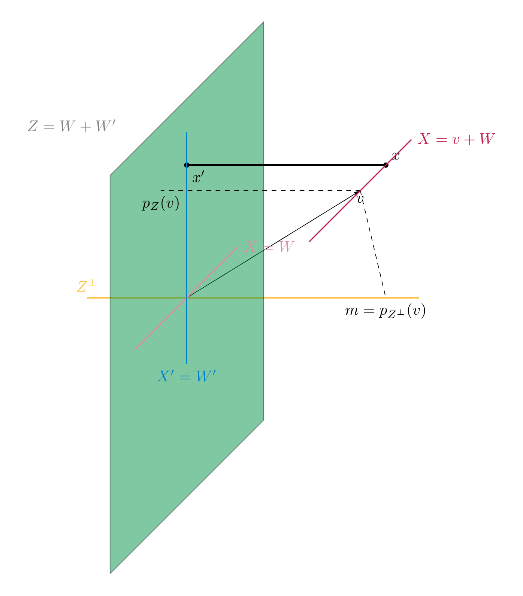

# Euclidean spaces

The definition of a (real) vector space encodes the existence (and good properties) of the addition of vectors and the scalar multiplication of vectors. The vector space ${\bf R}^n$ has, however, another important piece of structure, namely the distance between two points, and the property of vectors being orthogonal to each other.

## The scalar product on ${\bf R}^n$

<strong>Definition 7.1</strong>

 The *scalar product* of $v, w \in {\bf R}^n$ is defined as

\[
{\left \langle v, w \right \rangle} := v^T {\mathrm {id}} w = v^T w = v_1 w_1 + \dots + v_n w_n.
\]

(This is not to be confused with the scalar multiple of a vector, which is again a vector!)

<strong>Example 7.2</strong>

 The scalar product can be positive, zero, or negative:

- ${\left \langle \left ( \begin{array}{c} 1 \\ 2 \end{array} \right ), \left ( \begin{array}{c} -2 \\ 2 \end{array} \right ) \right \rangle} = 1 \cdot (-2) + 2 \cdot 2 = 2$

- ${\left \langle \left ( \begin{array}{c} 1 \\ 2 \end{array} \right ), \left ( \begin{array}{c} -2 \\ 1 \end{array} \right ) \right \rangle} = 1 \cdot (-2) + 2 \cdot 1 = 0$

- ${\left \langle \left ( \begin{array}{c} 1 \\ 2 \end{array} \right ), \left ( \begin{array}{c} -2 \\ 0 \end{array} \right ) \right \rangle} = 1 \cdot (-2) + 2 \cdot 0 = -2$

However, for any $v \in {\bf R}^n$, we have

\[
{\left \langle v, v \right \rangle} = \sum_{i=1}^n v_i^2 \ge 0
\]

<strong>(7.3)</strong>

 i.e., a scalar product of a vector with *itself* is always non-negative. This implies that

\[
|\hspace{-0.5mm}| {v} |\hspace{-0.5mm}| := \sqrt{{\left \langle v, v \right \rangle}} = \sqrt{v_1^2 + \dots + v_n^2}
\]

is a well-defined (real) number. It is called the *norm* of the vector $v$.

<strong>Lemma 7.4</strong>

 The norm $|\hspace{-0.5mm}| {v} |\hspace{-0.5mm}|$ is the length of the line segment from the origin to $v$.

For $v, w \in {\bf R}^2$, there holds

\[
{|\hspace{-0.5mm}| {v-w} |\hspace{-0.5mm}|}^2 = |\hspace{-0.5mm}| {v} |\hspace{-0.5mm}|^2 + |\hspace{-0.5mm}| {w} |\hspace{-0.5mm}|^2 - 2 |\hspace{-0.5mm}| {v} |\hspace{-0.5mm}| |\hspace{-0.5mm}| {w} |\hspace{-0.5mm}| \cos r,
\]

where $r$ is the angle between the vector $v$ and $w$.

*Proof.* The formula for the norm follows from repeatedly applying the *Pythagorean theorem*. Illustrating this for $n = 3$, we see that the line segment (shown dotted below) from the origin $O = (0,0,0)$ to the point $(v_1, v_2, 0)$ has length $\sqrt{v_1^2 + v_2^2}$. Therefore the length of the segment from $O$ to $v$ is

\[
\sqrt{\left (\sqrt{v_1^2 + v_2^2} \right)^2 + v_3^2} = \sqrt{v_1^2 + v_2^2 + v_3^2}.
\]

The formula for the norm of $v-w$ follows is a reformulation of the *law of cosines*.

 ◻

Given a square matrix $A \in {\mathrm {Mat}}_{n \times n}$, we have considered so far the linear map

\[
{\bf R}^n \to {\bf R}^n, v\mapsto A \cdot v.
\]

In addition to that, there is another fundamental map that one can associate to a matrix:

\[
{\left \langle -, - \right \rangle_{A}} : {\bf R}^n \times {\bf R}^n \to {\bf R}, (v, w) \mapsto {\left \langle v, w \right \rangle_{A}} := v^T \cdot A \cdot w.
\]

Here we regard $v$ and $w$ as column vectors, i.e., as $n \times 1$-matrices. Therefore, for $v = \left ( \begin{array}{c} v_1 \\ \vdots \\ v_n \end{array} \right )$, $v^T = \left ( \begin{array}{ccc} v_1 & \dots & v_n \end{array} \right )$ is a row vector (with $n$ entries). Therefore $v^T A$ is an $1 \times n$-matrix, so that $v^T A w$ is an $1 \times 1$-matrix, i.e., just a real number. We call this number the *scalar product* of $v$ and $w$ with respect to the given matrix $A$.

<strong>Lemma 7.5</strong>

 The scalar product has the following fundamental properties:

- If we fix $w \in {\bf R}^n$, then the maps

\[
  \begin{align*}
      {\left \langle ?, w \right \rangle} : & {\bf R}^n \to {\bf R}, v \mapsto {\left \langle v, w \right \rangle}\\
      {\left \langle w, ? \right \rangle} : & {\bf R}^n \to {\bf R}, v \mapsto {\left \langle w, v \right \rangle}
  \end{align*}
\]

  are linear (cf. <a href="../maps/#def-linear-map" data-reference-type="ref+Label" data-reference="def:linear-map">Definition 4.1</a>; e.g., for the first this means concretely that

\[
  {\left \langle rv+r'v', w \right \rangle} = r{\left \langle v, w \right \rangle} + r'{\left \langle v', w \right \rangle},
\]

  for $r, r' \in {\bf R}$, $v, v' \in {\bf R}^n$. We refer to this by saying that ${\left \langle -, - \right \rangle} : {\bf R}^n \times {\bf R}^n \to {\bf R}$ is a *bilinear form* (or as the *bilinearity* of the scalar product).

- We have

\[
  {\left \langle v, w \right \rangle} = {\left \langle w, v \right \rangle}.
\]

  This property is called *symmetry*.

*Proof.* By <a href="../maps/#prop-matrix-linear-map" data-reference-type="ref+Label" data-reference="prop:matrix-linear-map">Proposition 4.19</a>, the map $w \mapsto v^T w = {\left \langle v, w \right \rangle}$ is linear. The proof of the linearity in the first argument is similar, or it follows from symmetry.

The identity ${\left \langle v, w \right \rangle} = {\left \langle w, v \right \rangle}$ is directly clear from the definition. One may also prove it using :

\[
(v^T w)^T = w^T (v^T)^T = w^T v.
\]

Noting that any $1 \times 1$-matrix (such as $v^T w$) is equal to its transpose, the left hand side equals ${\left \langle v, w \right \rangle}$, while the right equals ${\left \langle w, v \right \rangle}$. ◻

Using the bilinearity of ${\left \langle -, - \right \rangle}$, we can compute the following expression

\[
\begin{align*}
{|\hspace{-0.5mm}| {v-w} |\hspace{-0.5mm}|}^2 & = {\left \langle v-w, v-w \right \rangle} \\
& = {\left \langle v, v-w \right \rangle} - {\left \langle w, v-w \right \rangle} \\
& = {\left \langle v, v \right \rangle} - {\left \langle v, w \right \rangle} - {\left \langle w, v \right \rangle} + {\left \langle w, w \right \rangle} \\
& = {|\hspace{-0.5mm}| {v} |\hspace{-0.5mm}|}^2 + {|\hspace{-0.5mm}| {w} |\hspace{-0.5mm}|}^2 - 2 {\left \langle v, w \right \rangle}.
\end{align*}
\]

Comparing this with the cosine law above we see

\[
{\left \langle v, w \right \rangle} = |\hspace{-0.5mm}| {v} |\hspace{-0.5mm}| |\hspace{-0.5mm}| {w} |\hspace{-0.5mm}| \cos r.
\]

The factor $\cos r$ is equal to 0 precisely if $r = -\frac \pi 2, \frac \pi 2$ (i.e., $90^\circ$ or $-90^\circ$). In other words,

\[
{\left \langle v, w \right \rangle} = 0
\]

if the angle between the vectors $v$ and $w$ is $\pm 90^\circ$. This motivates the following definition.

<strong>Definition 7.6</strong>

 Two vectors $v, w \in {\bf R}^n$ are said to be *orthogonal* if

\[
{\left \langle v, w \right \rangle} = \sum_{i=1}^n v_i w_i = 0.
\]

## Positive definite matrices

<strong>Definition and Lemma 7.7</strong>

 If $A$ is a *symmetric* $n \times n$-matrix (i.e., $A = A^T$), then the map

\[
{\left \langle -, - \right \rangle_{A}} : {\bf R}^n \times {\bf R}^n \to {\bf R}, {\left \langle v, w \right \rangle_{A}} := v^T A w
\]

is bilinear and symmetric, i.e., <a href="#lem-scalar-product-properties" data-reference-type="ref+Label" data-reference="lem:scalar-product-properties">Lemma 7.5</a> holds verbatim for ${\left \langle -, - \right \rangle_{A}}$ instead of the standard scalar product (which corresponds to the case $A = {\mathrm {id}}_n$).

<strong>Example 7.8</strong>

 Suppose $A = \left ( \begin{array}{cccc} 1 & 0 & 0 & 0 \\ 0 & 1 & 0 & 0 \\ 0 & 0 & 1 & 0 \\ 0 & 0 & 0 & -1 \end{array} \right )$. Then $A w = \left ( \begin{array}{c} w_1 \\ w_2 \\ w_3 \\ -w_4 \end{array} \right )$, so that

\[
\begin{align*}
{\left \langle v, w \right \rangle_{A}} & = v^T A w = \left ( \begin{array}{cccc} v_1 & v_2 & v_3 & v_4 \end{array} \right ) \cdot \left ( \begin{array}{c} w_1 \\ w_2 \\ w_3 \\ -w_4 \end{array} \right ) \\ & =
v_1 w_1 + v_2 w_2 +v_3w_3 - v_4 w_4.
\end{align*}
\]

This example is not an anomaly, but the basis of so-called *Minkowski space* which is fundamental in special relativity, which is ${\bf R}^{3+1}$ with 3 space coordinates and 1 time coordinate.

The standard basis vectors $e_1 = \left ( \begin{array}{c} 1 \\ 0 \\ 0 \\ 0 \end{array} \right ), \dots, e_4 = \left ( \begin{array}{c} 0 \\ 0 \\ 0 \\ 1 \end{array} \right )$ are orthogonal to each other, but

\[
{\left \langle e_4, e_4 \right \rangle_{A}} = -1
\]

where as ${\left \langle e_k, e_k \right \rangle_{A}} = +1$ for the other three basis vectors. In that sense, the scalar product (with respect to $A$) is able to distinguish between the last and the other three directions.

<strong>Definition 7.9</strong>

 A symmetric matrix $A$ is called *positive definite* if

\[
{\left \langle v, v \right \rangle_{A}} > 0
\]

for all $v \in {\bf R}^n$, $v \ne 0$. In this case we can define the *norm* (of $v$ with respect to the matrix $A$) as

\[
{|\hspace{-0.5mm}| {v} |\hspace{-0.5mm}|}_{A} := \sqrt {{\left \langle v, v \right \rangle_{A}}}.
\]

It is *negative definite* if instead ${\left \langle v, v \right \rangle_{A}} < 0$ for all $v \ne 0$. The matrix $A$ is called *indefinite* if there exist $v, w \in {\bf R}^n$ with ${\left \langle v, v \right \rangle_{A}} > 0$ and ${\left \langle w, w \right \rangle_{A}} < 0$.

<strong>Example 7.10</strong>

 As we have seen in , ${\mathrm {id}}_n$ is positive definite. The matrix in <a href="#ex-minkowski" data-reference-type="ref+Label" data-reference="ex:minkowski">Example 7.8</a> is indefinite.

It is suggestive to blame the $-1$ in the last entry for the indefiniteness of the matrix in <a href="#ex-minkowski" data-reference-type="ref+Label" data-reference="ex:minkowski">Example 7.8</a>. The following result gives a way to ensure positive definiteness for general matrices. To state it, we introduce a bit of terminology:

<strong>Definition 7.11</strong>

 For a square matrix $A$, the *principal submatrix* (of size $r$) is the matrix

\[
A^{(r)} = (a_{ij})_{1 \le i, j \le r}.
\]

I.e., it is the matrix consisting of the first $r$ rows and columns of $A$.

<strong>Proposition 7.12</strong>

 Let $A \in {\mathrm {Mat}}_{n \times n}$ be a symmetric square matrix. The following are equivalent:

1.  the bilinear form ${\left \langle -, - \right \rangle_{A}}$ is positive definite, i.e., ${\left \langle v, v \right \rangle_{A}} \ge 0$ for all $v \in {\bf R}^n$,

2.  $A$ is positive definite,

3.  For all $1 \le r \le n$, $\det (A^{(r)}) > 0$.

In particular, any positive definite matrix $A$ has $\det A > 0$. Therefore such a matrix is invertible (<a href="../determinants/#thm-det-zero-niff-invertible" data-reference-type="ref+Label" data-reference="thm:det-zero-niff-invertible">Theorem 5.15</a>).

A proof of this criterion requires methods from §<a href="#sect-euclidean-spaces" data-reference-type="ref" data-reference="sect--Euclidean spaces">1.3</a>.

<strong>Example 7.13</strong>

 Consider the matrix $A = \left ( \begin{array}{ccc} 1 & 2 & t \\ 2 & 5 & 8 \\ t & 7 & 14 \end{array} \right )$, where $t \in {\bf R}$ is some parameter. We inspect its positive definiteness: since $A^{(1)} = 1$ is positive, $\det A^{(2)} = \det \left ( \begin{array}{cc} 1 & 2 \\ 2 & 5 \end{array} \right ) = 1 > 0$ and $\det A = \det A^{(3)} = -5t^2 + 32t -50$. For $t = 3$, this equals $+1$, so the matrix $A$ is positive definite in this case. For $t=4$, this equals $-2$, so the matrix $A$ is indefinite in this case.

<strong>Example 7.14</strong>

 The defininiteness of matrices has applications in analysis: for a (twice differentiable) function $f : {\bf R}^2 \to {\bf R}$, such as

\[
f(x,y)= x^2 + y^2,
\]

one considers the so-called *Hesse matrix*, which is given by

\[
\left ( \begin{array}{cc} \frac{\partial^2 f}{\partial x \partial x} & \frac{\partial^2 f}{\partial x \partial y} \\ \frac{\partial^2 f}{\partial y \partial x} & \frac{\partial^2 f}{\partial y \partial xy} \end{array} \right ).
\]

For the above function it is

\[
\left ( \begin{array}{cc} 2 & 0 \\ 0 & 2 \end{array} \right ),
\]

which is positive definite. By contrast, for $g(x, y)=x^2 - y^2$, it is $\left ( \begin{array}{cc} 2 & 0 \\ 0 & -2 \end{array} \right )$, which is indefinite. One proves in analysis that the positive defininetess of the Hesse matrix implies that there is a local minimum at a given point $(x,y)$, provided that $\frac{\partial f}{\partial x} = \frac{\partial f}{\partial y} = 0$ at this point. Thus, $f$ has a local minimum at the point $(0,0)$, but $g$ does not.

<figure>

<figcaption>The function <em>g</em>(<em>x</em>, <em>y</em>) = <em>x</em>2 − <em>y</em>2 has a <em>saddle point</em> at (0, 0); informally this means that there are directions in which <em>g</em> increases (here the <em>x</em>-direction, shown blue), and directions in which <em>g</em> decreases (the <em>y</em>-direction, red parabola).</figcaption>
</figure>

<figure>

<figcaption>The function <em>f</em>(<em>x</em>, <em>y</em>) = <em>x</em>2 + <em>y</em>2 has a local minimum at (0, 0). Informally this means that moving in any direction from the point (0, 0), the value of <em>f</em>(<em>x</em>, <em>y</em>) increases.</figcaption>
</figure>

## Euclidean spaces

<strong>Definition 7.15</strong>

 A *Euclidean vector space* is a vector space $V$ together with a map

\[
{\left \langle -, - \right \rangle}: V \times V \to {\bf R}
\]

that is

- bilinear (i.e., ${\left \langle v, - \right \rangle}$ and ${\left \langle -, v \right \rangle} : V \to {\bf R}$ are linear for each $v \in V$),

- symmetric (i.e., ${\left \langle v, w \right \rangle} = {\left \langle w, v \right \rangle}$), and

- positive definite (${\left \langle v, v \right \rangle} > 0$ for each $v \ne 0$).

One also refers to the map ${\left \langle -, - \right \rangle}$ as the scalar product on $V$. We say $v, w$ are *orthogonal* if ${\left \langle v, w \right \rangle}=0$. We will indicate this by writing

\[
v \bot w.
\]

We call

\[
|\hspace{-0.5mm}| {v} |\hspace{-0.5mm}| := \sqrt {{\left \langle v, v \right \rangle}} (\in {\bf R}^{\ge 0})
\]

the norm of the vector $v$. For $v, w \in V$, the *distance* between $v$ and $w$ is defined as

\[
d(v,w) := |\hspace{-0.5mm}| {v-w} |\hspace{-0.5mm}|.
\]

<strong>Example 7.16</strong>

1.  ${\bf R}^n$ with the above scalar product is an Euclidean vector space. More generally, for a symmetric, positive definite matrix $A$, ${\bf R}^n$ together ${\left \langle -, - \right \rangle_{A}}$ is an Euclidean space.

    In other words, the above turns the fundamental properties of ${\bf R}^n$, together with the standard scalar product (or, more generally ${\bf R}^n$ with the scalar product ${\left \langle -, - \right \rangle_{A}}$ given by a positive definite symmetric matrix $A$) into an abstrac definition, similarly to the way that a vector space is an abstraction of the key properties of ${\bf R}^n$.

2.  If $V$, together with some given scalar product ${\left \langle -, - \right \rangle}$ is a Euclidean space, then so is any subspace of $V$. In particular, any subspace of ${\bf R}^n$ with the standard scalar product is again an Euclidean space. For example, any plane inside ${\bf R}^3$ is an Euclidean space.

3.   One can use elementary properties of the integral to show that the vector space $C = C([-1,1])$ of continuous functions $f : [-1,1] \to {\bf R}$ with

\[
    {\left \langle f, g \right \rangle} := \int_{-1}^1 f(x)g(x)dx
\]

    is an (infinite-dimensional) Euclidean space, which is of fundamental importance in analysis.

4.  As in <a href="#ex-minkowski" data-reference-type="ref+Label" data-reference="ex:minkowski">Example 7.8</a>, consider again $V = {\bf R}^n$, but

\[
    {\left \langle v, w \right \rangle} := v_1 w_1 + \dots + v_{n-1} w_{n-1} - v_n w_n.
\]

    This is bilinear and symmetric, but *not* positive definite, and therefore not a scalar product.

<strong>Proposition 7.17</strong>

 Let $(V, {\left \langle -, - \right \rangle})$ be an Euclidean space. For each $v, w \in V$, there holds:

1.  $|\hspace{-0.5mm}| {v} |\hspace{-0.5mm}| \ge 0$,

2.   $|\hspace{-0.5mm}| {v} |\hspace{-0.5mm}| = 0$ if and only if $v = 0$,

3.  $|\hspace{-0.5mm}| {rv} |\hspace{-0.5mm}| = |r| |\hspace{-0.5mm}| {v} |\hspace{-0.5mm}|$ for $r \in {\bf R}$,

*Proof.* The first and third statement is immediate. The second holds since ${\left \langle -, - \right \rangle}$ is (by definition) positive definite. ◻

The scalar product yields a crucial additional feature that general vector spaces do not possess. This is based on the following idea. Throughout, let $(V, {\left \langle -, - \right \rangle})$ be an Euclidean vector space.

<strong>Lemma 7.18</strong>

 Let $e \in V$ be a vector of norm 1, i.e., $|\hspace{-0.5mm}| {e} |\hspace{-0.5mm}| = 1$. Let $v \in V$ be any vector. Then the vector

\[
\tilde v := v - {\left \langle v, e \right \rangle} \cdot e
\]

is orthogonal to $e$ and we have the equation

\[
v = \tilde v +   {\left \langle v, e \right \rangle} \cdot e
\]

<strong>(7.19)</strong>

 expressing $v$ as a sum of a scalar multiple of $e$ and a vector that is orthogonal to $e$.

*Proof.* The orthogonality of $\tilde v$ and $e$ is a computation using the bilinearity of ${\left \langle -, - \right \rangle}$:

\[
\begin{align*}
{\left \langle \tilde v, e \right \rangle} &= 
{\left \langle v - {\left \langle v, e \right \rangle} \cdot e, e \right \rangle} \\
& = {\left \langle v, e \right \rangle} - {\left \langle {\left \langle v, e \right \rangle} \cdot e, e \right \rangle} \\
& = {\left \langle v, e \right \rangle} - {\left \langle v, e \right \rangle} \underbrace{{\left \langle e, e \right \rangle}}_{=1} \\
& = 0.
\end{align*}
\]

The equation is obvious from the definition of $\tilde v$. ◻

We now extend the observation of <a href="#lem-rep-orthogonal" data-reference-type="ref+Label" data-reference="lem:rep-orthogonal">Lemma 7.18</a> to more than a single vector. To do so, we introduce some terminology.

<strong>Definition and Lemma 7.20</strong>

 The *orthogonal complement* of a subset $M \subset V$ is defined as

\[
M^\bot := \{v \in V \ | \ {\left \langle v, m \right \rangle}= 0 \text{ for all } m \in M\}.
\]

This is a sub*space* of $V$.

For a subspace $W$, one has

\[
W \cap W^\bot = \{0\},
\]

<strong>(7.21)</strong>

The last assertion can be rephrased by saying that the zero vector is the only element in $W$ that is orthogonal to all vectors in $W$. Colloquially, this means that if $W$ gets larger, then $W^\bot$ gets smaller. This idea is made more precise (in terms of dimensions) in <a href="#cor-dim-u-bot" data-reference-type="ref+Label" data-reference="cor:dim-u-bot">Corollary 7.31</a> below. The last assertion is proved using the positive-definiteness of ${\left \langle -, - \right \rangle}$ (specifically, <a href="#prop-properties-nm" data-reference-type="ref+Label" data-reference="prop:properties-nm">Proposition 7.17</a><a href="#item-non-deg" data-reference-type="ref" data-reference="item--non-deg">2.</a>).

<strong>Example 7.22</strong>

 Consider the subspace $W = L (\left ( \begin{array}{c} 1 \\ 2 \\ 4 \end{array} \right ), \left ( \begin{array}{c} 1 \\ 1 \\ 0 \end{array} \right )) \subset {\bf R}^3$ (with its standard scalar product). We compute $W^\bot$. A vector $x = \left ( \begin{array}{c} x_1 \\ x_2 \\ x_3 \end{array} \right ) \in {\bf R}^3$ will be orthogonal to $W$ if and only if it is orthogonal to $v_1 = \left ( \begin{array}{c} 1 \\ 2 \\ 4 \end{array} \right )$ and $v_2 = \left ( \begin{array}{c} 1 \\ 1 \\ 0 \end{array} \right )$. This follows from the linearity of ${\left \langle x, - \right \rangle}$. We make the conditions $x \bot v_1$ and $x \bot v_2$ explicit:

\[
\begin{align*}
 x \bot v_1 & \Rightarrow x_1 + 2x_2 + 4 x_3 & = 0 \\
x \bot v_2 & \Rightarrow x_1 + x_2 & = 0.
\end{align*}
\]

We solve this homogeneous system

\[
\left ( \begin{array}{ccc} 1 & 2 & 4 \\ 1 & 1 & 0 \end{array} \right ) \leadsto \left ( \begin{array}{ccc} 1 & 2 & 4 \\ 0 & -1 & -4 \end{array} \right ) \leadsto \left ( \begin{array}{ccc} 1 & 2 & 4 \\ 0 & 1 & 4 \end{array} \right )
\]

which shows that $x_3$ is a free variable, and that the solution space of the system, i.e., $W^\bot$ is the subspace

\[
W^\bot = L(\left ( \begin{array}{c} 4 \\ -4 \\ 1 \end{array} \right )).
\]

<strong>Definition 7.23</strong>

 A family $v_1, \dots, v_n$ of vectors is called an *orthonormal system* if

- $|\hspace{-0.5mm}| {v_i} |\hspace{-0.5mm}| = 1$ (i.e., ${\left \langle v_i, v_i \right \rangle} = 1$) for all $i$,

- $v_i \bot v_j$ (i.e., ${\left \langle v_i, v_j \right \rangle} = 0$) for all $i \ne j$.

If the vectors additionally form a basis of $V$, then we speak of an *orthonormal basis*.

For example, the standard basis in ${\bf R}^n$ is an orthonormal basis (with respect to the standard scalar product).

<strong>Theorem 7.24</strong>

 Let $u_1, \dots, u_n$ be an orthonormal system (in an Euclidean space). Let $U = L(u_1, \dots, u_n) \subset V$ be the subspace spanned by these vectors. Then there is a unique linear map, called the *orthogonal projection*

\[
p : V \to U
\]

such that

1.   $p(u) = u$ for all $u \in U$,

2.   $p(v) - v \in U^\bot$ for all $v \in V$.

In particular, every vector $v \in V$ can be written as

\[
v = \underbrace{p(v)}_{\in U} + \underbrace{v - p(v)}_{\in U^\bot},
\]

i.e., a sum of a vector in $U$ and another one in its orthogonal complement $U^\bot$. This is the unique representation of $v$ in such a form.

The map $p$ is given by

\[
p(v) = \sum_{k=1}^n {\left \langle v, u_k \right \rangle} u_k.
\]

<strong>(7.25)</strong>

More generally, if $u_1, \dots, u_n$ is an orthogonal system (not necessarily orthonormal), then the map

\[
p(v) = \sum_{k=1}^n \frac{{\left \langle v, u_k \right \rangle}}{{\left \langle u_k, u_k \right \rangle}} u_k
\]

<strong>(7.26)</strong>

 is the orthogonal projection onto $U = L(u_1, \dots, u_n)$.

<strong>Example 7.27</strong>

 In $V = {\bf R}^3$, equipped with its standard scalar product, we consider $u_1 = (1, 0,0)$ and $u_2=(0,1,0)$. These form an orthonormal system. Then $U = L(u_1, u_2) = \{(x,y,0) | x,y \in {\bf R}\}$ is the $x$-$y$-plane; its orthogonal complement is $U^\bot = L((0,0,1)) = \{(0,0,z)|z \in {\bf R}\}$, the $z$-axis. The orthogonal projection as defined in sends a vector $v = (x,y,z)$ to

\[
p(v) = {\left \langle v, u_1 \right \rangle} u_1 + {\left \langle v, u_2 \right \rangle} u_2 = x u_1 + y u_2 = (x, y, 0).
\]

*Proof.* The map $p$ defined in is linear, since ${\left \langle -, u_k \right \rangle}$ is linear. It satisfies the two conditions. One checks this using that the $u_k$ form an orthonormal system, very similarly to the proof of <a href="#lem-rep-orthogonal" data-reference-type="ref+Label" data-reference="lem:rep-orthogonal">Lemma 7.18</a>.

If $q : V \to U$ is another map with these two properties, we have

\[
{\left \langle p(v) - q(v), u \right \rangle} = {\left \langle \underbrace{p(v)-v-(q(v)-v)}_{\in U^\bot}, u \right \rangle} = 0
\]

for all $v \in V$, $u \in U$. Since $q(v)$, $p(v) \in U$, we have $p(v)-q(v) \in U$. Thus, the vector $p(v)-q(v)$ is zero, by . This shows the unicity of $p$.

The final claim holds since $v = \underbrace{p(v)}_{\in U} + \underbrace{v - p(v)}_{\in U^\bot}$ is such a representation. If $v = u_1 + u_1'$ with $u_1 \in U$ and $u_1' \in U^\bot$ is another such representation, then $u-u_1 = u' - u_1'$ lies both in $U$ (left hand side), but also in $U^\bot$ (right hand side). However, again applying <a href="#prop-properties-nm" data-reference-type="ref+Label" data-reference="prop:properties-nm">Proposition 7.17</a><a href="#item-non-deg" data-reference-type="ref" data-reference="item--non-deg">2.</a> to $U$, we have $U \cap U^\bot = \{0\}$, so $u=u_1$ and $u' = u'_1$. ◻

<strong>Corollary 7.28</strong>

 Suppose $u_1, \dots, u_n$ form an orthonormal system (of a Euclidean vector space $(V, {\left \langle -, - \right \rangle})$) such that $V$ is spanned by these vectors. Then

- the following formula holds for any $v \in V$:

\[
  v = \sum_{k=1}^n {\left \langle v, u_i \right \rangle} u_i.
\]

<strong>(7.29)</strong>

- The vectors are necessarily linearly independent, i.e., they form an orthonormal *basis*.

*Proof.* We apply <a href="#thm-orthogonal-projection" data-reference-type="ref+Label" data-reference="thm:orthogonal-projection">Theorem 7.24</a> to these vectors. By the assumption $U = V$, so that by <a href="#item-p-u-id" data-reference-type="ref" data-reference="item--p.U.id">1.</a>, $p(v) = {\mathrm {id}}$. The first claim then holds by .

If $0 = \sum_{k=1}^n a_k u_k$ is a linear combination, we apply ${\left \langle -, u_l \right \rangle}$, for any $1 \le l \le n$, to :

\[
\begin{align*}
0 & = {\left \langle 0, u_l \right \rangle} \\
& = {\left \langle \sum_{k=1}^n a_k u_k, u_l \right \rangle} \\
& = \sum_{k=1}^{n} a_k {\left \langle u_k, u_l \right \rangle}.
\end{align*}
\]

In this sum, all terms except the one with $k=l$ are zero, since $u_k \bot u_l$ for $k \ne l$. We also have ${\left \langle u_l, u_l \right \rangle} = 1$, which shows that $a_l = 0$, and therefore the linear independence of the given vectors. ◻

<strong>Example 7.30</strong>

 The standard basis $e_1, \dots, e_n$ of ${\bf R}^n$ is an orthonormal basis. For $v = \left ( \begin{array}{c} v_1 \\ \vdots \\ v_n \end{array} \right )$, we have ${\left \langle e_i, v \right \rangle} = v_i$ and the representation in is the usual expansion of $v$:

\[
v = v_1 e_1 + \dots + v_n e_n.
\]

In general, the identity is a convenient way to compute the coordinates of a given vector in terms of an (orthonomal) basis.

Using these results, one can quickly prove:

<strong>Corollary 7.31</strong>

 If $U \subset V$ is a subspace of a finite-dimensional Euclidean space then

\[
\dim U^\bot = \dim V - \dim U.
\]

Moreover, we then have following equality:

\[
U= (U^\bot)^\bot,
\]

i.e., the orthogonal complement of the orthogonal complement of $U$ is equal to $U$.

The presence of a positive definite (symmetric) matrix yields the following algorithmic device that constructs a particularly convenient set of vectors.

<strong>Proposition 7.32</strong>

 (*Gram–Schmidt orthogonalization*) Let $v_1, \dots, v_r$ be any set of linearly independent vectors (in an Euclidean space). Then the vectors $w_1, \dots, w_r$ defined inductively as follows are an orthonormal system: They are constructed as follows

\[
\begin{align*}
w_1 & := \frac 1 {|\hspace{-0.5mm}| {v_1} |\hspace{-0.5mm}|} v_1 & \text{(normalization)}\\
w'_2 & := v_2 - {\left \langle v_2, w_1 \right \rangle} w_1 & \text{(orthogonalization w.r.t. }L(w_1)\text{)} \\
w_2 & := \frac 1 {|\hspace{-0.5mm}| {w'_2} |\hspace{-0.5mm}|} w'_2 & \text{(normalization)}\\
\vdots \\
w'_r & := v_r - \sum_{k=1}^{r-1} {\left \langle v_r, w_k \right \rangle} \cdot {w_k} & \text{(orthogonalization w.r.t. }L(w_1, \dots, w_{r-1})\text{)} \\
w_r & :=  \frac 1 {|\hspace{-0.5mm}| {w'_r} |\hspace{-0.5mm}|} w'_r & \text{(normalization)}
\end{align*}
\]

We have

\[
L(v_1, \dots, v_r) = L(w_1, \dots, w_r).
\]

In particular, if the $v_i$ form a basis, then so do the $w_i$, i.e., they then form an orthonormal basis. Yet more in particular, this shows that any finite-dimensional Euclidean space admits an orthonormal basis.

*Proof.* In each step, the vector $w'_r$ is constructed in such a way that $w'_r$ is orthogonal to the preceding vectors $w_1, \dots, w_{r-1}$, cf. . The division by the norms of the vectors $w'_r$ ensures that $|\hspace{-0.5mm}| {w_r} |\hspace{-0.5mm}| = 1$. Note that this is possible since $|\hspace{-0.5mm}| {w'_r} |\hspace{-0.5mm}| > 0$ since $w'_r \ne 0$ and ${\left \langle -, - \right \rangle}$ is positive definite. ◻

<strong>Example 7.33</strong>

 We consider $A = {\mathrm {id}}_2$, i.e., the standard scalar product on ${\bf R}^2$ and $v_1 = \left ( \begin{array}{c} 1 \\ 1 \end{array} \right )$ and $v_2 = \left ( \begin{array}{c} 2 \\ 1 \end{array} \right )$. (One checks this is a basis of ${\bf R}^2$!) Then

\[
\begin{align*}
w_1 & = \frac 1{\sqrt 2} \left ( \begin{array}{c} 1 \\ 1 \end{array} \right ) \\
w'_2 & = v_2 - {\left \langle v_2, w_1 \right \rangle} w_1 \\
& = \left ( \begin{array}{c} 2 \\ 1 \end{array} \right ) - \frac 3{\sqrt 2} \cdot \frac 1 {\sqrt 2} \left ( \begin{array}{c} 1 \\ 1 \end{array} \right ) \\ 
& = \frac 12 \left ( \begin{array}{c} 1 \\ -1 \end{array} \right ) \\
w_2 & = \frac1{\sqrt 2} \left ( \begin{array}{c} 1 \\ -1 \end{array} \right ).
\end{align*}
\]

Here is an illustration of the method in this example. The blue line depicts the vectors of the form $v_2 + a w_1$ for $a \in {\bf R}$. The vector $w'_2$ is the vector on that line that is orthogonal to $w_1$:

<strong>Corollary 7.34</strong>

 Let $U \subset V$ be a subspace of a finite-dimensional Euclidean space $V$. Then there are two unique linear maps, called the *orthogonal projection* onto $U$, resp. onto $U^\bot$,

\[
\begin{align*}
p_U : & V \to U\\
p_{U^\bot} : & V \to U^\bot
\end{align*}
\]

such that every vector $v \in V$ can be written as

\[
v = p_U(v) + p_{U^\bot}(v).
\]

<strong>(7.35)</strong>

*Proof.* By <a href="#prop-gram-schmidt-orthogonalization" data-reference-type="ref+Label" data-reference="prop:gram-schmidt-orthogonalization">Proposition 7.32</a>, $U$ has an orthonormal basis, so we can apply <a href="#thm-orthogonal-projection" data-reference-type="ref+Label" data-reference="thm:orthogonal-projection">Theorem 7.24</a>, which gives us the orthogonal projection $p_U: V \to U$. If we define $p_{U^\bot}(v) := v - p_U(v)$, holds by design, moreover, $p_{U^\bot}(v) \in U^\bot$ again by <a href="#thm-orthogonal-projection" data-reference-type="ref+Label" data-reference="thm:orthogonal-projection">Theorem 7.24</a>. The unicity of a decomposition as in is again part of <a href="#thm-orthogonal-projection" data-reference-type="ref+Label" data-reference="thm:orthogonal-projection">Theorem 7.24</a>. ◻

## Orthogonal and symmetric matrices

<strong>Definition 7.36</strong>

 A real square matrix $A \in {\mathrm {Mat}}_{n \times n}$ is called *orthogonal* if

\[
AA^T = {\mathrm {id}}.
\]

This is equivalent to saying that $A$ is invertible and $A^{-1} = A^T$. The following lemma explains the name “orthogonal”.

<strong>Lemma 7.37</strong>

 For a square matrix $A \in {\mathrm {Mat}}_{n \times n}$, the following are equivalent:

1.  $A$ is orthogonal,

2.  the $n$ rows are an orthonormal basis of ${\bf R}^n$,

3.  the $n$ columns are an orthonormal basis of ${\bf R}^n$.

*Proof.* If $e_i$ is the $i$-th standard basis vector, we know that $Ae_i$ is the $i$-th column $A$. We compute

\[
{\left \langle Ae_i, Ae_j \right \rangle} = (Ae_i)^T(Ae_j) = e_i^T A^T A e_j.
\]

The vector $A^T A e_j$ is the $j$-th column of $A^T A$, and the number $e_i^T A^T A e_j$ is the $i$-th entry of that vector. Thus, saying that the above expression equals 1 for $i=j$ and 0 otherwise is equivalent to requiring $A^T A = {\mathrm {id}}$. ◻

<strong>Theorem 7.38</strong>

 The following conditions are equivalent for an $n \times n$-matrix $A$:

1.   $A$ is symmetric,

2.   $A$ is *orthogonally diagonalizable*, i.e., there is an *orthogonal matrix* $P$ such that $P^{-1}AP$ is a diagonal matrix,

3.  $A$ has an orthonormal eigenbasis.

If these equivalent conditions hold, then the columns of $P$ form an orthonormal eigenbasis and vice versa. (Note that $P^{-1} = P^T$ can be computed without computing, properly speaking, the inverse of $P$.)

The implication <a href="#item-a-symmetric" data-reference-type="ref" data-reference="item--A.symmetric">1.</a> $\Rightarrow$ <a href="#item-a-orthdia" data-reference-type="ref" data-reference="item--A.orthdia">2.</a> in particular says:

\[
A \text{ symmetric} \Rightarrow A \text{ diagonalizable}.
\]

For a proof of this theorem, see, e.g. . The vectors of an orthonormal eigenbasis are also called the *principal axes* of $A$. The theorem is sometimes called the *principal axes theorem*. We only point out that the difficult direction is to show that <a href="#item-a-symmetric" data-reference-type="ref" data-reference="item--A.symmetric">1.</a> $\Rightarrow$ <a href="#item-a-orthdia" data-reference-type="ref" data-reference="item--A.orthdia">2.</a>. One does this by proving that a *symmetric* real matrix has only real eigenvalues (as opposed to complex). For $2 \times 2$-matrices, one can see this by direct computation (see also <a href="../eigenvalues/#exercise-eigenvalues-2x2" data-reference-type="ref+Label" data-reference="exercise.eigenvalues.2x2">Exercise 6.2</a>): the characteristic polynomial of a symmetric $2 \times 2$-matrix $A = \left ( \begin{array}{cc} a & b \\ b & d \end{array} \right )$ is

\[
\chi_A(t) = \det (A-t{\mathrm {id}}) = (a-t)(d-t) - b^2 = t^2 + (-a-d) t + ad-b^2.
\]

The zeroes of this polynomial are given by

\[
\begin{align*}
\lambda_{1/2} & = \frac{a+d}2 \pm \sqrt{\frac{(a+d)^2}4-ad+b^2} \\
& = \frac{a+d}2 \pm \sqrt{\frac{a^2 + d^2}4 + \frac{ad}2 - ad + b^2} \\
& = \frac{a+d}2 \pm \sqrt{\frac{(a-d)}4 + b^2}.
\end{align*}
\]

The expression in the square root is always non-negative, so that $\lambda_{1/2}$ are real numbers.

As an example of a non-symmetric matrix with imaginary eigenvalues, we have seen in <a href="../eigenvalues/#ex-rotation-matrix-eigenvalues" data-reference-type="ref+Label" data-reference="ex:rotation-matrix-eigenvalues">Example 6.21</a> that the matrix $A = \left ( \begin{array}{cc} 0 & -1 \\ 1 & 0 \end{array} \right )$ has the eigenvalues $\lambda_{1/2} = \pm i$.

<strong>Example 7.39</strong>

 The matrix $A = \left ( \begin{array}{ccc} 5 & -4 & 2 \\ -4 & 5 & 2 \\ 2 & 2 & -1 \end{array} \right )$ is symmetric. We compute an orthonormal eigenbasis by first computing the eigenvalues:

\[
\chi_A(t) = -t^3 + 9 t^2 + 9 t - 81.
\]

The eigenvalues and an eigenvector for them are as follows:

- $\lambda_1 = 9$, $v_1 = (-1,1,0)$,

- $\lambda_2 = 3$, $v_2 = (1,1,1)$,

- $\lambda_3 = -3$, $v_3 = (-1,-1,2)$.

These three vectors are orthogonal; this is seen by direct computation. Alternatively, since the eigenvalues are all distinct, they are automatically orthogonal (<a href="#eigenvectors-orthogonal" data-reference-type="ref+Label" data-reference="eigenvectors.orthogonal">Exercise 7.12</a>). They are however not normal, dividing by their norm gives an orthonormal eigenbasis:

\[
\frac 1{\sqrt 2} \left ( \begin{array}{c} -1 \\ 1 \\ 0 \end{array} \right ), \frac1{\sqrt 3} \left ( \begin{array}{c} 1 \\ 1 \\ 1 \end{array} \right ), \frac1{\sqrt 6} \left ( \begin{array}{c} 1 \\ 1 \\ -2 \end{array} \right ).
\]

## Affine subspaces

<strong>Definition 7.40</strong>

 Let $V$ be a vector space. An *affine subspace* of $V$ is a subset of the form

\[
v_0 + W := \{v_0 + w \ | w \in W\}
\]

for an appropriate vector $v \in V$ and a sub*space* $W \subset V$.

In other words, an affine subspace is obtained by translating a subspace (i.e., a sub-vector space) by a certain vector. For example, any line or a plane in ${\bf R}^3$ that is not necessarily passing through the origin is an affine subspace. A key example of an affine subspace is the solution set of a (not necessarily homogeneous) linear system

\[
Ax = b.
\]

Indeed, by <a href="../maps/#thm-solutions-inhomogeneous-system" data-reference-type="ref+Label" data-reference="thm:solutions-inhomogeneous-system">Theorem 4.36</a> its solution set is precisely an affine subspace. See also the illustration in <a href="../maps/#rem-never-subspace" data-reference-type="ref+Label" data-reference="rem:never-subspace">Remark 4.37</a>.

<strong>Lemma 7.41</strong>

 Let $X = v + W \subset {\bf R}^n$ be an affine subspace. If $X = v' + W'$ for any vector $v' \in {\bf R}^n$ and a subspace $W' \subset {\bf R}^n$, then the following holds:

- $W = W'$ and

- $v - v' \in W$.

In other words, the sub-vector space $W$ is uniquely determined by $X$.

*Proof.* If $v + W = v' + W'$, then $v-v' \in W$. This implies

\[
W' = -v' + v' + W' = - v' + X = \underbrace{-v' + v}_{\in W} + W = W.
\]

Here we have used that for a subspace $A \subset {\bf R}^n$ (such as $A=W$), and an element $a \in A$, we have $a + A = A$. ◻

We can therefore define the dimension of an affine subspace as $\dim X = \dim W$, if $X = v + W$ as above.

<strong>Definition 7.42</strong>

 Let $X$, $X'$ be two affine subspaces. Let $W, W' \subset {\bf R}^n$ be the associated sub-vector spaces, as per <a href="#lem-base-affine-subspace" data-reference-type="ref+Label" data-reference="lem:base-affine-subspace">Lemma 7.41</a>.

- We say $X$ *intersects* $X'$ if $X \cap X' \ne \emptyset$.

- We say $X$ is *parallel* to $X'$ if $W \subset W'$ or if $W' \subset W$.

- We say that $X$ is *skew* to $X'$ if $W \cap W' = \{0\}$ and if $X \cap X' = \emptyset$.

<strong>Example 7.43</strong>

 We examine the relative position of the lines

\[
\begin{align*}
X & = (1,-3,5) + L(1,-1,2) = \{(1+t,-3-t,5+2t) \ | \ s \in {\bf R} \} \\
X' & = (4,-3,6) + L(-1,1,2) = \{(4-t,-3+t,6+2t) \ | \ t\in {\bf R} \}.
\end{align*}
\]

The two subspaces $W$ and $W'$ are spanned by $(1,-1,2)$ and $(-1,1,2)$, respectively. These two vectors are linearly independent, so that the lines are not parallel. We determine whether they have an intersection point by solving the system

\[
(1+s,-3-s,5+2s) = (4-t,-3+t,6+2t).
\]

Considering the first two equations gives $s+t=3$ and $s+t=0$, which has no solution. Thus $X \cap X' = \emptyset$, which means that the lines are skew.

<strong>Definition 7.44</strong>

 For two affine subspaces $X, X' \subset {\bf R}^n$ we say that two points $x \in X$, $x' \in X'$ *realize the minimal distance* of $X$ and $X'$ if

\[
d(x, x') \le d(x_1, x'_1)
\]

for any two points $x_1 \in X, x'_1 \in X'$. In this event, we also write $d(X, X') := d(x, x')$ for that minimal distance.

<strong>Proposition 7.45</strong>

 Let $X = v_0 + W$ be an affine subspace of a Euclidean space $V$. There is a unique vector $v \in V$ characterized by the following equivalent properties:

1.  $v$ is an element of $X \cap W^\bot$,

2.  $v$ realizes the minimal distance of the origin to $W$.

This vector $v$ is given by

\[
v = p_{W^\bot}(v_0) = v_0 - p_W (v_0),
\]

i.e., the projection of $v_0$ onto the orthogonal complement $W^\bot$.

*Proof.* We first prove that $X \cap W^\bot$ contains $v$ as defined above. Indeed, by <a href="#thm-orthogonal-projection" data-reference-type="ref+Label" data-reference="thm:orthogonal-projection">Theorem 7.24</a>, we can write

\[
v_0 = w + v
\]

with uniquely determined $w = p_W(v_0) \in W$ and $v = p_{W^\bot}(v) \in W^\bot$. This means that $v = v_0 - w \in X \cap W^\bot$.

We now prove that $X \cap W^\bot$ consists only of that vector $v$. If another vector $v' \in W^\bot \cap X$, then $v' = v_0 + \tilde w$ for $\tilde w \in W$, so that $v - v' = w - \tilde w \in W \cap W^\bot = \{0\}$, so that $v = v'$.

We prove that this vector $v$ realizes the minimal distance to the origin. To this end, let $x \in X$ be any vector. We need to prove $|\hspace{-0.5mm}| {x} |\hspace{-0.5mm}| \ge |\hspace{-0.5mm}| {w} |\hspace{-0.5mm}|$. Then $w := v-x \in W$. We can then compute

\[
\begin{align*}
|\hspace{-0.5mm}| {x} |\hspace{-0.5mm}| & = |\hspace{-0.5mm}| {v+ w} |\hspace{-0.5mm}| \\ 
& = \sqrt{{\left \langle v+w, v+w \right \rangle}} \\
& = \sqrt{{\left \langle v, v \right \rangle} + 2 \underbrace{{\left \langle v, w \right \rangle}}_{=0} + {\left \langle w, w \right \rangle} } & \text{by bilinearity and symmetry} \\
& = \sqrt{|\hspace{-0.5mm}| {v} |\hspace{-0.5mm}|^2 + |\hspace{-0.5mm}| {w} |\hspace{-0.5mm}|^2 } \\
& \ge |\hspace{-0.5mm}| {v} |\hspace{-0.5mm}|.
\end{align*}
\]

Here is a picture of the proof idea:

We finally show that a vector $x \in X$ with minimal distance to the origin agrees with $v$:

\[
\begin{align*}
|\hspace{-0.5mm}| {x} |\hspace{-0.5mm}|^2 & = |\hspace{-0.5mm}| {\underbrace{x-v}_{=: w\in W} + v} |\hspace{-0.5mm}|^2 \\
& = {\left \langle w+v, w+v \right \rangle} \\
& = |\hspace{-0.5mm}| {w} |\hspace{-0.5mm}|^2 + 2 \underbrace{{\left \langle w, v \right \rangle}}_{=0} + |\hspace{-0.5mm}| {v} |\hspace{-0.5mm}|^2 & \text{(bilinearity)}\\
&= |\hspace{-0.5mm}| {w} |\hspace{-0.5mm}|^2 + |\hspace{-0.5mm}| {v} |\hspace{-0.5mm}|^2. & \text{ since }v \in W^\bot
\end{align*}
\]

Since $|\hspace{-0.5mm}| {x} |\hspace{-0.5mm}| = |\hspace{-0.5mm}| {v} |\hspace{-0.5mm}|$, this implies $|\hspace{-0.5mm}| {w} |\hspace{-0.5mm}|^2 = 0$, i.e., $w = 0$, i.e., $x = v$. ◻

<strong>Definition 7.46</strong>

 A *hyperplane* in ${\bf R}^n$ is an affine subspace $H$ of dimension $n-1$, i.e., an affine subspace of the form

\[
H = v_0 + W
\]

where $W$ is a subspace with $\dim W = n-1$.

For example, a line is a hyperplane in ${\bf R}^2$, and a plane is a hyperplane in ${\bf R}^3$.

<strong>Proposition 7.47</strong>

 Let $a = \left ( \begin{array}{c} a_1 \\ \vdots \\ a_n \end{array} \right ) \in {\bf R}^n$ be a *non-zero* (column) vector, and let $b \in {\bf R}$. Then the subset

\[
H := \{x \in {\bf R}^n \ | {\left \langle x, a \right \rangle} = b \}
\]

is a hyperplane. Its distance to the origin is given by

\[
d(0, H) = \frac {|b|}{|\hspace{-0.5mm}| {a} |\hspace{-0.5mm}|}.
\]

*Proof.* We show that $H$ is a hyperplane. Indeed, the equation ${\left \langle x, a \right \rangle} = b$, which can be rewritten as

\[
a_1 x_1 + \dots + a_n x_n = b
\]

is a (non-homogeneous) linear system and the matrix $\left ( \begin{array}{ccc} a_1 & \dots & a_n \end{array} \right )$ has rank 1, since the vector is nonzero. Therefore $H$ has dimension $n-1$.

Let $W := \{ x \in {\bf R}^n \ | {\left \langle x, a \right \rangle} = 0\}$ be the associated subspace. Then $H = v + W$ for some $v \in {\bf R}^n$, according to <a href="../maps/#thm-solutions-inhomogeneous-system" data-reference-type="ref+Label" data-reference="thm:solutions-inhomogeneous-system">Theorem 4.36</a>. Thus, $a \in W^\bot$. If we set $\lambda := \frac b {|\hspace{-0.5mm}| {a} |\hspace{-0.5mm}|^2}$, we have $\lambda a\in H$:

\[
{\left \langle  \frac b {|\hspace{-0.5mm}| {a} |\hspace{-0.5mm}|^2} a, a \right \rangle} = \frac b {|\hspace{-0.5mm}| {a} |\hspace{-0.5mm}|^2} {\left \langle a, a \right \rangle} = b.
\]

Therefore $\lambda a \in H \cap W^\bot$. Thus, by <a href="#prop-min-affine-subspace" data-reference-type="ref+Label" data-reference="prop:min-affine-subspace">Proposition 7.45</a>, $\lambda a$ is the closest vector (in $H$) to the origin, and we have

\[
d(0, H) = |\hspace{-0.5mm}| {\lambda a} |\hspace{-0.5mm}| = \frac {|b|} {|\hspace{-0.5mm}| {a} |\hspace{-0.5mm}|}.
\]

 ◻

Above we saw that an equation of the form

\[
{\left \langle x, a \right \rangle} = b
\]

for fixed $a \ne 0$ and $b \in {\bf R}$ determines a hyperplane. Here is a converse to this statement.

<strong>Proposition 7.48</strong>

 (*Hesse normal form* of a hyperplane) Let $H = v_0 + W \subset {\bf R}^n$ be a hyperplane, and let $d = d(0, H)$ be its distance to the origin. Then there is a unique vector $a \in {\bf R}^n$ such that

1.  $|\hspace{-0.5mm}| {a} |\hspace{-0.5mm}| = 1$,

2.  $a \in H^\bot$,

3.  $H = \{ x \in {\bf R}^n \ | \ {\left \langle x, a \right \rangle} = d\}$.

This vector can be computed as

\[
a = \frac {v} {|\hspace{-0.5mm}| {v} |\hspace{-0.5mm}|},
\]

where $v$ is the unique element in $H \cap W^\bot$ or (equivalently) the point in $H$ that is closest to the origin.

The equation ${\left \langle x, a \right \rangle} = d$ (which is a linear equation in the unknowns $x_1, \dots, x_n$) is called the *Cartesian equation* of the hyperplane.

<strong>Example 7.49</strong>

 We continue the example in <a href="#ex-orthogonal-complement" data-reference-type="ref+Label" data-reference="ex:orthogonal-complement">Example 7.22</a>:

\[
\begin{align*}
W & = L (\left ( \begin{array}{c} 1 \\ 2 \\ 4 \end{array} \right ), \left ( \begin{array}{c} 1 \\ 1 \\ 0 \end{array} \right )) \\
W^\bot & = L (\left ( \begin{array}{c} 4 \\ -4 \\ 1 \end{array} \right )),
\end{align*}
\]

and consider the hyperplane $H = \left ( \begin{array}{c} 11 \\ 11 \\ 11 \end{array} \right ) + W$. We compute $H \cap W^\bot$, which by <a href="#prop-min-affine-subspace" data-reference-type="ref+Label" data-reference="prop:min-affine-subspace">Proposition 7.45</a> requires to find $w \in W$ and $v \in W^\bot$ such that

\[
\begin{align*}
v_0 = \left ( \begin{array}{c} 11 \\ 11 \\ 11 \end{array} \right ) & = w + v \\
& = a \left ( \begin{array}{c} 1 \\ 2 \\ 4 \end{array} \right ) + b \left ( \begin{array}{c} 1 \\ 1 \\ 0 \end{array} \right ) + c \left ( \begin{array}{c} 4 \\ -4 \\ 1 \end{array} \right ).
\end{align*}
\]

We compute the inverse of $A = \left ( \begin{array}{ccc} 1 & 1 & 4 \\ 2 & 1 & -4 \\ 4 & 0 & 1 \end{array} \right )$ using <a href="../maps/#thm-invertible-elimination" data-reference-type="ref+Label" data-reference="thm:invertible-elimination">Theorem 4.80</a> (alternatively, one can also use the adjugate matrix, as in <a href="../determinants/#thm-det-zero-niff-invertible" data-reference-type="ref+Label" data-reference="thm:det-zero-niff-invertible">Theorem 5.15</a>). The result is

\[
A^{-1} = \frac 1 {33} \left ( \begin{array}{ccc} -1 & 1 & 8 \\ 18 & 15 & -12 \\ 4 & -4 & 1 \end{array} \right ).
\]

According to <a href="../maps/#thm-invertible-system" data-reference-type="ref+Label" data-reference="thm:invertible-system">Theorem 4.68</a>, the above system therefore has a unique solution, given by

\[
A^{-1} v_0 = \frac 13 \left ( \begin{array}{c} 8 \\ 21 \\ 1 \end{array} \right ).
\]

Thus, $c = \frac 13$ above, so that

\[
v = \frac 13 \left ( \begin{array}{c} 4 \\ -4 \\ 1 \end{array} \right ).
\]

According to <a href="#prop-min-affine-subspace" data-reference-type="ref+Label" data-reference="prop:min-affine-subspace">Proposition 7.45</a>, this is the closest vector in $H$ to the origin, and the distance of $H$ to the origin is given by

\[
d = |\hspace{-0.5mm}| {v} |\hspace{-0.5mm}| = \sqrt{\frac {33}9} = \sqrt{\frac{11}3}.
\]

In addition,

\[
a = \sqrt{\frac{11}{27}} \left ( \begin{array}{c} 4 \\ -4 \\ 1 \end{array} \right ).
\]

### Lower dimensional affine subspaces

This representation of hyperplanes can also be used to understand the geometry of subspaces of smaller dimension. For simplicity, we discuss this in the special case of lines in ${\bf R}^3$. A line $L \subset {\bf R}^3$ can be described in two ways.

<strong>Definition 7.50</strong>

  A line $L$ can be described as an affine subspace

\[
\begin{align}
L = v + L(w)
\end{align}
\]

<strong>(7.51)</strong>

 for appropriate vectors $v, w \in {\bf R}^3$. I.e., the points in $L$ are of the form $v + \lambda w$ for $\lambda \in {\bf R}$. This can be spelled out for each of the three components:

\[
\begin{align}
x_k = v_k + \lambda w_k \text{ for }k=1,2,3.
\end{align}
\]

<strong>(7.52)</strong>

 This system is referred to as the system of *vector equations* or *parametric equations*. The vector $w$ is referred to as the *direction vector* of the line.

<strong>Definition 7.53</strong>

 A line $L$ can also be described by a system of two equations

\[
\begin{align}
a_1 x_1+a_2 x_2+a_3 x_3 & = b \\
a'_1 x_1+a'_2 x_2+a'_3x_3  & = b'. \nonumber
\end{align}
\]

<strong>(7.54)</strong>

 This system is referred to as the system of *cartesian equations* of $L$. If we write $x = \left ( \begin{array}{c} x_1 \\ x_2 \\ x_3 \end{array} \right )$ etc., it can be rewritten more compactly as

\[
\begin{align*}
{\left \langle x, a \right \rangle} & = b \\
{\left \langle x, a' \right \rangle} & = b'.
\end{align*}
\]

Each of these two equations describes a hyperplane in ${\bf R}^3$, i.e., a plane, and the line is the intersection of these planes.

One can pass from <a href="#def-parametric-equation-line" data-reference-type="ref" data-reference="def:parametric-equation-line">Definition 7.50</a> to <a href="#def-cartesian-equation-line" data-reference-type="ref" data-reference="def:cartesian-equation-line">Definition 7.53</a> by eliminating $\lambda$ in <a href="#eqn-blah" data-reference-type="eqref" data-reference="eqn.blah">Equation (7.52)</a>. Conversely, in order to present $L$ as an affine subspace, i.e., in the form

\[
L = v + L(w),
\]

we solve the above linear system.

<strong>Example 7.55</strong>

 The following equations

\[
\begin{align*}
x + y - 1 & = 0 \\
3x+y-2z-1 & = 0\\
\end{align*}
\]

determine a line $L \subset {\bf R}^3$. We compute a representation $L = v + W$ by solving the system:

\[
\left ( \begin{array}{ccc|c} 1 & 1 & 0 & 1 \\ 3 & 1 & -2 & 1 \end{array} \right ) \leadsto \left ( \begin{array}{ccc|c} 1 & 1 & 0 & 1 \\ 0 & -2 & -2 & -2 \end{array} \right ),
\]

so the solutions are $y = 1-z$, $x = 1-y = z$, i.e.,

\[
L=\left ( \begin{array}{c} 0 \\ 1 \\ 0 \end{array} \right ) + L(\left ( \begin{array}{c} 1 \\ -1 \\ 1 \end{array} \right )).
\]

<strong>Example 7.56</strong>

 The line

\[
L = (1,0,1) + L(2,1,-1),
\]

is described by the vector equations

\[
\begin{align*}
x_1 & = 1+2\lambda \\
x_2 & = \lambda \\
x_3 &= 1-\lambda.
\end{align*}
\]

The cartesian equations can be determined by observing that $\lambda = x_2$, so that the other two equations read

\[
\begin{align*}
x_1 & = 1 + 2 x_2\\
x_3 &= 1-x_2 \\
\end{align*}
\]

which can be rewritten as

\[
\begin{align*}
x_1 - 2x_2 & = 1\\
x_2 + x_3 &= 1 \\
\end{align*}
\]

or, yet equivalently

\[
\begin{align*}
{\left \langle x, \left ( \begin{array}{c} 1 \\ -2 \\ 0 \end{array} \right ) \right \rangle} & = 1\\
{\left \langle x, \left ( \begin{array}{c} 0 \\ 1 \\ 1 \end{array} \right ) \right \rangle} &= 1.
\end{align*}
\]

The planes $P$ containing the given line $L$, i.e. such that $L \subset P$ can be characterized by the equation

\[
{\left \langle x, \lambda a + \lambda' a' \right \rangle} = \lambda b + \lambda' b',
\]

where $\lambda, \lambda' \in {\bf R}$ are arbitrary such that $\lambda a + \lambda' a' \ne 0$. Indeed, this equation does describe a (hyper)plane, and if $x \in L$, then it satisfies this latter equation.

<strong>Example 7.57</strong>

 The line defined by the equations

\[
L : x_2=0, x_3=1
\]

can be written as ${\left \langle x, \left ( \begin{array}{c} 0 \\ 1 \\ 0 \end{array} \right ) \right \rangle} = 0$ and ${\left \langle x, \left ( \begin{array}{c} 0 \\ 0 \\ 1 \end{array} \right ) \right \rangle} = 1$. (It can also be written as $\left ( \begin{array}{c} 0 \\ 1 \\ 0 \end{array} \right ) + L(\left ( \begin{array}{c} 1 \\ 0 \\ 0 \end{array} \right ))$.) Thus, the planes $P$ containing $L$ are all of the form

\[
{\left \langle x, \left ( \begin{array}{c} 0 \\ \lambda \\ \lambda' \end{array} \right ) \right \rangle} = \lambda',
\]

for arbitrary $\lambda, \lambda' \in {\bf R}$. Note that the vectors $\left ( \begin{array}{c} 0 \\ \lambda \\ \lambda' \end{array} \right )$ are precisely the vectors orthogonal to the vector $\left ( \begin{array}{c} 1 \\ 0 \\ 0 \end{array} \right )$.

Given another line $L' = v' + L(w')$, this conveniently allows to determine the plane $P$ that is parallel to $L'$. The line $L'$ is parallel to $P$ exactly if

\[
w' \bot \lambda a + \lambda' a'
\]

for appropriate $\lambda, \lambda' \in {\bf R}$.

<strong>Example 7.58</strong>

 Continueing the example above, let

\[
L' : z=2, x=y.
\]

It is given by $L' = \left ( \begin{array}{c} 0 \\ 0 \\ 2 \end{array} \right ) + L(\left ( \begin{array}{c} 1 \\ 1 \\ 0 \end{array} \right ))$. We solve the equation

\[
w' = \left ( \begin{array}{c} 1 \\ 1 \\ 0 \end{array} \right ) \bot \left ( \begin{array}{c} 0 \\ \lambda \\ \lambda' \end{array} \right ),
\]

it gives $\lambda=0$, and $\lambda' \ne 0$ is arbitrary. Thus, for any $\lambda'$, the plane defined by the equation

\[
{\left \langle x, \left ( \begin{array}{c} 0 \\ 0 \\ \lambda' \end{array} \right ) \right \rangle} = \lambda'
\]

is parallel to $L'$ and contains $L$. This gives the equation

\[
{\left \langle x, \left ( \begin{array}{c} 0 \\ 0 \\ 1 \end{array} \right ) \right \rangle} = 1
\]

or, more concretely, $x_3 = 1$.

## Distance between two affine subspaces

<strong>Theorem 7.59</strong>

 Let $X = v+ W$, $X' = v' + W'$ be two affine subspaces. Let us write $d := v-v'$ and $Z := W + W'$ (<a href="../spaces/#def-sum-of-vector-spaces" data-reference-type="ref+Label" data-reference="def:sum-of-vector-spaces">Definition 3.34</a>). Let

\[
m := p_{Z^\bot}(d) = d - p_Z(d)
\]

be the orthogonal projection of $d$ onto $Z^\bot$ (<a href="#cor-two-projections" data-reference-type="ref+Label" data-reference="cor:two-projections">Corollary 7.34</a>).

For two points $x \in X$ and $x' \in X'$ the following are equivalent:

1.   $x - x' = m$.

2.   $d(x,x') = |\hspace{-0.5mm}| {m} |\hspace{-0.5mm}|$.

3.   $x$ and $x'$ realize the minimal distance of $X$ and $X'$, i.e., $d(x, x') = d(X, X')$.

4.   The vector $x - x'$ is orthogonal to $W$ and to $W'$ (i.e., $x-x'$ is orthogonal to any $w \in W$, $w' \in W'$).

In particular, $X$ intersects $X'$ if and only if $d \in Z$.

*Proof.* Here is a picture of the geometric ideas in the proof. For simplicity of the picture, we choose $v' = 0$, so that $X' = W'$ and $d = v$.

<a href="#item-min-e" data-reference-type="ref" data-reference="item--min.e">1.</a> $\Rightarrow$ <a href="#item-min-b" data-reference-type="ref" data-reference="item--min.b">2.</a> is obvious since $d(x,x') = |\hspace{-0.5mm}| {x-x'} |\hspace{-0.5mm}|$.

We next prove the equivalence <a href="#item-min-a" data-reference-type="ref" data-reference="item--min.a">3.</a> $\Leftrightarrow$ <a href="#item-min-b" data-reference-type="ref" data-reference="item--min.b">2.</a>. We write a point $x \in X$ as $x = v + w$ with an arbitrary vector $w \in W$. Likewise, $x' = v' + w'$. We then have

\[
d(x,x') = |\hspace{-0.5mm}| {x-x'} |\hspace{-0.5mm}| = |\hspace{-0.5mm}| {v-v' + w-w'} |\hspace{-0.5mm}| = |\hspace{-0.5mm}| {d + w-w'} |\hspace{-0.5mm}|.
\]

The vector $w-w'$ is an arbitrary vector in the sum $Z = W + W'$ (notice that for any $w' \in W'$, also $-w' \in W'$).

Therefore, we are seeking the point $z \in Z = W + W'$ such that $|\hspace{-0.5mm}| {d+z} |\hspace{-0.5mm}|$ is minimal. This is just the distance of the affine subspace $d + Z$ to the origin. According to <a href="#prop-min-affine-subspace" data-reference-type="ref+Label" data-reference="prop:min-affine-subspace">Proposition 7.45</a>, this distance is given by $|\hspace{-0.5mm}| {m} |\hspace{-0.5mm}| = |\hspace{-0.5mm}| {p_{Z^\bot}(d)} |\hspace{-0.5mm}| = |\hspace{-0.5mm}| {d - p_Z(d)} |\hspace{-0.5mm}|$, and $m$ is the unique vector in $Z$ realizing that minimal distance. This shows the equivalence of <a href="#item-min-a" data-reference-type="ref" data-reference="item--min.a">3.</a> and <a href="#item-min-b" data-reference-type="ref" data-reference="item--min.b">2.</a>.

<a href="#item-min-a" data-reference-type="ref" data-reference="item--min.a">3.</a> $\Rightarrow$ <a href="#item-min-c" data-reference-type="ref" data-reference="item--min.c">4.</a>: let $x \in X$ and $x' \in X'$ be two points realizing that minimal distance: $d(x,x') = |\hspace{-0.5mm}| {m} |\hspace{-0.5mm}|$. In particular, this means that $x' \in X'$ is the point realizing the minimal distance to $x$. Again by <a href="#prop-min-affine-subspace" data-reference-type="ref+Label" data-reference="prop:min-affine-subspace">Proposition 7.45</a>, $x'-x$ is therefore orthogonal to $W'$. Switching the role of $X$ and $X'$ we obtain similarly that $x-x'$ is orthogonal to $W$.

<a href="#item-min-c" data-reference-type="ref" data-reference="item--min.c">4.</a> $\Rightarrow$ <a href="#item-min-e" data-reference-type="ref" data-reference="item--min.e">1.</a>: Our assumption means that

\[
x - x' \in W^\bot \cap W'^\bot = (W + W')^\bot = Z^\bot.
\]

To see the latter equality note that some vector is orthogonal to $W + W'$ precisely if it is orthogonal to $W$ and to $W'$, by the bilinearity of ${\left \langle -, - \right \rangle}$. We use this remark as follows: from

\[
x - x' = v+w - v' - w'
\]

we get

\[
\begin{align*}
d = v-v' & = \underbrace{x-x'}_{\in Z^\bot} + \underbrace{w' - w}_{\in Z}.
\end{align*}
\]

By the unicity of the representation of $d$ as a sum of a vector in $Z^\bot$ and one in $Z$, this means that $x-x' = p_{Z^\bot}(d) = m$. ◻

<strong>Example 7.60</strong>

 We consider the two lines in ${\bf R}^3$

\[
\begin{align*}
X & = (2,-1,3) + L(1,1,-2) = v + W\\
X' & = (-3,0,0) + L(0,2,4) = v' + W'.
\end{align*}
\]

The general vectors of $X$ and $X'$ are of the following form, for $a, b \in {\bf R}$.

\[
\begin{align*}
x &=  (2,-1,3) + a(1,1,-2) & = (2+a,-1+a,3-2a) \\
x'& = (-3,0,0) + b(0,2,4) & = (-3,2b,4b) \\
x-x' & & = (5+a,-1+a-2b,3-2a-4b)
\end{align*}
\]

We compute the minimal distance of $X$ and $X'$ by considering the condition $x - x' \bot (1,1,-2)$ and $x - x' \bot (0,2,4)$. This gives the following homogeneous linear system

\[
\begin{align*}
0 & = (5+a)+(-1+a-2b)-2(3-2a-4b) & = -2+6a+6b \\
0 & = 2(-1+a-2b)+4(3-2a-4b) & = 10-6a -20 b.\\
\end{align*}
\]

This can be solved to $b = \frac 47$ and $a = - \frac 5 {21}$. The points $x$ and $x'$ and their distance is then readily computed.

## Summary of some computational methods

<strong>Task 7.61</strong>

 Compute an orthonormal basis of a subspace $U \subset {\bf R}^n$.

*Method:* First compute any (not necessarily orthonormal) basis of $U$. Then orthonormalize that basis using the Gram–Schmidt algorithm (<a href="#prop-gram-schmidt-orthogonalization" data-reference-type="ref+Label" data-reference="prop:gram-schmidt-orthogonalization">Proposition 7.32</a>).

<strong>Task 7.62</strong>

 Given $x \in {\bf R}^n$ and a subspace $U \subset {\bf R}^n$, compute the orthogonal projection $p_U(x)$.

*Method:* Compute an orthonormal basis $u_1, \dots, u_k$ of $U$ (cf. <a href="#tas-compute-orthonormal-basis" data-reference-type="ref+Label" data-reference="tas:compute-orthonormal-basis">Task 7.61</a>), then use

\[
p_U(x) = \sum_{i=1}^k {\left \langle x, u_i \right \rangle} u_i.
\]

One may also compute $U^\bot$ (cf. <a href="#tas-compute-orthogonal-complement" data-reference-type="ref+Label" data-reference="tas:compute-orthogonal-complement">Task 7.63</a>), then compute $p_{U^\bot}(x)$, and finally $p_U(x) = x-p_{U^\bot}(x)$. This may be easier in practice, especially if $\dim U > \dim U^\bot$.

<strong>Task 7.63</strong>

 Compute the orthogonal complement $U^\bot$ of a given a subspace $U \subset {\bf R}^n$.

*Method:* Compute a basis $u_1, \dots, u_k$ of $U$. Then solve the homogeneous system

\[
{\left \langle x, u_1 \right \rangle} = 0, \dots, {\left \langle x, u_k \right \rangle} = 0.
\]

Equivalently, form the matrix

\[
\left ( \begin{array}{c} u_1 \\ \dots \\ u_k \end{array} \right )
\]

(whose rows are the basis vectors $u_1$ etc.), and compute its kernel.

The next two tasks are related to the different representations of lines.

<strong>Task 7.64</strong>

 Convert a line $L$ from cartesian equations (as in <a href="#def-cartesian-equation-line" data-reference-type="ref+Label" data-reference="def:cartesian-equation-line">Definition 7.53</a>) to a vector/parametric equation (as in <a href="#def-parametric-equation-line" data-reference-type="ref+Label" data-reference="def:parametric-equation-line">Definition 7.50</a>).

*Method:* Pick two distinct points $p, q$ satisfying the cartesian equations. Then write

\[
L = p + L(p-q).
\]

Choosing different points instead of $p, q$ will give different vector equations; but if $L = p' + L(p'-q')$, the two vectors $p-q$ and $p'-q'$ will necessarily be (non-zero) multiples of each other (by <a href="#lem-base-affine-subspace" data-reference-type="ref+Label" data-reference="lem:base-affine-subspace">Lemma 7.41</a>).

<strong>Task 7.65</strong>

 Convert a line from vector equation form (<a href="#def-parametric-equation-line" data-reference-type="ref+Label" data-reference="def:parametric-equation-line">Definition 7.50</a>) $L = v+L(w)$ into cartesian equations.

*Method:* Express one coordinate in terms of the free parameter and substitute into the other coordinate equations.

<strong>Task 7.66</strong>

 Compute a cartesian equation for the plane $P$ containing three non-collinear points $p, q, r \in {\bf R}^3$.

*Method:* First write

\[
P = p + L(q-p, r-p).
\]

Then compute a normal vector to $L(q-p, r-p)$ and write the corresponding cartesian equation. As in <a href="#tas-line-cartesian-to-parametric" data-reference-type="ref+Label" data-reference="tas:line-cartesian-to-parametric">Task 7.64</a>, different choices of $p, q, r$ may give different intermediate vectors, but they span the same underlying subspace.

<strong>Task 7.67</strong>

 Given a line $L$ and a point $r \notin L$, find the plane $P$ containing $L$ and $r$.

*Method:* Choose two distinct points $p, q \in L$, then apply <a href="#tas-plane-through-three-points" data-reference-type="ref+Label" data-reference="tas:plane-through-three-points">Task 7.66</a> to the three points $p, q, r$.

<strong>Task 7.68</strong>

 Given a plane $P = \{x \mid {\left \langle x, a \right \rangle} = d \}$, a line $L = v + L(w) \subset P$, and a point $p \in P$, find the line $M \subset P$ through $p$ orthogonal to $L$.

*Method:* Write $M = p + L(w')$. Determine $w'$ by imposing $w' \bot a$ and $w' \bot w$, i.e., compute

\[
w' \in (L(a,w))^\bot
\]

as in <a href="#tas-compute-orthogonal-complement" data-reference-type="ref+Label" data-reference="tas:compute-orthogonal-complement">Task 7.63</a>.

<strong>Task 7.69</strong>

 Given a plane in vector form $P = v + L(w_1, w_2)$, compute a cartesian equation

\[
P = \{x \in {\bf R}^3 \mid {\left \langle x, a \right \rangle} = d \}.
\]

*Method:* Compute $W=L(w_1,w_2)$ and then $W^\bot$. Choose any non-zero $a \in W^\bot$, and set

\[
d={\left \langle a, v \right \rangle}.
\]

Note: a presentation of $P$ as above is not unique, but another presentation as $P = \{x \in {\bf R}^3 | {\left \langle x, a' \right \rangle} = d'\}$ will be such that $a = \lambda a'$ for some $\lambda \in {\bf R}, \lambda \ne 0$, and $d = \lambda d'$.

<strong>Task 7.70</strong>

 Decide whether two lines are parallel.

*Method:* If the lines are in parametric form ($L = v+L(w)$ and $L' = v'+L(w')$), check whether $w$ and $w'$ are linearly dependent. If the lines are given in cartesian form, first convert them via <a href="#tas-line-cartesian-to-parametric" data-reference-type="ref+Label" data-reference="tas:line-cartesian-to-parametric">Task 7.64</a>.

<strong>Task 7.71</strong>

 Decide whether two lines $L = v+L(w)$ and $L' = v'+L(w')$ are skew.

*Method:* Verify both conditions: (a) $w$ and $w'$ are linearly independent, and (b) $L \cap L' = \emptyset$. For condition (b), it is often convenient to use cartesian equations first (cf. <a href="#tas-line-parametric-to-cartesian" data-reference-type="ref+Label" data-reference="tas:line-parametric-to-cartesian">Task 7.65</a>).

<strong>Task 7.72</strong>

 Decide whether a line $L = v+L(w)$ is parallel to a plane $P$.

*Method:* If $P = v' + L(w'_1,w'_2)$, check whether $w$ is a linear combination of $w'_1,w'_2$ (equivalently, $W \subset W'$). If $P = \{x \mid {\left \langle x, a \right \rangle}=d\}$, check whether ${\left \langle w,a \right \rangle}=0$.

<strong>Task 7.73</strong>

 Decide whether a line $L = v+L(w)$ is orthogonal to a plane $P$.

*Method:* If $P = \{x \mid {\left \langle x, a \right \rangle}=d\}$, check whether $w$ and $a$ are linearly dependent. If $P = v'+L(w'_1,w'_2)$, check whether ${\left \langle w,w'_1 \right \rangle}=0$ and ${\left \langle w,w'_2 \right \rangle}=0$.

<strong>Task 7.74</strong>

 Compute the distance of two affine subspaces $X = v + W$ and $X' = v' + W'$ (including the point case $W=\{0\}$).

*Method:* Use one of the following equivalent approaches:

- apply <a href="#thm-distance-affine-subspaces" data-reference-type="ref+Label" data-reference="thm:distance-affine-subspaces">Theorem 7.59</a> via part <a href="#item-min-e" data-reference-type="ref" data-reference="item--min.e">1.</a>: compute $Z = W+W'$, $d := v-v'$, and compute the orthogonal projection $m = p_{Z^\bot}(d)$, or equivalently $m = d-p_Z(d)$ (cf. <a href="#tas-compute-orthogonal-projection" data-reference-type="ref+Label" data-reference="tas:compute-orthogonal-projection">Task 7.62</a>). Let $x$ be a general point in $X$, $x'$ a general point in $X'$, and solve the linear system $x-x'=m$, – or –,

- apply <a href="#thm-distance-affine-subspaces" data-reference-type="ref+Label" data-reference="thm:distance-affine-subspaces">Theorem 7.59</a> via part <a href="#item-min-c" data-reference-type="ref" data-reference="item--min.c">4.</a>: again let $x$ be a general point in $X$, $x'$ a general point in $X'$, compute $x-x'$ and solve the homogeneous linear system given by ${\left \langle x, w \right \rangle} = 0$ and ${\left \langle x, w' \right \rangle} = 0$, where $w$ runs through a set of vectors spanning $W$, and $w'$ runs through a set of vectors spanning $W'$.

## Exercises

<strong>Exercise 7.1</strong>

 (See <a href="#sol-ex-euclid-polynomials-gs" data-reference-type="ref+Label" data-reference="sol--ex:euclid-polynomials-gs">Solution 7.9.1</a>.) Let $V = P_{\le 2} = \{ at^2 + bt+c \ | \ a,b,c \in {\bf R} \}$ be the vector space of (real) polynomials of degree $\le 2$. We consider the scalar product in <a href="#ex-examples-scalar-product" data-reference-type="ref+Label" data-reference="ex:examples-scalar-product">Example 7.16</a><a href="#item-functions" data-reference-type="ref" data-reference="item--functions">3.</a>, i.e.,

\[
{\left \langle p, q \right \rangle} = \int_{-1}^1 p(x)q(x) dx.
\]

- Let $e_1 = 1$, $e_2 = t$ and $e_3 = t^2$. (These vectors form a basis of $P_{\le 2}$.) Compute ${\left \langle e_i, e_j \right \rangle}$ for $1 \le i,j \le 3$. (This requires knowledge of basic integration techniques.)

- Apply the Gram–Schmidt orthogonalization procedure to this basis.

<strong>Exercise 7.2</strong>

 (See <a href="#sol-ex-euclid-6-1" data-reference-type="ref+Label" data-reference="sol--ex:euclid-6-1">Solution 7.9.3</a>.) Consider the subspace $U \subset {\bf R}^3$ given by the solutions of the homogeneous linear system

\[
x-y+3z=0.
\]

1.  Find a basis of $U$.

2.  Compute a basis of $U^\bot$. What is $\dim U^\bot$?

3.  Consider $t=(0,1,5)$. Find its orthogonal projection onto $U$ (recall from <a href="#cor-two-projections" data-reference-type="ref+Label" data-reference="cor:two-projections">Corollary 7.34</a> that $t = t_U + t_\bot$ with uniquely determined vectors $t_U \in U$ and $t_\bot \in U^\bot$. The orthogonal projection of $t$ onto $U$ is then the vector $t_U$.)

<strong>Exercise 7.3</strong>

 (See <a href="#sol-ex-euclid-r4-projection" data-reference-type="ref+Label" data-reference="sol--ex:euclid-r4-projection">Solution 7.9.2</a>.) Consider the subspace $W \subset {\bf R}^4$ given by the equations

\[
\begin{align*}
x-t & = 0\\
y+z-t & = 0\\
\end{align*}
\]

(where $x,y,z,t$ are the coordinates of ${\bf R}^4$).

1.  Compute a basis of $W$ and of $W^\bot$.

2.  Compute the orthogonal projection of $t=(1,5,1,6)$ onto $W$.

<strong>Exercise 7.4</strong>

 (See <a href="#sol-ex-euclid-6-2" data-reference-type="ref+Label" data-reference="sol--ex:euclid-6-2">Solution 7.9.4</a>.) Consider the subspace $U \subset {\bf R}^3$ given by the equations

\[
\begin{align*}
x & = 0\\
x+y+z & = 0\\
\end{align*}
\]

(where $x,y,z$ are the coordinates of ${\bf R}^3$).

1.  Compute a basis of $U$ and of $U^\bot$.

2.  Compute the orthogonal projection of $t=(5,1,3)$ onto $U$.

<strong>Exercise 7.5</strong>

 (See <a href="#sol-ex-euclid-6-3" data-reference-type="ref+Label" data-reference="sol--ex:euclid-6-3">Solution 7.9.5</a>.) Compute the orthogonal complement of $T = L((1,0,-3))$.

<strong>Exercise 7.6</strong>

 (See <a href="#sol-ex-euclid-6-4" data-reference-type="ref+Label" data-reference="sol--ex:euclid-6-4">Solution 7.9.6</a>.) Is there a subspace $U \subset {\bf R}^3$ such that

1.  the orthogonal projection of $t=(1,1,0)$ onto $U$ is given by $(1,5,6)$?

2.  the orthogonal projection of $t=(2,0,1)$ onto $U$ is given by $(1,1,1)$?

<strong>Exercise 7.7</strong>

 (See <a href="#sol-ex-euclid-6-6" data-reference-type="ref+Label" data-reference="sol--ex:euclid-6-6">Solution 7.9.7</a>.) Let $L = \left ( \begin{array}{c} 1 \\ 3 \\ 5 \end{array} \right ) + L (\left ( \begin{array}{c} 1 \\ 1 \\ 4 \end{array} \right ))$. Compute the closest point of $L$ to the origin, and its distance to the origin.

<strong>Exercise 7.8</strong>

 (See <a href="#sol-ex-euclid-6-7" data-reference-type="ref+Label" data-reference="sol--ex:euclid-6-7">Solution 7.9.8</a>.) Consider the two lines $L: x=1+t,y=t,z=2+t, t \in {\bf R}$ and $L':x-3=y-1=z-3$. Are they parallel? Compute the distance between $L$ and $L'$.

<strong>Exercise 7.9</strong>

 (See <a href="#sol-ex-euclid-6-8" data-reference-type="ref+Label" data-reference="sol--ex:euclid-6-8">Solution 7.9.9</a>.) Are the lines

\[
L: x = y-1=-z  \text{ and } L' :x-2=-y=\frac z2
\]

identical, parallel, or skew? Compute their distance.

<strong>Exercise 7.10</strong>

 (See <a href="#sol-ex-euclid-6-9" data-reference-type="ref+Label" data-reference="sol--ex:euclid-6-9">Solution 7.9.10</a>.) Let $P$ be the plane given by the equation

\[
4x+5y+10z-20 = 0.
\]

Let $L$ be the line given by the equations $x = 0, y = 5 - z$.

1.  Sketch $P$ and $L$.

2.  Compute the orthogonal complement of the underlying vector space $W$ of $P$.

3.  Compute the point of $P$ that is closest to the origin and its distance to the origin.

4.  Are $P$ and $L$ parallel?

<strong>Exercise 7.11</strong>

 (See <a href="#sol-ex-euclid-6-10" data-reference-type="ref+Label" data-reference="sol--ex:euclid-6-10">Solution 7.9.11</a>.) Which of the following matrices is orthogonally diagonalizable? If so, find a orthonormal eigenbasis of ${\bf R}^2$.

1.  $A = \left ( \begin{array}{cc} 1 & 2 \\ 2 & 1 \end{array} \right )$

2.  $A = \left ( \begin{array}{cc} 1 & 2 \\ -2 & 1 \end{array} \right )$

3.  $A = \left ( \begin{array}{cc} 0 & 0 \\ 0 & 0 \end{array} \right )$.

<strong>Exercise 7.12</strong>

 (See <a href="#sol-ex-euclid-6-11" data-reference-type="ref+Label" data-reference="sol--ex:euclid-6-11">Solution 7.9.12</a>.)  Let $A$ be a symmetric matrix and $\lambda \ne \mu$ two *distinct* eigenvalues of $A$, with eigenvectors $v$ and $w$, respectively. Then $v \bot w$, i.e., eigenvectors of *distinct* eigenvalues are orthogonal.

<strong>Exercise 7.13</strong>

 (See <a href="#sol-ex-euclid-6-12" data-reference-type="ref+Label" data-reference="sol--ex:euclid-6-12">Solution 7.9.13</a>.) Let $P \subset {\bf R}^4$ by the hyperplane given by

\[
2 x_1 + x_3 - x_4 = 4,
\]

where $(x_1, \dots, x_4)$ are the coordinates of ${\bf R}^4$. For a parameter $t \in {\bf R}$, let $L_t$ be the line

\[
L_t = (1,0,0,-2t) + L(t, 1, 0, -1).
\]

- For which $t \in {\bf R}$ is $L_t$ parallel to $P$?

- Let now $t = -\frac 12$ and consider the line $L = L_{-\frac 12}$. Determine the pair(s) of points $(p, l)$ such that $p \in P$ and $l \in L$ such that their distance is minimal.

<strong>Exercise 7.14</strong>

 (See <a href="#sol-ex-euclid-lines-plane" data-reference-type="ref+Label" data-reference="sol--ex:euclid-lines-plane">Solution 7.9.14</a>.) Let $L \subset {\bf R}^3$ be the line defined be the system

\[
\begin{align*}
x+z & = 1\\
y+z & = -2.
\end{align*}
\]

Let $L'$ be the line in ${\bf R}^3$ passing through the points $(0,0,1)$ and $(0,1,1)$.

- Present $L$ as $L=v+W$ for a subspace $W \subset {\bf R}^3$. Do the same for $L'$.

- Are $L$ and $L'$ a) identical, b) parallel, c) skew or d) intersecting?

- Compute the Cartseian equation (i.e., in the form $ax+by+cz=d$, for appropriate values of $a, \dots, d$) of the plane $P \subset {\bf R}^3$ that contains $L$ and is parallel to $L'$.

- Let $l = (2,-1,-1) \in L$. Compute a point $l' \in L'$ such that the line passing through $l$ and $l'$ is parallel to the plane given by the equation $x+z-1=0$.

<strong>Exercise 7.15</strong>

 (See <a href="#sol-ex-euclid-poly-operator" data-reference-type="ref+Label" data-reference="sol--ex:euclid-poly-operator">Solution 7.9.15</a>.) Let $V = P_{\le 2}$ be the vector space of polynomials of degree $\le 2$. We write elements of $V$ as $p(t)=a+bt+ct^2$, where $a,b,c\in{\bf R}$. Define

\[
{\left \langle p, q \right \rangle} := \int_{-1}^1 p(t) q(t) dt.
\]

- Confirm that ${\left \langle -, - \right \rangle}$ is a scalar product on $V$.

- Compute an orthonormal basis of $V$.

- Consider the map

\[
  f : V \to V, f(p) := t \frac{\partial p}{\partial t}
\]

  (i.e., it maps a polynomial $p$ to the product of the indeterminate $t$ with the derivative of $p$ with respect to the variable $t$). Confirm that this map is linear. Compute the matrix of $f$ with respect to the standard basis $e_1 = 1$, $e_2 = t$ and $e_3 = t^2$. Is this basis an eigenbasis for $f$? Compute $\dim \ker f$ and $\dim {\operatorname{im}\ } f$.

- Does the map $f$ have an orthonormal eigenbasis?

<strong>Exercise 7.16</strong>

 (See <a href="#sol-ex-euclid-u-r4-orth" data-reference-type="ref+Label" data-reference="sol--ex:euclid-u-r4-orth">Solution 7.9.16</a>.) Consider the subspace $U \subset{\bf R}^4$ given by the solutions of the equation

\[
x_1-x_2+x_3+2x_4 = 0.
\]

(As usual $x_1, \dots, x_4$ are the coordinates of ${\bf R}^4$.)

1.  Find a basis of $U$. What is $\dim U$?

2.  Compute an orthonormal basis of $U$.

3.  Compute the orthogonal projection of $v=(2,3,0,0)$ and of $w=(2,5,3,0)$ onto $U$.

4.  Compute $U^\bot$.

<strong>Exercise 7.17</strong>

 (See <a href="#sol-ex-euclid-6-13" data-reference-type="ref+Label" data-reference="sol--ex:euclid-6-13">Solution 7.9.17</a>.) In the Euclidean space ${\bf R}^4$, endowed with the standard scalar product, let $U$ be the subspace spanned by the vectors $u_1 = (1,2,0,-1)$, $u_2 = (0,-4,3,4)$.

1.  Compute an orthogonal basis of $U$.

2.  Compute a basis of $U^\perp$.

3.  Compute the orthogonal projection of $v = (0,5,3,4)$ onto $U$.

4.  Let $w = (2,-1,0,2)$. Decide whether there is a subspace $L \subset {\bf R}^4$ such that the orthogonal projection of $w$ onto $L$ is the vector $\ell = (1,1,2,0)$.

<strong>Exercise 7.18</strong>

 (See <a href="#sol-ex-euclid-6-14" data-reference-type="ref+Label" data-reference="sol--ex:euclid-6-14">Solution 7.9.18</a>.) Consider the following two lines in ${\bf R}^3$, where $x, y, z$ are the coordinates:

\[
L: \left\{\begin{aligned}
& x + y - 1 = 0\\
& 2x - z - 1 = 0
\end{aligned}\right. \qquad
M: \left\{\begin{aligned}
& x - 2y - 1 = 0\\
& y - z + 2 = 0
\end{aligned}\right.
\]

1.  Determine whether $L$ and $M$ are the same line, parallel, or skew.

2.  Compute the cartesian equation of the plane that contains the line $M$ and that is parallel to $L$. (Recall that a cartesian equation is of the form $\langle x, a \rangle = d$ for an appropriate vector $a$ and an appropriate $d \in {\bf R}$.)

3.   Given the point $l = (0,1,-1) \in L$ compute a point $m \in M$ such that the line passing through $l$ and $m$ is parallel to the plane defined by the equation $3x - z = 0$.

4.  Consider the family of planes $\pi_\alpha: z = \alpha$, for some parameter $\alpha \in {\bf R}$. Let $r_\alpha = L \cap \pi_\alpha$ and $s_\alpha = M \cap \pi_\alpha$. Let $m_\alpha$ be the midpoint of the segment with endpoints $r_\alpha$ and $s_\alpha$. Verify that the points $m_\alpha$ are all lying on the same line. Moreover, determine the parametric equation of that line.

<strong>Exercise 7.19</strong>

 (See <a href="#sol-ex-euclid-6-15" data-reference-type="ref+Label" data-reference="sol--ex:euclid-6-15">Solution 7.9.19</a>.) Consider the points $p = (3,1,0)$, $q = (0,1,3)$ and $r = (-3,0,-3) \in {\bf R}^3$. Let $L$ be the line passing through $p$ and $q$.

1.  Determine the parametric equation of $L$, i.e., express $L$ in the form $L = v + W$, for an appropriate vector $v \in {\bf R}^3$ and a subspace $W \subset {\bf R}^3$.

2.  Verify that $r$ does not lie on $L$. Give the plane $P$ containing $p, q, r$ both in vector and in cartesian form.

<strong>Exercise 7.20</strong>

 (See <a href="#sol-ex-euclid-6-16" data-reference-type="ref+Label" data-reference="sol--ex:euclid-6-16">Solution 7.9.20</a>.) Consider the line $L = (3,1,0) + L(1,0,-1)$. Is there a plane containing $L$ and the line $M$ given by the systen $x + z = 2$, $x - 2 y = 2$ (with $x, y, z$ being the coordinates of ${\bf R}^3$)?

<strong>Exercise 7.21</strong>

 (See <a href="#sol-ex-euclid-6-17" data-reference-type="ref+Label" data-reference="sol--ex:euclid-6-17">Solution 7.9.21</a>.) Consider the line $L = (3,1,0) + L(1,0,-1)$. Let $p = (-1,-1,-1)$. Describe all the points $q \in {\bf R}^3$ such that the line $M$ passing through $p$ and $q$ intersects $L$ orthogonally (i.e., intersects it, and does so orthogonally).

<strong>Exercise 7.22</strong>

 (See <a href="#sol-ex-euclid-6-18" data-reference-type="ref+Label" data-reference="sol--ex:euclid-6-18">Solution 7.9.22</a>.) Consider the plane $P = \{x \in {\bf R}^3, 3x - 4y+z = 2\}$ and the point $p = (0,1,6) \in P$, as well as the line $L = (0,0,2) + L(1, 1, 1) \subset P$, compute the line $M \subset P$ that is orthogonal to $L$ and contains the point $p$.

<strong>Exercise 7.23</strong>

 (See <a href="#sol-ex-euclid-6-19" data-reference-type="ref+Label" data-reference="sol--ex:euclid-6-19">Solution 7.9.23</a>.) Consider the lines (in ${\bf R}^3$)

\[
\begin{align*}
L_1 : \ & 2x-y=-3 \\ & y+z=-2
\end{align*}
\]

and

\[
\begin{align*}
L_2 : \ & x=t \\ & y = 2 \\ & z = 4-t, t \in {\bf R}.
\end{align*}
\]

1.  Determine their relative position (skew, parallel etc.)

2.  Find the plane $\pi$ parallel to $L_1$ and containing $L_2$.

3.  Compute the distance between $\pi$ and $L_1$.

4.  Find points $p_1 \in L_1$, $p_2 \in L_2$ such that

\[
    |\hspace{-0.5mm}| {p_1-p_2} |\hspace{-0.5mm}| = d(p_1, p_2) = d(L_1, L_2),
\]

    i.e., two points that realize the minimal distance between $L_1$ and $L_2$.

<strong>Exercise 7.24</strong>

 (See <a href="#sol-ex-euclid-6-20" data-reference-type="ref+Label" data-reference="sol--ex:euclid-6-20">Solution 7.9.24</a>.) We endow ${\bf R}^4$ with its usual scalar product. We consider the subspace $U \subset {\bf R}^4$ defined by the equations

\[
\left\{\begin{aligned}
& x_1 + x_3 = 0 \\
& 2x_1 + x_2 - x_4 = 0
\end{aligned}\right.
\]

1.  Compute an orthogonal basis of $U$.

2.  Given the vector $w_1 = (1,1,-1,-1)$ find a vector $w_2$ that is orthogonal to $w_1$ and such that the vector space $W := L(w_1, w_2)$ satisfies $W = U^\perp$.

3.  Write down a system of linear equations in the unknowns $x_1, x_2, x_3, x_4$ whose solution set is the subspace $W = U^\perp$.

4.  Given the vector $v = (3,1,-1,1)$ find a vector $u \in U$ such that the vector $v+u$ has minimal norm.

<strong>Exercise 7.25</strong>

 (See <a href="#sol-ex-euclid-6-21" data-reference-type="ref+Label" data-reference="sol--ex:euclid-6-21">Solution 7.9.25</a>.) Consider the lines (contained in ${\bf R}^3$)

\[
L: \left\{\begin{aligned}
& x - 2y + 4 = 0\\
& y + z -3 = 0
\end{aligned}\right. \qquad
M: \left\{\begin{aligned}
& x+2z-5 = 0\\
& x-2y + 1 = 0
\end{aligned}\right.
\]

1.  Verify that $L$ and $M$ are parallel and write down the cartesian equation of the plane containing $L$ and $M$.

2.  Given the point $p  = (0,2,1) \in L$ find the point $q \in M$ such that the line passing through $p$ and $q$ is orthogonal to $L$ and to $M$.

3.  Write down the cartesian equation of the plane $X$ containing the line $L$ and passing through the point $r = (-1,1,0)$.

4.  Write down the parametric equation of the line $N$ contained in the plane $X$, passing through $r = (-1,1,0)$ and orthogonal to the line $L$.

<strong>Exercise 7.26</strong>

 (See <a href="#sol-ex-euclid-6-22" data-reference-type="ref+Label" data-reference="sol--ex:euclid-6-22">Solution 7.9.26</a>.) Let $U \subset {\bf R}^4$ be the subspace defined by the equations

\[
U: \left\{\begin{aligned}
& x_1 - 2x_2 + x_4 = 0 \\
& 3x_2 + x_3 - 2x_4 = 0 \\
& 3x_1 + 2x_3 + t\,x_4 = 0
\end{aligned}\right.
\]

1.  Find the value of $t$ for which $U$ has dimension 2. For this value of $t$, compute a basis of $U$.

2.  Apply the Gram–Schmidt method to the basis computed in part (a) in order to compute an orthogonal basis of $U$.

3.  For the value of $t$ computed in part (a), compute a basis of $U^\perp$.

4.  Given $v = (3,2,2,-2) \in {\bf R}^4$ compute the cartesian equation of a subspace $W$ of dimension $3$ such that the orthogonal projection of $v$ onto $W$ is equal to the vector $w  = (1,2,1,1)$.

<strong>Exercise 7.27</strong>

 (See <a href="#sol-ex-euclid-6-23" data-reference-type="ref+Label" data-reference="sol--ex:euclid-6-23">Solution 7.9.27</a>.) We consider the following points (in ${\bf R}^3$) $A = (6,-1,-4)$, $B = (1,1,-1)$ and the plane $X: 2x - y - 2z = 3$.

1.  Verify that $B \in X$. Let $C$ be the orthogonal projection of $A$ onto the plane $X$. Compute $C$.

2.  Compute the cartesian equation of the plane containing the triangle $\triangle ABC$.

3.  Compute the parametric equation of the line that a) passes through $B$, b) is contained in the plane $X$ and c) is orthogonal to the line passing through $A$ and $B$.

4.  Compute the value of the parameter $t$ such that the line $M_t: \left\{\begin{aligned}
    & t\,x - y + 2 = 0 \\
    & x + z + 1 = 0
    \end{aligned}\right.$ is parallel to the plane $X$.

## Solutions to the exercises

<strong>Solution 7.9.1</strong>

 (See <a href="#ex-euclid-polynomials-gs" data-reference-type="ref+Label" data-reference="ex:euclid-polynomials-gs">Exercise 7.1</a>.) This solution illustrates <a href="#tas-compute-orthonormal-basis" data-reference-type="ref+Label" data-reference="tas:compute-orthonormal-basis">Task 7.61</a>.

We consider $V=P_{\le 2}$ with the scalar product

\[
{\left \langle p,q \right \rangle}=\int_{-1}^1 p(t)q(t)\,dt
\]

as in <a href="#ex-examples-scalar-product" data-reference-type="ref+Label" data-reference="ex:examples-scalar-product">Example 7.16</a><a href="#item-functions" data-reference-type="ref" data-reference="item--functions">3.</a>. For $e_1=1$, $e_2=t$, $e_3=t^2$, we compute the scalar products, i.e., the numbers ${\left \langle e_i,e_j \right \rangle}$:

\[
\begin{align*}
{\left \langle e_1,e_1 \right \rangle} &= \int_{-1}^1 1\,dt = \left[ t \right]_{-1}^1 = 2, \\
{\left \langle e_1,e_2 \right \rangle} &= \int_{-1}^1 t\,dt = \left[ \frac{t^2}{2} \right]_{-1}^1 = 0, \\
{\left \langle e_1,e_3 \right \rangle} &= \int_{-1}^1 t^2\,dt = \left[ \frac{t^3}{3} \right]_{-1}^1 = \frac{2}{3}, \\
{\left \langle e_2,e_2 \right \rangle} &= \int_{-1}^1 t^2\,dt = \left[ \frac{t^3}{3} \right]_{-1}^1 = \frac{2}{3}, \\
{\left \langle e_2,e_3 \right \rangle} &= \int_{-1}^1 t^3\,dt = \left[ \frac{t^4}{4} \right]_{-1}^1 = 0, \\
{\left \langle e_3,e_3 \right \rangle} &= \int_{-1}^1 t^4\,dt = \left[ \frac{t^5}{5} \right]_{-1}^1 = \frac{2}{5}.
\end{align*}
\]

By symmetry (cf. <a href="#lem-scalar-product-properties" data-reference-type="ref+Label" data-reference="lem:scalar-product-properties">Lemma 7.5</a>), this also gives the remaining entries with $i>j$. We now apply Gram–Schmidt orthogonalization (<a href="#prop-gram-schmidt-orthogonalization" data-reference-type="ref+Label" data-reference="prop:gram-schmidt-orthogonalization">Proposition 7.32</a>):

\[
\begin{align*}
w_1 &= \frac{e_1}{|\hspace{-0.5mm}|{e_1}|\hspace{-0.5mm}|}
= \frac{1}{\sqrt 2}, \\
w_2' &= e_2-{\left \langle e_2,w_1 \right \rangle}w_1 = t,
\qquad
w_2=\frac{w_2'}{|\hspace{-0.5mm}|{w_2'}|\hspace{-0.5mm}|}=\sqrt{\frac 32}\,t, \\
w_3' &= e_3-{\left \langle e_3,w_1 \right \rangle}w_1-{\left \langle e_3,w_2 \right \rangle}w_2
= t^2-\frac13.
\end{align*}
\]

Moreover,

\[
|\hspace{-0.5mm}|{w_3'}|\hspace{-0.5mm}|^2
=\int_{-1}^1\left(t^2-\frac13\right)^2dt
=\frac{8}{45},
\]

so

\[
w_3=\frac{w_3'}{|\hspace{-0.5mm}|{w_3'}|\hspace{-0.5mm}|}
=\frac{\sqrt{10}}{4}(3t^2-1).
\]

Therefore one orthonormal basis is

\[
\left(\frac{1}{\sqrt 2},\ \sqrt{\frac 32}\,t,\ \frac{\sqrt{10}}{4}(3t^2-1)\right).
\]

Such polynomials, i.e., orthonormal with respect to the given scalar product, are called *Legendre polynomials*.

<strong>Solution 7.9.2</strong>

 (See <a href="#ex-euclid-r4-projection" data-reference-type="ref+Label" data-reference="ex:euclid-r4-projection">Exercise 7.3</a>.) This solution illustrates <a href="#tas-compute-orthogonal-complement">Task 7.63</a>, <a href="#tas-compute-orthogonal-projection">Task 7.62</a>.

Let

\[
W=\{(x,y,z,t)\in {\bf R}^4\mid x-t=0,\ y+z-t=0\}.
\]

From the equations we get $x=t$ and $y=t-z$. With free parameters $z=a$ and $t=b$, every vector in $W$ has the form

\[
(x,y,z,t)=(b,b-a,a,b)=a(0,-1,1,0)+b(1,1,0,1).
\]

Hence one basis of $W$ is $\big((0,-1,1,0),(1,1,0,1)\big).$ To compute $W^\bot$ in detail, let $u=(x,y,z,t)$ and impose orthogonality to a basis of $W$, namely $v_1=(0,-1,1,0)$ and $v_2=(1,1,0,1)$ (cf. <a href="#dlm-orthogonal-complement" data-reference-type="ref+Label" data-reference="dlm:orthogonal-complement">Definition and Lemma 7.20</a>):

\[
{\left \langle u,v_1 \right \rangle}=0,
\qquad
{\left \langle u,v_2 \right \rangle}=0.
\]

This is the linear system

\[
-y+z=0,
\qquad
x+y+t=0,
\]

equivalently

\[
\left ( \begin{array}{cccc} 0&-1&1&0\\ 1&1&0&1 \end{array} \right )
\left ( \begin{array}{c} x\\y\\z\\t \end{array} \right )=0.
\]

Thus $W^\bot$ is the kernel of this matrix. Taking $x=a$ and $y=b$ as free parameters gives $z=b$ and $t=-a-b$, so

\[
u=(a,b,b,-a-b)=a(1,0,0,-1)+b(0,1,1,-1).
\]

Therefore

\[
W^\bot=L\big((1,0,0,-1),(0,1,1,-1)\big).
\]

We now compute the orthogonal projection of $u=(1,5,1,6)$ onto $W$. We use the two basis vectors $v_1=(0,-1,1,0)$, $v_2=(1,1,0,1)$ of $W$, computed in the first part. We want to apply <a href="#thm-orthogonal-projection" data-reference-type="ref+Label" data-reference="thm:orthogonal-projection">Theorem 7.24</a>, which requires us to have an orthogonal basis. To this end, we apply Gram–Schmidt (<a href="#prop-gram-schmidt-orthogonalization" data-reference-type="ref+Label" data-reference="prop:gram-schmidt-orthogonalization">Proposition 7.32</a>):

\[
{\left \langle v_2,v_1 \right \rangle}=-1,
\qquad
v_2'=v_2-\frac{{\left \langle v_2,v_1 \right \rangle}}{{\left \langle v_1,v_1 \right \rangle}}v_1
=v_2+\frac12 v_1=(1,\tfrac12,\tfrac12,1).
\]

To avoid fractions, take $w_2:=2v_2'=(2,1,1,2)$, which is still orthogonal to $v_1$. By <a href="#thm-orthogonal-projection" data-reference-type="ref+Label" data-reference="thm:orthogonal-projection">Theorem 7.24</a>, specifically the formula in <a href="#eq-orthogonal-projection-formula" data-reference-type="ref+Label" data-reference="eq:orthogonal-projection-formula">Equation (7.26)</a>, for our orthogonal basis $v_1, w_2$ we have

\[
p_W(u)=\frac{{\left \langle u,v_1 \right \rangle}}{{\left \langle v_1,v_1 \right \rangle}}v_1
+\frac{{\left \langle u,w_2 \right \rangle}}{{\left \langle w_2,w_2 \right \rangle}}w_2.
\]

Compute ${\left \langle u,v_1 \right \rangle}=-4$, ${\left \langle v_1,v_1 \right \rangle}=2$, ${\left \langle u,w_2 \right \rangle}=20$, and ${\left \langle w_2,w_2 \right \rangle}=10$. Thus the orthogonal projection of $(1,5,1,6)$ onto $W$ is

\[
p_W(u)=-2v_1+2w_2=(4,4,0,4).
\]

<strong>Solution 7.9.3</strong>

 (See <a href="#ex-euclid-6-1" data-reference-type="ref+Label" data-reference="ex:euclid-6-1">Exercise 7.2</a>.) This solution illustrates <a href="#tas-compute-orthogonal-complement">Task 7.63</a>, <a href="#tas-compute-orthogonal-projection">Task 7.62</a>.

The given equation describing $U$ can be rewritten as

\[
\left ( \begin{array}{ccc} 1 & -1 & 3 \end{array} \right ) \left ( \begin{array}{c} x \\ y \\ z \end{array} \right ) = {\left \langle \left ( \begin{array}{c} 1 \\ -1 \\ 3 \end{array} \right ), \left ( \begin{array}{c} x \\ y \\ z \end{array} \right ) \right \rangle} = 0,
\]

which gives, with free parameters $y=a$ and $z =b$, $x = a-3b$. Thus $U = \{(a-3b,a,b) \ | \ a,b \in {\bf R}\} = L((1,1,0),(-3,0,1))$.

The above equation tells us that $U$ is the orthogonal complement of the vector $\left ( \begin{array}{c} 1 \\ -1 \\ 3 \end{array} \right )$. Thus, writing $L := L(\left ( \begin{array}{c} 1 \\ -1 \\ 3 \end{array} \right ))$ for the one-dimensional subspace spanned by that vector, we have $U=L^\bot$. Therefore $U^\bot = (L^\bot)^\bot \stackrel * L = L(\left ( \begin{array}{c} 1 \\ -1 \\ 3 \end{array} \right ))$, where the equality marked \* is using <a href="#cor-dim-u-bot" data-reference-type="ref+Label" data-reference="cor:dim-u-bot">Corollary 7.31</a>.

In order to compute the projection of $t$ onto $U$, we apply the Gram–Schmidt orthogonalization method. The vector $v_1 = (1,1,0)$ has norm $|\hspace{-0.5mm}| {v_1} |\hspace{-0.5mm}| = \sqrt 2$, so that $w_1 = \frac 1 {\sqrt 2} (1,1,0)$. Then

\[
\begin{align*}
w'_2 := v_2 - {\left \langle v_2, w_1 \right \rangle} w_1 & = (-3,0,1) - \left [ (-3,0,1) \left ( \begin{array}{c} 1/\sqrt 2 \\ 1/\sqrt 2 \\ 0 \end{array} \right )\right ] w_1 \\
& = (-3,0,1) + \frac 3{\sqrt 2} \frac 1 {\sqrt 2} (1,1,0) \\
& = (-3,0,1) + \left(\frac 32, \frac 32, 0\right) \\
& = \left(-\frac32, \frac 32, 1\right).
\end{align*}
\]

The two vectors $v_1$ and $w'_2$ are orthogonal, so by <a href="#thm-orthogonal-projection" data-reference-type="ref+Label" data-reference="thm:orthogonal-projection">Theorem 7.24</a> (formula for an orthogonal basis) we get

\[
\begin{align*}
t_U
& = \frac{{\left \langle t, v_1 \right \rangle}}{{\left \langle v_1, v_1 \right \rangle}} v_1
+ \frac{{\left \langle t, w'_2 \right \rangle}}{{\left \langle w'_2, w'_2 \right \rangle}} w'_2 \\
& = \frac 12 (1,1,0) + \frac{13/2}{11/2} \left(-\frac32, \frac32, 1\right) \\
& = \left(\frac 12, \frac 12, 0\right) + \frac{13}{11}\left(-\frac 32, \frac 32, 1\right) \\
& = \left(-\frac{14}{11}, \frac{25}{11}, \frac{13}{11}\right).
\end{align*}
\]

An alternative way to solve this, with slightly fewer computations, is the following: since $t= t_U + t_\bot$ is the unique decomposition, we can compute $t_U = t - {t_\bot}$. By the positive definitness of ${\left \langle -, - \right \rangle}$ we have $(U^\bot)^\bot = U$ (cf. <a href="#cor-dim-u-bot" data-reference-type="ref+Label" data-reference="cor:dim-u-bot">Corollary 7.31</a>), so we can also work in $U^\bot$ rather than in $U$. This is somewhat simpler since $U^\bot$ has dimension 1. Take the basis vector $v = (1,-1,3)$ of $U^\bot$. Then, again by <a href="#thm-orthogonal-projection" data-reference-type="ref+Label" data-reference="thm:orthogonal-projection">Theorem 7.24</a> (orthogonal basis formula)

\[
\begin{align*}
t_\bot & = \frac{{\left \langle t, v \right \rangle}}{{\left \langle v, v \right \rangle}} v \\
& = \frac{14}{11}(1,-1,3) \\
& = \left(\frac{14}{11}, -\frac{14}{11}, \frac{42}{11}\right).
\end{align*}
\]

Therefore

\[
t_U = t- t_\bot = (0,1,5) - \left(\frac{14}{11}, -\frac{14}{11}, \frac{42}{11}\right) = \left(-\frac{14}{11},\frac{25}{11},\frac{13}{11}\right).
\]

<strong>Solution 7.9.4</strong>

 (See <a href="#ex-euclid-6-2" data-reference-type="ref+Label" data-reference="ex:euclid-6-2">Exercise 7.4</a>.) This solution illustrates <a href="#tas-compute-orthogonal-complement">Task 7.63</a>, <a href="#tas-compute-orthogonal-projection">Task 7.62</a>.

$U$ is given by the solutions of the homogeneous linear system

\[
\left ( \begin{array}{ccc} 1 & 0 & 0 \\ 1 & 1 & 1 \end{array} \right ) \left ( \begin{array}{c} x \\ y \\ z \end{array} \right ) = \left ( \begin{array}{c} 0 \\ 0 \end{array} \right ).
\]

The left hand matrix can be brought to reduced row echelon form using Gaussian elimination (<a href="../systems-gaussian-elimination/#met-gaussian-elimination-solve" data-reference-type="ref+Label" data-reference="met:gaussian-elimination-solve">Method 2.31</a>): $\left ( \begin{array}{ccc} 1 & 0 & 0 \\ 0 & 1 & 1 \end{array} \right )$, so that $z = a$ is a free parameter and $x = 0$, $y = -a$. This shows that $U = \{ (0,-a,a) \ | \ a \in {\bf R}\}$ and $(0,-1,1)$ is a basis vector of $U$. The orthogonal complement consists of vectors orthogonal to $(0,-1,1)$. As in the solution of <a href="#ex-euclid-6-1" data-reference-type="ref+Label" data-reference="ex:euclid-6-1">Exercise 7.2</a> above, $U$ has been defined as the orthogonal complement of the two vectors $\left ( \begin{array}{c} 1 \\ 0 \\ 0 \end{array} \right )$ and $\left ( \begin{array}{c} 1 \\ 1 \\ 1 \end{array} \right )$. These vectors therefore constitute a basis of $U^\bot$.

We compute the orthogonal projection of $t=(5,1,3)$ onto $U$ and $U^\bot$. This can be done using Gram–Schmidt orthogonalization as above, but also by solving the linear system

\[
\left ( \begin{array}{c} 5 \\ 1 \\ 3 \end{array} \right ) = a \left ( \begin{array}{c} 0 \\ -1 \\ 1 \end{array} \right ) + b \left ( \begin{array}{c} 1 \\ 0 \\ 0 \end{array} \right ) + c \left ( \begin{array}{c} 1 \\ 1 \\ 1 \end{array} \right ).
\]

This is quickly solved as $\left ( \begin{array}{c} a \\ b \\ c \end{array} \right )= \left ( \begin{array}{c} 1 \\ 3 \\ 2 \end{array} \right )$, so that the projection of $t$ onto $U$ is $a \cdot \left ( \begin{array}{c} 0 \\ -1 \\ 1 \end{array} \right ) = \left ( \begin{array}{c} 0 \\ -1 \\ 1 \end{array} \right )$.

<strong>Solution 7.9.5</strong>

 (See <a href="#ex-euclid-6-3" data-reference-type="ref+Label" data-reference="ex:euclid-6-3">Exercise 7.5</a>.) This solution illustrates <a href="#tas-compute-orthogonal-complement" data-reference-type="ref+Label" data-reference="tas:compute-orthogonal-complement">Task 7.63</a>.

The orthogonal complement of $T$ is given by vectors $(x,y,z)$ such that $x-3z=0$. I.e., with free parameters $y = a$, $z = b$, $x = 3b$. Thus

\[
T^\bot = L((3,0,1), (0,1,0)).
\]

<strong>Solution 7.9.6</strong>

 (See <a href="#ex-euclid-6-4" data-reference-type="ref+Label" data-reference="ex:euclid-6-4">Exercise 7.6</a>.) We want to find $U$ such that $U \oplus U^\bot = {\bf R}^3$ and $t=(1,5,6) + t_\bot$, with $(1,5,6) \in U$ and $t_\bot \in U^\bot$. This in particular means that $(1,5,6) \bot t_\bot$. Solving the equation

\[
(1,1,0) = (1,5,6) + t_\bot
\]

gives $t_\bot = (1,1,0)-(1,5,6) = (0,-4,-6)$. But

\[
{\left \langle (1,5,6), (0,-4,-6) \right \rangle} = -20 + 36 = 16 \ne 0,
\]

so these two vectors are *not* orthogonal. Therefore there is *no* such subspace $U$.

We solve the second part similarly: we have $t - (1,1,1) = (1,-1,0)$, so the Ansatz is $t_\bot = (1,-1,0)$. We compute ${\left \langle (1,1,1), (1,-1,0) \right \rangle} = 0$, so these vectors are orthogonal. We now compute $U$: $(1,1,1) \in U$, so that we can take $U = L(1,1,1)$.

<strong>Solution 7.9.7</strong>

 (See <a href="#ex-euclid-6-6" data-reference-type="ref+Label" data-reference="ex:euclid-6-6">Exercise 7.7</a>.) This solution illustrates <a href="#tas-compute-orthogonal-projection" data-reference-type="ref+Label" data-reference="tas:compute-orthogonal-projection">Task 7.62</a>.

According to <a href="#prop-min-affine-subspace" data-reference-type="ref+Label" data-reference="prop:min-affine-subspace">Proposition 7.45</a>, the unique point $v \in {\bf R}^3$ that is lying on $L$ and as close as possible to the origin is given by

\[
v = v_0 - p_L(v_0),
\]

where $v_0 = \left ( \begin{array}{c} 1 \\ 3 \\ 5 \end{array} \right )$. We will use <a href="#thm-orthogonal-projection" data-reference-type="ref+Label" data-reference="thm:orthogonal-projection">Theorem 7.24</a> in order to compute this. The underlying subspace $W$ of $L$ is spanned by $v_1 = \left ( \begin{array}{c} 1 \\ 1 \\ 4 \end{array} \right )$. Renormalizing this vector to norm one, gives $w_1 = \frac{v_1}{|\hspace{-0.5mm}| {v_1} |\hspace{-0.5mm}|} = \frac{v_1}{\sqrt{18}}$. This vector $w_1$ is therefore an orthonormal basis of $W$. We then have

\[
p_L(v_0)={\left \langle v_0, w_1 \right \rangle}w_1 = \frac{24}{18} \left ( \begin{array}{c} 1 \\ 1 \\ 4 \end{array} \right )
\]

and therefore

\[
v = \left ( \begin{array}{c} 1 \\ 3 \\ 5 \end{array} \right ) -\frac{24}{18} \left ( \begin{array}{c} 1 \\ 1 \\ 4 \end{array} \right ) = \left ( \begin{array}{c} -1/3 \\ 5/3 \\ -1/3 \end{array} \right ).
\]

This vector has norm

\[
|\hspace{-0.5mm}| {v} |\hspace{-0.5mm}| = \sqrt{27/9}= \sqrt 3.
\]

<strong>Solution 7.9.8</strong>

 (See <a href="#ex-euclid-6-7" data-reference-type="ref+Label" data-reference="ex:euclid-6-7">Exercise 7.8</a>.) This solution illustrates <a href="#tas-check-lines-parallel">Task 7.70</a>, <a href="#tas-compute-distance-affine-subspaces">Task 7.74</a>.

The subspace $W$ underlying $L$ is spanned by $\left ( \begin{array}{c} 1 \\ 1 \\ 1 \end{array} \right )$, while the equations for $L'$ are equivalent to $x=z$ and $y = z+2$. Therefore, this line has the underlying subspace $\left ( \begin{array}{c} 1 \\ 1 \\ 1 \end{array} \right )$ as well. By <a href="#def-parallel-skew" data-reference-type="ref+Label" data-reference="def:parallel-skew">Definition 7.42</a>, the lines are therefore parallel. Let $w = \left ( \begin{array}{c} 1 \\ 1 \\ 1 \end{array} \right )$ be the direction vector for both lines (cf. <a href="#def-direction-vector" data-reference-type="ref+Label" data-reference="def:direction-vector">Definition 7.50</a>). Below, we will consider its renormalization to norm 1, which is $w_1 = \frac 1 {\sqrt3} \left ( \begin{array}{c} 1 \\ 1 \\ 1 \end{array} \right )$.

Let $v_0 = \left ( \begin{array}{c} 1 \\ 0 \\ 2 \end{array} \right )$ and $v'_0 = \left ( \begin{array}{c} 0 \\ -2 \\ 0 \end{array} \right )$. Then the distance vector $d = v_0 - v'_0 = \left ( \begin{array}{c} 1 \\ 2 \\ 2 \end{array} \right )$ is not orthogonal to $L$ (${\left \langle d, w \right \rangle} \ne 0$). We compute the orthogonal projection of $d$ onto $W^\bot$ by computing

\[
d - {\left \langle d, w_1 \right \rangle} w_1 = \left ( \begin{array}{c} 1 \\ 2 \\ 2 \end{array} \right ) - \frac 1 3 \left ( \begin{array}{c} 1 \\ 1 \\ 1 \end{array} \right ) {\left \langle d, w \right \rangle} = \frac 13 \left ( \begin{array}{c} -2 \\ 1 \\ 1 \end{array} \right ).
\]

This vector has norm $\sqrt{2/3}$, which is therefore the distance of $L$ and $L'$.

<strong>Solution 7.9.9</strong>

 (See <a href="#ex-euclid-6-8" data-reference-type="ref+Label" data-reference="ex:euclid-6-8">Exercise 7.9</a>.) This solution illustrates <a href="#tas-check-lines-skew">Task 7.71</a>, <a href="#tas-compute-distance-affine-subspaces">Task 7.74</a>.

The two lines have underlying vector spaces $W = L(\left ( \begin{array}{c} 1 \\ 1 \\ -1 \end{array} \right ))$ and $W' = L(\left ( \begin{array}{c} 1 \\ -1 \\ 2 \end{array} \right ))$ respectively. These two one-dimensional subspaces are not contained in each other: the two vectors are linearly independent.

The general point in $L$ is of the form

\[
p(t) = \left ( \begin{array}{c} 0 \\ 1 \\ 0 \end{array} \right ) + t \left ( \begin{array}{c} 1 \\ 1 \\ -1 \end{array} \right ),
\]

while those on $L'$ are of the form

\[
q(u) = \left ( \begin{array}{c} 2 \\ 0 \\ 0 \end{array} \right ) + u \left ( \begin{array}{c} 1 \\ -1 \\ 2 \end{array} \right ).
\]

According to <a href="#prop-min-affine-subspace" data-reference-type="ref+Label" data-reference="prop:min-affine-subspace">Proposition 7.45</a>, we need to compute the values of $t, u \in {\bf R}$ such that the difference $p(t) - q(u) = \left ( \begin{array}{c} t-2-u \\ 1+t+u \\ -t-2u \end{array} \right )$ is orthogonal on $W$ and also on $W'$. This leads to the linear system

\[
\begin{align*}
0 & = {\left \langle \left ( \begin{array}{c} 1 \\ 1 \\ -1 \end{array} \right ), \left ( \begin{array}{c} -t-2-u \\ 1+t+u \\ -t-2u \end{array} \right ) \right \rangle} = t-2-u+1+t+u+t+2u=3t+2u-1, \\
0 & = {\left \langle \left ( \begin{array}{c} 1 \\ -1 \\ 2 \end{array} \right ), \left ( \begin{array}{c} -t-2-u \\ 1+t+u \\ -t-2u \end{array} \right ) \right \rangle} = t-2-u-1-t-u-2t-4u=-2t-6u-3.
\end{align*}
\]

The solution of this system is $t=\frac 67$, $u = \frac {-11}{14}$. One then computes $p(6/7)-q(-11/14)=\left ( \begin{array}{c} -5/14 \\ 15/14 \\ 5/7 \end{array} \right )$, whose norm is equal to $\frac5{\sqrt{14}}$. This is the distance between the two lines.

In particular, this distance is positive. This, together with the above observation that $W \ne W'$ means that the lines are skew. (If one is only required to show that the lines are skew, without computing their distance, one can also solve the linear system given by the intersection of $L$ and $L'$; one finds out that this system has no solution, so the lines are skew.)

<strong>Solution 7.9.10</strong>

 (See <a href="#ex-euclid-6-9" data-reference-type="ref+Label" data-reference="ex:euclid-6-9">Exercise 7.10</a>.) This solution illustrates <a href="#tas-check-line-parallel-plane" data-reference-type="ref+Label" data-reference="tas:check-line-parallel-plane">Task 7.72</a>.

A useful way to sketch lines and planes is by considering some points on them where several coordinates are zero. In the case of $P$, three such points are $(5,0,0), (0,4,0), (0,0,2)$, while for $L$ two such points are $(0,5,0), (0,0,5)$. This leads to the following sketch:

The equation can be rewritten as

\[
{\left \langle \left ( \begin{array}{c} 4 \\ 5 \\ 10 \end{array} \right ), \left ( \begin{array}{c} x \\ y \\ z \end{array} \right ) \right \rangle} = 20.
\]

According to <a href="#dlm-orthogonal-complement" data-reference-type="ref+Label" data-reference="dlm:orthogonal-complement">Definition and Lemma 7.20</a>, the underlying vector space $W$ is the orthogonal complement of the vector $\left ( \begin{array}{c} 4 \\ 5 \\ 10 \end{array} \right )$.

The line $L$ has as its underlying vector space $W' = L(\left ( \begin{array}{c} 0 \\ 1 \\ -1 \end{array} \right ))$. If $P$ and $L$ are parallel, then $W' \subset W$. This means that $\left ( \begin{array}{c} 0 \\ 1 \\ -1 \end{array} \right )$ is orthogonal to $\left ( \begin{array}{c} 4 \\ 5 \\ 10 \end{array} \right )$. Their scalar product is $5-10 = -5 \ne 0$, so that these vectors are *not* orthogonal and therefore $L$ and $P$ are not parallel.

We compute the distance of $P$ to the origin using <a href="#prop-distance-hyperplane" data-reference-type="ref+Label" data-reference="prop:distance-hyperplane">Proposition 7.47</a>:

\[
d(0,P) = \frac{20}{|\hspace{-0.5mm}| {\left ( \begin{array}{c} 4 \\ 5 \\ 10 \end{array} \right )} |\hspace{-0.5mm}|} = \frac{20}{\sqrt{141}}.
\]

We compute the closest point by determining the (unique) intersection point $P \cap W^\bot$. We are thus seeking the real number $r$ such that $r \left ( \begin{array}{c} 4 \\ 5 \\ 10 \end{array} \right ) = \left ( \begin{array}{c} 4r \\ 5r \\ 10r \end{array} \right )$ lies on the plane $P$, i.e., such that

\[
{\left \langle \left ( \begin{array}{c} 4 \\ 5 \\ 10 \end{array} \right ), \left ( \begin{array}{c} 4r \\ 5r \\ 10r \end{array} \right ) \right \rangle} = 20.
\]

The left hand side equals $r(16+25+100) = 141 r$, so that $r = \frac{20}{141}$, and therefore the point in $P$ that is as close as possible to the origin is

\[
\frac{20}{141}\left ( \begin{array}{c} 4 \\ 5 \\ 10 \end{array} \right ).
\]

<strong>Solution 7.9.11</strong>

 (See <a href="#ex-euclid-6-10" data-reference-type="ref+Label" data-reference="ex:euclid-6-10">Exercise 7.11</a>.) We apply <a href="#thm-symmetric-orthogonally-diagonalizable" data-reference-type="ref+Label" data-reference="thm:symmetric-orthogonally-diagonalizable">Theorem 7.38</a>, according to which a matrix is *orthogonally* diagonalizable if and only if it is symmetric. This excludes $A = \left ( \begin{array}{cc} 1 & 2 \\ -2 & 1 \end{array} \right )$. The other two matrices are symmetric and therefore orthogonally diagonalizable. The matrix $A = \left ( \begin{array}{cc} 0 & 0 \\ 0 & 0 \end{array} \right )$ is already a diagonal matrix, so for $P = {\mathrm {id}}$ the matrix $PAP^{-1}$ is diagonal. The standard basis vectors $e_1, e_2$ are an orthonormal eigenbasis.

For $A = \left ( \begin{array}{cc} 1 & 2 \\ 2 & 1 \end{array} \right )$, we compute the eigenvalues as was indicated after <a href="#thm-symmetric-orthogonally-diagonalizable" data-reference-type="ref+Label" data-reference="thm:symmetric-orthogonally-diagonalizable">Theorem 7.38</a>.

\[
\begin{align*}
\lambda_{1/2} & = \frac{a+d}2 \pm \sqrt{\frac{(a-d)}4 + b^2} \\
& = 1 \pm 2.
\end{align*}
\]

Thus the eigenvalues are $-1$ and $3$. We compute the eigenspaces. The matrix $A - (-1){\mathrm {id}} = \left ( \begin{array}{cc} 2 & 2 \\ 2 & 2 \end{array} \right )$ has kernel given by $w_1 := e_1 - e_2$. The matrix $A - 3 {\mathrm {id}} = \left ( \begin{array}{cc} -2 & 2 \\ 2 & -2 \end{array} \right )$ has kernel given by $w_2 := e_1 + e_2$. These vectors are orthogonal:

\[
{\left \langle e_1-e_2, e_1+e_2 \right \rangle} = {\left \langle \left ( \begin{array}{c} 1 \\ -1 \end{array} \right ), \left ( \begin{array}{c} 1 \\ 1 \end{array} \right ) \right \rangle} = 0.
\]

However, they are not normal, so an orthonormal eigenbasis for $A$ is given by

\[
\frac{w_1}{|\hspace{-0.5mm}| {w_1} |\hspace{-0.5mm}|} = \frac{1}{\sqrt 2} \left ( \begin{array}{c} 1 \\ -1 \end{array} \right ) \text{ and } \frac{w_2}{|\hspace{-0.5mm}| {w_2} |\hspace{-0.5mm}|} = \frac{1}{\sqrt 2} \left ( \begin{array}{c} 1 \\ 1 \end{array} \right ).
\]

<strong>Solution 7.9.12</strong>

 (See <a href="#ex-euclid-6-11" data-reference-type="ref+Label" data-reference="ex:euclid-6-11">Exercise 7.12</a>.) If $Av = \lambda v$, $Aw= \lambda w$, we compute

\[
\begin{align*}
\lambda {\left \langle v, w \right \rangle} & = {\left \langle \lambda v, w \right \rangle} \\
& = {\left \langle Av, w \right \rangle} \\
& = (Av)^T w \\
& = v^T A^T w \\
& = v^T A w & \text{ since }A = A^T \\
& = {\left \langle v, Aw \right \rangle} \\
& = {\left \langle v, \mu w \right \rangle} \\
& = \mu {\left \langle v, w \right \rangle}.
\end{align*}
\]

Since $\lambda \ne \mu$, this forces ${\left \langle v, w \right \rangle}=0$.

<strong>Solution 7.9.13</strong>

 (See <a href="#ex-euclid-6-12" data-reference-type="ref+Label" data-reference="ex:euclid-6-12">Exercise 7.13</a>.) This solution illustrates <a href="#tas-check-line-parallel-plane">Task 7.72</a>, <a href="#tas-compute-distance-affine-subspaces">Task 7.74</a>.

By definition, the hyperplane $P$ is given by the equation

\[
{\left \langle (2,0,1,-1)^T, (x_1, \dots, x_4)^T \right \rangle} = 4.
\]

In other words, the underlying sub-vector space $W \subset {\bf R}^4$ of that hyperplane is the subspace

\[
{\left \langle (2,0,1,-1)^T, (x_1, \dots, x_4)^T \right \rangle} = 0,
\]

or, what is the same, the orthogonal complement of $(2,0,1,-1)^T$.

The underlying subspace $W'_t$ of the line $L_t$ is spanned by $(t,1,0,-1)$. By <a href="#def-parallel-skew" data-reference-type="ref+Label" data-reference="def:parallel-skew">Definition 7.42</a>, $P$ is parallel to $L_t$ if $W \subset W'_t$ (which is impossible for dimension reasons) or if $W'_t \subset W$. The latter is equivalent to $(t,1,0,-1) \in W$ or, yet equivalently,

\[
{\left \langle (t,1,0,-1)^T, (2,0,1,-1)^T \right \rangle} = 0.
\]

This equates to $2t + 1 = 0$ or $t = -\frac12$.

We now compute the pair(s) of points realizing the minimal distance between $P$ and $L := L_{-\frac12}$. We will use that these are exactly the points $(p, l)$ such that $p-l \bot W$ and $p-l \bot W'$.

The point $l \in L = L_{-\frac12}$ is of the form

\[
\begin{align*}
l & = (1,0,0,1) + r(-\frac 12, 1, 0, -1) \\
& = (1-s, 2s, 0, 1-2s) & \text{ with }s=\frac r2.
\end{align*}
\]

On the other hand a point $p =(x_1, \dots, x_4) \in P$ satisfies

\[
2 x_1 + x_3 - x_4 = 4,
\]

so we can take $x_1 = a$, $x_2 = b$ and $x_3=c$ as free parameters and get $x_4 = 2a+c-4$. That is $p = (a,b,c,2a+c-4)$. Therefore

\[
p-l = (a+s-1,b-2s,c,2a+c+2s-5).
\]

Note that $a,b,c,s$ are the unknowns. We now determine the values of these unknowns. The orthogonal complement of $W$, $W^\bot = (((2,0,1,-1)^T)^\bot)^\bot = L(2,0,1,-1).$ Here we use that for a subspace $U \subset {\bf R}^n$, we have

\[
(U^\bot)^\bot = U.
\]

(Indeed, $U \subset (U^\bot)^\bot$: for $u \in U$ and $u' \in U^\bot$ we have ${\left \langle u, u' \right \rangle} = 0$, so that $u \in (U^\bot)^\bot$. Both vector subspaces of ${\bf R}^n$ have the same dimension, and therefore they agree.)

This means that we are looking for $a,b,c,s \in {\bf R}$ such that the following conditions are satisfied

- $p-l$ is a multiple of $(2,0,1,-1)$, say $\lambda(2,0,1,-1) = (2\lambda,0,\lambda,-\lambda)$. This translates into a linear system

\[
  \begin{align*}
  a+s-1 &= 2 \lambda \\
  b-2s & = 0 \\
  c & = \lambda \\
  2a+c+2s-5 & = - \lambda.
  \end{align*}
\]

- We now spell out the condition that $p-l$ is orthogonal to $(-\frac12, 1, 0, -1)^T$ or equivalently, to $(-1,2,0,-2)$:

\[
  \begin{align*}
  0 &= {\left \langle p-l, (-1,2,0,-2)^T \right \rangle}  \\
  & = -(a+s-1)+2(b-2s)-2(2a+c+2s-5) \\
  & = -5a + 2b -2c -9s + 11.
  \end{align*}
\]

  We obtain a linear system in the 5 unknowns $a,b,c,s,\lambda$:

\[
  \begin{align*}
  a+s-2\lambda & = 1\\
  b-2s & = 0\\
  c-\lambda & = 0 \\
  2a+c+2s+\lambda & = 5\\
  -5a + 2b -2c -9s & = - 11.
  \end{align*}
\]

  One solves this using Gaussian eliminiation (or, using an appropriate computer algebra system, cf. <https://www.wolframalpha.com/input?i=Solve%28%28-5a%2B2b-2c-9s%2B11%3D0%2Ca%2Bs-1%3D2l%2Cb-2s%3D0%2Cc%3Dl%2C2a%2Bc%2B2s-5%3D-l%29%29>) and obtains as solutions the vectors

\[
  (a, b=4-2a, c=\frac12, \lambda=\frac12, s=2-a).
\]

  Thus

\[
  \begin{align*}
  p & = (a,4-2a,\frac 12,2a-\frac 72) \\
  l & = (1-(2-a), 2(2-a), 0, 1-2(2-a)) = (a-1, 4-2a,0,-3+2a).
  \end{align*}
\]

  This implies that for *any* point $l \in L$, there is a unique point $p \in P$ such that $(p,l)$ realizes the minimal distance between $P$ and $L$.

<strong>Solution 7.9.14</strong>

 (See <a href="#ex-euclid-lines-plane" data-reference-type="ref+Label" data-reference="ex:euclid-lines-plane">Exercise 7.14</a>.) This solution illustrates <a href="#tas-line-cartesian-to-parametric">Task 7.64</a>, <a href="#tas-plane-through-line-and-point">Task 7.67</a>, <a href="#tas-plane-vector-to-cartesian">Task 7.69</a>.

For $L$, solve the system

\[
\begin{align*}
x+z & = 1,\\
y+z & = -2.
\end{align*}
\]

With parameter $z=s$, we get $x=1-s$, $y=-2-s$, hence

\[
L=(1,-2,0)+L(-1,-1,1).
\]

So we can take

\[
v=(1,-2,0),\qquad W=L(-1,-1,1).
\]

For $L'$, from the two given points we get

\[
L'=(0,0,1)+L(0,1,0).
\]

To classify the relative position (<a href="#def-parallel-skew" data-reference-type="ref+Label" data-reference="def:parallel-skew">Definition 7.42</a>), compare direction spaces:

\[
W=L(-1,-1,1),\qquad W'=L(0,1,0).
\]

These are different 1-dimensional subspaces, so $L$ and $L'$ are neither identical nor parallel. Now solve for an intersection:

\[
(1-s,-2-s,s)=(0,t,1).
\]

From $x=0$ we get $s=1$, then $z=1$ is satisfied, and $y=t$ gives $t=-3$. Therefore

\[
L\cap L'=\{(0,-3,1)\},
\]

so the two lines are *intersecting*.

Let $P$ be the plane containing $L$ and parallel to $L'$. Then $P$ is spanned by the two direction vectors

\[
d_1=(-1,-1,1),\qquad d_2=(0,1,0).
\]

A normal vector can be computed by using the cross product (or by computing the orthogonal complement):

\[
d_1\times d_2=(-1,0,-1),
\]

thus $n=(1,0,1)$ is a normal vector. Using the point $(1,-2,0)\in L$, the Cartesian equation of the plane (<a href="#prop-hesse" data-reference-type="ref+Label" data-reference="prop:hesse">Proposition 7.48</a>) is

\[
n\cdot\big((x,y,z)-(1,-2,0)\big)=0
\iff x+z=1.
\]

So one valid equation of $P$ is

\[
x+z-1=0.
\]

Now fix $l=(2,-1,-1)\in L$ and seek $l'\in L'$ such that the line through $l$ and $l'$ is parallel to the plane $x+z-1=0$. Write

\[
l'=(0,r,1),\qquad d=l'-l=(-2,r+1,2).
\]

The line is parallel to the plane iff $d\cdot (1,0,1)=0$, and indeed

\[
(-2,r+1,2)\cdot(1,0,1)=-2+2=0
\]

for every $r\in{\bf R}$. Hence every point of $L'$ works:

\[
l'=(0,r,1),\quad r\in{\bf R}.
\]

For example, one can take $l'=(0,0,1)$.

<strong>Solution 7.9.15</strong>

 (See <a href="#ex-euclid-poly-operator" data-reference-type="ref+Label" data-reference="ex:euclid-poly-operator">Exercise 7.15</a>.) Let $V=P_{\le 2}$ and ${\left \langle p,q \right \rangle}=\int_{-1}^1 p(t)q(t)\,dt$.

First, ${\left \langle -, - \right \rangle}$ is a scalar product: bilinearity and symmetry follow from properties of the integral, and for $p\neq 0$ we have ${\left \langle p,p \right \rangle}=\int_{-1}^1 p(t)^2dt>0$.

An orthonormal basis is the same as in the previous polynomial exercise (see <a href="#ex-examples-scalar-product" data-reference-type="ref+Label" data-reference="ex:examples-scalar-product">Example 7.16</a><a href="#item-functions" data-reference-type="ref" data-reference="item--functions">3.</a> and Gram–Schmidt in <a href="#prop-gram-schmidt-orthogonalization" data-reference-type="ref+Label" data-reference="prop:gram-schmidt-orthogonalization">Proposition 7.32</a>): $w_1=\frac1{\sqrt2}$, $w_2=\sqrt{\frac32}\,t$, $w_3=\frac{\sqrt{10}}4(3t^2-1)$.

Now consider $f:V\to V$, $f(p)=t\,p'$. It is linear because derivative and multiplication by $t$ are linear maps. In more detail, the conditions in <a href="../maps/#def-linear-map" data-reference-type="ref+Label" data-reference="def:linear-map">Definition 4.1</a> are satisfied, for example $f(p_1 + p_2) = t(p_1+p_2)' = t(p_1'+p_2') = f(p_1) + f(p_2)$ and similarly for $f(a p)$ with $a \in \mathbf R$. For the standard basis $e_1=1$, $e_2=t$, $e_3=t^2$ we have $f(e_1)=0$, $f(e_2)=t=e_2$, $f(e_3)=2t^2=2e_3$. Hence

\[
\mathrm M_{f, (e_1,e_2,e_3)}=\left ( \begin{array}{ccc} 0&0&0\\ 0&1&0\\ 0&0&2 \end{array} \right ).
\]

So $(e_1,e_2,e_3)$ is an eigenbasis, with eigenvalues $0,1,2$.

From the above, $\ker f=L(1)$, so $\dim\ker f=1$; and ${\operatorname{im}\,}f=L(t,t^2)$, so $\dim{\operatorname{im}\,}f=2$.

Finally, $f$ has no orthonormal eigenbasis for this scalar product: the eigenspaces for $0,1,2$ are $L(1)$, $L(t)$, $L(t^2)$. These are all 1-dimensional, so any eigenbasis is (up to scaling) $(1,t,t^2)$. But ${\left \langle 1,t^2 \right \rangle}=\int_{-1}^1 t^2dt=\frac23\neq 0$, so eigenvectors for $\lambda=0$ and $\lambda=2$ cannot be orthogonal.

<strong>Solution 7.9.16</strong>

 (See <a href="#ex-euclid-u-r4-orth" data-reference-type="ref+Label" data-reference="ex:euclid-u-r4-orth">Exercise 7.16</a>.) This solution illustrates <a href="#tas-compute-orthonormal-basis">Task 7.61</a>, <a href="#tas-compute-orthogonal-projection">Task 7.62</a>, <a href="#tas-compute-orthogonal-complement">Task 7.63</a>.

Let

\[
U=\{x\in{\bf R}^4\mid x_1-x_2+x_3+2x_4=0\}.
\]

Writing $x_2=a$, $x_3=b$, $x_4=c$, we get $x_1=a-b-2c$, so $U=L(u_1,u_2,u_3)$ with $u_1=(1,1,0,0)$, $u_2=(-1,0,1,0)$, $u_3=(-2,0,0,1)$. Hence $\dim U=3$.

For an orthonormal basis, choose three pairwise orthogonal vectors in $U$: $v_1=(1,1,0,0)$, $v_2=(0,0,-2,1)$, $v_3=(-5,5,2,4)$. In terms of the basis vectors $u_1,u_2,u_3$ above, these are

\[
v_1=u_1,
\qquad
v_2=-2u_2+u_3,
\qquad
v_3=5u_1+2u_2+4u_3.
\]

One checks $v_i\in U$ and ${\left \langle v_i,v_j \right \rangle}=0$ for $i\neq j$. (Such vectors can be found using Gram–Schmidt orthogonalization, <a href="#prop-gram-schmidt-orthogonalization" data-reference-type="ref+Label" data-reference="prop:gram-schmidt-orthogonalization">Proposition 7.32</a>). Their norms are $|v_1|=\sqrt2$, $|v_2|=\sqrt5$, $|v_3|=\sqrt{70}$, so an orthonormal basis is

\[
w_1=\frac1{\sqrt2}(1,1,0,0),\quad
w_2=\frac1{\sqrt5}(0,0,-2,1),\quad
w_3=\frac1{\sqrt{70}}(-5,5,2,4).
\]

Let $n=(1,-1,1,2)$. Then $U=n^\bot$, hence (<a href="#thm-orthogonal-projection" data-reference-type="ref+Label" data-reference="thm:orthogonal-projection">Theorem 7.24</a>) $p_U(x)=x-\frac{{\left \langle x,n \right \rangle}}{{\left \langle n,n \right \rangle}}n$ and ${\left \langle n,n \right \rangle}=7$. For $v=(2,3,0,0)$, ${\left \langle v,n \right \rangle}=-1$, so $p_U(v)=v+\frac17 n=(\frac{15}7,\frac{20}7,\frac17,\frac27)$. For $w=(2,5,3,0)$, ${\left \langle w,n \right \rangle}=0$, so $p_U(w)=w=(2,5,3,0)$.

Finally, $U^\bot=L(n)=L(1,-1,1,2)$, where we have used <a href="#cor-dim-u-bot" data-reference-type="ref+Label" data-reference="cor:dim-u-bot">Corollary 7.31</a>.

<strong>Solution 7.9.17</strong>

 (See <a href="#ex-euclid-6-13" data-reference-type="ref+Label" data-reference="ex:euclid-6-13">Exercise 7.17</a>.) This solution illustrates <a href="#tas-compute-orthonormal-basis">Task 7.61</a>, <a href="#tas-compute-orthogonal-complement">Task 7.63</a>, <a href="#tas-compute-orthogonal-projection">Task 7.62</a>.

We compute in fact directly an ortho*normal* basis, which in particular is then orthogonal. (The property of also being normal is convenient further below.) We apply the Gram–Schmidt procedure (<a href="#prop-gram-schmidt-orthogonalization" data-reference-type="ref+Label" data-reference="prop:gram-schmidt-orthogonalization">Proposition 7.32</a>):

\[
\begin{align*}
w_1 & = \frac 1{\sqrt 6} (1,2,0,-1), \\
w_2' & = (0,-4,3,4) - {\left \langle (0,-4,3,4), \frac 1 {\sqrt 6}(1,2,0,-1) \right \rangle} \frac 1 {\sqrt{6}} (1,2,0,-1) \\
& = (0,-4,3,4) + 2(1,2,0,-1) \\
& = (2,0,3,2), \\
w_2 & = \frac 1{\sqrt {17}} (2,0,3,2).
\end{align*}
\]

The vectors $w_1$ and $w_2$ then constitute an orthonormal basis of $U$.

We compute the orthogonal complement of $U$ by solving the equations (for some $v \in {\bf R}^4$)

\[
\begin{align*}
{\left \langle v, (1,2,0,-1) \right \rangle} & = 0 \\
{\left \langle v, (0,-4,3,4 \right \rangle} & = 0.
\end{align*}
\]

We consider the matrix of the resulting linear system, and bring it into row echelon form:

\[
\left ( \begin{array}{cccc} 1 & 2 & 0 & -1 \\ 0 & -4 & 3 & 4 \end{array} \right ) \leadsto \left ( \begin{array}{cccc} 1 & 2 & 0 & -1 \\ 0 & 1 & -\frac 34 & 1 \end{array} \right ) \leadsto \left ( \begin{array}{cccc} 1 & 0 & \frac 32 & 1 \\ 0 & 1 & -\frac 34 & 1 \end{array} \right ).
\]

Thus, if $v = (x_1, \dots, x_4)$, then $x_3$ and $x_4$ are free variables, so that a basis of $U^\bot$ is given by the two vectors $(-\frac 32, \frac 34, 1, 0)$ and $(-1,1,0,1)$.

We compute the orthogonal projection by <a href="#thm-orthogonal-projection" data-reference-type="ref+Label" data-reference="thm:orthogonal-projection">Theorem 7.24</a>:

\[
\begin{align*}
p_U(v) & = {\left \langle v, w_1 \right \rangle} w_1 + {\left \langle v, w_2 \right \rangle} w_2 \\
& = (3,2,3,1).
\end{align*}
\]

If we write $w = l + l^\bot$ with $l^\bot \in L^\bot$, then $l^\bot = w - l = (2,-,1,0,2)-(1,1,2,0)=(1,-2,-2,2)$. This vector would need to be orthogonal to $(1,1,2,0)$, which however it is not (since their scalar product is $-5 \ne 0$). Therefore, such a subspace $L$ does not exist.

These computations may be carried out also using a computer algebra system, for example the Gram–Schmidt orthogonalization procedure like so: <https://www.wolframalpha.com/input?i=Orthogonalize%5B%7B%7B1%2C2%2C0%2C-1%7D%2C%7B0%2C-4%2C3%2C4%7D%7D%5D>.

<strong>Solution 7.9.18</strong>

 (See <a href="#ex-euclid-6-14" data-reference-type="ref+Label" data-reference="ex:euclid-6-14">Exercise 7.18</a>.) This solution illustrates <a href="#tas-check-lines-skew">Task 7.71</a>, <a href="#tas-check-line-parallel-plane">Task 7.72</a>.

We first compute $L$ in the form $L = v_0 + W$. We choose $v_0 = (0,1,-1)$. In addition, the point $(1,2,1)$ is also lying in $L$. Therefore $W$ is spanned by $(1,2,1)-(0,1,-1)=(1,1,2)$.

Similarly, we can compute $M = (1,-2,0) + L((2,1,1))$. The two vectors $(1,1,2)$ and $(2,1,1)$ are linearly independent, so that $L$ and $M$ are not parallel nor identical. We compute the intersection $L \cap M$. We have the equations $1-y = x = 2y+1$, so that $y = 0$. We also have $2x-1 = z = y+2$, so that $z=2$ and $x = \frac 32$, but then we get a contradiction to $1-y=x$. Thus $L \cap M = \emptyset$. Therefore, $L$ is skew to $M$.

We compute the requested plane $P$ by observing that its underlying vector space $W$ is spanned by $(1,-1,2)$ and $(2,1,1)$. Moreover, the point $(1,0,2) \in P$. Thus $P = (1,0,2) + L((1,-1,2), (2,1,1))$. The orthogonal complement of $W$ is spanned by $(1,-1,-1)$, as one sees by solving the linear system $a-b+2c = 0, 2a+b+c=0$. Thus, $P$ is of the form

\[
{\left \langle v, (1,-1,-1) \right \rangle} = d.
\]

To compute the number $d$, we use that $(1,0,2) \in P$, so that $d = {\left \langle (1,0,2), (1,-1,-1) \right \rangle} = -1$.

A general point on $M$ is of the form $(1+2r,r,2+r)$. With $l =(0,1,-1)$, the vector $v := m-l = (1+2r, r-1,3+r)$. The line spanned by this vector is parallel to the plane defined by the equation $3x-z = 0$ precisely if ${\left \langle v, (3,0,-1) \right \rangle} = 0$. This leads to the equation

\[
3+6r-3-r = 0,
\]

i.e., $r = 0$, so that $m = (1,0,2)$.

We compute the coordinates of $r_\alpha = (x,y,z)$ as $z = \alpha$, $x = \frac 12(1+\alpha)$, $y = \frac 12(1-\alpha)$. Similarly, $s_\alpha = (2\alpha - 3, \alpha - 2, \alpha)$. The midpoints $m_\alpha = \frac{r_\alpha + s_\alpha}2 = (\frac{5\alpha-5}4, \frac{\alpha-3}4,\alpha)$ are precisely the points on the line

\[
(-\frac 54, -\frac 34, 0) + L((\frac 54, \frac 14, 1)).
\]

<strong>Solution 7.9.19</strong>

 (See <a href="#ex-euclid-6-15" data-reference-type="ref+Label" data-reference="ex:euclid-6-15">Exercise 7.19</a>.) This solution illustrates <a href="#tas-plane-through-three-points">Task 7.66</a>, <a href="#tas-plane-vector-to-cartesian">Task 7.69</a>.

We have $L = p + L(q-p)$, i.e., $L = (3,1,0) + L(-3,0,3)$. (Other solutions are possible as well, e.g., $L = q + L(-3,0,3)$.) We determine whether $r$ lies on $L$ by considering the linear system

\[
\begin{align*}
3-3t & = -3 \\
1 & = 0 \\
3t & = -3.
\end{align*}
\]

The second equation is a contradiction, therefore there is no $t \in {\bf R}$ satisfying this linear system. Thus $r \notin L$.

We describe the plane $P$ containing the points $p, q, r$ in two ways:

\[
P = p + L(q-p, r-p) = (3,1,0) + L((-3,0,3), (-6,-1,-3)).
\]

The orthogonal complement of $w_1 = (-3,0,3)$ and $w_2 = (-6,-1,-3)$ is the line spanned by $a := (1,-9,1)$. Thus

\[
P = \{x \in {\bf R}^3 | {\left \langle x, a \right \rangle} = {\left \langle p, a \right \rangle}\}
\]

which we can write out as

\[
P = \{x \in {\bf R}^3 | {\left \langle x, \left ( \begin{array}{c} 1 \\ -9 \\ 1 \end{array} \right ) \right \rangle} = -6\}
\]

or, equivalently

\[
P = \{x = (x_1, x_2, x_3) | x_1 -9x_2 + x_3 = -6\}.
\]

<strong>Solution 7.9.20</strong>

 (See <a href="#ex-euclid-6-16" data-reference-type="ref+Label" data-reference="ex:euclid-6-16">Exercise 7.20</a>.) This solution illustrates <a href="#tas-check-lines-skew" data-reference-type="ref+Label" data-reference="tas:check-lines-skew">Task 7.71</a>. The line $M$, given to us by the systen $x + z = 2$, $x - 2 y = 2$ is also described as $M = (2,0,0) + L(2, 1, -2)$. Its underlying vector space is therefore spanned by $(2,1,-2)$, while the underlying vector space of $L$ is spanned by $(1,0,-1)$. These two vectors are linearly independent. We compute the intersection of $L$ and $M$ by taking a general point $l = (3+t, 1, -t) \in L$ and $m = (2+2s,s,-2s) \in M$, with $t, s \in {\bf R}$. The three coordinates of the equation $l = m$ read:

\[
\begin{align*}
3+t &= 2+2s \\
1 & = s \\
-t & = -2s.
\end{align*}
\]

The second and third equations give $s = 1$, $t = 2$. The first then gives $5 = 4$, which is a contradiction. Thus, there is no point lying on $L$ and on $M$, i.e., $L \cap M = \emptyset$. Thus $L$ and $M$ are skew, so no plane contains $L$ and $M$.

<strong>Solution 7.9.21</strong>

 (See <a href="#ex-euclid-6-17" data-reference-type="ref+Label" data-reference="ex:euclid-6-17">Exercise 7.21</a>.) Writing $q = (x,y,z)$ for $x, y, z \in {\bf R}$, the line $M$ is then given by $M = p + L(q-p) = (-1,-1,-1) + L(x+1,y+1,z+1)$.

The line $M$ will be orthogonal to $L$ precisely if

\[
(x+1, y+1, z+1) \bot (1,0,-1),
\]

i.e., if $x+1 - z - 1 = 0$, i.e., if $x = z$.

As in the solution of <a href="#ex-euclid-6-16" data-reference-type="ref+Label" data-reference="ex:euclid-6-16">Exercise 7.20</a> above, the line $M$ (with $x = z$) intersects $L$ precisely if the linear system

\[
\begin{align*}
3+t &= -1 + s(x+1) \\
1 & = -1 + s(y+1) \\
-t & = -1 + s(x+1) \\
\end{align*}
\]

has a solution $(s,t) \in {\bf R}^2$. To get a clearer view of this, we write down the augmented matrix for this linear system, keeping in mind that $x,y$ are parameters in this linear system, and $s, t$ are the unknowns. Note this is a linear system in two unknowns, but three equations.

\[
\begin{align*}
\left ( \begin{array}{cc|c} -x-1 & 1 & -4 \\ -y-1 & 0 & -2 \\ -x-1 & -1 & -1 \end{array} \right ) & \leadsto \left ( \begin{array}{cc|c} -x-1 & 1 & -4 \\ -y-1 & 0 & -2 \\ -2x-2 & 0 & -5 \end{array} \right ) \\
& \stackrel{\text{if } y \ne -1} \leadsto \left ( \begin{array}{cc|c} -x-1 & 1 & -4 \\ 1 & 0 & \frac{2}{y+1} \\ -2x-2 & 0 & -5 \end{array} \right ) \\
& \leadsto \left ( \begin{array}{cc|c} 0 & 1 & -4+2\frac{x+1}{y+1} \\ 1 & 0 & \frac{2}{y+1} \\ 0 & 0 & -5+2\frac{2x+2}{y+1} \end{array} \right ).
\end{align*}
\]

If $y = -1$, then we have no solution in the above system, due to the row $0 \ 0 \ | \  {-2}$ in this case. Otherwise, for $y \ne -1$, we can perform the elementary row operations as indicated above. This system has *no* solution if the term $-5+2\frac{2x+2}{y+1} \ne 0$. If, on the contrary, the bottom right entry is zero, then the system does have a unique solution (since we then have two leading ones in the matrix). This bottom right entry is zero precisely if $5(y+1) = 4x+4$, or, equivalently, if $y = \frac{4x -1}5$.

We therefore find that the line $M$ through $p$ and $q = (x,y,z)$ intersects $L$ orthogonally precisely if $z = x$, $y = \frac{4x -1}5$ and $y \ne -1$.

<strong>Solution 7.9.22</strong>

 (See <a href="#ex-euclid-6-18" data-reference-type="ref+Label" data-reference="ex:euclid-6-18">Exercise 7.22</a>.) This solution illustrates <a href="#tas-line-in-plane-orthogonal-to-line" data-reference-type="ref+Label" data-reference="tas:line-in-plane-orthogonal-to-line">Task 7.68</a>.

Any line $M$ passing through $p$ is of the form $M = p + L(w)$. We compute $w = (a,b,c)$ by considering the two conditions on $M$:

- $M \bot L$ holds exactly if $w \bot (1,1,1)$, i.e., if $a+b+c=0$.

- $M \subset P$ holds exactly if $w \bot (3,-4,1)$. Indeed, the underlying subspace of $P$ is given by $3x-4y+z=0$, i.e., it is the orthogonal complement of $(3,-4,1)$. That is, $3a-4b+c=0$.

We have to solve the homogeneous linear system associated to the matrix

\[
\left ( \begin{array}{ccc} 1 & 1 & 1 \\ 3 & -4 & 1 \end{array} \right )
\leadsto 
\left ( \begin{array}{ccc} 1 & 1 & 1 \\ 0 & -7 & -2 \end{array} \right )
\]

so a solution is given by $b = 2$, $c = -7$ and $a = 5$. (Any other non-zero multiple of $(5,2,-7)$ is also a solution.) Therefore

\[
M = p + L(w) = (0,1,6) + L(5,2,-7).
\]

<strong>Solution 7.9.23</strong>

 (See <a href="#ex-euclid-6-19" data-reference-type="ref+Label" data-reference="ex:euclid-6-19">Exercise 7.23</a>.) This solution illustrates <a href="#tas-check-lines-skew">Task 7.71</a>, <a href="#tas-check-line-parallel-plane">Task 7.72</a>, <a href="#tas-compute-distance-affine-subspaces">Task 7.74</a>.

The cartesian equations of the line $L_2$ are obtained by inserting $x = t$ into the equation for $z$, which gives

\[
\begin{align*}
y & = 2 \\
x+z & = 4.
\end{align*}
\]

We compute the intersection of $L_1$ and $L_2$, and at the same time determine whether they are parallel or not. The linear system for $L_1 \cap L_2$ is (the first two equations are for $L_2$, the latter two for $L_1$)

\[
\begin{align*}
y & = 2 \\
x+z & = 4\\
2x-y & = -3\\
y+z & = -2.
\end{align*}
\]

We form the augmented matrix of this linear system and bring it into row echelon form:

\[
\begin{align*}
\left ( \begin{array}{ccc|c} 1 & 0 & 1 & 4 \\ 0 & 1 & 0 & 2 \\ 2 & -1 & 0 & -3 \\ 0 & 1 & 1 & -2 \end{array} \right )
& \leadsto
\left ( \begin{array}{ccc|c} 1 & 0 & 1 & 4 \\ 0 & 1 & 0 & 2 \\ 0 & -1 & -2 & -11 \\ 0 & 1 & 1 & -2 \end{array} \right )
\leadsto
\left ( \begin{array}{ccc|c} 1 & 0 & 1 & 4 \\ 0 & 1 & 0 & 2 \\ 0 & 0 & -2 & -9 \\ 0 & 0 & 1 & -4 \end{array} \right ) \\
& \leadsto
\left ( \begin{array}{ccc|c} 1 & 0 & 1 & 4 \\ 0 & 1 & 0 & 2 \\ 0 & 0 & -2 & -9 \\ 0 & 0 & 0 & -17 \end{array} \right ).
\end{align*}
\]

If we only consider the first three columns (corresponding to the three variables), the matrix has rank 3. This shows that the lines are not parallel (otherwise the rank would be 2). The full matrix has rank 4. Therefore there is no solution of the linear system and the lines are skew.

Part (2): The plane $\pi$ contains $L_2$ and the direction of $L_1$ (i.e., the underlying sub-vector space) is contained in the directions of $\pi$ (i.e., its underlying sub-vector space). We therefore first compute the direction of $L_1$. The system

\[
\begin{align*}
L_1 : \ & 2x-y=-3 \\ & y+z=-2
\end{align*}
\]

leads to $y = 2x+3$, $z=-y-2=-2x-5$, in which $x$ is a free variable. Thus

\[
\begin{align}
L_1 & = \{ (x, 2x+3,-2x-5) | x \in {\bf R} \} \nonumber \\
    & = \{(0,3,-5) + x (1,2,-2) | x \in {\bf R} \}
\end{align}
\]

<strong>(7.75)</strong>

 Thus the direction of $L_1$ is $(1,2,-2)$. (Alternatively, one may observe that the points $p = (0,3,-5)$ and $q = (1,5,-7)$ satisfy the linear system describing $L_1$, so that $L_1 = (0,3,-5) + L(q-p)$.)

The plane $\pi$ is of the form $\pi = \{v = (x,y,z) \in {\bf R}^3 | {\left \langle v, a \right \rangle} = d\}$ for some vector $a = (a_1, a_2, a_3)$ and $d \in {\bf R}$. I.e., $\pi = \{(x,y,z) | a_1 x+a_2 y + a_3z = d\}$. Its underlying subvector space is $a_1 x + a_2 +a_3z=0$. The condition $L_1$ being parallel to $\pi$ translates into ${\left \langle a, v_1 \right \rangle} = 0$, where $v_1 = (1,2,-2)$ is the direction of $L_1$. The condition $L_2 \subset \pi$ translates into ${\left \langle a, v_2 \right \rangle} = 0$, where $v_2 = (1,0,-1)$ is the direction vector of $L_2$ (cf. <a href="#def-direction-vector" data-reference-type="ref+Label" data-reference="def:direction-vector">Definition 7.50</a>). These two conditions give the linear system

\[
\begin{align*}
a_1 + 2a_2 - 2a_3 & = 0\\
a_1 - a_3 & = 0.
\end{align*}
\]

Thus $a_1 = a_3$ and $a_1 = 2a_2$, and $a_2$ (say) is a free variable. We choose $a_2 = 1$ (note: any other non-zero number $a_2$ would eventually give rise to the same plane $\pi$ below), so that $a = (a_1, a_2, a_3) = (2,1,2).$ Thus, $\pi = \{(x,y,z) | 2x+y+2z=d \}$, where we still need to compute $d$. It is enough to choose $d$ such that $\pi$ contains any point of $L_2$, for example $e := (0,2,4)$. We compute ${\left \langle a, e \right \rangle} = 2 \cdot 0 + 1 \cdot 2 + 2 \cdot 4 = 10$. Thus, $d=10$, so that

\[
\pi = \{(x,y,z) | 2x+y+2z = 10 \}.
\]

Part (3): By construction $L_1$ is parallel to $\pi$, so to compute the distance of $\pi$ and $L_1$, we may choose any point $q \in L_1$ and to compute its orthogonal projection onto $\pi$, which we call $r$. Then $d(\pi, L_1) = d(q, r)$.

The line passing through $q$ and $r$ is orthogonal to $\pi$, so it has direction vector $(2,1,2)$. We choose $q = (0,3,-5)$. The line passing through $q$ and orthogonal to $\pi$ is then of the form

\[
M = (0,3,-5) + L(2,1,2),
\]

its points are of the form $r_t = (2t,3+t,-5+2t)$ where $t \in {\bf R}$. The intersection of that line with $\pi$ is given by the unique value of $t$ such that $r_t \in \pi$, i.e.,

\[
2 (2t)+(3+t)+2(-5-2t) = 10.
\]

This simplifies to $9t=17$ or $t = \frac{17}9$. Thus $r = r_{17 / 9} = (\frac{34}9, \frac{44}9, -\frac{11}9)$. We then have

\[
\begin{align*}
d(L_1, \pi) & = d (q, r) = |\hspace{-0.5mm}| {(0,3,-5)-(\frac{34}9, \frac{44}9, -\frac{11}9)} |\hspace{-0.5mm}| \\
& = |\hspace{-0.5mm}| {(-\frac{34}9,-\frac{17}9,-\frac{34}9)} |\hspace{-0.5mm}| = \frac{17}3.
\end{align*}
\]

Part (4): we already know the lines are skew, so there will be unique points in $L_1$ and $L_2$, respectively, realizing the minimal distance. We compute these points using <a href="#thm-distance-affine-subspaces" data-reference-type="ref+Label" data-reference="thm:distance-affine-subspaces">Theorem 7.59</a><a href="#item-min-c" data-reference-type="ref" data-reference="item--min.c">4.</a>. A general point $p_t \in L_2$ is of the form $p_t = (t, 2, 4-t)$ (with $t \in {\bf R}$). By <a href="#l1-ex-blah" data-reference-type="eqref" data-reference="L1 ex blah">Equation (7.75)</a>, a general point in $L_1$ is of the form $q_s = (s, 3+2s,-5-2s)$ (with $s \in {\bf R}$). The vector $p_t - q_s = (s-t, 1+2s,-9-2s+t)$ needs to be orthogonal to the directions of $L_1$ and $L_2$, which we computed above as $(1,2,-2)$ and $(1,0,-1)$. This leads to the linear system

\[
\begin{align*}
0 & = s-t+2(1+2s)-2(-9-2s+t) = 9s-3t+20 \\
0 & = s-t -(-9-2s+t) = 3s-2t+9
\end{align*}
\]

This can be solved to $t=\frac 73$ and $s = -\frac{13}9$, which gives

\[
\begin{align*}
p_{7/3} & = (\frac 73, 2, \frac 53), \\
q_{-13/9}& =(-\frac{13}9, -\frac{17}9, -\frac{19}9).
\end{align*}
\]

<strong>Solution 7.9.24</strong>

 (See <a href="#ex-euclid-6-20" data-reference-type="ref+Label" data-reference="ex:euclid-6-20">Exercise 7.24</a>.) This solution illustrates <a href="#tas-compute-orthonormal-basis">Task 7.61</a>, <a href="#tas-compute-orthogonal-complement">Task 7.63</a>.

We first compute a basis of $U$ by computing the kernel of the matrix

\[
\left ( \begin{array}{cccc} 1 & 0 & 1 & 0 \\ 2 & 1 & 0 & -1 \end{array} \right )
\leadsto
\left ( \begin{array}{cccc} 1 & 0 & 1 & 0 \\ 0 & 1 & -2 & -1 \end{array} \right )
\]

The third and fourth variables are free, and a basis of $U$ is given by the vectors $u_1 = (0, 1, 0, 1)$ and $u_2 = (-1, 0, 1, 0)$. These two vectors happen to be orthogonal, so they form an orthogonal basis. (If one chooses a different basis of $U$, one may apply the Gram–Schmidt algorithm to make them orthonormal, for example.)

Since $\dim U^\bot = 4 - \dim U = 2$, it suffices to find any non-zero vector $w_2 \in U^\bot$ that is also orthogonal to $w_1$. We are thus looking for a non-zero vector in $L((-1,0,1,0),(0,1,0,1),(1,1,-1,-1))^\bot$. This is the kernel of the matrix

\[
\left ( \begin{array}{cccc} -1 & 0 & 1 & 0 \\ 0 & 1 & 0 & 1 \\ 1 & 1 & -1 & -1 \end{array} \right )
\leadsto
\left ( \begin{array}{cccc} 0 & 1 & 0 & -1 \\ 0 & 1 & 0 & 1 \\ 1 & 1 & -1 & -1 \end{array} \right ),
\]

so if $w_2 =(x_1, \dots, x_4)$, we obtain $x_2 = x_4=0$ and $x_1 = x_3$, so $w_2 = (1,0,1,0)$ satisfies the requested properties.

The orthogonal complement $U^\perp$ is defined by the equations

\[
\begin{align*}
-x_1 + x_3 & = 0 \\
x_2 + x_4 & = 0.
\end{align*}
\]

<strong>Solution 7.9.25</strong>

 (See <a href="#ex-euclid-6-21" data-reference-type="ref+Label" data-reference="ex:euclid-6-21">Exercise 7.25</a>.) This solution illustrates <a href="#tas-check-lines-parallel">Task 7.70</a>, <a href="#tas-plane-through-line-and-point">Task 7.67</a>, <a href="#tas-line-in-plane-orthogonal-to-line">Task 7.68</a>.

The points $l_1 := (0,2,1)$ and $l_2 := (2, 3, 0)$ lie in $L$, so that the direction vector of $L$, which is the difference of the two points, is $(2,1,-1)$.

Likewise the points $m_1 := (1,1,2)$ and $(5,3,0)$ lie on $M$, so that its direction vector is $(4,2,-2)$. This is a multiple of $(2,1,1)$, so the two direction vectors span the same (1-dimensional) subspace of ${\bf R}^3$, so the lines are parallel.

In order to compute the plane $P$ containing $M$ and $L$ we use that $P$ is uniquely determined (since $M \ne L$) by the condition that $l_1, l_2, m_1 \in P$. Thus

\[
\begin{align*}
P & = l_1 + L(l_2-l_1, m_1-l_1) \\
& = (0,2,1) + L((2,1,-1), (1,-1,1)).
\end{align*}
\]

In order to compute the cartesian form of $P$, we compute the orthogonal complement of $(2,1,-1)$ and $(1,-1,1)$: it is the 1-dimensional subspace of ${\bf R}^3$ spanned by a vector $(a,b,c)$ satisfying $2a+b-c=0$ and $a-b+c=0$. This implies $a=0$ and $b=c$, and $c$ is a free variable. Thus the normal vector of the plane $P$ is $(0, 1,1)$ (or any nonzero multiple thereof). Taking into account that $(0,2,1) \in P$, we have

\[
\begin{align*}
P & = \{v \in {\bf R}^3 | {\left \langle v, (0,1,1) \right \rangle} = {\left \langle (0,2,1), (0,1,1) \right \rangle} \} \\
& = \{v \in {\bf R}^3 | {\left \langle v, (0,1,1) \right \rangle} = 3 \} \\
&= \{v=(x,y,z) | y+z = 3\}.
\end{align*}
\]

For the second part, we first compute what a general point $q \in M$ looks like. From the above, we have

\[
M = (1,1,2) + L(4,2,-2),
\]

so

\[
q = (1+4r, 1+2r, 2-2r), r \in {\bf R}.
\]

For $p=(0,2,1)$, this implies

\[
p-q = (-4r-1, -2r+1, 2r-1).
\]

This vector needs to be orthogonal to the direction vector of $L$, which is $(2,1,-1)$. Thus

\[
\begin{align*}
0 & = 2(-4r-1)+1(-2r+1)-(2r-1) \\
& = -12r
\end{align*}
\]

so that $r=0$, and $q = (1,1,2)$.

For the third part, we write $X$ in cartesian form

\[
X= \{v \in {\bf R}^3 | {\left \langle v, a \right \rangle} = b\}.
\]

We need to compute the normal vector $a$ and the number $b$. Since we seek $L \subset X$, the direction vector of $L$, $(2,1,-1)$ needs to be orthogonal to $a = (\alpha, \beta, \gamma)$, i.e.

\[
2 \alpha + \beta - \gamma = 0.
\]

Moreover, the vector $w := r-l_1=(-1,1,0)-(0,2,1) = (-1,-1,-1)$ needs to be orthogonal to $a$ as well, since $r$ and $l_1 \in X$. Thus

\[
-\alpha - \beta - \gamma = 0.
\]

We solve this as $\alpha = 2 \gamma$, $\beta = -3\gamma$, and $\gamma \in {\bf R}$ is a free variable, which we choose to be $1$. Thus $a = (2, -3, 1)$. We compute $b$ by observing that the equation defining $X$ needs to be satisfied for $r$, so that $d = {\left \langle a, r \right \rangle} = -5$. Thus

\[
X = \{(x,y,z) | 2x-3y+z = -5 \}.
\]

For the last part, we have

\[
N = r + L(w),
\]

and we need to compute the direction vector $w$ of the line $N$. Since $N \subset X$, we have $w \bot a = (2,-3,1)$. Since $N \bot L$, we have $w \bot (2,1,-1)$ (the direction vector of $L$). In other words, $w$ is a vector in the orthogonal complement of these two vectors, or equivalently, the kernel of the matrix

\[
\left ( \begin{array}{ccc} 2 & -3 & 1 \\ 2 & 1 & -1 \end{array} \right )
\leadsto 
\left ( \begin{array}{ccc} 2 & -3 & 1 \\ 0 & 4 & -2 \end{array} \right ).
\]

Thus for $w = (\alpha, \beta, \gamma)$, $\gamma$ is a free variable, which we can choose to be 2, so that $\beta = \frac 12 \gamma = 1$, and $\alpha = \frac{3\beta - \gamma}2=\frac{3-2}2=\frac 12$. Thus

\[
N = (-1,1,0) + L(\frac 12, 1, 2)
\]

or, equivalently, for example:

\[
N = (-1,1,0) + L(1, 2, 4).
\]

<strong>Solution 7.9.26</strong>

 (See <a href="#ex-euclid-6-22" data-reference-type="ref+Label" data-reference="ex:euclid-6-22">Exercise 7.26</a>.) This solution illustrates <a href="#tas-compute-orthonormal-basis">Task 7.61</a>, <a href="#tas-compute-orthogonal-complement">Task 7.63</a>.

We form the matrix associated to the linear system and bring it into row echelon form

\[
\left ( \begin{array}{cccc} 1 & -2 & 0 & 1 \\ 0 & 3 & 1 & -2 \\ 3 & 0 & 2 & t \end{array} \right )
\leadsto
\left ( \begin{array}{cccc} 1 & -2 & 0 & 1 \\ 0 & 3 & 1 & -2 \\ 0 & 6 & 2 & t-3 \end{array} \right )
\leadsto
\left ( \begin{array}{cccc} 1 & -2 & 0 & 1 \\ 0 & 3 & 1 & -2 \\ 0 & 0 & 0 & t+1 \end{array} \right )
\]

This matrix has rank 2 if $t+1 = 0$, i.e., if $t=-1$. Otherwise, for $t\ne -1$, its rank is 3. We compute a basis of $U$ for $t=-1$ using <a href="../systems-gaussian-elimination/#met-gaussian-elimination-solve" data-reference-type="ref+Label" data-reference="met:gaussian-elimination-solve">Method 2.31</a>. The result is $u_1=(-2,-1,3,0)$ and $u_2=(1,2,0,3)$.

We apply <a href="#prop-gram-schmidt-orthogonalization" data-reference-type="ref+Label" data-reference="prop:gram-schmidt-orthogonalization">Proposition 7.32</a>:

\[
\begin{align*}
w_1 & = u_1 / |\hspace{-0.5mm}| {u_1} |\hspace{-0.5mm}| = \frac 1 {\sqrt{14}} u_1. \\
w'_2 & = u_2 - {\left \langle u_2, w_1 \right \rangle} w_1 \\
& = (1,2,0,3) + \frac {4}{14} (-2,-1,3,0) \\
& = (3/7, 12/7, 6/7, 3).
\end{align*}
\]

The vectors $w_1$ and $w'_2$ form an orthonormal basis of $U$. (It is possible, but here not asked for, to compute $w_2 = w'_2 / |\hspace{-0.5mm}| {w'_2} |\hspace{-0.5mm}|$, then $w_1$ and $w_2$ form an orthonormal basis of $U$.)

The subspace $U^\perp$ consists of the vectors that are orthogonal on the basis vectors of $U$, i.e., the *kernel* of the matrix

\[
\left ( \begin{array}{cccc} -2 & -1 & 3 & 0 \\ 1 & 2 & 0 & 3 \end{array} \right ).
\]

A basis of this can be computed again by <a href="../systems-gaussian-elimination/#met-gaussian-elimination-solve" data-reference-type="ref+Label" data-reference="met:gaussian-elimination-solve">Method 2.31</a>, for example $(2,-1,1,0)$ and $(1,-2,0,1)$ form a basis of $U^\perp$.

The subspace $W$ will be the orthogonal complement of the line passing through $v$ and $w$. The direction of that line is $v-w = (2,0,1,-3)$, so that

\[
W = \{2x_1 + x_3 -3x_4 = 0\}.
\]

<strong>Solution 7.9.27</strong>

 (See <a href="#ex-euclid-6-23" data-reference-type="ref+Label" data-reference="ex:euclid-6-23">Exercise 7.27</a>.) This solution illustrates <a href="#tas-plane-through-three-points">Task 7.66</a>, <a href="#tas-line-in-plane-orthogonal-to-line">Task 7.68</a>, <a href="#tas-check-line-parallel-plane">Task 7.72</a>.

We verify $B \in X$ by plugging in the coordinates of $B$:

\[
2 \cdot 1 - 1 - 2 \cdot (-1) = 3,
\]

so it satisfies the equation defining $X$. We now compute $C = p_X(A)$. The normal vector of the plane $X$ is $n = (2,-1,-2)$. Thus $C = A - r n = (6-2r,-1+r,-4+2r)$, for some $r \in {\bf R}$. In order for $C \in X$, this needs to satisfy the equation defining $X$, i.e.,

\[
2(6-2r)-(-1+r)-2(-4+2r) = 3,
\]

which simplifies to $21 - 9r = 3$, i.e., $r = 2$ and $C = (2,1,0)$.

The plane containing the points $A, B, C$ is of the form

\[
A + L(C-A, B-A).
\]

In order to present this in cartesian form, we compute the orthogonal complement of $C-A=(-4,2,4)$ and $B-A=(-5,2,3)$, which is the line spanned by $w := (-1, -4, 1)$. The plane is then given by

\[
\{x \in {\bf R}^3 | {\left \langle x, w \right \rangle} = {\left \langle A, w \right \rangle}\},
\]

i.e.,

\[
\{x \in {\bf R}^3 | -x_1 - 4x_2 + x_3 = -6\}.
\]

The line that a) passes through $B$, b) is contained in the plane $X$ and c) is orthogonal to the line passing through $A$ and $B$, is given by

\[
L = B + L(v).
\]

By the conditions, ${\left \langle v, B-A \right \rangle} = 0$ and ${\left \langle v, n \right \rangle} = 0$. I.e., $v$ is any non-zero vector in the orthogonal complement of $B-A=(-5,2,3)$ and $n=(2,-1,-2)$, for example $v = w = (-1,-4,1)$. Thus

\[
L =(1,1,-1) + L(-1,-4,1).
\]

The direction vector of $M_t$ can be found by choosing two points on $M_t$, for example $E = (0,2,-1)$ and $F = (1,2+t,-2)$. So the direction vector of $M_t$ is equal to $F-E = (1,t,-1)$. This needs to be orthogonal to $n = (2,-1,-2)$. I.e., ${\left \langle n, F-E \right \rangle} = 0$, which gives $2 - t +2 = 0$, so $t=4$.

