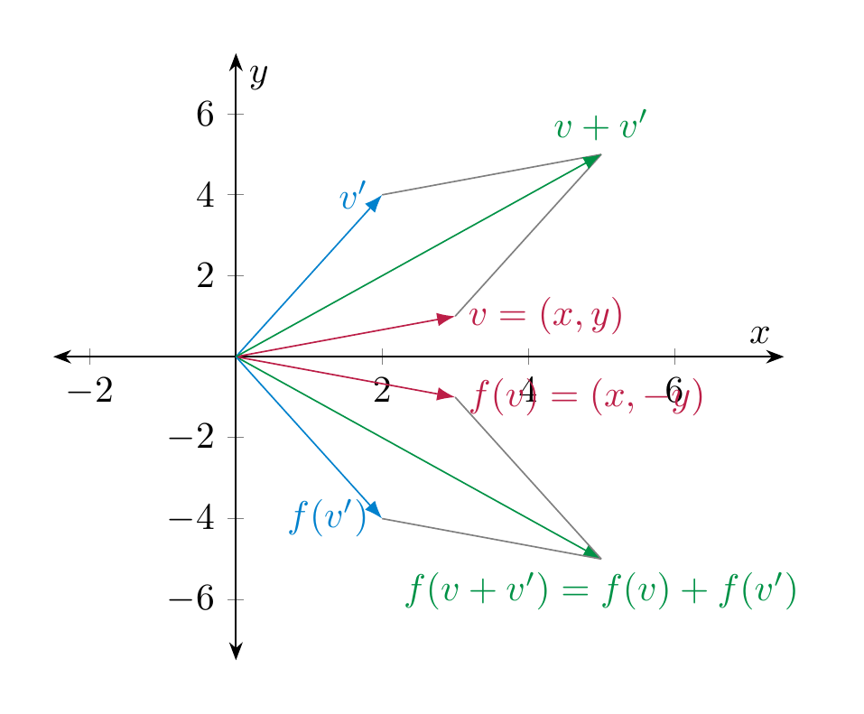

# Linear maps

Mathematical objects gain a lot of richness when they can be related to each other. In linear algebra, the objects of interest are vector spaces, and the way the relate to each other is by means of linear maps. The word “map” is being used as a synonym to the word “function”.

## Definition and first examples

<strong>Definition 4.1</strong> (Related exercises: <a href="../exercises-eigenvalues/#ex-eigenvalues-5-5">Exercise 6.13</a>, <a href="../exercises-euclid/#ex-euclid-poly-operator">Exercise 7.15</a>, <a href="../exercises-maps/#ex-maps-3-7">Exercise 4.17</a>, <a href="../exercises-maps/#ex-maps-exercise-011">Exercise 4.11</a>, <a href="../exercises-maps/#ex-maps-exercise-012">Exercise 4.12</a>, <a href="../exercises-maps/#ex-maps-exercise-015">Exercise 4.21</a>)

 Let $V, W$ be two vector spaces. A function $f : V \to W$ is called *linear* (or a *linear map*, or a *linear transformation*) if it satisfies the following conditions:

\[
\begin{align}
f(v+v') & = f(v) + f(v') & \text{for all }v, v' \in V
\end{align}
\]

<strong>(4.2)</strong>

 and

\[
\begin{align}
f(av) & = a f(v) & \text{for all }a \in {\bf R}, v \in V.
\end{align}
\]

<strong>(4.3)</strong>

 The vector space $V$ is called the *domain* of $f$, $W$ is called the *codomain* of $f$.

<strong>Remark 4.4</strong> (Related exercises: <a href="../exercises-maps/#ex-maps-3-7">Exercise 4.17</a>, <a href="../exercises-maps/#ex-maps-exercise-011">Exercise 4.11</a>, <a href="../exercises-maps/#ex-maps-exercise-012">Exercise 4.12</a>)

 These two conditions can be squeezed into one condition, by requiring that

\[
f(av' + a'v') = af(v) + a'f(v'),
\]

for all $a, a' \in {\bf R}$ and all $v, v' \in V$. This can be paraphrased by saying that $f$ preserves linear combinations.

Using that $0 \cdot v = 0_V$ (the zero vector in $V$), the above condition implies that

\[
f(0_V) = f(0 \cdot v) = 0 \cdot f(v) = 0_W.
\]

Thus, for a linear map, the zero vector of $V$ is mapped to the zero vector in $W$.

<strong>Example 4.5</strong>

 The map $f : {\bf R}^2 \to {\bf R}^2$, $f (x,y) := (x, -y)$ (i.e., *reflection* at the $x$-axis) is linear. This can be proven very simply algebraically: for <a href="#linear-sum" data-reference-type="eqref" data-reference="linear sum">Equation (4.2)</a>: if $v = (x,y)$ and $v' = (x', y') \in {\bf R}^2$, then

\[
f(v+v') = f((x+x', y+y')) = (x+x', -y-y') = (x,-y) + (x', -y') = f(v) + f(v').
\]

Checking <a href="#linear-scalar" data-reference-type="eqref" data-reference="linear scalar">Equation (4.3)</a> is similarly simple. The linearity of the map can also be visualized geometrically:

We will soon regard the preceding example as a special case of the multiplication of a vector with a matrix, namely in this case the matrix $\left ( \begin{array}{cc} 1 & 0 \\ 0 & -1 \end{array} \right )$, cf. §<a href="../maps-multiplication-of-a-matrix/#sect-matrix-vector-multiplication" data-reference-type="ref" data-reference="sect--matrix vector multiplication">Section 4.2</a>.

<iframe src="../visualizations/linear-map-2d.html" style="width:100%;height:520px;border:none;border-radius:6px;" loading="lazy"></iframe>

vis 8

<strong>Example 4.6</strong>

 The map

\[
D : {\bf R}[x] \to {\bf R}[x], D(f) := f',
\]

i.e., the *derivative* of $f$, is linear. This is true because we have the formulae (proven in calculus)

\[
(f+g)'(x) = f'(x) + g'(x), (af)'(x) = a f'(x).
\]

Alternatively, one may use that the derivative of a polynomial $f(x) = \sum_{n=0}^d a_n x^n$ is given by $f'(x) = \sum_{n=1}^d n a_n x^{n-1}$. Then, for $g = \sum_{n=0}^d b_n x^n$, we check <a href="#linear-sum" data-reference-type="eqref" data-reference="linear sum">Equation (4.2)</a>, say:

\[
\begin{align*}
(f+g)'(x) & = \left (\sum_{n=0}^d (a_n + b_n) x^n \right)' \\ & = \sum_{n=1}^d n (a_n+b_n) x^{n-1} \\ & = \sum_{n=1}^d n a_n x^{n-1} + \sum_{n=1}^d n b_n x^{n-1} \\ & = f'(x) + g'(x).
\end{align*}
\]

Here are a few slightly more abstract examples of linear maps, in which $V$ is an arbitrary vector space.

<strong>Example 4.7</strong> (Related exercises: <a href="../exercises-maps/#ex-maps-3-7">Exercise 4.17</a>)

- The *identity map* ${\mathrm {id}} := {\mathrm {id}}_V : V \to V$ which is given by ${\mathrm {id}}(v) := v$ is linear.

- For some other vector spaces $W$, the *zero map* $0 : V \to W$ is the map sending every vector $v$ to $0_W$. It is linear.

- For any real number $a \in {\bf R}$, the map given by scalar multiplication $V \to V$, $v \mapsto a \cdot v$ is linear. This follows from the conditions <a href="../spaces-definition-solution-of-homogeneous/#item-distributive-law" data-reference-type="ref" data-reference="item--distributive law">4.</a> and <a href="../spaces-definition-solution-of-homogeneous/#item-multiplication-law" data-reference-type="ref" data-reference="item--multiplication.law">6.</a> in the definition of a vector space (<a href="../spaces-definition-solution-of-homogeneous/#def-vector-space" data-reference-type="ref+Label" data-reference="def:vector-space">Definition 3.10</a>).

<strong>Non-Example 4.8</strong>

- The map $f : {\bf R} \to {\bf R}$, $f(x) := x^2$ is *not* linear. Indeed, $f(x + y) = (x+y)^2 = x^2 + 2xy + y^2 \ne x^2 + y^2  =f(x) + f(y)$. Also $f(ax) = a^2 x^2 \ne ax^2 = af(x)$.

- The map $f : {\bf R} \to {\bf R}$, $f(x) := x+1$ is *not* linear since again

\[
  f(x+y) = x+y+1 \ne (x+1) + (y+1) = f(x) + f(y).
\]

  Thus, <a href="#linear-sum" data-reference-type="eqref" data-reference="linear sum">Equation (4.2)</a> is violated. Also <a href="#linear-scalar" data-reference-type="eqref" data-reference="linear scalar">Equation (4.3)</a> is violated: $f(ax) = ax+1 \ne a(x+1) = af(x)$.

