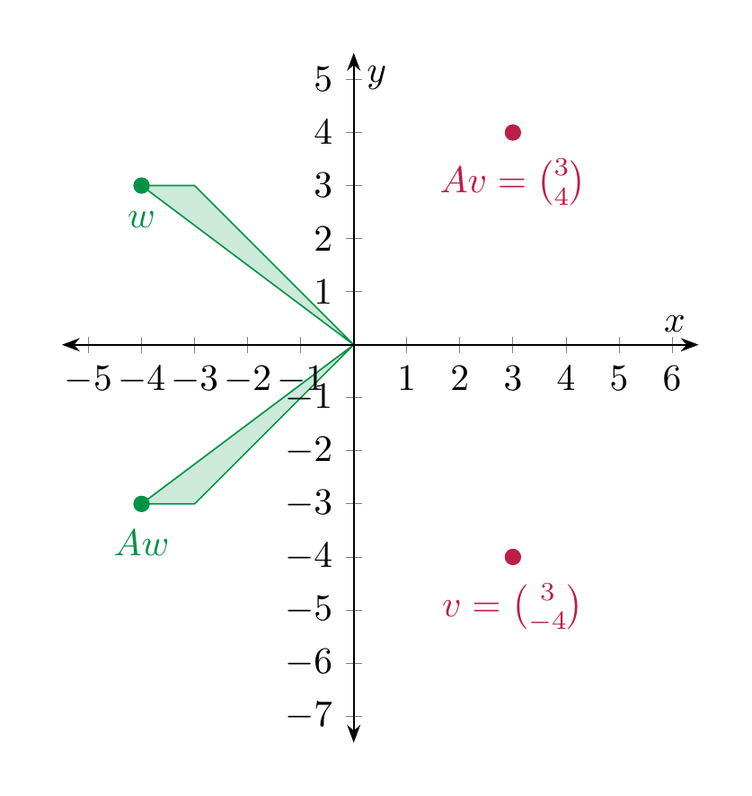
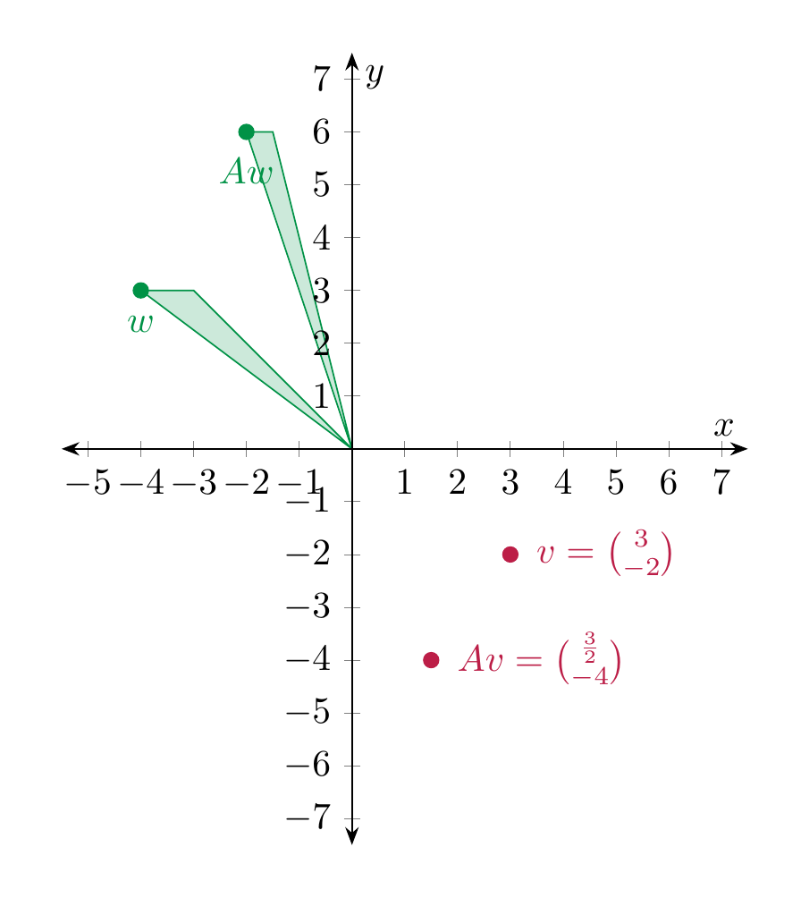
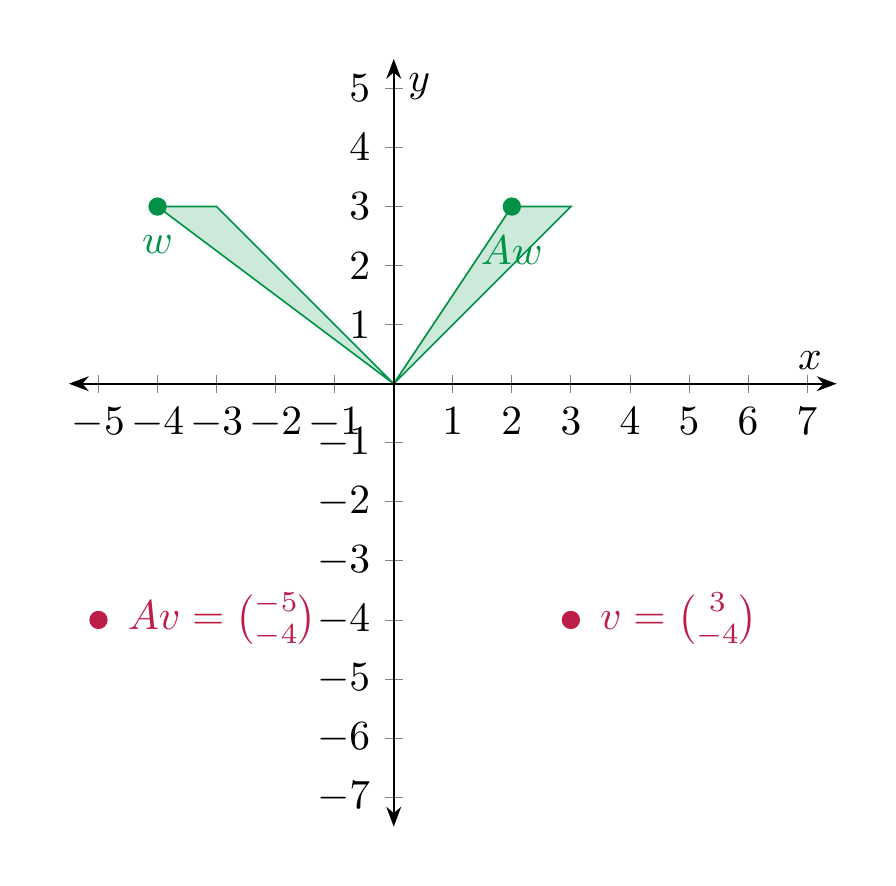
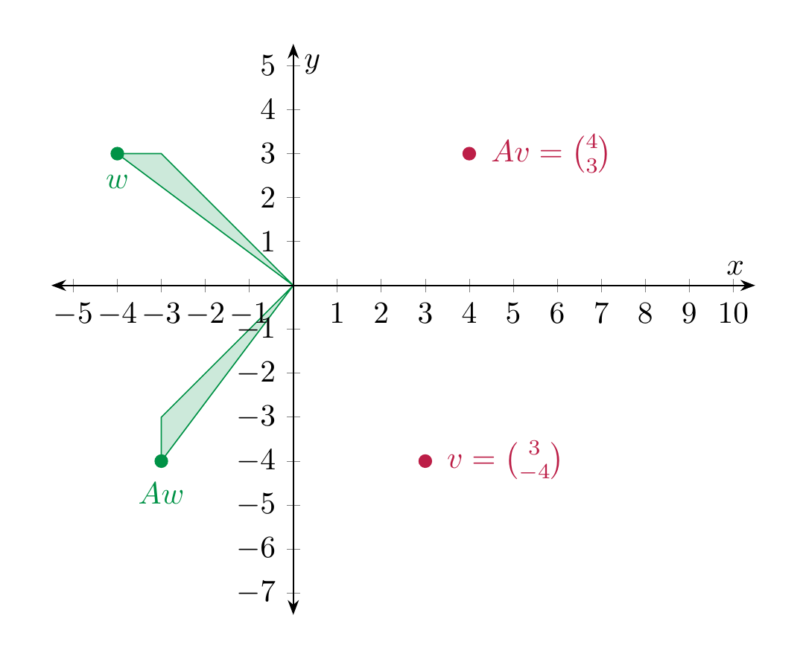
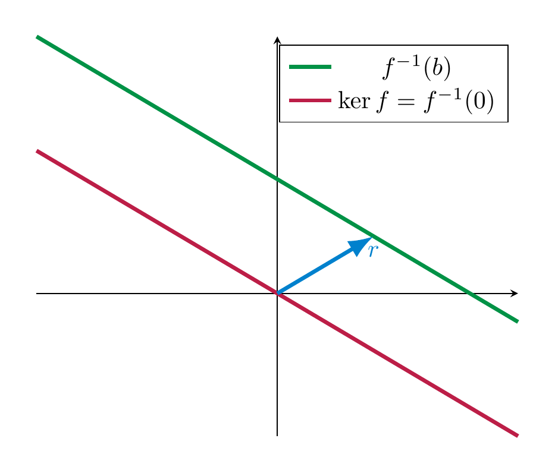
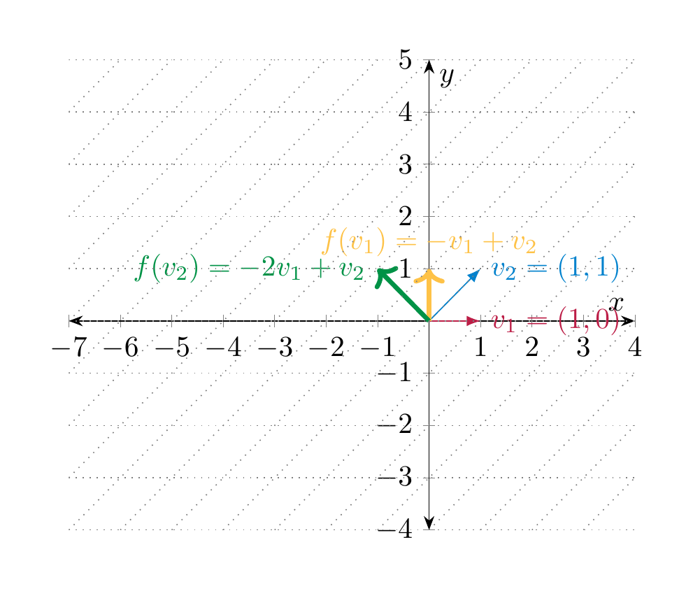
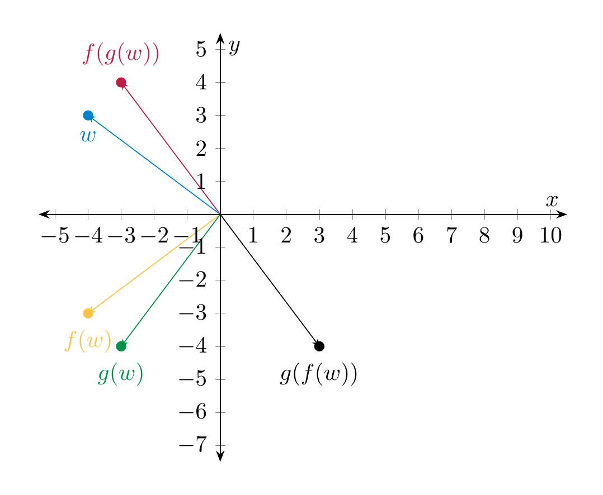

# Linear maps

Mathematical objects gain a lot of richness when they can be related to each other. In linear algebra, the objects of interest are vector spaces, and the way the relate to each other is by means of linear maps. The word “map” is being used as a synonym to the word “function”.

## Definition and first examples

<strong>Definition 4.1</strong>

 Let $V, W$ be two vector spaces. A function $f : V \to W$ is called *linear* (or a *linear map*, or a *linear transformation*) if it satisfies the following conditions:

\[
\begin{align}
f(v+v') & = f(v) + f(v') & \text{for all }v, v' \in V
\end{align}
\]

<strong>(4.2)</strong>

 and

\[
\begin{align}
f(av) & = a f(v) & \text{for all }a \in {\bf R}, v \in V.
\end{align}
\]

<strong>(4.3)</strong>

 The vector space $V$ is called the *domain* of $f$, $W$ is called the *codomain* of $f$.

<strong>Remark 4.4</strong>

 These two conditions can be squeezed into one condition, by requiring that

\[
f(av' + a'v') = af(v) + a'f(v'),
\]

for all $a, a' \in {\bf R}$ and all $v, v' \in V$. This can be paraphrased by saying that $f$ preserves linear combinations.

Using that $0 \cdot v = 0_V$ (the zero vector in $V$), the above condition implies that

\[
f(0_V) = f(0 \cdot v) = 0 \cdot f(v) = 0_W.
\]

Thus, for a linear map, the zero vector of $V$ is mapped to the zero vector in $W$.

<strong>Example 4.5</strong>

 The map $f : {\bf R}^2 \to {\bf R}^2$, $f (x,y) := (x, -y)$ (i.e., *reflection* at the $x$-axis) is linear. This can be proven very simply algebraically: for <a href="#linear-sum" data-reference-type="eqref" data-reference="linear sum">Equation (4.2)</a>: if $v = (x,y)$ and $v' = (x', y') \in {\bf R}^2$, then

\[
f(v+v') = f((x+x', y+y')) = (x+x', -y-y') = (x,-y) + (x', -y') = f(v) + f(v').
\]

Checking <a href="#linear-scalar" data-reference-type="eqref" data-reference="linear scalar">Equation (4.3)</a> is similarly simple. The linearity of the map can also be visualized geometrically:

We will soon regard the preceding example as a special case of the multiplication of a vector with a matrix, namely in this case the matrix $\left ( \begin{array}{cc} 1 & 0 \\ 0 & -1 \end{array} \right )$, cf. §<a href="#sect-matrix-vector-multiplication" data-reference-type="ref" data-reference="sect--matrix vector multiplication">1.2</a>.

<strong>Example 4.6</strong>

 The map

\[
D : {\bf R}[x] \to {\bf R}[x], D(f) := f',
\]

i.e., the *derivative* of $f$, is linear. This is true because we have the formulae (proven in calculus)

\[
(f+g)'(x) = f'(x) + g'(x), (af)'(x) = a f'(x).
\]

Alternatively, one may use that the derivative of a polynomial $f(x) = \sum_{n=0}^d a_n x^n$ is given by $f'(x) = \sum_{n=1}^d n a_n x^{n-1}$. Then, for $g = \sum_{n=0}^d b_n x^n$, we check <a href="#linear-sum" data-reference-type="eqref" data-reference="linear sum">Equation (4.2)</a>, say:

\[
\begin{align*}
(f+g)'(x) & = \left (\sum_{n=0}^d (a_n + b_n) x^n \right)' \\ & = \sum_{n=1}^d n (a_n+b_n) x^{n-1} \\ & = \sum_{n=1}^d n a_n x^{n-1} + \sum_{n=1}^d n b_n x^{n-1} \\ & = f'(x) + g'(x).
\end{align*}
\]

Here are a few slightly more abstract examples of linear maps, in which $V$ is an arbitrary vector space.

<strong>Example 4.7</strong>

- The *identity map* ${\mathrm {id}} := {\mathrm {id}}_V : V \to V$ which is given by ${\mathrm {id}}(v) := v$ is linear.

- For some other vector spaces $W$, the *zero map* $0 : V \to W$ is the map sending every vector $v$ to $0_W$. It is linear.

- For any real number $a \in {\bf R}$, the map given by scalar multiplication $V \to V$, $v \mapsto a \cdot v$ is linear. This follows from the conditions <a href="../spaces/#item-distributive-law" data-reference-type="ref" data-reference="item--distributive law">4.</a> and <a href="../spaces/#item-multiplication-law" data-reference-type="ref" data-reference="item--multiplication.law">6.</a> in the definition of a vector space (<a href="../spaces/#def-vector-space" data-reference-type="ref+Label" data-reference="def:vector-space">Definition 3.10</a>).

<strong>Non-Example 4.8</strong>

- The map $f : {\bf R} \to {\bf R}$, $f(x) := x^2$ is *not* linear. Indeed, $f(x + y) = (x+y)^2 = x^2 + 2xy + y^2 \ne x^2 + y^2  =f(x) + f(y)$. Also $f(ax) = a^2 x^2 \ne ax^2 = af(x)$.

- The map $f : {\bf R} \to {\bf R}$, $f(x) := x+1$ is *not* linear since again

\[
  f(x+y) = x+y+1 \ne (x+1) + (y+1) = f(x) + f(y).
\]

  Thus, <a href="#linear-sum" data-reference-type="eqref" data-reference="linear sum">Equation (4.2)</a> is violated. Also <a href="#linear-scalar" data-reference-type="eqref" data-reference="linear scalar">Equation (4.3)</a> is violated: $f(ax) = ax+1 \ne a(x+1) = af(x)$.

## Multiplication of a matrix with a vector

In this section, we define the multiplication of a matrix with a vector and show how this gives rise to a linear map. This is an extremely important way to construct linear maps.

<strong>Definition 4.9</strong>

 Let $A = (a_{ij})_{1 \le i \le m, 1 \le j \le n}$ (cf. <a href="../systems-matrices/#not-matrix-notation" data-reference-type="ref+Label" data-reference="not:matrix-notation">Notation 2.22</a>) be an $m \times n$-matrix and $v = \left ( \begin{array}{c} v_1 \\ \vdots \\ v_n \end{array} \right )$ be a $n \times 1$-matrix, i.e., a row vector with $n$ columns. The product of $A$ with $v$ is the $m \times 1$-vector

\[
A v := \left ( \begin{array}{c} a_{11} v_1 + a_{12} v_2 + \dots + a_{1n} v_n \\ \vdots \\ a_{m1} v_1 + a_{m2} v_2 + \dots + a_{mn} v_n \end{array} \right ).
\]

Thus, the $i$-th entry of the (column) vector $Av$ is computed by traversing the $i$-th row of $A$ and multiplying each entry of that row with the corresponding entry of $v$.

<strong>Example 4.10</strong>

 Here are two concrete examples:

\[
\begin{align*}
\left ( \begin{array}{cc} 4 & -1 \\ 2 & 1 \\ 0 & -2 \end{array} \right ) 
\left ( \begin{array}{c} 3 \\ 4 \end{array} \right ) & = \left ( \begin{array}{c} 4 \cdot 3 - 1 \cdot 4 \\ 2 \cdot 3 +1 \cdot 4 \\ 0 \cdot 3 - 2 \cdot 4 \end{array} \right ) = \left ( \begin{array}{c} 8 \\ 10 \\ -8 \end{array} \right ).\\ 
\left ( \begin{array}{ccc} 1 & 3 & -2 \\ 0 & 1 & 0 \\ 1 & 0 & -1 \end{array} \right ) \left ( \begin{array}{c} 1 \\ 2 \\ -1 \end{array} \right ) & = \left ( \begin{array}{c} 1 \cdot 1 + 3 \cdot 2 + (-2) \cdot (-1) \\ {} \\ \end{array} \right ) = \left ( \begin{array}{c} 9 \\ {} \\ \end{array} \right ).
\end{align*}
\]

It makes perfectly good sense to consider matrices whose entries are variables. Compute:

\[
\left ( \begin{array}{ccc} 1 & 3 & -2 \\ 0 & 1 & 0 \\ 1 & 0 & -1 \end{array} \right ) \left ( \begin{array}{c} x \\ y \\ z \end{array} \right ) = \left ( \begin{array}{c} 1 \cdot x + 3 \cdot y + (-2) \cdot z \\ {} \\ \end{array} \right ) = \left ( \begin{array}{c} x+3y-2z \\ {} \\ \end{array} \right ).
\]

Thus, the equation (of column vectors consisting of 3 rows)

\[
\left ( \begin{array}{ccc} 1 & 3 & -2 \\ 0 & 1 & 0 \\ 1 & 0 & -1 \end{array} \right ) \left ( \begin{array}{c} x \\ y \\ z \end{array} \right ) = \left ( \begin{array}{c} 3 \\ 4 \\ -2 \end{array} \right )
\]

is a *very convenient* way to write down the linear system

\[
\begin{align*}
x + 3y-2z & = 1 \\
y & = 4 \\
x - z & = -2.
\end{align*}
\]

This shows that the product of matrices with column vectors is very useful in enconding linear systems. We record this observation in the due generality:

<strong>Observation 4.11</strong>

 Let

\[
A = \left ( \begin{array}{ccc} a_{11} & \dots & a_{1n} \\ \vdots & \ddots & \vdots \\ a_{m1} & \dots & a_{mn} \end{array} \right )
\]

be an $m \times n$-matrix and

\[
x = \left ( \begin{array}{c} x_1 \\ \vdots \\ x_n \end{array} \right )
\]

be a column vector with $n$ rows and

\[
b = \left ( \begin{array}{c} b_1 \\ \vdots \\ b_m \end{array} \right )
\]

be a column vector with $m$ rows. Then the equation

\[
A x = b
\]

is equivalent to the linear system (in the unknowns $x_1, \dots, x_n$, consisting of $m$ equations)

\[
\begin{align*}
a_{11} x_1 + \dots + a_{1n} x_n & = b_1 \\
\vdots \\
a_{m1} x_1 + \dots + a_{mn} x_n & = b_m. \\
\end{align*}
\]

### The case of $2 \times 2$-matrices

The process of multiplying a matrix with a column vector is also geometrically very important. We now investigate this in more detail in the case where

\[
A = \left ( \begin{array}{cc} a_{11} & a_{12} \\ a_{21} & a_{22} \end{array} \right ) \in {\mathrm {Mat}}_{2 \times 2}.
\]

For a column vector $v = \left ( \begin{array}{c} v_1 \\ v_2 \end{array} \right )$ the product is, according to <a href="#def-product-matrix-vector" data-reference-type="ref+Label" data-reference="def:product-matrix-vector">Definition 4.9</a>,

\[
Av = \left ( \begin{array}{c} a_{11} v_1 + a_{12} x_2 \\ a_{21} v_1 + a_{22} v_2 \end{array} \right ).
\]

\[
Av = \left ( \begin{array}{c} a_{11} v_1 + a_{12} x_2 \\ a_{21} v_1 + a_{22} v_2 \end{array} \right ).
\]

<strong>(4.12)</strong>

 In keeping with traditional notation from geometry, we will instead write the vector $v$ as $\left ( \begin{array}{c} x \\ y \end{array} \right )$, in which case

\[
Av = \left ( \begin{array}{c} a_{11} x + a_{12} y \\ a_{21} x + a_{22} y \end{array} \right ).
\]

It is useful to organize this situation into a function, namely the function that sends the vector $v$ to the vector $Av$. We obtain a function

\[
f : {\bf R}^2 \to {\bf R}^2, v \mapsto Av \ \text{(read ``$v$ maps to $Av$''.)}
\]

Of course, since $Av$ depends on the entries of $A$, so does this function $f$.

#### Reflections

<strong>Example 4.13</strong>

 We consider $A = \left ( \begin{array}{cc} 1 & 0 \\ 0 & -1 \end{array} \right )$. According to the above we have

\[
Av = \left ( \begin{array}{c} x \\ -y \end{array} \right ).
\]

We plot a few points $v$ and the corresponding $Av$:

Thus, geometrically, $Av$ is the point $v$ reflected along the $x$-axis.

#### Rescalings

<strong>Example 4.14</strong>

 The matrix $A = \left ( \begin{array}{cc} \frac 12 & 0 \\ 0 & 1 \end{array} \right )$ describes the map that compresses everything in the $x$-direction by the factor $\frac 12$, and leaves the $y$-direction untouched.

<strong>Example 4.15</strong>

 If $r$, $s$ are two real numbers,

\[
A = \left ( \begin{array}{cc} r & 0 \\ 0 & s \end{array} \right )
\]

rescales the $x$-direction by a factor $r$ (so it shrinks for $r < 1$ and enlarges for $r > 1$) and rescales the $y$-direction by a factor $s$.

For $A = \left ( \begin{array}{cc} \frac 12 & 0 \\ 0 & 2 \end{array} \right )$, this looks as follows:

#### Shearing

<strong>Example 4.16</strong>

 For a fixed real number $r$, the matrix

\[
A = \left ( \begin{array}{cc} 1 & r \\ 0 & 1 \end{array} \right )
\]

sends $v$ to $Av = \left ( \begin{array}{c} x+ry \\ y \end{array} \right )$. Thus it is a shearing operation. In the following picture $A = \left ( \begin{array}{cc} 1 & 2 \\ 0 & 1 \end{array} \right )$.

#### Rotations

We now consider rotations.

<strong>Example 4.17</strong>

 For $A = \left ( \begin{array}{cc} 0 & -1 \\ 1 & 0 \end{array} \right )$, the vector $Av = \left ( \begin{array}{c} -y \\ x \end{array} \right )$. Geometrically, the function $v \mapsto Av$ is a counterclockwise rotation by $90^\circ$.

For $A = \left ( \begin{array}{cc} -1 & 0 \\ 0 & 1 \end{array} \right )$, the vector $Av = \left ( \begin{array}{c} -x \\ y \end{array} \right )$ so the function $v \mapsto Av$ describes a counterclockwise rotation by $180^\circ$ (or, what is the same, a clockwise rotation by $180^\circ$).

For more general rotations, we use basic properties of the trignometric functions, e.g., as recalled in §<a href="../appendix/#sect-trigonometric-functions" data-reference-type="ref" data-reference="sect--trigonometric functions">Chapter B</a>.

<strong>Example 4.18</strong>

 In general, for any $r \in {\bf R}$ the matrix

\[
A = \left ( \begin{array}{cc} \cos r & -\sin r \\ \sin r & \cos r \end{array} \right )
\]

is such that the function

\[
v \mapsto Av = \left ( \begin{array}{c} \cos r x - \sin r y \\ \sin r x + \cos r y \end{array} \right )
\]

is a (counter-clockwise) rotation by $r$. For this reason, $A$ is called a *rotation matrix*.

In the following illustration, $A = \left ( \begin{array}{cc} 0 & -1 \\ 1 & 0 \end{array} \right )$.

We regard a vector $v = \left ( \begin{array}{c} v_1 \\ \vdots \\ v_n \end{array} \right )$ as an element of ${\bf R}^n$. (Thus, instead of using the notation $(v_1, \dots, v_n)$ for an ordered tuple, as in <a href="../spaces/#def-ordered-tuple" data-reference-type="ref+Label" data-reference="def:ordered-tuple">Definition 3.1</a>, we write the $n$ numbers underneath in a row.) Fix an $m \times n$-matrix $A$. Then the product $Av$, which is an column vector with $m$ entries, is an element in ${\bf R}^m$. We now regard this matrix $A$ as fixed, and consider the vector $v$ as a variable. In other words, we consider the function (or map)

\[
{\bf R}^n \to {\bf R}^m, v \mapsto A v.
\]

Matrix multiplication has the following basic, but crucial property.

<strong>Proposition 4.19</strong>

 For any $m \times n$-matrix $A$, the above map is linear.

*Proof.* We prove this in the case $m = n = 2$ using . (The case of general $m$ and $n$ is just notationally more involved, but otherwise the same.) Let $v = \left ( \begin{array}{c} v_1 \\ v_2 \end{array} \right )$, $v' = \left ( \begin{array}{c} v'_1 \\ v'_2 \end{array} \right )$. Then

\[
\begin{align*}
A v + A v' & = \left ( \begin{array}{c} a_{11} v_1 + a_{12} v_2 \\ a_{21} v_1 + a_{22} v_2 \end{array} \right ) + \left ( \begin{array}{c} a_{11} v'_1 + a_{12} v'_2 \\ a_{21} v'_1 + a_{22} v'_2 \end{array} \right ) \\ & =
\left ( \begin{array}{c} a_{11} (v_1+v'_1) + a_{12} (v_2+v'_2) \\ a_{21} (v_1+v'_1) + a_{22} (v_2+v'_2) \end{array} \right ) \\ & = A \left ( \begin{array}{c} v_1+v_2 \\ v'_1 + v'_2 \end{array} \right ) \\ & = A (v+v').
\end{align*}
\]

Likewise, one checks <a href="#linear-scalar" data-reference-type="eqref" data-reference="linear scalar">Equation (4.3)</a>, i.e., that for $a \in R$,

\[
\begin{align*}
A (av) &=  A \left ( \begin{array}{c} av_1 \\ a v_2 \end{array} \right ) \\ & = \left ( \begin{array}{c} a_{11} a v_1 + a_{12} a v_2 \\ a_{21} a v_1 + a_{22} a v_2 \end{array} \right ) \\ & =a \left ( \begin{array}{c} a_{11} v_1 + a_{12} v_2 \\ a_{21} v_1 + a_{22} v_2 \end{array} \right ) \\ & = a A v \\ &  =  a (A v).
\end{align*}
\]

 ◻

## Outlook: current research

Since matrix multiplication is such a key asset, it is of great interest to perform this process as efficiently as possible. Given two $2 \times 2$-matrices $A$ and $B$, the computation of $AB$ by just following the definition takes 8 multiplications, namely

\[
a_{ie} b_{ej}
\]

for each of the indices $i, j, e$ being either 1 or 2. In the 1960’s an algorithm (<https://en.wikipedia.org/wiki/Strassen_algorithm>) was found that only requires 7 multiplications. By applying that algorithm iteratively for larger matrices, this gives a decidedly better algorithm. Current research is using methods of artificial intelligence to try and come up with similar methods for $3 \times 3$- and other matrices. Check out this interesting lay-accessible article on recent trends: <https://www.quantamagazine.org/ai-reveals-new-possibilities-in-matrix-multiplication-20221123/>!

## Kernel and image of a linear map

The kernel and the image of a linear map are an important measure how, roughly speaking, interesting this map is. E.g., the zero map ${\bf R}^2 \to {\bf R}^2$, $\left ( \begin{array}{c} x \\ y \end{array} \right )  \mapsto \left ( \begin{array}{c} 0 \\ 0 \end{array} \right )$ is certainly very boring in the sense that it only produces the zero vector in ${\bf R}^2$. By contrast, say, a rotation (by a fixed angle $r$) in ${\bf R}^2$ is more interesting, since any point in ${\bf R}^2$ can be obtained from another point by rotating by that angle $r$.

In order to introduce kernel and image, we need the following general notions related to maps between sets.

<strong>Definition 4.20</strong>

   Let $f : X \to Y$ be a function between two sets.

- The *preimage* of some element $y \in Y$ is

\[
  f^{-1}(y) := \{ x \in X \ | \ f(x) = y\} \ (\subset X).
\]

- The *image* of $f$ is defined as

\[
  {\operatorname{im}\ } (f) := f(X) := \{ f(x) \ | \ x \in X \} \ (\subset Y).
\]

- $f$ is called *injective* (or *one-to-one*) if for each $y$, the preimage $f^{-1}(y)$ contains *at most* one element.

- $f$ is called *surjective* (or *onto*) if for each $y$, $f^{-1}(y)$ contains *at least* one element. Equivalently, $f$ is surjective if ${\operatorname{im}\ } (f) = Y$.

- $f$ is called *bijective* if it is both injective and surjective. In other words, if for each $y \in Y$, $f^{-1}(y)$ contains exactly one element.

<strong>Example 4.21</strong>

 While in the applications below, we will often consider $X$ and $Y$ to be vector spaces, <a href="#def-inj-surj-bij" data-reference-type="ref+Label" data-reference="def:inj-surj-bij">Definition 4.20</a> applies to maps between arbitrary sets. For example, consider a group of $n$ people $\{P_1, \dots, P_n \}$. Consider the function

\[
m : \{P_1, \dots, P_n \} \to \{1, 2, \dots, 12\}
\]

that assigns to each person their month of birth. This function is surjective if for each month, one of the persons is born in that month. It is injective, if in each month only one birthday party is happening. It is bijective if both conditions are true, i.e., in every month there is exactly one birthday party (for one of the persons).

In the example above, the map $m$ can only be bijective if $n = 12$, i.e., if the size of the two sets is the same. For linear maps (between vector spaces) we want to articulate a similar idea, but simply saying that the size of the vector spaces are the same is insufficient, since ${\bf R}$, ${\bf R}^2$, ${\bf R}^3$ etc. all have infinitely many elements. Rather, we will see in <a href="#cor-maps-dim" data-reference-type="ref+Label" data-reference="cor:maps-dim">Corollary 4.28</a> that the dimension of a vector space is the correct notion of size.

<strong>Definition 4.22</strong>

 Let $f : V \to W$ be a linear map. The *kernel* of $f$ is defined as

\[
\begin{align*}
\ker (f) & := f^{-1}(0_W) \\ & = \{ v\in V \ | \ f(v) = 0_W \}.
\end{align*}
\]

Note that $\ker (f) \subset V$ and ${\operatorname{im}\ } (f) \subset W$. In fact, these are not just arbitrary subsets:

<strong>Proposition 4.23</strong>

 For a *linear* map $f: V \to W$, $\ker f$ is a sub*space* of $V$, while ${\operatorname{im}\ } f$ is a sub*space* of $W$.

*Proof.* We only check the conditions in <a href="../spaces/#def-subspace" data-reference-type="ref+Label" data-reference="def:subspace">Definition 3.17</a> for the kernel. (The case of the image is similar.)

- $0_V \in \ker f$: this means that $f(0_V) = 0_W$, which holds by <a href="#rem-linear-map-basic" data-reference-type="ref+Label" data-reference="rem:linear-map-basic">Remark 4.4</a>.

- For $v, v' \in \ker f$ we check $v+v' \in \ker f$: this means $f(v+v') = 0_W$. Indeed, using that $f$ is linear we have

\[
  f(v+v') = f(v) + f(v') = 0_W + 0_W = 0_W.
\]

- For $v \in \ker f$ and $a \in {\bf R}$, we check $av \in \ker f$: as before, using the linearity of $f$, we have

\[
  f(av) = af(v) = a\cdot 0_W = 0_W.
\]

 ◻

<strong>Example 4.24</strong>

 We consider the matrix

\[
A = \left ( \begin{array}{ccc} 1 & 2 & 0 \\ 2 & 4 & 0 \end{array} \right )
\]

and the associated linear map

\[
f : {\bf R}^3 \to {\bf R}^2, v = \left ( \begin{array}{c} x \\ y \\ z \end{array} \right ) \mapsto Av = \left ( \begin{array}{c} x+2y \\ 2x+4y \end{array} \right ).
\]

The kernel of $f$ consists of vectors $v$ such that

\[
\begin{align*}
x+2y & = 0 \\ 2x+4y & =0.
\end{align*}
\]

This tells us that the kernel of $f$, or equivalently the solutions of this system (in the unknowns $x, y$ and $z$!), is

\[
\ker f = \left \{\left ( \begin{array}{c} -2y \\ y \\ z \end{array} \right ) \in {\bf R}^3 \ | \ y, z \in {\bf R} \right \}.
\]

A basis of $\ker f$ is given by the two vectors $\left ( \begin{array}{c} -2 \\ 1 \\ 0 \end{array} \right )$ and $\left ( \begin{array}{c} 0 \\ 0 \\ 1 \end{array} \right )$.

The image of $f$ consists of all vectors of the form

\[
v = \left ( \begin{array}{c} v_1 \\ v_2 \end{array} \right ) = \left ( \begin{array}{c} x+2y \\ 2x+4y \end{array} \right ),
\]

with arbitrary $x, y \in {\bf R}$. (Also, the $z$ is arbitrary, but it does not show up in $f$.) This means that $v_2 = 2 v_1$, and $v_1$ is an arbitrary real number. Thus

\[
{\operatorname{im}\ } f = \left \{ \left ( \begin{array}{c} v_1 \\ 2v_1 \end{array} \right ) \ | \ v_1 \in {\bf R} \right \} \subset {\bf R}^2.
\]

A basis of ${\operatorname{im}\ } f$ is thus given by the vector $\left ( \begin{array}{c} 1 \\ 2 \end{array} \right )$.

Our goal below is to develop an algorithmic method that determine bases of $\ker f$, ${\operatorname{im}\ } f$. For now, just observe that in the example above

\[
\dim (\ker f) + \dim ({\operatorname{im}\ } f) = 2 + 1 = 3 = \dim {\bf R}^3.
\]

This is an example of the rank-nullity theorem (<a href="#thm-rank-nullity-theorem" data-reference-type="ref+Label" data-reference="thm:rank-nullity-theorem">Theorem 4.26</a>) below.

Injectivity of *linear* maps can be measured in terms of the kernel:

<strong>Lemma 4.25</strong>

 Let $f : V \to W$ be a linear map. Then the following are equivalent (i.e., one condition holds if and only if the other holds):

1.  $f$ is injective,

2.  $\ker f = \{0_V\}$.

*Proof.* Suppose $f$ is injective, we prove $\ker f = \{0\}$. Since $f(0) = 0$ by linearity (<a href="#rem-linear-map-basic" data-reference-type="ref+Label" data-reference="rem:linear-map-basic">Remark 4.4</a>), we have $0 \in \ker f$. If $v \in \ker f$, then $f(v) = 0_W$, so both $v$ and $0_V$ are in the preimage of $0_W$. By the injectivity of $f$, this forces $v = 0$.

Conversely, suppose $\ker f = 0$. Suppose two vectors $v, v' \in V$ are in the preimage of some $w \in W$, i.e., $f(v) = f(v') = w$. Then, by linearity of $f$

\[
f(v-v') = f(v+(-1)v') = f(v) + (-1) f(v') = f(v) - f(v') = 0.
\]

Thus, $v-v' \in \ker f$, which means by assumption that $v-v'=0$. That is: $v = v'$. Therefore $f$ is injective. ◻

<strong>Theorem 4.26</strong>

 (*Rank-nullity theorem*) Let $f: V \to W$ be a map between (finite-dimensional) vector spaces. Then

\[
\dim (\ker f) + \dim ({\operatorname{im}\ } f) = \dim V.
\]

The *rank* of $f$ is defined to be

\[
{\operatorname {rk}} f := \dim ({\operatorname{im}\ } f),
\]

while the *nullity* of $f$ is defined to be $\dim (\ker f)$.

A proof of this theorem appears in any linear algebra textbook, e.g. . As a remark on the proof, we note that one can prove the following fact, which is very useful in its own right.

<strong>Theorem 4.27</strong>

 Let $f: V \to W$ be a linear map. Let

\[
v_1, \dots, v_r, v_{r+1}, \dots v_n
\]

be a basis of $V$ such that

\[
v_1, \dots, v_r
\]

is a basis of $\ker f$. Then $f(v_{r+1}), \dots, f(v_n)$ is a basis of ${\operatorname{im}\ } f$.

The following facts are immediate consequences of the rank-nullity theorem.

<strong>Corollary 4.28</strong>

 Let $f : V \to W$ be a linear map between finite-dimensional vector spaces.

1.  If $f$ is injective then $\dim V \le \dim W$ (since then $\ker f = \{0\}$, i.e., $\dim \ker f = 0$).

2.  If $f$ is surjective then $\dim V \ge \dim W$ (since them ${\operatorname{im}\ } f = W$, so $\dim {\operatorname{im}\ } f = \dim W$).

3.   If $f$ is bijective then $\dim V = \dim W$.

4.  The preceding three statements can in general not be reversed: if, say, $\dim V \le \dim W$, $f$ need not be injective. For example the zero map $V \to W$, $v \mapsto 0$ is *never* injective if $V \ne \{ 0\}$.

5.   Suppose in addition that $\dim V = \dim W$. In this case $f$ is injective precisely if $f$ is surjective. (If $f$ is injective, then $\dim {\operatorname{im}\ } f = \dim V = \dim W$, so that ${\operatorname{im}\ } f = W$ by <a href="../spaces/#thm-basis-theorem" data-reference-type="ref+Label" data-reference="thm:basis-theorem">Theorem 3.68</a><a href="../spaces/#item-dim-subspace" data-reference-type="ref" data-reference="item--dim.subspace">3.</a>. Similarly, if $f$ is surjective, then $\dim {\operatorname{im}\ } f = \dim W = \dim V$, so $\dim \ker f = 0$, so that $\ker f = \{ 0\}$.)

An important case of this theorem is where $f : {\bf R}^n \to {\bf R}^m$ is the linear map given by multiplication with a fixed $m \times n$-matrix $A$. We call the *rank* of $A$, resp. the *nullity* the rank, resp. nullity of that linear map. The rank is denoted by ${\operatorname {rk}} A$. These are two highly important numbers associated to a matrix, so we want to have a device for computing them. This is based on the following computation: recall from <a href="#ex-standard-basis" data-reference-type="ref+Label" data-reference="ex:standard-basis">Example 3.59</a> the standard basis vectors

\[
e_1 = (1, 0, \dots, 0), e_2 = (0, 1, 0, \dots 0), \dots, e_n = (0, \dots, 0,  1) \in {\bf R}^n.
\]

We will in the sequel write them as column vectors, so $e_1 = \left ( \begin{array}{c} 1 \\ 0 \\ \vdots \\ 0 \end{array} \right )$ etc. Then we have

\[
f(e_i) = A e_i = \left ( \begin{array}{c} a_{11} \cdot 0 + \dots + a_{1i} \cdot 1 + \dots + a_{1n} \cdot 0 \\ \vdots \\ a_{m1} \cdot 0 + \dots + a_{mi} \cdot 1 + \dots + a_{mn} \cdot 0 \end{array} \right ) = \left ( \begin{array}{c} a_{1i} \\ \vdots \\ a_{mi} \end{array} \right ).
\]

\[
A e_i = \left ( \begin{array}{c} a_{1i} \\ \vdots \\ a_{mi} \end{array} \right ).
\]

<strong>(4.29)</strong>

 In other words, the product $A e_i$ is precisely the $i$-th column of the matrix $A$!

Since any vector $v \in {\bf R}^n$ is a linear combination of the $e_i$, we have, for appropriate $b_1, \dots, b_n \in {\bf R}$

\[
f(v) = f(\sum_{i=1}^n b_i e_i) = \sum_{i=1}^n b_i f(e_i).
\]

Thus, $f(v)$ is a linear combination of the columns of $A$. This proves the following statement:

<strong>Proposition 4.30</strong>

 Let $A$ be an $m \times n$-matrix and $f : {\bf R}^n \to {\bf R}^m$ the linear map given by multiplication with $A$. We write

\[
A = (c_1 \ c_2 \ \dots c_n),
\]

i.e., the $c_i (\in {\bf R}^m)$ is the $i$-th column of $A$. Then

\[
{\operatorname{im}\ } f = L(c_1, \dots, c_n).
\]

This subspace of ${\bf R}^m$ is also called the *column space* of $A$.

<strong>Definition 4.31</strong>

 The *row space* of $A$ is the subspace of ${\bf R}^n$ spanned by the rows of the matrix $A$.

We can compute the rank of $A$, i.e., $\dim {\operatorname{im}\ } f$, as follows:

<strong>Proposition 4.32</strong>

 Let $A$ be an $m \times n$-matrix. Suppose $B$ is a (possibly non-reduced) row-echelon matrix obtained from $A$ by means of elementary row operations (<a href="../systems-gaussian-elimination/#def-elementary-row-operations" data-reference-type="ref+Label" data-reference="def:elementary-row-operations">Definition 2.28</a>).

1.   Then the non-zero rows of $B$ form a basis of the row space of $A$.

2.   If the leading ones of $B$ lie in the columns $j_1, \dots, j_r$, then these columns of $A$ form a basis of the column space of $A$.

3.   The following numbers are all the same: a) ${\operatorname {rk}} A$, b) the dimension of the column space, c) the dimension of the row space of $A$, d) the number of leading ones in $B$.

4.   The nullity of $A$ equals $n$ (the number of columns of $A$) minus any of the quantities in the previous point.

*Proof.* Parts <a href="#item-blah-x1" data-reference-type="ref" data-reference="item--blah.x1">1.</a> and <a href="#item-blah-x2" data-reference-type="ref" data-reference="item--blah.x2">2.</a> can be proven by showing that the row and column space of $A$ do not change when one performs an elementary row operation to $A$. We skip this part of the proof (e.g., see for a proof).

<a href="#item-blah-x3" data-reference-type="ref" data-reference="item--blah.x3">3.</a> follows from the first two: by definition, ${\operatorname {rk}} A = \dim {\operatorname{im}\ } f$ equals, by <a href="#prop-image-column-space" data-reference-type="ref+Label" data-reference="prop:image-column-space">Proposition 4.30</a>, the dimension of the column space. By the second statement, this is equal to the number of leading ones in $B$. Since $B$ is a row-echelon matrix, this is also the number of non-zero rows, i.e., by the first statement, the dimension of the row space.

Finally, <a href="#item-blah-x4" data-reference-type="ref" data-reference="item--blah.x4">4.</a> is a consequence of the rank-nullity-theorem. ◻

<strong>Example 4.33</strong>

 Consider the matrix

\[
A = \left ( \begin{array}{cccc} 1 & 2 & 2 & -1 \\ 3 & 6 & 5 & 0 \\ 1 & 2 & 1 & 2 \end{array} \right )
\]

and the linear map

\[
f : {\bf R}^4 \to {\bf R}^3, v \mapsto Av.
\]

The row space is the subspace of ${\bf R}^4$ spanned by the vectors $(1 \ 2 \ 2 \ -1)$ etc., while the column space is the subspace of ${\bf R}^3$ spanned by the vectors $\left ( \begin{array}{c} 1 \\ 3 \\ 1 \end{array} \right )$ etc. We compute a basis of these two spaces as follows:

\[
A \leadsto \left ( \begin{array}{cccc} 1 & 2 & 2 & -1 \\ 0 & 0 & -1 & 3 \\ 0 & 0 & -1 & 3 \end{array} \right )  \leadsto \left ( \begin{array}{cccc} 1 & 2 & 2 & -1 \\ 0 & 0 & -1 & 3 \\ 0 & 0 & 0 & 0 \end{array} \right ) \leadsto \left ( \begin{array}{cccc} 1 & 2 & 2 & -1 \\ 0 & 0 & 1 & -3 \\ 0 & 0 & 0 & 0 \end{array} \right ).
\]

Thus, the vectors $(1, 2, 2, -1)$ and $(0, 0, 1, -3)$ form a basis of the row space. In particular, its dimension is two. The first and third row of $A$ form a basis of the column space of $A$, i.e.,

\[
{\operatorname{im}\ } f = L(\left ( \begin{array}{c} 1 \\ 3 \\ 1 \end{array} \right ), \left ( \begin{array}{c} 2 \\ 5 \\ 1 \end{array} \right )).
\]

Thus

\[
\dim {\operatorname{im}\ } f = {\operatorname {rk}} f = {\operatorname {rk}} A = 2.
\]

According to the rank-nullity theorem (<a href="#thm-rank-nullity-theorem" data-reference-type="ref+Label" data-reference="thm:rank-nullity-theorem">Theorem 4.26</a>),

\[
\dim \ker f = \dim {\bf R}^4 - \dim {\operatorname{im}\ } f = 4 - 2 = 2,
\]

(i.e., the nullity of $f$ or of $A$ is 2). In order to determine a basis of $\ker f$, we denote the coordinates in ${\bf R}^4$ by $x_1, \dots, x_4$. Then, according to Gaussian elimination, the variables $x_2$ and $x_4$ are free variables, and $x_3 = 3 x_4$ from the second row above, and then $x_1 = -2x_2 - 2x_3 + x_4 = -2x_2 -5x_4$. Thus a basis of $\ker f$ is given by the vectors

\[
\left ( \begin{array}{c} -2 \\ 1 \\ 0 \\ 0 \end{array} \right ), \left ( \begin{array}{c} -5 \\ 0 \\ 3 \\ 1 \end{array} \right ).
\]

This reconfirms that $\dim \ker f = 2$.

<strong>Remark 4.34</strong>

 Even though the dimension of the row space and the column space are the same, these vector spaces themselves are *not* the same. In fact, they are not even comparable, given that the row space is a subspace of ${\bf R}^n$, while the column space is a subspace of ${\bf R}^m$.

Here is another consequence of the rank-nullity theorem.

<strong>Theorem 4.35</strong>

(stated above in <a href="../spaces/#thm-dim-cap-sum" data-reference-type="ref+Label" data-reference="thm:dim-cap-sum">Theorem 3.74</a>)  Suppose $A, B \subset V$ are two subspaces of a vector space. Then

\[
\dim (A \cap B) + \dim (A + B) = \dim A + \dim B.
\]

*Proof.* The map

\[
f : A \oplus B \to V, (a, b) \mapsto a-b
\]

is linear. Since for every $b \in B$ also $b' := -b$ is contained in $B$, the image of this map is $A + B$. The kernel of $f$ consists of those vectors $(a,b) \in A \oplus B$ such that $a - b = 0$, i.e., $a = b$. This means that $a \in A \cap B$. Therefore, the rank nullity theorem and <a href="../spaces/#ex-dimensions-examples" data-reference-type="ref+Label" data-reference="ex:dimensions-examples">Example 3.64</a> tell us

\[
\dim (A \cap B) + \dim (A + B) = \dim \ker f + \dim {\operatorname{im}\ } f = \dim (A \oplus B) = \dim A + \dim B.
\]

 ◻

## Revisiting linear systems

In this section, we apply our findings from above to the problem of solving a linear system

\[
\begin{align*}
a_{11} x_1 + \dots + a_{1n} x_n & = b_1\\
\vdots \\  
a_{m1} x_1 + \dots + a_{mn} x_n & = b_m
\end{align*}
\]

Throughout, let $A = (a_{ij})$ be the $m \times n$-matrix formed by the coefficients of that linear system. Recall that the vector

\[
b := \left ( \begin{array}{c} b_1 \\ \vdots \\ b_m \end{array} \right )
\]

is called the vector of *constants*. We will also consider the linear map (<a href="#prop-matrix-linear-map" data-reference-type="ref+Label" data-reference="prop:matrix-linear-map">Proposition 4.19</a>)

\[
f : {\bf R}^n \to {\bf R}^m, v \mapsto Av.
\]

<strong>Theorem 4.36</strong>

1.  Suppose momentarily that $b_1 = \dots = b_m = 0$, so the above system is homogeneous. In this case the solution set equals $\ker f$, which in particular is a sub*space* of ${\bf R}^n$.

2.  For arbitrary $b$, the system above has (at least) one solution if the vector $b$ lies in the image of $f$. (Note that the vector is ${\bf R}^m$, and ${\operatorname{im}\ } f \subset {\bf R}^m$.) If $r = (r_1, \dots, r_n)$ is any such solution, then the solution set consists precisely of the vectors of the form

\[
    r + \ker f := \{r + v, \text{ where } v \in \ker f\}.
\]

*Proof.* Recall from <a href="#obs-matrix-vector-system" data-reference-type="ref+Label" data-reference="obs:matrix-vector-system">Observation 4.11</a> that

\[
f^{-1}(b) = \{ r \in {\bf R}^n \ | \ A r = b \}
\]

consists precisely of the solutions of the system above.

Therefore, the first statement is clear: $\ker f = f^{-1}(0)$ are the solutions of the homogeneous system. Also, the (non-homogeneous) system has a solution precisely if $f^{-1}(b)$ is non-empty, i.e., if $b \in {\operatorname{im}\ } f$. For the last statement: we show both implications:

- if $s = (s_1, \dots, s_n)$ is a solution, then we get

\[
  f(s-r) = f(s) - f(r)
\]

  since $f$ is linear. Since $r$ is some solution of the system, we have $f(r) = b$, and also $f(s) = b$. This implies $v := s-r \in \ker f$, i.e., $s = r + v$.

- Conversely, consider a vector of the form $r + v$, with $v \in \ker f$. Then

\[
  f(r+v) = f(r) + f(v) = b + 0 = b.
\]

  Thus $r+v$ is also a solution of the system.

 ◻

<strong>Remark 4.37</strong>

 The solution set $r + \ker f$ of a non-homogeneous system is *never* a subspace: indeed any subspace contains the zero vector, but if that is a solution we get

\[
b = A 0 = 0.
\]

Instead, the solution set of the system with a non-zero vector $b$, i.e., $f^{-1}(b)$ is a translation of $\ker f$, as is

<strong>Example 4.38</strong>

 Consider the linear system (in the unknowns $x, y, z$)

\[
\begin{align*}
x + 3y+5z & = 7 \\
3x+9y+10z & = 11 \\
2x+ 9y+12 z & = 10.
\end{align*}
\]

The pertinent $3 \times 3$-matrix built out of the coefficients is

\[
A = \left ( \begin{array}{ccc} 1 & 3 & 5 \\ 3 & 9 & 10 \\ 2 & 9 & 12 \end{array} \right ).
\]

As above, we write $f : {\bf R}^3 \to {\bf R}^3, v = \left ( \begin{array}{c} x \\ y \\ z \end{array} \right ) \mapsto A v$ for the associated linear map.

We compute its rank by bringing it into row-echelon form:

\[
A \leadsto \left ( \begin{array}{ccc} 1 & 3 & 5 \\ 0 & 0 & -5 \\ 0 & 3 & 2 \end{array} \right ) \leadsto \left ( \begin{array}{ccc} 1 & 3 & 5 \\ 0 & 0 & 1 \\ 0 & 3 & 2 \end{array} \right ) \leadsto \left ( \begin{array}{ccc} 1 & 3 & 5 \\ 0 & 0 & 1 \\ 0 & 1 & 0 \end{array} \right ) \stackrel{\text{swap}} \leadsto \left ( \begin{array}{ccc} 1 & 3 & 5 \\ 0 & 1 & 0 \\ 0 & 0 & 1 \end{array} \right ) .
\]

This matrix has 3 leading ones, hence its rank is 3. Thus, $f$ is surjective. By the rank-nullity theorem we have

\[
\dim \ker f = \dim {\bf R}^3 - \dim {\operatorname{im}\ } f = 3 - 3 = 0.
\]

Therefore, $f$ is injective (<a href="#lem-injective-ker" data-reference-type="ref+Label" data-reference="lem:injective-ker">Lemma 4.25</a>). (Alternatively, we may use <a href="#cor-maps-dim" data-reference-type="ref+Label" data-reference="cor:maps-dim">Corollary 4.28</a><a href="#item-inj-iff-surj" data-reference-type="ref" data-reference="item--inj iff surj">5.</a> directly to see $f$ is injective.) Thus, $f$ is bijective. This means that for *any* vector of constants, such as the above $\left ( \begin{array}{c} 7 \\ 11 \\ 10 \end{array} \right )$, there is precisely one solution of the linear system. This solution can be determined via <a href="../systems-gaussian-elimination/#met-gaussian-elimination-solve" data-reference-type="ref+Label" data-reference="met:gaussian-elimination-solve">Method 2.31</a>, but we will omit this computation here because we will later develop a more comprehensive method, namely by using the *inverse* $A^{-1}$, to obtain these solutions.

## Linear maps defined on basis vectors

An arbitrary map

\[
f : V \to W
\]

encodes a lot of information: one needs to specify $f(v)$ for *every* $v \in V$. For *linear* maps, this simplifies drastically:

<strong>Proposition 4.39</strong>

 Let $v_1, \dots, v_n$ be a basis of a vector space $V$. Let $W$ be another vector space and $w_1, \dots, w_n$ arbitrary vectors (they need not be linearly independent, or span $W$ etc.) Then there is a *unique* linear map $f: V \to W$ such that

\[
f(v_i) = w_i.
\]

<strong>(4.40)</strong>

*Proof.* Recall <a href="#prop-basis-coordinate-system" data-reference-type="ref+Label" data-reference="prop:basis-coordinate-system">Proposition 3.61</a>: given a basis $v_1, \dots, v_n$ of a vector space, any vector $v \in V$ can be *uniquely* expressed as a linear combination

\[
v = b_1 v_1 + \dots + b_n b_n = \sum_{i=1}^n b_i v_i,
\]

i.e., we can express $v$ in such a form and the real numbers $b_i$ are uniquely determined by $v$. Moreover, we can think of these numbers $b_1, \dots, b_n$ as the coordinates of $v$ (with respect to our coordinate system given by the basis). Namely, given another vector $v' = \sum_{i=1}^n b'_i v_i$ and some $a \in {\bf R}$, we have

\[
\begin{align*}
v+v' & = \sum_{i=1}^n (b_i + b'_i) v_i \\ av & = \sum_{i=1}^n (ab_i) v_i.
\end{align*}
\]

Now, given $v \in V$, we *define*

\[
f(v) := \sum_{i=1}^n b_i w_i.
\]

<strong>(4.41)</strong>

 In particular, for $v = v_i$, this satisfies $f(v_i) = w_i$. The map $f$ is linear; this follows from the preceding discussion.

Conversely, if a linear map $f$ satisfies $f(v_i) = w_i$, for $v$ as above, it necessarily satisfies

\[
f(v) = f (\sum_{i=1}^n b_i v_i) = \sum_{i=1}^n b_i f(v_i) = \sum_{i=1}^n b_i w_i.
\]

So, the map defined in is the only linear map satisfying . ◻

<strong>Example 4.42</strong>

 We consider $V = {\bf R}^3$, with the basis

\[
v_1 = e_1 = (1,0,0), v_2=e_2 = (0,1,0), v_3 = (0,1,-1).
\]

(Note that $e_1, e_2$ are part of the standard basis of ${\bf R}^3$.) According to <a href="#prop-linear-map-defined-on-basis" data-reference-type="ref+Label" data-reference="prop:linear-map-defined-on-basis">Proposition 4.39</a>, there is a unique linear map $f: {\bf R}^3 \to {\bf R}^3$ such that

\[
f(v_1) = (2,-1,0), f(v_2) = (1,-1,1), f(v_3) = (0,2,2).
\]

We determine $f(e_3)$, where $e_3 = (0,0,1)$ is the third standard basis vector. We have

\[
e_3 = v_2-v_3.
\]

Thus

\[
f(e_3) = f(v_2-v_3) = f(v_2)-f(v_3) = (1,-1,1)-(0,2,2) = (1,-3,-1).
\]

Thus, with respect to the *standard basis* $e_1, e_2, e_3$ (which is distinct from the one above!), the matrix of $f$ is given by

\[
A = \left ( \begin{array}{ccc} 2 & 1 & 1 \\ -1 & -1 & -3 \\ 0 & 1 & -1 \end{array} \right ).
\]

That is, $f$ agrees with the map

\[
f: {\bf R}^3 \to {\bf R}^3, v \mapsto Av.
\]

## Matrices associated to linear maps

In <a href="#prop-matrix-linear-map" data-reference-type="ref+Label" data-reference="prop:matrix-linear-map">Proposition 4.19</a>, we associated a linear map ${\bf R}^n \to {\bf R}^m$ to an $m \times n$-matrix. In this section, we will reverse this process: we will begin with a linear map and associate to it a matrix.

<strong>Proposition 4.43</strong>

 Let $V, W$ be two vector spaces with bases $v_1, \dots, v_n$ and $w_1, \dots, w_m$, respectively. Let finally $f: V \to W$ be a linear map. Then there is a unique $m \times n$-matrix $A = (a_{ij})$, called the *matrix associated to the linear map $f$ with respect to the given bases*, such that

\[
f(v_i) = \sum_{j=1}^m a_{ji} w_j.
\]

We denote this matrix by

\[
{\mathrm M}_{f, \underline v, \underline w} := {\mathrm M}_{f, \{v_1, \dots, v_n\}, \{w_1, \dots, w_m\}} := (a_{ij}),
\]

where for brevity $\underline v := \{v_1, \dots, v_n\}$ and $\underline w := \{w_1, \dots, w_m\}$.

For a general vector $v = \sum_{i=1}^n b_i v_i$, we have

\[
f(v) = \sum_{i=1}^n \sum_{j=1}^m b_i a_{ji} w_j.
\]

*Proof.* We apply the above fact (<a href="#prop-basis-coordinate-system" data-reference-type="ref+Label" data-reference="prop:basis-coordinate-system">Proposition 3.61</a>) to $f(v_i) \in W$ (and the basis $w_1, \dots, w_m$), and see immediately that a unique expression of $f(v_i)$ as claimed exists.

We now compute $f(v)$:

\[
\begin{align*}
f(v) & = f(\sum_{i=1}^n b_i v_i) \\
& = \sum_{i=1}^n b_i f(v_i) & \text{since }f \text{ is linear} \\
& = \sum_{i=1}^n b_i \sum_{j=1}^m a_{ji} w_j \\
& = \sum_{i=1}^n \sum_{j=1}^m b_i a_{ji} w_j.
\end{align*}
\]

 ◻

<strong>Example 4.44</strong>

 We continue <a href="#ex-example-map-basis" data-reference-type="ref+Label" data-reference="ex:example-map-basis">Example 4.42</a>. The vectors $w_1 = f(v_1) = (2,-1,0)$, $w_2 = f(v_2) = (1,-1,1)$ and $w_3 = f(v_3) = (0,2,2)$ form a basis of ${\bf R}^3$, as one sees by computing the rank of

\[
\left ( \begin{array}{ccc} 2 & -1 & 0 \\ 1 & -1 & 1 \\ 0 & 2 & 2 \end{array} \right ),
\]

which is three. We can therefore apply <a href="#prop-matrix-to-linear-map" data-reference-type="ref+Label" data-reference="prop:matrix-to-linear-map">Proposition 4.43</a> to the bases $v_1, v_2, v_3$ and $w_1, w_2, w_3$. The matrix is then

\[
\left ( \begin{array}{ccc} 1 & 0 & 0 \\ 0 & 1 & 0 \\ 0 & 0 & 1 \end{array} \right )!
\]

To see this, note for example the second row says

\[
f(e_2) = 0 w_1 + 1 w_2 + 0 w_3,
\]

which is true.

If, by contrast, we consider the standard basis $e_1, e_2, e_3$ of $V = {\bf R}^3$ (and still $w_1, w_2, w_3$ in $W = {\bf R}^3$), then the matrix reads

\[
\left ( \begin{array}{ccc} 1 & 0 & 0 \\ 0 & 1 & 1 \\ 0 & 0 & -1 \end{array} \right ).
\]

For example, the third column of this matrix expresses the identity

\[
f(e_3) = a_{13} w_1 + a_{23} w_2 + a_{33} w_3 = w_2 - w_3,
\]

which we computed above.

This in particular shows that the matrix $A$ depends (not only on $f$ but also on) the choice of the bases of $V$ and $W$!

<strong>Example 4.45</strong>

 We consider the rotation matrix $A = \left ( \begin{array}{cc} 0 & -1 \\ 1 & 0 \end{array} \right )$, cf. <a href="#ex-rotation-matrix" data-reference-type="ref+Label" data-reference="ex:rotation-matrix">Example 4.17</a>, and consider the associated linear map

\[
f : {\bf R}^2 \to {\bf R}^2, v = \left ( \begin{array}{c} x \\ y \end{array} \right ) \mapsto Av = \left ( \begin{array}{c} -y \\ x \end{array} \right ).
\]

We consider the basis $\underline v$ of ${\bf R}^2$ consisting of $v_1 = (1, 0)$ and $v_2 = (1, 1)$. We compute the basis of $f$ with respect to $\underline v$ on the domain ${\bf R}^2$, and the standard basis on the codomain ${\bf R}^2$. In order to compute it, we need to express $v_1$ and $v_2$ in terms of the standard basis, which is straightforward:

\[
\begin{align*}
v_1 & = 1 \cdot e_1 + 0 \cdot e_2 \\
v_2 & = 1 \cdot e_1 + 1 \cdot e_2.
\end{align*}
\]

The linearity of $f$ implies

\[
\begin{align*}
f(v_1) & = 1 \cdot f(e_1) + 0 \cdot f(e_2) = \left ( \begin{array}{c} 0 \\ 1 \end{array} \right ) = \underbrace{0}_{a_{11}} \cdot e_1 + \underbrace{1}_{a_{21}} \cdot e_2. \\
f(v_2) & = 1 \cdot f(e_1) + 1 \cdot f(e_2) = \left ( \begin{array}{c} 0 \\ 1 \end{array} \right ) + \left ( \begin{array}{c} -1 \\ 0 \end{array} \right ) = \left ( \begin{array}{c} -1 \\ 1 \end{array} \right ) = \underbrace{-1}_{a_{12}} \cdot e_1 + \underbrace{1}_{a_{22}} \cdot e_2. \\.
\end{align*}
\]

Thus, the matrix of $f$ with respect to afore-mentioned bases is

\[
A = \left ( \begin{array}{cc} a_{11} & a_{12} \\ a_{21} & a_{22} \end{array} \right ) = \left ( \begin{array}{cc} 0 & -1 \\ 1 & 1 \end{array} \right ).
\]

We additionally compute the matrix of $f$ with respect to the basis $\underline v$ both on the domain and on the codomain. To this end, we need to express the vectors $\left ( \begin{array}{c} 0 \\ 1 \end{array} \right )$ and $\left ( \begin{array}{c} -1 \\ 1 \end{array} \right )$ as linear combinations of $v_1$ and $v_2$. We have

\[
\begin{align*}
\left ( \begin{array}{c} 0 \\ 1 \end{array} \right ) & = -v_1 + v_2 \\
\left ( \begin{array}{c} -1 \\ 1 \end{array} \right ) & = -2v_1 + v_2.
\end{align*}
\]

Thus, the matrix of $f$ with respect to the basis $\underline v$ on both the domain and the codomain is

\[
\left ( \begin{array}{cc} -1 & -2 \\ 1 & 1 \end{array} \right ).
\]

## Composing linear maps and multiplying matrices

The following lemma, while simple to prove, is of fundamental importance:

<strong>Definition and Lemma 4.46</strong>

 Let $f : U \to V$ and $g: V \to W$ be two linear maps between three vector spaces $U$, $V$ and $W$. Then the *composition* of $g$ and $f$ is the map defined as

\[
g \circ f : U \to W, u \mapsto g(f(u)).
\]

This map is again linear.

*Proof.* We check the two conditions in <a href="#def-linear-map" data-reference-type="ref+Label" data-reference="def:linear-map">Definition 4.1</a>: for $u, u' \in U$ and $a \in {\bf R}$, we have, using the linearity of $f$ and $g$:

\[
\begin{align*}
(g \circ f)(u+u') & = g(f(u+u')) \\
& = g(f(u) + f(u')) \\ & = g(f(u)) + g(f(u')) \\ & = (g \circ f)(u) + (g \circ f)(u') \\
(g \circ f)(au) & = g(f(au)) \\ & = g(af(u)) \\ & = a g(f(u)) \\ & = a (g \circ f)(u).
\end{align*}
\]

 ◻

<strong>Example 4.47</strong>

 The maps $f : {\bf R}^2 \to {\bf R}$, $(x, y) \mapsto x$ and $g : {\bf R} \to {\bf R}^3$, $x \mapsto (x,0,x)$ are both linear. The composition $g \circ f$ is the map

\[
g \circ f, (x, y) \mapsto g(f(x,y)) = g(x) = (x, 0, x).
\]

We may also consider $h : {\bf R} \to {\bf R}^2$, $x \mapsto (x, x)$. Then the composite

\[
h \circ f, (x, y) \mapsto h(f(x,y)) = h(x) = (x, x).
\]

The other composite is also defined, it is

\[
f \circ h : {\bf R} \to {\bf R}, x \mapsto f(h(x)) = f(x,x) = x.
\]

(By comparison, the composition $f \circ g$ is not defined, since $g$ takes values in ${\bf R}^3$, but $f$ is defined on ${\bf R}^2$.)

We now relate this composition of abstract maps to something more concrete, the product of matrices.

<strong>Definition 4.48</strong>

 If $A = (a_{ij})$ is a $m \times n$-matrix and $B = (b_{ij})$ is an $n \times k$-matrix, then the *product* $AB$ (also sometimes denoted by $A \cdot B$) is the $m \times k$-matrix whose entry in the $i$-th row and $j$-th column is the following (see §<a href="../appendix/#sect-notation" data-reference-type="ref" data-reference="sect--notation">Chapter A</a> for the sum notation $\sum$):

\[
\sum_{e = 1}^n a_{ie} b_{ej} = a_{i1} b_{1j} + a_{i2} b_{2j} + \dots + a_{in} b_{nj}.
\]

In other “words”

\[
AB := (\sum_{e = 1}^n a_{ie} b_{ej}).
\]

I.e., one picks the $i$-th row of $A$ and the $j$-th column of $B$; one traverses these and multiplies the corresponding entries together one by one and finally adds up these products.

<strong>Example 4.49</strong>

\[
\begin{align*}
\left ( \begin{array}{cc} 1 & 2 \\ 3 & 4 \end{array} \right ) \left ( \begin{array}{cc} -1 & 0 \\ 6 & -2 \end{array} \right ) & = \left ( \begin{array}{cc} 1 \cdot (-1) + 2 \cdot 6 & 1 \cdot 0 + 2 \cdot (-2) \\ 3 \cdot (-1) + 4 \cdot 6 & 3 \cdot 0 + 4 \cdot (-2) \end{array} \right ) \\
& = \left ( \begin{array}{cc} 11 & -4 \\ 21 & -8 \end{array} \right ), \\
\left ( \begin{array}{ccc} 1 & -1 & 2 \\ 1 & 3 & -2 \end{array} \right ) \left ( \begin{array}{cc} 0 & 1 \\ 1 & 2 \\ 2 & 3 \end{array} \right ) & = \\
& = \\
\left ( \begin{array}{cc} 0 & 1 \\ 1 & 2 \\ 2 & 3 \end{array} \right ) \left ( \begin{array}{ccc} 1 & -1 & 2 \\ 1 & 3 & -2 \end{array} \right ) & = \\
& = \\
\left ( \begin{array}{cc} 1 & x \\ 0 & 1 \end{array} \right ) \left ( \begin{array}{cc} 1 & y \\ 0 & 1 \end{array} \right ) & = \\
& =
\end{align*}
\]

Note that the second product is a $2 \times 2$-matrix while the product of the *same* matrices in the other order is a $3 \times 3$-matrix!

The product $AB$ is *only* defined if the number of columns of $A$ is the same as the number of rows of $B$. For example,

\[
\left ( \begin{array}{ccc} 0 & 1 & 1 \\ 2 & 2 & 3 \end{array} \right ) \left ( \begin{array}{cc} 3 & 4 \\ 5 & 6 \end{array} \right )
\]

is *not* defined, i.e., it is a meaningless expression.

<strong>Remark 4.50</strong>

 In the case when $B$ is a column vector with $n$ entries, we can regard it as an $n \times 1$-matrix. In this case the product $A B$ defined in <a href="#def-product-matrices" data-reference-type="ref+Label" data-reference="def:product-matrices">Definition 4.48</a> is an $m \times 1$-matrix, which agrees with the column vector $AB$ as defined in <a href="#def-product-matrix-vector" data-reference-type="ref+Label" data-reference="def:product-matrix-vector">Definition 4.9</a>, so the product considered now is a generalization of that previous construction. In general, if $B$ is an $n \times k$-matrix, we can write it as

\[
B = (b_1 \ b_2 \ \dots \ b_n),
\]

where the $b_1, \dots, b_n$ are the columns of $B$. Then

\[
AB = (Ab_1 \ Ab_2 \ \dots \ Ab_n).
\]

In <a href="#prop-matrix-linear-map" data-reference-type="ref+Label" data-reference="prop:matrix-linear-map">Proposition 4.19</a>, we associated to an $m \times n$-matrix $A$ a linear map

\[
f : {\bf R}^n \to {\bf R}^m, v \mapsto Av.
\]

Let us also be given an $n \times l$-matrix $B$, to which we can assign the linear map

\[
g : {\bf R}^l \to {\bf R}^n, u \mapsto Bu.
\]

<strong>Proposition 4.51</strong>

 In the above situation, the compositition $f \circ g : {\bf R}^l \to {\bf R}^n$ is the map given by multiplication by the matrix $AB$, i.e., the linear map

\[
u \mapsto (AB)u.
\]

*Proof.* Let us write $C = AB$ for the product of $A$ and $B$. It is an $m \times l$-matrix. If we write $C = (c_{ij})$, we have

\[
c_{ij} = \sum_{r=1}^n a_{ir} b_{rj}.
\]

<strong>(4.52)</strong>

We have to compare two linear maps, ${\bf R}^l \to {\bf R}^n$, namely $f \circ g$ and $u \mapsto Cu = (AB)u$. According to <a href="#prop-linear-map-defined-on-basis" data-reference-type="ref+Label" data-reference="prop:linear-map-defined-on-basis">Proposition 4.39</a>, it suffices to show that these two maps give the same values when we evaluate them on some basis of ${\bf R}^n$, for which we take the standard basis $e_1, \dots, e_n$. As was noted in , the product $C e_i$ is precisely the $i$-th column of $C$. That is,

\[
C e_i = \left ( \begin{array}{c} c_{1i} \\ \vdots \\ c_{mi} \end{array} \right ) = c_{1i} e_1 + \dots + c_{mi} e_m = \sum_{s=1}^m c_{si} e_s = \sum_{s=1}^m \sum_{r=1}^n a_{sr} b_{ri} e_s.
\]

Similarly,

\[
f(e_i) = A e_i = \sum_{s=1}^m a_{si} e_s
\]

and

\[
g(e_i) = B e_i = \sum_{r=1}^n b_{ri} e_r.
\]

Here, as usual, $e_1, \dots$ denotes the standard basis vectors of ${\bf R}^n$, ${\bf R}^m$ and ${\bf R}^l$. We now compute

\[
\begin{align*}
(f \circ g)(e_i) & = f(g(e_i)) \\
& = f (\sum_{r=1}^n b_{ri} e_r) \\
& = \sum_{r=1}^n b_{ri} f(e_r) & (f \text{ is linear})\\
& = \sum_{r=1}^n b_{ri} \sum_{s=1}^m a_{sr} e_s \\
& = \sum_{r=1}^n \sum_{s=1}^m b_{ri} a_{sr} e_s \\
& = \sum_{s=1}^m \sum_{r=1}^n a_{sr} b_{ri} e_s \\
& = \sum_{s=1}^m c_{si} e_s. & \text{ by \refeq{asdkajsdlakdsj}}.
\end{align*}
\]

 ◻

With similar arguments, one proves the following:

<strong>Proposition 4.53</strong>

 Let $f : U \to V$ and $g : V \to W$ be two linear maps, and let $u_1, \dots, u_l$, $v_1, \dots, v_m$ and $w_1, \dots, w_n$ be bases of these vector spaces. Finally, let $A$ be the matrix of $f$ with respect to these bases (of $U$ and $V$) and $B$ the matrix of $g$ with respect to these bases (of $V$ and $W$). Then $BA$ is the matrix of $g \circ f$ with respect to the bases (of $U$ and $W$).

### Properties of matrix multiplication

#### Dependence on the order of factors

A key property of matrix multiplication is that the product of two matrices depends on the *order* of the factors.

<strong>Warning 4.54</strong>

 For two $n \times n$-matrices $A$ and $B$, their product depends on the order of the two matrices. In other words, in general

\[
AB \ne BA !
\]

Mark these words! It is a common misconception among linear algebra-learners to think that $AB$ would (always) be equal to $BA$.

<strong>Example 4.55</strong>

 Examples are not hard to come by:

\[
\begin{align*}
\left ( \begin{array}{cc} 1 & 1 \\ 0 & 1 \end{array} \right ) \left ( \begin{array}{cc} 1 & 0 \\ 1 & 1 \end{array} \right ) & = 
\left ( \begin{array}{cc} 2 & 1 \\ 1 & 1 \end{array} \right ) \\
\left ( \begin{array}{cc} 1 & 0 \\ 1 & 1 \end{array} \right ) \left ( \begin{array}{cc} 1 & 1 \\ 0 & 1 \end{array} \right ) & = 
\left ( \begin{array}{cc} 1 & 1 \\ 1 & 2 \end{array} \right ) \\
\end{align*}
\]

So that

\[
\left ( \begin{array}{cc} 1 & 1 \\ 0 & 1 \end{array} \right ) \left ( \begin{array}{cc} 1 & 0 \\ 1 & 1 \end{array} \right )  \ne \left ( \begin{array}{cc} 1 & 0 \\ 1 & 1 \end{array} \right ) \left ( \begin{array}{cc} 1 & 1 \\ 0 & 1 \end{array} \right ) !
\]

<strong>Remark 4.56</strong>

 The phenomenon $AB \ne BA$ may be best understood in the light of composition of (linear) maps: if $f : {\bf R}^n \to {\bf R}^n$ and $g : {\bf R}^n \to {\bf R}^n$ is another linear map, then in general we have

\[
g \circ f \ne f \circ g.
\]

To take a concrete example, consider the linear map $f : {\bf R}^2 \to {\bf R}^2$ given by reflecting along the $x$-axis, and $g : {\bf R}^2 \to {\bf R}^2$ the linear map given by rotating counter-clockwise (around the origin) by $90^\circ$.

Let us conclude this discussion by noting that this issue is not specific to linear algebra, but is a common phenomenon in daily life: there is (often) no reason to expect that doing (the same) two actions in different order give the same result:

- You first do sports, then take a shower.

- You first take a shower, then do sports.

In the first scenario you may feel refreshed, in the second one a little sweaty...

#### Further properties of matrix multiplication

<strong>Definition 4.57</strong>

 The *identity matrix* is the square matrix

\[
{\mathrm {id}} = \left ( \begin{array}{cccc} 1 & 0 & \dots & 0 \\ 0 & 1 & \dots & 0 \\ \vdots & & \ddots & \vdots \\ 0 & \dots & 0 & 1 \end{array} \right ).
\]

I.e., it is a square matrix whose entries on the “north-west – south-east” diagonal (which is called the *main diagonal*) are all 1, and the remaining entries are zero. If it is important to specify the size, one also writes ${\mathrm {id}}_n$.

<strong>Example 4.58</strong>

 If $n=1$, then ${\mathrm {id}}_1$ is just the $1 \times 1$-matrix whose only entry is 1. ${\mathrm {id}}_2 = \left ( \begin{array}{cc} 1 & 0 \\ 0 & 1 \end{array} \right )$.

The first two identities in the next lemma assert that the identity matrix takes the role of the number 1 when it comes to multiplying matrices.

<strong>Lemma 4.59</strong>

 Matrix multiplication satisfies the following identities, where $A$, $B$ and $C$ are matrices (of a size such that the products and sums below are defined), and $r \in {\bf R}$:

\[
\begin{align*}
{\mathrm {id}} A & = A \\
A {\mathrm {id}} & = A \\
A (B+C) & = AB + AC & \text{(distributivity)} \\
(A+B) C &= AC + BC \\
(AB)C &= A(BC) & \text{(associativity)} \\
r(AB) &= (rA)B = A (rB) & \text{(matrix vs.~scalar multiplication)}
\end{align*}
\]

*Proof.* These identities follow from similar identities for the multiplication and addition of real numbers.

To illustrate the principle, we consider the first distributivity law above. Let $A = (a_{ij})$ be an $m \times n$-matrix and $B, C$ two $n \times k$-matrices, $B = (b_{ij})$ and $C = (c_{ij})$. Then $B+C = (b_{ij}+c_{ij})$ so that

\[
\begin{align*}
A(B+C) & = (\sum_{e = 1}^n a_{ie} (b_{ej} + c_{ej})) \\
& \stackrel ! = (\sum_{e = 1}^n a_{ie} b_{ej} + a_{ie} c_{ej}) \\
& = (\sum_{e = 1}^n a_{ie} b_{ej}) + (\sum_{e=1}^n a_{ie} c_{ej}) \\
& = AB + AC.
\end{align*}
\]

At the equality marked ! we have used the distributivity law for real numbers, i.e., the identity $e(f+g) = ef+eg$ for any $e, f, g \in {\bf R}$. ◻

#### Multiplication with elementary matrices

We recast the elementary row operations of matrices (<a href="../systems-gaussian-elimination/#def-elementary-row-operations" data-reference-type="ref+Label" data-reference="def:elementary-row-operations">Definition 2.28</a>) in terms of multiplication with appropriate matrices. Below, we use the (standard) convention that an “invisible” entry in a matrix is zero, e.g. ${\mathrm {id}}_2 = \left ( \begin{array}{cc} 1 & 0 \\ 0 & 1 \end{array} \right )$ will be written as $\left ( \begin{array}{cc} 1 & {} \\ {} & 1 \end{array} \right )$ etc.

<strong>Proposition 4.60</strong>

 Let $A$ be an $m \times n$-matrix.

1.  Let $A'$ be the matrix obtained by interchanging the $i$-th and the $j$-th row. Then

\[
    A' = \underbrace{\left ( \begin{array}{ccccccc} 1 & & & & & & \\ & \ddots & & & & & \\ & & 0 & & 1 & & \\ & & & \ddots & & & \\ & & 1 & & 0 & & \\ & & & & & \ddots & \\ & & & & & & 1 \end{array} \right )}_{E^{(1)}_{i,j}} A.
\]

    (The first matrix is the $m \times m$-matrix obtained from ${\mathrm {id}}_m$ by exchanging the $i$-th and the $j$-th row.)

2.  Let $A'$ be the matrix obtained by multiplying the $i$-th row with a real number $r$. Then

\[
    A' =   \underbrace{\left ( \begin{array}{ccccccc} 1 & & & & & & \\ & \ddots & & & & & \\ & & 1 & & & & \\ & & & r & & & \\ & & & & 1 & & \\ & & & & & \ddots & \\ & & & & & & 1 \end{array} \right )}_{E^{(2)}_{i,r}} A .
\]

    (The first matrix is the $m \times m$-matrix obtained from ${\mathrm {id}}_m$ by replacing the $(i,i)$-entry by $r$.)

3.  Let $A'$ be the matrix obtained by adding the $r$-th multiple of the $j$-th row to the $i$-th row. Then

\[
    A' = \underbrace{\left ( \begin{array}{ccccccc} 1 & & & & & & \\ & \ddots & & & & & \\ & & 1 & & & & \\ & & & \ddots & & & \\ & & r & & 1 & & \\ & & & & & \ddots & \\ & & & & & & 1 \end{array} \right )}_{E^{(3)}_{i,j,r}} A.
\]

    (The first matrix is the $m \times m$-matrix obtained from ${\mathrm {id}}_m$ by replacing the $(i,j)$-entry by $r$.)

<strong>Definition 4.61</strong>

 The matrices $E^{(1)}_{i,j}$, $E^{(2)}_{i,r}$ and $E^{(3)}_{i,j,r}$ (for any appropriate $i$, $j$ and any $r \in {\bf R}$, where $r \ne 0$ in $E^{(2)}_{i,r}$) appearing in the statement above are called *elementary matrices*.

*Proof.* This is a more cumbersome to write down precisely than to convince oneself by unwinding the definition. We check the third statement. If $B=(b_{ij})$ is the above matrix as stated, we have that $b_{ii} = 1$ and $b_{ij} = r$ and all other entries are zero. Let us write $C = BA$, $C = (c_{ij})$. Then, by definition,

\[
c_{st} = \sum_{e=1}^m b_{se} a_{et}.
\]

We compute this sum:

- if $s \ne i$, then the only $b_{se}$ that is non-zero is $b_{ss} = 1$, so that

\[
  c_{st} = b_{ss} a_{st} = a_{st}.
\]

- For $s = i$, the only coefficients $b_{se}$ that are non-zero are $b_{ss} = 1$ and $b_{sj} = r$. Thus, the sum above consists of two terms, and therefore

\[
  c_{st} = b_{ss} a_{st} + b_{sj} a_{jt} = a_{st} + r a_{jt}.
\]

Thus the $i$-th row of $C$ equals the matrix $A'$ as in the statement above. ◻

## Inverses

Given a linear map $f : V \to W$ it is a natural question whether the process of applying $f$ can be undone. For example, if $f$ encodes a counter-clockwise rotation in the plane by $60^\circ$, it can be undone by rotating clockwise by $60^\circ$. On the other hand, the linear map

\[
{\bf R}^2 \to {\bf R}^2, (x, y) \mapsto (x,0)
\]

cannot be undone, since there is no way of recovering $(x,y)$ only from $x$.

<strong>Definition and Lemma 4.62</strong>

 Let $f : V \to W$ be a linear map. Then the following statements are equivalent (i.e., one holds precisely if the other holds):

1.   $f$ is bijective (<a href="#def-inj-surj-bij" data-reference-type="ref+Label" data-reference="def:inj-surj-bij">Definition 4.20</a>),

2.   There is a linear map $g : W \to V$ such that

\[
    g \circ f = {\mathrm {id}}_V \text{ and } f \circ g = {\mathrm {id}}_W.
\]

    (By definition of the composition (see also §<a href="../appendix/#sect-notation" data-reference-type="ref" data-reference="sect--notation">Chapter A</a>) this means $g(f(v)) = v$ for all $v \in V$ and $f \circ g = {\mathrm {id}}_{W}$ (i.e., $f(g(w)) = w$ for all $w \in W$.)

If this is the case, we call $f$ an *isomorphism*. In this event, the following statements hold:

- Such a map $g$ is unique. It is also called the *inverse* of $f$ and is denoted by $f^{-1}: W \to V$.

- $\dim V = \dim W$.

*Proof.* We only prove the direction <a href="#item-f-bij" data-reference-type="ref" data-reference="item--f bij">1.</a> $\Rightarrow$ <a href="#item-f-inverse" data-reference-type="ref" data-reference="item--f inverse">2.</a>. By assumption $f$ is bijective, i.e., the preimage $f^{-1}(w)$ consists of precisely one element, say $f^{-1}(w) = \{ v \}$. (That is, only for that vector do we have that $f(v) = w$.) We define a map $g: W \to V$ by $g(w) := v$.

To compute $g(f(v))$ we observe that $f^{-1}(f(v)) = \{ v\}$, since $v$ is the only element of $V$ that is mapped to $f(v)$. Thus $g(f(v))=v$.

To compute $f(g(w))$, say that $f^{-1}(w) = \{v\}$. This means in particular that $f(v) = w$. Then $g(w) = v$ and therefore $f(g(w)) = w$.

We show that $g$ is linear. Let $w, w' \in W$ be given. Let $v, v' \in V$ be the unique elements such that $f(v) = w$, $f(v')=w'$. By definition, this means $g(w)=v$, $g(w') = v'$. Then $w+w' = f(v+v')$, since $f$ is linear. Thus $g(w+w')=v+v'=g(w)+g(w')$. In a similar way, one shows $g(aw)=ag(w)$ for $a \in {\bf R}$.

If $g': W \to V$ is another map with $f(g'(w))=w$, as above, then

\[
f(g'(w)) = f(g(w)).
\]

Since $f$ is injective, this implies $g'(w)=g(w)$. This shows that $g$ is unique.

The last statement holds by <a href="#cor-maps-dim" data-reference-type="ref+Label" data-reference="cor:maps-dim">Corollary 4.28</a><a href="#item-dim-bij" data-reference-type="ref" data-reference="item--dim bij">3.</a>. ◻

### Definition and unicity of inverses

<strong>Definition 4.63</strong>

 Let $A$ be an $n \times n$-matrix. Another $n \times n$-matrix $B$ is called an *inverse* of $A$ if

\[
AB = {\mathrm {id}} \text{ and } BA = {\mathrm {id}}.
\]

If such a matrix $B$ exists, $A$ is called *invertible*.

<strong>Example 4.64</strong>

 $A = \left ( \begin{array}{cc} 0 & 1 \\ 1 & 1 \end{array} \right )$ is invertible, since $B = \left ( \begin{array}{cc} -1 & 1 \\ 1 & 0 \end{array} \right )$ is an inverse of $A$:

\[
\begin{align*}
AB & = \left ( \begin{array}{cc} 0 & 1 \\ 1 & 1 \end{array} \right ) \left ( \begin{array}{cc} -1 & 1 \\ 1 & 0 \end{array} \right ) = \\
BA & = \left ( \begin{array}{cc} -1 & 1 \\ 1 & 0 \end{array} \right ) \left ( \begin{array}{cc} 0 & 1 \\ 1 & 1 \end{array} \right ) = \\
\end{align*}
\]

Not every matrix has an inverse. An $1 \times 1$-matrix $A$, which is just a single real number $a$ is invertible precisely if $a \ne 0$. In this case the $1 \times 1$-matrix with entry $\frac 1a$ is an inverse. For larger matrices, it is not enough to be different from zero in order to be invertible, as the following example shows.

<strong>Example 4.65</strong>

 The matrix

\[
A = \left ( \begin{array}{cc} 1 & 2 \\ 2 & 4 \end{array} \right )
\]

is *not* invertible. We prove this by taking an arbitrary $2 \times 2$-matrix $B = \left ( \begin{array}{cc} a & b \\ c & d \end{array} \right )$ and computing

\[
A B = \left ( \begin{array}{cc} a+2c & b+2d \\ 2a+4c & 2b+4d \end{array} \right )
\]

Thus the condition $AB = {\mathrm {id}} = \left ( \begin{array}{cc} 1 & 0 \\ 0 & 1 \end{array} \right )$ amounts to four equations:

\[
\begin{align*}
a+2c & = 1 \\
b+2d& =0 \\
2a + 4c & = 0 \\
2b + 4d & = 1.
\end{align*}
\]

Indeed, multiplying the first equation by 2 gives $2a+4c=2$, and inserting the third equation gives a contradiction:

\[
0 = 2a+4c = 2.
\]

Hence there is no such matrix $B$, so that $A$ is not invertible. We can observe that both the two rows of $A$ are linearly dependent, and also that the two columns of $A$ are linearly dependent. We will later prove that either of these two conditions are equivalent to $A$ *not* being invertible (<a href="#cor-rows-columns-independent" data-reference-type="ref+Label" data-reference="cor:rows-columns-independent">Corollary 4.93</a>).

<strong>Example 4.66</strong>

 We revisit the reflection, rescaling, rotation and shearing matrices (<a href="#ex-reflection-matrix" data-reference-type="ref+Label" data-reference="ex:reflection-matrix">Example 4.13</a> onwards) and compute their inverses:

| Geometrical description | Matrix $A$ | Inverse matrix $A^{-1}$ |
|:---|:---|:---|
| Reflection at $x$-axis | $\left ( \begin{array}{cc} 1 & 0 \\ 0 & -1 \end{array} \right )$ | $\left ( \begin{array}{cc} 1 & 0 \\ 0 & -1 \end{array} \right )$ |
| Reflection at $y$-axis | $\left ( \begin{array}{cc} -1 & 0 \\ 0 & 1 \end{array} \right )$ | $\left ( \begin{array}{cc} -1 & 0 \\ 0 & 1 \end{array} \right )$ |
| Rescaling | $\left ( \begin{array}{cc} r & 0 \\ 0 & s \end{array} \right )$ | $\left ( \begin{array}{cc} r^{-1} & 0 \\ 0 & s^{-1} \end{array} \right )$ (if $r, s \ne 0$; |
|  | if $r = 0$ or $s = 0$ then $A$ is not invertible) |  |
| Rotation | $\left ( \begin{array}{cc} \cos r & -\sin r \\ \sin r & \cos r \end{array} \right )$ | $\left ( \begin{array}{cc} \cos (-r) & -\sin (-r) \\ \sin (-r) & \cos (-r) \end{array} \right ) = \left ( \begin{array}{cc} \cos r & \sin r \\ -\sin r & \cos r \end{array} \right )$ |
| Shearing | $\left ( \begin{array}{cc} 1 & r \\ 0 & 1 \end{array} \right )$ | $\left ( \begin{array}{cc} 1 & -r \\ 0 & 1 \end{array} \right )$ (for any $r \in {\bf R}$) |

<strong>Lemma 4.67</strong>

 Let $A$ be an invertible matrix. Then there is *precisely* one inverse matrix, i.e., if $B$ and $C$ are two inverses (which means $AB=BA={\mathrm {id}}$ and $AC=CA={\mathrm {id}}$), then $B=C$. One therefore speaks of *the* inverse (as opposed to *an* inverse), and writes $A^{-1}$ for the inverse.

*Proof.* Using the associativity of matrix multiplication (marked !), we get the following chain of equalities

\[
B = B {\mathrm {id}} = B (A C) \stackrel ! = (BA) C = {\mathrm {id}} C = C.
\]

Thus $B = C$ as claimed. ◻

### Linear systems associated to invertible matrices

Inverses of matrices are useful to solve linear systems. This is the content of the following theorem:

<strong>Theorem 4.68</strong>

 Let $A$ be an *invertible* $n \times n$-matrix. We consider the linear system

\[
A x = b,
\]

where $x = \left ( \begin{array}{c} x_1 \\ \vdots \\ x_n \end{array} \right )$ is a vector consisting of $n$ unknowns and $b = \left ( \begin{array}{c} b_1 \\ \vdots \\ b_n \end{array} \right )$ is a vector. This linear system has a *unique* solution, which is given by

\[
x = A^{-1} b,
\]

i.e., the product of the *inverse* of $A$ with the vector $b$.

<strong>Remark 4.69</strong>

 By <a href="#obs-matrix-vector-system" data-reference-type="ref+Label" data-reference="obs:matrix-vector-system">Observation 4.11</a>, if $A = (a_{ij})$, then the equation $Ax = b$ is a shorthand for the linear system

\[
\begin{align*}
a_{11} x_1 + \dots + a_{1n} x_n & = b_1 \\
\vdots \\
a_{m1} x_1 + \dots + a_{mn} x_n & = b_m. \\
\end{align*}
\]

*Proof.* We first check that $A^{-1}b$ is indeed a solution to the equation $Ax = b$:

\[
A (A^{-1} b) \stackrel ! = (A A^{-1}) b = {\mathrm {id}}_n b = b.
\]

At the equation marked ! we have used the associativity of matrix multiplication (where the third matrix is $b$, which is just a column vector, i.e., an $n \times 1$-matrix).

We now check that $A^{-1} b$ is the *only* solution. Suppose then that some vector $y$ is a solution to the system, i.e., $A y = b$. We will show $y = A^{-1} b$ by proving

\[
z := A^{-1} b - y = 0.
\]

Again using the properties of matrix multiplication (<a href="#lem-matrix-multiplication-properties" data-reference-type="ref+Label" data-reference="lem:matrix-multiplication-properties">Lemma 4.59</a>), we have $A z = A (A^{-1} b - y) = A A^{-1} b - A y = b - b = 0$. Multiplying this with the matrix $A^{-1}$, we obtain our claim:

\[
z = A^{-1} A z = A^{-1} 0 = 0.
\]

 ◻

### Structural properties of taking the inverse

Below, it is necessary to have a few properties of the operation “take the inverse of an (invertible) matrix” at our disposal. In the following theorem, all matrices are square matrices of the same size. In the right column, we illustrate what they mean for $1 \times 1$-matrices, as a means to remember them. Recall that a $1 \times 1$-matrix $(a)$ is invertible if and only if $a \ne 0$, and its inverse $(a)^{-1}$ is the matrix $(a^{-1})$. (Here, as usual, the *reciprocal* $a^{-1}$ of a non-zero real number $a$ is defined as $a^{-1} := \frac 1 a$.)

<strong>Theorem 4.70</strong>

 The following holds:

| Statement for general (square) matrices | For $1 \times 1$-matrices |
|:---|:---|
| ${\mathrm {id}}$ is invertible: ${\mathrm {id}}^{-1} = {\mathrm {id}}$ | $\frac 1 1 = 1$ |
| If $A$ is invertible, then $A^{-1}$ is also invertible: 

\[
(A^{-1})^{-1} = A.
\]

<strong>(4.71)</strong>

 | $\frac 1 {\frac 1 a} = a$ |
| If $A$ and $B$ are invertible, then $AB$ is invertible: 

\[
(AB)^{-1} = B^{-1} A^{-1}.
\]

<strong>(4.72)</strong>

 | $\frac 1 {ab} = \frac 1 b \frac 1 a$. |
| If $A_1, \dots, A_k$ are invertible, then their product $A_1 A_2 \dots A_k$ is also invertible: 

\[
(A_1 \dots A_k)^{-1} = A_k^{-1} \dots A_1^{-1}.
\]

<strong>(4.73)</strong>

 | $\frac 1 {a_1 \cdot \dots \cdot a_k} = \frac 1 {a_k} \cdot \dots \cdot \frac 1 {a_1}$ |

*Proof.* We prove to illustrate the technique. We compute

\[
\begin{align*}
(AB)(B^{-1}A^{-1}) & = A(BB^{-1})A^{-1} & \text{by associativity} \\
& = AA^{-1} & \text{since }B^{-1}\text{ is inverse of }B \\
& = {\mathrm {id}} & \text{since }A^{-1}\text{ is inverse of }A.
\end{align*}
\]

Using the same arguments, one checks $(B^{-1}A^{-1})(AB) = {\mathrm {id}}$. Thus, by <a href="#def-invertible-matrix" data-reference-type="ref+Label" data-reference="def:invertible-matrix">Definition 4.63</a>, $B^{-1}A^{-1}$ is the inverse of $AB$. ◻

<strong>Remark 4.74</strong>

 Among the above formulas, is the most noteworthy one: note that the order of $A$ and $B$ has been changed! (Recall from <a href="#war-not-commutative" data-reference-type="ref+Label" data-reference="war:not-commutative">Warning 4.54</a> that the order of multiplication is important. Only for $1 \times 1$-matrices, i.e., real numbers the order of multiplication is irrelevant, so that $\frac 1 {ab} = \frac 1 b \frac 1 a = \frac 1 a \frac 1 b$ etc.)

### Invertible matrices and elementary operations

<strong>Lemma 4.75</strong>

 Any elementary matrix (<a href="#def-elementary-matrices" data-reference-type="ref+Label" data-reference="def:elementary-matrices">Definition 4.61</a>) is invertible:

\[
\begin{align*}
\left (E^{(1)}_{i,j} \right)^{-1} & = E^{(1)}_{i,j} \\ 
\left (E^{(2)}_{i,r} \right)^{-1} & = E^{(2)}_{i, r^{-1}} \\
\left (E^{(3)}_{i,j,r} \right )^{-1} & = E^{(3)}_{i, j, -r}.
\end{align*}
\]

*Proof.* To illustrate this, we check this for the last one, where for simplicity of notation we just treat the case of $2 \times 2$-matrices. I.e., we prove

\[
{\left ( \begin{array}{cc} 1 & r \\ 0 & 1 \end{array} \right )}^{-1} = \left ( \begin{array}{cc} 1 & -r \\ 0 & 1 \end{array} \right ).
\]

To do this, we compute the product

\[
{\left ( \begin{array}{cc} 1 & r \\ 0 & 1 \end{array} \right )} \left ( \begin{array}{cc} 1 & -r \\ 0 & 1 \end{array} \right ) = \left ( \begin{array}{cc} {} & {} \\ 1 \cdot (-r) + r 1 & {} \end{array} \right ) = \left ( \begin{array}{cc} 1 & 0 \\ 0 & 1 \end{array} \right ).
\]

Similarly (or, actually, symmetrically)

\[
{\left ( \begin{array}{cc} 1 & r \\ 0 & 1 \end{array} \right )} \left ( \begin{array}{cc} 1 & -r \\ 0 & 1 \end{array} \right ) = \left ( \begin{array}{cc} {} & {} \\ 1 \cdot (-r) + r 1 & {} \end{array} \right ) = \left ( \begin{array}{cc} 1 & 0 \\ 0 & 1 \end{array} \right ).
\]

 ◻

<strong>Lemma 4.76</strong>

 If $A$ is an $m \times n$-matrix and $B$ is obtained from $A$ by means of elementary row operations:

\[
A \leadsto B,
\]

then

\[
B = U A
\]

for an invertible $m \times m$-matrix $U$. (In particular, if $A \leadsto {\mathrm {id}}$, then ${\mathrm {id}} = U A$.)

*Proof.* If $A \leadsto B$ in a single step, this is a combination of <a href="#lem-elementary-invertible" data-reference-type="ref+Label" data-reference="lem:elementary-invertible">Lemma 4.75</a> and <a href="#prop-multiplication-elementary-matrices" data-reference-type="ref+Label" data-reference="prop:multiplication-elementary-matrices">Proposition 4.60</a>: in this case $U$ is the elementary, and in particular invertible, matrix corresponding to the elementary operation that has been performed.

In general, say $A =: A_0 \leadsto A_1 \leadsto A_2 \leadsto \dots \leadsto A_n = B$, then $A_1 = U_1 A$, $A_2 = U_2 A_1$ etc., so that

\[
A_n = U_n A_{n-1} = U_n U_{n-1} A_{n-2} = \dots = \underbrace{U_n U_{n-1} \dots U_1}_{=: U} A,
\]

where we have used the associativity of matrix multiplication. Being the product of elementary, and in particular invertible matrices, $U$ is then also invertible (<a href="#thm-inverses-properties" data-reference-type="ref+Label" data-reference="thm:inverses-properties">Theorem 4.70</a>). ◻

We finally prove <a href="../systems-elementary-operations/#thm-elementary-equivalent" data-reference-type="ref+Label" data-reference="thm:elementary-equivalent">Theorem 2.18</a>. You can check that there is no vicious circle!

<strong>Corollary 4.77</strong>

 Let

\[
A x = b
\]

<strong>(4.78)</strong>

 be a linear system. Apply any sequence of elementary row operations to $A$ and to $b$, getting a matrix $A'$ and a vector $b'$. Then the system

\[
A' x = b'
\]

<strong>(4.79)</strong>

 is equivalent to , i.e., the solution sets of the two systems are the same.

*Proof.* By <a href="#lem-row-product-invertible" data-reference-type="ref+Label" data-reference="lem:row-product-invertible">Lemma 4.76</a>, there is an invertible matrix $U$ such that $A' = UA$ and $b' = Ub$. If $Ax = b$, then also

\[
A'x = (UA)x = U(Ax) = Ub = b'.
\]

Conversely, if $A'x = b'$, then (crucially using that $U$ is invertible)

\[
Ax = U^{-1}UAx = U^{-1}A'x = U^{-1}b' = U^{-1} Ub=b.
\]

 ◻

### Invertibility criteria

We can now establish a criterion that determines whether a given matrix $A$ is invertible (and that computes the inverse in case it is). This can then be used in practice to apply <a href="#thm-invertible-system" data-reference-type="ref+Label" data-reference="thm:invertible-system">Theorem 4.68</a>.

Recall that three statements “X”, “Y”, “Z” are *equivalent* if any of them implies the others. For example the statements (where $r$ is a real number)

- $r + 1 \ge 1$

- $r \ge 0$

- $r - 4 \ge -4$

are equivalent. By contrast, the three statements

- $r + 1 \ge 1$

- $r \ge 0$

- $r^2 \ge 0$

are *not* equivalent, since the third does not imply, say, the second: for $r = -1$, the third statement holds, but the second does not. A convenient way to show that three statements are equivalent is to show “X” $\Rightarrow$ “Y”, then “Y” $\Rightarrow$ “Z”, and then “Z” $\Rightarrow$ “X”. Of course, this also works similarly for more than three statements.

<strong>Theorem 4.80</strong>

 The following conditions on a square matrix $A \in {\mathrm {Mat}}_{n \times n}$ are equivalent:

1.   $A$ is invertible.

2.   For *any* $b \in {\bf R}^n$ (regarded as a column vector with $n$ rows), the equation $Ax = b$ (for $x \in {\bf R}^n$ being a column vector consisting of $n$ unknowns $x_1, \dots, x_n$) has *exactly one* solution.

3.   For *any* $b \in {\bf R}^n$, the equation $Ax = b$ has *at most one* solution.

4.   The system $Ax = 0$ (0 being the zero row vector consisting of $n$ zeros) has only the trivial solution $x = 0$ (cf. <a href="../systems-linear-systems/#rem-trivial-solution" data-reference-type="ref+Label" data-reference="rem:trivial-solution">Remark 2.14</a>).

5.   Using the Gaussian algorithm (<a href="../systems-gaussian-elimination/#met-gaussian-algorithm" data-reference-type="ref+Label" data-reference="met:gaussian-algorithm">Method 2.29</a>), $A$ can be transformed to the identity matrix ${\mathrm {id}}_n$.

6.   $A$ is a product of (appropriate) elementary matrices.

7.   There is a matrix $B \in {\mathrm {Mat}}_{n \times n}$ such that $AB = {\mathrm {id}}$.

If these conditions are satisfied, the inverse of $A$ can be computed as follows: write the identity $n \times n$-matrix to the right of $A$ (this gives a $n \times (2n)$-matrix):

\[
B := (A \ | \ {\mathrm {id}}_n  ) = \left ( \begin{array}{ccc|ccc} a_{11} & \dots & a_{1n} & 1 & \dots & 0 \\ \vdots & \ddots & \vdots & \vdots & \ddots & \vdots\\ a_{n1} & \dots & a_{nn} & 0 & \dots & 1 \end{array} \right ).
\]

(The bar in the middle is just there for visual purposes, it has no deeper meaning.) Apply Gaussian elimination in order to bring the matrix $B$ to reduced row echelon form, which according to the above gives a matrix of the form

\[
({\mathrm {id}}_n \ | \ E).
\]

Then $E = A^{-1}$, i.e., $E$ is the inverse of $A$.

*Proof.* <a href="#item-a-invertible" data-reference-type="ref" data-reference="item--A invertible">1.</a> $\Rightarrow$ <a href="#item-any-b-exactly-one" data-reference-type="ref" data-reference="item--any b exactly one">2.</a>: This is just the content of <a href="#thm-invertible-system" data-reference-type="ref+Label" data-reference="thm:invertible-system">Theorem 4.68</a>.

The implications <a href="#item-any-b-exactly-one" data-reference-type="ref" data-reference="item--any b exactly one">2.</a> $\Rightarrow$ <a href="#item-any-b-at-most-one" data-reference-type="ref" data-reference="item--any b at most one">3.</a> and <a href="#item-any-b-at-most-one" data-reference-type="ref" data-reference="item--any b at most one">3.</a> $\Rightarrow$ <a href="#item-only-trivial" data-reference-type="ref" data-reference="item--only trivial">4.</a> are clear.

<a href="#item-only-trivial" data-reference-type="ref" data-reference="item--only trivial">4.</a> $\Rightarrow$ <a href="#item-ga-id" data-reference-type="ref" data-reference="item--GA.id">5.</a>: we can bring $A$ into reduced row-echelon form, say, $A \leadsto R$. We need to show that $R = {\mathrm {id}}$. If this is not the case, then $R$ contains a zero row (since $R$ is a *square* matrix). <a href="../systems-gaussian-elimination/#met-gaussian-elimination-solve" data-reference-type="ref+Label" data-reference="met:gaussian-elimination-solve">Method 2.31</a> then tells us that the system $Rx = 0$ has (at least) one free parameter, and therefore the system has not only the zero vector as a solution. The original system $Ax = 0$, which by <a href="#cor-equivalent-systems" data-reference-type="ref+Label" data-reference="cor:equivalent-systems">Corollary 4.77</a> has the same solutions as $Rx = 0$, then also has a non-trivial solution. This is a contradiction to our assumption that $R$ is not the identity matrix.

<a href="#item-ga-id" data-reference-type="ref" data-reference="item--GA.id">5.</a> $\Rightarrow$ <a href="#item-product-elementary-matrices" data-reference-type="ref" data-reference="item--product elementary matrices">6.</a>: by <a href="#lem-row-product-invertible" data-reference-type="ref+Label" data-reference="lem:row-product-invertible">Lemma 4.76</a>, we have $UA={\mathrm {id}}$ for $U$ being a product of elementary matrices, say $U = U_1 \dots U_n$. Then, using , we have

\[
A = U^{-1} U A = U^{-1} = U_n^{-1} \dots U_1^{-1},
\]

and this is also a product of elementary matrices.

<a href="#item-product-elementary-matrices" data-reference-type="ref" data-reference="item--product elementary matrices">6.</a> $\Rightarrow$ <a href="#item-right-inverse" data-reference-type="ref" data-reference="item--right inverse">7.</a>: if $A = U_1 \dots U_n$ for some elementary matrices, then

\[
A U_n^{-1} \dots U_1^{-1} = U_1 \dots U_n U_n^{-1} \dots U_1^{-1} = {\mathrm {id}}.
\]

<a href="#item-right-inverse" data-reference-type="ref" data-reference="item--right inverse">7.</a> $\Rightarrow$ <a href="#item-a-invertible" data-reference-type="ref" data-reference="item--A invertible">1.</a>: suppose $B$ is such that $AB={\mathrm {id}}$. We observe that then the only vector $x \in {\bf R}^n$ such that $B x = 0$ is the zero vector:

\[
x = {\mathrm {id}}_n x = AB x = A 0 = 0.
\]

Applying the implication <a href="#item-only-trivial" data-reference-type="ref" data-reference="item--only trivial">4.</a> $\Rightarrow$ <a href="#item-right-inverse" data-reference-type="ref" data-reference="item--right inverse">7.</a> (which was already proved) to $B$, we obtain a matrix $C$ such that $BC = {\mathrm {id}}$. Therefore

\[
A = A {\mathrm {id}}_n = A (BC) = (AB)C = {\mathrm {id}} C = C.
\]

This means that $BA = {\mathrm {id}}$.

This finishes the proof that all the given statements are equivalent. The statement about the computation of $A^{-1}$ holds since the row operations that bring $A \leadsto {\mathrm {id}}$ also bring the augmented matrix $(A \ | \ {\mathrm {id}})$ to $(UA \ | \ U{\mathrm {id}}) = ({\mathrm {id}} \ | U)$. ◻

<strong>Example 4.81</strong>

 We apply this to $A = \left ( \begin{array}{ccc} 1 & 0 & -1 \\ 3 & 1 & -3 \\ 1 & 2 & -2 \end{array} \right )$:

\[
B =
\left ( \begin{array}{ccc|ccc} 1 & 0 & -1 & 1 & 0 & 0 \\ 3 & 1 & -3 & 0 & 1 & 0 \\ 1 & 2 & 2 & 0 & 0 & 1 \end{array} \right ).
\]

We subtract the first row 3, resp. 2 times from the other ones, which gives

\[
\left ( \begin{array}{ccc|ccc} 1 & 0 & -1 & 1 & 0 & 0 \\ 0 & 1 & 0 & -3 & 1 & 0 \\ 0 & 2 & -1 & -1 & 0 & 1 \end{array} \right ).
\]

We subtract 2 times the second row from the third:

\[
\left ( \begin{array}{ccc|ccc} 1 & 0 & -1 & 1 & 0 & 0 \\ 0 & 1 & 0 & -3 & 1 & 0 \\ 0 & 0 & -1 & 5 & -2 & 1 \end{array} \right ).
\]

We bring the matrix into row echelon form by multiplying the last row with $-1$, which yields

\[
\left ( \begin{array}{ccc|ccc} 1 & 0 & -1 & 1 & 0 & 0 \\ 0 & 1 & 0 & -3 & 1 & 0 \\ 0 & 0 & 1 & -5 & 2 & -1 \end{array} \right ).
\]

Finally, to bring it into reduced row-echelon form, we add the third row to the first, which gives

\[
\left ( \begin{array}{ccc|ccc} 1 & 0 & 0 & -4 & 2 & -1 \\ 0 & 1 & 0 & -3 & 1 & 0 \\ 0 & 0 & 1 & -5 & 2 & -1 \end{array} \right ).
\]

Thus, according to <a href="#thm-invertible-elimination" data-reference-type="ref+Label" data-reference="thm:invertible-elimination">Theorem 4.80</a>, $A$ is indeed invertible, and its inverse is

\[
A^{-1} = \left ( \begin{array}{ccc} -4 & 2 & -1 \\ -3 & 1 & 0 \\ -5 & 2 & -1 \end{array} \right ).
\]

<strong>Corollary 4.82</strong>

 If $A$ is a square matrix such that for some other square matrix $B$ we have $AB = {\mathrm {id}}$, then we also have $BA = {\mathrm {id}}$.

*Proof.* We use the theorem to see that $A$ is invertible, and then

\[
B = {\mathrm {id}} B = A^{-1}AB=A^{-1}
\]

And we have seen in above that $A^{-1} A = {\mathrm {id}}$. ◻

## Change of basis

Let $V$ be a vector space with a basis $v_1, \dots, v_n$. For brevity we write $\underline v$ for this basis. Recall from <a href="#prop-basis-coordinate-system" data-reference-type="ref+Label" data-reference="prop:basis-coordinate-system">Proposition 3.61</a> that then any vector $x \in V$ can be written *uniquely* as

\[
x = \alpha_1 v_1 + \dots + \alpha_n v_n
\]

and we regard the coefficients $\alpha_1, \dots, \alpha_n$ as the coordinates of $x$ with respect to the basis $\underline v$. We indicate this notationally by writing $(\alpha_1, \dots, \alpha_n)_{\underline v}$.

If we take, instead, another basis $\underline w$ consisting of vectors $w_1, \dots, w_n \in V$ then

\[
x = \beta_1 w_1 + \dots + \beta_n w_n,
\]

giving *different* coordinates of $x$ with respect to the basis $\underline w$. Our goal in this section is to answer the natural question how to pass from the coordinates $(\alpha_1, \dots, \alpha_n)_{\underline v}$ to $(\beta_1, \dots, \beta_n)_{\underline w}$.

<strong>Example 4.83</strong>

 Consider the identity map ${\mathrm {id}}_V : V \to V$ (<a href="#ex-example-linear-maps" data-reference-type="ref+Label" data-reference="ex:example-linear-maps">Example 4.7</a>). We fix a basis $\underline v = \{v_1, \dots, v_n\}$ of $V$ and determine the matrix of ${\mathrm {id}}_V$ with respect to this basis both in the domain and in the codomain. We have

\[
\begin{align*}
{\mathrm {id}}_V(v_1) & = v_1 = 1 \cdot v_1 + 0 v_2 + \dots + 0 v_n \\
\vdots \\
{\mathrm {id}}_V(v_n)  & = v_1 =  0 \cdot v_1 + \dots + 0 v_{n-1} + 1 v_n.
\end{align*}
\]

These coefficients in ${\mathrm {id}}_V(v_i)$ form the $i$-th column of the matrix, which therefore is equal to

\[
{\mathrm M}_{{\mathrm {id}}_V, \underline v, \underline v} = \left ( \begin{array}{cccc} 1 & 0 & \dots & 0 \\ 0 & 1 & \dots & 0 \\ \vdots & & \ddots & \vdots \\ 0 & \dots & 0 & 1 \end{array} \right ) = {\mathrm {id}}_n.
\]

<strong>Example 4.84</strong>

 We now consider still the identity map ${\mathrm {id}}_V$, but with a basis $\underline v = \{v_1, \dots, v_n\}$ on the domain and another basis $\underline w = \{w_1, \dots, w_n\}$ on the codomain. The matrix of ${\mathrm {id}}_V$ with respect to these bases is found by expressing

\[
{\mathrm {id}}_V(v_1) = v_1 = a_{11} w_1 + \dots + a_{n1} w_n
\]

i.e., we express $v_1$ in coordinates with respect to the basis $\underline w$. More generally, for all $i \le n$:

\[
{\mathrm {id}}_V(v_i) = v_1 = a_{1i} w_1 + \dots + a_{ni} w_n.
\]

The matrix of ${\mathrm {id}}_V$ with respect to the bases $\underline v$ (domain) and $\underline w$ (codomain) is then

\[
{\mathrm M}_{{\mathrm {id}}_V, \underline v, \underline w} = \left ( \begin{array}{cccc} a_{11} & a_{12} & \dots & a_{1n} \\ a_{21} & a_{22} & \dots & a_{2n} \\ \vdots & \vdots & \ddots & \vdots \\ a_{n1} & a_{n2} & \dots & a_{nn} \end{array} \right ).
\]

We refer to this matrix as the *base change matrix* from $\underline v$ to $\underline w$.

<strong>Example 4.85</strong>

 Here is a concrete example of the above situation. Let $V = {\bf R}^2$, $\underline v = \{e_1, e_2\} = \{(1,0), (0,1)\}$ be the standard basis and $\underline w = \{w_1, w_2\} = \{(1,1), (1,3)\}$ be another basis. We compute the matrix following the above lines:

\[
{\mathrm {id}}_{{\bf R}^2}(1,0) = (1,0) = a_{11} (1,1) + a_{21} (1,3)
\]

has the solution $a_{11}=\frac 32$ and $a_{21} = -\frac 12$.

\[
{\mathrm {id}}_{{\bf R}^2}(0,1) = (0,1) = a_{12} (1,1) + a_{22}(1,3)
\]

has the solution $a_{12} = -\frac 12$, $a_{22}=\frac 12$, so the matrix reads

\[
{\mathrm M}_{{\mathrm {id}}_{{\bf R}^2}, \underline v, \underline w} = \left ( \begin{array}{cc} \frac 32 & -\frac 12 \\ -\frac 12 & \frac 12 \end{array} \right ).
\]

Thus, for example, the vector $(3,2) = 3e_1 + 2e_2$ can be expressed as

\[
{\mathrm M}_{{\mathrm {id}}_{{\bf R}^2}, \underline v, \underline w} {\left ( \begin{array}{c} 3 \\ 2 \end{array} \right )}_{\underline v} = \left ( \begin{array}{cc} \frac 32 & -\frac 12 \\ -\frac 12 & \frac 12 \end{array} \right ) 
{\left ( \begin{array}{c} 3 \\ 2 \end{array} \right )}_{\underline v} = 
{\left ( \begin{array}{c} \frac 72 \\ -\frac 12 \end{array} \right )}_{\underline w},
\]

i.e.,

\[
(3, 2) = \frac 72 w_1 - \frac 12 w_2.
\]

By <a href="#prop-composition-matrices" data-reference-type="ref+Label" data-reference="prop:composition-matrices">Proposition 4.51</a>, the composition of linear maps corresponds to the product of matrices. We apply this to the composition

\[
{\mathrm {id}}_V \circ {\mathrm {id}}_V = {\mathrm {id}}_V.
\]

We choose the following bases on $V$, indicated by a subscript:

\[
V_{\underline v} \xrightarrow{{\mathrm {id}}_V} V_{\underline w} \xrightarrow{{\mathrm {id}}_V} V_{\underline v}.
\]

We consider the associated matrices ${\mathrm M}_{{\mathrm {id}}_V, \underline v, \underline w}$ for the first map, and ${\mathrm M}_{{\mathrm {id}}_V, \underline w, \underline v}$ for the second one. We have

\[
{\mathrm M}_{{\mathrm {id}}_V, \underline w, \underline v} \cdot {\mathrm M}_{{\mathrm {id}}_V, \underline v, \underline w} = {\mathrm M}_{{\mathrm {id}}, \underline v, \underline v} = {\mathrm {id}}_n.
\]

In other words,

\[
{\mathrm M}_{{\mathrm {id}}_V, \underline w, \underline v} = ({\mathrm M}_{{\mathrm {id}}_V, \underline v, \underline w})^{-1}.
\]

The above observations lead to the following.

<strong>Method 4.86</strong>

 Let $f : V \to V$ be a linear map represented by a matrix $E \in {\mathrm {Mat}}_{n \times n}$ with respect to a fixed basis $\underline v$ on the domain and codomain. The matrix of $f$ with respect to another basis $\underline w$ (again on the domain and the codomain) is

\[
{\mathrm M}_{f, \underline w, \underline w} = A E A^{-1},
\]

where $A$ is the matrix describing the change of basis from $\underline v$ to $\underline w$, i.e., $A = {\mathrm M}_{{\mathrm {id}}_V, \underline v, \underline w}$ (cf. <a href="#ex-base-change-matrix" data-reference-type="ref+Label" data-reference="ex:base-change-matrix">Example 4.84</a>).

*Proof.* Indeed, $E$ is the matrix for $V_{\underline v} \xrightarrow{f} V_{\underline v}$, which we indicate by writing

\[
V_{\underline v} \xrightarrow[E]{f} V_{\underline v}.
\]

The composition

\[
V \xrightarrow{{\mathrm {id}}_V} V \xrightarrow{f} V \xrightarrow{{\mathrm {id}}_V} V
\]

is again $f$, but as above we now put a different basis on $V$:

\[
V_{\underline w} \xrightarrow[{\mathrm M}_{{\mathrm {id}}_V, \underline w, \underline v}]{{\mathrm {id}}_V} V_{\underline v} \xrightarrow[E]{f} V_{\underline v} \xrightarrow[{\mathrm M}_{{\mathrm {id}}_V, \underline v, \underline w}] {{\mathrm {id}}_V} V_{\underline w}.
\]

According to the above, this simplifies to

\[
V_{\underline w} \xrightarrow[A^{-1}]{{\mathrm {id}}_V} V_{\underline v} \xrightarrow[E]{f} V_{\underline v} \xrightarrow[A] {{\mathrm {id}}_V} V_{\underline w}.
\]

 ◻

<strong>Example 4.87</strong>

 Consider the linear map $f : {\bf R}^2 \to {\bf R}^2$ given in the standard basis $\underline e = \{e_1, e_2\}$ by multiplication with the matrix $E = \left ( \begin{array}{cc} 2 & 0 \\ -1 & 3 \end{array} \right )$. We compute the matrix associated to $f$ with respect to the basis $\underline w = \{w_1, w_2\} = \{(1,1), (1,-2)\}$ (on the domain and codomain). According to the above, we need to compute the base change matrix $A = {\mathrm M}_{{\mathrm {id}}, \underline e, \underline w}$ and its inverse $A^{-1} = {\mathrm M}_{{\mathrm {id}}, \underline w, \underline e}$. The matrix $A^{-1}$ can be computed *more easily* than $A$, because its entries are given by coefficients in the following linear combinations:

\[
{\mathrm {id}}(w_1) = w_1 = (1,1) = 1 \cdot e_1 + 1 \cdot e_2,
\]

\[
{\mathrm {id}}(w_2) = w_2 = (1,-2) = 1 \cdot e_1 - 2 \cdot e_2.
\]

Thus $A^{-1} = \left ( \begin{array}{cc} 1 & 1 \\ 1 & -2 \end{array} \right )$. We compute $A = (A^{-1})^{-1}$ using the method described in <a href="#thm-invertible-elimination" data-reference-type="ref+Label" data-reference="thm:invertible-elimination">Theorem 4.80</a>:

\[
\begin{align*}
(A^{-1} | {\mathrm {id}}) & = \left ( \begin{array}{cc|cc} 1 & 1 & 1 & 0 \\ 1 & -2 & 0 & 1 \end{array} \right )
\leadsto
\left ( \begin{array}{cc|cc} 1 & 1 & 1 & 0 \\ 0 & -3 & -1 & 1 \end{array} \right )
\\
& \leadsto
\left ( \begin{array}{cc|cc} 1 & 1 & 1 & 0 \\ 0 & 1 & \frac 13 & -\frac 13 \end{array} \right )
\leadsto
\left ( \begin{array}{cc|cc} 1 & 0 & \frac 23 & \frac 13 \\ 0 & 1 & \frac 13 & -\frac 13 \end{array} \right ) \\
& = ({\mathrm {id}} | (A^{-1})^{-1}) = ({\mathrm {id}} | A).
\end{align*}
\]

This leads to

\[
{\mathrm M}_{f, \underline w, \underline w } = A E A^{-1} = 
\left ( \begin{array}{cc} \frac 23 & \frac 13 \\ \frac 13 & -\frac 13 \end{array} \right )
\cdot
\left ( \begin{array}{cc} 2 & 0 \\ -1 & 3 \end{array} \right )
\cdot 
\left ( \begin{array}{cc} 1 & 1 \\ 1 & -2 \end{array} \right ) =
\left ( \begin{array}{cc} 2 & -1 \\ 0 & 3 \end{array} \right ).
\]

## Transposition of matrices

<strong>Definition 4.88</strong>

 If $A$ is an $m \times n$-matrix, then the *transpose* (denoted $A^T$) is the $n \times m$-matrix obtained by $A$ by reflecting the entries along the main diagonal. More formally, if $A = (a_{ij})$, then

\[
A^T := (a_{ji}).
\]

<strong>Example 4.89</strong>

 For $A = \left ( \begin{array}{cc} 1 & 2 \\ 3 & 4 \\ 5 & 6 \end{array} \right )$,

\[
A^T = \left ( \begin{array}{ccc} 1 & 3 & 5 \\ 2 & 4 & 6 \end{array} \right ).
\]

The transpose of a column vector is a row vector and vice versa. For example, for $v = \left ( \begin{array}{c} x \\ y \end{array} \right )$,

\[
v^T = \left ( \begin{array}{cc} x & y \end{array} \right ).
\]

We have the following basic computation rules involving the transpose.

<strong>Lemma 4.90</strong>

 Let $A$ be an $m \times n$-matrix and $r \in {\bf R}$ a real number.

1.  $(A^T)^T = A$, i.e., the transpose of the transpose equals the original matrix,

2.  For another matrix $B$ of the same size as $A$, $(A + B)^T = A^T + B^T$.

3.  For an $n \times k$-matrix $B$, the transpose of the matrix product $AB$ is the products of the transposes *in the opposite order*:

\[
    (AB)^T = B^T A^T.
\]

<strong>(4.91)</strong>

4.  If a square matrix $A$ is invertible, then $A^T$ is also invertible with inverse

\[
    (A^T)^{-1} = (A^{-1})^T.
\]

<strong>(4.92)</strong>

*Proof.* The first two rules are quite immediate to check (and hardly surprising). The first one can also be seen by noting that doing twice the reflection of the entries along the main diagonal gives back the original matrix.

The equation is also directly following from the definitions: let $A = (a_{ij})$, $B = (b_{ij})$. Let us write $C = AB = (c_{ij})$. Then $c_{ij} = \sum_{e=1}^n a_{ie} b_{ej}$. Thus $C^T = (c_{ji}) = \sum_{e=1}^n a_{je} b_{ei}$. This equals the $(i,j)$-entry of $B^T A^T$.

For , we compute using :

\[
\begin{align*}
A^T (A^{-1})^T  & = (A^{-1} A)^T \\
& = {\mathrm {id}}^T \\
& = {\mathrm {id}}.
\end{align*}
\]

Similarly, again using by :

\[
\begin{align*}
(A^{-1})^T A^T & = (A A^{-1})^T \\
& = {\mathrm {id}}^T \\
& = {\mathrm {id}}.
\end{align*}
\]

Thus the product of $A^T$ and $(A^{-1})^T$ (in the two possible orders) equals ${\mathrm {id}}$, so they are inverse to each other. ◻

The usage of transposes helps us prove another set of equivalent characterizations:

<strong>Corollary 4.93</strong>

 Let $A \in {\mathrm {Mat}}_{n \times n}$ be a square matrix. Then the following are equivalent:

1.   $A$ is invertible.

2.   The $n$ columns of $A$ are linearly independent.

3.   The rank of $A$ is $n$.

4.   The $n$ rows of $A$ are linearly independent.

*Proof.* <a href="#item-a-inv" data-reference-type="ref" data-reference="item--A inv">1.</a> $\Leftrightarrow$ <a href="#item-col-lin-indep" data-reference-type="ref" data-reference="item--col lin indep">2.</a>: According to <a href="#thm-invertible-elimination" data-reference-type="ref+Label" data-reference="thm:invertible-elimination">Theorem 4.80</a>, $A$ is invertible precisely if the only solution to the system $Ax = 0$ is the zero vector $x = 0$. Recalling that for $x = \left ( \begin{array}{c} x_1 \\ \vdots \\ x_n \end{array} \right )$ we have

\[
Ax = x_1 c_1 + \dots + x_n c_n,
\]

where $A = (c_1 \ \dots \ c_n)$ are the columns of $A$, we see that the above condition is equivalent to the columns being linearly independent.

<a href="#item-col-lin-indep" data-reference-type="ref" data-reference="item--col lin indep">2.</a> $\Leftrightarrow$ <a href="#item-col-rank" data-reference-type="ref" data-reference="item--col rank">3.</a>: The rank is, by definition, the dimension of the column space, i.e., the subspace of ${\bf R}^n$ generated by the columns $c_1, \dots, c_n$. In order to show that these vectors span ${\bf R}^n$, let $b \in {\bf R}^n$. By the invertibility of $A$, we know that the system $Ax = b$ has a (unique) solution $x$. Therefore $Ax = \sum_{k=1}^n x_i c_i = b$.

<a href="#item-a-inv" data-reference-type="ref" data-reference="item--A inv">1.</a> $\Leftrightarrow$ <a href="#item-row-lin-indep" data-reference-type="ref" data-reference="item--row lin indep">4.</a>: $A$ is invertible if and only if the transpose $A^T$ is invertible. Now use that the rows of $A^T$ are the columns of $A$, and apply the (already proved) equivalence <a href="#item-a-inv" data-reference-type="ref" data-reference="item--A inv">1.</a> $\Leftrightarrow$ <a href="#item-col-lin-indep" data-reference-type="ref" data-reference="item--col lin indep">2.</a>. ◻

## Exercises

<strong>Exercise 4.1</strong>

 (See <a href="#sol-al" data-reference-type="ref+Label" data-reference="sol--al">Solution 4.13.1</a>.) Determine which $2 \times 2$-matrix $A$ is such that the function

\[
f : {\bf R}^2 \to {\bf R}^2, v \mapsto Av
\]

are the following:

1.  $f(v)$ is the point $v$ reflected along the $y$-axis,

2.  $f(v)$ is the same point as $v$,

3.  $f(v)$ is the origin $(0,0)$,

4.  $f(v)$ is the point $v$ reflected along the line $\{(x,x) \ | x \in {\bf R}\}$ (i.e., the “southwest-northeast diagonal”),

5.  $f(v)$ is the point $v$ rotated counterclockwise, resp. clockwise by $60^\circ$?

<strong>Exercise 4.2</strong>

 (See <a href="#sol-ex-maps-exercise-002" data-reference-type="ref+Label" data-reference="sol--ex:maps-exercise-002">Solution 4.13.2</a>.) Determine the matrix $A$ such that $Av = \left ( \begin{array}{c} -y \\ x \end{array} \right )$. Describe the behaviour of the function $v \mapsto Av$ geometrically.

<strong>Exercise 4.3</strong>

 (See <a href="#sol-ex-maps-exercise-003" data-reference-type="ref+Label" data-reference="sol--ex:maps-exercise-003">Solution 4.13.3</a>.) Write down the matrix $A$ such that the function $f : {\bf R}^4 \to {\bf R}^3, v \mapsto Av$ satisfies

\[
f((1,0,0,0)) = (1,2,3), f((0,1,0,0)) = (0, 0, 7),
\]

\[
f((0,0,1,0)) = (0, 0, 0), f((0,0,0,1)) = (13, 0, -1).
\]

Determine $\ker f$ and ${\operatorname{im}\ } f$ (i.e., determine a basis and their dimension).

<strong>Exercise 4.4</strong>

 (See <a href="#sol-ex-maps-exercise-004" data-reference-type="ref+Label" data-reference="sol--ex:maps-exercise-004">Solution 4.13.4</a>.) Compute the rank of

\[
A = \left ( \begin{array}{cccc} 0 & 1 & 2 & 1 \\ 1 & 1 & 1 & 0 \\ 0 & -1 & 1 & 1 \\ 1 & 1 & 4 & 2 \end{array} \right ).
\]

<strong>Exercise 4.5</strong>

 (See <a href="#sol-ex-maps-exercise-005" data-reference-type="ref+Label" data-reference="sol--ex:maps-exercise-005">Solution 4.13.5</a>.) Consider the linear map $f : {\bf R}^3 \to {\bf R}^3$ described in <a href="#ex-example-map-basis" data-reference-type="ref+Label" data-reference="ex:example-map-basis">Example 4.42</a>. Determine the matrix of $f$ with respect to the standard basis $e_1, e_2, e_3$ (both in the “source” ${\bf R}^3$, and also in the “target” ${\bf R}^3$).

<strong>Exercise 4.6</strong>

 (See <a href="#sol-ex-maps-exercise-006" data-reference-type="ref+Label" data-reference="sol--ex:maps-exercise-006">Solution 4.13.6</a>.) For $\lambda \in {\bf R}$ consider the subspace of ${\bf R}^3$ defined as

\[
W_\lambda = L((1,1+\lambda,-1), (2,\lambda-2,\lambda+2)).
\]

For each $\lambda \in {\bf R}$, find a basis and the dimension of $W_\lambda$.

<strong>Exercise 4.7</strong>

 (See <a href="#sol-ex-maps-exercise-007" data-reference-type="ref+Label" data-reference="sol--ex:maps-exercise-007">Solution 4.13.7</a>.) Determine the rank of

\[
\left ( \begin{array}{ccc} \alpha & 0 & 0 \\ 0 & \alpha & 1+\alpha \\ \alpha & 1 & 2 \end{array} \right )
\]

for each $\alpha \in {\bf R}$.

<strong>Exercise 4.8</strong>

 (See <a href="#sol-ex-maps-3-1" data-reference-type="ref+Label" data-reference="sol--ex:maps-3-1">Solution 4.13.9</a>.) Consider the linear map

\[
f : {\bf R}^2 \to {\bf R}^3, \left ( \begin{array}{c} x_1 \\ x_2 \end{array} \right ) \mapsto \left ( \begin{array}{cc} 1 & 2 \\ 0 & 1 \\ 3 & 5 \end{array} \right ) \left ( \begin{array}{c} x_1 \\ x_2 \end{array} \right ) = \left ( \begin{array}{c} x_1+2x_2 \\ x_2 \\ 3x_1+5x_2 \end{array} \right ).
\]

1.  Determine $\ker f$.

2.  Does the vector $\left ( \begin{array}{c} 1 \\ 0 \\ 3 \end{array} \right )$ lie in the image of $f$?

<strong>Exercise 4.9</strong>

  (See <a href="#sol-ex-maps-3-2" data-reference-type="ref+Label" data-reference="sol--ex:maps-3-2">Solution 4.13.10</a>.) Consider the linear map

\[
f : {\bf R}^4 \to {\bf R}^3
\]

\[
\left ( \begin{array}{c} x_1 \\ x_2 \\ x_3 \\ x_4 \end{array} \right ) \mapsto \left ( \begin{array}{cccc} 2 & -1 & 1 & 1 \\ 0 & 5 & -3 & -5 \\ 3 & -4 & 3 & 4 \end{array} \right ) \left ( \begin{array}{c} x_1 \\ x_2 \\ x_3 \\ x_4 \end{array} \right ) = \left ( \begin{array}{c} 2x_1-x_2+x_3+x_4 \\ 5x_2-3x_3-5x_4 \\ 3x_1-4x_2+3x_3+4x_4 \end{array} \right ).
\]

1.  Determine $\ker f$.

2.  Determine $f^{-1}(\left ( \begin{array}{c} 1 \\ -3 \\ -3 \end{array} \right ))$, i.e., find all the vectors $v \in {\bf R}^4$ such that $f(v) = \left ( \begin{array}{c} 1 \\ -3 \\ -3 \end{array} \right )$. Is this subset of ${\bf R}^4$ a subspace?

<strong>Exercise 4.10</strong>

 (See <a href="#sol-ex-maps-3-3" data-reference-type="ref+Label" data-reference="sol--ex:maps-3-3">Solution 4.13.11</a>.) Consider the matrix

\[
A_t = \left ( \begin{array}{cccc} 1 & 3 & -1 & 2 \\ 1 & 5 & 1 & 1 \\ 2 & 4 & t & 5 \end{array} \right ).
\]

Here $t \in {\bf R}$ is an arbitrary real number.

1.  Determine the rank of $A_t$.

2.  Set $t = -4$. For which $\alpha \in \bf R$ does the system

\[
    A_{-4} x = \left ( \begin{array}{c} 1 \\ \alpha \\ 0 \end{array} \right )
\]

    have solutions?

3.  Set again $t = -4$. Determine the solutions of the system

\[
    A_{-4}x = \left ( \begin{array}{c} 1 \\ 4 \\ -1 \end{array} \right ).
\]

4.  Is there any $t \in {\bf R}$ such that the homogeneous system

\[
    A_t x = 0
\]

    has only the trivial solution (i.e., only the zero vector)?

<strong>Exercise 4.11</strong>

 (See <a href="#sol-ex-maps-exercise-011" data-reference-type="ref+Label" data-reference="sol--ex:maps-exercise-011">Solution 4.13.12</a>.) Let $f : V \to W$ be a linear map. For a subspace $U \subset V$ we define the *image* of $U$ to be

\[
f(U) := \{ f(v) \ | \ v \in U\}.
\]

(For example, for $U = V$, this gives back the image of $f$ as defined in <a href="#def-inj-surj-bij" data-reference-type="ref+Label" data-reference="def:inj-surj-bij">Definition 4.20</a>).

1.  Arguing as in <a href="#prop-ker-im-subspace" data-reference-type="ref+Label" data-reference="prop:ker-im-subspace">Proposition 4.23</a>, prove that $f(U)$ is a subspace of $W$.

2.  Prove that $\dim f(U) \le \dim U$.

<strong>Exercise 4.12</strong>

 (See <a href="#sol-ex-maps-exercise-012" data-reference-type="ref+Label" data-reference="sol--ex:maps-exercise-012">Solution 4.13.13</a>.) Let $f : V \to W$ be a linear map. For a subspace $U \subset W$, we define the *preimage* of $U$ to be

\[
f^{-1}(U) := \{ v \in V \ | \ f(v) \in U\}.
\]

(For example, if $U = \{0_W\}$ is the subspace consisting only of the zero vector of $W$, this gives back the kernel: $\ker f = f^{-1}(\{0_W\})$.)

Arguing as in <a href="#prop-ker-im-subspace" data-reference-type="ref+Label" data-reference="prop:ker-im-subspace">Proposition 4.23</a>, prove that $f^{-1}(U)$ is a subspace of $V$.

<strong>Exercise 4.13</strong>

 (See <a href="#sol-ex-maps-3-4" data-reference-type="ref+Label" data-reference="sol--ex:maps-3-4">Solution 4.13.14</a>.) Consider the linear map $f : {\bf R}^4 \to {\bf R}^4$ given by multiplication with the matrix

\[
A = \left ( \begin{array}{cccc} 2 & -1 & -\frac 52 & 1 \\ -1 & 0 & 1 & -\frac12 \\ 1 & 1 & -\frac 12 & \frac 12 \\ 0 & 2 & 1 & 0 \end{array} \right ).
\]

Determine $\ker f$, ${\operatorname{im}\ } f$ and $\ker f \cap {\operatorname{im}\ } f$.

<strong>Exercise 4.14</strong>

 (See <a href="#sol-ex-maps-exercise-013" data-reference-type="ref+Label" data-reference="sol--ex:maps-exercise-013">Solution 4.13.15</a>.) Consider the linear map

\[
f : {\bf R}^3 \to {\bf R}^2
\]

given by

\[
f(x,y,z) = (2x-z, x+y+z).
\]

1.  Determine the matrix of $f$ with respect to the standard basis in ${\bf R}^3$ and the standard basis ${\bf R}^2$.

2.  Determine $\ker f$ and ${\operatorname{im}\ } f$.

3.  Determine the preimage $f^{-1}((0,1))$. Write down the linear system whose solution set is this preimage. Is it a subspace of ${\bf R}^3$?

4.  Show that the vectors $v_1 = (0,1,2)$, $v_2 = (0,-1,1)$ and $v_3 = (1,1,1)$ are a basis of ${\bf R}^3$. Determine the matrix of $f$ with respect to this basis of ${\bf R}^3$ and the standard basis in the codomain ${\bf R}^2$.

<strong>Exercise 4.15</strong>

 (See <a href="#sol-ex-maps-3-5" data-reference-type="ref+Label" data-reference="sol--ex:maps-3-5">Solution 4.13.16</a>.) Consider the linear map $f: {\bf R}^3 \to {\bf R}^3$ whose matrix with respect to the standard basis (of both the domain and the codomain ${\bf R}^3$) is

\[
\left ( \begin{array}{ccc} 2 & -1 & 0 \\ 1 & 0 & 2 \\ 0 & 2 & -1 \end{array} \right ).
\]

1.  Let $v_1 = (1,1,0)$. Compute $v_2 = f(v_1)$ and $v_3 = f(v_2)$. Show that $v_1, v_2, v_3$ form a basis of ${\bf R}^3$.

2.  Consider $v_4 = f(v_3)$ and determine $a_1, a_2, a_3$ such that

\[
    v_4 = a_1 v_1 + a_2 v_2 + a_3 v_3.
\]

3.  Determine the matrix of $f$ with respect to the basis $v_1, v_2, v_3$ (both of the domain and of the codomain ${\bf R}^3$).

<strong>Exercise 4.16</strong>

 (See <a href="#sol-ex-maps-3-6" data-reference-type="ref+Label" data-reference="sol--ex:maps-3-6">Solution 4.13.17</a>.) Consider the linear map

\[
\begin{alignat*}
{3}
        f: {\bf R}^4 &\rightarrow {\bf R}^3 \\
         \begin{pmatrix}  x\\ y\\ z\\ t\end{pmatrix} &\mapsto \begin{pmatrix}  -x+z\\ -y+t\\ x-y \end{pmatrix}
\end{alignat*}
\]

- Write the matrix associated to $f$ with respect to the standard basis of the domain ${\bf R}^4$ and the standard basis of the codomain ${\bf R}^3$.

- Determine $\ker f$ and ${\operatorname{im}\ } f$.

<strong>Exercise 4.17</strong>

 (See <a href="#sol-ex-maps-3-7" data-reference-type="ref+Label" data-reference="sol--ex:maps-3-7">Solution 4.13.18</a>.) Consider the following functions:

\[
\begin{align*}
        f_1 & :  {\bf R}^2 \rightarrow {\bf R}^3,  
         \left ( \begin{array}{c} x_1 \\ x_2 \end{array} \right ) \mapsto \left ( \begin{array}{c} x_2 + x_1 \\ 3 x_1 \\ 2 x_2 \end{array} \right ) \\
        f_2 & :  {\bf R}^3 \rightarrow {\bf R}^2, 
                 \left ( \begin{array}{c} x_1 \\ x_2 \\ x_3 \end{array} \right ) \mapsto \left ( \begin{array}{c} x_3 + x_1 \\ 3 x_2 + 4x_1 + 1 \end{array} \right )
\\
          f_3 & : {\bf R}^3 \rightarrow {\bf R}^2,
         \left ( \begin{array}{c} x_1 \\ x_2 \\ x_3 \end{array} \right ) \mapsto \left ( \begin{array}{c} x_3^2 \\ x_2+x_1 \end{array} \right )
\\
          f_4 & : {\bf R}^3 \rightarrow {\bf R}^3, 
         \left ( \begin{array}{c} x_1 \\ x_2 \\ x_3 \end{array} \right ) \mapsto  \left ( \begin{array}{c} x_1 \\ x_2 \\ x_3 \end{array} \right )
\\
        f_5 & : {\bf R}^3 \rightarrow {\bf R}^3,
         \left ( \begin{array}{c} x_1 \\ x_2 \\ x_3 \end{array} \right ) \mapsto \left ( \begin{array}{c} x_1+x_2 \\ x_2+x_3 \\ x_3+x_1 \end{array} \right )
\end{align*}
\]

1.  Verify which ones are linear.

2.  Determine their images.

3.  For the linear maps, determine if they are injective or/and surjective.

<strong>Exercise 4.18</strong>

 (See <a href="#sol-ex-maps-exercise-014" data-reference-type="ref+Label" data-reference="sol--ex:maps-exercise-014">Solution 4.13.19</a>.) Consider the vectors in ${\bf R}^4$

\[
\begin{align*}
v_1 & = (1, 2, -3, -1) \\
v_2 & = (3, 4, 4, 1) \\
v_3 & = (1, 0, 10, 3).
\end{align*}
\]

1.  Are $v_1, v_2, v_3$ linearly independent? What is the dimension of the subspace $U$ of ${\bf R}^4$ that these vectors span?

2.  Find a basis of ${\bf R}^4$ that contains at least 2 of these three vectors.

3.  Define a map $f : {\bf R}^4 \to {\bf R}^2$ that satisfies $f(U) = {\bf R}^2$. Can you define a map $g : {\bf R}^4 \to {\bf R}^3$ that satisfies $g(U) = {\bf R}^3$?

<strong>Exercise 4.19</strong>

 (See <a href="#sol-ex-maps-example-031" data-reference-type="ref+Label" data-reference="sol--ex:maps-example-031">Solution 4.13.20</a>.) Decide whether

\[
A = \left ( \begin{array}{ccc} 1 & 3 & -1 \\ 2 & 1 & 5 \\ 1 & -7 & 13 \end{array} \right )
\]

is invertible. If $A$ is invertible, determine its inverse.

<strong>Exercise 4.20</strong>

 (See <a href="#sol-matrices-commute" data-reference-type="ref+Label" data-reference="sol--matrices.commute">Solution 4.13.21</a>.) Decide whether $AB = BA$ holds for the following matrices:

1.  $A = \left ( \begin{array}{cc} 1 & 2 \\ 2 & 1 \end{array} \right )$, $B = \left ( \begin{array}{cc} 0 & 1 \\ -1 & 1 \end{array} \right )$

2.  $A = \left ( \begin{array}{cc} 3 & 0 \\ 0 & 4 \end{array} \right )$, $B = \left ( \begin{array}{cc} -1 & 0 \\ 0 & 2 \end{array} \right )$

3.  $A = \left ( \begin{array}{cc} 1 & x \\ 0 & 1 \end{array} \right )$, $B = \left ( \begin{array}{cc} y & 1 \\ 0 & y \end{array} \right )$ for two fixed real numbers $x$ and $y$

4.  $A = \left ( \begin{array}{cc} 3 & 0 \\ 0 & 3 \end{array} \right )$, $B = \left ( \begin{array}{cc} b_{11} & b_{21} \\ b_{12} & b_{22} \end{array} \right )$ an arbitrary $2 \times 2$-matrix

5.  $A$ an arbitrary matrix, $B = AA$ (the product of $A$ with itself, this is also denoted $A^2$)

<strong>Exercise 4.21</strong>

 (See <a href="#sol-ex-maps-exercise-015" data-reference-type="ref+Label" data-reference="sol--ex:maps-exercise-015">Solution 4.13.22</a>.) Determine in each case whether there is a matrix $A$ satisfying the following condition. If so, is there a unique such matrix or can there be several matrices satisfying the condition? Describe your findings geometrically.

- $A \left ( \begin{array}{c} 1 \\ 0 \end{array} \right ) = \left ( \begin{array}{c} 3 \\ 4 \end{array} \right )$ and $A \left ( \begin{array}{c} 0 \\ 1 \end{array} \right ) = \left ( \begin{array}{c} 4 \\ 5 \end{array} \right )$

- $A \left ( \begin{array}{c} 1 \\ 0 \end{array} \right ) = \left ( \begin{array}{c} 3 \\ 4 \end{array} \right )$ and $A \left ( \begin{array}{c} 2 \\ 0 \end{array} \right ) = \left ( \begin{array}{c} 6 \\ 8 \end{array} \right )$

- $A \left ( \begin{array}{c} 1 \\ 0 \end{array} \right ) = \left ( \begin{array}{c} 3 \\ 4 \end{array} \right )$ and $A \left ( \begin{array}{c} 2 \\ 0 \end{array} \right ) = \left ( \begin{array}{c} 3 \\ 4 \end{array} \right )$

<strong>Exercise 4.22</strong>

 (See <a href="#sol-ex-maps-exercise-016" data-reference-type="ref+Label" data-reference="sol--ex:maps-exercise-016">Solution 4.13.23</a>.) Find two $2 \times 2$-matrices $A, B$ such that

\[
AB = 0
\]

(the zero matrix), but $A \ne 0$ and $B \ne 0$. (Hint: start with $A = B = 0$, and then change very few entries.)

<strong>Exercise 4.23</strong>

 (See <a href="#sol-ex-maps-exercise-017" data-reference-type="ref+Label" data-reference="sol--ex:maps-exercise-017">Solution 4.13.24</a>.) A square matrix $A$ is called *symmetric* if

\[
A = A^T.
\]

1.  Determine $s, t \in {\bf R}$ such that the matrix $\left ( \begin{array}{cc} 1 & s \\ -2 & t \end{array} \right )$ is symmetric.

2.  Let $A$ be any square matrix. Prove that $A + A^T$ is always symmetric. (Hint: Use <a href="#lem-properties-transposition" data-reference-type="ref+Label" data-reference="lem:properties-transposition">Lemma 4.90</a>).

<strong>Exercise 4.24</strong>

 (See <a href="#sol-trace" data-reference-type="ref+Label" data-reference="sol--trace">Solution 4.13.25</a>.) The *trace* of a square matrix $A = (a_{ij})$ is defined to be the sum of the entries on the main diagonal:

\[
{{\mathrm {tr}}}(A) := a_{11} + a_{22} + \dots + a_{nn}.
\]

Prove the following statements (if you get stuck with the notation, assume first that $A = \left ( \begin{array}{cc} a & b \\ c & d \end{array} \right )$ is a $2 \times 2$-matrix, then ${{\mathrm {tr}}} (A) = a + d$):

1.  ${{\mathrm {tr}}}(A)={{\mathrm {tr}}}(A^T)$,

2.  ${{\mathrm {tr}}}(AB) = {{\mathrm {tr}}}(BA)$ (for another square matrix $B$ of the same size). This is noteworthy since $AB \ne BA$ in general!

3.  ${{\mathrm {tr}}} (A+B) = {{\mathrm {tr}}}(A) + {{\mathrm {tr}}} (B)$ (for another square matrix $B$ of the same size), ${{\mathrm {tr}}} (rA) = r {{\mathrm {tr}}}(A)$ (for $r \in {\bf R}$).

4.  (optional, slightly more challenging) Prove there is no matrix $B$ such that $AB-BA = {\mathrm {id}}$.

<strong>Exercise 4.25</strong>

 (See <a href="#sol-ex-maps-exercise-018" data-reference-type="ref+Label" data-reference="sol--ex:maps-exercise-018">Solution 4.13.26</a>.) Let $A = \left ( \begin{array}{cc} a & b \\ c & d \end{array} \right )$ be an arbitrary $2 \times 2$-matrix and $r \in {\bf R}$. Recall that the scalar multiple $rA = \left ( \begin{array}{cc} ra & rb \\ rc & rd \end{array} \right )$. Find a $2 \times 2$-matrix $R$ such that the matrix product $RA$ equals the scalar multiple:

\[
RA = rA.
\]

<strong>Exercise 4.26</strong>

 (See <a href="#sol-ex-maps-exercise-019" data-reference-type="ref+Label" data-reference="sol--ex:maps-exercise-019">Solution 4.13.27</a>.)

1.  Let

\[
    A = \left ( \begin{array}{ccc} 0 & a & b \\ 0 & 0 & c \\ 0 & 0 & 0 \end{array} \right )
\]

    be a so-called *strictly upper triangular matrix* (of size $3 \times 3$). Compute $A^2$ and prove that $A^3 = 0$.

2.  Make a (sensible) similar statement for $n \times n$-matrices (cf. <a href="../determinants/#prop-det-triangular-matrix" data-reference-type="ref+Label" data-reference="prop:det-triangular-matrix">Proposition 5.20</a> for the definition of upper triangular matrices in general).

<strong>Exercise 4.27</strong>

 (See <a href="#sol-ex-maps-3-8" data-reference-type="ref+Label" data-reference="sol--ex:maps-3-8">Solution 4.13.28</a>.) Consider the identity map

\[
{\mathrm {id}} : {\bf R}^2 \to {\bf R}^2, (x, y) \mapsto (x,y).
\]

Consider the standard basis $e_1 = (1,0)$ and $e_2 = (0,1)$ of the domain, and the basis comprised of $v_1 = (1,-3)$ and $v_2 = (2,1)$ on the codomain.

- Compute the base change matrix of ${\mathrm {id}}$ with respect to these bases.

- Use it to compute the coordinates of $(2,-5)$ in terms of the basis $v_1, v_2$.

<strong>Exercise 4.28</strong>

 (See <a href="#sol-ex-maps-3-9" data-reference-type="ref+Label" data-reference="sol--ex:maps-3-9">Solution 4.13.29</a>.) Consider the identity map

\[
{\mathrm {id}} : {\bf R}^3 \to {\bf R}^3
\]

and the basis $v_1 = (1,0,-1)$, $v_2 = (2,1,1)$, $v_3 = (-1,-1,7)$ on the domain and the standard basis on the codomain. Compute the base change matrix with respect to these bases.

Find the base change matrix from the standard basis $e_1, e_2, e_3$ in ${\bf R}^3$ to the basis $v_1 = (1,1,2)$, $v_2 =(1,1,3)$, $v_3 = (7,-1,0)$.

<strong>Exercise 4.30</strong>

 (See <a href="#sol-ex-maps-3-10" data-reference-type="ref+Label" data-reference="sol--ex:maps-3-10">Solution 4.13.30</a>.) Consider the linear map

\[
f: {\bf R}^2 \to {\bf R}^3, v \mapsto Av,
\]

where $A = \left ( \begin{array}{cc} 2 & 1 \\ 0 & 1 \\ -3 & 1 \end{array} \right )$. Compute the matrix $B$ of $f$ with respect to the basis $\underline v = \{v_1=(1,-1), v_2=(3,-1)\}$ in ${\bf R}^2$, and the basis $\underline t = \{t_1=(1,0,1), t_2 = (2,1,1), t_3=(-1,-1,-1)\}$ in ${\bf R}^3$.

Hint: We may consider the following diagram:

\[
{\bf R}^2_{\underline v} \xrightarrow[H]{{\mathrm {id}}} {\bf R}^2_{\underline e} \xrightarrow[A]{f} {\bf R}^3_{\underline e} \xrightarrow[K]{{\mathrm {id}}} {\bf R}^3_{\underline t}.
\]

Here the subscripts at ${\bf R}^2$ indicate which basis we consider. The matrices $H$ and $K$ are the base change matrices from the basis $\underline v$ to the standard basis $\underline e$, resp. from the standard basis $\underline e$ to the basis $\underline t$. Then

\[
B = K \cdot A \cdot H.
\]

Consider the linear map

\[
f : {\bf R}^3 \to {\bf R}^3
\]

which in the standard basis (on both the domain and the codomain) is given by

\[
A = \left ( \begin{array}{ccc} 2 & 0 & 0 \\ 1 & 2 & 1 \\ -1 & 0 & 1 \end{array} \right ).
\]

Compute the matrix of $f$ with respect to the basis

\[
v_1 = (0,-1,1), v_2 = (0,1,0), v_3 = (-1,0,1).
\]

(on the domain and the codomain).

<strong>Exercise 4.32</strong>

 (See <a href="#sol-ex-maps-3-11" data-reference-type="ref+Label" data-reference="sol--ex:maps-3-11">Solution 4.13.31</a>.) Consider the linear map

\[
f: {\bf R}^2 \to {\bf R}^2,
\]

which is given by the matrix $A = \left ( \begin{array}{cc} 6 & -1 \\ 2 & 3 \end{array} \right )$ with respect to the standard basis in the domain and the codomain.

Find its matrix with respect to the basis $v_1 = (1,1)$, $v_2 = (1,2)$ both in the domain and the codomain.

<strong>Exercise 4.33</strong>

 (See <a href="#sol-ex-maps-3-12" data-reference-type="ref+Label" data-reference="sol--ex:maps-3-12">Solution 4.13.32</a>.) Let $A = \left ( \begin{array}{ccc} 0 & 0 & 1 \\ 0 & 1 & 0 \\ 1 & 0 & 0 \end{array} \right )$. Determine the vectors $x = \left ( \begin{array}{c} x_1 \\ x_2 \\ x_3 \end{array} \right )$ such that

\[
A x = x.
\]

<strong>Exercise 4.34</strong>

 (See <a href="#sol-ex-maps-3-13" data-reference-type="ref+Label" data-reference="sol--ex:maps-3-13">Solution 4.13.33</a>.) Find, if possible the vectors $x = \left ( \begin{array}{c} x_1 \\ x_2 \\ x_3 \end{array} \right )$ such that

\[
\left ( \begin{array}{ccc} 1 & 0 & 0 \\ 0 & 4 & 2 \\ 0 & 2 & 1 \end{array} \right ) x = 5 x.
\]

<strong>Exercise 4.35</strong>

 (See <a href="#sol-ex-maps-3-14" data-reference-type="ref+Label" data-reference="sol--ex:maps-3-14">Solution 4.13.34</a>.) Consider the matrix $A = \left ( \begin{array}{cc} 3 & 0 \\ 8 & -1 \end{array} \right )$ which represents $f: {\bf R}^2 \to {\bf R}^2$ with respect to the standard basis. Find the matrix of $f$ with respect to the basis

\[
\underline v = \{v_1 = (2,1), v_2 = (0,1) \}.
\]

For $A$ and $f$ as in <a href="#ex-maps-3-14" data-reference-type="ref+Label" data-reference="ex:maps-3-14">Exercise 4.35</a>, consider now the basis

\[
\underline v = \{v_1 = (1,2), v_2 = (0,1) \}.
\]

Compute the matrix of $f$ with respect to that basis.

<strong>Exercise 4.37</strong>

 (See <a href="#sol-ex-maps-3-15" data-reference-type="ref+Label" data-reference="sol--ex:maps-3-15">Solution 4.13.35</a>.) Let $f: {\bf R}^3 \to {\bf R}^3$ be the map whose matrix with respect to the standard basis is

\[
\left ( \begin{array}{ccc} -1 & 1 & 0 \\ 0 & 2 & 0 \\ 1 & -1 & -2 \end{array} \right ).
\]

Compute the matrix with respect to the basis

\[
\underline v = \{v_1 = (0,0,1), v_2 = (2,6,-1), v_3 = (1,0,1) \}.
\]

<strong>Exercise 4.38</strong>

 (See <a href="#sol-ex-maps-3-16" data-reference-type="ref+Label" data-reference="sol--ex:maps-3-16">Solution 4.13.36</a>.) Let $f: {\bf R}^3 \to {\bf R}^3$ be the linear map whose matrix with respect to the standard basis is

\[
A = \left ( \begin{array}{ccc} 1 & -1 & 0 \\ 1 & 2 & 1 \\ 2 & 1 & 3 \end{array} \right ).
\]

1.  Find a basis of the solution space $L$ of the linear system

\[
    A \left ( \begin{array}{c} x_1 \\ x_2 \\ x_3 \end{array} \right ) = 3 \left ( \begin{array}{c} x_1 \\ x_2 \\ x_3 \end{array} \right ).
\]

    (As a forecast to terminology introduced later, this solution space is the so-called *eigenspace* of $A$ for the *eigenvalue* 3, cf. <a href="../eigenvalues/#dlm-eigenspace" data-reference-type="ref+Label" data-reference="dlm:eigenspace">Definition and Lemma 6.11</a>.)

2.  Complete the basis of $L$ (which is a subspace of ${\bf R}^3$) to a basis of ${\bf R}^3$, and compute the matrix of $f$ with respect to this basis.

<strong>Exercise 4.39</strong>

 (See <a href="#sol-ex-maps-3-17" data-reference-type="ref+Label" data-reference="sol--ex:maps-3-17">Solution 4.13.37</a>.) Consider the linear map $f: {\bf R}^3 \to {\bf R}^3$ whose kernel is $L((1,0,1))$ and such that

\[
f(0,3,-1) = (0,3,-1), f(0,0,1) = (0,0,2).
\]

Compute its matrix with respect to the standard basis.

Consider the linear map $f: {\bf R}^3 \to {\bf R}^3$ such that

\[
f(1,1,1)=3\cdot (1,1,1), f(2,0,1) = (-4,0,-2), f(0,1,3) = (0,2,6).
\]

1.  Show that the vectors

\[
    \underline v = \{(1,1,1), (2,0,1), (0,1,3)\}
\]

    form a basis of ${\bf R}^3$. (Note that for each of these three vectors, one has $f(v_i) = \lambda_i v$, with $\lambda_1 = 3$ etc. Therefore, the basis is an example of a so-called *eigenbasis*, cf. <a href="../eigenvalues/#def-eigenbasis" data-reference-type="ref+Label" data-reference="def:eigenbasis">Definition 6.17</a>.)

2.  Compute the matrix of $f$ with respect to that basis.

3.  Compute the matrix of $f$ with respect to the standard basis.

The following two exercises are all concerned with linear systems of the form

\[
A x = \lambda x,
\]

where $A$ is a certain square matrix, $x$ is a vector and $\lambda \in {\bf R}$ a real number. We will study these systems systematically in §<a href="../eigenvalues/#sect-eigenvalues" data-reference-type="ref" data-reference="sect--eigenvalues">Chapter 6</a>.

<strong>Exercise 4.41</strong>

 (See <a href="#sol-ex-maps-3-18" data-reference-type="ref+Label" data-reference="sol--ex:maps-3-18">Solution 4.13.38</a>.) Find the solutions of the linear system

\[
\left ( \begin{array}{ccc} 1 & 0 & 0 \\ 0 & 4 & 2 \\ 0 & 2 & 1 \end{array} \right ) \left ( \begin{array}{c} x_1 \\ x_2 \\ x_3 \end{array} \right ) = 5 \left ( \begin{array}{c} x_1 \\ x_2 \\ x_3 \end{array} \right ).
\]

Solve the system

\[
\left ( \begin{array}{cccc} 1 & 1 & 0 & 0 \\ 0 & 1 & 0 & 0 \\ 0 & 0 & 1 & 0 \\ 0 & 0 & 0 & 1 \end{array} \right ) \left ( \begin{array}{c} a \\ b \\ c \\ d \end{array} \right ) = 1 \cdot \left ( \begin{array}{c} a \\ b \\ c \\ d \end{array} \right ).
\]

<strong>Exercise 4.43</strong>

 (See <a href="#sol-ex-maps-3-19" data-reference-type="ref+Label" data-reference="sol--ex:maps-3-19">Solution 4.13.39</a>.) Consider the vectors $v_1 = (1,0,-1)$, $v_2 = (1,1,0)$, $v_3 = (1,0,-2) \in {\bf R}^3$.

Let $f\colon {\bf R}^3 \to {\bf R}^3$ be the linear map such that $f(v_1) = (3,0,-5)$, $f(v_2) = (2,2,0)$ (in the terminology of <a href="../eigenvalues/#def-eigenthings" data-reference-type="ref+Label" data-reference="def:eigenthings">Definition 6.1</a>, $v_2$is an eigenvector with eigenvalue $2$) and $f(v_3) = (5,2,-5)$.

1.  Determine the matrix $A$ of $f$ with respect to the basis $v_1, v_2, v_3$ (both in the domain and the codomain).

2.  Determine the matrix $B$ of $f$ with respect to the standard basis of ${\bf R}^3$.

3.  Compute a basis of the kernel and of the image of $f$.

4.  Determine for which value of $t$ is the vector $w = (3,t,-5)$ in the image of $f$. For such $t$, compute the preimage $f^{-1}(w)$.

<strong>Exercise 4.44</strong>

 (See <a href="#sol-ex-maps-3-20" data-reference-type="ref+Label" data-reference="sol--ex:maps-3-20">Solution 4.13.40</a>.) Let $f\colon {\bf R}^3 \to {\bf R}^4$ be the following linear map:

\[
f(x,y,z) = (x-y+2z,\; -2x+3y-z,\; y+3z,\; -x+3y+tz)
\]

1.  Determine the dimension of the image of $f$ (depending on the parameter $t \in {\bf R}$).

2.  Are there values of $t$ for which $f$ is surjective? If so, what are these values of $t$? Are there values of $t$ for which $f$ is injective? If so, what are they?

3.  For the value of $t$ for which the rank of $f$ is 2, compute a basis of $\ker f$ and of $\Im f$.

4.  Are there values of $t$ for which the vector $w = (1,1,0,1)$ belongs to the image of $f$?

5.  We now put $t = 0$. Is there a linear map $g\colon {\bf R}^4 \to {\bf R}^3$ such that the composite $g\circ f\colon {\bf R}^3 \to {\bf R}^3$ is the identity?

<strong>Exercise 4.45</strong>

 (See <a href="#sol-ex-maps-2-7" data-reference-type="ref+Label" data-reference="sol--ex:maps-2-7">Solution 4.13.41</a>.) Let $f\colon {\bf R}^3 \to {\bf R}^4$ be the following linear map:

\[
f(x,y,z) = (-y+2z,\; 2x+y,\; -x+2y-5z,\; x+2y-3z)
\]

1.  Compute a basis of $\ker f$ and a basis of ${\operatorname{im}\ } f$.

2.  Let $W \subset {\bf R}^4$ be the subspace defined by the equation $x_2 - 3x_3 = 0$. Compute the dimension and a basis of $W$.

3.  We put $U = {\operatorname{im}\ } f$. Compute a basis of $U \cap W$ and a basis of $U+W$.

4.  Determine for which values of $a$ and $b$ there exists a vector $v \in {\bf R}^3$ such that $f(v) = (a,4,3,b)$.

<strong>Exercise 4.46</strong>

 (See <a href="#sol-ex-maps-partial-2026-1" data-reference-type="ref+Label" data-reference="sol--ex:maps-partial-2026-1">Solution 4.13.42</a>.) Let $U$ be the subspace of ${\bf R}^4$ generated by the vectors $u_1 = (1,-2,0,1)$, $u_2 = (-1,1,2,0)$, $u_3 = (0,3,1,-1)$. Let $W\subset {\bf R}^4$ be the subspace with equations

\[
W: \left\{ \begin{aligned}
& 2x_1 - x_2 - x_3 = 0 \\
& x_2 - x_3 = 0
\end{aligned}\right.
\]

1.  Compute the dimension and a basis of $W$.

2.  Compute a basis of $U \cap W$ and a basis of $U + W$.

3.  Compute a basis of a subspace $U' \subset U$ such that $U' \oplus W = {\bf R}^4$.

<strong>Exercise 4.47</strong>

 (See <a href="#sol-ex-maps-partial-2026-2" data-reference-type="ref+Label" data-reference="sol--ex:maps-partial-2026-2">Solution 4.13.43</a>.) Consider the matrix

\[
A = \begin{pmatrix}
1 & 2 & 1 \\
2 & 4a^2 & -1 \\
-1 & -2 & a
\end{pmatrix}
\]

1.  Determine the rank of $A$ for all values of the parameter $a \in {\bf R}$.

2.  Set $a = 1$ and consider the column vector $B = (b_1,b_2,b_3)$. What relation must hold among the variables $b_1,b_2,b_3$ so that the system $AX = B$ has solutions?

3.  Set $a = -1$ and consider the column vector $C = (2,7,c)$. Find the value of $c$ for which the system $AX = C$ has solutions and, for that value of $c$, find all solutions of the system.

## Solutions to the exercises

<strong>Solution 4.13.1</strong>

 (See <a href="#al" data-reference-type="ref+Label" data-reference="al">Exercise 4.1</a>.) By <a href="#def-product-matrix-vector">Definition 4.9</a>, <a href="#sect-2-x-2-matrices">Subsection 4.2.1</a>, for $A = \left ( \begin{array}{cc} a_{11} & a_{12} \\ a_{21} & a_{22} \end{array} \right )$ and $v = \left ( \begin{array}{c} x \\ y \end{array} \right )$, we have

\[
Av = \left ( \begin{array}{c} a_{11}x+a_{12}y \\ a_{21}x+a_{22}y \end{array} \right ).
\]

So we determine $A$ by matching the target coordinates.

1.  Reflection along the $y$-axis sends $(x,y) \mapsto (-x,y)$, hence

\[
    A = \left ( \begin{array}{cc} -1 & 0 \\ 0 & 1 \end{array} \right ).
\]

2.  “Same point” means $(x,y) \mapsto (x,y)$, so

\[
    A = {\mathrm{id}}_2 = \left ( \begin{array}{cc} 1 & 0 \\ 0 & 1 \end{array} \right ).
\]

3.  “Always the origin” means $(x,y) \mapsto (0,0)$, so

\[
    A = \left ( \begin{array}{cc} 0 & 0 \\ 0 & 0 \end{array} \right ).
\]

4.  Reflection along the line $\{(x,x)\}$ swaps coordinates: $(x,y) \mapsto (y,x)$, hence

\[
    A = \left ( \begin{array}{cc} 0 & 1 \\ 1 & 0 \end{array} \right ).
\]

5.  By <a href="#ex-rotation-matrix-general" data-reference-type="ref+Label" data-reference="ex:rotation-matrix-general">Example 4.18</a>, a counterclockwise rotation by angle $r$ is given by

\[
    \left ( \begin{array}{cc} \cos r & -\sin r \\ \sin r & \cos r \end{array} \right ).
\]

    For $r=60^\circ=\pi/3$ this gives

\[
    A_{\mathrm{ccw}} = \left ( \begin{array}{cc} \frac12 & -\frac{\sqrt 3}{2} \\ \frac{\sqrt 3}{2} & \frac12 \end{array} \right ).
\]

    Clockwise by $60^\circ$ means $r=-\pi/3$, so

\[
    A_{\mathrm{cw}} = \left ( \begin{array}{cc} \frac12 & \frac{\sqrt 3}{2} \\ -\frac{\sqrt 3}{2} & \frac12 \end{array} \right ).
\]

For comparison with the $90^\circ$ case, see also <a href="#ex-rotation-matrix" data-reference-type="ref+Label" data-reference="ex:rotation-matrix">Example 4.17</a>.

<strong>Solution 4.13.2</strong>

 (See <a href="#ex-maps-exercise-002" data-reference-type="ref+Label" data-reference="ex:maps-exercise-002">Exercise 4.2</a>.) Using <a href="#def-product-matrix-vector">Definition 4.9</a>, <a href="#sect-2-x-2-matrices">Subsection 4.2.1</a>, for

\[
A = \left ( \begin{array}{cc} a_{11} & a_{12} \\ a_{21} & a_{22} \end{array} \right )
\]

and $v=\left ( \begin{array}{c} x \\ y \end{array} \right )$ we have

\[
Av = \left ( \begin{array}{c} a_{11}x+a_{12}y \\ a_{21}x+a_{22}y \end{array} \right ).
\]

We want

\[
Av = \left ( \begin{array}{c} -y \\ x \end{array} \right ),
\]

so comparing coefficients gives $a_{11}=0$, $a_{12}=-1$, $a_{21}=1$, and $a_{22}=0.$ Hence

\[
A = \left ( \begin{array}{cc} 0 & -1 \\ 1 & 0 \end{array} \right ).
\]

Geometrically, this is a counterclockwise rotation by $90^\circ$ (equivalently, clockwise by $270^\circ$), compare <a href="#ex-rotation-matrix" data-reference-type="ref+Label" data-reference="ex:rotation-matrix">Example 4.17</a>.

<strong>Solution 4.13.3</strong>

 (See <a href="#ex-maps-exercise-003" data-reference-type="ref+Label" data-reference="ex:maps-exercise-003">Exercise 4.3</a>.) By <a href="#prop-matrix-to-linear-map" data-reference-type="ref+Label" data-reference="prop:matrix-to-linear-map">Proposition 4.43</a> (applied to the standard basis, cf. <a href="#ex-standard-basis" data-reference-type="ref+Label" data-reference="ex:standard-basis">Example 3.59</a>), the columns of the matrix $A$ are exactly the vectors $f(e_1),\dots,f(e_4)$. Hence

\[
A = \left ( \begin{array}{cccc} 1 & 0 & 0 & 13 \\ 2 & 0 & 0 & 0 \\ 3 & 7 & 0 & -1 \end{array} \right ).
\]

By <a href="#def-kernel" data-reference-type="ref+Label" data-reference="def:kernel">Definition 4.22</a>, to determine $\ker f$, we need to solve $Ax=0$. Since there are so many zeros in the matrix, we do this by hand; alternatively one could also use Gaussian elimination (cf. <a href="../systems-gaussian-elimination/#met-gaussian-elimination-solve" data-reference-type="ref+Label" data-reference="met:gaussian-elimination-solve">Method 2.31</a>). With $x=(x_1,x_2,x_3,x_4)^T$, this system reads

\[
\begin{align*}
x_1 + 13x_4 & = 0 \\
2x_1 & = 0 \\
3x_1 + 7x_2 - x_4 & = 0.
\end{align*}
\]

From $2x_1=0$ we get $x_1=0$, then $x_4=0$, then $x_2=0$; $x_3$ is free. So

\[
\ker f = L\left(\left ( \begin{array}{c} 0 \\ 0 \\ 1 \\ 0 \end{array} \right )\right), \qquad \dim \ker f = 1.
\]

To compute the image, we use <a href="#prop-basis-row-column-space" data-reference-type="ref+Label" data-reference="prop:basis-row-column-space">Proposition 4.32</a>:

\[
\operatorname{im} f = L\left(\left ( \begin{array}{c} 1 \\ 2 \\ 3 \end{array} \right ),
\left ( \begin{array}{c} 0 \\ 0 \\ 7 \end{array} \right ),
\left ( \begin{array}{c} 0 \\ 0 \\ 0 \end{array} \right ),
\left ( \begin{array}{c} 13 \\ 0 \\ -1 \end{array} \right )\right).
\]

Removing the zero vector, consider

\[
u_1=\left ( \begin{array}{c} 1 \\ 2 \\ 3 \end{array} \right ),\quad
u_2=\left ( \begin{array}{c} 0 \\ 0 \\ 7 \end{array} \right ),\quad
u_3=\left ( \begin{array}{c} 13 \\ 0 \\ -1 \end{array} \right ).
\]

If $a_1u_1+a_2u_2+a_3u_3=0$, then from the second coordinate $2a_1=0$, hence $a_1=0$; from the first coordinate $13a_3=0$, hence $a_3=0$; from the third coordinate $7a_2=0$, hence $a_2=0$. So $u_1,u_2,u_3$ are linearly independent and therefore form a basis of $\operatorname{im} f$. Instead of the above approach, one may also bring $A$ to row-echelon form and observe that the resulting matrix has leading ones in the first, second, and fourth columns, so we again obtain that these three columns of $A$ form a basis of $\operatorname{im} f$ (<a href="#prop-basis-row-column-space" data-reference-type="ref+Label" data-reference="prop:basis-row-column-space">Proposition 4.32</a>). In particular,

\[
\dim \operatorname{im} f = 3.
\]

As a check, <a href="#thm-rank-nullity-theorem" data-reference-type="ref+Label" data-reference="thm:rank-nullity-theorem">Theorem 4.26</a> gives

\[
4 = \dim {\bf R}^4 = \dim \ker f + \dim \operatorname{im} f = 1+3.
\]

<strong>Solution 4.13.4</strong>

 (See <a href="#ex-maps-exercise-004" data-reference-type="ref+Label" data-reference="ex:maps-exercise-004">Exercise 4.4</a>.) To compute the rank, we apply <a href="../systems-gaussian-elimination/#met-gaussian-elimination-solve" data-reference-type="ref+Label" data-reference="met:gaussian-elimination-solve">Method 2.31</a>, which requires us to bring the matrix into row-echelon form using Gaussian elimination (<a href="../systems-gaussian-elimination/#met-gaussian-algorithm" data-reference-type="ref+Label" data-reference="met:gaussian-algorithm">Method 2.29</a>). We perform the following elementary row operations (<a href="../systems-gaussian-elimination/#def-elementary-row-operations" data-reference-type="ref+Label" data-reference="def:elementary-row-operations">Definition 2.28</a>).

\[
\begin{align*}
A = \left ( \begin{array}{cccc} 0 & 1 & 2 & 1 \\ 1 & 1 & 1 & 0 \\ 0 & -1 & 1 & 1 \\ 1 & 1 & 4 & 2 \end{array} \right )
&\leadsto
\left ( \begin{array}{cccc} 1 & 1 & 1 & 0 \\ 0 & 1 & 2 & 1 \\ 0 & -1 & 1 & 1 \\ 1 & 1 & 4 & 2 \end{array} \right ) 
\leadsto
\left ( \begin{array}{cccc} 1 & 1 & 1 & 0 \\ 0 & 1 & 2 & 1 \\ 0 & 0 & 3 & 2 \\ 0 & 0 & 3 & 2 \end{array} \right ) \\
&\leadsto
\left ( \begin{array}{cccc} 1 & 1 & 1 & 0 \\ 0 & 1 & 2 & 1 \\ 0 & 0 & 3 & 2 \\ 0 & 0 & 0 & 0 \end{array} \right ).
\end{align*}
\]

This row-echelon matrix has exactly 3 leading ones, so by <a href="#prop-basis-row-column-space" data-reference-type="ref+Label" data-reference="prop:basis-row-column-space">Proposition 4.32</a> we get $\operatorname{rk}(A) = 3.$

<strong>Solution 4.13.5</strong>

 (See <a href="#ex-maps-exercise-005" data-reference-type="ref+Label" data-reference="ex:maps-exercise-005">Exercise 4.5</a>.) From <a href="#ex-example-map-basis" data-reference-type="ref+Label" data-reference="ex:example-map-basis">Example 4.42</a> we have

\[
f(e_1)=f(v_1)=(2,-1,0), \qquad f(e_2)=f(v_2)=(1,-1,1),
\]

and, since $e_3=v_2-v_3$ there,

\[
f(e_3)=f(v_2-v_3)=f(v_2)-f(v_3)=(1,-3,-1).
\]

By <a href="#prop-matrix-linear-map" data-reference-type="ref+Label" data-reference="prop:matrix-linear-map">Proposition 4.19</a>, the matrix of $f$ with respect to the standard basis in source and target has columns $f(e_1),f(e_2),f(e_3)$. Hence

\[
A = \left ( \begin{array}{ccc} 2 & 1 & 1 \\ -1 & -1 & -3 \\ 0 & 1 & -1 \end{array} \right ).
\]

This is exactly the matrix already identified in <a href="#ex-example-map-basis" data-reference-type="ref+Label" data-reference="ex:example-map-basis">Example 4.42</a>.

<strong>Solution 4.13.6</strong>

 (See <a href="#ex-maps-exercise-006" data-reference-type="ref+Label" data-reference="ex:maps-exercise-006">Exercise 4.6</a>.) Let $v_1=(1,1+\lambda,-1)$, $v_2=(2,\lambda-2,\lambda+2)$. By definition, $W_\lambda=L(v_1,v_2).$ So a basis of $W_\lambda$ is either $\{v_1,v_2\}$ (if they are linearly independent) or a single nonzero vector among them (if they are dependent), cf. <a href="../spaces/#def-linearly-independent">Definition 3.46</a>, <code>def:basis</code>.

To find when they are dependent, check whether $v_2=t v_1$ for some $t\in{\bf R}$. From the first coordinate we get $2=t\cdot 1$, hence $t=2$. Then the second coordinate gives $\lambda-2=2(1+\lambda)$ which holds precisely if $\lambda=-4$. For $\lambda=-4$ the third coordinates also agree. Therefore:

- If $\lambda\neq -4$, the vectors $v_1,v_2$ are linearly independent and therefore a basis of $W_\lambda$. Thus $\dim W_\lambda=2$ by <a href="../spaces/#def-dimension" data-reference-type="ref+Label" data-reference="def:dimension">Definition 3.63</a>.

- If $\lambda=-4$, then $v_2=2v_1$, so $v_1=(1,-3,-1)$ is a basis vector of $W_{-4}$ (or any other non-zero multiple of it, such as $v_2)$. We have $\dim W_{-4}=1$.

<strong>Solution 4.13.7</strong>

 (See <a href="#ex-maps-exercise-007" data-reference-type="ref+Label" data-reference="ex:maps-exercise-007">Exercise 4.7</a>.) Let $A = \begin{pmatrix} \alpha & 0 & 0 \\ 0 & \alpha & 1+\alpha \\ \alpha & 1 & 2 \end{pmatrix}$ with $\alpha \in \mathbf{R}$. We determine $\operatorname{rank}(A)$ (for all $\alpha$) by bringing $A$ to row-echelon form and applying <a href="#prop-basis-row-column-space" data-reference-type="ref+Label" data-reference="prop:basis-row-column-space">Proposition 4.32</a>.

\[
A \leadsto \begin{pmatrix}
\alpha & 0 & 0 \\
0 & \alpha & 1+\alpha \\
0 & 1 & 2
\end{pmatrix}
\]

In order to proceed we need to distinguish whether or not $\alpha = 0$. If $\alpha \neq 0$, we can divide the first row by $\alpha$ (<a href="../systems-gaussian-elimination/#def-elementary-row-operations" data-reference-type="ref+Label" data-reference="def:elementary-row-operations">Definition 2.28</a>)

\[
\begin{pmatrix}
1 & 0 & 0 \\
0 & \alpha & 1+\alpha \\
0 & 1 & 2
\end{pmatrix}
\]

Now, subtract $\frac{1}{\alpha}$ times the second row from the third row (still for $\alpha \neq 0$):

\[
\begin{pmatrix}
1 & 0 & 0 \\
0 & \alpha & 1+\alpha \\
0 & 0 & 2 - \frac{1+\alpha}{\alpha}
\end{pmatrix}
\]

Given that $\alpha \ne 0$, the rank of this matrix is 2 if $2-\frac{1+\alpha}\alpha = 0$, i.e., if $\alpha = 1$, and it is 3 otherwise. This finishes the analysis of the case $\alpha \ne 0$.

If $\alpha = 0$, the matrix reads

\[
\begin{pmatrix}
                1 & 0 & 0 \\
                0 & 1 & 2 \\
                0 & 1 & 2
                \end{pmatrix}
\]

Since the 3rd row equals the 2nd one, one reads off $\operatorname{rank}(A) = 2$ in this case.

In total we get the following result:

- If $\alpha = 1$ or $\alpha = 0$, $\operatorname{rank}(A) = 2$.

- For all other $\alpha \neq 0,1$, $\operatorname{rank}(A) = 3$.

<strong>Solution 4.13.8</strong>

 (See <a href="#ex-maps-exercise-010" data-reference-type="ref+Label" data-reference="ex:maps-exercise-010">Exercise 4.9</a>.) Let $f : \mathbf{R}^4 \to \mathbf{R}^3$ be defined by

\[
f\left(\begin{pmatrix} x_1 \\ x_2 \\ x_3 \\ x_4 \end{pmatrix}\right) = \begin{pmatrix} 2 & -1 & 1 & 1 \\ 0 & 5 & -3 & -5 \\ 3 & -4 & 3 & 4 \end{pmatrix} \begin{pmatrix} x_1 \\ x_2 \\ x_3 \\ x_4 \end{pmatrix} = \begin{pmatrix} 2x_1 - x_2 + x_3 + x_4 \\ 5x_2 - 3x_3 - 5x_4 \\ 3x_1 - 4x_2 + 3x_3 + 4x_4 \end{pmatrix}.
\]

1.  According to <a href="#def-kernel" data-reference-type="ref+Label" data-reference="def:kernel">Definition 4.22</a>, we need to compute the solution set of the system

\[
    \begin{align*}
            2x_1 - x_2 + x_3 + x_4 &= 0 \\
            5x_2 - 3x_3 - 5x_4 &= 0 \\
            3x_1 - 4x_2 + 3x_3 + 4x_4 &= 0.
    \end{align*}
\]

    We do this using Gaussian elimination (<a href="../systems-gaussian-elimination/#met-gaussian-elimination-solve" data-reference-type="ref+Label" data-reference="met:gaussian-elimination-solve">Method 2.31</a>): we bring the coefficient matrix to row echelon form:

\[
    \begin{pmatrix}
            2 & -1 & 1 & 1 \\
            0 & 5 & -3 & -5 \\
            3 & -4 & 3 & 4
        \end{pmatrix}
        \xrightarrow{R_3\leftarrow 2R_3-3R_1}
        \begin{pmatrix}
            2 & -1 & 1 & 1 \\
            0 & 5 & -3 & -5 \\
            0 & -5 & 3 & 5
        \end{pmatrix}
        \xrightarrow{R_3\leftarrow R_3+R_2}
        \begin{pmatrix}
            2 & -1 & 1 & 1 \\
            0 & 5 & -3 & -5 \\
            0 & 0 & 0 & 0
        \end{pmatrix}
\]

    Divide row 2 by $5$, then eliminate the $-1$ in row 1, column 2:

\[
    \begin{pmatrix}
            2 & -1 & 1 & 1 \\
            0 & 1 & -\frac35 & -1 \\
            0 & 0 & 0 & 0
        \end{pmatrix}
        \xrightarrow{R_1\leftarrow R_1+R_2}
        \begin{pmatrix}
            2 & 0 & \frac25 & 0 \\
            0 & 1 & -\frac35 & -1 \\
            0 & 0 & 0 & 0
        \end{pmatrix}
        \xrightarrow{R_1\leftarrow \frac12R_1}
        \begin{pmatrix}
            1 & 0 & \frac15 & 0 \\
            0 & 1 & -\frac35 & -1 \\
            0 & 0 & 0 & 0
        \end{pmatrix}.
\]

    Hence $x_3,x_4$ are free, and

\[
    x_1=-\frac15x_3,\qquad x_2=\frac35x_3+x_4.
\]

    Writing $x_3=s$, $x_4=t$, we get

\[
    \ker f=
        \left\{
        \begin{pmatrix}
        -\frac15 s\\[2pt]
        \frac35 s+t\\[2pt]
        s\\[2pt]
        t
        \end{pmatrix}
        : s,t\in\mathbf R
        \right\}
        =
        L\!\left(
        \begin{pmatrix}-1\\3\\5\\0\end{pmatrix},
        \begin{pmatrix}0\\1\\0\\1\end{pmatrix}
        \right).
\]

2.  In order to solve $f(v) = \begin{pmatrix} 1 \\ -3 \\ -3 \end{pmatrix}$, we again use Gaussian elimination:

\[
    \begin{align*}
            2x_1 - x_2 + x_3 + x_4 &= 1 \\
            5x_2 - 3x_3 - 5x_4 &= -3 \\
            3x_1 - 4x_2 + 3x_3 + 4x_4 &= -3
    \end{align*}
\]

    The augmented matrix is

\[
    \begin{align*}
        \left ( \begin{array}{cccc|c} 2 & -1 & 1 & 1 & 1 \\ 0 & 5 & -3 & -5 & -3 \\ 3 & -4 & 3 & 4 & -3 \end{array} \right )
        & \xrightarrow{R_3\leftarrow 2R_3-3R_1}
        \left ( \begin{array}{cccc|c} 2 & -1 & 1 & 1 & 1 \\ 0 & 5 & -3 & -5 & -3 \\ 0 & -5 & 3 & 5 & -9 \end{array} \right ) \\
        & \xrightarrow{R_3\leftarrow R_3+R_2}
        \left ( \begin{array}{cccc|c} 2 & -1 & 1 & 1 & 1 \\ 0 & 5 & -3 & -5 & -3 \\ 0 & 0 & 0 & 0 & -12 \end{array} \right ).
    \end{align*}
\]

    By <a href="../systems-gaussian-elimination/#met-gaussian-elimination-solve" data-reference-type="ref+Label" data-reference="met:gaussian-elimination-solve">Method 2.31</a>, the last row implies that there is no solution: this last row would imply $0=-12$, which is false. Therefore the system has no solution, so the preimage is the empty set:

\[
    f^{-1}\!\left(\begin{pmatrix}1\\-3\\-3\end{pmatrix}\right)=\emptyset.
\]

<strong>Solution 4.13.9</strong>

 (See <a href="#ex-maps-3-1" data-reference-type="ref+Label" data-reference="ex:maps-3-1">Exercise 4.8</a>.) By <a href="#def-kernel" data-reference-type="ref+Label" data-reference="def:kernel">Definition 4.22</a> $\ker f = \{ \left ( \begin{array}{c} x_1 \\ x_2 \end{array} \right ) \in {\bf R}^2 \ | \ f(\left ( \begin{array}{c} x_1 \\ x_2 \end{array} \right )) = \left ( \begin{array}{c} 0 \\ 0 \\ 0 \end{array} \right ) \}$. I.e., the kernel consists of the solutions of the homongeneous system

\[
\begin{align*}
x_1+2x_2 & = 0\\
x_2 & = 0 \\
3x_1+5x_2 & = 0.
\end{align*}
\]

Solving this system gives $x_2 = 0$, then $x_1 = 0$. Thus, $\ker f = \{ \left ( \begin{array}{c} 0 \\ 0 \end{array} \right ) \}$.

For the second part note that by <a href="#def-image" data-reference-type="ref+Label" data-reference="def:image">Definition 4.20</a>, ${\operatorname{im}\ } f$ consists precisely of those vectors $\left ( \begin{array}{c} a \\ b \\ c \end{array} \right )$ that are of the form $\left ( \begin{array}{c} a \\ b \\ c \end{array} \right ) = f (\left ( \begin{array}{c} x_1 \\ x_2 \end{array} \right ))$ for some $x_1, x_2 \in {\bf R}$. Thus, the question amounts to this: do there exist $x_1, x_2 \in {\bf R}$ with

\[
f (\left ( \begin{array}{c} x_1 \\ x_2 \end{array} \right )) = \left ( \begin{array}{c} x_1+2x_2 \\ x_2 \\ 3x_1+5x_2 \end{array} \right ) = \left ( \begin{array}{c} 1 \\ 0 \\ 3 \end{array} \right )?
\]

Equivalently, this is a (inhomogeneous) linear system:

\[
\begin{align*}
x_1+2x_2 & = 1\\
x_2 & = 0 \\
3x_1+5x_2 & = 3.
\end{align*}
\]

One finds the solution $x_1 = 1$, $x_2 = 0$, i.e., $\left ( \begin{array}{c} 1 \\ 0 \\ 3 \end{array} \right ) = f (\left ( \begin{array}{c} 1 \\ 0 \end{array} \right ))$. So the vector lies in the image.

<strong>Solution 4.13.10</strong>

 (See <a href="#ex-maps-3-2" data-reference-type="ref+Label" data-reference="ex:maps-3-2">Exercise 4.9</a>.) By <a href="#def-kernel">Definition 4.22</a>, <a href="#def-preimage">Definition 4.20</a>, both questions are about solving linear systems. We use Gaussian elimination as in <a href="../systems-gaussian-elimination/#met-gaussian-elimination-solve" data-reference-type="ref+Label" data-reference="met:gaussian-elimination-solve">Method 2.31</a>.

1.  To compute $\ker f$, solve the homogeneous system

\[
    \begin{align*}
    2x_1-x_2+x_3+x_4 & = 0 \\
    5x_2-3x_3-5x_4 & = 0\\
    3x_1-4x_2+3x_3+4x_4 & = 0.
    \end{align*}
\]

    Its augmented matrix is

\[
    \begin{align*}
    \left ( \begin{array}{cccc|c} 2 & -1 & 1 & 1 & 0\\ 0 & 5 & -3 & -5 & 0\\ 3 & -4 & 3 & 4 & 0 \end{array} \right )
    & \xrightarrow{R_3\leftarrow 2R_3-3R_1}
    \left ( \begin{array}{cccc|c} 2 & -1 & 1 & 1 & 0\\ 0 & 5 & -3 & -5 & 0\\ 0 & -5 & 3 & 5 & 0 \end{array} \right ) \\
    & \xrightarrow{R_3\leftarrow R_3+R_2}
    \left ( \begin{array}{cccc|c} 2 & -1 & 1 & 1 & 0\\ 0 & 5 & -3 & -5 & 0\\ 0 & 0 & 0 & 0 & 0 \end{array} \right ) \\
    & \xrightarrow{R_2\leftarrow \frac15R_2,
    \;R_1\leftarrow R_1+R_2,
    \;R_1\leftarrow \frac12R_1}
    \left ( \begin{array}{cccc|c} 1 & 0 & \frac15 & 0 & 0\\ 0 & 1 & -\frac35 & -1 & 0\\ 0 & 0 & 0 & 0 & 0 \end{array} \right ).
    \end{align*}
\]

    Hence $x_3,x_4$ are free variables and $x_1=-\frac15x_3$, $x_2=\frac35x_3+x_4.$ Putting $x_3=s$, $x_4=t$, this leads to the following basis of the kernel:

\[
    \ker f=
    \left\{
    \begin{pmatrix}
    -\frac15 s\\[2pt]
    \frac35 s+t\\[2pt]
    s\\[2pt]
    t
    \end{pmatrix}
    : s,t\in\mathbf R
    \right\}
    =
    L\!\left(
    \begin{pmatrix}-1\\3\\5\\0\end{pmatrix},
    \begin{pmatrix}0\\1\\0\\1\end{pmatrix}
    \right).
\]

2.  We compute the preimage of $\left(\begin{smallmatrix}1\\-3\\3\end{smallmatrix}\right)$ again using Gaussian elimination, applied to the augmented matrix describing the inhomogeneous system:

\[
    \begin{align*}
    \left ( \begin{array}{cccc|c} 2 & -1 & 1 & 1 & 1\\ 0 & 5 & -3 & -5 & -3\\ 3 & -4 & 3 & 4 & 3 \end{array} \right )
    & \xrightarrow{R_3\leftarrow 2R_3-3R_1}
    \left ( \begin{array}{cccc|c} 2 & -1 & 1 & 1 & 1\\ 0 & 5 & -3 & -5 & -3\\ 0 & -5 & 3 & 5 & 3 \end{array} \right ) \\
    &
    \xrightarrow{R_3\leftarrow R_3+R_2}
    \left ( \begin{array}{cccc|c} 2 & -1 & 1 & 1 & 1\\ 0 & 5 & -3 & -5 & -3\\ 0 & 0 & 0 & 0 & 0 \end{array} \right )
    \\
    &
    \xrightarrow{R_2\leftarrow \frac15R_2,
    \;R_1\leftarrow R_1+R_2,
    \;R_1\leftarrow \frac12R_1}
    \left ( \begin{array}{cccc|c} 1 & 0 & \frac15 & 0 & \frac15\\ 0 & 1 & -\frac35 & -1 & -\frac35\\ 0 & 0 & 0 & 0 & 0 \end{array} \right ).
    \end{align*}
\]

    As before, $x_3,x_4$ are free variables

\[
    x_1=\frac15-\frac15x_3,\qquad x_2=-\frac35+\frac35x_3+x_4.
\]

    With $x_3=s$, $x_4=t$:

\[
    f^{-1}\!\left(\begin{pmatrix}1\\-3\\3\end{pmatrix}\right)
    =
    \begin{pmatrix}\frac15\\-\frac35\\0\\0\end{pmatrix}
    +s\begin{pmatrix}-1\\3\\5\\0\end{pmatrix}
    +t\begin{pmatrix}0\\1\\0\\1\end{pmatrix},\qquad s,t\in\mathbf R.
\]

    Hence this is an affine plane (solution set of an inhomogeneous system), so it is not a subspace (compare <a href="#rem-never-subspace">Remark 4.37</a>, <a href="#thm-solutions-inhomogeneous-system">Theorem 4.36</a>). Alternatively, one may compute this preimage by just finding *one* solution of the inhomogeneous system, such as $(\frac15,-\frac35,0,0)$. Then the preimage is the translate of the kernel by this solution, cf. <a href="#thm-solutions-inhomogeneous-system" data-reference-type="ref+Label" data-reference="thm:solutions-inhomogeneous-system">Theorem 4.36</a>.

<strong>Solution 4.13.11</strong>

 (See <a href="#ex-maps-3-3" data-reference-type="ref+Label" data-reference="ex:maps-3-3">Exercise 4.10</a>.) The rank of $A_t$ is the dimension of its row space, which we compute by bringing $A_t$ to row echelon form (<a href="#prop-basis-row-column-space" data-reference-type="ref+Label" data-reference="prop:basis-row-column-space">Proposition 4.32</a>):

\[
\begin{align*}
A_t = \left ( \begin{array}{cccc} 1 & 3 & -1 & 2 \\ 1 & 5 & 1 & 1 \\ 2 & 4 & t & 5 \end{array} \right ) & \leadsto \left ( \begin{array}{cccc} 1 & 3 & -1 & 2 \\ 0 & 2 & 2 & -1 \\ 0 & -2 & t+2 & 1 \end{array} \right ) \\
& \leadsto \left ( \begin{array}{cccc} 1 & 3 & -1 & 2 \\ 0 & 2 & 2 & -1 \\ 0 & 0 & t+4 & 0 \end{array} \right ) \\
& \leadsto \left ( \begin{array}{cccc} 1 & 3 & -1 & 2 \\ 0 & 1 & 1 & -\frac12 \\ 0 & 0 & t+4 & 0 \end{array} \right )
\end{align*}
\]

If $t\ne-4$, then we can further divide the last row by $t+4 (\ne 0)$, and the rank is then 3. For $t = -4$, the rank is 2.

For the last task: the rank of $A_t$ is at most 3. Thus, $\dim {\operatorname{im}\ } f \le 3$, and therefore by the rank-nullity theorem (<a href="#thm-rank-nullity-theorem" data-reference-type="ref+Label" data-reference="thm:rank-nullity-theorem">Theorem 4.26</a>)

\[
\dim \ker = \dim {\bf R}^4 - \dim {\operatorname{im}\ } f \ge 4 - 3 = 1.
\]

This means that, for all $t$, the kernel of $f$ does not just consist of the zero vector, hence the answer to the question is no.

<strong>Solution 4.13.12</strong>

 (See <a href="#ex-maps-exercise-011" data-reference-type="ref+Label" data-reference="ex:maps-exercise-011">Exercise 4.11</a>.) Let $f:V\to W$ be linear and let $U\subset V$ be a subspace.

1.  We verify that $f(U)$ is a subspace of $W$. By definition,

\[
    f(U)=\{f(u)\mid u\in U\}\subset W.
\]

    We verify the subspace conditions (<a href="../spaces/#def-subspace" data-reference-type="ref+Label" data-reference="def:subspace">Definition 3.17</a>), similarly as in <a href="#prop-ker-im-subspace" data-reference-type="ref+Label" data-reference="prop:ker-im-subspace">Proposition 4.23</a>:

    - $0_W\in f(U)$: since $U$ is a subspace, $0_V\in U$, and linearity gives $f(0_V)=0_W$ (<a href="#rem-linear-map-basic" data-reference-type="ref+Label" data-reference="rem:linear-map-basic">Remark 4.4</a>).

    - *Closure under addition:* if $y_1,y_2\in f(U)$, then $y_1=f(u_1),y_2=f(u_2)$ for some $u_1,u_2\in U$. Since $U$ is a subspace, $u_1+u_2\in U$, and using the linearity of $f$ (<a href="#def-linear-map" data-reference-type="ref+Label" data-reference="def:linear-map">Definition 4.1</a>) we obtain

\[
      y_1+y_2=f(u_1)+f(u_2)=f(u_1+u_2)\in f(U).
\]

    - *Closure under scalar multiplication:* if $y=f(u)\in f(U)$ and $\lambda\in\mathbf R$, then $\lambda u\in U$ and again using linearity of $f$:

\[
      \lambda y=\lambda f(u)=f(\lambda u)\in f(U).
\]

    Hence $f(U)$ is a subspace of $W$.

2.  We prove $\dim f(U)\le \dim U$. Suppose $(u_1,\dots,u_n)$ is a basis of $U$. (Here we assume for simplicity that $\dim U < \infty$; in general the proof is essentially the same, though.) Then the vectors $f(u_1), \dots, f(u_n) \in W$ span $f(U)$. (Indeed, any $u \in U$ is of the form $u = \sum_{i=1}^n a_i u_i$ for certain (unique) $a_i \in \mathbf R$ (<a href="#prop-basis-coordinate-system" data-reference-type="ref+Label" data-reference="prop:basis-coordinate-system">Proposition 3.61</a>). Linearity of $f$ implies $f(u) = \sum_{i=1}^n a_i f(u_i)$, so $f(u)$ is a linear combination of the $f(u_1)$ etc.) Therefore, by the characterization of dimension via spanning sets (<a href="../spaces/#thm-basis-theorem" data-reference-type="ref+Label" data-reference="thm:basis-theorem">Theorem 3.68</a>),

\[
    \dim f(U)\le n=\dim U.
\]

<strong>Solution 4.13.13</strong>

 (See <a href="#ex-maps-exercise-012" data-reference-type="ref+Label" data-reference="ex:maps-exercise-012">Exercise 4.12</a>.) Let $f:V\to W$ be linear and let $U\subset W$ be a subspace. By <a href="#def-preimage" data-reference-type="ref+Label" data-reference="def:preimage">Definition 4.20</a>, $f^{-1}(U)=\{v\in V\mid f(v)\in U\}$.

We verify the subspace conditions for $f^{-1}(U)$ (<a href="../spaces/#def-subspace" data-reference-type="ref+Label" data-reference="def:subspace">Definition 3.17</a>), in the same spirit as <a href="#prop-ker-im-subspace" data-reference-type="ref+Label" data-reference="prop:ker-im-subspace">Proposition 4.23</a>.

- *Zero vector:* Since $f$ is linear, $f(0_V)=0_W$ (<a href="#rem-linear-map-basic" data-reference-type="ref+Label" data-reference="rem:linear-map-basic">Remark 4.4</a>). Because $U$ is a subspace, $0_W\in U$. Hence $0_V\in f^{-1}(U)$.

- *Closure under addition:* If $v_1,v_2\in f^{-1}(U)$, then $f(v_1),f(v_2)\in U$. Since $U$ is a subspace, $f(v_1)+f(v_2)\in U$. By linearity of $f$ (<a href="#def-linear-map" data-reference-type="ref+Label" data-reference="def:linear-map">Definition 4.1</a>), we have

\[
  f(v_1+v_2)=f(v_1)+f(v_2)\in U,
\]

  so $v_1+v_2\in f^{-1}(U)$.

- *Closure under scalar multiplication:* If $v\in f^{-1}(U)$ and $\lambda\in\mathbf R$, then $f(v)\in U$. Since $U$ is a subspace, $\lambda f(v)\in U$. Again using linearity of $f$,

\[
  f(\lambda v)=\lambda f(v)\in U,
\]

  so $\lambda v\in f^{-1}(U)$.

Therefore $f^{-1}(U)$ is a subspace of $V$.

As an aside, we note that the statement of this exercise, applied to $U=\{0_W\}$ this shows again that $f^{-1}(\{0_W\})=\ker f$ is a subspace, which is consistent with <a href="#prop-ker-im-subspace" data-reference-type="ref+Label" data-reference="prop:ker-im-subspace">Proposition 4.23</a>.

<strong>Solution 4.13.14</strong>

 (See <a href="#ex-maps-3-4" data-reference-type="ref+Label" data-reference="ex:maps-3-4">Exercise 4.13</a>.) Let

\[
A=\begin{pmatrix}
2 & -1 & -\frac52 & 1\\
-1 & 0 & 1 & -\frac12\\
1 & 1 & -\frac12 & \frac12\\
0 & 2 & 1 & 0
\end{pmatrix}.
\]

We directly bring $A$ to row-echelon form by Gaussian elimination:

\[
\begin{pmatrix}
2 & -1 & -\frac52 & 1\\
-1 & 0 & 1 & -\frac12\\
1 & 1 & -\frac12 & \frac12\\
0 & 2 & 1 & 0
\end{pmatrix}
%\xrightarrow{R_1\leftrightarrow R_2,
%\;R_2\leftarrow R_2+2R_1,
%\;R_3\leftarrow R_3+R_1,
%\;R_3\leftarrow R_3+R_2,
%\;R_4\leftarrow R_4+2R_2}
\leadsto
\begin{pmatrix}
-1 & 0 & 1 & -\frac12\\
0 & -1 & -\frac12 & 0\\
0 & 0 & 0 & 0\\
0 & 0 & 0 & 0
\end{pmatrix}
%\xrightarrow{R_1\leftarrow -R_1,\;R_2\leftarrow -R_2}
\leadsto
\begin{pmatrix}
1 & 0 & -1 & \frac12\\
0 & 1 & \frac12 & 0\\
0 & 0 & 0 & 0\\
0 & 0 & 0 & 0
\end{pmatrix}.
\]

Hence $\operatorname{rk}(A)=2$ and $\dim\ker f=4-2=2$ (by <a href="#prop-basis-row-column-space" data-reference-type="ref+Label" data-reference="prop:basis-row-column-space">Proposition 4.32</a> and <a href="#thm-rank-nullity-theorem" data-reference-type="ref+Label" data-reference="thm:rank-nullity-theorem">Theorem 4.26</a>).

For $x=(x_1,x_2,x_3,x_4)^T$, the reduced system is

\[
\begin{align*}
x_1-x_3+\frac12x_4&=0,\\
x_2+\frac12x_3&=0.
\end{align*}
\]

With free variables $x_3=s$, $x_4=t$:

\[
x=s\begin{pmatrix}1\\-\frac12\\1\\0\end{pmatrix}+t\begin{pmatrix}-\frac12\\0\\0\\1\end{pmatrix}.
\]

So one convenient basis is

\[
\ker f=L\left(\begin{pmatrix}2\\-1\\2\\0\end{pmatrix},\begin{pmatrix}-1\\0\\0\\2\end{pmatrix}\right).
\]

For the image, use pivot columns (<a href="#prop-basis-row-column-space" data-reference-type="ref+Label" data-reference="prop:basis-row-column-space">Proposition 4.32</a>). Pivot columns are 1 and 2, so

\[
\operatorname{im} f=L(c_1,c_2),\quad c_1=\begin{pmatrix}2\\-1\\1\\0\end{pmatrix},\ c_2=\begin{pmatrix}-1\\0\\1\\2\end{pmatrix}.
\]

Now compute $\ker f\cap\operatorname{im} f$, the intersection of these two subspaces (cf. <a href="../spaces/#sect-intersection-of-subspaces" data-reference-type="ref+Label" data-reference="sect:intersection-of-subspaces">Section 3.3</a>). A general vector in the image has the form

\[
y=ac_1+bc_2=\begin{pmatrix}2a-b\\-a\\a+b\\2b\end{pmatrix}.
\]

In order to determine when this lies in the intersection, we also impose the kernel equations on $y$:

\[
\begin{align*}
y_1-y_3+\frac12y_4=(2a-b)-(a+b)+b=a-b & =0,\\
y_2+\frac12y_3=-a+\frac12(a+b)=\frac{-a+b}{2} & =0.
\end{align*}
\]

Thus $a=b$, and therefore

\[
y=a(c_1+c_2)=a\begin{pmatrix}1\\-1\\2\\2\end{pmatrix}.
\]

Hence

\[
\ker f\cap\operatorname{im} f=L\left(\begin{pmatrix}1\\-1\\2\\2\end{pmatrix}\right).
\]

<strong>Solution 4.13.15</strong>

 (See <a href="#ex-maps-exercise-013" data-reference-type="ref+Label" data-reference="ex:maps-exercise-013">Exercise 4.14</a>.) Let

\[
f:{\bf R}^3\to{\bf R}^2,\qquad f(x,y,z)=(2x-z,\,x+y+z).
\]

1.  With respect to the standard bases, the matrix is obtained from the coefficients of $x,y,z$ in each component (<a href="#prop-matrix-to-linear-map" data-reference-type="ref+Label" data-reference="prop:matrix-to-linear-map">Proposition 4.43</a>):

\[
    A=\begin{pmatrix}
    2&0&-1\\
    1&1&1
    \end{pmatrix}.
\]

2.  We bring $A$ to row-echelon form and read off both kernel and image:

\[
    \begin{pmatrix}
    2&0&-1\\
    1&1&1
    \end{pmatrix}
    \xrightarrow{R_1\leftrightarrow R_2}
    \begin{pmatrix}
    1&1&1\\
    2&0&-1
    \end{pmatrix}
    \xrightarrow{R_2-2R_1}
    \begin{pmatrix}
    1&1&1\\
    0&-2&-3
    \end{pmatrix}
    \xrightarrow{R_2\leftarrow-\frac12R_2}
    \begin{pmatrix}
    1&1&1\\
    0&1&\frac32
    \end{pmatrix}
    \xrightarrow{R_1-R_2}
    \begin{pmatrix}
    1&0&-\frac12\\
    0&1&\frac32
    \end{pmatrix}.
\]

    Hence, solving $A\begin{pmatrix}x\\y\\z\end{pmatrix}=0$, we get

\[
    x-\frac12z=0,\qquad y+\frac32z=0.
\]

    With free parameter $z=2t$, this gives $x=t$, $y=-3t$, so

\[
    \ker f=L\left(\begin{pmatrix}1\\-3\\2\end{pmatrix}\right),\qquad \dim\ker f=1.
\]

    For the image, the pivot columns are the first and second. Therefore, by <a href="#prop-basis-row-column-space" data-reference-type="ref+Label" data-reference="prop:basis-row-column-space">Proposition 4.32</a>, a basis of ${\operatorname{im}\,}f$ is given by the corresponding columns of the original matrix:

\[
    c_1=\begin{pmatrix}2\\1\end{pmatrix},\qquad c_2=\begin{pmatrix}0\\1\end{pmatrix}.
\]

    Hence

\[
    \operatorname{im} f=L(c_1,c_2)={\bf R}^2,\qquad \dim\operatorname{im}f=2.
\]

3.  By <a href="#def-preimage" data-reference-type="ref+Label" data-reference="def:preimage">Definition 4.20</a>, $f^{-1}((0,1))$ is the solution set of the linear system

\[
    \begin{align*}
    2x-z&=0,\\
    x+y+z&=1.
    \end{align*}
\]

    One may again solve this by Gaussian elimination, or by inspection: $z=2x$, and then $y=1-3x$. With parameter $t:=x$:

\[
    f^{-1}((0,1))=\left\{\begin{pmatrix}t\\1-3t\\2t\end{pmatrix}:t\in{\bf R}\right\}
    =\begin{pmatrix}0\\1\\0\end{pmatrix}+t\begin{pmatrix}1\\-3\\2\end{pmatrix}.
\]

    This is an affine line (solution set of an inhomogeneous system), not a subspace of ${\bf R}^3$ because it does not contain $0$ (compare <a href="#rem-never-subspace">Remark 4.37</a>, <a href="#thm-solutions-inhomogeneous-system">Theorem 4.36</a>).

4.  Let

\[
    v_1=(0,1,2),\quad v_2=(0,-1,1),\quad v_3=(1,1,1).
\]

    To check they form a basis of ${\bf R}^3$, put them as rows and bring to row-echelon form:

\[
    M=\begin{pmatrix}
    0&1&2\\
    0&-1&1\\
    1&1&1
    \end{pmatrix}
    \xrightarrow{R_1\leftrightarrow R_3}
    \begin{pmatrix}
    1&1&1\\
    0&-1&1\\
    0&1&2
    \end{pmatrix}
    \xrightarrow{R_3+R_2}
    \begin{pmatrix}
    1&1&1\\
    0&-1&1\\
    0&0&3
    \end{pmatrix}.
\]

    This echelon matrix has three nonzero rows, hence $\operatorname{rk}(M)=3$, for example by <a href="#cor-rows-columns-independent" data-reference-type="ref+Label" data-reference="cor:rows-columns-independent">Corollary 4.93</a>. Therefore $v_1,v_2,v_3$ are linearly independent and form a basis of ${\bf R}^3$.

    The matrix of $f$ with respect to this domain basis and the standard basis in ${\bf R}^2$ has columns $f(v_1),f(v_2),f(v_3)$:

\[
    \begin{align*}
    f(v_1)&=f(0,1,2)=(-2,3),\\
    f(v_2)&=f(0,-1,1)=(-1,0),\\
    f(v_3)&=f(1,1,1)=(1,3).
    \end{align*}
\]

    So the wanted matrix is

\[
    \mathrm M_{\{v_1, v_2, v_3\},\{e_1, e_2\}}=
    \begin{pmatrix}
    -2&-1&1\\
    3&0&3
    \end{pmatrix}.
\]

<strong>Solution 4.13.16</strong>

 (See <a href="#ex-maps-3-5" data-reference-type="ref+Label" data-reference="ex:maps-3-5">Exercise 4.15</a>.) We have $v_1 = (1,1,0)$, and compute

\[
v_2 = \left ( \begin{array}{ccc} 2 & -1 & 0 \\ 1 & 0 & 2 \\ 0 & 2 & -1 \end{array} \right ) \left ( \begin{array}{c} 1 \\ 1 \\ 0 \end{array} \right ) = \left ( \begin{array}{c} 1 \\ 1 \\ 2 \end{array} \right ),
\]

\[
v_3 = \left ( \begin{array}{ccc} 2 & -1 & 0 \\ 1 & 0 & 2 \\ 0 & 2 & -1 \end{array} \right ) \left ( \begin{array}{c} 1 \\ 1 \\ 2 \end{array} \right ) = \left ( \begin{array}{c} 1 \\ 5 \\ 0 \end{array} \right ).
\]

In order to confirm that they form a basis, we apply <a href="../spaces/#met-check-generating-system" data-reference-type="ref+Label" data-reference="met:check-generating-system">Method 3.44</a> and <a href="../spaces/#met-check-linear-independence" data-reference-type="ref+Label" data-reference="met:check-linear-independence">Method 3.53</a> by forming the associated matrix and bringing it into row echelon form:

\[
\begin{align*}
\left ( \begin{array}{ccc} 1 & 1 & 0 \\ 1 & 1 & 2 \\ 1 & 5 & 0 \end{array} \right ) & \leadsto
\left ( \begin{array}{ccc} 1 & 1 & 0 \\ 0 & 1 & 2 \\ -4 & 0 & 0 \end{array} \right ) \\
& \leadsto \left ( \begin{array}{ccc} 1 & 1 & 0 \\ 0 & 1 & 2 \\ 0 & 4 & 0 \end{array} \right ) \\
& \leadsto \left ( \begin{array}{ccc} 1 & 1 & 0 \\ 0 & 1 & 2 \\ 0 & 0 & -8 \end{array} \right ) \\
& \leadsto \left ( \begin{array}{ccc} 1 & 1 & 0 \\ 0 & 1 & 2 \\ 0 & 0 & 1 \end{array} \right ). \\
\end{align*}
\]

This matrix has three leading ones, so that the vectors do form a basis.

We compute $v_4 = f(v_3) = \left ( \begin{array}{ccc} 2 & -1 & 0 \\ 1 & 0 & 2 \\ 0 & 2 & -1 \end{array} \right ) \left ( \begin{array}{c} 1 \\ 5 \\ 0 \end{array} \right ) = \left ( \begin{array}{c} -3 \\ 1 \\ 10 \end{array} \right )$. The equation $v_4 = a_1 v_1 + a_2 v_2 + a_3 v_3$ is the linear system

\[
\begin{align*}
a_1 + a_2 + a_3 & = {-3} \\
a_1 + a_2 + 5a_3 &= 1 \\
2a_2 & = 10.
\end{align*}
\]

We solve this: the last equation gives $a_2 = 5$, which leads to

\[
\begin{align*}
a_1 + 5 + a_3 & = -3 \\
a_1 + 5 + 5a_3 & = 1.
\end{align*}
\]

Therefore

\[
\begin{align*}
a_1 + a_3 & = -8 \\
a_1 + 5a_3 & = -4.
\end{align*}
\]

This can be solved to $a_3 = 1$ and $a_1 = -9$. Thus, $(a_1, a_2, a_3) = (1,5,-9)$ are the coordinates of $v_4$ in the basis $v_1, v_2, v_3$.

We now determine the matrix of $f$ with respect to the basis $v_1, v_2, v_3$ (both in the domain and the codomain of $f$). We therefore write each $f(v_i)$ as a linear combination of these three vectors:

\[
\begin{align*}
f(v_1) = v_2 &= 0v_1 + 1 v_2 + 0 v_3 \\
f(v_2) = v_3 & =0v_1 + 0v_2+1v_3 \\
f(v_3) = v_4 & = -9v_1 + 5v_2 + v_3.
\end{align*}
\]

According to <a href="#prop-matrix-to-linear-map" data-reference-type="ref+Label" data-reference="prop:matrix-to-linear-map">Proposition 4.43</a>, the matrix of $f$ with respect to $v_1, v_2, v_3$ is

\[
\left ( \begin{array}{ccc} 0 & 0 & -9 \\ 1 & 0 & 5 \\ 0 & 1 & 1 \end{array} \right ).
\]

<strong>Solution 4.13.17</strong>

 (See <a href="#ex-maps-3-6" data-reference-type="ref+Label" data-reference="ex:maps-3-6">Exercise 4.16</a>.) The map is $f(x,y,z,t)=(-x+z,\,-y+t,\,x-y)$. Applying $f$ to the standard basis vectors $e_1,e_2,e_3,e_4$ of $\mathbf{R}^4$ gives the columns of the matrix (<a href="#prop-matrix-to-linear-map" data-reference-type="ref+Label" data-reference="prop:matrix-to-linear-map">Proposition 4.43</a>):

\[
A = \begin{pmatrix} -1 & 0 & 1 & 0 \\ 0 & -1 & 0 & 1 \\ 1 & -1 & 0 & 0 \end{pmatrix}.
\]

We compute the kernel by solving $Av=0$ by row reduction (<a href="../systems-gaussian-elimination/#met-gaussian-elimination-solve" data-reference-type="ref+Label" data-reference="met:gaussian-elimination-solve">Method 2.31</a>):

\[
\begin{pmatrix} -1 & 0 & 1 & 0 \\ 0 & -1 & 0 & 1 \\ 1 & -1 & 0 & 0 \end{pmatrix}
  \longrightarrow
  \begin{pmatrix} 1 & 0 & -1 & 0 \\ 0 & 1 & 0 & -1 \\ 0 & -1 & 1 & 0 \end{pmatrix}
  \longrightarrow
  \begin{pmatrix} 1 & 0 & -1 & 0 \\ 0 & 1 & 0 & -1 \\ 0 & 0 & 1 & -1 \end{pmatrix}
  \longrightarrow
  \begin{pmatrix} 1 & 0 & 0 & -1 \\ 0 & 1 & 0 & -1 \\ 0 & 0 & 1 & -1 \end{pmatrix}.
\]

The free variable is $t$; setting $t=\lambda$ gives $x=\lambda$, $y=\lambda$, $z=\lambda$, so

\[
\ker f = \operatorname{span}\!\left\{\begin{pmatrix}1\\1\\1\\1\end{pmatrix}\right\}, \qquad \dim\ker f = 1.
\]

*Image.* By the rank–nullity theorem (<a href="#thm-rank-nullity-theorem" data-reference-type="ref+Label" data-reference="thm:rank-nullity-theorem">Theorem 4.26</a>), we have $\dim\operatorname{im} f = \dim\mathbf{R}^4 - \dim\ker f = 4 - 1 = 3.$ Since $\operatorname{im} f \subseteq \mathbf{R}^3$ and has dimension $3$, we conclude from <a href="../spaces/#thm-basis-theorem" data-reference-type="ref+Label" data-reference="thm:basis-theorem">Theorem 3.68</a> that $\operatorname{im} f = \mathbf{R}^3$. Alternatively, using <a href="#prop-basis-row-column-space" data-reference-type="ref+Label" data-reference="prop:basis-row-column-space">Proposition 4.32</a>, the first three columns of $A$ above are another basis of $\operatorname{im} f$.

<strong>Solution 4.13.18</strong>

 (See <a href="#ex-maps-3-7" data-reference-type="ref+Label" data-reference="ex:maps-3-7">Exercise 4.17</a>.)

1.  We check the linearity of the functions.

    $f_1$ is linear: $f_1(x)=(x_1+x_2,\,3x_1,\,2x_2)$ is given by multiplying with the matrix $\begin{pmatrix}1&1\\3&0\\0&2\end{pmatrix}$, so it is linear by <a href="#prop-matrix-linear-map" data-reference-type="ref+Label" data-reference="prop:matrix-linear-map">Proposition 4.19</a>. Alternatively, one may also check the linearity directly by applying <a href="#def-linear-map" data-reference-type="ref+Label" data-reference="def:linear-map">Definition 4.1</a>.

    $f_2$ is *not* linear: $f_2(0)=(0,1)\neq(0,0)$, violating $f(0)=0$ (<a href="#rem-linear-map-basic" data-reference-type="ref+Label" data-reference="rem:linear-map-basic">Remark 4.4</a>).

    $f_3$ is *not* linear: the first component $x_3^2$ is not a linear function of $(x_1,x_2,x_3)$ (e.g. $f_3(2e_3)=(4,0)\neq 2f_3(e_3)=(2,0)$).

    The identity map $f_4$ is linear (cf. <a href="#ex-example-linear-maps" data-reference-type="ref+Label" data-reference="ex:example-linear-maps">Example 4.7</a>).

    $f_5$ is linear: $f_5(x)=(x_1+x_2,\,x_2+x_3,\,x_3+x_1)$ is given by multiplication with the matrix $\begin{pmatrix}1&1&0\\0&1&1\\1&0&1\end{pmatrix}$.

2.  We describe the images of these functions.

    For the linear map $f_1$, we can use <a href="#prop-image-column-space" data-reference-type="ref+Label" data-reference="prop:image-column-space">Proposition 4.30</a>, according to which $\operatorname{im} f_1 = \operatorname{span}\!\left\{\begin{pmatrix}1\\3\\0\end{pmatrix},\begin{pmatrix}1\\0\\2\end{pmatrix}\right\}$, a $2$-dimensional subspace of $\mathbf{R}^3$ (the two columns are linearly independent).

    $f_2$ is not linear, but its image is $\{(x_3+x_1,\,3x_2+4x_1+1)\mid x\in\mathbf{R}^3\}=\mathbf{R}^2$ (e.g. vary $x_1,x_2,x_3$ freely).

    We have $\operatorname{im} (f_3) = \{(x_3^2,\,x_2+x_1)\mid x\in\mathbf{R}^3\} = [0,\infty)\times\mathbf{R}$ (its first component is a square, the second one is arbitrary).

    We clearly have $\operatorname{im} f_4 = \mathbf{R}^3$.

    For $f_5$, let $\left ( \begin{array}{c} a \\ b \\ c \end{array} \right ) \in \mathbf{R}^3$. To decide whether it lies in the image, we solve

\[
    \begin{align*}
    x_1+x_2 & = a \\
    x_2+x_3 & = b \\
    x_3+x_1 & = c.
    \end{align*}
\]

    Solving this, for example using Gaussian elimination, one finds the following solutions:

\[
    x_1=\frac{a-b+c}{2}, \qquad x_2=\frac{a+b-c}{2}, \qquad x_3=\frac{-a+b+c}{2}.
\]

    Thus for every $\left ( \begin{array}{c} a \\ b \\ c \end{array} \right ) \in \mathbf{R}^3$ there is a solution, so $\operatorname{im} f_5=\mathbf{R}^3$.

3.  *Injectivity and surjectivity (for the linear maps $f_1,f_4,f_5$).* For the linear maps we can use the rank-nullity theorem (<a href="#thm-rank-nullity-theorem" data-reference-type="ref+Label" data-reference="thm:rank-nullity-theorem">Theorem 4.26</a>) and our knowledge about the image to determine injectivity. Recall from <a href="#lem-injective-ker" data-reference-type="ref+Label" data-reference="lem:injective-ker">Lemma 4.25</a> that a linear map $f$ is injective precisely if its kernel $\ker f$ consists only of the zero vector, or equivalently if $\dim \ker f = 0$.

    For $f_1$: the domain is $\mathbf{R}^2$, we have seen $\dim\operatorname{im} f_1=\dim\mathbf{R}^2=2$, so $\ker f_1=\{0\}$ by rank–nullity (<a href="#thm-rank-nullity-theorem" data-reference-type="ref+Label" data-reference="thm:rank-nullity-theorem">Theorem 4.26</a>), so $f_1$ is injective. It is not surjective since $\dim \operatorname{im} f_1 = 2 < 3 = \dim \mathbf{R}^3$.

    The identity map $f_4$ is bijective (i.e., injective and surjective).

    The map $f_5$ is also bijective. To see this, we again use rank-nullity, which implies $\dim \ker f_5 = 3 - \dim \operatorname{im} (f_5) = 3 - 3 = 0$.

<strong>Solution 4.13.19</strong>

 (See <a href="#ex-maps-exercise-014" data-reference-type="ref+Label" data-reference="ex:maps-exercise-014">Exercise 4.18</a>.)

1.  Put the vectors as rows of a matrix and row-reduce:

\[
    M=\begin{pmatrix}
    v_1\\
    v_2\\
    v_3
    \end{pmatrix} = \begin{pmatrix}
    1&2&-3&-1\\
    3&4&4&1\\
    1&0&10&3
    \end{pmatrix}
    \xrightarrow{R_2-3R_1,\;R_3-R_1}
    \begin{pmatrix}
    1&2&-3&-1\\
    0&-2&13&4\\
    0&-2&13&4
    \end{pmatrix}
    \xrightarrow{R_3-R_2}
    \begin{pmatrix}
    1&2&-3&-1\\
    0&-2&13&4\\
    0&0&0&0
    \end{pmatrix}.
\]

    This row-echelon matrix has two nonzero rows, so by <a href="#prop-basis-row-column-space" data-reference-type="ref+Label" data-reference="prop:basis-row-column-space">Proposition 4.32</a> we read off

\[
    \dim U=2,
\]

    where $U=L(v_1,v_2,v_3)$. A basis of $U$ is given by the nonzero rows of the echelon form:

\[
    \left\{(1,2,-3,-1),\,(0,-2,13,4)\right\}.
\]

    (From the row operation $R_3-R_1=R_2-3R_1$ we get

\[
    v_2=2v_1+v_3,
\]

    so equivalently $U=L(v_1,v_3)$, i.e., $v_1$ and $v_3$ also form a basis of $U$.)

2.  We extend two independent vectors to a basis of ${\bf R}^4$. For example, take

\[
    e_1=(1,0,0,0),\qquad e_2=(0,1,0,0).
\]

    Then the vectors $v_1,v_3,e_1,e_2$ form a basis of ${\bf R}^4$. To check their linear independence, we again form the matrix comprised of these vectors

\[
    \begin{pmatrix}
    1&2&-3&-1\\
    1&0&10&3\\
    1&0&0&0\\
    0&1&0&0
    \end{pmatrix},
\]

    One checks that the rank of this matrix is 4. Thus the rows are linearly independent, hence form a basis of ${\bf R}^4$.

3.  Yes, such an $f:{\bf R}^4\to{\bf R}^2$ exists. Define it on the basis $v_1,v_3,e_1,e_2$ by

\[
    f(v_1)=(1,0),\qquad f(v_3)=(0,1),\qquad f(e_1)=(0,0),\qquad f(e_2)=(0,0)
\]

    (or any other choices for $f(e_1)$, $f(e_2)$ would also do). By <a href="#prop-linear-map-defined-on-basis" data-reference-type="ref+Label" data-reference="prop:linear-map-defined-on-basis">Proposition 4.39</a>, this determines a unique linear map $f:{\bf R}^4\to{\bf R}^2$. Since $U=L(v_1,v_3)$, we get

\[
    f(U)=L(f(v_1),f(v_3))=L((1,0),(0,1))={\bf R}^2.
\]

    For $g:{\bf R}^4\to{\bf R}^3$, the answer is no. Indeed, the restriction

\[
    g_{|U}:U\to {\bf R}^3
\]

    is a linear map with image $g(U)$. By <a href="#cor-maps-dim" data-reference-type="ref+Label" data-reference="cor:maps-dim">Corollary 4.28</a>,

\[
    \dim g(U)\le \dim U=2.
\]

    Therefore $g(U)$ cannot be all of ${\bf R}^3$, since ${\bf R}^3$ has dimension $3$.

<strong>Solution 4.13.20</strong>

 (See <a href="#ex-maps-example-031" data-reference-type="ref+Label" data-reference="ex:maps-example-031">Exercise 4.19</a>.) We attempt to invert $A$ by row-reducing the augmented matrix $[A\mid I]$:

\[
\begin{align*}
  \left ( \begin{array}{ccc|ccc} 1 & 3 & -1 & 1 & 0 & 0 \\ 2 & 1 & 5 & 0 & 1 & 0 \\ 1 & -7 & 13 & 0 & 0 & 1 \end{array} \right )
&  \xrightarrow{R_2-2R_1,\;R_3-R_1}
  \left ( \begin{array}{ccc|ccc} 1 & 3 & -1 & 1 & 0 & 0 \\ 0 & -5 & 7 & -2 & 1 & 0 \\ 0 & -10 & 14 & -1 & 0 & 1 \end{array} \right ) \\
 & \xrightarrow{R_3-2R_2}
  \left ( \begin{array}{ccc|ccc} 1 & 3 & -1 & 1 & 0 & 0 \\ 0 & -5 & 7 & -2 & 1 & 0 \\ 0 & 0 & 0 & 3 & -2 & 1 \end{array} \right ).
\end{align*}
\]

The third row of the left block is all zeros, so $A$ does not row-reduce to the identity. Therefore $A$ is *not* invertible, according to <a href="#thm-invertible-elimination" data-reference-type="ref+Label" data-reference="thm:invertible-elimination">Theorem 4.80</a>.

<strong>Solution 4.13.21</strong>

 (See <a href="#matrices-commute" data-reference-type="ref+Label" data-reference="matrices.commute">Exercise 4.20</a>.) We compute $AB$ and $BA$ in each case, by applying <a href="#def-product-matrices" data-reference-type="ref+Label" data-reference="def:product-matrices">Definition 4.48</a>:

1.  For $A=\begin{pmatrix}1&2\\2&1\end{pmatrix}$, $B=\begin{pmatrix}0&1\\-1&1\end{pmatrix}$ we obtain $AB=\begin{pmatrix}-2&3\\-1&3\end{pmatrix}$, as opposed to $BA=\begin{pmatrix}2&1\\1&-1\end{pmatrix}$. Hence $AB\neq BA$, confirming that matrix multiplication is in general not commutative, cf. <a href="#war-not-commutative" data-reference-type="ref+Label" data-reference="war:not-commutative">Warning 4.54</a>.

2.  For $A=\begin{pmatrix}3&0\\0&4\end{pmatrix}$, $B=\begin{pmatrix}-1&0\\0&2\end{pmatrix}$ we compute $AB=\begin{pmatrix}-3&0\\0&8\end{pmatrix}$, which happens to be equal to $BA=\begin{pmatrix}-3&0\\0&8\end{pmatrix}$.

3.  For $A=\begin{pmatrix}1&x\\0&1\end{pmatrix}$ and $B=\begin{pmatrix}y&1\\0&y\end{pmatrix}$ we get

\[
    AB=BA=\begin{pmatrix}-3&0\\0&8\end{pmatrix}.
\]

4.  For $A=\begin{pmatrix}1&x\\0&1\end{pmatrix}$ and $B=\begin{pmatrix}y&1\\0&y\end{pmatrix}$ we obtain

\[
    AB=\begin{pmatrix}y&1+xy\\0&y\end{pmatrix},\qquad
     BA=\begin{pmatrix}y&xy+1\\0&y\end{pmatrix}.
\]

    Since $1+xy=xy+1$, we get $AB=BA$ for all $x,y\in\mathbf{R}$. The matrices $A$ and $B$ are examples of *elementary matrices*, cf. <a href="#def-elementary-matrices" data-reference-type="ref+Label" data-reference="def:elementary-matrices">Definition 4.61</a>.

5.  For $A=\begin{pmatrix}3&0\\0&3\end{pmatrix}=3I_2$ and arbitrary $B \in \mathrm{Mat}_{2 \times 2}$, we get

\[
    AB=(3I_2)B=3B=B(3I_2)=BA.
\]

    So $AB=BA$ for every such $B$.

6.  Let $A$ be arbitrary and $B=A^2$. Then, by associativity of matrix multiplication (cf. <a href="#lem-matrix-multiplication-properties" data-reference-type="ref+Label" data-reference="lem:matrix-multiplication-properties">Lemma 4.59</a>),

\[
    AB=A\,A^2=A^3=A^2\,A=BA.
\]

    So $AB=BA$ always.

<strong>Solution 4.13.22</strong>

 (See <a href="#ex-maps-exercise-015" data-reference-type="ref+Label" data-reference="ex:maps-exercise-015">Exercise 4.21</a>.) We use that a matrix $A\in \mathrm{Mat}_{2\times 2}$ determines a linear map

\[
f_A:\mathbf R^2\to \mathbf R^2,\qquad x\mapsto Ax,
\]

by <a href="#prop-matrix-linear-map" data-reference-type="ref+Label" data-reference="prop:matrix-linear-map">Proposition 4.19</a>, and conversely that a linear map is determined by the images of a basis, by <a href="#prop-matrix-to-linear-map" data-reference-type="ref+Label" data-reference="prop:matrix-to-linear-map">Proposition 4.43</a>.

1.  The vectors $e_1=(1,0)$ and $e_2=(0,1)$ form the standard basis of $\mathbf R^2$ (cf. <a href="#ex-standard-basis" data-reference-type="ref+Label" data-reference="ex:standard-basis">Example 3.59</a>). Hence prescribing

\[
    Ae_1=\begin{pmatrix}3\\4\end{pmatrix},\qquad
    Ae_2=\begin{pmatrix}4\\5\end{pmatrix}
\]

    determines the linear map uniquely. By <a href="#prop-matrix-to-linear-map" data-reference-type="ref+Label" data-reference="prop:matrix-to-linear-map">Proposition 4.43</a>, the corresponding matrix has these vectors as its columns:

\[
    A=\begin{pmatrix}3&4\\4&5\end{pmatrix}.
\]

2.  Again $e_1=(1,0)$ is prescribed, and the second condition is compatible with linearity because

\[
    2e_1=\begin{pmatrix}2\\0\end{pmatrix}
    \quad\text{and therefore}\quad
    A(2e_1)=2A(e_1)=2\begin{pmatrix}3\\4\end{pmatrix}=\begin{pmatrix}6\\8\end{pmatrix},
\]

    using <a href="#def-linear-map" data-reference-type="ref+Label" data-reference="def:linear-map">Definition 4.1</a>. So such matrices do exist.

    However, the matrix is not unique, because we only prescribe the image of the line $L(e_1)$, not of a full basis. The vector $e_2=(0,1)$ may be sent to any vector of $\mathbf R^2$. Thus all solutions are of the form

\[
    A=\begin{pmatrix}3&a\\4&b\end{pmatrix},\qquad a,b\in \mathbf R.
\]

    Indeed, for such a matrix,

\[
    A\begin{pmatrix}1\\0\end{pmatrix}=\begin{pmatrix}3\\4\end{pmatrix},
    \qquad
    A\begin{pmatrix}2\\0\end{pmatrix}=2A\begin{pmatrix}1\\0\end{pmatrix}=\begin{pmatrix}6\\8\end{pmatrix}.
\]

3.  Here the conditions are incompatible with linearity. As above,

\[
    A\begin{pmatrix}2\\0\end{pmatrix}=A(2e_1)=2A(e_1)=2\begin{pmatrix}3\\4\end{pmatrix}=\begin{pmatrix}6\\8\end{pmatrix},
\]

    again by <a href="#def-linear-map" data-reference-type="ref+Label" data-reference="def:linear-map">Definition 4.1</a>. But the exercise requires instead

\[
    A\begin{pmatrix}2\\0\end{pmatrix}=\begin{pmatrix}3\\4\end{pmatrix},
\]

    which is different. Therefore no such matrix exists.

    Geometrically, the vector $(2,0)$ lies on the same line as $(1,0)$, and a linear map must preserve scalar multiplication along that line. So once the image of $(1,0)$ is fixed, the image of $(2,0)$ is forced to be twice as large.

<strong>Solution 4.13.23</strong>

 (See <a href="#ex-maps-exercise-016" data-reference-type="ref+Label" data-reference="ex:maps-exercise-016">Exercise 4.22</a>.) One possible choice is

\[
A=\begin{pmatrix}1&0\\0&0\end{pmatrix},
\qquad
B=\begin{pmatrix}0&0\\1&0\end{pmatrix}.
\]

Both matrices are nonzero. Using the definition of matrix multiplication (<a href="#def-product-matrices" data-reference-type="ref+Label" data-reference="def:product-matrices">Definition 4.48</a>), we compute

\[
AB=
\begin{pmatrix}1&0\\0&0\end{pmatrix}
\begin{pmatrix}0&0\\1&0\end{pmatrix}
=
\begin{pmatrix}0&0\\0&0\end{pmatrix}.
\]

Hence $AB=0$, although $A\neq 0$ and $B\neq 0$.

Using that matrices give rise to linear maps (<a href="#prop-matrix-linear-map" data-reference-type="ref+Label" data-reference="prop:matrix-linear-map">Proposition 4.19</a>), this exercise may also be understood in terms of linear maps. Consider the linear maps $f_A,f_B:\mathbf R^2\to\mathbf R^2$. In light of <a href="#prop-composition-matrices" data-reference-type="ref+Label" data-reference="prop:composition-matrices">Proposition 4.51</a>, the relation $AB=0$ means that

\[
f_A\circ f_B=0,
\]

so every vector in the image of $f_B$ lies in the kernel of $f_A$ (cf. <a href="#def-image">Definition 4.20</a>, <a href="#def-kernel">Definition 4.22</a>). In our example,

\[
\operatorname{im}(f_B)=L\left(\begin{pmatrix}0\\1\end{pmatrix}\right)
\subseteq
L\left(\begin{pmatrix}0\\1\end{pmatrix}\right)=\ker(f_A).
\]

That is why the composition is the zero map even though neither of the two maps is zero.

<strong>Solution 4.13.24</strong>

 (See <a href="#ex-maps-exercise-017" data-reference-type="ref+Label" data-reference="ex:maps-exercise-017">Exercise 4.23</a>.)

1.  By <a href="#def-transpose" data-reference-type="ref+Label" data-reference="def:transpose">Definition 4.88</a>,

\[
    \left ( \begin{array}{cc} 1 & s \\ -2 & t \end{array} \right )^T
    =
    \left ( \begin{array}{cc} 1 & -2 \\ s & t \end{array} \right ).
\]

    The matrix is symmetric if and only if it is equal to its transpose, so the off-diagonal entries must agree. Hence $s=-2$. The entry $t$ already agrees with itself on the diagonal, so $t$ is arbitrary.

2.  Let $A=(a_{ij})$ be any square matrix. By <a href="#lem-properties-transposition" data-reference-type="ref+Label" data-reference="lem:properties-transposition">Lemma 4.90</a>, transposition is compatible with addition, so

\[
    (A+A^T)^T = A^T + (A^T)^T.
\]

    Applying again <a href="#lem-properties-transposition" data-reference-type="ref+Label" data-reference="lem:properties-transposition">Lemma 4.90</a>, we have $(A^T)^T=A$. Thus

\[
    (A+A^T)^T = A^T + A = A + A^T.
\]

    Hence $A+A^T$ is symmetric by definition.

<strong>Solution 4.13.25</strong>

 (See <a href="#trace" data-reference-type="ref+Label" data-reference="trace">Exercise 4.24</a>.) Let $A=(a_{ij})$ and $B=(b_{ij})$ be square matrices of the same size.

1.  By <a href="#def-transpose" data-reference-type="ref+Label" data-reference="def:transpose">Definition 4.88</a>, the diagonal entries of $A^T$ are $(A^T)_{ii}=a_{ii}$ for all $i$. By definition of the trace (<a href="#trace" data-reference-type="ref+Label" data-reference="trace">Exercise 4.24</a>), we have

\[
    \operatorname{tr}(A^T)=(A^T)_{11}+\dots+(A^T)_{nn}=a_{11}+\dots+a_{nn}=\operatorname{tr}(A).
\]

2.  Using the definition of matrix multiplication (<a href="#def-product-matrices" data-reference-type="ref+Label" data-reference="def:product-matrices">Definition 4.48</a>), the $(i,i)$-entry of $AB$ is

\[
    (AB)_{ii}=\sum_{k=1}^n a_{ik}b_{ki}.
\]

    Hence

\[
    \operatorname{tr}(AB)=\sum_{i=1}^n (AB)_{ii}=\sum_{i=1}^n \sum_{k=1}^n a_{ik}b_{ki}.
\]

    Similarly,

\[
    \operatorname{tr}(BA)=\sum_{k=1}^n (BA)_{kk}=\sum_{k=1}^n \sum_{i=1}^n b_{ki}a_{ik}.
\]

    These are the same double sum, just with the order of summation reversed. Therefore

\[
    \operatorname{tr}(AB)=\operatorname{tr}(BA).
\]

    This is noteworthy because one generally has $AB\ne BA$, cf. <a href="#war-not-commutative" data-reference-type="ref+Label" data-reference="war:not-commutative">Warning 4.54</a>.

3.  The trace is additive because diagonal entries add componentwise:

\[
    \operatorname{tr}(A+B)=(a_{11}+b_{11})+\dots+(a_{nn}+b_{nn})=\operatorname{tr}(A)+\operatorname{tr}(B).
\]

    Likewise, scalar multiplication acts componentwise on the diagonal, so

\[
    \operatorname{tr}(rA)=ra_{11}+\dots+ra_{nn}=r\,\operatorname{tr}(A).
\]

4.  Suppose there were a matrix $B$ with

\[
    AB-BA={\mathrm{id}}.
\]

    Applying part (3) and then part (2), we obtain

\[
    \operatorname{tr}(AB-BA)=\operatorname{tr}(AB)-\operatorname{tr}(BA)=0.
\]

    But

\[
    \operatorname{tr}({\mathrm{id}})=1+\dots+1=n,
\]

    where $n$ is the size of the matrix. Hence $\operatorname{tr}(AB-BA)\ne \operatorname{tr}({\mathrm{id}})$, a contradiction. Therefore no such matrix $B$ exists.

<strong>Solution 4.13.26</strong>

 (See <a href="#ex-maps-exercise-018" data-reference-type="ref+Label" data-reference="ex:maps-exercise-018">Exercise 4.25</a>.) Consider the fixed number $r \in \mathbf R$. If we look for a matrix $R$ such that for all $2 \times 2$-matrices $A$ we have $RA = rA$, then this equation applied to $A = \mathrm{id}_2$ (the identity matrix, cf. <a href="#def-identity-matrix" data-reference-type="ref+Label" data-reference="def:identity-matrix">Definition 4.57</a>) gives

\[
R \mathrm{id}_2 = r \mathrm{id}_2 = \begin{pmatrix} r & 0 \\ 0 & r \end{pmatrix}.
\]

By <a href="#lem-matrix-multiplication-properties" data-reference-type="ref+Label" data-reference="lem:matrix-multiplication-properties">Lemma 4.59</a>, the left hand side equals $R$, so we see that we need to have $R = \begin{pmatrix} r & 0 \\ 0 & r \end{pmatrix}$. One then confirms that the equation $RA = rA$ holds for all $A$. This can be done by direct computation.

<strong>Solution 4.13.27</strong>

 (See <a href="#ex-maps-exercise-019" data-reference-type="ref+Label" data-reference="ex:maps-exercise-019">Exercise 4.26</a>.)

1.  Using <a href="#def-product-matrices" data-reference-type="ref+Label" data-reference="def:product-matrices">Definition 4.48</a>, we compute

\[
    A^2=
    \begin{pmatrix}
    0&a&b\\
    0&0&c\\
    0&0&0
    \end{pmatrix}
    \begin{pmatrix}
    0&a&b\\
    0&0&c\\
    0&0&0
    \end{pmatrix}
    =
    \begin{pmatrix}
    0&0&ac\\
    0&0&0\\
    0&0&0
    \end{pmatrix}.
\]

    Multiplying once more, we obtain

\[
    A^3=A^2A=
    \begin{pmatrix}
    0&0&ac\\
    0&0&0\\
    0&0&0
    \end{pmatrix}
    \begin{pmatrix}
    0&a&b\\
    0&0&c\\
    0&0&0
    \end{pmatrix}
    =
    \begin{pmatrix}
    0&0&0\\
    0&0&0\\
    0&0&0
    \end{pmatrix}=0.
\]

2.  A generalization to arbitrary square matrices is the following: if $A$ is a strictly upper triangular $n\times n$-matrix, meaning that all entries on and below the diagonal are zero, then

\[
    A^n=0.
\]

    Indeed, when one multiplies strictly upper triangular matrices, the first superdiagonal can move only upward. More precisely, every entry of $A^k$ on or below the $(k-1)$-st superdiagonal is zero. After $n$ factors there is no possible nonzero position left, so all entries vanish.

    Equivalently, each multiplication shifts possible nonzero entries at least one step farther above the main diagonal; after $n$ steps they have all disappeared. Thus every strictly upper triangular $n\times n$-matrix is nilpotent. In terms of linear maps one can observe that such a matrix $A$ describes a linear map $f_A$ such that $f_A(e_1) = 0$, while $f_A(e_2)$ is a linear combination of $e_1$, $f_A(e_3)$ is a linear combination of $e_1$ and $e_2$, etc. Thus, the image of $f_A$ is contained in the span of $e_1, \dots, e_{n-1}$, and the image of $f_A^2$ is contained in the span of $e_1, \dots, e_{n-2}$ etc., so that $f_A^n = 0$.

<strong>Solution 4.13.28</strong>

 (See <a href="#ex-maps-3-8" data-reference-type="ref+Label" data-reference="ex:maps-3-8">Exercise 4.27</a>.) We write any vector $v = (a,b) = a(1,0) + b(0,1) = ae_1 + be_2$ in terms of $v_1, v_2$:

\[
v = \alpha v_1 + \beta v_2 = \alpha(1,-3)+\beta(2,1).
\]

As an example, if $v=(0,6)$, then $(0,6)=\alpha(1,-3)+\beta(2,1)$ gives the linear system

\[
\begin{align*}
0 & = \alpha + 2\beta \\
6 & = -3\alpha + \beta.
\end{align*}
\]

This can be solved as $\beta = \frac 67$ and $\alpha = -\frac{12}7.$ Thus, we can write

\[
v = (0,6)_{(e_1, e_2)} = (-\frac{12}7,\frac 67)_{(v_1, v_2)},
\]

where the subscripts indicate that the coordinates are with respect to the standard basis, resp. to the basis $v_1, v_2$.

We now determine the base change matrix. We have to write the matrix of the identity map in terms of the standard basis in the domain, and the basis $v_1, v_2$ in the codomain:

\[
\begin{align*}
e_1 = (1,0) \mapsto & {\mathrm {id}}(e_1) = (1,0) = \alpha_1 v_1 + \alpha_2 v_2 \\
e_2 = (0,1) \mapsto & {\mathrm {id}}(e_2) = (0,1) = \beta_1 v_1 + \beta_2 v_2.
\end{align*}
\]

The base change matrix is then the matrix

\[
\left ( \begin{array}{cc} \alpha_1 & \beta_1 \\ \alpha_2 & \beta_2 \end{array} \right ).
\]

We can compute $\alpha_1$ etc. similarly as above:

\[
\begin{align*}
1 &= \alpha_1 + 2 \alpha_2 \\
0 &= -3\alpha_1+\alpha_2
\end{align*}
\]

We solve this as $\alpha_1 = \frac 17$, $\alpha_2 = \frac 37$. As for $\beta_1, \beta_2$, the relevant system is

\[
\begin{align*}
0 &= \beta_1 + 2 \beta_2 \\
1 &= -3\beta_1+\beta_2
\end{align*}
\]

whose solution is $\beta_1 = -\frac 27$, $\beta_2 = \frac 17$. Therefore, the base change matrix is

\[
H = \left ( \begin{array}{cc} \frac 17 & -\frac 27 \\ \frac 37 & \frac 17 \end{array} \right ).
\]

We compute the coordinates of $(2,-5)$ in terms of the basis $v_1, v_2$:

\[
H \left ( \begin{array}{c} 2 \\ -5 \end{array} \right ) = \left ( \begin{array}{cc} \frac 17 & -\frac 27 \\ \frac 37 & \frac 17 \end{array} \right ) \left ( \begin{array}{c} 2 \\ -5 \end{array} \right ) = \left ( \begin{array}{c} \frac{12}7 \\ \frac 17 \end{array} \right ).
\]

Thus, the coordinates of $(2, -5)$ with respect to the basis $v_1, v_2$ is $(\frac {12}7, \frac 17)$.

<strong>Solution 4.13.29</strong>

 (See <a href="#ex-maps-3-9" data-reference-type="ref+Label" data-reference="ex:maps-3-9">Exercise 4.28</a>.) We have, for example,

\[
{\mathrm {id}}(v_1) = v_1 = (1,0,-1) = 1 \cdot e_1 + 0 \cdot e_2 + (-1) \cdot e_3.
\]

Likewise for $v_2$ and $v_3$. Therefore, the base change matrix is

\[
\left ( \begin{array}{ccc} 1 & 2 & -1 \\ 0 & 1 & -1 \\ -1 & 1 & 7 \end{array} \right ).
\]

<strong>Solution 4.13.30</strong>

 (See <a href="#ex-maps-3-10" data-reference-type="ref+Label" data-reference="ex:maps-3-10">Exercise 4.30</a>.) We follow the given hint, and first compute $H$. We have

\[
\begin{align*}
v_1 \mapsto & v_1 = (1,-1) = e_1 - e_2, \\
v_2 \mapsto & v_2 =(3,-1) = 3e_1 - e_2.
\end{align*}
\]

Thus $H = \left ( \begin{array}{cc} 1 & 3 \\ -1 & -1 \end{array} \right )$.

We now compute the base change matrix $K$ from the standard basis to the basis $\underline t = \{t_1, t_2, t_3\}$:

\[
e_1 = (1,0,0) \mapsto (1,0,0) = \alpha_1 t_1 + \alpha_2 t_2 + \alpha_3 t_3.
\]

Plugging in the values of $t_1, t_2, t_3$, this gives the linear system

\[
\begin{align*}
1 &= \alpha_1+2\alpha_2 - \alpha_3 \\
0 & = \alpha_2 - \alpha_3 \\
0 & = \alpha_1 + \alpha_2 - \alpha_3.
\end{align*}
\]

This has the solution

\[
\alpha_1 = 0, \ \alpha_2 = 1, \ \alpha_3 = 1.
\]

Similarly, if instead of $e_1 = (1,0,0)$, we consider $e_2 = (0,1,0)$, the constants in the above system change accordingly to 0, resp. 1, resp. 0 in the three equations above. The solution is then

\[
\alpha_1 = -1, \alpha_2 = 0, \alpha_3 = -1.
\]

Similarly, for $e_3$, we obtain the solution

\[
\alpha_1 = 1, \alpha_2 = -1, \alpha_3 = -1.
\]

Hence

\[
K = \left ( \begin{array}{ccc} 0 & -1 & 1 \\ 1 & 0 & -1 \\ 1 & -1 & -1 \end{array} \right ).
\]

(Alternatively, using methods of later chapters, one may also compute $K = T^{-1}$, the inverse of the matrix $T = \left ( \begin{array}{ccc} 1 & 2 & -1 \\ 0 & 1 & -1 \\ 1 & 1 & -1 \end{array} \right )$ which is the matrix whose columns are the basis vectors $t_1, t_2$ and $t_3$.) We compute

\[
\begin{align*}
KAH & = \left ( \begin{array}{ccc} 0 & -1 & 1 \\ 1 & 0 & -1 \\ 1 & -1 & -1 \end{array} \right ) \cdot 
\left ( \begin{array}{cc} 2 & 1 \\ 0 & 1 \\ -3 & 1 \end{array} \right ) \cdot 
\left ( \begin{array}{cc} 1 & 3 \\ -1 & -1 \end{array} \right ) \\
& = \left ( \begin{array}{ccc} 0 & -1 & 1 \\ 1 & 0 & -1 \\ 1 & -1 & -1 \end{array} \right ) \cdot
\left ( \begin{array}{cc} 1 & 5 \\ -1 & -1 \\ -4 & -10 \end{array} \right ) \\
& = \left ( \begin{array}{cc} -3 & -9 \\ 5 & 15 \\ 6 & 16 \end{array} \right ).
\end{align*}
\]

<strong>Solution 4.13.31</strong>

 (See <a href="#ex-maps-3-11" data-reference-type="ref+Label" data-reference="ex:maps-3-11">Exercise 4.32</a>.) We follow the solution of <a href="#ex-maps-3-10" data-reference-type="ref+Label" data-reference="ex:maps-3-10">Exercise 4.30</a>, see above:

\[
{\bf R}^2_{\underline v} \xrightarrow[H]{\mathrm {id}} {\bf R}^2_{\underline e} \xrightarrow[A]{f} {\bf R}^2_{\underline e} \xrightarrow[K]{\mathrm {id}} {\bf R}^2_{\underline v}.
\]

We have $H=\left ( \begin{array}{cc} 1 & 1 \\ 1 & 2 \end{array} \right )$. One computes $K = \left ( \begin{array}{cc} 2 & -1 \\ -1 & 1 \end{array} \right )$ and then

\[
\begin{align*}
KAH& = \left ( \begin{array}{cc} 2 & -1 \\ -1 & 1 \end{array} \right ) \left ( \begin{array}{cc} 6 & -1 \\ 2 & 3 \end{array} \right ) \left ( \begin{array}{cc} 1 & 1 \\ 1 & 2 \end{array} \right ) \\
& = \left ( \begin{array}{cc} 2 & -1 \\ -1 & 1 \end{array} \right ) \left ( \begin{array}{cc} 5 & 4 \\ 5 & 8 \end{array} \right ) \\
& = \left ( \begin{array}{cc} 5 & 0 \\ 0 & 4 \end{array} \right ).
\end{align*}
\]

<strong>Solution 4.13.32</strong>

 (See <a href="#ex-maps-3-12" data-reference-type="ref+Label" data-reference="ex:maps-3-12">Exercise 4.33</a>.) For the given matrix $A$, the system $Ax =x$ is written out like so:

\[
\begin{align*}
x_3 & = x_1 \\
x_2 &= x_2 \\
x_1 &= x_3.
\end{align*}
\]

The second equation holds for all $x$, and the first is equivalent to the third. Therefore, the system is equivalent to the one consisting of the single equation

\[
x_1 - x_3  = 0.
\]

This corresponds to the system

\[
B x  = x,
\]

where $B= (1 \ 0 \ {-1})$ is the corresponding $1 \times 3$-matrix. This matrix has rank 1, so that the solution space is two-dimensional, given by

\[
L((1,0,1), (0,1,0)).
\]

<strong>Solution 4.13.33</strong>

 (See <a href="#ex-maps-3-13" data-reference-type="ref+Label" data-reference="ex:maps-3-13">Exercise 4.34</a>.) We write out the given system

\[
\left ( \begin{array}{ccc} 1 & 0 & 0 \\ 0 & 4 & 2 \\ 0 & 2 & 1 \end{array} \right ) \left ( \begin{array}{c} x_1 \\ x_2 \\ x_3 \end{array} \right ) = 5 \left ( \begin{array}{c} x_1 \\ x_2 \\ x_3 \end{array} \right )
\]

as

\[
\left [ \left ( \begin{array}{ccc} 1 & 0 & 0 \\ 0 & 4 & 2 \\ 0 & 2 & 1 \end{array} \right ) - \left ( \begin{array}{ccc} 5 & 0 & 0 \\ 0 & 5 & 0 \\ 0 & 0 & 5 \end{array} \right ) \right ] \left ( \begin{array}{c} x_1 \\ x_2 \\ x_3 \end{array} \right ) = \left ( \begin{array}{c} 0 \\ 0 \\ 0 \end{array} \right ).
\]

This simplifies to

\[
\underbrace{\left ( \begin{array}{ccc} -4 & 0 & 0 \\ 0 & -1 & 2 \\ 0 & 2 & -4 \end{array} \right )}_{=:B} \left ( \begin{array}{c} x_1 \\ x_2 \\ x_3 \end{array} \right ) = \left ( \begin{array}{c} 0 \\ 0 \\ 0 \end{array} \right ),
\]

which can be solved by bringing $B$ into row-echelon form:

\[
B \leadsto \left ( \begin{array}{ccc} 1 & 0 & 0 \\ 0 & 1 & -2 \\ 0 & 0 & 0 \end{array} \right ).
\]

Thus $x_1 = 0$, $x_2 = 2x_3$ and $x_3$ is a free variable. Thus the solution space of the given system is

\[
L((0, 2, 1)).
\]

<strong>Solution 4.13.34</strong>

 (See <a href="#ex-maps-3-14" data-reference-type="ref+Label" data-reference="ex:maps-3-14">Exercise 4.35</a>.) We proceed the same way as for <a href="#ex-maps-3-10" data-reference-type="ref+Label" data-reference="ex:maps-3-10">Exercise 4.30</a> (see its solution above):

\[
{\bf R}^2_{\underline v} \xrightarrow[H]{\mathrm {id}} {\bf R}^2_{\underline e} \xrightarrow[A]{f}
{\bf R}^2_{\underline e} \xrightarrow[H^{-1}] {\mathrm {id}}
{\bf R}^2_{\underline v}.
\]

Here $H$ is the base change matrix from $\underline v$ to the standard basis $\underline e = \{e_1 = (1,0), e_2 = (0,1)\}$. The base change matrix from $\underline e$ to $\underline v$ is then $H^{-1}$. From the given vectors we have $H  = \left ( \begin{array}{cc} 2 & 0 \\ 1 & 1 \end{array} \right )$. We compute the inverse $H^{-1}$ using <a href="#thm-invertible-elimination" data-reference-type="ref+Label" data-reference="thm:invertible-elimination">Theorem 4.80</a>:

\[
\begin{align*}
\left ( \begin{array}{cc|cc} 2 & 0 & 1 & 0 \\ 1 & 1 & 0 & 1 \end{array} \right ) & \leadsto  
\left ( \begin{array}{cc|cc} 1 & 1 & 0 & 1 \\ 2 & 0 & 1 & 0 \end{array} \right ) \leadsto 
\left ( \begin{array}{cc|cc} 1 & 1 & 0 & 1 \\ 0 & -2 & 1 & -2 \end{array} \right ) \\
& \leadsto
\left ( \begin{array}{cc|cc} 1 & 1 & 0 & 1 \\ 0 & 1 & -\frac 12 & 1 \end{array} \right ) \leadsto
\left ( \begin{array}{cc|cc} 1 & 0 & \frac 12 & 0 \\ 0 & 1 & -\frac12 & 1 \end{array} \right ) \\
& = ( {\mathrm {id}} \ | \ H^{-1}).
\end{align*}
\]

Thus, $H^{-1} = \left ( \begin{array}{cc} \frac12 & 0 \\ -\frac12 & 1 \end{array} \right )$. Therefore the requested matrix of $f$ is

\[
\begin{align*}
H^{-1}AH & = 
\left ( \begin{array}{cc} \frac12 & 0 \\ -\frac12 & 1 \end{array} \right ) \left ( \begin{array}{cc} 3 & 0 \\ 8 & -1 \end{array} \right )
\left ( \begin{array}{cc} 2 & 0 \\ 1 & 1 \end{array} \right ) =
\left ( \begin{array}{cc} \frac12 & 0 \\ -\frac12 & 1 \end{array} \right ) \left ( \begin{array}{cc} 6 & 0 \\ 15 & - \end{array} \right )1  \\ &
= \left ( \begin{array}{cc} 3 & 0 \\ 12 & -1 \end{array} \right ).
\end{align*}
\]

<strong>Solution 4.13.35</strong>

 (See <a href="#ex-maps-3-15" data-reference-type="ref+Label" data-reference="ex:maps-3-15">Exercise 4.37</a>.) This can be done as for <a href="#ex-maps-3-14" data-reference-type="ref+Label" data-reference="ex:maps-3-14">Exercise 4.35</a> above. The final solution is

\[
\left ( \begin{array}{ccc} -2 & 0 & 0 \\ 0 & 2 & 0 \\ 0 & 0 & -1 \end{array} \right ).
\]

<strong>Solution 4.13.36</strong>

 (See <a href="#ex-maps-3-16" data-reference-type="ref+Label" data-reference="ex:maps-3-16">Exercise 4.38</a>.) One computes this solution space as

\[
L((-1,2,3)) = L((1,-2,-3)).
\]

According to <a href="../spaces/#thm-basis-theorem" data-reference-type="ref+Label" data-reference="thm:basis-theorem">Theorem 3.68</a><a href="../spaces/#item-independent-add" data-reference-type="ref" data-reference="item--independent.add">2.</a>, this vector $l_1 = (1,-2,-3)$ can be completed to a basis of ${\bf R}^3$ by picking *any* basis $v_1, v_2, v_3$ of ${\bf R}^3$. Then it is possible to find two of these three vectors which together with $l_1$ will form a basis of ${\bf R}^3$. We pick the standard basis, $v_1=e_2$, $v_2=e_2$ and $v_3=e_3$. We check that $l_1, e_2, e_3$ form a basis. Indeed, the matrix whose rows are these vectors,

\[
\left ( \begin{array}{ccc} 1 & -2 & -3 \\ 0 & 1 & 0 \\ 0 & 0 & 1 \end{array} \right ),
\]

is a row-echelon matrix with three leading ones, so its rank is 3.

We compute the matrix of $f$ with respect to this basis $\underline v = \{l_1, e_2, e_3\}$:

\[
{\bf R}^3_{\underline v} \xrightarrow[H]{{\mathrm {id}}}
{\bf R}^3_{\underline e} \xrightarrow[A]{f}
{\bf R}^3_{\underline e} \xrightarrow[H^{-1}]{{\mathrm {id}}}
{\bf R}^3_{\underline v}.
\]

We have

\[
H=\left ( \begin{array}{ccc} 1 & 0 & 0 \\ -2 & 1 & 0 \\ -3 & 0 & 1 \end{array} \right ).
\]

We compute the inverse using <a href="#thm-invertible-elimination" data-reference-type="ref+Label" data-reference="thm:invertible-elimination">Theorem 4.80</a>:

\[
\left ( \begin{array}{ccc|ccc} 1 & 0 & 0 & 1 & 0 & 0 \\ -2 & 1 & 0 & 0 & 1 & 0 \\ -3 & 0 & 1 & 0 & 0 & 1 \end{array} \right ) 
\leadsto
\left ( \begin{array}{ccc|ccc} 1 & 0 & 0 & 1 & 0 & 0 \\ 0 & 1 & 0 & 2 & 1 & 0 \\ 0 & 0 & 1 & 3 & 0 & 1 \end{array} \right )
= ({\mathrm {id}} \ | \ H^{-1}).
\]

Hence the matrix for $f$ with respect to the basis $\underline v$ is

\[
H^{-1}AH = \left ( \begin{array}{ccc} 3 & -1 & 0 \\ 0 & 0 & 1 \\ 0 & -2 & 3 \end{array} \right ).
\]

<strong>Remark 4.94</strong>

 The choice of the two vectors $e_2$ and $e_3$, in addition to $l_1$ above, is arbitrary. To begin with, one may choose a different basis (other than the standard basis) to complete $l_1$ to a basis. Even if one takes the standard basis, for this particular value of $l_1$, *any* two of the three vectors $e_1, e_2, e_3$ together with $l_1$ would form a basis. The resulting base change matrix $H$ will then be different, and also the result $H^{-1}AH$ will be different.

<strong>Solution 4.13.37</strong>

 (See <a href="#ex-maps-3-17" data-reference-type="ref+Label" data-reference="ex:maps-3-17">Exercise 4.39</a>.) The vectors

\[
\underline v = \{v_1 = (1,0,1), v_2 = (0,3,-1), v_3 = (0,0,1)\}
\]

form a basis of ${\bf R}^3$ since the corresponding matrix $\left ( \begin{array}{ccc} 1 & 0 & 1 \\ 0 & 3 & -1 \\ 0 & 0 & 1 \end{array} \right )$ has rank 3. Hence we can compute the matrix of $f$ with respect to that basis as follows:

\[
\begin{align*}
f(v_1) &= 0 & = 0 v_1 + 0v_2 + 0v_3 \\
f(v_2) & = v_2 & = 0v_1 + 1v_2 +0v_3 \\
f(v_3) & = (0,0,2) = 2v_3 & = 0v_1 + 0v_2 + 2 v_3.
\end{align*}
\]

Therefore the matrix of $f$ with respect to that basis is

\[
A = \left ( \begin{array}{ccc} 0 & 0 & 0 \\ 0 & 1 & 0 \\ 0 & 0 & 2 \end{array} \right ).
\]

As before, we compute that matrix of $f$ with respect to the standard basis using the method above:

\[
{\bf R}^3_{\underline e} \xrightarrow[K]{{\mathrm {id}}}
{\bf R}^3_{\underline v} \xrightarrow[A]{f}
{\bf R}^3_{\underline v} \xrightarrow[K^{-1}]{{\mathrm {id}}}
{\bf R}^3_{\underline e}.
\]

The base change matrix $K$ is easily read off:

\[
K = \left ( \begin{array}{ccc} 1 & 0 & 0 \\ 0 & 3 & 0 \\ 1 & -1 & 1 \end{array} \right ).
\]

We compute the inverse $K^{-1}$:

\[
\begin{align*}
\left ( \begin{array}{ccc|ccc} 1 & 0 & 0 & 1 & 0 & 0 \\ 0 & 3 & 0 & 0 & 1 & 0 \\ 1 & -1 & 1 & 0 & 0 & 1 \end{array} \right ) & \leadsto
\left ( \begin{array}{ccc|ccc} 1 & 0 & 0 & 1 & 0 & 0 \\ 0 & 3 & 0 & 0 & 1 & 0 \\ 0 & -1 & 1 & -1 & 0 & 1 \end{array} \right ) \\
& \leadsto
\left ( \begin{array}{ccc|ccc} 1 & 0 & 0 & 1 & 0 & 0 \\ 0 & 1 & 0 & 0 & \frac13 & 0 \\ 0 & -1 & 1 & -1 & 0 & 1 \end{array} \right ) \\
& \leadsto \left ( \begin{array}{ccc|ccc} 1 & 0 & 0 & 1 & 0 & 0 \\ 0 & 1 & 0 & 0 & \frac13 & 0 \\ 0 & 0 & 1 & -1 & \frac13 & 1 \end{array} \right ) \\
& = ({\mathrm {id}} \ | \ K^{-1}).
\end{align*}
\]

Therefore the requested matrix is the product

\[
\begin{align*}
KAK^{-1} & = \left ( \begin{array}{ccc} 1 & 0 & 0 \\ 0 & 3 & 0 \\ 1 & -1 & 1 \end{array} \right ) 
\left ( \begin{array}{ccc} 0 & 0 & 0 \\ 0 & 1 & 0 \\ 0 & 0 & 2 \end{array} \right )
\left ( \begin{array}{ccc} 1 & 0 & 0 \\ 0 & \frac13 & 0 \\ -1 & \frac13 & 1 \end{array} \right ) \\
& = \left ( \begin{array}{ccc} 1 & 0 & 0 \\ 0 & 3 & 0 \\ 1 & -1 & 1 \end{array} \right ) 
\left ( \begin{array}{ccc} 0 & 0 & 0 \\ 0 & \frac13 & 0 \\ -2 & \frac 23 & 2 \end{array} \right ) \\
& = \left ( \begin{array}{ccc} 0 & 0 & 0 \\ 0 & 1 & 0 \\ -2 & \frac13 & 2 \end{array} \right ).
\end{align*}
\]

<strong>Solution 4.13.38</strong>

 (See <a href="#ex-maps-3-18" data-reference-type="ref+Label" data-reference="ex:maps-3-18">Exercise 4.41</a>.) It is convenient to observe

\[
5 \left ( \begin{array}{c} x_1 \\ x_2 \\ x_3 \end{array} \right ) = \left ( \begin{array}{ccc} 5 & 0 & 0 \\ 0 & 5 & 0 \\ 0 & 0 & 5 \end{array} \right ) 5 \left ( \begin{array}{c} x_1 \\ x_2 \\ x_3 \end{array} \right ).
\]

Thus the given system can be rewritten as

\[
\left ( \begin{array}{ccc} 1 & 0 & 0 \\ 0 & 4 & 2 \\ 0 & 2 & 1 \end{array} \right ) \left ( \begin{array}{c} x_1 \\ x_2 \\ x_3 \end{array} \right ) =  \left ( \begin{array}{ccc} 5 & 0 & 0 \\ 0 & 5 & 0 \\ 0 & 0 & 5 \end{array} \right ) \left ( \begin{array}{c} x_1 \\ x_2 \\ x_3 \end{array} \right ).
\]

By <a href="#lem-matrix-multiplication-properties" data-reference-type="ref+Label" data-reference="lem:matrix-multiplication-properties">Lemma 4.59</a>, this is the same as the system

\[
\left [ \left ( \begin{array}{ccc} 1 & 0 & 0 \\ 0 & 4 & 2 \\ 0 & 2 & 1 \end{array} \right ) - \left ( \begin{array}{ccc} 5 & 0 & 0 \\ 0 & 5 & 0 \\ 0 & 0 & 5 \end{array} \right )\right ] \left ( \begin{array}{c} x_1 \\ x_2 \\ x_3 \end{array} \right ) =  \left ( \begin{array}{c} 0 \\ 0 \\ 0 \end{array} \right ) .
\]

The left hand matrix equals $\left ( \begin{array}{ccc} -4 & 0 & 0 \\ 0 & -1 & 2 \\ 0 & 2 & -4 \end{array} \right )$. From here, one can use the standard method to solve the linear system. (As a forecast to §<a href="../determinants/#sect-determinants" data-reference-type="ref" data-reference="sect--determinants">Chapter 5</a>, one can note that the determinant of the latter matrix is 0, so that the matrix is not invertible. Hence the system above has non-zero solutions.)

<strong>Solution 4.13.39</strong>

 (See <a href="#ex-maps-3-19" data-reference-type="ref+Label" data-reference="ex:maps-3-19">Exercise 4.43</a>.) Consider the vectors $v_1 = (1,0,-1)$, $v_2 = (1,1,0)$, $v_3 = (1,0,-2) \in {\bf R}^3$.

We have $f(v_1) = (3,0,-5) = v_1 + 2v_3$, $f(v_2) = 2v_2$ and $f(v_3) = (5,2,-5) = v_1 + 2v_2 + 2v_3$. Therefore the matrix $A$ with respect to the basis $\underline v := (v_1, v_2, v_3)$ in the domain and the codomain is

\[
A = \left ( \begin{array}{ccc} 1 & 0 & 1 \\ 0 & 2 & 1 \\ 2 & 0 & 2 \end{array} \right ).
\]

In order to to compute the matrix $B$ with respect to the standard basis of ${\bf R}^3$, we express the standard basis vectors $e_1, e_2, e_3$ as linear combinations of the $v_1, v_2, v_3$, then compute $f(e_k)$ using the linearity of $f$. We have

\[
\begin{align*}
e_1 & = 2v_1 - v_3 \\
e_2 & = v_2 - e_1 = -2v_1 + v_2 + v_3 \\
e_3 & = v_1 - v_3.
\end{align*}
\]

This implies

\[
\begin{align*}
f(e_1) & = 2f(v_1) - f(v_3) = (6,0,-10) - (5,2,-5) = (1, -2, -5) \\
f(e_2) & = -2f(v_1) + f(v_2) + f(v_3) = (-6,0,10) + (2,2,0) + (5,2,-5) = (1, 4, 5) \\
f(e_3) & = f(v_1) - f(v_3) = (3,0,-5) - (5,2,-5) = (-2, -2, 0).
\end{align*}
\]

Therefore

\[
B = \left ( \begin{array}{ccc} 1 & 1 & -2 \\ -2 & 4 & -2 \\ -5 & 5 & 0 \end{array} \right ).
\]

A slightly different way to solve this is to observe that the matrix of $f$ with respect to the basis $\underline v$ in the source and the standard basis $\underline e$ in the target is $C = \left ( \begin{array}{ccc} 3 & 2 & 5 \\ 0 & 2 & 2 \\ -5 & 0 & -5 \end{array} \right )$. We consider the matrix $H = \left ( \begin{array}{ccc} 1 & 1 & 1 \\ 0 & 1 & 0 \\ -1 & 0 & -2 \end{array} \right )$ whose columns are the three vectors $v_i$, i.e., the base change matrix from the basis $\underline v$ to $\underline e$. Compute the inverse of this matrix, for example using <a href="#thm-invertible-elimination" data-reference-type="ref+Label" data-reference="thm:invertible-elimination">Theorem 4.80</a>. This gives $H^{-1} = \left ( \begin{array}{ccc} 2 & -2 & 1 \\ 0 & 1 & 0 \\ -1 & 1 & -1 \end{array} \right )$. This is the base change matrix from $\underline e$ to the basis $\underline v$. Then $B = C H^{-1}$: ${\bf R}^3_{\underline e} \xrightarrow[H^{-1}]{{\mathrm {id}}} {\bf R}^3_{\underline v} \xrightarrow[C]{f} {\bf R}^3_{\underline e}$, which confirms the above computation. Likewise $A = H^{-1} C$, corresponding to ${\bf R}^3_{\underline v} \xrightarrow[C]{f} {\bf R}^3_{\underline e} \xrightarrow[H^{-1}]{{\mathrm {id}}} {\bf R}^3_{\underline v}$, which confirms the above computation.

The kernel and image of $f$ can be computed by bringing $B$ into row echelon form. The result is $\ker f = \{(x,x,x) | x \in {\bf R}\}$, i.e., it is 1-dimensional and has as a basis vector $(1,1,1)$. We have ${\operatorname{im}\ } f = L((1,4,5),(1,-2,-5))$.

For the last part, we form the matrix

\[
\left ( \begin{array}{ccc|c} 1 & 1 & -2 & 3 \\ -2 & 4 & -2 & t \\ -5 & 5 & 0 & -5 \end{array} \right )
\leadsto
\left ( \begin{array}{ccc|c} 1 & 1 & -2 & 3 \\ 0 & 6 & -6 & t+6 \\ 0 & 10 & -10 & 10 \end{array} \right )
\leadsto
\left ( \begin{array}{ccc|c} 1 & 1 & -2 & 3 \\ 0 & 0 & 0 & t \\ 0 & 1 & -1 & 1 \end{array} \right )
\]

and bring it into row echelon form as shown above. We find that it has rank 2 (the same as the rank of $B$), if and only if $t = 0$. and $f^{-1}((3,0,-5)) = \{(x, x-1, x-2) | x \in {\bf R}\}$.

These computations can also be performed with any computer algebra software, such as Wolfram Alpha:

- <https://www.wolframalpha.com/input?i=Inverse%28%28%281%2C1%2C1%29%2C%280%2C1%2C0%29%2C%28-1%2C0%2C-2%29%29%29> (compute the inverse of $H$)

- <https://www.wolframalpha.com/input?i=%28%283%2C2%2C5%29%2C%280%2C2%2C2%29%2C%28-5%2C0%2C-5%29%29*Inverse%28%28%281%2C1%2C1%29%2C%280%2C1%2C0%29%2C%28-1%2C0%2C-2%29%29%29> (compute $H^{-1}C$)

- <https://www.wolframalpha.com/input?i=kernel%28%281%2C1%2C-2%29%2C%28-2%2C4%2C-2%29%2C%28-5%2C5%2C0%29%29>, <https://www.wolframalpha.com/input?i=column+space%28%281%2C1%2C-2%29%2C%28-2%2C4%2C-2%29%2C%28-5%2C5%2C0%29%29> (computation of kernel and image of $f$)

- <https://www.wolframalpha.com/input?i=Solve%28%28%281%2C1%2C-2%29%2C%28-2%2C4%2C-2%29%2C%28-5%2C5%2C0%29%29*%28x%2Cy%2Cz%29%3D%283%2Ct%2C-5%29%29> (compute the preimage of a vector)

<strong>Solution 4.13.40</strong>

 (See <a href="#ex-maps-3-20" data-reference-type="ref+Label" data-reference="ex:maps-3-20">Exercise 4.44</a>.) We form the matrix of $f$ and bring it to row echelon form:

\[
\left ( \begin{array}{ccc} 1 & -1 & 2 \\ -2 & 3 & -1 \\ 0 & 1 & 3 \\ -1 & 3 & t \end{array} \right )
\leadsto
\left ( \begin{array}{ccc} 1 & -1 & 2 \\ 0 & 1 & 3 \\ 0 & 1 & 3 \\ 0 & 2 & t+2 \end{array} \right )
\leadsto
\left ( \begin{array}{ccc} 1 & -1 & 2 \\ 0 & 1 & 3 \\ 0 & 0 & 0 \\ 0 & 0 & t-4 \end{array} \right )
\]

The $\dim {\operatorname{im}\ } f$ equals the rank of that matrix, which is 2 if $t=4$ and 3 otherwise.

For no $t \in {\bf R}$, $f$ is surjective, since $\dim {\operatorname{im}\ } f \le 3$, but it would need to be 4 for $f$ to be surjective. For $t\ne 4$ it is injective. Indeed, the rank-nullity theorem (<a href="#thm-rank-nullity-theorem" data-reference-type="ref+Label" data-reference="thm:rank-nullity-theorem">Theorem 4.26</a>) asserts that $\dim \ker f = 3 - \dim {\operatorname{im}\ } f$, which is 0 for $t \ne 4$.

For $t=4$, we have $\ker f = L(-5,-3,1)$ and ${\operatorname{im}\ } f = L((-1,3,1,3), (1,-2,0,-1))$.

We have $w \notin {\operatorname{im}\ } f$ for all $t \in {\bf R}$. This can be shown by forming the augmented matrix

\[
\left ( \begin{array}{ccc|c} 1 & -1 & 2 & 1 \\ -2 & 3 & -1 & 1 \\ 0 & 1 & 3 & 0 \\ -1 & 3 & t & 1 \end{array} \right )
\leadsto
\left ( \begin{array}{ccc|c} 1 & -1 & 2 & 1 \\ 0 & 1 & 3 & 3 \\ 0 & 1 & 3 & 0 \\ -1 & 3 & t & 1 \end{array} \right )
\leadsto \left ( \begin{array}{ccc|c} 1 & -1 & 2 & 1 \\ 0 & 0 & 0 & \underline{3} \\ 0 & 1 & 3 & 0 \\ -1 & 3 & t & 1 \end{array} \right )
\]

and the underlined entry $3$ shows $w \notin {\operatorname{im}\ } f$.

For $t=0$ we have seen above that $\dim {\operatorname{im}\ } f = 3$. By <a href="../spaces/#thm-basis-theorem" data-reference-type="ref+Label" data-reference="thm:basis-theorem">Theorem 3.68</a>, a basis $v_1, v_2, v_3$ of ${\operatorname{im}\ } f (\subset {\bf R}^4)$ can be extended to a basis of ${\bf R}^4$, say $v_1, v_2, v_3, v_4$. By <a href="#prop-linear-map-defined-on-basis" data-reference-type="ref+Label" data-reference="prop:linear-map-defined-on-basis">Proposition 4.39</a>, there is a unique linear map $g : {\bf R}^4 \to {\bf R}^3$ such that $g(v_i) = e_i$ (for $i=1,2,3$, and $e_i$ denotes the $i$-th standard basis vector of ${\bf R}^3$, and $g(v_4) = 0$ (or any other vector in ${\bf R}^3$). Then $g(f(x))=x$ for any $x \in {\bf R}^3$.

<strong>Solution 4.13.41</strong>

 (See <a href="#ex-maps-2-7" data-reference-type="ref+Label" data-reference="ex:maps-2-7">Exercise 4.45</a>.) The map $f$ is given by multiplication with the matrix, which we bring to row echelon form by elementary row operations

\[
\left ( \begin{array}{cccc} 0 & -1 & 2 & 2 \\ 1 & 0 & -1 & 2 \\ -5 & 1 & 2 & -3 \end{array} \right ) 
\leadsto
\left ( \begin{array}{cccc} 0 & -1 & 2 & 0 \\ -3 & 6 & 0 & 4 \\ -8 & 1 & 2 & -3 \end{array} \right )
\leadsto
\left ( \begin{array}{cccc} 0 & 0 & 0 & 0 \\ 0 & 0 & 0 & 1 \\ -2 & 1 & 2 & -3 \end{array} \right )
\]

It has 2 leading ones in the first two columns, so ${\operatorname{im}\ } f = L((0,2,-1,1), (-1,1,2,2))$. The third variable $z$ is a free variable, and $\ker f =L(-1,2,1)$.

The space $W$ defined by the equation $x_2 - 3x_3 = 0$ is the kernel of the matrix $\left ( \begin{array}{c} 0 \\ 1 \\ -3 \\ 0 \end{array} \right )$, which gives (for example) three free variables $x_1, x_3, x_4$, and accordingly a basis consisting of $(1,0,0,0), (0, 3, 1, 0), (0,0,0,1)$. We have $\dim W = 3$.

An element in $U = {\operatorname{im}\ } f$ is a linear combination of the first two column vectors, so of the form $(-b, 2a+b, -a+2b, a+2b)$, for arbitrary $a, b \in {\bf R}$. This lies in $W$ precisely if $2a+b-3(-a+2b)=0$, i.e., if $5a-5b=0$ or if $a=b$. A basis of $U \cap W$ is then given by choosing, say, $a=1$, and $U \cap W = L(-1,3,1,3)$.

We know $\dim U+W = \dim U + \dim W - \dim (U \cap W) = 2 + 3 - 1 = 4$. So, for example, the three basis vectors of $W$, together with any $u \in U \setminus W$ will form a basis. Thus, $(1,0,0,0), (0, 3, 1, 0), (0,0,0,1), (0, 2, -1, 1)$ forms a basis of $U+W$. (Note the last vector is not in $W$ since its does not satisfy the equation $x_2 - 3x_3 = 0$.)

In order to check when $(a,4,3,b)$ is in the image, we form the matrix corresponding to the linear system:

\[
\left ( \begin{array}{cc|c} 0 & -1 & a \\ 2 & 1 & 4 \\ -1 & 2 & 3 \\ 1 & 2 & b \end{array} \right ) 
\leadsto
\left ( \begin{array}{cc|c} 0 & -1 & a \\ 0 & -3 & 4-2b \\ 0 & 4 & b+3 \\ 1 & 2 & b \end{array} \right ).
\]

This shows that $4-2b=3a$ and $4(4-2b)+3(b+3)=0$, i.e., $25-5b=0$, so $b=5$ and $a=-2$.

<strong>Solution 4.13.42</strong>

 (See <a href="#ex-maps-partial-2026-1" data-reference-type="ref+Label" data-reference="ex:maps-partial-2026-1">Exercise 4.46</a>.) Part (1): The subspace $W \subset \mathbf R^4$ is the solution set of a homogeneous linear system. By <a href="../systems-matrices/#def-matrix-to-system" data-reference-type="ref+Label" data-reference="def:matrix-to-system">Definition 2.23</a>, the coefficient matrix describing that linear system reads $\left ( \begin{array}{cccc} 2 & -1 & -1 & 0 \\ 0 & 1 & -1 & 0 \end{array} \right )$. Thus, (after dividing the first row by 2), the leading ones in this matrix are in the first and second column, so $x_3$ and $x_4$ are free variables. By <a href="../systems-gaussian-elimination/#met-gaussian-elimination-solve" data-reference-type="ref+Label" data-reference="met:gaussian-elimination-solve">Method 2.31</a>, a basis of $W$ is given by the vectors $w_1 = (1,1,1,0)$ and $w_2 = (0,0,0,1)$. Hence $\dim W = 2$.

*Typical mistakes:* It is important to note that $W$ was defined as a subspace of ${\bf R}^4$. One must therefore take into account $x_4$, even though it is not present in the linear system as written.

Another typical mistake is to assume one can read of the basis vectors of $W$ simply as $(2,-1,-1,0)$ and $(0,1,-1,0)$. This is *wrong*, and can already be seen to be wrong by observing that these vectors do not even lie in $W$!

Part (2): To compute the subspace $U \cap W$ we first apply <a href="../spaces/#lem-span-subspace" data-reference-type="ref+Label" data-reference="lem:span-subspace">Lemma 3.32</a> to write a general vector of $U$ as

\[
a_1 u_1 + a_2 u_2 + a_3 u_3 = (a_1-a_2, -2a_1+a_2+3 a_3, 2a_2+a_3,a_1-a_3).
\]

Recall that $U \cap W$ consists of those vectors in $U$ that also lie in $W$ (<a href="../spaces/#lem-spaces-lemma-003" data-reference-type="ref+Label" data-reference="lem:spaces-lemma-003">Lemma 3.19</a>), so we need to check when the above vector lies in $W$. This happens if and only if

\[
\begin{align*}
 0 & = 2(a_1-a_2)-( -2a_1+a_2+3 a_3)-(2a_2+a_3) = 4a_1 -5a_2-4a_3\\
0 & = -2a_1+a_2+3 a_3 - (2a_2+a_3) = -2a_1-a_2+2a_3
\end{align*}
\]

The solution of this system is $a_2=0$ and $a_1=a_3$. Therefore, the space $U \cap W$ consists of the vectors

\[
a_1 u_1 + 0 u_2 + a_1 u_3 = a_1 (u_1+u_3).
\]

Thus, a basis vector of $U \cap W$ is $u_1+u_3=(1,1,1,0)$. In particular $\dim U \cap W=1$.

The three vectors $u_1, u_2, u_3$ spanning $U$ are linearly independent, as one sees from bringing the matrix into row echelon form:

\[
\left ( \begin{array}{cccc} 1 & -2 & 0 & 1 \\ -1 & 1 & 2 & 0 \\ 0 & 3 & 1 & -1 \end{array} \right ) 
\leadsto 
\left ( \begin{array}{cccc} 1 & -2 & 0 & 1 \\ 0 & -1 & 2 & 1 \\ 0 & 3 & 1 & -1 \end{array} \right )
\leadsto \text{etc.}
\]

and seeing that there are three leading ones. Therefore, $\dim U = 3$. <a href="../spaces/#thm-dim-cap-sum" data-reference-type="ref+Label" data-reference="thm:dim-cap-sum">Theorem 3.74</a> now allows to quickly compute $\dim (U+W)=\dim U + \dim W - \dim (U \cap W) = 3+2-1=4$. By <a href="../spaces/#thm-basis-theorem" data-reference-type="ref+Label" data-reference="thm:basis-theorem">Theorem 3.68</a>, we therefore obtain $U+W = \mathbf R^4$. Thus the standard basis $e_1, \dots, e_4$ is a basis of $U+W = \mathbf R^4$.

*Typical mistake:* One should not mix up columns and rows. While it is in principle possible to consider a matrix whose *columns* are the vectors $u_1, ...$, one then needs to perform elementary column operations. These are not discussed in these lecture notes (and are not necessary). For consistency with the methods applied in these notes, it is advisable to only write down these vectors in rows as mentioned above.

Part (3) We know that $\dim W=2$, so if we want that $U' \oplus W = {\bf R}^4$, we must have $\dim U' = 2$ by <a href="../spaces/#rem-dimension-direct-sum" data-reference-type="ref+Label" data-reference="rem:dimension-direct-sum">Remark 3.65</a> Since we know that $U \cap W = {\bf R} (1,1,1,0)$, it therefore is enough to find two linearly independent vectors $u'_1, u'_2 \in U$ that are both independent of $r := (1,1,1,0)$. For example, $u'_1 = u_1$, $u'_2 = u_2$ satisfy these requirements, as one sees by bringing

\[
\left ( \begin{array}{c} u_1 \\ u_2 \\ r \end{array} \right ) = \left ( \begin{array}{cccc} 1 & -2 & 0 & 1 \\ -1 & 1 & 2 & 0 \\ 1 & 1 & 1 & 0 \end{array} \right )
\]

into row-echelon form.

<strong>Solution 4.13.43</strong>

 (See <a href="#ex-maps-partial-2026-2" data-reference-type="ref+Label" data-reference="ex:maps-partial-2026-2">Exercise 4.47</a>.) Part (1): Using Gaussian elimination (<a href="../systems-gaussian-elimination/#met-gaussian-algorithm" data-reference-type="ref+Label" data-reference="met:gaussian-algorithm">Method 2.29</a>) we bring the matrix $A$ into row echelon form (as far as possible):

\[
A = \begin{pmatrix}
1 & 2 & 1 \\
2 & 4a^2 & -1 \\
-1 & -2 & a
\end{pmatrix}
\leadsto 
\left ( \begin{array}{ccc} 1 & 2 & 1 \\ 0 & 4a^2-4 & -3 \\ 0 & 0 & a+1 \end{array} \right )
\]

In order to proceed, we need to distinguish the case $a=-1$ and $a \ne -1$. In the former case the matrix reads $\left ( \begin{array}{ccc} 1 & 2 & 1 \\ 0 & 0 & -3 \\ 0 & 0 & 0 \end{array} \right )$ and has rank 2. In the case $a \ne -1$, we have $a+1 \ne 0$, so we can divide the third row by $a+1$ (cf. <a href="../systems-gaussian-elimination/#def-elementary-row-operations" data-reference-type="ref+Label" data-reference="def:elementary-row-operations">Definition 2.28</a>) and get

\[
\left ( \begin{array}{ccc} 1 & 2 & 1 \\ 0 & 4a^2-4 & -3 \\ 0 & 0 & 1 \end{array} \right )
\leadsto 
\left ( \begin{array}{ccc} 1 & 2 & 1 \\ 0 & 4a^2-4 & 0 \\ 0 & 0 & 1 \end{array} \right )
\]

The rank of this matrix is 3 provided that $4a^2-4 \ne 0$ and 2 if $4a^2-4=0$, i.e., if $a=1$. In summary, the rank is 2 if $a = \pm 1$ and is 3 otherwise.

*Typical mistake:* one should not stop the analysis after the first step above.

Part (2): We apply <a href="../systems-gaussian-elimination/#met-gaussian-elimination-solve" data-reference-type="ref+Label" data-reference="met:gaussian-elimination-solve">Method 2.31</a> and bring the augmented matrix of the system into row echelon form:

\[
\begin{align*}
\left ( \begin{array}{ccc|c} 1 & 2 & 1 & b_1 \\ 2 & 4 & -1 & b_2 \\ -1 & -2 & 1 & b_3 \end{array} \right )
& \leadsto
\left ( \begin{array}{ccc|c} 1 & 2 & 1 & b_1 \\ 0 & 0 & -3 & b_2-2b_1 \\ 0 & 0 & 2 & b_3+b_1 \end{array} \right )
\\
&\leadsto
\left ( \begin{array}{ccc|c} 1 & 2 & 1 & b_1 \\ 0 & 0 & -3 & b_2-2b_1 \\ 0 & 0 & 0 & 2(b_2-3b_1)+3(b_3+b_1) \end{array} \right )
\end{align*}
\]

There is a solution precisely if the last entry is zero, i.e., if $2(b_2-2b_1)+3(b_3+b_1) = 0$ or if $-b_1 +2b_2 + 3b_3=0$.

*Typical mistake:* It is not legitimate to use the row echelon form of the matrix $A$ computed in the Part (1) above, and then to append the vector $\left ( \begin{array}{c} b_1 \\ b_2 \\ b_3 \end{array} \right )$. The row operations performed on the matrix $A$ must be identically performed on this vector, otherwise one changes the linear system.

Part (3): We again use Gaussian elimination to solve the system (<a href="../systems-gaussian-elimination/#met-gaussian-elimination-solve" data-reference-type="ref+Label" data-reference="met:gaussian-elimination-solve">Method 2.31</a>). One forms the augmented matrix

\[
\left ( \begin{array}{ccc|c} 1 & 2 & 1 & 2 \\ 2 & 4 & -1 & 7 \\ -1 & -2 & -1 & c \end{array} \right )
\leadsto 
\left ( \begin{array}{ccc|c} 1 & 2 & 1 & 2 \\ 0 & 0 & -3 & 3 \\ 0 & 0 & 0 & 2+c \end{array} \right )
\]

This shows that there is a solution if $c=-2$. One then computes $x_3=-1$, $x_1=2-2x_2-x_3=3-2x_2$.

*Typical mistake:* Again, the row operations performed on the matrix $A$ must also be performed on the vector $\left ( \begin{array}{c} 2 \\ 7 \\ c \end{array} \right )$.

