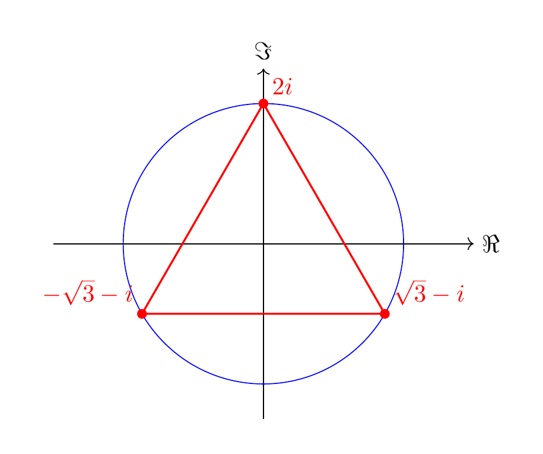

<strong>Solution 1.5.1</strong>

 (See <a href="../exercises-c/#ex-complex-1" data-reference-type="ref+Label" data-reference="ex:complex-1">Exercise 1.4</a>.) We have $\frac{i-1}{i+1} = \frac{(i-1)\overline{i+1}}{|i+1|^2} = \frac{(i-1)(1-i)}{2} = i$. Thus $z=i^3 = -i$ is the algebraic form. We have $|z|=1$ and ${\mathrm {arg}} z = \frac 32 \pi$, so

\[
z = \cos(\frac 32 \pi) + i \sin \frac 32 \pi.
\]

<strong>Solution 1.5.2</strong>

 (See <a href="../exercises-c/#ex-complex-2" data-reference-type="ref+Label" data-reference="ex:complex-2">Exercise 1.5</a>.) In order to solve

\[
z = 3i |z|\overline z
\]

we would like to divide by $z$. This is only possible if $z \ne 0$, so we first consider the case $z = 0$. In this case both sides of the equation are equal to 0, so $z=0$ is indeed a solution. Now, we consider $z \ne 0$ and divide the above equation by $z$ and obtain

\[
1 = 3i |z| \frac{\overline z}z.
\]

There are different ways to solve this equation. One may put $z = a+ib$ and solve the resulting quadratic equation. For illustrational purposes, we rather consider the trigonometric form $z = r (\cos \alpha + i \sin \alpha)$. Then $\overline z = r (\cos \alpha - i \sin \alpha) = r (\cos (-\alpha) + i \sin (-\alpha))$, and

\[
|z| \frac{\overline z}z = r \frac{r (\cos (-\alpha) + i \sin (-\alpha))}{r (\cos (\alpha) + i \sin (\alpha))}.
\]

Note that $r = |z| \ne 0$, so we can cancel this in the right-hand fraction. We have

\[
\frac{\cos (-\alpha) + i \sin (-\alpha)}{\cos (\alpha) + i \sin (\alpha)} = \cos(-2\alpha) + i \sin(-2\alpha).
\]

We then obtain

\[
\frac 1{3i} = -\frac 13 i = |z| \frac{\overline z}z = r (\cos(-2\alpha) + i \sin(-2\alpha)).
\]

This implies $r = \frac 13$. Concerning the arguments, we have to be more careful: the above equation is equivalent to saying that

\[
-2 \alpha \equiv \frac 32 \pi \mod 2 \pi
\]

cf. around <a href="../c/#eq-mod-2pi" data-reference-type="eqref" data-reference="eq:mod-2pi">Equation (1.6)</a>. There are two solutions: $-2 \alpha = \frac 32 \pi$ or $- 2\alpha = \frac 32 \pi + 2 \pi$. The former yields $\alpha = -\frac 34 \pi$, the latter $\alpha = \frac \pi 4$. (Of course, we can now add integer multiples of $2\pi$ to these values of $\alpha$, so $\alpha = \frac 54 \pi$ is another solution. However, this gives the same value for $z$.) The resulting solutions are

\[
z = \frac 1 3 (\cos(-\frac 34 \pi) + i \sin (-\frac 34 \pi))
\]

and

\[
z = \frac 1 3 (\cos(\frac 14 \pi) + i \sin (\frac 14 \pi)).
\]

To sum up, the above equation has three solutions, $z = 0$ and these two solutions.

<strong>Solution 1.5.3</strong>

 (See <a href="../exercises-c/#ex-complex-3" data-reference-type="ref+Label" data-reference="ex:complex-3">Exercise 1.6</a>.) There are three solutions, namely

\[
z_0 = \sqrt 3 - i = 2 (\cos (-\pi/6) + i \sin(-\pi/6)),
\]

\[
z_1 = -\sqrt 3 - i = 2 (\cos (-5\pi/6) + i \sin(-5\pi/6)),
\]

\[
z_2 = 2i = 2 (\cos (-3\pi/2) + i \sin(-3\pi/2)).
\]

Here is a picture:

