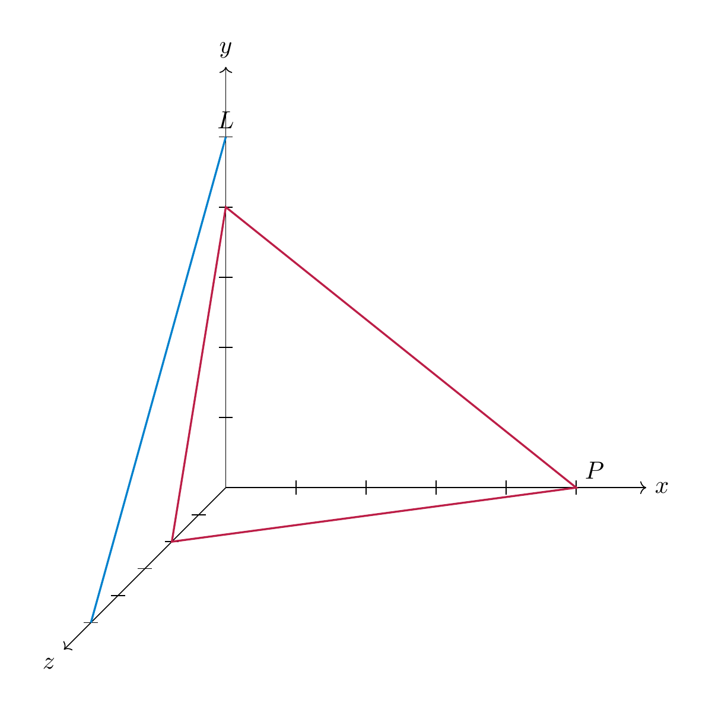

<strong>Solution 7.9.1</strong>

 (See <a href="../exercises-euclid/#ex-euclid-polynomials-gs" data-reference-type="ref+Label" data-reference="ex:euclid-polynomials-gs">Exercise 7.1</a>.) This solution illustrates <a href="../euclid-summary/#tas-compute-orthonormal-basis" data-reference-type="ref+Label" data-reference="tas:compute-orthonormal-basis">Task 7.61</a>.

We consider $V=P_{\le 2}$ with the scalar product

\[
{\left \langle p,q \right \rangle}=\int_{-1}^1 p(t)q(t)\,dt
\]

as in <a href="../euclid-euclidean-spaces/#ex-examples-scalar-product" data-reference-type="ref+Label" data-reference="ex:examples-scalar-product">Example 7.16</a><a href="../euclid-euclidean-spaces/#item-functions" data-reference-type="ref" data-reference="item--functions">3.</a>. For $e_1=1$, $e_2=t$, $e_3=t^2$, we compute the scalar products, i.e., the numbers ${\left \langle e_i,e_j \right \rangle}$:

\[
\begin{align*}
{\left \langle e_1,e_1 \right \rangle} &= \int_{-1}^1 1\,dt = \left[ t \right]_{-1}^1 = 2, \\
{\left \langle e_1,e_2 \right \rangle} &= \int_{-1}^1 t\,dt = \left[ \frac{t^2}{2} \right]_{-1}^1 = 0, \\
{\left \langle e_1,e_3 \right \rangle} &= \int_{-1}^1 t^2\,dt = \left[ \frac{t^3}{3} \right]_{-1}^1 = \frac{2}{3}, \\
{\left \langle e_2,e_2 \right \rangle} &= \int_{-1}^1 t^2\,dt = \left[ \frac{t^3}{3} \right]_{-1}^1 = \frac{2}{3}, \\
{\left \langle e_2,e_3 \right \rangle} &= \int_{-1}^1 t^3\,dt = \left[ \frac{t^4}{4} \right]_{-1}^1 = 0, \\
{\left \langle e_3,e_3 \right \rangle} &= \int_{-1}^1 t^4\,dt = \left[ \frac{t^5}{5} \right]_{-1}^1 = \frac{2}{5}.
\end{align*}
\]

By symmetry (cf. <a href="../euclid-scalar-product/#lem-scalar-product-properties" data-reference-type="ref+Label" data-reference="lem:scalar-product-properties">Lemma 7.5</a>), this also gives the remaining entries with $i>j$. We now apply Gram–Schmidt orthogonalization (<a href="../euclid-euclidean-spaces/#prop-gram-schmidt-orthogonalization" data-reference-type="ref+Label" data-reference="prop:gram-schmidt-orthogonalization">Proposition 7.32</a>):

\[
\begin{align*}
w_1 &= \frac{e_1}{|\hspace{-0.5mm}|{e_1}|\hspace{-0.5mm}|}
= \frac{1}{\sqrt 2}, \\
w_2' &= e_2-{\left \langle e_2,w_1 \right \rangle}w_1 = t,
\qquad
w_2=\frac{w_2'}{|\hspace{-0.5mm}|{w_2'}|\hspace{-0.5mm}|}=\sqrt{\frac 32}\,t, \\
w_3' &= e_3-{\left \langle e_3,w_1 \right \rangle}w_1-{\left \langle e_3,w_2 \right \rangle}w_2
= t^2-\frac13.
\end{align*}
\]

Moreover,

\[
|\hspace{-0.5mm}|{w_3'}|\hspace{-0.5mm}|^2
=\int_{-1}^1\left(t^2-\frac13\right)^2dt
=\frac{8}{45},
\]

so

\[
w_3=\frac{w_3'}{|\hspace{-0.5mm}|{w_3'}|\hspace{-0.5mm}|}
=\frac{\sqrt{10}}{4}(3t^2-1).
\]

Therefore one orthonormal basis is

\[
\left(\frac{1}{\sqrt 2},\ \sqrt{\frac 32}\,t,\ \frac{\sqrt{10}}{4}(3t^2-1)\right).
\]

Such polynomials, i.e., orthonormal with respect to the given scalar product, are called *Legendre polynomials*.

<strong>Solution 7.9.2</strong>

 (See <a href="../exercises-euclid/#ex-euclid-r4-projection" data-reference-type="ref+Label" data-reference="ex:euclid-r4-projection">Exercise 7.3</a>.) This solution illustrates <a href="../euclid-summary/#tas-compute-orthogonal-complement">Task 7.63</a>, <a href="../euclid-summary/#tas-compute-orthogonal-projection">Task 7.62</a>.

Let

\[
W=\{(x,y,z,t)\in {\bf R}^4\mid x-t=0,\ y+z-t=0\}.
\]

From the equations we get $x=t$ and $y=t-z$. With free parameters $z=a$ and $t=b$, every vector in $W$ has the form

\[
(x,y,z,t)=(b,b-a,a,b)=a(0,-1,1,0)+b(1,1,0,1).
\]

Hence one basis of $W$ is $\big((0,-1,1,0),(1,1,0,1)\big).$ To compute $W^\bot$ in detail, let $u=(x,y,z,t)$ and impose orthogonality to a basis of $W$, namely $v_1=(0,-1,1,0)$ and $v_2=(1,1,0,1)$ (cf. <a href="../euclid-euclidean-spaces/#dlm-orthogonal-complement" data-reference-type="ref+Label" data-reference="dlm:orthogonal-complement">Definition and Lemma 7.20</a>):

\[
{\left \langle u,v_1 \right \rangle}=0,
\qquad
{\left \langle u,v_2 \right \rangle}=0.
\]

This is the linear system

\[
-y+z=0,
\qquad
x+y+t=0,
\]

equivalently

\[
\left ( \begin{array}{cccc} 0&-1&1&0\\ 1&1&0&1 \end{array} \right )
\left ( \begin{array}{c} x\\y\\z\\t \end{array} \right )=0.
\]

Thus $W^\bot$ is the kernel of this matrix. Taking $x=a$ and $y=b$ as free parameters gives $z=b$ and $t=-a-b$, so

\[
u=(a,b,b,-a-b)=a(1,0,0,-1)+b(0,1,1,-1).
\]

Therefore

\[
W^\bot=L\big((1,0,0,-1),(0,1,1,-1)\big).
\]

We now compute the orthogonal projection of $u=(1,5,1,6)$ onto $W$. We use the two basis vectors $v_1=(0,-1,1,0)$, $v_2=(1,1,0,1)$ of $W$, computed in the first part. We want to apply <a href="../euclid-euclidean-spaces/#thm-orthogonal-projection" data-reference-type="ref+Label" data-reference="thm:orthogonal-projection">Theorem 7.24</a>, which requires us to have an orthogonal basis. To this end, we apply Gram–Schmidt (<a href="../euclid-euclidean-spaces/#prop-gram-schmidt-orthogonalization" data-reference-type="ref+Label" data-reference="prop:gram-schmidt-orthogonalization">Proposition 7.32</a>):

\[
{\left \langle v_2,v_1 \right \rangle}=-1,
\qquad
v_2'=v_2-\frac{ {\left \langle v_2,v_1 \right \rangle}}{ {\left \langle v_1,v_1 \right \rangle}}v_1
=v_2+\frac12 v_1=(1,\tfrac12,\tfrac12,1).
\]

To avoid fractions, take $w_2:=2v_2'=(2,1,1,2)$, which is still orthogonal to $v_1$. By <a href="../euclid-euclidean-spaces/#thm-orthogonal-projection" data-reference-type="ref+Label" data-reference="thm:orthogonal-projection">Theorem 7.24</a>, specifically the formula in <a href="../euclid-euclidean-spaces/#eq-orthogonal-projection-formula" data-reference-type="ref+Label" data-reference="eq:orthogonal-projection-formula">Equation (7.26)</a>, for our orthogonal basis $v_1, w_2$ we have

\[
p_W(u)=\frac{ {\left \langle u,v_1 \right \rangle}}{ {\left \langle v_1,v_1 \right \rangle}}v_1
+\frac{ {\left \langle u,w_2 \right \rangle}}{ {\left \langle w_2,w_2 \right \rangle}}w_2.
\]

Compute ${\left \langle u,v_1 \right \rangle}=-4$, ${\left \langle v_1,v_1 \right \rangle}=2$, ${\left \langle u,w_2 \right \rangle}=20$, and ${\left \langle w_2,w_2 \right \rangle}=10$. Thus the orthogonal projection of $(1,5,1,6)$ onto $W$ is

\[
p_W(u)=-2v_1+2w_2=(4,4,0,4).
\]

<strong>Solution 7.9.3</strong>

 (See <a href="../exercises-euclid/#ex-euclid-6-1" data-reference-type="ref+Label" data-reference="ex:euclid-6-1">Exercise 7.2</a>.) This solution illustrates <a href="../euclid-summary/#tas-compute-orthogonal-complement">Task 7.63</a>, <a href="../euclid-summary/#tas-compute-orthogonal-projection">Task 7.62</a>.

The given equation describing $U$ can be rewritten as

\[
\left ( \begin{array}{ccc} 1 & -1 & 3 \end{array} \right ) \left ( \begin{array}{c} x \\ y \\ z \end{array} \right ) = {\left \langle \left ( \begin{array}{c} 1 \\ -1 \\ 3 \end{array} \right ), \left ( \begin{array}{c} x \\ y \\ z \end{array} \right ) \right \rangle} = 0,
\]

which gives, with free parameters $y=a$ and $z =b$, $x = a-3b$. Thus $U = \{(a-3b,a,b) \ | \ a,b \in {\bf R}\} = L((1,1,0),(-3,0,1))$.

The above equation tells us that $U$ is the orthogonal complement of the vector $\left ( \begin{array}{c} 1 \\ -1 \\ 3 \end{array} \right )$. Thus, writing $L := L(\left ( \begin{array}{c} 1 \\ -1 \\ 3 \end{array} \right ))$ for the one-dimensional subspace spanned by that vector, we have $U=L^\bot$. Therefore $U^\bot = (L^\bot)^\bot \stackrel * L = L(\left ( \begin{array}{c} 1 \\ -1 \\ 3 \end{array} \right ))$, where the equality marked \* is using <a href="../euclid-euclidean-spaces/#cor-dim-u-bot" data-reference-type="ref+Label" data-reference="cor:dim-u-bot">Corollary 7.31</a>.

In order to compute the projection of $t$ onto $U$, we apply the Gram–Schmidt orthogonalization method. The vector $v_1 = (1,1,0)$ has norm $|\hspace{-0.5mm}| {v_1} |\hspace{-0.5mm}| = \sqrt 2$, so that $w_1 = \frac 1 {\sqrt 2} (1,1,0)$. Then

\[
\begin{align*}
w'_2 := v_2 - {\left \langle v_2, w_1 \right \rangle} w_1 & = (-3,0,1) - \left [ (-3,0,1) \left ( \begin{array}{c} 1/\sqrt 2 \\ 1/\sqrt 2 \\ 0 \end{array} \right )\right ] w_1 \\
& = (-3,0,1) + \frac 3{\sqrt 2} \frac 1 {\sqrt 2} (1,1,0) \\
& = (-3,0,1) + \left(\frac 32, \frac 32, 0\right) \\
& = \left(-\frac32, \frac 32, 1\right).
\end{align*}
\]

The two vectors $v_1$ and $w'_2$ are orthogonal, so by <a href="../euclid-euclidean-spaces/#thm-orthogonal-projection" data-reference-type="ref+Label" data-reference="thm:orthogonal-projection">Theorem 7.24</a> (formula for an orthogonal basis) we get

\[
\begin{align*}
t_U
& = \frac{ {\left \langle t, v_1 \right \rangle}}{ {\left \langle v_1, v_1 \right \rangle}} v_1
+ \frac{ {\left \langle t, w'_2 \right \rangle}}{ {\left \langle w'_2, w'_2 \right \rangle}} w'_2 \\
& = \frac 12 (1,1,0) + \frac{13/2}{11/2} \left(-\frac32, \frac32, 1\right) \\
& = \left(\frac 12, \frac 12, 0\right) + \frac{13}{11}\left(-\frac 32, \frac 32, 1\right) \\
& = \left(-\frac{14}{11}, \frac{25}{11}, \frac{13}{11}\right).
\end{align*}
\]

An alternative way to solve this, with slightly fewer computations, is the following: since $t= t_U + t_\bot$ is the unique decomposition, we can compute $t_U = t - {t_\bot}$. By the positive definitness of ${\left \langle -, - \right \rangle}$ we have $(U^\bot)^\bot = U$ (cf. <a href="../euclid-euclidean-spaces/#cor-dim-u-bot" data-reference-type="ref+Label" data-reference="cor:dim-u-bot">Corollary 7.31</a>), so we can also work in $U^\bot$ rather than in $U$. This is somewhat simpler since $U^\bot$ has dimension 1. Take the basis vector $v = (1,-1,3)$ of $U^\bot$. Then, again by <a href="../euclid-euclidean-spaces/#thm-orthogonal-projection" data-reference-type="ref+Label" data-reference="thm:orthogonal-projection">Theorem 7.24</a> (orthogonal basis formula)

\[
\begin{align*}
t_\bot & = \frac{ {\left \langle t, v \right \rangle}}{ {\left \langle v, v \right \rangle}} v \\
& = \frac{14}{11}(1,-1,3) \\
& = \left(\frac{14}{11}, -\frac{14}{11}, \frac{42}{11}\right).
\end{align*}
\]

Therefore

\[
t_U = t- t_\bot = (0,1,5) - \left(\frac{14}{11}, -\frac{14}{11}, \frac{42}{11}\right) = \left(-\frac{14}{11},\frac{25}{11},\frac{13}{11}\right).
\]

<strong>Solution 7.9.4</strong>

 (See <a href="../exercises-euclid/#ex-euclid-6-2" data-reference-type="ref+Label" data-reference="ex:euclid-6-2">Exercise 7.4</a>.) This solution illustrates <a href="../euclid-summary/#tas-compute-orthogonal-complement">Task 7.63</a>, <a href="../euclid-summary/#tas-compute-orthogonal-projection">Task 7.62</a>.

$U$ is given by the solutions of the homogeneous linear system

\[
\left ( \begin{array}{ccc} 1 & 0 & 0 \\ 1 & 1 & 1 \end{array} \right ) \left ( \begin{array}{c} x \\ y \\ z \end{array} \right ) = \left ( \begin{array}{c} 0 \\ 0 \end{array} \right ).
\]

The left hand matrix can be brought to reduced row echelon form using Gaussian elimination (<a href="../systems-gaussian-elimination/#met-gaussian-elimination-solve" data-reference-type="ref+Label" data-reference="met:gaussian-elimination-solve">Method 2.31</a>): $\left ( \begin{array}{ccc} 1 & 0 & 0 \\ 0 & 1 & 1 \end{array} \right )$, so that $z = a$ is a free parameter and $x = 0$, $y = -a$. This shows that $U = \{ (0,-a,a) \ | \ a \in {\bf R}\}$ and $(0,-1,1)$ is a basis vector of $U$. The orthogonal complement consists of vectors orthogonal to $(0,-1,1)$. As in the solution of <a href="../exercises-euclid/#ex-euclid-6-1" data-reference-type="ref+Label" data-reference="ex:euclid-6-1">Exercise 7.2</a> above, $U$ has been defined as the orthogonal complement of the two vectors $\left ( \begin{array}{c} 1 \\ 0 \\ 0 \end{array} \right )$ and $\left ( \begin{array}{c} 1 \\ 1 \\ 1 \end{array} \right )$. These vectors therefore constitute a basis of $U^\bot$.

We compute the orthogonal projection of $t=(5,1,3)$ onto $U$ and $U^\bot$. This can be done using Gram–Schmidt orthogonalization as above, but also by solving the linear system

\[
\left ( \begin{array}{c} 5 \\ 1 \\ 3 \end{array} \right ) = a \left ( \begin{array}{c} 0 \\ -1 \\ 1 \end{array} \right ) + b \left ( \begin{array}{c} 1 \\ 0 \\ 0 \end{array} \right ) + c \left ( \begin{array}{c} 1 \\ 1 \\ 1 \end{array} \right ).
\]

This is quickly solved as $\left ( \begin{array}{c} a \\ b \\ c \end{array} \right )= \left ( \begin{array}{c} 1 \\ 3 \\ 2 \end{array} \right )$, so that the projection of $t$ onto $U$ is $a \cdot \left ( \begin{array}{c} 0 \\ -1 \\ 1 \end{array} \right ) = \left ( \begin{array}{c} 0 \\ -1 \\ 1 \end{array} \right )$.

<strong>Solution 7.9.5</strong>

 (See <a href="../exercises-euclid/#ex-euclid-6-3" data-reference-type="ref+Label" data-reference="ex:euclid-6-3">Exercise 7.5</a>.) This solution illustrates <a href="../euclid-summary/#tas-compute-orthogonal-complement" data-reference-type="ref+Label" data-reference="tas:compute-orthogonal-complement">Task 7.63</a>.

The orthogonal complement of $T$ is given by vectors $(x,y,z)$ such that $x-3z=0$. I.e., with free parameters $y = a$, $z = b$, $x = 3b$. Thus

\[
T^\bot = L((3,0,1), (0,1,0)).
\]

<strong>Solution 7.9.6</strong>

 (See <a href="../exercises-euclid/#ex-euclid-6-4" data-reference-type="ref+Label" data-reference="ex:euclid-6-4">Exercise 7.6</a>.) We want to find $U$ such that $U \oplus U^\bot = {\bf R}^3$ and $t=(1,5,6) + t_\bot$, with $(1,5,6) \in U$ and $t_\bot \in U^\bot$. This in particular means that $(1,5,6) \bot t_\bot$. Solving the equation

\[
(1,1,0) = (1,5,6) + t_\bot
\]

gives $t_\bot = (1,1,0)-(1,5,6) = (0,-4,-6)$. But

\[
{\left \langle (1,5,6), (0,-4,-6) \right \rangle} = -20 + 36 = 16 \ne 0,
\]

so these two vectors are *not* orthogonal. Therefore there is *no* such subspace $U$.

We solve the second part similarly: we have $t - (1,1,1) = (1,-1,0)$, so the Ansatz is $t_\bot = (1,-1,0)$. We compute ${\left \langle (1,1,1), (1,-1,0) \right \rangle} = 0$, so these vectors are orthogonal. We now compute $U$: $(1,1,1) \in U$, so that we can take $U = L(1,1,1)$.

<strong>Solution 7.9.7</strong>

 (See <a href="../exercises-euclid/#ex-euclid-6-6" data-reference-type="ref+Label" data-reference="ex:euclid-6-6">Exercise 7.7</a>.) This solution illustrates <a href="../euclid-summary/#tas-compute-orthogonal-projection" data-reference-type="ref+Label" data-reference="tas:compute-orthogonal-projection">Task 7.62</a>.

According to <a href="../euclid-affine-subspaces/#prop-min-affine-subspace" data-reference-type="ref+Label" data-reference="prop:min-affine-subspace">Proposition 7.45</a>, the unique point $v \in {\bf R}^3$ that is lying on $L$ and as close as possible to the origin is given by

\[
v = v_0 - p_L(v_0),
\]

where $v_0 = \left ( \begin{array}{c} 1 \\ 3 \\ 5 \end{array} \right )$. We will use <a href="../euclid-euclidean-spaces/#thm-orthogonal-projection" data-reference-type="ref+Label" data-reference="thm:orthogonal-projection">Theorem 7.24</a> in order to compute this. The underlying subspace $W$ of $L$ is spanned by $v_1 = \left ( \begin{array}{c} 1 \\ 1 \\ 4 \end{array} \right )$. Renormalizing this vector to norm one, gives $w_1 = \frac{v_1}{|\hspace{-0.5mm}| {v_1} |\hspace{-0.5mm}|} = \frac{v_1}{\sqrt{18}}$. This vector $w_1$ is therefore an orthonormal basis of $W$. We then have

\[
p_L(v_0)={\left \langle v_0, w_1 \right \rangle}w_1 = \frac{24}{18} \left ( \begin{array}{c} 1 \\ 1 \\ 4 \end{array} \right )
\]

and therefore

\[
v = \left ( \begin{array}{c} 1 \\ 3 \\ 5 \end{array} \right ) -\frac{24}{18} \left ( \begin{array}{c} 1 \\ 1 \\ 4 \end{array} \right ) = \left ( \begin{array}{c} -1/3 \\ 5/3 \\ -1/3 \end{array} \right ).
\]

This vector has norm

\[
|\hspace{-0.5mm}| {v} |\hspace{-0.5mm}| = \sqrt{27/9}= \sqrt 3.
\]

<strong>Solution 7.9.8</strong>

 (See <a href="../exercises-euclid/#ex-euclid-6-7" data-reference-type="ref+Label" data-reference="ex:euclid-6-7">Exercise 7.8</a>.) This solution illustrates <a href="../euclid-summary/#tas-check-lines-parallel">Task 7.70</a>, <a href="../euclid-summary/#tas-compute-distance-affine-subspaces">Task 7.74</a>.

The subspace $W$ underlying $L$ is spanned by $\left ( \begin{array}{c} 1 \\ 1 \\ 1 \end{array} \right )$, while the equations for $L'$ are equivalent to $x=z$ and $y = z+2$. Therefore, this line has the underlying subspace $\left ( \begin{array}{c} 1 \\ 1 \\ 1 \end{array} \right )$ as well. By <a href="../euclid-affine-subspaces/#def-parallel-skew" data-reference-type="ref+Label" data-reference="def:parallel-skew">Definition 7.42</a>, the lines are therefore parallel. Let $w = \left ( \begin{array}{c} 1 \\ 1 \\ 1 \end{array} \right )$ be the direction vector for both lines (cf. <a href="../euclid-affine-subspaces/#def-direction-vector" data-reference-type="ref+Label" data-reference="def:direction-vector">Definition 7.50</a>). Below, we will consider its renormalization to norm 1, which is $w_1 = \frac 1 {\sqrt3} \left ( \begin{array}{c} 1 \\ 1 \\ 1 \end{array} \right )$.

Let $v_0 = \left ( \begin{array}{c} 1 \\ 0 \\ 2 \end{array} \right )$ and $v'_0 = \left ( \begin{array}{c} 0 \\ -2 \\ 0 \end{array} \right )$. Then the distance vector $d = v_0 - v'_0 = \left ( \begin{array}{c} 1 \\ 2 \\ 2 \end{array} \right )$ is not orthogonal to $L$ (${\left \langle d, w \right \rangle} \ne 0$). We compute the orthogonal projection of $d$ onto $W^\bot$ by computing

\[
d - {\left \langle d, w_1 \right \rangle} w_1 = \left ( \begin{array}{c} 1 \\ 2 \\ 2 \end{array} \right ) - \frac 1 3 \left ( \begin{array}{c} 1 \\ 1 \\ 1 \end{array} \right ) {\left \langle d, w \right \rangle} = \frac 13 \left ( \begin{array}{c} -2 \\ 1 \\ 1 \end{array} \right ).
\]

This vector has norm $\sqrt{2/3}$, which is therefore the distance of $L$ and $L'$.

<strong>Solution 7.9.9</strong>

 (See <a href="../exercises-euclid/#ex-euclid-6-8" data-reference-type="ref+Label" data-reference="ex:euclid-6-8">Exercise 7.9</a>.) This solution illustrates <a href="../euclid-summary/#tas-check-lines-skew">Task 7.71</a>, <a href="../euclid-summary/#tas-compute-distance-affine-subspaces">Task 7.74</a>.

The two lines have underlying vector spaces $W = L(\left ( \begin{array}{c} 1 \\ 1 \\ -1 \end{array} \right ))$ and $W' = L(\left ( \begin{array}{c} 1 \\ -1 \\ 2 \end{array} \right ))$ respectively. These two one-dimensional subspaces are not contained in each other: the two vectors are linearly independent.

The general point in $L$ is of the form

\[
p(t) = \left ( \begin{array}{c} 0 \\ 1 \\ 0 \end{array} \right ) + t \left ( \begin{array}{c} 1 \\ 1 \\ -1 \end{array} \right ),
\]

while those on $L'$ are of the form

\[
q(u) = \left ( \begin{array}{c} 2 \\ 0 \\ 0 \end{array} \right ) + u \left ( \begin{array}{c} 1 \\ -1 \\ 2 \end{array} \right ).
\]

According to <a href="../euclid-affine-subspaces/#prop-min-affine-subspace" data-reference-type="ref+Label" data-reference="prop:min-affine-subspace">Proposition 7.45</a>, we need to compute the values of $t, u \in {\bf R}$ such that the difference $p(t) - q(u) = \left ( \begin{array}{c} t-2-u \\ 1+t+u \\ -t-2u \end{array} \right )$ is orthogonal on $W$ and also on $W'$. This leads to the linear system

\[
\begin{align*}
0 & = {\left \langle \left ( \begin{array}{c} 1 \\ 1 \\ -1 \end{array} \right ), \left ( \begin{array}{c} -t-2-u \\ 1+t+u \\ -t-2u \end{array} \right ) \right \rangle} = t-2-u+1+t+u+t+2u=3t+2u-1, \\
0 & = {\left \langle \left ( \begin{array}{c} 1 \\ -1 \\ 2 \end{array} \right ), \left ( \begin{array}{c} -t-2-u \\ 1+t+u \\ -t-2u \end{array} \right ) \right \rangle} = t-2-u-1-t-u-2t-4u=-2t-6u-3.
\end{align*}
\]

The solution of this system is $t=\frac 67$, $u = \frac {-11}{14}$. One then computes $p(6/7)-q(-11/14)=\left ( \begin{array}{c} -5/14 \\ 15/14 \\ 5/7 \end{array} \right )$, whose norm is equal to $\frac5{\sqrt{14}}$. This is the distance between the two lines.

In particular, this distance is positive. This, together with the above observation that $W \ne W'$ means that the lines are skew. (If one is only required to show that the lines are skew, without computing their distance, one can also solve the linear system given by the intersection of $L$ and $L'$; one finds out that this system has no solution, so the lines are skew.)

<strong>Solution 7.9.10</strong>

 (See <a href="../exercises-euclid/#ex-euclid-6-9" data-reference-type="ref+Label" data-reference="ex:euclid-6-9">Exercise 7.10</a>.) This solution illustrates <a href="../euclid-summary/#tas-check-line-parallel-plane" data-reference-type="ref+Label" data-reference="tas:check-line-parallel-plane">Task 7.72</a>.

A useful way to sketch lines and planes is by considering some points on them where several coordinates are zero. In the case of $P$, three such points are $(5,0,0), (0,4,0), (0,0,2)$, while for $L$ two such points are $(0,5,0), (0,0,5)$. This leads to the following sketch:

The equation can be rewritten as

\[
{\left \langle \left ( \begin{array}{c} 4 \\ 5 \\ 10 \end{array} \right ), \left ( \begin{array}{c} x \\ y \\ z \end{array} \right ) \right \rangle} = 20.
\]

According to <a href="../euclid-euclidean-spaces/#dlm-orthogonal-complement" data-reference-type="ref+Label" data-reference="dlm:orthogonal-complement">Definition and Lemma 7.20</a>, the underlying vector space $W$ is the orthogonal complement of the vector $\left ( \begin{array}{c} 4 \\ 5 \\ 10 \end{array} \right )$.

The line $L$ has as its underlying vector space $W' = L(\left ( \begin{array}{c} 0 \\ 1 \\ -1 \end{array} \right ))$. If $P$ and $L$ are parallel, then $W' \subset W$. This means that $\left ( \begin{array}{c} 0 \\ 1 \\ -1 \end{array} \right )$ is orthogonal to $\left ( \begin{array}{c} 4 \\ 5 \\ 10 \end{array} \right )$. Their scalar product is $5-10 = -5 \ne 0$, so that these vectors are *not* orthogonal and therefore $L$ and $P$ are not parallel.

We compute the distance of $P$ to the origin using <a href="../euclid-affine-subspaces/#prop-distance-hyperplane" data-reference-type="ref+Label" data-reference="prop:distance-hyperplane">Proposition 7.47</a>:

\[
d(0,P) = \frac{20}{|\hspace{-0.5mm}| {\left ( \begin{array}{c} 4 \\ 5 \\ 10 \end{array} \right )} |\hspace{-0.5mm}|} = \frac{20}{\sqrt{141}}.
\]

We compute the closest point by determining the (unique) intersection point $P \cap W^\bot$. We are thus seeking the real number $r$ such that $r \left ( \begin{array}{c} 4 \\ 5 \\ 10 \end{array} \right ) = \left ( \begin{array}{c} 4r \\ 5r \\ 10r \end{array} \right )$ lies on the plane $P$, i.e., such that

\[
{\left \langle \left ( \begin{array}{c} 4 \\ 5 \\ 10 \end{array} \right ), \left ( \begin{array}{c} 4r \\ 5r \\ 10r \end{array} \right ) \right \rangle} = 20.
\]

The left hand side equals $r(16+25+100) = 141 r$, so that $r = \frac{20}{141}$, and therefore the point in $P$ that is as close as possible to the origin is

\[
\frac{20}{141}\left ( \begin{array}{c} 4 \\ 5 \\ 10 \end{array} \right ).
\]

<strong>Solution 7.9.11</strong>

 (See <a href="../exercises-euclid/#ex-euclid-6-10" data-reference-type="ref+Label" data-reference="ex:euclid-6-10">Exercise 7.11</a>.) We apply <a href="../euclid-orthogonal-and-symmetric-matrices/#thm-symmetric-orthogonally-diagonalizable" data-reference-type="ref+Label" data-reference="thm:symmetric-orthogonally-diagonalizable">Theorem 7.38</a>, according to which a matrix is *orthogonally* diagonalizable if and only if it is symmetric. This excludes $A = \left ( \begin{array}{cc} 1 & 2 \\ -2 & 1 \end{array} \right )$. The other two matrices are symmetric and therefore orthogonally diagonalizable. The matrix $A = \left ( \begin{array}{cc} 0 & 0 \\ 0 & 0 \end{array} \right )$ is already a diagonal matrix, so for $P = {\mathrm {id}}$ the matrix $PAP^{-1}$ is diagonal. The standard basis vectors $e_1, e_2$ are an orthonormal eigenbasis.

For $A = \left ( \begin{array}{cc} 1 & 2 \\ 2 & 1 \end{array} \right )$, we compute the eigenvalues as was indicated after <a href="../euclid-orthogonal-and-symmetric-matrices/#thm-symmetric-orthogonally-diagonalizable" data-reference-type="ref+Label" data-reference="thm:symmetric-orthogonally-diagonalizable">Theorem 7.38</a>.

\[
\begin{align*}
\lambda_{1/2} & = \frac{a+d}2 \pm \sqrt{\frac{(a-d)}4 + b^2} \\
& = 1 \pm 2.
\end{align*}
\]

Thus the eigenvalues are $-1$ and $3$. We compute the eigenspaces. The matrix $A - (-1){\mathrm {id}} = \left ( \begin{array}{cc} 2 & 2 \\ 2 & 2 \end{array} \right )$ has kernel given by $w_1 := e_1 - e_2$. The matrix $A - 3 {\mathrm {id}} = \left ( \begin{array}{cc} -2 & 2 \\ 2 & -2 \end{array} \right )$ has kernel given by $w_2 := e_1 + e_2$. These vectors are orthogonal:

\[
{\left \langle e_1-e_2, e_1+e_2 \right \rangle} = {\left \langle \left ( \begin{array}{c} 1 \\ -1 \end{array} \right ), \left ( \begin{array}{c} 1 \\ 1 \end{array} \right ) \right \rangle} = 0.
\]

However, they are not normal, so an orthonormal eigenbasis for $A$ is given by

\[
\frac{w_1}{|\hspace{-0.5mm}| {w_1} |\hspace{-0.5mm}|} = \frac{1}{\sqrt 2} \left ( \begin{array}{c} 1 \\ -1 \end{array} \right ) \text{ and } \frac{w_2}{|\hspace{-0.5mm}| {w_2} |\hspace{-0.5mm}|} = \frac{1}{\sqrt 2} \left ( \begin{array}{c} 1 \\ 1 \end{array} \right ).
\]

<strong>Solution 7.9.12</strong>

 (See <a href="../exercises-euclid/#ex-euclid-6-11" data-reference-type="ref+Label" data-reference="ex:euclid-6-11">Exercise 7.12</a>.) If $Av = \lambda v$, $Aw= \lambda w$, we compute

\[
\begin{align*}
\lambda {\left \langle v, w \right \rangle} & = {\left \langle \lambda v, w \right \rangle} \\
& = {\left \langle Av, w \right \rangle} \\
& = (Av)^T w \\
& = v^T A^T w \\
& = v^T A w & \text{ since }A = A^T \\
& = {\left \langle v, Aw \right \rangle} \\
& = {\left \langle v, \mu w \right \rangle} \\
& = \mu {\left \langle v, w \right \rangle}.
\end{align*}
\]

Since $\lambda \ne \mu$, this forces ${\left \langle v, w \right \rangle}=0$.

<strong>Solution 7.9.13</strong>

 (See <a href="../exercises-euclid/#ex-euclid-6-12" data-reference-type="ref+Label" data-reference="ex:euclid-6-12">Exercise 7.13</a>.) This solution illustrates <a href="../euclid-summary/#tas-check-line-parallel-plane">Task 7.72</a>, <a href="../euclid-summary/#tas-compute-distance-affine-subspaces">Task 7.74</a>.

By definition, the hyperplane $P$ is given by the equation

\[
{\left \langle (2,0,1,-1)^T, (x_1, \dots, x_4)^T \right \rangle} = 4.
\]

In other words, the underlying sub-vector space $W \subset {\bf R}^4$ of that hyperplane is the subspace

\[
{\left \langle (2,0,1,-1)^T, (x_1, \dots, x_4)^T \right \rangle} = 0,
\]

or, what is the same, the orthogonal complement of $(2,0,1,-1)^T$.

The underlying subspace $W'_t$ of the line $L_t$ is spanned by $(t,1,0,-1)$. By <a href="../euclid-affine-subspaces/#def-parallel-skew" data-reference-type="ref+Label" data-reference="def:parallel-skew">Definition 7.42</a>, $P$ is parallel to $L_t$ if $W \subset W'_t$ (which is impossible for dimension reasons) or if $W'_t \subset W$. The latter is equivalent to $(t,1,0,-1) \in W$ or, yet equivalently,

\[
{\left \langle (t,1,0,-1)^T, (2,0,1,-1)^T \right \rangle} = 0.
\]

This equates to $2t + 1 = 0$ or $t = -\frac12$.

We now compute the pair(s) of points realizing the minimal distance between $P$ and $L := L_{-\frac12}$. We will use that these are exactly the points $(p, l)$ such that $p-l \bot W$ and $p-l \bot W'$.

The point $l \in L = L_{-\frac12}$ is of the form

\[
\begin{align*}
l & = (1,0,0,1) + r(-\frac 12, 1, 0, -1) \\
& = (1-s, 2s, 0, 1-2s) & \text{ with }s=\frac r2.
\end{align*}
\]

On the other hand a point $p =(x_1, \dots, x_4) \in P$ satisfies

\[
2 x_1 + x_3 - x_4 = 4,
\]

so we can take $x_1 = a$, $x_2 = b$ and $x_3=c$ as free parameters and get $x_4 = 2a+c-4$. That is $p = (a,b,c,2a+c-4)$. Therefore

\[
p-l = (a+s-1,b-2s,c,2a+c+2s-5).
\]

Note that $a,b,c,s$ are the unknowns. We now determine the values of these unknowns. The orthogonal complement of $W$, $W^\bot = (((2,0,1,-1)^T)^\bot)^\bot = L(2,0,1,-1).$ Here we use that for a subspace $U \subset {\bf R}^n$, we have

\[
(U^\bot)^\bot = U.
\]

(Indeed, $U \subset (U^\bot)^\bot$: for $u \in U$ and $u' \in U^\bot$ we have ${\left \langle u, u' \right \rangle} = 0$, so that $u \in (U^\bot)^\bot$. Both vector subspaces of ${\bf R}^n$ have the same dimension, and therefore they agree.)

This means that we are looking for $a,b,c,s \in {\bf R}$ such that the following conditions are satisfied

- $p-l$ is a multiple of $(2,0,1,-1)$, say $\lambda(2,0,1,-1) = (2\lambda,0,\lambda,-\lambda)$. This translates into a linear system

\[
  \begin{align*}
  a+s-1 &= 2 \lambda \\
  b-2s & = 0 \\
  c & = \lambda \\
  2a+c+2s-5 & = - \lambda.
  \end{align*}
\]

- We now spell out the condition that $p-l$ is orthogonal to $(-\frac12, 1, 0, -1)^T$ or equivalently, to $(-1,2,0,-2)$:

\[
  \begin{align*}
  0 &= {\left \langle p-l, (-1,2,0,-2)^T \right \rangle}  \\
  & = -(a+s-1)+2(b-2s)-2(2a+c+2s-5) \\
  & = -5a + 2b -2c -9s + 11.
  \end{align*}
\]

  We obtain a linear system in the 5 unknowns $a,b,c,s,\lambda$:

\[
  \begin{align*}
  a+s-2\lambda & = 1\\
  b-2s & = 0\\
  c-\lambda & = 0 \\
  2a+c+2s+\lambda & = 5\\
  -5a + 2b -2c -9s & = - 11.
  \end{align*}
\]

  One solves this using Gaussian eliminiation (or, using an appropriate computer algebra system, cf. <https://www.wolframalpha.com/input?i=Solve%28%28-5a%2B2b-2c-9s%2B11%3D0%2Ca%2Bs-1%3D2l%2Cb-2s%3D0%2Cc%3Dl%2C2a%2Bc%2B2s-5%3D-l%29%29>) and obtains as solutions the vectors

\[
  (a, b=4-2a, c=\frac12, \lambda=\frac12, s=2-a).
\]

  Thus

\[
  \begin{align*}
  p & = (a,4-2a,\frac 12,2a-\frac 72) \\
  l & = (1-(2-a), 2(2-a), 0, 1-2(2-a)) = (a-1, 4-2a,0,-3+2a).
  \end{align*}
\]

  This implies that for *any* point $l \in L$, there is a unique point $p \in P$ such that $(p,l)$ realizes the minimal distance between $P$ and $L$.

<strong>Solution 7.9.14</strong>

 (See <a href="../exercises-euclid/#ex-euclid-lines-plane" data-reference-type="ref+Label" data-reference="ex:euclid-lines-plane">Exercise 7.14</a>.) This solution illustrates <a href="../euclid-summary/#tas-line-cartesian-to-parametric">Task 7.64</a>, <a href="../euclid-summary/#tas-plane-through-line-and-point">Task 7.67</a>, <a href="../euclid-summary/#tas-plane-vector-to-cartesian">Task 7.69</a>.

For $L$, solve the system

\[
\begin{align*}
x+z & = 1,\\
y+z & = -2.
\end{align*}
\]

With parameter $z=s$, we get $x=1-s$, $y=-2-s$, hence

\[
L=(1,-2,0)+L(-1,-1,1).
\]

So we can take

\[
v=(1,-2,0),\qquad W=L(-1,-1,1).
\]

For $L'$, from the two given points we get

\[
L'=(0,0,1)+L(0,1,0).
\]

To classify the relative position (<a href="../euclid-affine-subspaces/#def-parallel-skew" data-reference-type="ref+Label" data-reference="def:parallel-skew">Definition 7.42</a>), compare direction spaces:

\[
W=L(-1,-1,1),\qquad W'=L(0,1,0).
\]

These are different 1-dimensional subspaces, so $L$ and $L'$ are neither identical nor parallel. Now solve for an intersection:

\[
(1-s,-2-s,s)=(0,t,1).
\]

From $x=0$ we get $s=1$, then $z=1$ is satisfied, and $y=t$ gives $t=-3$. Therefore

\[
L\cap L'=\{(0,-3,1)\},
\]

so the two lines are *intersecting*.

Let $P$ be the plane containing $L$ and parallel to $L'$. Then $P$ is spanned by the two direction vectors

\[
d_1=(-1,-1,1),\qquad d_2=(0,1,0).
\]

A normal vector can be computed by using the cross product (or by computing the orthogonal complement):

\[
d_1\times d_2=(-1,0,-1),
\]

thus $n=(1,0,1)$ is a normal vector. Using the point $(1,-2,0)\in L$, the Cartesian equation of the plane (<a href="../euclid-affine-subspaces/#prop-hesse" data-reference-type="ref+Label" data-reference="prop:hesse">Proposition 7.48</a>) is

\[
n\cdot\big((x,y,z)-(1,-2,0)\big)=0
\iff x+z=1.
\]

So one valid equation of $P$ is

\[
x+z-1=0.
\]

Now fix $l=(2,-1,-1)\in L$ and seek $l'\in L'$ such that the line through $l$ and $l'$ is parallel to the plane $x+z-1=0$. Write

\[
l'=(0,r,1),\qquad d=l'-l=(-2,r+1,2).
\]

The line is parallel to the plane iff $d\cdot (1,0,1)=0$, and indeed

\[
(-2,r+1,2)\cdot(1,0,1)=-2+2=0
\]

for every $r\in{\bf R}$. Hence every point of $L'$ works:

\[
l'=(0,r,1),\quad r\in{\bf R}.
\]

For example, one can take $l'=(0,0,1)$.

<strong>Solution 7.9.15</strong>

 (See <a href="../exercises-euclid/#ex-euclid-poly-operator" data-reference-type="ref+Label" data-reference="ex:euclid-poly-operator">Exercise 7.15</a>.) Let $V=P_{\le 2}$ and ${\left \langle p,q \right \rangle}=\int_{-1}^1 p(t)q(t)\,dt$.

First, ${\left \langle -, - \right \rangle}$ is a scalar product: bilinearity and symmetry follow from properties of the integral, and for $p\neq 0$ we have ${\left \langle p,p \right \rangle}=\int_{-1}^1 p(t)^2dt>0$.

An orthonormal basis is the same as in the previous polynomial exercise (see <a href="../euclid-euclidean-spaces/#ex-examples-scalar-product" data-reference-type="ref+Label" data-reference="ex:examples-scalar-product">Example 7.16</a><a href="../euclid-euclidean-spaces/#item-functions" data-reference-type="ref" data-reference="item--functions">3.</a> and Gram–Schmidt in <a href="../euclid-euclidean-spaces/#prop-gram-schmidt-orthogonalization" data-reference-type="ref+Label" data-reference="prop:gram-schmidt-orthogonalization">Proposition 7.32</a>): $w_1=\frac1{\sqrt2}$, $w_2=\sqrt{\frac32}\,t$, $w_3=\frac{\sqrt{10}}4(3t^2-1)$.

Now consider $f:V\to V$, $f(p)=t\,p'$. It is linear because derivative and multiplication by $t$ are linear maps. In more detail, the conditions in <a href="../maps-definition-and-first-examples/#def-linear-map" data-reference-type="ref+Label" data-reference="def:linear-map">Definition 4.1</a> are satisfied, for example $f(p_1 + p_2) = t(p_1+p_2)' = t(p_1'+p_2') = f(p_1) + f(p_2)$ and similarly for $f(a p)$ with $a \in \mathbf R$. For the standard basis $e_1=1$, $e_2=t$, $e_3=t^2$ we have $f(e_1)=0$, $f(e_2)=t=e_2$, $f(e_3)=2t^2=2e_3$. Hence

\[
\mathrm M_{f, (e_1,e_2,e_3)}=\left ( \begin{array}{ccc} 0&0&0\\ 0&1&0\\ 0&0&2 \end{array} \right ).
\]

So $(e_1,e_2,e_3)$ is an eigenbasis, with eigenvalues $0,1,2$.

From the above, $\ker f=L(1)$, so $\dim\ker f=1$; and ${\operatorname{im}\,}f=L(t,t^2)$, so $\dim{\operatorname{im}\,}f=2$.

Finally, $f$ has no orthonormal eigenbasis for this scalar product: the eigenspaces for $0,1,2$ are $L(1)$, $L(t)$, $L(t^2)$. These are all 1-dimensional, so any eigenbasis is (up to scaling) $(1,t,t^2)$. But ${\left \langle 1,t^2 \right \rangle}=\int_{-1}^1 t^2dt=\frac23\neq 0$, so eigenvectors for $\lambda=0$ and $\lambda=2$ cannot be orthogonal.

<strong>Solution 7.9.16</strong>

 (See <a href="../exercises-euclid/#ex-euclid-u-r4-orth" data-reference-type="ref+Label" data-reference="ex:euclid-u-r4-orth">Exercise 7.16</a>.) This solution illustrates <a href="../euclid-summary/#tas-compute-orthonormal-basis">Task 7.61</a>, <a href="../euclid-summary/#tas-compute-orthogonal-projection">Task 7.62</a>, <a href="../euclid-summary/#tas-compute-orthogonal-complement">Task 7.63</a>.

Let

\[
U=\{x\in{\bf R}^4\mid x_1-x_2+x_3+2x_4=0\}.
\]

Writing $x_2=a$, $x_3=b$, $x_4=c$, we get $x_1=a-b-2c$, so $U=L(u_1,u_2,u_3)$ with $u_1=(1,1,0,0)$, $u_2=(-1,0,1,0)$, $u_3=(-2,0,0,1)$. Hence $\dim U=3$.

For an orthonormal basis, choose three pairwise orthogonal vectors in $U$: $v_1=(1,1,0,0)$, $v_2=(0,0,-2,1)$, $v_3=(-5,5,2,4)$. In terms of the basis vectors $u_1,u_2,u_3$ above, these are

\[
v_1=u_1,
\qquad
v_2=-2u_2+u_3,
\qquad
v_3=5u_1+2u_2+4u_3.
\]

One checks $v_i\in U$ and ${\left \langle v_i,v_j \right \rangle}=0$ for $i\neq j$. (Such vectors can be found using Gram–Schmidt orthogonalization, <a href="../euclid-euclidean-spaces/#prop-gram-schmidt-orthogonalization" data-reference-type="ref+Label" data-reference="prop:gram-schmidt-orthogonalization">Proposition 7.32</a>). Their norms are $|v_1|=\sqrt2$, $|v_2|=\sqrt5$, $|v_3|=\sqrt{70}$, so an orthonormal basis is

\[
w_1=\frac1{\sqrt2}(1,1,0,0),\quad
w_2=\frac1{\sqrt5}(0,0,-2,1),\quad
w_3=\frac1{\sqrt{70}}(-5,5,2,4).
\]

Let $n=(1,-1,1,2)$. Then $U=n^\bot$, hence (<a href="../euclid-euclidean-spaces/#thm-orthogonal-projection" data-reference-type="ref+Label" data-reference="thm:orthogonal-projection">Theorem 7.24</a>) $p_U(x)=x-\frac{ {\left \langle x,n \right \rangle}}{ {\left \langle n,n \right \rangle}}n$ and ${\left \langle n,n \right \rangle}=7$. For $v=(2,3,0,0)$, ${\left \langle v,n \right \rangle}=-1$, so $p_U(v)=v+\frac17 n=(\frac{15}7,\frac{20}7,\frac17,\frac27)$. For $w=(2,5,3,0)$, ${\left \langle w,n \right \rangle}=0$, so $p_U(w)=w=(2,5,3,0)$.

Finally, $U^\bot=L(n)=L(1,-1,1,2)$, where we have used <a href="../euclid-euclidean-spaces/#cor-dim-u-bot" data-reference-type="ref+Label" data-reference="cor:dim-u-bot">Corollary 7.31</a>.

<strong>Solution 7.9.17</strong>

 (See <a href="../exercises-euclid/#ex-euclid-6-13" data-reference-type="ref+Label" data-reference="ex:euclid-6-13">Exercise 7.17</a>.) This solution illustrates <a href="../euclid-summary/#tas-compute-orthonormal-basis">Task 7.61</a>, <a href="../euclid-summary/#tas-compute-orthogonal-complement">Task 7.63</a>, <a href="../euclid-summary/#tas-compute-orthogonal-projection">Task 7.62</a>.

We compute in fact directly an ortho*normal* basis, which in particular is then orthogonal. (The property of also being normal is convenient further below.) We apply the Gram–Schmidt procedure (<a href="../euclid-euclidean-spaces/#prop-gram-schmidt-orthogonalization" data-reference-type="ref+Label" data-reference="prop:gram-schmidt-orthogonalization">Proposition 7.32</a>):

\[
\begin{align*}
w_1 & = \frac 1{\sqrt 6} (1,2,0,-1), \\
w_2' & = (0,-4,3,4) - {\left \langle (0,-4,3,4), \frac 1 {\sqrt 6}(1,2,0,-1) \right \rangle} \frac 1 {\sqrt{6}} (1,2,0,-1) \\
& = (0,-4,3,4) + 2(1,2,0,-1) \\
& = (2,0,3,2), \\
w_2 & = \frac 1{\sqrt {17}} (2,0,3,2).
\end{align*}
\]

The vectors $w_1$ and $w_2$ then constitute an orthonormal basis of $U$.

We compute the orthogonal complement of $U$ by solving the equations (for some $v \in {\bf R}^4$)

\[
\begin{align*}
{\left \langle v, (1,2,0,-1) \right \rangle} & = 0 \\
{\left \langle v, (0,-4,3,4 \right \rangle} & = 0.
\end{align*}
\]

We consider the matrix of the resulting linear system, and bring it into row echelon form:

\[
\left ( \begin{array}{cccc} 1 & 2 & 0 & -1 \\ 0 & -4 & 3 & 4 \end{array} \right ) \leadsto \left ( \begin{array}{cccc} 1 & 2 & 0 & -1 \\ 0 & 1 & -\frac 34 & 1 \end{array} \right ) \leadsto \left ( \begin{array}{cccc} 1 & 0 & \frac 32 & 1 \\ 0 & 1 & -\frac 34 & 1 \end{array} \right ).
\]

Thus, if $v = (x_1, \dots, x_4)$, then $x_3$ and $x_4$ are free variables, so that a basis of $U^\bot$ is given by the two vectors $(-\frac 32, \frac 34, 1, 0)$ and $(-1,1,0,1)$.

We compute the orthogonal projection by <a href="../euclid-euclidean-spaces/#thm-orthogonal-projection" data-reference-type="ref+Label" data-reference="thm:orthogonal-projection">Theorem 7.24</a>:

\[
\begin{align*}
p_U(v) & = {\left \langle v, w_1 \right \rangle} w_1 + {\left \langle v, w_2 \right \rangle} w_2 \\
& = (3,2,3,1).
\end{align*}
\]

If we write $w = l + l^\bot$ with $l^\bot \in L^\bot$, then $l^\bot = w - l = (2,-,1,0,2)-(1,1,2,0)=(1,-2,-2,2)$. This vector would need to be orthogonal to $(1,1,2,0)$, which however it is not (since their scalar product is $-5 \ne 0$). Therefore, such a subspace $L$ does not exist.

These computations may be carried out also using a computer algebra system, for example the Gram–Schmidt orthogonalization procedure like so: <https://www.wolframalpha.com/input?i=Orthogonalize%5B%7B%7B1%2C2%2C0%2C-1%7D%2C%7B0%2C-4%2C3%2C4%7D%7D%5D>.

<strong>Solution 7.9.18</strong>

 (See <a href="../exercises-euclid/#ex-euclid-6-14" data-reference-type="ref+Label" data-reference="ex:euclid-6-14">Exercise 7.18</a>.) This solution illustrates <a href="../euclid-summary/#tas-check-lines-skew">Task 7.71</a>, <a href="../euclid-summary/#tas-check-line-parallel-plane">Task 7.72</a>.

We first compute $L$ in the form $L = v_0 + W$. We choose $v_0 = (0,1,-1)$. In addition, the point $(1,2,1)$ is also lying in $L$. Therefore $W$ is spanned by $(1,2,1)-(0,1,-1)=(1,1,2)$.

Similarly, we can compute $M = (1,-2,0) + L((2,1,1))$. The two vectors $(1,1,2)$ and $(2,1,1)$ are linearly independent, so that $L$ and $M$ are not parallel nor identical. We compute the intersection $L \cap M$. We have the equations $1-y = x = 2y+1$, so that $y = 0$. We also have $2x-1 = z = y+2$, so that $z=2$ and $x = \frac 32$, but then we get a contradiction to $1-y=x$. Thus $L \cap M = \emptyset$. Therefore, $L$ is skew to $M$.

We compute the requested plane $P$ by observing that its underlying vector space $W$ is spanned by $(1,-1,2)$ and $(2,1,1)$. Moreover, the point $(1,0,2) \in P$. Thus $P = (1,0,2) + L((1,-1,2), (2,1,1))$. The orthogonal complement of $W$ is spanned by $(1,-1,-1)$, as one sees by solving the linear system $a-b+2c = 0, 2a+b+c=0$. Thus, $P$ is of the form

\[
{\left \langle v, (1,-1,-1) \right \rangle} = d.
\]

To compute the number $d$, we use that $(1,0,2) \in P$, so that $d = {\left \langle (1,0,2), (1,-1,-1) \right \rangle} = -1$.

A general point on $M$ is of the form $(1+2r,r,2+r)$. With $l =(0,1,-1)$, the vector $v := m-l = (1+2r, r-1,3+r)$. The line spanned by this vector is parallel to the plane defined by the equation $3x-z = 0$ precisely if ${\left \langle v, (3,0,-1) \right \rangle} = 0$. This leads to the equation

\[
3+6r-3-r = 0,
\]

i.e., $r = 0$, so that $m = (1,0,2)$.

We compute the coordinates of $r_\alpha = (x,y,z)$ as $z = \alpha$, $x = \frac 12(1+\alpha)$, $y = \frac 12(1-\alpha)$. Similarly, $s_\alpha = (2\alpha - 3, \alpha - 2, \alpha)$. The midpoints $m_\alpha = \frac{r_\alpha + s_\alpha}2 = (\frac{5\alpha-5}4, \frac{\alpha-3}4,\alpha)$ are precisely the points on the line

\[
(-\frac 54, -\frac 34, 0) + L((\frac 54, \frac 14, 1)).
\]

<strong>Solution 7.9.19</strong>

 (See <a href="../exercises-euclid/#ex-euclid-6-15" data-reference-type="ref+Label" data-reference="ex:euclid-6-15">Exercise 7.19</a>.) This solution illustrates <a href="../euclid-summary/#tas-plane-through-three-points">Task 7.66</a>, <a href="../euclid-summary/#tas-plane-vector-to-cartesian">Task 7.69</a>.

We have $L = p + L(q-p)$, i.e., $L = (3,1,0) + L(-3,0,3)$. (Other solutions are possible as well, e.g., $L = q + L(-3,0,3)$.) We determine whether $r$ lies on $L$ by considering the linear system

\[
\begin{align*}
3-3t & = -3 \\
1 & = 0 \\
3t & = -3.
\end{align*}
\]

The second equation is a contradiction, therefore there is no $t \in {\bf R}$ satisfying this linear system. Thus $r \notin L$.

We describe the plane $P$ containing the points $p, q, r$ in two ways:

\[
P = p + L(q-p, r-p) = (3,1,0) + L((-3,0,3), (-6,-1,-3)).
\]

The orthogonal complement of $w_1 = (-3,0,3)$ and $w_2 = (-6,-1,-3)$ is the line spanned by $a := (1,-9,1)$. Thus

\[
P = \{x \in {\bf R}^3 | {\left \langle x, a \right \rangle} = {\left \langle p, a \right \rangle}\}
\]

which we can write out as

\[
P = \{x \in {\bf R}^3 | {\left \langle x, \left ( \begin{array}{c} 1 \\ -9 \\ 1 \end{array} \right ) \right \rangle} = -6\}
\]

or, equivalently

\[
P = \{x = (x_1, x_2, x_3) | x_1 -9x_2 + x_3 = -6\}.
\]

<strong>Solution 7.9.20</strong>

 (See <a href="../exercises-euclid/#ex-euclid-6-16" data-reference-type="ref+Label" data-reference="ex:euclid-6-16">Exercise 7.20</a>.) This solution illustrates <a href="../euclid-summary/#tas-check-lines-skew" data-reference-type="ref+Label" data-reference="tas:check-lines-skew">Task 7.71</a>. The line $M$, given to us by the systen $x + z = 2$, $x - 2 y = 2$ is also described as $M = (2,0,0) + L(2, 1, -2)$. Its underlying vector space is therefore spanned by $(2,1,-2)$, while the underlying vector space of $L$ is spanned by $(1,0,-1)$. These two vectors are linearly independent. We compute the intersection of $L$ and $M$ by taking a general point $l = (3+t, 1, -t) \in L$ and $m = (2+2s,s,-2s) \in M$, with $t, s \in {\bf R}$. The three coordinates of the equation $l = m$ read:

\[
\begin{align*}
3+t &= 2+2s \\
1 & = s \\
-t & = -2s.
\end{align*}
\]

The second and third equations give $s = 1$, $t = 2$. The first then gives $5 = 4$, which is a contradiction. Thus, there is no point lying on $L$ and on $M$, i.e., $L \cap M = \emptyset$. Thus $L$ and $M$ are skew, so no plane contains $L$ and $M$.

<strong>Solution 7.9.21</strong>

 (See <a href="../exercises-euclid/#ex-euclid-6-17" data-reference-type="ref+Label" data-reference="ex:euclid-6-17">Exercise 7.21</a>.) Writing $q = (x,y,z)$ for $x, y, z \in {\bf R}$, the line $M$ is then given by $M = p + L(q-p) = (-1,-1,-1) + L(x+1,y+1,z+1)$.

The line $M$ will be orthogonal to $L$ precisely if

\[
(x+1, y+1, z+1) \bot (1,0,-1),
\]

i.e., if $x+1 - z - 1 = 0$, i.e., if $x = z$.

As in the solution of <a href="../exercises-euclid/#ex-euclid-6-16" data-reference-type="ref+Label" data-reference="ex:euclid-6-16">Exercise 7.20</a> above, the line $M$ (with $x = z$) intersects $L$ precisely if the linear system

\[
\begin{align*}
3+t &= -1 + s(x+1) \\
1 & = -1 + s(y+1) \\
-t & = -1 + s(x+1) \\
\end{align*}
\]

has a solution $(s,t) \in {\bf R}^2$. To get a clearer view of this, we write down the augmented matrix for this linear system, keeping in mind that $x,y$ are parameters in this linear system, and $s, t$ are the unknowns. Note this is a linear system in two unknowns, but three equations.

\[
\begin{align*}
\left ( \begin{array}{cc|c} -x-1 & 1 & -4 \\ -y-1 & 0 & -2 \\ -x-1 & -1 & -1 \end{array} \right ) & \leadsto \left ( \begin{array}{cc|c} -x-1 & 1 & -4 \\ -y-1 & 0 & -2 \\ -2x-2 & 0 & -5 \end{array} \right ) \\
& \stackrel{\text{if } y \ne -1} \leadsto \left ( \begin{array}{cc|c} -x-1 & 1 & -4 \\ 1 & 0 & \frac{2}{y+1} \\ -2x-2 & 0 & -5 \end{array} \right ) \\
& \leadsto \left ( \begin{array}{cc|c} 0 & 1 & -4+2\frac{x+1}{y+1} \\ 1 & 0 & \frac{2}{y+1} \\ 0 & 0 & -5+2\frac{2x+2}{y+1} \end{array} \right ).
\end{align*}
\]

If $y = -1$, then we have no solution in the above system, due to the row $0 \ 0 \ | \  {-2}$ in this case. Otherwise, for $y \ne -1$, we can perform the elementary row operations as indicated above. This system has *no* solution if the term $-5+2\frac{2x+2}{y+1} \ne 0$. If, on the contrary, the bottom right entry is zero, then the system does have a unique solution (since we then have two leading ones in the matrix). This bottom right entry is zero precisely if $5(y+1) = 4x+4$, or, equivalently, if $y = \frac{4x -1}5$.

We therefore find that the line $M$ through $p$ and $q = (x,y,z)$ intersects $L$ orthogonally precisely if $z = x$, $y = \frac{4x -1}5$ and $y \ne -1$.

<strong>Solution 7.9.22</strong>

 (See <a href="../exercises-euclid/#ex-euclid-6-18" data-reference-type="ref+Label" data-reference="ex:euclid-6-18">Exercise 7.22</a>.) This solution illustrates <a href="../euclid-summary/#tas-line-in-plane-orthogonal-to-line" data-reference-type="ref+Label" data-reference="tas:line-in-plane-orthogonal-to-line">Task 7.68</a>.

Any line $M$ passing through $p$ is of the form $M = p + L(w)$. We compute $w = (a,b,c)$ by considering the two conditions on $M$:

- $M \bot L$ holds exactly if $w \bot (1,1,1)$, i.e., if $a+b+c=0$.

- $M \subset P$ holds exactly if $w \bot (3,-4,1)$. Indeed, the underlying subspace of $P$ is given by $3x-4y+z=0$, i.e., it is the orthogonal complement of $(3,-4,1)$. That is, $3a-4b+c=0$.

We have to solve the homogeneous linear system associated to the matrix

\[
\left ( \begin{array}{ccc} 1 & 1 & 1 \\ 3 & -4 & 1 \end{array} \right )
\leadsto 
\left ( \begin{array}{ccc} 1 & 1 & 1 \\ 0 & -7 & -2 \end{array} \right )
\]

so a solution is given by $b = 2$, $c = -7$ and $a = 5$. (Any other non-zero multiple of $(5,2,-7)$ is also a solution.) Therefore

\[
M = p + L(w) = (0,1,6) + L(5,2,-7).
\]

<strong>Solution 7.9.23</strong>

 (See <a href="../exercises-euclid/#ex-euclid-6-19" data-reference-type="ref+Label" data-reference="ex:euclid-6-19">Exercise 7.23</a>.) This solution illustrates <a href="../euclid-summary/#tas-check-lines-skew">Task 7.71</a>, <a href="../euclid-summary/#tas-check-line-parallel-plane">Task 7.72</a>, <a href="../euclid-summary/#tas-compute-distance-affine-subspaces">Task 7.74</a>.

The cartesian equations of the line $L_2$ are obtained by inserting $x = t$ into the equation for $z$, which gives

\[
\begin{align*}
y & = 2 \\
x+z & = 4.
\end{align*}
\]

We compute the intersection of $L_1$ and $L_2$, and at the same time determine whether they are parallel or not. The linear system for $L_1 \cap L_2$ is (the first two equations are for $L_2$, the latter two for $L_1$)

\[
\begin{align*}
y & = 2 \\
x+z & = 4\\
2x-y & = -3\\
y+z & = -2.
\end{align*}
\]

We form the augmented matrix of this linear system and bring it into row echelon form:

\[
\begin{align*}
\left ( \begin{array}{ccc|c} 1 & 0 & 1 & 4 \\ 0 & 1 & 0 & 2 \\ 2 & -1 & 0 & -3 \\ 0 & 1 & 1 & -2 \end{array} \right )
& \leadsto
\left ( \begin{array}{ccc|c} 1 & 0 & 1 & 4 \\ 0 & 1 & 0 & 2 \\ 0 & -1 & -2 & -11 \\ 0 & 1 & 1 & -2 \end{array} \right )
\leadsto
\left ( \begin{array}{ccc|c} 1 & 0 & 1 & 4 \\ 0 & 1 & 0 & 2 \\ 0 & 0 & -2 & -9 \\ 0 & 0 & 1 & -4 \end{array} \right ) \\
& \leadsto
\left ( \begin{array}{ccc|c} 1 & 0 & 1 & 4 \\ 0 & 1 & 0 & 2 \\ 0 & 0 & -2 & -9 \\ 0 & 0 & 0 & -17 \end{array} \right ).
\end{align*}
\]

If we only consider the first three columns (corresponding to the three variables), the matrix has rank 3. This shows that the lines are not parallel (otherwise the rank would be 2). The full matrix has rank 4. Therefore there is no solution of the linear system and the lines are skew.

Part (2): The plane $\pi$ contains $L_2$ and the direction of $L_1$ (i.e., the underlying sub-vector space) is contained in the directions of $\pi$ (i.e., its underlying sub-vector space). We therefore first compute the direction of $L_1$. The system

\[
\begin{align*}
L_1 : \ & 2x-y=-3 \\ & y+z=-2
\end{align*}
\]

leads to $y = 2x+3$, $z=-y-2=-2x-5$, in which $x$ is a free variable. Thus

\[
\begin{align}
L_1 & = \{ (x, 2x+3,-2x-5) | x \in {\bf R} \} \nonumber \\
    & = \{(0,3,-5) + x (1,2,-2) | x \in {\bf R} \}
\end{align}
\]

<strong>(7.75)</strong>

 Thus the direction of $L_1$ is $(1,2,-2)$. (Alternatively, one may observe that the points $p = (0,3,-5)$ and $q = (1,5,-7)$ satisfy the linear system describing $L_1$, so that $L_1 = (0,3,-5) + L(q-p)$.)

The plane $\pi$ is of the form $\pi = \{v = (x,y,z) \in {\bf R}^3 | {\left \langle v, a \right \rangle} = d\}$ for some vector $a = (a_1, a_2, a_3)$ and $d \in {\bf R}$. I.e., $\pi = \{(x,y,z) | a_1 x+a_2 y + a_3z = d\}$. Its underlying subvector space is $a_1 x + a_2 +a_3z=0$. The condition $L_1$ being parallel to $\pi$ translates into ${\left \langle a, v_1 \right \rangle} = 0$, where $v_1 = (1,2,-2)$ is the direction of $L_1$. The condition $L_2 \subset \pi$ translates into ${\left \langle a, v_2 \right \rangle} = 0$, where $v_2 = (1,0,-1)$ is the direction vector of $L_2$ (cf. <a href="../euclid-affine-subspaces/#def-direction-vector" data-reference-type="ref+Label" data-reference="def:direction-vector">Definition 7.50</a>). These two conditions give the linear system

\[
\begin{align*}
a_1 + 2a_2 - 2a_3 & = 0\\
a_1 - a_3 & = 0.
\end{align*}
\]

Thus $a_1 = a_3$ and $a_1 = 2a_2$, and $a_2$ (say) is a free variable. We choose $a_2 = 1$ (note: any other non-zero number $a_2$ would eventually give rise to the same plane $\pi$ below), so that $a = (a_1, a_2, a_3) = (2,1,2).$ Thus, $\pi = \{(x,y,z) | 2x+y+2z=d \}$, where we still need to compute $d$. It is enough to choose $d$ such that $\pi$ contains any point of $L_2$, for example $e := (0,2,4)$. We compute ${\left \langle a, e \right \rangle} = 2 \cdot 0 + 1 \cdot 2 + 2 \cdot 4 = 10$. Thus, $d=10$, so that

\[
\pi = \{(x,y,z) | 2x+y+2z = 10 \}.
\]

Part (3): By construction $L_1$ is parallel to $\pi$, so to compute the distance of $\pi$ and $L_1$, we may choose any point $q \in L_1$ and to compute its orthogonal projection onto $\pi$, which we call $r$. Then $d(\pi, L_1) = d(q, r)$.

The line passing through $q$ and $r$ is orthogonal to $\pi$, so it has direction vector $(2,1,2)$. We choose $q = (0,3,-5)$. The line passing through $q$ and orthogonal to $\pi$ is then of the form

\[
M = (0,3,-5) + L(2,1,2),
\]

its points are of the form $r_t = (2t,3+t,-5+2t)$ where $t \in {\bf R}$. The intersection of that line with $\pi$ is given by the unique value of $t$ such that $r_t \in \pi$, i.e.,

\[
2 (2t)+(3+t)+2(-5-2t) = 10.
\]

This simplifies to $9t=17$ or $t = \frac{17}9$. Thus $r = r_{17 / 9} = (\frac{34}9, \frac{44}9, -\frac{11}9)$. We then have

\[
\begin{align*}
d(L_1, \pi) & = d (q, r) = |\hspace{-0.5mm}| {(0,3,-5)-(\frac{34}9, \frac{44}9, -\frac{11}9)} |\hspace{-0.5mm}| \\
& = |\hspace{-0.5mm}| {(-\frac{34}9,-\frac{17}9,-\frac{34}9)} |\hspace{-0.5mm}| = \frac{17}3.
\end{align*}
\]

Part (4): we already know the lines are skew, so there will be unique points in $L_1$ and $L_2$, respectively, realizing the minimal distance. We compute these points using <a href="../euclid-distances/#thm-distance-affine-subspaces" data-reference-type="ref+Label" data-reference="thm:distance-affine-subspaces">Theorem 7.59</a><a href="../euclid-distances/#item-min-c" data-reference-type="ref" data-reference="item--min.c">4.</a>. A general point $p_t \in L_2$ is of the form $p_t = (t, 2, 4-t)$ (with $t \in {\bf R}$). By <a href="#l1-ex-blah" data-reference-type="eqref" data-reference="L1 ex blah">Equation (7.75)</a>, a general point in $L_1$ is of the form $q_s = (s, 3+2s,-5-2s)$ (with $s \in {\bf R}$). The vector $p_t - q_s = (s-t, 1+2s,-9-2s+t)$ needs to be orthogonal to the directions of $L_1$ and $L_2$, which we computed above as $(1,2,-2)$ and $(1,0,-1)$. This leads to the linear system

\[
\begin{align*}
0 & = s-t+2(1+2s)-2(-9-2s+t) = 9s-3t+20 \\
0 & = s-t -(-9-2s+t) = 3s-2t+9
\end{align*}
\]

This can be solved to $t=\frac 73$ and $s = -\frac{13}9$, which gives

\[
\begin{align*}
p_{7/3} & = (\frac 73, 2, \frac 53), \\
q_{-13/9}& =(-\frac{13}9, -\frac{17}9, -\frac{19}9).
\end{align*}
\]

<strong>Solution 7.9.24</strong>

 (See <a href="../exercises-euclid/#ex-euclid-6-20" data-reference-type="ref+Label" data-reference="ex:euclid-6-20">Exercise 7.24</a>.) This solution illustrates <a href="../euclid-summary/#tas-compute-orthonormal-basis">Task 7.61</a>, <a href="../euclid-summary/#tas-compute-orthogonal-complement">Task 7.63</a>.

We first compute a basis of $U$ by computing the kernel of the matrix

\[
\left ( \begin{array}{cccc} 1 & 0 & 1 & 0 \\ 2 & 1 & 0 & -1 \end{array} \right )
\leadsto
\left ( \begin{array}{cccc} 1 & 0 & 1 & 0 \\ 0 & 1 & -2 & -1 \end{array} \right )
\]

The third and fourth variables are free, and a basis of $U$ is given by the vectors $u_1 = (0, 1, 0, 1)$ and $u_2 = (-1, 0, 1, 0)$. These two vectors happen to be orthogonal, so they form an orthogonal basis. (If one chooses a different basis of $U$, one may apply the Gram–Schmidt algorithm to make them orthonormal, for example.)

Since $\dim U^\bot = 4 - \dim U = 2$, it suffices to find any non-zero vector $w_2 \in U^\bot$ that is also orthogonal to $w_1$. We are thus looking for a non-zero vector in $L((-1,0,1,0),(0,1,0,1),(1,1,-1,-1))^\bot$. This is the kernel of the matrix

\[
\left ( \begin{array}{cccc} -1 & 0 & 1 & 0 \\ 0 & 1 & 0 & 1 \\ 1 & 1 & -1 & -1 \end{array} \right )
\leadsto
\left ( \begin{array}{cccc} 0 & 1 & 0 & -1 \\ 0 & 1 & 0 & 1 \\ 1 & 1 & -1 & -1 \end{array} \right ),
\]

so if $w_2 =(x_1, \dots, x_4)$, we obtain $x_2 = x_4=0$ and $x_1 = x_3$, so $w_2 = (1,0,1,0)$ satisfies the requested properties.

The orthogonal complement $U^\perp$ is defined by the equations

\[
\begin{align*}
-x_1 + x_3 & = 0 \\
x_2 + x_4 & = 0.
\end{align*}
\]

<strong>Solution 7.9.25</strong>

 (See <a href="../exercises-euclid/#ex-euclid-6-21" data-reference-type="ref+Label" data-reference="ex:euclid-6-21">Exercise 7.25</a>.) This solution illustrates <a href="../euclid-summary/#tas-check-lines-parallel">Task 7.70</a>, <a href="../euclid-summary/#tas-plane-through-line-and-point">Task 7.67</a>, <a href="../euclid-summary/#tas-line-in-plane-orthogonal-to-line">Task 7.68</a>.

The points $l_1 := (0,2,1)$ and $l_2 := (2, 3, 0)$ lie in $L$, so that the direction vector of $L$, which is the difference of the two points, is $(2,1,-1)$.

Likewise the points $m_1 := (1,1,2)$ and $(5,3,0)$ lie on $M$, so that its direction vector is $(4,2,-2)$. This is a multiple of $(2,1,1)$, so the two direction vectors span the same (1-dimensional) subspace of ${\bf R}^3$, so the lines are parallel.

In order to compute the plane $P$ containing $M$ and $L$ we use that $P$ is uniquely determined (since $M \ne L$) by the condition that $l_1, l_2, m_1 \in P$. Thus

\[
\begin{align*}
P & = l_1 + L(l_2-l_1, m_1-l_1) \\
& = (0,2,1) + L((2,1,-1), (1,-1,1)).
\end{align*}
\]

In order to compute the cartesian form of $P$, we compute the orthogonal complement of $(2,1,-1)$ and $(1,-1,1)$: it is the 1-dimensional subspace of ${\bf R}^3$ spanned by a vector $(a,b,c)$ satisfying $2a+b-c=0$ and $a-b+c=0$. This implies $a=0$ and $b=c$, and $c$ is a free variable. Thus the normal vector of the plane $P$ is $(0, 1,1)$ (or any nonzero multiple thereof). Taking into account that $(0,2,1) \in P$, we have

\[
\begin{align*}
P & = \{v \in {\bf R}^3 | {\left \langle v, (0,1,1) \right \rangle} = {\left \langle (0,2,1), (0,1,1) \right \rangle} \} \\
& = \{v \in {\bf R}^3 | {\left \langle v, (0,1,1) \right \rangle} = 3 \} \\
&= \{v=(x,y,z) | y+z = 3\}.
\end{align*}
\]

For the second part, we first compute what a general point $q \in M$ looks like. From the above, we have

\[
M = (1,1,2) + L(4,2,-2),
\]

so

\[
q = (1+4r, 1+2r, 2-2r), r \in {\bf R}.
\]

For $p=(0,2,1)$, this implies

\[
p-q = (-4r-1, -2r+1, 2r-1).
\]

This vector needs to be orthogonal to the direction vector of $L$, which is $(2,1,-1)$. Thus

\[
\begin{align*}
0 & = 2(-4r-1)+1(-2r+1)-(2r-1) \\
& = -12r
\end{align*}
\]

so that $r=0$, and $q = (1,1,2)$.

For the third part, we write $X$ in cartesian form

\[
X= \{v \in {\bf R}^3 | {\left \langle v, a \right \rangle} = b\}.
\]

We need to compute the normal vector $a$ and the number $b$. Since we seek $L \subset X$, the direction vector of $L$, $(2,1,-1)$ needs to be orthogonal to $a = (\alpha, \beta, \gamma)$, i.e.

\[
2 \alpha + \beta - \gamma = 0.
\]

Moreover, the vector $w := r-l_1=(-1,1,0)-(0,2,1) = (-1,-1,-1)$ needs to be orthogonal to $a$ as well, since $r$ and $l_1 \in X$. Thus

\[
-\alpha - \beta - \gamma = 0.
\]

We solve this as $\alpha = 2 \gamma$, $\beta = -3\gamma$, and $\gamma \in {\bf R}$ is a free variable, which we choose to be $1$. Thus $a = (2, -3, 1)$. We compute $b$ by observing that the equation defining $X$ needs to be satisfied for $r$, so that $d = {\left \langle a, r \right \rangle} = -5$. Thus

\[
X = \{(x,y,z) | 2x-3y+z = -5 \}.
\]

For the last part, we have

\[
N = r + L(w),
\]

and we need to compute the direction vector $w$ of the line $N$. Since $N \subset X$, we have $w \bot a = (2,-3,1)$. Since $N \bot L$, we have $w \bot (2,1,-1)$ (the direction vector of $L$). In other words, $w$ is a vector in the orthogonal complement of these two vectors, or equivalently, the kernel of the matrix

\[
\left ( \begin{array}{ccc} 2 & -3 & 1 \\ 2 & 1 & -1 \end{array} \right )
\leadsto 
\left ( \begin{array}{ccc} 2 & -3 & 1 \\ 0 & 4 & -2 \end{array} \right ).
\]

Thus for $w = (\alpha, \beta, \gamma)$, $\gamma$ is a free variable, which we can choose to be 2, so that $\beta = \frac 12 \gamma = 1$, and $\alpha = \frac{3\beta - \gamma}2=\frac{3-2}2=\frac 12$. Thus

\[
N = (-1,1,0) + L(\frac 12, 1, 2)
\]

or, equivalently, for example:

\[
N = (-1,1,0) + L(1, 2, 4).
\]

<strong>Solution 7.9.26</strong>

 (See <a href="../exercises-euclid/#ex-euclid-6-22" data-reference-type="ref+Label" data-reference="ex:euclid-6-22">Exercise 7.26</a>.) This solution illustrates <a href="../euclid-summary/#tas-compute-orthonormal-basis">Task 7.61</a>, <a href="../euclid-summary/#tas-compute-orthogonal-complement">Task 7.63</a>.

We form the matrix associated to the linear system and bring it into row echelon form

\[
\left ( \begin{array}{cccc} 1 & -2 & 0 & 1 \\ 0 & 3 & 1 & -2 \\ 3 & 0 & 2 & t \end{array} \right )
\leadsto
\left ( \begin{array}{cccc} 1 & -2 & 0 & 1 \\ 0 & 3 & 1 & -2 \\ 0 & 6 & 2 & t-3 \end{array} \right )
\leadsto
\left ( \begin{array}{cccc} 1 & -2 & 0 & 1 \\ 0 & 3 & 1 & -2 \\ 0 & 0 & 0 & t+1 \end{array} \right )
\]

This matrix has rank 2 if $t+1 = 0$, i.e., if $t=-1$. Otherwise, for $t\ne -1$, its rank is 3. We compute a basis of $U$ for $t=-1$ using <a href="../systems-gaussian-elimination/#met-gaussian-elimination-solve" data-reference-type="ref+Label" data-reference="met:gaussian-elimination-solve">Method 2.31</a>. The result is $u_1=(-2,-1,3,0)$ and $u_2=(1,2,0,3)$.

We apply <a href="../euclid-euclidean-spaces/#prop-gram-schmidt-orthogonalization" data-reference-type="ref+Label" data-reference="prop:gram-schmidt-orthogonalization">Proposition 7.32</a>:

\[
\begin{align*}
w_1 & = u_1 / |\hspace{-0.5mm}| {u_1} |\hspace{-0.5mm}| = \frac 1 {\sqrt{14}} u_1. \\
w'_2 & = u_2 - {\left \langle u_2, w_1 \right \rangle} w_1 \\
& = (1,2,0,3) + \frac {4}{14} (-2,-1,3,0) \\
& = (3/7, 12/7, 6/7, 3).
\end{align*}
\]

The vectors $w_1$ and $w'_2$ form an orthonormal basis of $U$. (It is possible, but here not asked for, to compute $w_2 = w'_2 / |\hspace{-0.5mm}| {w'_2} |\hspace{-0.5mm}|$, then $w_1$ and $w_2$ form an orthonormal basis of $U$.)

The subspace $U^\perp$ consists of the vectors that are orthogonal on the basis vectors of $U$, i.e., the *kernel* of the matrix

\[
\left ( \begin{array}{cccc} -2 & -1 & 3 & 0 \\ 1 & 2 & 0 & 3 \end{array} \right ).
\]

A basis of this can be computed again by <a href="../systems-gaussian-elimination/#met-gaussian-elimination-solve" data-reference-type="ref+Label" data-reference="met:gaussian-elimination-solve">Method 2.31</a>, for example $(2,-1,1,0)$ and $(1,-2,0,1)$ form a basis of $U^\perp$.

The subspace $W$ will be the orthogonal complement of the line passing through $v$ and $w$. The direction of that line is $v-w = (2,0,1,-3)$, so that

\[
W = \{2x_1 + x_3 -3x_4 = 0\}.
\]

<strong>Solution 7.9.27</strong>

 (See <a href="../exercises-euclid/#ex-euclid-6-23" data-reference-type="ref+Label" data-reference="ex:euclid-6-23">Exercise 7.27</a>.) This solution illustrates <a href="../euclid-summary/#tas-plane-through-three-points">Task 7.66</a>, <a href="../euclid-summary/#tas-line-in-plane-orthogonal-to-line">Task 7.68</a>, <a href="../euclid-summary/#tas-check-line-parallel-plane">Task 7.72</a>.

We verify $B \in X$ by plugging in the coordinates of $B$:

\[
2 \cdot 1 - 1 - 2 \cdot (-1) = 3,
\]

so it satisfies the equation defining $X$. We now compute $C = p_X(A)$. The normal vector of the plane $X$ is $n = (2,-1,-2)$. Thus $C = A - r n = (6-2r,-1+r,-4+2r)$, for some $r \in {\bf R}$. In order for $C \in X$, this needs to satisfy the equation defining $X$, i.e.,

\[
2(6-2r)-(-1+r)-2(-4+2r) = 3,
\]

which simplifies to $21 - 9r = 3$, i.e., $r = 2$ and $C = (2,1,0)$.

The plane containing the points $A, B, C$ is of the form

\[
A + L(C-A, B-A).
\]

In order to present this in cartesian form, we compute the orthogonal complement of $C-A=(-4,2,4)$ and $B-A=(-5,2,3)$, which is the line spanned by $w := (-1, -4, 1)$. The plane is then given by

\[
\{x \in {\bf R}^3 | {\left \langle x, w \right \rangle} = {\left \langle A, w \right \rangle}\},
\]

i.e.,

\[
\{x \in {\bf R}^3 | -x_1 - 4x_2 + x_3 = -6\}.
\]

The line that a) passes through $B$, b) is contained in the plane $X$ and c) is orthogonal to the line passing through $A$ and $B$, is given by

\[
L = B + L(v).
\]

By the conditions, ${\left \langle v, B-A \right \rangle} = 0$ and ${\left \langle v, n \right \rangle} = 0$. I.e., $v$ is any non-zero vector in the orthogonal complement of $B-A=(-5,2,3)$ and $n=(2,-1,-2)$, for example $v = w = (-1,-4,1)$. Thus

\[
L =(1,1,-1) + L(-1,-4,1).
\]

The direction vector of $M_t$ can be found by choosing two points on $M_t$, for example $E = (0,2,-1)$ and $F = (1,2+t,-2)$. So the direction vector of $M_t$ is equal to $F-E = (1,t,-1)$. This needs to be orthogonal to $n = (2,-1,-2)$. I.e., ${\left \langle n, F-E \right \rangle} = 0$, which gives $2 - t +2 = 0$, so $t=4$.

