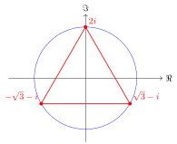
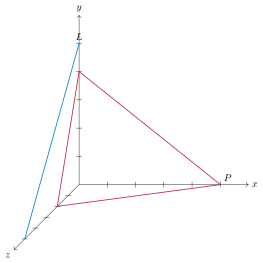

# Solutions of the exercises

## Complex numbers

<strong>Solution C.1.1</strong>

 (See <a href="../c/#ueb-complex-1" data-reference-type="ref+Label" data-reference="ueb:complex-1">Exercise 1.4</a>.) We have $\frac{i-1}{i+1} = \frac{(i-1)\overline{i+1}}{|i+1|^2} = \frac{(i-1)(1-i)}{2} = i$. Thus $z=i^3 = -i$ is the algebraic form. We have $|z|=1$ and ${\mathrm {arg}} z = \frac 32 \pi$, so

\[
z = \cos(\frac 32 \pi) + i \sin \frac 32 \pi.
\]

<strong>Solution C.1.2</strong>

 (See <a href="../c/#ueb-complex-2" data-reference-type="ref+Label" data-reference="ueb:complex-2">Exercise 1.5</a>.) In order to solve

\[
z = 3i |z|\overline z
\]

we would like to divide by $z$. This is only possible if $z \ne 0$, so we first consider the case $z = 0$. In this case both sides of the equation are equal to 0, so $z=0$ is indeed a solution. Now, we consider $z \ne 0$ and divide the above equation by $z$ and obtain

\[
1 = 3i |z| \frac{\overline z}z.
\]

There are different ways to solve this equation. One may put $z = a+ib$ and solve the resulting quadratic equation. For illustrational purposes, we rather consider the trigonometric form $z = r (\cos \alpha + i \sin \alpha)$. Then $\overline z = r (\cos \alpha - i \sin \alpha) = r (\cos (-\alpha) + i \sin (-\alpha))$, and

\[
|z| \frac{\overline z}z = r \frac{r (\cos (-\alpha) + i \sin (-\alpha))}{r (\cos (\alpha) + i \sin (\alpha))}.
\]

Note that $r = |z| \ne 0$, so we can cancel this in the right-hand fraction. We have

\[
\frac{\cos (-\alpha) + i \sin (-\alpha)}{\cos (\alpha) + i \sin (\alpha)} = \cos(-2\alpha) + i \sin(-2\alpha).
\]

We then obtain

\[
\frac 1{3i} = -\frac 13 i = |z| \frac{\overline z}z = r (\cos(-2\alpha) + i \sin(-2\alpha)).
\]

This implies $r = \frac 13$. Concerning the arguments, we have to be more careful: the above equation is equivalent to saying that

\[
-2 \alpha \equiv \frac 32 \pi \mod 2 \pi
\]

cf. around <a href="../c/#eq-mod-2pi" data-reference-type="eqref" data-reference="eq:mod-2pi">Equation (1.6)</a>. There are two solutions: $-2 \alpha = \frac 32 \pi$ or $- 2\alpha = \frac 32 \pi + 2 \pi$. The former yields $\alpha = -\frac 34 \pi$, the latter $\alpha = \frac \pi 4$. (Of course, we can now add integer multiples of $2\pi$ to these values of $\alpha$, so $\alpha = \frac 54 \pi$ is another solution. However, this gives the same value for $z$.) The resulting solutions are

\[
z = \frac 1 3 (\cos(-\frac 34 \pi) + i \sin (-\frac 34 \pi))
\]

and

\[
z = \frac 1 3 (\cos(\frac 14 \pi) + i \sin (\frac 14 \pi)).
\]

To sum up, the above equation has three solutions, $z = 0$ and these two solutions.

<strong>Solution C.1.3</strong>

 (See <a href="../c/#ueb-complex-3" data-reference-type="ref+Label" data-reference="ueb:complex-3">Exercise 1.6</a>.) There are three solutions, namely

\[
z_0 = \sqrt 3 - i = 2 (\cos (-\pi/6) + i \sin(-\pi/6)),
\]

\[
z_1 = -\sqrt 3 - i = 2 (\cos (-5\pi/6) + i \sin(-5\pi/6)),
\]

\[
z_2 = 2i = 2 (\cos (-3\pi/2) + i \sin(-3\pi/2)).
\]

Here is a picture:

## Systems of linear equations

<strong>Solution C.2.1</strong>

 (See <a href="../systems/#ueb-equation-no-solutions" data-reference-type="ref+Label" data-reference="ueb:equation-no-solutions">Exercise 2.6</a>.) If $a \ne 0$ *or* $b \ne 0$, then the equation $ax+by = c$ has infinitely many solutions. Indeed, if, say $a \ne 0$, we can subtract $by$ and divide by $a$, which gives $x = \frac{c-by}a$. Thus, for any $y \in {\bf R}$, the pair $(x=\frac{c-by}a, y)$ is a solution. A similar analysis works if $b \ne 0$. It remains to consider the case in which $a=0$ and $b=0$. In this case the solution set of the equation depends on $c$:

- If $c = 0$, then *any* pair $(x,y)$ is a solution. Indeed: $0 x + 0y= 0$ holds true then. Thus, if $a=b=c=0$, there are infinitely many solutions.

- If $c \ne 0$, the equation $0x+0y = c$ has no solution, since the left hand side is always 0, while the right hand side is nonzero. So, in the case $a=b=0$ but $c \ne 0$, there is *no* solution.

<strong>Solution C.2.2</strong>

 (See <a href="../systems/#ueb-systems-1-a" data-reference-type="ref+Label" data-reference="ueb:systems-1-a">Exercise 2.10</a>.) The matrix associated to the system is as follows, and we bring it to reduced row echelon form:

\[
\begin{align*}
\left ( \begin{array}{ccc|c} 1 & 2 & -1 & 0 \\ -2 & -3 & 1 & 1 \\ 0 & 1 & -1 & 1 \end{array} \right ) \leadsto & 
\left ( \begin{array}{ccc|c} 1 & 2 & -1 & 0 \\ 0 & 1 & -1 & 1 \\ 0 & 1 & -1 & 1 \end{array} \right ) \\
\leadsto & 
\left ( \begin{array}{ccc|c} 1 & 2 & -1 & 0 \\ 0 & 1 & -1 & 1 \\ 0 & 0 & 0 & 0 \end{array} \right ) 
\leadsto 
\left ( \begin{array}{ccc|c} \underline 1 & 0 & +1 & -2 \\ 0 & \underline 1 & -1 & 1 \\ 0 & 0 & 0 & 0 \end{array} \right )
\end{align*}
\]

We have two leading ones (underlined), so the third unknown $x_3$ is a free variable and $x_1$ and $x_2$ are non-free, and we have $x_2 = 1+x_3$ and $x_1 = -2 -x_3$. Thus, the solution set is

\[
\{(-2-x_3, 1+x_3, x_3) \ | \ x_3 \in {\bf R} \}.
\]

<strong>Solution C.2.3</strong>

 (See <a href="../systems/#ueb-systems-1-b" data-reference-type="ref+Label" data-reference="ueb:systems-1-b">Exercise 2.12</a>.) We apply <a href="../systems/#met-gaussian-elimination-solve" data-reference-type="ref+Label" data-reference="met:gaussian-elimination-solve">Method 2.31</a>. The matrix associated to the system is

\[
\left ( \begin{array}{cccc|c} 1 & -1 & 1 & 0 & -2 \\ 0 & 0 & 1 & -1 & 1 \\ 1 & -1 & 0 & 1 & -3 \\ 1 & -1 & 3 & -2 & 0 \end{array} \right ).
\]

We compute the reduced row-echelon form of that matrix using Gaussian eliminiation (<a href="../systems/#met-gaussian-algorithm" data-reference-type="ref+Label" data-reference="met:gaussian-algorithm">Method 2.29</a>): we subtract the first row from the third, which gives

\[
\left ( \begin{array}{cccc|c} 1 & -1 & 1 & 0 & -2 \\ 0 & 0 & 1 & -1 & 1 \\ 0 & 0 & -1 & 1 & -1 \\ 1 & -1 & 3 & -2 & 0 \end{array} \right ).
\]

We then subtract the first row from the fourth:

\[
\left ( \begin{array}{cccc|c} 1 & -1 & 1 & 0 & -2 \\ 0 & 0 & 1 & -1 & 1 \\ 0 & 0 & -1 & 1 & -1 \\ 0 & 0 & 2 & -2 & 2 \end{array} \right ).
\]

We add the second line to the third:

\[
\left ( \begin{array}{cccc|c} 1 & -1 & 1 & 0 & -2 \\ 0 & 0 & 1 & -1 & 1 \\ 0 & 0 & 0 & 0 & 0 \\ 0 & 0 & 2 & -2 & 2 \end{array} \right ).
\]

We then add $(-2)$ times the second line to the fourth (equivalently, subtract $2$ times the second line from the fourth):

\[
\left ( \begin{array}{cccc|c} {\underline 1} & -1 & 1 & 0 & -2 \\ 0 & 0 & {\underline 1} & -1 & 1 \\ 0 & 0 & 0 & 0 & 0 \\ 0 & 0 & 0 & 0 & 0 \end{array} \right ).
\]

This matrix is in row-echelon form, with the leading 1’s being underlined above. We finally bring it into reduced row-echelon form by subtracting the second from the first line, which gives

\[
\left ( \begin{array}{cccc|c} {\underline 1} & -1 & 0 & 1 & -3 \\ 0 & 0 & {\underline 1} & -1 & 1 \\ 0 & 0 & 0 & 0 & 0 \\ 0 & 0 & 0 & 0 & 0 \end{array} \right ).
\]

The matrix has no entry of the form $0 \ \dots \ 0 \ 1$, so the system does have a solution. The first column of the matrix corresponds to the variable $x_1$ etc., so that the free variables are $x_2$ and $x_4$. We let $x_2 = \alpha$, $x_4 = \beta$, where $\alpha$ and $\beta$ are arbitrary real numbers. The non-free variables $x_1$ and $x_3$ are uniquely determined by $\alpha$ and $\beta$. To compute them, we use the equations obtained by the matrix

\[
\begin{align*}
x_3 - \beta & = 1 \\
x_1 -\alpha + \beta & = -3
\end{align*}
\]

which we solve as $x_3 = 1 + \beta$ and $x_1 = \alpha-\beta-3$. Thus, the solution set is

\[
\{(\alpha - \beta - 3, \alpha, 1+\beta, \beta) \ | \ \alpha, \beta \in {\bf R}\}.
\]

<strong>Solution C.2.4</strong>

 (See <a href="../systems/#ueb-systems-1-c" data-reference-type="ref+Label" data-reference="ueb:systems-1-c">Exercise 2.14</a>.) Hint: we will apply Gaussian elimination, but it simplifies the calculations to do a certain change of rows first. (Why is that allowed?)

<strong>Solution C.2.5</strong>

 (See <a href="../systems/#ueb-systems-1-d" data-reference-type="ref+Label" data-reference="ueb:systems-1-d">Exercise 2.17</a>.) Suppose $x_1 = 1-t$, $x_2 = 2+3t$ and $x_3 = 4t$. We have to determine whether there is some $t\in {\bf R}$ such that for these choices of $x_1, x_2, x_3$, we have a solution of the given system, i.e., whether

\[
\begin{align*}
x_1 + x_2 + x_3 & = (1-t)+(2+3t)+4t & = 1 \\
x_1 - x_3 & = 1-t-4t & = 0.
\end{align*}
\]

Simplifying these equations gives the system

\[
\begin{align*}
6t + 3 & = 0 \\
1-5t & = 0.
\end{align*}
\]

This system has no solutions, so there is no $t \in {\bf R}$ such that the vector $(1-t, 2+3t, 4t)$ is a solution to the original system.

<strong>Solution C.2.6</strong>

 (See <a href="../systems/#ueb-systems-1-e" data-reference-type="ref+Label" data-reference="ueb:systems-1-e">Exercise 2.19</a>.) We substitute $x_1 = 1+t$, $x_2 = t+q$ and $x_3 = -t+2q+1$ into the given equation and get the equation

\[
3(1+t)+2(t+q)-(-t+2q+1)=5.
\]

This simplifies to

\[
6t+2=5
\]

which has the solution $t = -\frac 12$. Since the variable $q$ does not appear in that equation it is a free variable. Thus, for all $q \in {\bf R}$, the vector

\[
(x_1 = 1-\frac 12, x_2 = -\frac 12 + q, x_3 = \frac 12 + 2q+1) = (\frac 12, -\frac 12+q, \frac 32 + 2q)
\]

satisfies the requested conditions. Note that these are infinitely many solutions.

<strong>Solution C.2.7</strong>

 (See <a href="../systems/#ueb-systems-1-f" data-reference-type="ref+Label" data-reference="ueb:systems-1-f">Exercise 2.20</a>.) We have to find $a_0, \dots, a_3$, so these are the unknowns. The conditions amount to the linear (!) system

\[
\begin{align*}
p(1) & = a_0 + a_1 + a_2 + a_3 & = 0 \\
p(2) & = a_0 + a_1 \cdot 2+ a_2 \cdot 2^2 + a_3 \cdot 2^3 & = 3.
\end{align*}
\]

This can be rewritten as

\[
\begin{align*}
a_0 + a_1 + a_2 + a_3 & = 0 \\
a_0 + 2 a_1 + 4 a_2 + 8 a_3 & = 3.
\end{align*}
\]

Using Gaussian elimination to solve this: the associated matrix is

\[
\left ( \begin{array}{cccc|c} 1 & 1 & 1 & 1 & 0 \\ 1 & 2 & 4 & 8 & 3 \end{array} \right ).
\]

Subtracting the first from the second row gives

\[
\left ( \begin{array}{cccc|c} 1 & 1 & 1 & 1 & 0 \\ 0 & 1 & 3 & 7 & 3 \end{array} \right ).
\]

Subtracting the second from the first yields a reduced row echelon matrix:

\[
\left ( \begin{array}{cccc|c} 1 & 0 & -2 & -6 & -3 \\ 0 & 1 & 3 & 7 & 3 \end{array} \right ).
\]

The variables $a_0$ and $a_1$ correspond to the leading 1’s, the variables $a_2$ and $a_3$ are therefore free variables. Thus, there are infintely many solutions. One solution, for $a_2 = a_3 = 0$ is

\[
a_0 = -3, \ a_1 = 3,
\]

so that

\[
p(x) = -3 + 3x
\]

is a solution to the problem. Another solution would be $a_2 = a_3 = 1$, which gives $a_1 = -7$ and $a_0 = 5$, i.e.,

\[
p(x) = 5 - 7 x + x^2 + x^3.
\]

<strong>Solution C.2.8</strong>

 (See <a href="../systems/#ex-maps-exercise-008" data-reference-type="ref+Label" data-reference="ex:maps-exercise-008">Exercise 2.25</a>.) We solve, for each $\lambda\in\mathbf R$, the system by Gaussian elimination (<a href="../systems/#met-gaussian-elimination-solve" data-reference-type="ref+Label" data-reference="met:gaussian-elimination-solve">Method 2.31</a>):

\[
\left ( \begin{array}{ccc|c} \lambda & 0 & 0 & 0\\ 0 & \lambda & 1+\lambda & 1\\ \lambda & 1 & 2 & 3 \end{array} \right )
\xrightarrow{R_3\leftarrow R_3-R_1}
\left ( \begin{array}{ccc|c} \lambda & 0 & 0 & 0\\ 0 & \lambda & 1+\lambda & 1\\ 0 & 1 & 2 & 3 \end{array} \right ).
\]

We would like to divide the first row by $\lambda$, which however is only a legitimate row operation (<a href="../systems/#def-elementary-row-operations" data-reference-type="ref+Label" data-reference="def:elementary-row-operations">Definition 2.28</a>) if $\lambda \ne 0$. So we distinguish two cases:

- *Case $\lambda=0$.* The matrix becomes

\[
  \left ( \begin{array}{ccc|c} 0 & 0 & 0 & 0\\ 0 & 0 & 1 & 1\\ 0 & 1 & 2 & 3 \end{array} \right ),
\]

  so $x_3=1$, $x_2=1$, and $x_1$ is free. Hence the solution set is $\{(t, 1, 1) \mid t \in \mathbf R\}$.

- *Case $\lambda\neq0$.* Divide row 2 by $\lambda$ and eliminate the $1$ in row 3, column 2:

\[
  \left ( \begin{array}{ccc|c} \lambda & 0 & 0 & 0\\ 0 & 1 & \frac{1+\lambda}{\lambda} & \frac1\lambda\\ 0 & 1 & 2 & 3 \end{array} \right )
      \xrightarrow{R_3\leftarrow R_3-R_2}
      \left ( \begin{array}{ccc|c} \lambda & 0 & 0 & 0\\ 0 & 1 & \frac{1+\lambda}{\lambda} & \frac1\lambda\\ 0 & 0 & \frac{\lambda-1}{\lambda} & \frac{3\lambda-1}{\lambda} \end{array} \right ).
\]

  The next possible division is by $\lambda-1$, so we split again:

  - If $\lambda=1$, the last row is $0\;0\;0\mid2$, so there is no solution.

  - If $\lambda\neq1$, then

\[
    x_1=0,\qquad x_3=\frac{3\lambda-1}{\lambda-1}=\frac{1-3\lambda}{1-\lambda},\qquad x_2=3-2x_3.
\]

    So the solution is unique.

*Summary:*

- If $\lambda=0$: infinitely many solutions, namely $(t,1,1)$ with $t\in\mathbf R$.

- If $\lambda=1$: no solution.

- If $\lambda\neq0,1$: unique solution $\left(0,\,3-2\frac{1-3\lambda}{1-\lambda},\,\frac{1-3\lambda}{1-\lambda}\right)$.

## Vector spaces

<strong>Solution C.3.1</strong>

 (See <a href="../spaces/#ueb-exotic-scalar-multiplication" data-reference-type="ref+Label" data-reference="ueb:exotic-scalar-multiplication">Exercise 3.1</a>.) To decide whether we get a vector space, we check axioms from <a href="../spaces/#def-vector-space" data-reference-type="ref+Label" data-reference="def:vector-space">Definition 3.10</a>, especially

- $(r+s)v=rv+sv$ (<a href="../spaces/#def-vector-space" data-reference-type="ref+Label" data-reference="def:vector-space">Definition 3.10</a><a href="../spaces/#item-distributive-law" data-reference-type="ref" data-reference="item--distributive law">4.</a>),

- $(rs)v=r(sv)$ (<a href="../spaces/#def-vector-space" data-reference-type="ref+Label" data-reference="def:vector-space">Definition 3.10</a><a href="../spaces/#item-multiplication-law" data-reference-type="ref" data-reference="item--multiplication.law">6.</a>),

- and $1v=v$ (item 7 in <a href="../spaces/#def-vector-space" data-reference-type="ref+Label" data-reference="def:vector-space">Definition 3.10</a>).

1.  $r\cdot(x,y,z)=(rx,y,rz)$. Let $v=(x,y,z)$. Then

\[
    (r+s)\cdot v=((r+s)x,y,(r+s)z),
\]

    while

\[
    r\cdot v+s\cdot v=(rx,y,rz)+(sx,y,sz)=((r+s)x,2y,(r+s)z).
\]

    In general these are different (e.g. if $y\neq 0$), so

\[
    (r+s)v\neq rv+sv.
\]

    Thus axiom <a href="../spaces/#def-vector-space" data-reference-type="ref+Label" data-reference="def:vector-space">Definition 3.10</a><a href="../spaces/#item-distributive-law" data-reference-type="ref" data-reference="item--distributive law">4.</a> fails. Hence this is *not* a vector space structure.

2.  $r\cdot(x,y,z)=(0,0,0)$.

    For any nonzero $v\in V$,

\[
    1\cdot v=(0,0,0)\neq v.
\]

    So the identity axiom $1v=v$ from <a href="../spaces/#def-vector-space" data-reference-type="ref+Label" data-reference="def:vector-space">Definition 3.10</a> fails. Hence this is *not* a vector space structure.

3.  $r\cdot(x,y,z)=(r^2x,r^2y,r^2z)$.

    Here, for every $v=(x,y,z)\in V$,

\[
    1\cdot v=(1^2x,1^2y,1^2z)=(x,y,z)=v,
\]

    so the axiom $1v=v$ (item 7 in <a href="../spaces/#def-vector-space" data-reference-type="ref+Label" data-reference="def:vector-space">Definition 3.10</a>) is satisfied. Also,

\[
    (r+s)\cdot v=((r+s)^2x,(r+s)^2y,(r+s)^2z),
\]

    while

\[
    r\cdot v+s\cdot v=(r^2x,r^2y,r^2z)+(s^2x,s^2y,s^2z)=((r^2+s^2)x,(r^2+s^2)y,(r^2+s^2)z).
\]

    In general these are different (e.g. $r=s=1$ and $v\neq 0$), so

\[
    (r+s)v\neq rv+sv.
\]

    Hence <a href="../spaces/#def-vector-space" data-reference-type="ref+Label" data-reference="def:vector-space">Definition 3.10</a><a href="../spaces/#item-distributive-law" data-reference-type="ref" data-reference="item--distributive law">4.</a> fails. (By contrast, <a href="../spaces/#def-vector-space" data-reference-type="ref+Label" data-reference="def:vector-space">Definition 3.10</a><a href="../spaces/#item-multiplication-law" data-reference-type="ref" data-reference="item--multiplication.law">6.</a> does hold here.) Hence this is *not* a vector space structure.

Therefore, in all three cases, $V$ is *not* a vector space.

<strong>Solution C.3.2</strong>

 (See <a href="../spaces/#ex-2-1" data-reference-type="ref+Label" data-reference="ex 2.1">Exercise 3.13</a>.) A linear combination of $A$ and $B$ is of the form

\[
\alpha A + \beta B = \alpha \left ( \begin{array}{cc} 1 & 1 \\ 2 & 2 \end{array} \right ) + \beta \left ( \begin{array}{cc} 3 & 2 \\ 3 & 5 \end{array} \right )
\]

with $\alpha, \beta \in {\bf R}$. Computing the left hand side, we need to find $\alpha$ and $\beta$ such that

\[
\left ( \begin{array}{cc} \alpha & \alpha \\ 2 \alpha & 2 \alpha \end{array} \right ) + \left ( \begin{array}{cc} 3 \beta & 2 \beta \\ 3 \beta & 5 \beta \end{array} \right ) = \left ( \begin{array}{cc} \alpha + 3\beta & \alpha + 2 \beta \\ 2\alpha+3\beta & 2\alpha+5\beta \end{array} \right ) = \left ( \begin{array}{cc} -1 & 0 \\ 2 & 4 \end{array} \right ).
\]

Comparing the entries of the matrix, this gives the linear system

\[
\begin{align*}
\alpha + 3 \beta & = -1 \\
\alpha + 2 \beta & = 0\\
2\alpha + 3\beta & = 2\\
2\alpha + 5 \beta & = 4.
\end{align*}
\]

The second gives $\alpha = -2\beta$, inserting into the first gives $-2 \beta+3 \beta = -1$, which means $\beta = -1$. However, inserting into the third equation gives $-4\beta + 3 \beta = 2$, so that $\beta = -2$, contradicting the previous equation. Thus, there is no solution, so $C$ is *not* a linear combination of $A$ and $B$.

<strong>Solution C.3.3</strong>

 (See <a href="../spaces/#ex-2-2" data-reference-type="ref+Label" data-reference="ex 2.2">Exercise 3.15</a>.) The system $x + y + z+t=0$ corresponds to the matrix

\[
( 1 \ 1 \ 1 \ 1 ).
\]

This matrix is already in reduced row echelon form: the leading one is for the variable $x$, the variables $y, z, t$ are free variables. Thus,

\[
S = \{(-\alpha - \beta - \gamma , \alpha, \beta, \gamma) \ | \ \alpha, \beta, \gamma \in {\bf R} \}.
\]

We have

\[
\begin{align*}
S & = \{(-\alpha, \alpha, 0,0) + (-\beta, 0, \beta, 0) + (-\gamma, 0, 0, \gamma) \ | \ \alpha, \beta, \gamma \in {\bf R}\}  \\
& = \{\alpha(-1, 1, 0,0) + \beta (-1, 0, 1, 0) + \gamma(-1, 0, 0, 1) \ | \ \alpha, \beta, \gamma \in {\bf R}\}  \\
& = L((-1,1,0,0), (-1,0,1,0), (-1,0,0,1)).
\end{align*}
\]

<strong>Solution C.3.4</strong>

 (See <a href="../spaces/#ex-2-3" data-reference-type="ref+Label" data-reference="ex 2.3">Exercise 3.16</a>.) By definition, $S$ consists of all the linear combinations of the three given vectors. These can be written as

\[
a (1,-1,0,1) + b(2,1,-2,0)+c(0,0,1,1) = (a+2b,-a+b,-2b+c,a+c)
\]

for arbitrary $a,b,c \in {\bf R}$. The intersection is given by vectors as above satisfying the linear system determining $T$, i.e.,

\[
\begin{align*}
x_1 &= a+2b\\
x_2 & = -a+b \\
x_3 &= -2b+c \\
x_4 & = a+c
\end{align*}
\]

such that

\[
\begin{align*}
2(a+2b)-(-a+b)-3(a+c) & = 0\\
2(a+2b)+(-2b+c)+(a+c) & = 0.
\end{align*}
\]

Simplifying these equations gives

\[
\begin{align*}
3b-3c & = 0\\
3a+2b+2c & = 0.
\end{align*}
\]

Thus $b=c$ and $3a+4c=0$, i.e., $a = -\frac 43c$, and $c$ is a free variable. (Alternatively, the above system is associated to the matrix $\left ( \begin{array}{ccc} 0 & 3 & -3 \\ 3 & 2 & 2 \end{array} \right )$, which can be brought into reduced row echelon form.) Thus,

\[
\begin{align*}
S \cap T & = \{-\frac 43 c(1,-1,0,1) + c(2,1,-2,0)+c(0,0,1,1) \ | \ c \in {\bf R} \} \\
& = \{ c \left ( (-\frac 43, \frac 43, 0, -\frac 43) + (2,1,-2,0)+(0,0,1,1) \right ) \ | \ c \in {\bf R} \} \\
& = \{ c ( \frac 23, \frac 73, -1, - \frac 13) \ | \ c \in {\bf R} \} \\
& = L(( \frac 23, \frac 73, -1, - \frac 13)).
\end{align*}
\]

<strong>Solution C.3.5</strong>

 (See <a href="../spaces/#ex-2-4" data-reference-type="ref+Label" data-reference="ex 2.4">Exercise 3.25</a>.) We have to find a vector $v \in W_1$ that is also contained in $W_2$. This means that

\[
v = a (1,0,1)+b(2,1,0) = (a+2b,b,a)
\]

<strong>(C.1)</strong>

 for some $a, b \in {\bf R}$ and at the same time

\[
v = \alpha(-1,-1,1) + \beta(0,3,0) = (-\alpha, -\alpha + 3 \beta, \alpha)
\]

for some $\alpha, \beta \in {\bf R}$. Comparing the two vectors gives the following linear system, where $a, b, \alpha, \beta$ are the unknowns:

\[
\begin{align*}
a + 2 b & = -\alpha \\
b & = -\alpha + 3\beta \\
a & = \alpha.
\end{align*}
\]

We solve this system: the last equation gives $a = \alpha$ and, from the first equation, $b = -\alpha$. The second equation implies $\beta = 0$. There is no condition on $\alpha$, this $\alpha = r$ for an arbitrary real number $r \in {\bf R}$.

Instead of solving the above system by hand, we may also use Gaussian elimination to solve this linear system. The matrix is the following (where the columns are for $a, b, \alpha, \beta$, in that order):

\[
\begin{align*}
\left ( \begin{array}{cccc} 1 & 2 & 1 & 0 \\ 0 & 1 & 1 & -3 \\ 1 & 0 & -1 & 0 \end{array} \right ) \leadsto
& \left ( \begin{array}{cccc} 1 & 2 & 1 & 0 \\ 0 & 1 & 1 & -3 \\ 0 & -2 & -2 & 0 \end{array} \right ) \leadsto
\left ( \begin{array}{cccc} 1 & 2 & 1 & 0 \\ 0 & 1 & 1 & -3 \\ 0 & 0 & 0 & -6 \end{array} \right ) \\ & \leadsto 
\left ( \begin{array}{cccc} 1 & 2 & 1 & 0 \\ 0 & 1 & 1 & -3 \\ 0 & 0 & 0 & 1 \end{array} \right ).
\end{align*}
\]

The three leading ones are for the variables $a, b, \beta$, and $\alpha$ is a free variable, so let $\alpha = r$, where $r \in {\bf R}$ is an arbitrary real number. This gives again $\beta = 0$, $b + r - 3\beta = 0$, so that $b = - r$ and $a = r$.

Thus the intersection $W_1 \cap W_2$ consists of the vectors

\[
v = \alpha (1,0,1) + (-\alpha)(2,1,0) = \alpha(-1,-1,1) + 0 (0,3,0) = (-\alpha, -\alpha, \alpha).
\]

Thus,

\[
W_1 \cap W_2 = L((1,-1,1)),
\]

so a basis of $W_1 \cap W_2$ consists of (the single vector) $(1,-1,1)$, and in particular

\[
\dim W_1 \cap W_2 = 1.
\]

We now consider $W_1 + W_2$. According to <a href="../spaces/#def-sum-of-vector-spaces" data-reference-type="ref+Label" data-reference="def:sum-of-vector-spaces">Definition 3.34</a>,

\[
W_1 + W_2 = \{w_1 + w_2 \ | \ w_1 \in W_1, w_2 \in W_2 \},
\]

i.e., of arbitrary sums whose two summands are in $W_1$, respectively $W_2$.

As was noted in the proof of <a href="../spaces/#cor-dim-sum-inequality" data-reference-type="ref+Label" data-reference="cor:dim-sum-inequality">Corollary 3.73</a>, if $V_1 = L(v_1, \dots, v_n)$ and $V_2 = L(w_1, \dots, w_m)$ are two subspaces of a vector space $V$, then the sum

\[
V_1 + V_2 = L(v_1, \dots, v_n, w_1, \dots, w_m).
\]

For the subspaces $W_1, W_2$ above, this means that we determine the span

\[
L(\underbrace{(1,0,1)}_{v_1}, \underbrace{(2,1,0)}_{v_2}, \underbrace{(-1,-1,1)}_{w_1}, \underbrace{(0,3,0)}_{w_2}).
\]

By <a href="../spaces/#def-basis" data-reference-type="ref+Label" data-reference="def:basis">Definition 3.58</a><a href="../spaces/#item-generators-remove" data-reference-type="ref" data-reference="item--generators.remove">1.</a>, we obtain a basis of $W_1 + W_2$ by (possibly) removing several of these four vectors. To determine which ones these are, we apply <a href="../spaces/#met-check-linear-independence" data-reference-type="ref+Label" data-reference="met:check-linear-independence">Method 3.53</a> and <a href="../spaces/#met-check-generating-system" data-reference-type="ref+Label" data-reference="met:check-generating-system">Method 3.44</a>. The matrix built out of the four vectors is

\[
\left ( \begin{array}{c} v_1 \\ v_2 \\ w_1 \\ w_2 \end{array} \right ) = \left ( \begin{array}{ccc} 1 & 0 & 1 \\ 2 & 1 & 0 \\ \hline -1 & -1 & 1 \\ 0 & 3 & 0 \end{array} \right ) \leadsto \left ( \begin{array}{ccc} 1 & 0 & 1 \\ 0 & 1 & -2 \\ \hline 0 & -1 & 2 \\ 0 & 3 & 0 \end{array} \right ) \leadsto
\left ( \begin{array}{ccc} 1 & 0 & 1 \\ 0 & 1 & -2 \\ \hline \underline{0} & \underline{0} & \underline{0} \\ 0 & 0 & 6 \end{array} \right ).
\]

Note that in this process we only added multiples of some rows to another row, but did not interchange any rows. Since we have the zero vector (underlined) in the third row, the vector $w_1$ is a linear combination of $v_1$ and $v_2$. The vectors $v_1, v_2, w_2$ are however linearly independent. Thus, they form a basis of $W_1 + W_2$. In particular, $\dim (W_1 + W_2) = 3$.

An alternative way to determine at least the dimension of $W_1 + W_2$ is to use <a href="../spaces/#thm-dim-cap-sum" data-reference-type="ref+Label" data-reference="thm:dim-cap-sum">Theorem 3.74</a>:

\[
\dim (W_1 + W_2) = \dim W_1 + \dim W_2 - \dim (W_1 \cap W_2).
\]

Using again <a href="../spaces/#met-check-linear-independence" data-reference-type="ref+Label" data-reference="met:check-linear-independence">Method 3.53</a>, one can check that $v_1, v_2$ is a basis of $W_1$, so that $\dim W_1 = 2$ and similarly that $w_1, w_2$ form a basis of $W_2$, so that $\dim W_2 = 2$. Thus, using the first part of the exercise, we confirm $\dim (W_1 + W_2) = 3$.

<strong>Solution C.3.6</strong>

 (See <a href="../spaces/#ex-2-5" data-reference-type="ref+Label" data-reference="ex 2.5">Exercise 3.27</a>.) We will show that $v_1, v_2, v_3$ are linearly independent (in ${\bf R}^4$ and therefore also in the subspace $W$) and therefore form a basis of $W$. We use <a href="../spaces/#met-check-linear-independence" data-reference-type="ref+Label" data-reference="met:check-linear-independence">Method 3.53</a>:

\[
\begin{align*}
\left ( \begin{array}{c} v_1 \\ v_2 \\ v_3 \end{array} \right ) = & \left ( \begin{array}{cccc} 1 & 0 & 1 & 0 \\ 2 & 0 & 1 & 1 \\ 0 & 0 & 1 & 3 \end{array} \right ) \leadsto \left ( \begin{array}{cccc} 1 & 0 & 1 & 0 \\ 0 & 0 & -1 & 1 \\ 0 & 0 & 1 & 3 \end{array} \right ) 
\leadsto \left ( \begin{array}{cccc} 1 & 0 & 1 & 0 \\ 0 & 0 & 1 & -1 \\ 0 & 0 & 0 & 4 \end{array} \right )\\
\leadsto & \left ( \begin{array}{cccc} 1 & 0 & 1 & 0 \\ 0 & 0 & 1 & -1 \\ 0 & 0 & 0 & 1 \end{array} \right )
\end{align*}
\]

This matrix has three leading ones, so the vectors are linearly independent as claimed.

We “guess” $v = (1, 2, 3, 4)$ and check that these vectors $v_1, v_2, v_3, v$ are linearly independent. By <a href="../spaces/#lem-independent-linear-combination" data-reference-type="ref+Label" data-reference="lem:independent-linear-combination">Lemma 3.51</a>, this will then imply that $v$ is not a linear combination of the other vectors, so that $W \subsetneq L(v_1, v_2, v_3, v)$. We use <a href="../spaces/#met-check-linear-independence" data-reference-type="ref+Label" data-reference="met:check-linear-independence">Method 3.53</a>:

\[
\begin{align*}
\left ( \begin{array}{cccc} 1 & 0 & 1 & 0 \\ 2 & 0 & 1 & 1 \\ 0 & 0 & 1 & 3 \\ 1 & 2 & 3 & 4 \end{array} \right ) & \leadsto
\left ( \begin{array}{cccc} 1 & 0 & 1 & 0 \\ 0 & 0 & -1 & 1 \\ 0 & 0 & 1 & 3 \\ 0 & 2 & 2 & 4 \end{array} \right ) \leadsto
\left ( \begin{array}{cccc} 1 & 0 & 1 & 0 \\ 0 & 0 & -1 & 1 \\ 0 & 0 & 1 & 3 \\ 0 & 1 & 1 & 2 \end{array} \right ) \\
& \leadsto
\left ( \begin{array}{cccc} \underline1 & 0 & 1 & 0 \\ 0 & 0 & 0 & \underline4 \\ 0 & 0 & \underline1 & 3 \\ 0 & \underline1 & 1 & 2 \end{array} \right )
\end{align*}
\]

After dividing the second row by 4, we can interchange rows and get a row echelon matrix with four leading ones (underlined). Thus, $v_1, v_2, v_3, v$ are linearly independent. Therefore, they form in fact a basis of ${\bf R}^4$, and we know by <a href="../spaces/#def-basis" data-reference-type="ref+Label" data-reference="def:basis">Definition 3.58</a><a href="../spaces/#item-dim-subspace" data-reference-type="ref" data-reference="item--dim.subspace">3.</a> that therefore

\[
W \subsetneq {\bf R}^4 = L(v_1, v_2, v_3, v).
\]

<strong>Remark C.2</strong>

 A more systematic way of solving the second part of the exercise, without guessing, is to use <a href="../spaces/#def-basis" data-reference-type="ref+Label" data-reference="def:basis">Definition 3.58</a>: we can take the standard basis of ${\bf R}^4$, and for (at least) one of the four standard basis vectors $e_1, e_2, e_3, e_4$ we will have that this standard basis vector together with $v_1, v_2, v_3$ form a basis of ${\bf R}^4$. We can then use <a href="../spaces/#met-check-linear-independence" data-reference-type="ref+Label" data-reference="met:check-linear-independence">Method 3.53</a> to see that, for example, $v_1, v_2, v_3, e_1$ are linearly independent and therefore form a basis of ${\bf R}^4$, so that in particular $W \subsetneq L(v_1, v_2, v_3, e_1)$.

<strong>Solution C.3.7</strong>

 (See <a href="../spaces/#ex-2-6" data-reference-type="ref+Label" data-reference="ex 2.6">Exercise 3.28</a>.) We bring the matrix formed by these vectors in row-echelon form:

\[
\begin{align*}
\left ( \begin{array}{cccc} 1 & 0 & -1 & 2 \\ 1 & 0 & 0 & 1 \\ 2 & 0 & -1 & 3 \\ 4 & t & -2 & 6 \end{array} \right ) & \leadsto
\left ( \begin{array}{cccc} 1 & 0 & -1 & 2 \\ 0 & 0 & 1 & -1 \\ 0 & 0 & 1 & -1 \\ 0 & t & 2 & -2 \end{array} \right ) \\
&\leadsto \left ( \begin{array}{cccc} 1 & 0 & -1 & 2 \\ 0 & t & 2 & -2 \\ 0 & 0 & 1 & -1 \\ 0 & 0 & 1 & -1 \end{array} \right ) \\
& \leadsto \left ( \begin{array}{cccc} 1 & 0 & -1 & 2 \\ 0 & t & 2 & -2 \\ 0 & 0 & 1 & -1 \\ 0 & 0 & 0 & 0 \end{array} \right ).
\end{align*}
\]

If $t \ne 0$, we can divide by $t$, which gives a matrix with three leading ones. Thus, the space $U_t$ which is spanned by these vectors has dimension 3 in this case. If $t = 0$, we continue simplifying the matrix into row echelon form:

\[
\begin{align*}
\left ( \begin{array}{cccc} 1 & 0 & -1 & 2 \\ 0 & t & 2 & -2 \\ 0 & 0 & 1 & -1 \\ 0 & 0 & 0 & 0 \end{array} \right ) & = 
\left ( \begin{array}{cccc} 1 & 0 & -1 & 2 \\ 0 & 0 & 2 & -2 \\ 0 & 0 & 1 & -1 \\ 0 & 0 & 0 & 0 \end{array} \right ) \\
& \leadsto \left ( \begin{array}{cccc} 1 & 0 & -1 & 2 \\ 0 & 0 & 1 & -1 \\ 0 & 0 & 0 & 0 \\ 0 & 0 & 0 & 0 \end{array} \right ).
\end{align*}
\]

This has two leading ones, thus $\dim U_t = 2$ in this case.

We now consider $t = 1$. The subspace $U := U_1$ then has a basis consisting of the non-zero rows if the matrix above, i.e., it has a basis consisting of the vectors

\[
(1,0,-1,2), (0,1,2,-2), (0,0,1,-1).
\]

In order to determine a basis of $W$, we form the matrix associated to these homogeneous equations, which is

\[
\left ( \begin{array}{cccc} 1 & 1 & 1 & 0 \\ 1 & 0 & 0 & -3 \end{array} \right ) \leadsto \left ( \begin{array}{cccc} 1 & 1 & 1 & 0 \\ 0 & -1 & -1 & -3 \end{array} \right ).
\]

This has two columns not having a leading one, namely the last two. These are the free variables, say $x_3 = a$, $x_4 = b$ for $a , b \in {\bf R}$. To determine a basis of $W$, we therefore have to consider the system

\[
\begin{align*}
x_1 + x_2 + a & = 0\\
x_2 + a + 3b & = 0
\end{align*}
\]

This gives $x_2 = -a-3b$, and $x_1 - 3b=0$ so that $x_1 = 3b$. Thus, a basis of $W$ is given by the two vectors

\[
(0,-1,1,0) \text{ and }(3,-3,0,1).
\]

In order to determine $U \cap W$, consider a generic vector of $U$, i.e., one of the form

\[
\begin{align*}
v & = a(1,0,-1,2) + b(0,1,2,-2) + c(0,0,1,-1) \\
&= (a,b,-a+2b+c,2a-2b-c).
\end{align*}
\]

We require it to satisfy the equations describing $W$:

\[
\begin{align*}
a+b+(-a+2b+c) & = 0\\
a-3(2a-2b-c) & = 0.
\end{align*}
\]

Simplifying these expressions gives the system

\[
\begin{align*}
3b+c & = 0\\
-5a+6b+3c & = 0.
\end{align*}
\]

Therefore $c = -3b$, plugging this into the second equation gives, after simplifying, $-5a-3b = 0$ or $a = -\frac35b$. Thus, our vector $v \in U$ belongs to $W$ precisely if it can be written as

\[
\begin{align*}
-\frac 35 b(1,0,-1,2)+b(0,1,2,-2)+(-3b)(0,0,1,-1) & = (-\frac 3bb, b, \frac35b+2b-3b,-\frac 65b-2b+3b) \\
&= b(-\frac 35, 1, -\frac25, -\frac15),
\end{align*}
\]

where $b \in {\bf R}$ is arbitrary. Thus, a basis of $U \cap W$ is this vector

\[
(-\frac 35, 1, -\frac 25, -\frac 15).
\]

In particular, $\dim U \cap W = 1$.

## Linear maps

<strong>Solution C.4.1</strong>

 (See <a href="../maps/#al" data-reference-type="ref+Label" data-reference="al">Exercise 4.1</a>.) By <a href="#def-product-matrix-vector-sect-2-x-2-matrices" data-reference-type="ref+Label" data-reference="def:product-matrix-vector,sect--2 x 2 matrices">[def:product-matrix-vector,sect--2 x 2 matrices]</a>, for $A = \left ( \begin{array}{cc} a_{11} & a_{12} \\ a_{21} & a_{22} \end{array} \right )$ and $v = \left ( \begin{array}{c} x \\ y \end{array} \right )$, we have

\[
Av = \left ( \begin{array}{c} a_{11}x+a_{12}y \\ a_{21}x+a_{22}y \end{array} \right ).
\]

So we determine $A$ by matching the target coordinates.

1.  Reflection along the $y$-axis sends $(x,y) \mapsto (-x,y)$, hence

\[
    A = \left ( \begin{array}{cc} -1 & 0 \\ 0 & 1 \end{array} \right ).
\]

2.  “Same point” means $(x,y) \mapsto (x,y)$, so

\[
    A = {\mathrm{id}}_2 = \left ( \begin{array}{cc} 1 & 0 \\ 0 & 1 \end{array} \right ).
\]

3.  “Always the origin” means $(x,y) \mapsto (0,0)$, so

\[
    A = \left ( \begin{array}{cc} 0 & 0 \\ 0 & 0 \end{array} \right ).
\]

4.  Reflection along the line $\{(x,x)\}$ swaps coordinates: $(x,y) \mapsto (y,x)$, hence

\[
    A = \left ( \begin{array}{cc} 0 & 1 \\ 1 & 0 \end{array} \right ).
\]

5.  By <a href="../maps/#ex-rotation-matrix-general" data-reference-type="ref+Label" data-reference="ex:rotation-matrix-general">Example 4.18</a>, a counterclockwise rotation by angle $r$ is given by

\[
    \left ( \begin{array}{cc} \cos r & -\sin r \\ \sin r & \cos r \end{array} \right ).
\]

    For $r=60^\circ=\pi/3$ this gives

\[
    A_{\mathrm{ccw}} = \left ( \begin{array}{cc} \frac12 & -\frac{\sqrt 3}{2} \\ \frac{\sqrt 3}{2} & \frac12 \end{array} \right ).
\]

    Clockwise by $60^\circ$ means $r=-\pi/3$, so

\[
    A_{\mathrm{cw}} = \left ( \begin{array}{cc} \frac12 & \frac{\sqrt 3}{2} \\ -\frac{\sqrt 3}{2} & \frac12 \end{array} \right ).
\]

For comparison with the $90^\circ$ case, see also <a href="../maps/#ex-rotation-matrix" data-reference-type="ref+Label" data-reference="ex:rotation-matrix">Example 4.17</a>.

<strong>Solution C.4.2</strong>

 (See <a href="../maps/#ex-maps-exercise-002" data-reference-type="ref+Label" data-reference="ex:maps-exercise-002">Exercise 4.2</a>.) Using <a href="#def-product-matrix-vector-sect-2-x-2-matrices" data-reference-type="ref+Label" data-reference="def:product-matrix-vector,sect--2 x 2 matrices">[def:product-matrix-vector,sect--2 x 2 matrices]</a>, for

\[
A = \left ( \begin{array}{cc} a_{11} & a_{12} \\ a_{21} & a_{22} \end{array} \right )
\]

and $v=\left ( \begin{array}{c} x \\ y \end{array} \right )$ we have

\[
Av = \left ( \begin{array}{c} a_{11}x+a_{12}y \\ a_{21}x+a_{22}y \end{array} \right ).
\]

We want

\[
Av = \left ( \begin{array}{c} -y \\ x \end{array} \right ),
\]

so comparing coefficients gives $a_{11}=0$, $a_{12}=-1$, $a_{21}=1$, and $a_{22}=0.$ Hence

\[
A = \left ( \begin{array}{cc} 0 & -1 \\ 1 & 0 \end{array} \right ).
\]

Geometrically, this is a counterclockwise rotation by $90^\circ$ (equivalently, clockwise by $270^\circ$), compare <a href="../maps/#ex-rotation-matrix" data-reference-type="ref+Label" data-reference="ex:rotation-matrix">Example 4.17</a>.

<strong>Solution C.4.3</strong>

 (See <a href="../maps/#ex-maps-exercise-003" data-reference-type="ref+Label" data-reference="ex:maps-exercise-003">Exercise 4.3</a>.) By <a href="../maps/#prop-matrix-to-linear-map" data-reference-type="ref+Label" data-reference="prop:matrix-to-linear-map">Proposition 4.43</a> (applied to the standard basis, cf. <a href="../spaces/#ex-standard-basis" data-reference-type="ref+Label" data-reference="ex:standard-basis">Example 3.59</a>), the columns of the matrix $A$ are exactly the vectors $f(e_1),\dots,f(e_4)$. Hence

\[
A = \left ( \begin{array}{cccc} 1 & 0 & 0 & 13 \\ 2 & 0 & 0 & 0 \\ 3 & 7 & 0 & -1 \end{array} \right ).
\]

By <a href="../maps/#def-kernel" data-reference-type="ref+Label" data-reference="def:kernel">Definition 4.22</a>, to determine $\ker f$, we need to solve $Ax=0$. Since there are so many zeros in the matrix, we do this by hand; alternatively one could also use Gaussian elimination (cf. <a href="../systems/#met-gaussian-elimination-solve" data-reference-type="ref+Label" data-reference="met:gaussian-elimination-solve">Method 2.31</a>). With $x=(x_1,x_2,x_3,x_4)^T$, this system reads

\[
\begin{align*}
x_1 + 13x_4 & = 0 \\
2x_1 & = 0 \\
3x_1 + 7x_2 - x_4 & = 0.
\end{align*}
\]

From $2x_1=0$ we get $x_1=0$, then $x_4=0$, then $x_2=0$; $x_3$ is free. So

\[
\ker f = L\left(\left ( \begin{array}{c} 0 \\ 0 \\ 1 \\ 0 \end{array} \right )\right), \qquad \dim \ker f = 1.
\]

To compute the image, we use <a href="../maps/#prop-basis-row-column-space" data-reference-type="ref+Label" data-reference="prop:basis-row-column-space">Proposition 4.32</a>:

\[
\operatorname{im} f = L\left(\left ( \begin{array}{c} 1 \\ 2 \\ 3 \end{array} \right ),
\left ( \begin{array}{c} 0 \\ 0 \\ 7 \end{array} \right ),
\left ( \begin{array}{c} 0 \\ 0 \\ 0 \end{array} \right ),
\left ( \begin{array}{c} 13 \\ 0 \\ -1 \end{array} \right )\right).
\]

Removing the zero vector, consider

\[
u_1=\left ( \begin{array}{c} 1 \\ 2 \\ 3 \end{array} \right ),\quad
u_2=\left ( \begin{array}{c} 0 \\ 0 \\ 7 \end{array} \right ),\quad
u_3=\left ( \begin{array}{c} 13 \\ 0 \\ -1 \end{array} \right ).
\]

If $a_1u_1+a_2u_2+a_3u_3=0$, then from the second coordinate $2a_1=0$, hence $a_1=0$; from the first coordinate $13a_3=0$, hence $a_3=0$; from the third coordinate $7a_2=0$, hence $a_2=0$. So $u_1,u_2,u_3$ are linearly independent and therefore form a basis of $\operatorname{im} f$. Instead of the above approach, one may also bring $A$ to row-echelon form and observe that the resulting matrix has leading ones in the first, second, and fourth columns, so we again obtain that these three columns of $A$ form a basis of $\operatorname{im} f$ (<a href="../maps/#prop-basis-row-column-space" data-reference-type="ref+Label" data-reference="prop:basis-row-column-space">Proposition 4.32</a>). In particular,

\[
\dim \operatorname{im} f = 3.
\]

As a check, <a href="../maps/#thm-rank-nullity-theorem" data-reference-type="ref+Label" data-reference="thm:rank-nullity-theorem">Theorem 4.26</a> gives

\[
4 = \dim {\bf R}^4 = \dim \ker f + \dim \operatorname{im} f = 1+3.
\]

<strong>Solution C.4.4</strong>

 (See <a href="../maps/#ex-maps-exercise-004" data-reference-type="ref+Label" data-reference="ex:maps-exercise-004">Exercise 4.4</a>.) To compute the rank, we apply <a href="../systems/#met-gaussian-elimination-solve" data-reference-type="ref+Label" data-reference="met:gaussian-elimination-solve">Method 2.31</a>, which requires us to bring the matrix into row-echelon form using Gaussian elimination (<a href="../systems/#met-gaussian-algorithm" data-reference-type="ref+Label" data-reference="met:gaussian-algorithm">Method 2.29</a>). We perform the following elementary row operations (<a href="../systems/#def-elementary-row-operations" data-reference-type="ref+Label" data-reference="def:elementary-row-operations">Definition 2.28</a>).

\[
\begin{align*}
A = \left ( \begin{array}{cccc} 0 & 1 & 2 & 1 \\ 1 & 1 & 1 & 0 \\ 0 & -1 & 1 & 1 \\ 1 & 1 & 4 & 2 \end{array} \right )
&\leadsto
\left ( \begin{array}{cccc} 1 & 1 & 1 & 0 \\ 0 & 1 & 2 & 1 \\ 0 & -1 & 1 & 1 \\ 1 & 1 & 4 & 2 \end{array} \right ) 
\leadsto
\left ( \begin{array}{cccc} 1 & 1 & 1 & 0 \\ 0 & 1 & 2 & 1 \\ 0 & 0 & 3 & 2 \\ 0 & 0 & 3 & 2 \end{array} \right ) \\
&\leadsto
\left ( \begin{array}{cccc} 1 & 1 & 1 & 0 \\ 0 & 1 & 2 & 1 \\ 0 & 0 & 3 & 2 \\ 0 & 0 & 0 & 0 \end{array} \right ).
\end{align*}
\]

This row-echelon matrix has exactly 3 leading ones, so by <a href="../maps/#prop-basis-row-column-space" data-reference-type="ref+Label" data-reference="prop:basis-row-column-space">Proposition 4.32</a> we get $\operatorname{rk}(A) = 3.$

<strong>Solution C.4.5</strong>

 (See <a href="../maps/#ex-maps-exercise-005" data-reference-type="ref+Label" data-reference="ex:maps-exercise-005">Exercise 4.5</a>.) From <a href="../maps/#ex-example-map-basis" data-reference-type="ref+Label" data-reference="ex:example-map-basis">Example 4.42</a> we have

\[
f(e_1)=f(v_1)=(2,-1,0), \qquad f(e_2)=f(v_2)=(1,-1,1),
\]

and, since $e_3=v_2-v_3$ there,

\[
f(e_3)=f(v_2-v_3)=f(v_2)-f(v_3)=(1,-3,-1).
\]

By <a href="../maps/#prop-matrix-linear-map" data-reference-type="ref+Label" data-reference="prop:matrix-linear-map">Proposition 4.19</a>, the matrix of $f$ with respect to the standard basis in source and target has columns $f(e_1),f(e_2),f(e_3)$. Hence

\[
A = \left ( \begin{array}{ccc} 2 & 1 & 1 \\ -1 & -1 & -3 \\ 0 & 1 & -1 \end{array} \right ).
\]

This is exactly the matrix already identified in <a href="../maps/#ex-example-map-basis" data-reference-type="ref+Label" data-reference="ex:example-map-basis">Example 4.42</a>.

<strong>Solution C.4.6</strong>

 (See <a href="../maps/#ex-maps-exercise-006" data-reference-type="ref+Label" data-reference="ex:maps-exercise-006">Exercise 4.6</a>.) Let $v_1=(1,1+\lambda,-1)$, $v_2=(2,\lambda-2,\lambda+2)$. By definition, $W_\lambda=L(v_1,v_2).$ So a basis of $W_\lambda$ is either $\{v_1,v_2\}$ (if they are linearly independent) or a single nonzero vector among them (if they are dependent), cf. <a href="#def-linearly-independent-def-basis" data-reference-type="ref+Label" data-reference="def:linearly-independent,def:basis">[def:linearly-independent,def:basis]</a>.

To find when they are dependent, check whether $v_2=t v_1$ for some $t\in{\bf R}$. From the first coordinate we get $2=t\cdot 1$, hence $t=2$. Then the second coordinate gives $\lambda-2=2(1+\lambda)$ which holds precisely if $\lambda=-4$. For $\lambda=-4$ the third coordinates also agree. Therefore:

- If $\lambda\neq -4$, the vectors $v_1,v_2$ are linearly independent and therefore a basis of $W_\lambda$. Thus $\dim W_\lambda=2$ by <a href="../spaces/#def-dimension" data-reference-type="ref+Label" data-reference="def:dimension">Definition 3.63</a>.

- If $\lambda=-4$, then $v_2=2v_1$, so $v_1=(1,-3,-1)$ is a basis vector of $W_{-4}$ (or any other non-zero multiple of it, such as $v_2)$. We have $\dim W_{-4}=1$.

<strong>Solution C.4.7</strong>

 (See <a href="../maps/#ex-maps-exercise-007" data-reference-type="ref+Label" data-reference="ex:maps-exercise-007">Exercise 4.7</a>.) Let $A = \begin{pmatrix} \alpha & 0 & 0 \\ 0 & \alpha & 1+\alpha \\ \alpha & 1 & 2 \end{pmatrix}$ with $\alpha \in \mathbf{R}$. We determine $\operatorname{rank}(A)$ (for all $\alpha$) by bringing $A$ to row-echelon form and applying <a href="../maps/#prop-basis-row-column-space" data-reference-type="ref+Label" data-reference="prop:basis-row-column-space">Proposition 4.32</a>.

\[
A \leadsto \begin{pmatrix}
\alpha & 0 & 0 \\
0 & \alpha & 1+\alpha \\
0 & 1 & 2
\end{pmatrix}
\]

In order to proceed we need to distinguish whether or not $\alpha = 0$. If $\alpha \neq 0$, we can divide the first row by $\alpha$ (<a href="../systems/#def-elementary-row-operations" data-reference-type="ref+Label" data-reference="def:elementary-row-operations">Definition 2.28</a>)

\[
\begin{pmatrix}
1 & 0 & 0 \\
0 & \alpha & 1+\alpha \\
0 & 1 & 2
\end{pmatrix}
\]

Now, subtract $\frac{1}{\alpha}$ times the second row from the third row (still for $\alpha \neq 0$):

\[
\begin{pmatrix}
1 & 0 & 0 \\
0 & \alpha & 1+\alpha \\
0 & 0 & 2 - \frac{1+\alpha}{\alpha}
\end{pmatrix}
\]

Given that $\alpha \ne 0$, the rank of this matrix is 2 if $2-\frac{1+\alpha}\alpha = 0$, i.e., if $\alpha = 1$, and it is 3 otherwise. This finishes the analysis of the case $\alpha \ne 0$.

If $\alpha = 0$, the matrix reads

\[
\begin{pmatrix}
                1 & 0 & 0 \\
                0 & 1 & 2 \\
                0 & 1 & 2
                \end{pmatrix}
\]

Since the 3rd row equals the 2nd one, one reads off $\operatorname{rank}(A) = 2$ in this case.

In total we get the following result:

- If $\alpha = 1$ or $\alpha = 0$, $\operatorname{rank}(A) = 2$.

- For all other $\alpha \neq 0,1$, $\operatorname{rank}(A) = 3$.

<strong>Solution C.4.8</strong>

 (See <a href="../maps/#ex-maps-exercise-010" data-reference-type="ref+Label" data-reference="ex:maps-exercise-010">Exercise 4.9</a>.) Let $f : \mathbf{R}^4 \to \mathbf{R}^3$ be defined by

\[
f\left(\begin{pmatrix} x_1 \\ x_2 \\ x_3 \\ x_4 \end{pmatrix}\right) = \begin{pmatrix} 2 & -1 & 1 & 1 \\ 0 & 5 & -3 & -5 \\ 3 & -4 & 3 & 4 \end{pmatrix} \begin{pmatrix} x_1 \\ x_2 \\ x_3 \\ x_4 \end{pmatrix} = \begin{pmatrix} 2x_1 - x_2 + x_3 + x_4 \\ 5x_2 - 3x_3 - 5x_4 \\ 3x_1 - 4x_2 + 3x_3 + 4x_4 \end{pmatrix}.
\]

1.  According to <a href="../maps/#def-kernel" data-reference-type="ref+Label" data-reference="def:kernel">Definition 4.22</a>, we need to compute the solution set of the system

\[
    \begin{align*}
            2x_1 - x_2 + x_3 + x_4 &= 0 \\
            5x_2 - 3x_3 - 5x_4 &= 0 \\
            3x_1 - 4x_2 + 3x_3 + 4x_4 &= 0.
    \end{align*}
\]

    We do this using Gaussian elimination (<a href="../systems/#met-gaussian-elimination-solve" data-reference-type="ref+Label" data-reference="met:gaussian-elimination-solve">Method 2.31</a>): we bring the coefficient matrix to row echelon form:

\[
    \begin{pmatrix}
            2 & -1 & 1 & 1 \\
            0 & 5 & -3 & -5 \\
            3 & -4 & 3 & 4
        \end{pmatrix}
        \xrightarrow{R_3\leftarrow 2R_3-3R_1}
        \begin{pmatrix}
            2 & -1 & 1 & 1 \\
            0 & 5 & -3 & -5 \\
            0 & -5 & 3 & 5
        \end{pmatrix}
        \xrightarrow{R_3\leftarrow R_3+R_2}
        \begin{pmatrix}
            2 & -1 & 1 & 1 \\
            0 & 5 & -3 & -5 \\
            0 & 0 & 0 & 0
        \end{pmatrix}
\]

    Divide row 2 by $5$, then eliminate the $-1$ in row 1, column 2:

\[
    \begin{pmatrix}
            2 & -1 & 1 & 1 \\
            0 & 1 & -\frac35 & -1 \\
            0 & 0 & 0 & 0
        \end{pmatrix}
        \xrightarrow{R_1\leftarrow R_1+R_2}
        \begin{pmatrix}
            2 & 0 & \frac25 & 0 \\
            0 & 1 & -\frac35 & -1 \\
            0 & 0 & 0 & 0
        \end{pmatrix}
        \xrightarrow{R_1\leftarrow \frac12R_1}
        \begin{pmatrix}
            1 & 0 & \frac15 & 0 \\
            0 & 1 & -\frac35 & -1 \\
            0 & 0 & 0 & 0
        \end{pmatrix}.
\]

    Hence $x_3,x_4$ are free, and

\[
    x_1=-\frac15x_3,\qquad x_2=\frac35x_3+x_4.
\]

    Writing $x_3=s$, $x_4=t$, we get

\[
    \ker f=
        \left\{
        \begin{pmatrix}
        -\frac15 s\\[2pt]
        \frac35 s+t\\[2pt]
        s\\[2pt]
        t
        \end{pmatrix}
        : s,t\in\mathbf R
        \right\}
        =
        L\!\left(
        \begin{pmatrix}-1\\3\\5\\0\end{pmatrix},
        \begin{pmatrix}0\\1\\0\\1\end{pmatrix}
        \right).
\]

2.  In order to solve $f(v) = \begin{pmatrix} 1 \\ -3 \\ -3 \end{pmatrix}$, we again use Gaussian elimination:

\[
    \begin{align*}
            2x_1 - x_2 + x_3 + x_4 &= 1 \\
            5x_2 - 3x_3 - 5x_4 &= -3 \\
            3x_1 - 4x_2 + 3x_3 + 4x_4 &= -3
    \end{align*}
\]

    The augmented matrix is

\[
    \begin{align*}
        \left ( \begin{array}{cccc|c} 2 & -1 & 1 & 1 & 1 \\ 0 & 5 & -3 & -5 & -3 \\ 3 & -4 & 3 & 4 & -3 \end{array} \right )
        & \xrightarrow{R_3\leftarrow 2R_3-3R_1}
        \left ( \begin{array}{cccc|c} 2 & -1 & 1 & 1 & 1 \\ 0 & 5 & -3 & -5 & -3 \\ 0 & -5 & 3 & 5 & -9 \end{array} \right ) \\
        & \xrightarrow{R_3\leftarrow R_3+R_2}
        \left ( \begin{array}{cccc|c} 2 & -1 & 1 & 1 & 1 \\ 0 & 5 & -3 & -5 & -3 \\ 0 & 0 & 0 & 0 & -12 \end{array} \right ).
    \end{align*}
\]

    By <a href="../systems/#met-gaussian-elimination-solve" data-reference-type="ref+Label" data-reference="met:gaussian-elimination-solve">Method 2.31</a>, the last row implies that there is no solution: this last row would imply $0=-12$, which is false. Therefore the system has no solution, so the preimage is the empty set:

\[
    f^{-1}\!\left(\begin{pmatrix}1\\-3\\-3\end{pmatrix}\right)=\emptyset.
\]

<strong>Solution C.4.9</strong>

 (See <a href="../maps/#ex-3-1" data-reference-type="ref+Label" data-reference="ex 3.1">Exercise 4.8</a>.) By <a href="../maps/#def-kernel" data-reference-type="ref+Label" data-reference="def:kernel">Definition 4.22</a> $\ker f = \{ \left ( \begin{array}{c} x_1 \\ x_2 \end{array} \right ) \in {\bf R}^2 \ | \ f(\left ( \begin{array}{c} x_1 \\ x_2 \end{array} \right )) = \left ( \begin{array}{c} 0 \\ 0 \\ 0 \end{array} \right ) \}$. I.e., the kernel consists of the solutions of the homongeneous system

\[
\begin{align*}
x_1+2x_2 & = 0\\
x_2 & = 0 \\
3x_1+5x_2 & = 0.
\end{align*}
\]

Solving this system gives $x_2 = 0$, then $x_1 = 0$. Thus, $\ker f = \{ \left ( \begin{array}{c} 0 \\ 0 \end{array} \right ) \}$.

For the second part note that by <a href="../maps/#def-image" data-reference-type="ref+Label" data-reference="def:image">Definition 4.20</a>, ${\operatorname{im}\ } f$ consists precisely of those vectors $\left ( \begin{array}{c} a \\ b \\ c \end{array} \right )$ that are of the form $\left ( \begin{array}{c} a \\ b \\ c \end{array} \right ) = f (\left ( \begin{array}{c} x_1 \\ x_2 \end{array} \right ))$ for some $x_1, x_2 \in {\bf R}$. Thus, the question amounts to this: do there exist $x_1, x_2 \in {\bf R}$ with

\[
f (\left ( \begin{array}{c} x_1 \\ x_2 \end{array} \right )) = \left ( \begin{array}{c} x_1+2x_2 \\ x_2 \\ 3x_1+5x_2 \end{array} \right ) = \left ( \begin{array}{c} 1 \\ 0 \\ 3 \end{array} \right )?
\]

Equivalently, this is a (inhomogeneous) linear system:

\[
\begin{align*}
x_1+2x_2 & = 1\\
x_2 & = 0 \\
3x_1+5x_2 & = 3.
\end{align*}
\]

One finds the solution $x_1 = 1$, $x_2 = 0$, i.e., $\left ( \begin{array}{c} 1 \\ 0 \\ 3 \end{array} \right ) = f (\left ( \begin{array}{c} 1 \\ 0 \end{array} \right ))$. So the vector lies in the image.

<strong>Solution C.4.10</strong>

 (See <a href="../maps/#ex-3-2" data-reference-type="ref+Label" data-reference="ex 3.2">Exercise 4.9</a>.) By <a href="#def-kernel-def-preimage" data-reference-type="ref+Label" data-reference="def:kernel,def:preimage">[def:kernel,def:preimage]</a>, both questions are about solving linear systems. We use Gaussian elimination as in <a href="../systems/#met-gaussian-elimination-solve" data-reference-type="ref+Label" data-reference="met:gaussian-elimination-solve">Method 2.31</a>.

1.  To compute $\ker f$, solve the homogeneous system

\[
    \begin{align*}
    2x_1-x_2+x_3+x_4 & = 0 \\
    5x_2-3x_3-5x_4 & = 0\\
    3x_1-4x_2+3x_3+4x_4 & = 0.
    \end{align*}
\]

    Its augmented matrix is

\[
    \begin{align*}
    \left ( \begin{array}{cccc|c} 2 & -1 & 1 & 1 & 0\\ 0 & 5 & -3 & -5 & 0\\ 3 & -4 & 3 & 4 & 0 \end{array} \right )
    & \xrightarrow{R_3\leftarrow 2R_3-3R_1}
    \left ( \begin{array}{cccc|c} 2 & -1 & 1 & 1 & 0\\ 0 & 5 & -3 & -5 & 0\\ 0 & -5 & 3 & 5 & 0 \end{array} \right ) \\
    & \xrightarrow{R_3\leftarrow R_3+R_2}
    \left ( \begin{array}{cccc|c} 2 & -1 & 1 & 1 & 0\\ 0 & 5 & -3 & -5 & 0\\ 0 & 0 & 0 & 0 & 0 \end{array} \right ) \\
    & \xrightarrow{R_2\leftarrow \frac15R_2,
    \;R_1\leftarrow R_1+R_2,
    \;R_1\leftarrow \frac12R_1}
    \left ( \begin{array}{cccc|c} 1 & 0 & \frac15 & 0 & 0\\ 0 & 1 & -\frac35 & -1 & 0\\ 0 & 0 & 0 & 0 & 0 \end{array} \right ).
    \end{align*}
\]

    Hence $x_3,x_4$ are free variables and $x_1=-\frac15x_3$, $x_2=\frac35x_3+x_4.$ Putting $x_3=s$, $x_4=t$, this leads to the following basis of the kernel:

\[
    \ker f=
    \left\{
    \begin{pmatrix}
    -\frac15 s\\[2pt]
    \frac35 s+t\\[2pt]
    s\\[2pt]
    t
    \end{pmatrix}
    : s,t\in\mathbf R
    \right\}
    =
    L\!\left(
    \begin{pmatrix}-1\\3\\5\\0\end{pmatrix},
    \begin{pmatrix}0\\1\\0\\1\end{pmatrix}
    \right).
\]

2.  We compute the preimage of $\left(\begin{smallmatrix}1\\-3\\3\end{smallmatrix}\right)$ again using Gaussian elimination, applied to the augmented matrix describing the inhomogeneous system:

\[
    \begin{align*}
    \left ( \begin{array}{cccc|c} 2 & -1 & 1 & 1 & 1\\ 0 & 5 & -3 & -5 & -3\\ 3 & -4 & 3 & 4 & 3 \end{array} \right )
    & \xrightarrow{R_3\leftarrow 2R_3-3R_1}
    \left ( \begin{array}{cccc|c} 2 & -1 & 1 & 1 & 1\\ 0 & 5 & -3 & -5 & -3\\ 0 & -5 & 3 & 5 & 3 \end{array} \right ) \\
    &
    \xrightarrow{R_3\leftarrow R_3+R_2}
    \left ( \begin{array}{cccc|c} 2 & -1 & 1 & 1 & 1\\ 0 & 5 & -3 & -5 & -3\\ 0 & 0 & 0 & 0 & 0 \end{array} \right )
    \\
    &
    \xrightarrow{R_2\leftarrow \frac15R_2,
    \;R_1\leftarrow R_1+R_2,
    \;R_1\leftarrow \frac12R_1}
    \left ( \begin{array}{cccc|c} 1 & 0 & \frac15 & 0 & \frac15\\ 0 & 1 & -\frac35 & -1 & -\frac35\\ 0 & 0 & 0 & 0 & 0 \end{array} \right ).
    \end{align*}
\]

    As before, $x_3,x_4$ are free variables

\[
    x_1=\frac15-\frac15x_3,\qquad x_2=-\frac35+\frac35x_3+x_4.
\]

    With $x_3=s$, $x_4=t$:

\[
    f^{-1}\!\left(\begin{pmatrix}1\\-3\\3\end{pmatrix}\right)
    =
    \begin{pmatrix}\frac15\\-\frac35\\0\\0\end{pmatrix}
    +s\begin{pmatrix}-1\\3\\5\\0\end{pmatrix}
    +t\begin{pmatrix}0\\1\\0\\1\end{pmatrix},\qquad s,t\in\mathbf R.
\]

    Hence this is an affine plane (solution set of an inhomogeneous system), so it is not a subspace (compare <a href="#rem-never-subspace-thm-solutions-inhomogeneous-system" data-reference-type="ref+Label" data-reference="rem:never-subspace,thm:solutions-inhomogeneous-system">[rem:never-subspace,thm:solutions-inhomogeneous-system]</a>). Alternatively, one may compute this preimage by just finding *one* solution of the inhomogeneous system, such as $(\frac15,-\frac35,0,0)$. Then the preimage is the translate of the kernel by this solution, cf. <a href="../maps/#thm-solutions-inhomogeneous-system" data-reference-type="ref+Label" data-reference="thm:solutions-inhomogeneous-system">Theorem 4.36</a>.

<strong>Solution C.4.11</strong>

 (See <a href="../maps/#ex-3-3" data-reference-type="ref+Label" data-reference="ex 3.3">Exercise 4.10</a>.) The rank of $A_t$ is the dimension of its row space, which we compute by bringing $A_t$ to row echelon form (<a href="../maps/#prop-basis-row-column-space" data-reference-type="ref+Label" data-reference="prop:basis-row-column-space">Proposition 4.32</a>):

\[
\begin{align*}
A_t = \left ( \begin{array}{cccc} 1 & 3 & -1 & 2 \\ 1 & 5 & 1 & 1 \\ 2 & 4 & t & 5 \end{array} \right ) & \leadsto \left ( \begin{array}{cccc} 1 & 3 & -1 & 2 \\ 0 & 2 & 2 & -1 \\ 0 & -2 & t+2 & 1 \end{array} \right ) \\
& \leadsto \left ( \begin{array}{cccc} 1 & 3 & -1 & 2 \\ 0 & 2 & 2 & -1 \\ 0 & 0 & t+4 & 0 \end{array} \right ) \\
& \leadsto \left ( \begin{array}{cccc} 1 & 3 & -1 & 2 \\ 0 & 1 & 1 & -\frac12 \\ 0 & 0 & t+4 & 0 \end{array} \right )
\end{align*}
\]

If $t\ne-4$, then we can further divide the last row by $t+4 (\ne 0)$, and the rank is then 3. For $t = -4$, the rank is 2.

For the last task: the rank of $A_t$ is at most 3. Thus, $\dim {\operatorname{im}\ } f \le 3$, and therefore by the rank-nullity theorem (<a href="../maps/#thm-rank-nullity-theorem" data-reference-type="ref+Label" data-reference="thm:rank-nullity-theorem">Theorem 4.26</a>)

\[
\dim \ker = \dim {\bf R}^4 - \dim {\operatorname{im}\ } f \ge 4 - 3 = 1.
\]

This means that, for all $t$, the kernel of $f$ does not just consist of the zero vector, hence the answer to the question is no.

<strong>Solution C.4.12</strong>

 (See <a href="../maps/#ex-maps-exercise-011" data-reference-type="ref+Label" data-reference="ex:maps-exercise-011">Exercise 4.11</a>.) Let $f:V\to W$ be linear and let $U\subset V$ be a subspace.

1.  We verify that $f(U)$ is a subspace of $W$. By definition,

\[
    f(U)=\{f(u)\mid u\in U\}\subset W.
\]

    We verify the subspace conditions (<a href="../spaces/#def-subspace" data-reference-type="ref+Label" data-reference="def:subspace">Definition 3.17</a>), similarly as in <a href="../maps/#prop-ker-im-subspace" data-reference-type="ref+Label" data-reference="prop:ker-im-subspace">Proposition 4.23</a>:

    - $0_W\in f(U)$: since $U$ is a subspace, $0_V\in U$, and linearity gives $f(0_V)=0_W$ (<a href="../maps/#rem-linear-map-basic" data-reference-type="ref+Label" data-reference="rem:linear-map-basic">Remark 4.4</a>).

    - *Closure under addition:* if $y_1,y_2\in f(U)$, then $y_1=f(u_1),y_2=f(u_2)$ for some $u_1,u_2\in U$. Since $U$ is a subspace, $u_1+u_2\in U$, and using the linearity of $f$ (<a href="../maps/#def-linear-map" data-reference-type="ref+Label" data-reference="def:linear-map">Definition 4.1</a>) we obtain

\[
      y_1+y_2=f(u_1)+f(u_2)=f(u_1+u_2)\in f(U).
\]

    - *Closure under scalar multiplication:* if $y=f(u)\in f(U)$ and $\lambda\in\mathbf R$, then $\lambda u\in U$ and again using linearity of $f$:

\[
      \lambda y=\lambda f(u)=f(\lambda u)\in f(U).
\]

    Hence $f(U)$ is a subspace of $W$.

2.  We prove $\dim f(U)\le \dim U$. Suppose $(u_1,\dots,u_n)$ is a basis of $U$. (Here we assume for simplicity that $\dim U < \infty$; in general the proof is essentially the same, though.) Then the vectors $f(u_1), \dots, f(u_n) \in W$ span $f(U)$. (Indeed, any $u \in U$ is of the form $u = \sum_{i=1}^n a_i u_i$ for certain (unique) $a_i \in \mathbf R$ (<a href="../spaces/#prop-basis-coordinate-system" data-reference-type="ref+Label" data-reference="prop:basis-coordinate-system">Proposition 3.61</a>). Linearity of $f$ implies $f(u) = \sum_{i=1}^n a_i f(u_i)$, so $f(u)$ is a linear combination of the $f(u_1)$ etc.) Therefore, by the characterization of dimension via spanning sets (<a href="../spaces/#thm-basis-theorem" data-reference-type="ref+Label" data-reference="thm:basis-theorem">Theorem 3.68</a>),

\[
    \dim f(U)\le n=\dim U.
\]

<strong>Solution C.4.13</strong>

 (See <a href="../maps/#ex-maps-exercise-012" data-reference-type="ref+Label" data-reference="ex:maps-exercise-012">Exercise 4.12</a>.) Let $f:V\to W$ be linear and let $U\subset W$ be a subspace. By <a href="../maps/#def-preimage" data-reference-type="ref+Label" data-reference="def:preimage">Definition 4.20</a>, $f^{-1}(U)=\{v\in V\mid f(v)\in U\}$.

We verify the subspace conditions for $f^{-1}(U)$ (<a href="../spaces/#def-subspace" data-reference-type="ref+Label" data-reference="def:subspace">Definition 3.17</a>), in the same spirit as <a href="../maps/#prop-ker-im-subspace" data-reference-type="ref+Label" data-reference="prop:ker-im-subspace">Proposition 4.23</a>.

- *Zero vector:* Since $f$ is linear, $f(0_V)=0_W$ (<a href="../maps/#rem-linear-map-basic" data-reference-type="ref+Label" data-reference="rem:linear-map-basic">Remark 4.4</a>). Because $U$ is a subspace, $0_W\in U$. Hence $0_V\in f^{-1}(U)$.

- *Closure under addition:* If $v_1,v_2\in f^{-1}(U)$, then $f(v_1),f(v_2)\in U$. Since $U$ is a subspace, $f(v_1)+f(v_2)\in U$. By linearity of $f$ (<a href="../maps/#def-linear-map" data-reference-type="ref+Label" data-reference="def:linear-map">Definition 4.1</a>), we have

\[
  f(v_1+v_2)=f(v_1)+f(v_2)\in U,
\]

  so $v_1+v_2\in f^{-1}(U)$.

- *Closure under scalar multiplication:* If $v\in f^{-1}(U)$ and $\lambda\in\mathbf R$, then $f(v)\in U$. Since $U$ is a subspace, $\lambda f(v)\in U$. Again using linearity of $f$,

\[
  f(\lambda v)=\lambda f(v)\in U,
\]

  so $\lambda v\in f^{-1}(U)$.

Therefore $f^{-1}(U)$ is a subspace of $V$.

As an aside, we note that the statement of this exercise, applied to $U=\{0_W\}$ this shows again that $f^{-1}(\{0_W\})=\ker f$ is a subspace, which is consistent with <a href="../maps/#prop-ker-im-subspace" data-reference-type="ref+Label" data-reference="prop:ker-im-subspace">Proposition 4.23</a>.

<strong>Solution C.4.14</strong>

 (See <a href="../maps/#ex-3-4" data-reference-type="ref+Label" data-reference="ex 3.4">Exercise 4.13</a>.) Let

\[
A=\begin{pmatrix}
2 & -1 & -\frac52 & 1\\
-1 & 0 & 1 & -\frac12\\
1 & 1 & -\frac12 & \frac12\\
0 & 2 & 1 & 0
\end{pmatrix}.
\]

We directly bring $A$ to row-echelon form by Gaussian elimination:

\[
\begin{pmatrix}
2 & -1 & -\frac52 & 1\\
-1 & 0 & 1 & -\frac12\\
1 & 1 & -\frac12 & \frac12\\
0 & 2 & 1 & 0
\end{pmatrix}
%\xrightarrow{R_1\leftrightarrow R_2,
%\;R_2\leftarrow R_2+2R_1,
%\;R_3\leftarrow R_3+R_1,
%\;R_3\leftarrow R_3+R_2,
%\;R_4\leftarrow R_4+2R_2}
\leadsto
\begin{pmatrix}
-1 & 0 & 1 & -\frac12\\
0 & -1 & -\frac12 & 0\\
0 & 0 & 0 & 0\\
0 & 0 & 0 & 0
\end{pmatrix}
%\xrightarrow{R_1\leftarrow -R_1,\;R_2\leftarrow -R_2}
\leadsto
\begin{pmatrix}
1 & 0 & -1 & \frac12\\
0 & 1 & \frac12 & 0\\
0 & 0 & 0 & 0\\
0 & 0 & 0 & 0
\end{pmatrix}.
\]

Hence $\operatorname{rk}(A)=2$ and $\dim\ker f=4-2=2$ (by <a href="../maps/#prop-basis-row-column-space" data-reference-type="ref+Label" data-reference="prop:basis-row-column-space">Proposition 4.32</a> and <a href="../maps/#thm-rank-nullity-theorem" data-reference-type="ref+Label" data-reference="thm:rank-nullity-theorem">Theorem 4.26</a>).

For $x=(x_1,x_2,x_3,x_4)^T$, the reduced system is

\[
\begin{align*}
x_1-x_3+\frac12x_4&=0,\\
x_2+\frac12x_3&=0.
\end{align*}
\]

With free variables $x_3=s$, $x_4=t$:

\[
x=s\begin{pmatrix}1\\-\frac12\\1\\0\end{pmatrix}+t\begin{pmatrix}-\frac12\\0\\0\\1\end{pmatrix}.
\]

So one convenient basis is

\[
\ker f=L\left(\begin{pmatrix}2\\-1\\2\\0\end{pmatrix},\begin{pmatrix}-1\\0\\0\\2\end{pmatrix}\right).
\]

For the image, use pivot columns (<a href="../maps/#prop-basis-row-column-space" data-reference-type="ref+Label" data-reference="prop:basis-row-column-space">Proposition 4.32</a>). Pivot columns are 1 and 2, so

\[
\operatorname{im} f=L(c_1,c_2),\quad c_1=\begin{pmatrix}2\\-1\\1\\0\end{pmatrix},\ c_2=\begin{pmatrix}-1\\0\\1\\2\end{pmatrix}.
\]

Now compute $\ker f\cap\operatorname{im} f$, the intersection of these two subspaces (cf. <a href="../spaces/#sect-intersection-of-subspaces" data-reference-type="ref+Label" data-reference="sect:intersection-of-subspaces">Section 3.3</a>). A general vector in the image has the form

\[
y=ac_1+bc_2=\begin{pmatrix}2a-b\\-a\\a+b\\2b\end{pmatrix}.
\]

In order to determine when this lies in the intersection, we also impose the kernel equations on $y$:

\[
\begin{align*}
y_1-y_3+\frac12y_4=(2a-b)-(a+b)+b=a-b & =0,\\
y_2+\frac12y_3=-a+\frac12(a+b)=\frac{-a+b}{2} & =0.
\end{align*}
\]

Thus $a=b$, and therefore

\[
y=a(c_1+c_2)=a\begin{pmatrix}1\\-1\\2\\2\end{pmatrix}.
\]

Hence

\[
\ker f\cap\operatorname{im} f=L\left(\begin{pmatrix}1\\-1\\2\\2\end{pmatrix}\right).
\]

<strong>Solution C.4.15</strong>

 (See <a href="../maps/#ex-maps-exercise-013" data-reference-type="ref+Label" data-reference="ex:maps-exercise-013">Exercise 4.14</a>.) Let

\[
f:{\bf R}^3\to{\bf R}^2,\qquad f(x,y,z)=(2x-z,\,x+y+z).
\]

1.  With respect to the standard bases, the matrix is obtained from the coefficients of $x,y,z$ in each component (<a href="../maps/#prop-matrix-to-linear-map" data-reference-type="ref+Label" data-reference="prop:matrix-to-linear-map">Proposition 4.43</a>):

\[
    A=\begin{pmatrix}
    2&0&-1\\
    1&1&1
    \end{pmatrix}.
\]

2.  We bring $A$ to row-echelon form and read off both kernel and image:

\[
    \begin{pmatrix}
    2&0&-1\\
    1&1&1
    \end{pmatrix}
    \xrightarrow{R_1\leftrightarrow R_2}
    \begin{pmatrix}
    1&1&1\\
    2&0&-1
    \end{pmatrix}
    \xrightarrow{R_2-2R_1}
    \begin{pmatrix}
    1&1&1\\
    0&-2&-3
    \end{pmatrix}
    \xrightarrow{R_2\leftarrow-\frac12R_2}
    \begin{pmatrix}
    1&1&1\\
    0&1&\frac32
    \end{pmatrix}
    \xrightarrow{R_1-R_2}
    \begin{pmatrix}
    1&0&-\frac12\\
    0&1&\frac32
    \end{pmatrix}.
\]

    Hence, solving $A\begin{pmatrix}x\\y\\z\end{pmatrix}=0$, we get

\[
    x-\frac12z=0,\qquad y+\frac32z=0.
\]

    With free parameter $z=2t$, this gives $x=t$, $y=-3t$, so

\[
    \ker f=L\left(\begin{pmatrix}1\\-3\\2\end{pmatrix}\right),\qquad \dim\ker f=1.
\]

    For the image, the pivot columns are the first and second. Therefore, by <a href="../maps/#prop-basis-row-column-space" data-reference-type="ref+Label" data-reference="prop:basis-row-column-space">Proposition 4.32</a>, a basis of ${\operatorname{im}\,}f$ is given by the corresponding columns of the original matrix:

\[
    c_1=\begin{pmatrix}2\\1\end{pmatrix},\qquad c_2=\begin{pmatrix}0\\1\end{pmatrix}.
\]

    Hence

\[
    \operatorname{im} f=L(c_1,c_2)={\bf R}^2,\qquad \dim\operatorname{im}f=2.
\]

3.  By <a href="../maps/#def-preimage" data-reference-type="ref+Label" data-reference="def:preimage">Definition 4.20</a>, $f^{-1}((0,1))$ is the solution set of the linear system

\[
    \begin{align*}
    2x-z&=0,\\
    x+y+z&=1.
    \end{align*}
\]

    One may again solve this by Gaussian elimination, or by inspection: $z=2x$, and then $y=1-3x$. With parameter $t:=x$:

\[
    f^{-1}((0,1))=\left\{\begin{pmatrix}t\\1-3t\\2t\end{pmatrix}:t\in{\bf R}\right\}
    =\begin{pmatrix}0\\1\\0\end{pmatrix}+t\begin{pmatrix}1\\-3\\2\end{pmatrix}.
\]

    This is an affine line (solution set of an inhomogeneous system), not a subspace of ${\bf R}^3$ because it does not contain $0$ (compare <a href="#rem-never-subspace-thm-solutions-inhomogeneous-system" data-reference-type="ref+Label" data-reference="rem:never-subspace,thm:solutions-inhomogeneous-system">[rem:never-subspace,thm:solutions-inhomogeneous-system]</a>).

4.  Let

\[
    v_1=(0,1,2),\quad v_2=(0,-1,1),\quad v_3=(1,1,1).
\]

    To check they form a basis of ${\bf R}^3$, put them as rows and bring to row-echelon form:

\[
    M=\begin{pmatrix}
    0&1&2\\
    0&-1&1\\
    1&1&1
    \end{pmatrix}
    \xrightarrow{R_1\leftrightarrow R_3}
    \begin{pmatrix}
    1&1&1\\
    0&-1&1\\
    0&1&2
    \end{pmatrix}
    \xrightarrow{R_3+R_2}
    \begin{pmatrix}
    1&1&1\\
    0&-1&1\\
    0&0&3
    \end{pmatrix}.
\]

    This echelon matrix has three nonzero rows, hence $\operatorname{rk}(M)=3$, for example by <a href="../maps/#cor-rows-columns-independent" data-reference-type="ref+Label" data-reference="cor:rows-columns-independent">Corollary 4.93</a>. Therefore $v_1,v_2,v_3$ are linearly independent and form a basis of ${\bf R}^3$.

    The matrix of $f$ with respect to this domain basis and the standard basis in ${\bf R}^2$ has columns $f(v_1),f(v_2),f(v_3)$:

\[
    \begin{align*}
    f(v_1)&=f(0,1,2)=(-2,3),\\
    f(v_2)&=f(0,-1,1)=(-1,0),\\
    f(v_3)&=f(1,1,1)=(1,3).
    \end{align*}
\]

    So the wanted matrix is

\[
    \mathrm M_{\{v_1, v_2, v_3\},\{e_1, e_2\}}=
    \begin{pmatrix}
    -2&-1&1\\
    3&0&3
    \end{pmatrix}.
\]

<strong>Solution C.4.16</strong>

 (See <a href="../maps/#ex-3-5" data-reference-type="ref+Label" data-reference="ex 3.5">Exercise 4.15</a>.) We have $v_1 = (1,1,0)$, and compute

\[
v_2 = \left ( \begin{array}{ccc} 2 & -1 & 0 \\ 1 & 0 & 2 \\ 0 & 2 & -1 \end{array} \right ) \left ( \begin{array}{c} 1 \\ 1 \\ 0 \end{array} \right ) = \left ( \begin{array}{c} 1 \\ 1 \\ 2 \end{array} \right ),
\]

\[
v_3 = \left ( \begin{array}{ccc} 2 & -1 & 0 \\ 1 & 0 & 2 \\ 0 & 2 & -1 \end{array} \right ) \left ( \begin{array}{c} 1 \\ 1 \\ 2 \end{array} \right ) = \left ( \begin{array}{c} 1 \\ 5 \\ 0 \end{array} \right ).
\]

In order to confirm that they form a basis, we apply <a href="../spaces/#met-check-generating-system" data-reference-type="ref+Label" data-reference="met:check-generating-system">Method 3.44</a> and <a href="../spaces/#met-check-linear-independence" data-reference-type="ref+Label" data-reference="met:check-linear-independence">Method 3.53</a> by forming the associated matrix and bringing it into row echelon form:

\[
\begin{align*}
\left ( \begin{array}{ccc} 1 & 1 & 0 \\ 1 & 1 & 2 \\ 1 & 5 & 0 \end{array} \right ) & \leadsto
\left ( \begin{array}{ccc} 1 & 1 & 0 \\ 0 & 1 & 2 \\ -4 & 0 & 0 \end{array} \right ) \\
& \leadsto \left ( \begin{array}{ccc} 1 & 1 & 0 \\ 0 & 1 & 2 \\ 0 & 4 & 0 \end{array} \right ) \\
& \leadsto \left ( \begin{array}{ccc} 1 & 1 & 0 \\ 0 & 1 & 2 \\ 0 & 0 & -8 \end{array} \right ) \\
& \leadsto \left ( \begin{array}{ccc} 1 & 1 & 0 \\ 0 & 1 & 2 \\ 0 & 0 & 1 \end{array} \right ). \\
\end{align*}
\]

This matrix has three leading ones, so that the vectors do form a basis.

We compute $v_4 = f(v_3) = \left ( \begin{array}{ccc} 2 & -1 & 0 \\ 1 & 0 & 2 \\ 0 & 2 & -1 \end{array} \right ) \left ( \begin{array}{c} 1 \\ 5 \\ 0 \end{array} \right ) = \left ( \begin{array}{c} -3 \\ 1 \\ 10 \end{array} \right )$. The equation $v_4 = a_1 v_1 + a_2 v_2 + a_3 v_3$ is the linear system

\[
\begin{align*}
a_1 + a_2 + a_3 & = {-3} \\
a_1 + a_2 + 5a_3 &= 1 \\
2a_2 & = 10.
\end{align*}
\]

We solve this: the last equation gives $a_2 = 5$, which leads to

\[
\begin{align*}
a_1 + 5 + a_3 & = -3 \\
a_1 + 5 + 5a_3 & = 1.
\end{align*}
\]

Therefore

\[
\begin{align*}
a_1 + a_3 & = -8 \\
a_1 + 5a_3 & = -4.
\end{align*}
\]

This can be solved to $a_3 = 1$ and $a_1 = -9$. Thus, $(a_1, a_2, a_3) = (1,5,-9)$ are the coordinates of $v_4$ in the basis $v_1, v_2, v_3$.

We now determine the matrix of $f$ with respect to the basis $v_1, v_2, v_3$ (both in the domain and the codomain of $f$). We therefore write each $f(v_i)$ as a linear combination of these three vectors:

\[
\begin{align*}
f(v_1) = v_2 &= 0v_1 + 1 v_2 + 0 v_3 \\
f(v_2) = v_3 & =0v_1 + 0v_2+1v_3 \\
f(v_3) = v_4 & = -9v_1 + 5v_2 + v_3.
\end{align*}
\]

According to <a href="../maps/#prop-matrix-to-linear-map" data-reference-type="ref+Label" data-reference="prop:matrix-to-linear-map">Proposition 4.43</a>, the matrix of $f$ with respect to $v_1, v_2, v_3$ is

\[
\left ( \begin{array}{ccc} 0 & 0 & -9 \\ 1 & 0 & 5 \\ 0 & 1 & 1 \end{array} \right ).
\]

<strong>Solution C.4.17</strong>

 (See <a href="../maps/#ex-3-6" data-reference-type="ref+Label" data-reference="ex 3.6">Exercise 4.16</a>.) The map is $f(x,y,z,t)=(-x+z,\,-y+t,\,x-y)$. Applying $f$ to the standard basis vectors $e_1,e_2,e_3,e_4$ of $\mathbf{R}^4$ gives the columns of the matrix (<a href="../maps/#prop-matrix-to-linear-map" data-reference-type="ref+Label" data-reference="prop:matrix-to-linear-map">Proposition 4.43</a>):

\[
A = \begin{pmatrix} -1 & 0 & 1 & 0 \\ 0 & -1 & 0 & 1 \\ 1 & -1 & 0 & 0 \end{pmatrix}.
\]

We compute the kernel by solving $Av=0$ by row reduction (<a href="../systems/#met-gaussian-elimination-solve" data-reference-type="ref+Label" data-reference="met:gaussian-elimination-solve">Method 2.31</a>):

\[
\begin{pmatrix} -1 & 0 & 1 & 0 \\ 0 & -1 & 0 & 1 \\ 1 & -1 & 0 & 0 \end{pmatrix}
  \longrightarrow
  \begin{pmatrix} 1 & 0 & -1 & 0 \\ 0 & 1 & 0 & -1 \\ 0 & -1 & 1 & 0 \end{pmatrix}
  \longrightarrow
  \begin{pmatrix} 1 & 0 & -1 & 0 \\ 0 & 1 & 0 & -1 \\ 0 & 0 & 1 & -1 \end{pmatrix}
  \longrightarrow
  \begin{pmatrix} 1 & 0 & 0 & -1 \\ 0 & 1 & 0 & -1 \\ 0 & 0 & 1 & -1 \end{pmatrix}.
\]

The free variable is $t$; setting $t=\lambda$ gives $x=\lambda$, $y=\lambda$, $z=\lambda$, so

\[
\ker f = \operatorname{span}\!\left\{\begin{pmatrix}1\\1\\1\\1\end{pmatrix}\right\}, \qquad \dim\ker f = 1.
\]

*Image.* By the rank–nullity theorem (<a href="../maps/#thm-rank-nullity-theorem" data-reference-type="ref+Label" data-reference="thm:rank-nullity-theorem">Theorem 4.26</a>), we have $\dim\operatorname{im} f = \dim\mathbf{R}^4 - \dim\ker f = 4 - 1 = 3.$ Since $\operatorname{im} f \subseteq \mathbf{R}^3$ and has dimension $3$, we conclude from <a href="../spaces/#thm-basis-theorem" data-reference-type="ref+Label" data-reference="thm:basis-theorem">Theorem 3.68</a> that $\operatorname{im} f = \mathbf{R}^3$. Alternatively, using <a href="../maps/#prop-basis-row-column-space" data-reference-type="ref+Label" data-reference="prop:basis-row-column-space">Proposition 4.32</a>, the first three columns of $A$ above are another basis of $\operatorname{im} f$.

<strong>Solution C.4.18</strong>

 (See <a href="../maps/#ex-3-7" data-reference-type="ref+Label" data-reference="ex 3.7">Exercise 4.17</a>.)

1.  We check the linearity of the functions.

    $f_1$ is linear: $f_1(x)=(x_1+x_2,\,3x_1,\,2x_2)$ is given by multiplying with the matrix $\begin{pmatrix}1&1\\3&0\\0&2\end{pmatrix}$, so it is linear by <a href="../maps/#prop-matrix-linear-map" data-reference-type="ref+Label" data-reference="prop:matrix-linear-map">Proposition 4.19</a>. Alternatively, one may also check the linearity directly by applying <a href="../maps/#def-linear-map" data-reference-type="ref+Label" data-reference="def:linear-map">Definition 4.1</a>.

    $f_2$ is *not* linear: $f_2(0)=(0,1)\neq(0,0)$, violating $f(0)=0$ (<a href="../maps/#rem-linear-map-basic" data-reference-type="ref+Label" data-reference="rem:linear-map-basic">Remark 4.4</a>).

    $f_3$ is *not* linear: the first component $x_3^2$ is not a linear function of $(x_1,x_2,x_3)$ (e.g. $f_3(2e_3)=(4,0)\neq 2f_3(e_3)=(2,0)$).

    The identity map $f_4$ is linear (cf. <a href="../maps/#ex-example-linear-maps" data-reference-type="ref+Label" data-reference="ex:example-linear-maps">Example 4.7</a>).

    $f_5$ is linear: $f_5(x)=(x_1+x_2,\,x_2+x_3,\,x_3+x_1)$ is given by multiplication with the matrix $\begin{pmatrix}1&1&0\\0&1&1\\1&0&1\end{pmatrix}$.

2.  We describe the images of these functions.

    For the linear map $f_1$, we can use <a href="../maps/#prop-image-column-space" data-reference-type="ref+Label" data-reference="prop:image-column-space">Proposition 4.30</a>, according to which $\operatorname{im} f_1 = \operatorname{span}\!\left\{\begin{pmatrix}1\\3\\0\end{pmatrix},\begin{pmatrix}1\\0\\2\end{pmatrix}\right\}$, a $2$-dimensional subspace of $\mathbf{R}^3$ (the two columns are linearly independent).

    $f_2$ is not linear, but its image is $\{(x_3+x_1,\,3x_2+4x_1+1)\mid x\in\mathbf{R}^3\}=\mathbf{R}^2$ (e.g. vary $x_1,x_2,x_3$ freely).

    We have $\operatorname{im} (f_3) = \{(x_3^2,\,x_2+x_1)\mid x\in\mathbf{R}^3\} = [0,\infty)\times\mathbf{R}$ (its first component is a square, the second one is arbitrary).

    We clearly have $\operatorname{im} f_4 = \mathbf{R}^3$.

    For $f_5$, let $\left ( \begin{array}{c} a \\ b \\ c \end{array} \right ) \in \mathbf{R}^3$. To decide whether it lies in the image, we solve

\[
    \begin{align*}
    x_1+x_2 & = a \\
    x_2+x_3 & = b \\
    x_3+x_1 & = c.
    \end{align*}
\]

    Solving this, for example using Gaussian elimination, one finds the following solutions:

\[
    x_1=\frac{a-b+c}{2}, \qquad x_2=\frac{a+b-c}{2}, \qquad x_3=\frac{-a+b+c}{2}.
\]

    Thus for every $\left ( \begin{array}{c} a \\ b \\ c \end{array} \right ) \in \mathbf{R}^3$ there is a solution, so $\operatorname{im} f_5=\mathbf{R}^3$.

3.  *Injectivity and surjectivity (for the linear maps $f_1,f_4,f_5$).* For the linear maps we can use the rank-nullity theorem (<a href="../maps/#thm-rank-nullity-theorem" data-reference-type="ref+Label" data-reference="thm:rank-nullity-theorem">Theorem 4.26</a>) and our knowledge about the image to determine injectivity. Recall from <a href="../maps/#lem-injective-ker" data-reference-type="ref+Label" data-reference="lem:injective-ker">Lemma 4.25</a> that a linear map $f$ is injective precisely if its kernel $\ker f$ consists only of the zero vector, or equivalently if $\dim \ker f = 0$.

    For $f_1$: the domain is $\mathbf{R}^2$, we have seen $\dim\operatorname{im} f_1=\dim\mathbf{R}^2=2$, so $\ker f_1=\{0\}$ by rank–nullity (<a href="../maps/#thm-rank-nullity-theorem" data-reference-type="ref+Label" data-reference="thm:rank-nullity-theorem">Theorem 4.26</a>), so $f_1$ is injective. It is not surjective since $\dim \operatorname{im} f_1 = 2 < 3 = \dim \mathbf{R}^3$.

    The identity map $f_4$ is bijective (i.e., injective and surjective).

    The map $f_5$ is also bijective. To see this, we again use rank-nullity, which implies $\dim \ker f_5 = 3 - \dim \operatorname{im} (f_5) = 3 - 3 = 0$.

<strong>Solution C.4.19</strong>

 (See <a href="../maps/#ex-maps-exercise-014" data-reference-type="ref+Label" data-reference="ex:maps-exercise-014">Exercise 4.18</a>.)

1.  Put the vectors as rows of a matrix and row-reduce:

\[
    M=\begin{pmatrix}
    v_1\\
    v_2\\
    v_3
    \end{pmatrix} = \begin{pmatrix}
    1&2&-3&-1\\
    3&4&4&1\\
    1&0&10&3
    \end{pmatrix}
    \xrightarrow{R_2-3R_1,\;R_3-R_1}
    \begin{pmatrix}
    1&2&-3&-1\\
    0&-2&13&4\\
    0&-2&13&4
    \end{pmatrix}
    \xrightarrow{R_3-R_2}
    \begin{pmatrix}
    1&2&-3&-1\\
    0&-2&13&4\\
    0&0&0&0
    \end{pmatrix}.
\]

    This row-echelon matrix has two nonzero rows, so by <a href="../maps/#prop-basis-row-column-space" data-reference-type="ref+Label" data-reference="prop:basis-row-column-space">Proposition 4.32</a> we read off

\[
    \dim U=2,
\]

    where $U=L(v_1,v_2,v_3)$. A basis of $U$ is given by the nonzero rows of the echelon form:

\[
    \left\{(1,2,-3,-1),\,(0,-2,13,4)\right\}.
\]

    (From the row operation $R_3-R_1=R_2-3R_1$ we get

\[
    v_2=2v_1+v_3,
\]

    so equivalently $U=L(v_1,v_3)$, i.e., $v_1$ and $v_3$ also form a basis of $U$.)

2.  We extend two independent vectors to a basis of ${\bf R}^4$. For example, take

\[
    e_1=(1,0,0,0),\qquad e_2=(0,1,0,0).
\]

    Then the vectors $v_1,v_3,e_1,e_2$ form a basis of ${\bf R}^4$. To check their linear independence, we again form the matrix comprised of these vectors

\[
    \begin{pmatrix}
    1&2&-3&-1\\
    1&0&10&3\\
    1&0&0&0\\
    0&1&0&0
    \end{pmatrix},
\]

    One checks that the rank of this matrix is 4. Thus the rows are linearly independent, hence form a basis of ${\bf R}^4$.

3.  Yes, such an $f:{\bf R}^4\to{\bf R}^2$ exists. Define it on the basis $v_1,v_3,e_1,e_2$ by

\[
    f(v_1)=(1,0),\qquad f(v_3)=(0,1),\qquad f(e_1)=(0,0),\qquad f(e_2)=(0,0)
\]

    (or any other choices for $f(e_1)$, $f(e_2)$ would also do). By <a href="../maps/#prop-linear-map-defined-on-basis" data-reference-type="ref+Label" data-reference="prop:linear-map-defined-on-basis">Proposition 4.39</a>, this determines a unique linear map $f:{\bf R}^4\to{\bf R}^2$. Since $U=L(v_1,v_3)$, we get

\[
    f(U)=L(f(v_1),f(v_3))=L((1,0),(0,1))={\bf R}^2.
\]

    For $g:{\bf R}^4\to{\bf R}^3$, the answer is no. Indeed, the restriction

\[
    g_{|U}:U\to {\bf R}^3
\]

    is a linear map with image $g(U)$. By <a href="../maps/#cor-maps-dim" data-reference-type="ref+Label" data-reference="cor:maps-dim">Corollary 4.28</a>,

\[
    \dim g(U)\le \dim U=2.
\]

    Therefore $g(U)$ cannot be all of ${\bf R}^3$, since ${\bf R}^3$ has dimension $3$.

<strong>Solution C.4.20</strong>

 (See <a href="../maps/#ex-maps-example-031" data-reference-type="ref+Label" data-reference="ex:maps-example-031">Exercise 4.19</a>.) We attempt to invert $A$ by row-reducing the augmented matrix $[A\mid I]$:

\[
\begin{align*}
  \left ( \begin{array}{ccc|ccc} 1 & 3 & -1 & 1 & 0 & 0 \\ 2 & 1 & 5 & 0 & 1 & 0 \\ 1 & -7 & 13 & 0 & 0 & 1 \end{array} \right )
&  \xrightarrow{R_2-2R_1,\;R_3-R_1}
  \left ( \begin{array}{ccc|ccc} 1 & 3 & -1 & 1 & 0 & 0 \\ 0 & -5 & 7 & -2 & 1 & 0 \\ 0 & -10 & 14 & -1 & 0 & 1 \end{array} \right ) \\
 & \xrightarrow{R_3-2R_2}
  \left ( \begin{array}{ccc|ccc} 1 & 3 & -1 & 1 & 0 & 0 \\ 0 & -5 & 7 & -2 & 1 & 0 \\ 0 & 0 & 0 & 3 & -2 & 1 \end{array} \right ).
\end{align*}
\]

The third row of the left block is all zeros, so $A$ does not row-reduce to the identity. Therefore $A$ is *not* invertible, according to <a href="../maps/#thm-invertible-elimination" data-reference-type="ref+Label" data-reference="thm:invertible-elimination">Theorem 4.80</a>.

<strong>Solution C.4.21</strong>

 (See <a href="../maps/#matrices-commute" data-reference-type="ref+Label" data-reference="matrices.commute">Exercise 4.20</a>.) We compute $AB$ and $BA$ in each case, by applying <a href="../maps/#def-product-matrices" data-reference-type="ref+Label" data-reference="def:product-matrices">Definition 4.48</a>:

1.  For $A=\begin{pmatrix}1&2\\2&1\end{pmatrix}$, $B=\begin{pmatrix}0&1\\-1&1\end{pmatrix}$ we obtain $AB=\begin{pmatrix}-2&3\\-1&3\end{pmatrix}$, as opposed to $BA=\begin{pmatrix}2&1\\1&-1\end{pmatrix}$. Hence $AB\neq BA$, confirming that matrix multiplication is in general not commutative, cf. <a href="../maps/#war-not-commutative" data-reference-type="ref+Label" data-reference="war:not-commutative">Warning 4.54</a>.

2.  For $A=\begin{pmatrix}3&0\\0&4\end{pmatrix}$, $B=\begin{pmatrix}-1&0\\0&2\end{pmatrix}$ we compute $AB=\begin{pmatrix}-3&0\\0&8\end{pmatrix}$, which happens to be equal to $BA=\begin{pmatrix}-3&0\\0&8\end{pmatrix}$.

3.  For $A=\begin{pmatrix}1&x\\0&1\end{pmatrix}$ and $B=\begin{pmatrix}y&1\\0&y\end{pmatrix}$ we get

\[
    AB=BA=\begin{pmatrix}-3&0\\0&8\end{pmatrix}.
\]

4.  For $A=\begin{pmatrix}1&x\\0&1\end{pmatrix}$ and $B=\begin{pmatrix}y&1\\0&y\end{pmatrix}$ we obtain

\[
    AB=\begin{pmatrix}y&1+xy\\0&y\end{pmatrix},\qquad
     BA=\begin{pmatrix}y&xy+1\\0&y\end{pmatrix}.
\]

    Since $1+xy=xy+1$, we get $AB=BA$ for all $x,y\in\mathbf{R}$. The matrices $A$ and $B$ are examples of *elementary matrices*, cf. <a href="../maps/#def-elementary-matrices" data-reference-type="ref+Label" data-reference="def:elementary-matrices">Definition 4.61</a>.

5.  For $A=\begin{pmatrix}3&0\\0&3\end{pmatrix}=3I_2$ and arbitrary $B \in \mathrm{Mat}_{2 \times 2}$, we get

\[
    AB=(3I_2)B=3B=B(3I_2)=BA.
\]

    So $AB=BA$ for every such $B$.

6.  Let $A$ be arbitrary and $B=A^2$. Then, by associativity of matrix multiplication (cf. <a href="../maps/#lem-matrix-multiplication-properties" data-reference-type="ref+Label" data-reference="lem:matrix-multiplication-properties">Lemma 4.59</a>),

\[
    AB=A\,A^2=A^3=A^2\,A=BA.
\]

    So $AB=BA$ always.

<strong>Solution C.4.22</strong>

 (See <a href="../maps/#ex-maps-exercise-015" data-reference-type="ref+Label" data-reference="ex:maps-exercise-015">Exercise 4.21</a>.) We use that a matrix $A\in \mathrm{Mat}_{2\times 2}$ determines a linear map

\[
f_A:\mathbf R^2\to \mathbf R^2,\qquad x\mapsto Ax,
\]

by <a href="../maps/#prop-matrix-linear-map" data-reference-type="ref+Label" data-reference="prop:matrix-linear-map">Proposition 4.19</a>, and conversely that a linear map is determined by the images of a basis, by <a href="../maps/#prop-matrix-to-linear-map" data-reference-type="ref+Label" data-reference="prop:matrix-to-linear-map">Proposition 4.43</a>.

1.  The vectors $e_1=(1,0)$ and $e_2=(0,1)$ form the standard basis of $\mathbf R^2$ (cf. <a href="../spaces/#ex-standard-basis" data-reference-type="ref+Label" data-reference="ex:standard-basis">Example 3.59</a>). Hence prescribing

\[
    Ae_1=\begin{pmatrix}3\\4\end{pmatrix},\qquad
    Ae_2=\begin{pmatrix}4\\5\end{pmatrix}
\]

    determines the linear map uniquely. By <a href="../maps/#prop-matrix-to-linear-map" data-reference-type="ref+Label" data-reference="prop:matrix-to-linear-map">Proposition 4.43</a>, the corresponding matrix has these vectors as its columns:

\[
    A=\begin{pmatrix}3&4\\4&5\end{pmatrix}.
\]

2.  Again $e_1=(1,0)$ is prescribed, and the second condition is compatible with linearity because

\[
    2e_1=\begin{pmatrix}2\\0\end{pmatrix}
    \quad\text{and therefore}\quad
    A(2e_1)=2A(e_1)=2\begin{pmatrix}3\\4\end{pmatrix}=\begin{pmatrix}6\\8\end{pmatrix},
\]

    using <a href="../maps/#def-linear-map" data-reference-type="ref+Label" data-reference="def:linear-map">Definition 4.1</a>. So such matrices do exist.

    However, the matrix is not unique, because we only prescribe the image of the line $L(e_1)$, not of a full basis. The vector $e_2=(0,1)$ may be sent to any vector of $\mathbf R^2$. Thus all solutions are of the form

\[
    A=\begin{pmatrix}3&a\\4&b\end{pmatrix},\qquad a,b\in \mathbf R.
\]

    Indeed, for such a matrix,

\[
    A\begin{pmatrix}1\\0\end{pmatrix}=\begin{pmatrix}3\\4\end{pmatrix},
    \qquad
    A\begin{pmatrix}2\\0\end{pmatrix}=2A\begin{pmatrix}1\\0\end{pmatrix}=\begin{pmatrix}6\\8\end{pmatrix}.
\]

3.  Here the conditions are incompatible with linearity. As above,

\[
    A\begin{pmatrix}2\\0\end{pmatrix}=A(2e_1)=2A(e_1)=2\begin{pmatrix}3\\4\end{pmatrix}=\begin{pmatrix}6\\8\end{pmatrix},
\]

    again by <a href="../maps/#def-linear-map" data-reference-type="ref+Label" data-reference="def:linear-map">Definition 4.1</a>. But the exercise requires instead

\[
    A\begin{pmatrix}2\\0\end{pmatrix}=\begin{pmatrix}3\\4\end{pmatrix},
\]

    which is different. Therefore no such matrix exists.

    Geometrically, the vector $(2,0)$ lies on the same line as $(1,0)$, and a linear map must preserve scalar multiplication along that line. So once the image of $(1,0)$ is fixed, the image of $(2,0)$ is forced to be twice as large.

<strong>Solution C.4.23</strong>

 (See <a href="../maps/#ex-maps-exercise-016" data-reference-type="ref+Label" data-reference="ex:maps-exercise-016">Exercise 4.22</a>.) One possible choice is

\[
A=\begin{pmatrix}1&0\\0&0\end{pmatrix},
\qquad
B=\begin{pmatrix}0&0\\1&0\end{pmatrix}.
\]

Both matrices are nonzero. Using the definition of matrix multiplication (<a href="../maps/#def-product-matrices" data-reference-type="ref+Label" data-reference="def:product-matrices">Definition 4.48</a>), we compute

\[
AB=
\begin{pmatrix}1&0\\0&0\end{pmatrix}
\begin{pmatrix}0&0\\1&0\end{pmatrix}
=
\begin{pmatrix}0&0\\0&0\end{pmatrix}.
\]

Hence $AB=0$, although $A\neq 0$ and $B\neq 0$.

Using that matrices give rise to linear maps (<a href="../maps/#prop-matrix-linear-map" data-reference-type="ref+Label" data-reference="prop:matrix-linear-map">Proposition 4.19</a>), this exercise may also be understood in terms of linear maps. Consider the linear maps $f_A,f_B:\mathbf R^2\to\mathbf R^2$. In light of <a href="../maps/#prop-composition-matrices" data-reference-type="ref+Label" data-reference="prop:composition-matrices">Proposition 4.51</a>, the relation $AB=0$ means that

\[
f_A\circ f_B=0,
\]

so every vector in the image of $f_B$ lies in the kernel of $f_A$ (cf. <a href="#def-image-def-kernel" data-reference-type="ref+Label" data-reference="def:image,def:kernel">[def:image,def:kernel]</a>). In our example,

\[
\operatorname{im}(f_B)=L\left(\begin{pmatrix}0\\1\end{pmatrix}\right)
\subseteq
L\left(\begin{pmatrix}0\\1\end{pmatrix}\right)=\ker(f_A).
\]

That is why the composition is the zero map even though neither of the two maps is zero.

<strong>Solution C.4.24</strong>

 (See <a href="../maps/#ex-maps-exercise-017" data-reference-type="ref+Label" data-reference="ex:maps-exercise-017">Exercise 4.23</a>.)

1.  By <a href="../maps/#def-transpose" data-reference-type="ref+Label" data-reference="def:transpose">Definition 4.88</a>,

\[
    \left ( \begin{array}{cc} 1 & s \\ -2 & t \end{array} \right )^T
    =
    \left ( \begin{array}{cc} 1 & -2 \\ s & t \end{array} \right ).
\]

    The matrix is symmetric if and only if it is equal to its transpose, so the off-diagonal entries must agree. Hence $s=-2$. The entry $t$ already agrees with itself on the diagonal, so $t$ is arbitrary.

2.  Let $A=(a_{ij})$ be any square matrix. By <a href="../maps/#lem-properties-transposition" data-reference-type="ref+Label" data-reference="lem:properties-transposition">Lemma 4.90</a>, transposition is compatible with addition, so

\[
    (A+A^T)^T = A^T + (A^T)^T.
\]

    Applying again <a href="../maps/#lem-properties-transposition" data-reference-type="ref+Label" data-reference="lem:properties-transposition">Lemma 4.90</a>, we have $(A^T)^T=A$. Thus

\[
    (A+A^T)^T = A^T + A = A + A^T.
\]

    Hence $A+A^T$ is symmetric by definition.

<strong>Solution C.4.25</strong>

 (See <a href="../maps/#trace" data-reference-type="ref+Label" data-reference="trace">Exercise 4.24</a>.) Let $A=(a_{ij})$ and $B=(b_{ij})$ be square matrices of the same size.

1.  By <a href="../maps/#def-transpose" data-reference-type="ref+Label" data-reference="def:transpose">Definition 4.88</a>, the diagonal entries of $A^T$ are $(A^T)_{ii}=a_{ii}$ for all $i$. By definition of the trace (<a href="../maps/#trace" data-reference-type="ref+Label" data-reference="trace">Exercise 4.24</a>), we have

\[
    \operatorname{tr}(A^T)=(A^T)_{11}+\dots+(A^T)_{nn}=a_{11}+\dots+a_{nn}=\operatorname{tr}(A).
\]

2.  Using the definition of matrix multiplication (<a href="../maps/#def-product-matrices" data-reference-type="ref+Label" data-reference="def:product-matrices">Definition 4.48</a>), the $(i,i)$-entry of $AB$ is

\[
    (AB)_{ii}=\sum_{k=1}^n a_{ik}b_{ki}.
\]

    Hence

\[
    \operatorname{tr}(AB)=\sum_{i=1}^n (AB)_{ii}=\sum_{i=1}^n \sum_{k=1}^n a_{ik}b_{ki}.
\]

    Similarly,

\[
    \operatorname{tr}(BA)=\sum_{k=1}^n (BA)_{kk}=\sum_{k=1}^n \sum_{i=1}^n b_{ki}a_{ik}.
\]

    These are the same double sum, just with the order of summation reversed. Therefore

\[
    \operatorname{tr}(AB)=\operatorname{tr}(BA).
\]

    This is noteworthy because one generally has $AB\ne BA$, cf. <a href="../maps/#war-not-commutative" data-reference-type="ref+Label" data-reference="war:not-commutative">Warning 4.54</a>.

3.  The trace is additive because diagonal entries add componentwise:

\[
    \operatorname{tr}(A+B)=(a_{11}+b_{11})+\dots+(a_{nn}+b_{nn})=\operatorname{tr}(A)+\operatorname{tr}(B).
\]

    Likewise, scalar multiplication acts componentwise on the diagonal, so

\[
    \operatorname{tr}(rA)=ra_{11}+\dots+ra_{nn}=r\,\operatorname{tr}(A).
\]

4.  Suppose there were a matrix $B$ with

\[
    AB-BA={\mathrm{id}}.
\]

    Applying part (3) and then part (2), we obtain

\[
    \operatorname{tr}(AB-BA)=\operatorname{tr}(AB)-\operatorname{tr}(BA)=0.
\]

    But

\[
    \operatorname{tr}({\mathrm{id}})=1+\dots+1=n,
\]

    where $n$ is the size of the matrix. Hence $\operatorname{tr}(AB-BA)\ne \operatorname{tr}({\mathrm{id}})$, a contradiction. Therefore no such matrix $B$ exists.

<strong>Solution C.4.26</strong>

 (See <a href="../maps/#ex-maps-exercise-018" data-reference-type="ref+Label" data-reference="ex:maps-exercise-018">Exercise 4.25</a>.) Consider the fixed number $r \in \mathbf R$. If we look for a matrix $R$ such that for all $2 \times 2$-matrices $A$ we have $RA = rA$, then this equation applied to $A = \mathrm{id}_2$ (the identity matrix, cf. <a href="../maps/#def-identity-matrix" data-reference-type="ref+Label" data-reference="def:identity-matrix">Definition 4.57</a>) gives

\[
R \mathrm{id}_2 = r \mathrm{id}_2 = \begin{pmatrix} r & 0 \\ 0 & r \end{pmatrix}.
\]

By <a href="../maps/#lem-matrix-multiplication-properties" data-reference-type="ref+Label" data-reference="lem:matrix-multiplication-properties">Lemma 4.59</a>, the left hand side equals $R$, so we see that we need to have $R = \begin{pmatrix} r & 0 \\ 0 & r \end{pmatrix}$. One then confirms that the equation $RA = rA$ holds for all $A$. This can be done by direct computation.

<strong>Solution C.4.27</strong>

 (See <a href="../maps/#ex-maps-exercise-019" data-reference-type="ref+Label" data-reference="ex:maps-exercise-019">Exercise 4.26</a>.)

1.  Using <a href="../maps/#def-product-matrices" data-reference-type="ref+Label" data-reference="def:product-matrices">Definition 4.48</a>, we compute

\[
    A^2=
    \begin{pmatrix}
    0&a&b\\
    0&0&c\\
    0&0&0
    \end{pmatrix}
    \begin{pmatrix}
    0&a&b\\
    0&0&c\\
    0&0&0
    \end{pmatrix}
    =
    \begin{pmatrix}
    0&0&ac\\
    0&0&0\\
    0&0&0
    \end{pmatrix}.
\]

    Multiplying once more, we obtain

\[
    A^3=A^2A=
    \begin{pmatrix}
    0&0&ac\\
    0&0&0\\
    0&0&0
    \end{pmatrix}
    \begin{pmatrix}
    0&a&b\\
    0&0&c\\
    0&0&0
    \end{pmatrix}
    =
    \begin{pmatrix}
    0&0&0\\
    0&0&0\\
    0&0&0
    \end{pmatrix}=0.
\]

2.  A generalization to arbitrary square matrices is the following: if $A$ is a strictly upper triangular $n\times n$-matrix, meaning that all entries on and below the diagonal are zero, then

\[
    A^n=0.
\]

    Indeed, when one multiplies strictly upper triangular matrices, the first superdiagonal can move only upward. More precisely, every entry of $A^k$ on or below the $(k-1)$-st superdiagonal is zero. After $n$ factors there is no possible nonzero position left, so all entries vanish.

    Equivalently, each multiplication shifts possible nonzero entries at least one step farther above the main diagonal; after $n$ steps they have all disappeared. Thus every strictly upper triangular $n\times n$-matrix is nilpotent. In terms of linear maps one can observe that such a matrix $A$ describes a linear map $f_A$ such that $f_A(e_1) = 0$, while $f_A(e_2)$ is a linear combination of $e_1$, $f_A(e_3)$ is a linear combination of $e_1$ and $e_2$, etc. Thus, the image of $f_A$ is contained in the span of $e_1, \dots, e_{n-1}$, and the image of $f_A^2$ is contained in the span of $e_1, \dots, e_{n-2}$ etc., so that $f_A^n = 0$.

<strong>Solution C.4.28</strong>

 (See <a href="../maps/#ex-3-8" data-reference-type="ref+Label" data-reference="ex 3.8">Exercise 4.27</a>.) We write any vector $v = (a,b) = a(1,0) + b(0,1) = ae_1 + be_2$ in terms of $v_1, v_2$:

\[
v = \alpha v_1 + \beta v_2 = \alpha(1,-3)+\beta(2,1).
\]

As an example, if $v=(0,6)$, then $(0,6)=\alpha(1,-3)+\beta(2,1)$ gives the linear system

\[
\begin{align*}
0 & = \alpha + 2\beta \\
6 & = -3\alpha + \beta.
\end{align*}
\]

This can be solved as $\beta = \frac 67$ and $\alpha = -\frac{12}7.$ Thus, we can write

\[
v = (0,6)_{(e_1, e_2)} = (-\frac{12}7,\frac 67)_{(v_1, v_2)},
\]

where the subscripts indicate that the coordinates are with respect to the standard basis, resp. to the basis $v_1, v_2$.

We now determine the base change matrix. We have to write the matrix of the identity map in terms of the standard basis in the domain, and the basis $v_1, v_2$ in the codomain:

\[
\begin{align*}
e_1 = (1,0) \mapsto & {\mathrm {id}}(e_1) = (1,0) = \alpha_1 v_1 + \alpha_2 v_2 \\
e_2 = (0,1) \mapsto & {\mathrm {id}}(e_2) = (0,1) = \beta_1 v_1 + \beta_2 v_2.
\end{align*}
\]

The base change matrix is then the matrix

\[
\left ( \begin{array}{cc} \alpha_1 & \beta_1 \\ \alpha_2 & \beta_2 \end{array} \right ).
\]

We can compute $\alpha_1$ etc. similarly as above:

\[
\begin{align*}
1 &= \alpha_1 + 2 \alpha_2 \\
0 &= -3\alpha_1+\alpha_2
\end{align*}
\]

We solve this as $\alpha_1 = \frac 17$, $\alpha_2 = \frac 37$. As for $\beta_1, \beta_2$, the relevant system is

\[
\begin{align*}
0 &= \beta_1 + 2 \beta_2 \\
1 &= -3\beta_1+\beta_2
\end{align*}
\]

whose solution is $\beta_1 = -\frac 27$, $\beta_2 = \frac 17$. Therefore, the base change matrix is

\[
H = \left ( \begin{array}{cc} \frac 17 & -\frac 27 \\ \frac 37 & \frac 17 \end{array} \right ).
\]

We compute the coordinates of $(2,-5)$ in terms of the basis $v_1, v_2$:

\[
H \left ( \begin{array}{c} 2 \\ -5 \end{array} \right ) = \left ( \begin{array}{cc} \frac 17 & -\frac 27 \\ \frac 37 & \frac 17 \end{array} \right ) \left ( \begin{array}{c} 2 \\ -5 \end{array} \right ) = \left ( \begin{array}{c} \frac{12}7 \\ \frac 17 \end{array} \right ).
\]

Thus, the coordinates of $(2, -5)$ with respect to the basis $v_1, v_2$ is $(\frac {12}7, \frac 17)$.

<strong>Solution C.4.29</strong>

 (See <a href="../maps/#ex-3-9" data-reference-type="ref+Label" data-reference="ex 3.9">Exercise 4.28</a>.) We have, for example,

\[
{\mathrm {id}}(v_1) = v_1 = (1,0,-1) = 1 \cdot e_1 + 0 \cdot e_2 + (-1) \cdot e_3.
\]

Likewise for $v_2$ and $v_3$. Therefore, the base change matrix is

\[
\left ( \begin{array}{ccc} 1 & 2 & -1 \\ 0 & 1 & -1 \\ -1 & 1 & 7 \end{array} \right ).
\]

<strong>Solution C.4.30</strong>

 (See <a href="../maps/#ex-3-10" data-reference-type="ref+Label" data-reference="ex 3.10">Exercise 4.30</a>.) We follow the given hint, and first compute $H$. We have

\[
\begin{align*}
v_1 \mapsto & v_1 = (1,-1) = e_1 - e_2, \\
v_2 \mapsto & v_2 =(3,-1) = 3e_1 - e_2.
\end{align*}
\]

Thus $H = \left ( \begin{array}{cc} 1 & 3 \\ -1 & -1 \end{array} \right )$.

We now compute the base change matrix $K$ from the standard basis to the basis $\underline t = \{t_1, t_2, t_3\}$:

\[
e_1 = (1,0,0) \mapsto (1,0,0) = \alpha_1 t_1 + \alpha_2 t_2 + \alpha_3 t_3.
\]

Plugging in the values of $t_1, t_2, t_3$, this gives the linear system

\[
\begin{align*}
1 &= \alpha_1+2\alpha_2 - \alpha_3 \\
0 & = \alpha_2 - \alpha_3 \\
0 & = \alpha_1 + \alpha_2 - \alpha_3.
\end{align*}
\]

This has the solution

\[
\alpha_1 = 0, \ \alpha_2 = 1, \ \alpha_3 = 1.
\]

Similarly, if instead of $e_1 = (1,0,0)$, we consider $e_2 = (0,1,0)$, the constants in the above system change accordingly to 0, resp. 1, resp. 0 in the three equations above. The solution is then

\[
\alpha_1 = -1, \alpha_2 = 0, \alpha_3 = -1.
\]

Similarly, for $e_3$, we obtain the solution

\[
\alpha_1 = 1, \alpha_2 = -1, \alpha_3 = -1.
\]

Hence

\[
K = \left ( \begin{array}{ccc} 0 & -1 & 1 \\ 1 & 0 & -1 \\ 1 & -1 & -1 \end{array} \right ).
\]

(Alternatively, using methods of later chapters, one may also compute $K = T^{-1}$, the inverse of the matrix $T = \left ( \begin{array}{ccc} 1 & 2 & -1 \\ 0 & 1 & -1 \\ 1 & 1 & -1 \end{array} \right )$ which is the matrix whose columns are the basis vectors $t_1, t_2$ and $t_3$.) We compute

\[
\begin{align*}
KAH & = \left ( \begin{array}{ccc} 0 & -1 & 1 \\ 1 & 0 & -1 \\ 1 & -1 & -1 \end{array} \right ) \cdot 
\left ( \begin{array}{cc} 2 & 1 \\ 0 & 1 \\ -3 & 1 \end{array} \right ) \cdot 
\left ( \begin{array}{cc} 1 & 3 \\ -1 & -1 \end{array} \right ) \\
& = \left ( \begin{array}{ccc} 0 & -1 & 1 \\ 1 & 0 & -1 \\ 1 & -1 & -1 \end{array} \right ) \cdot
\left ( \begin{array}{cc} 1 & 5 \\ -1 & -1 \\ -4 & -10 \end{array} \right ) \\
& = \left ( \begin{array}{cc} -3 & -9 \\ 5 & 15 \\ 6 & 16 \end{array} \right ).
\end{align*}
\]

<strong>Solution C.4.31</strong>

 (See <a href="../maps/#ex-3-11" data-reference-type="ref+Label" data-reference="ex 3.11">Exercise 4.32</a>.) We follow the solution of <a href="../maps/#ex-3-10" data-reference-type="ref+Label" data-reference="ex 3.10">Exercise 4.30</a>, see above:

\[
{\bf R}^2_{\underline v} \stackrel[H]{\mathrm {id}} \longrightarrow {\bf R}^2_{\underline e} \stackrel[A]{f} \longrightarrow {\bf R}^2_{\underline e} \stackrel[K]{\mathrm {id}} \longrightarrow {\bf R}^2_{\underline v}.
\]

We have $H=\left ( \begin{array}{cc} 1 & 1 \\ 1 & 2 \end{array} \right )$. One computes $K = \left ( \begin{array}{cc} 2 & -1 \\ -1 & 1 \end{array} \right )$ and then

\[
\begin{align*}
KAH& = \left ( \begin{array}{cc} 2 & -1 \\ -1 & 1 \end{array} \right ) \left ( \begin{array}{cc} 6 & -1 \\ 2 & 3 \end{array} \right ) \left ( \begin{array}{cc} 1 & 1 \\ 1 & 2 \end{array} \right ) \\
& = \left ( \begin{array}{cc} 2 & -1 \\ -1 & 1 \end{array} \right ) \left ( \begin{array}{cc} 5 & 4 \\ 5 & 8 \end{array} \right ) \\
& = \left ( \begin{array}{cc} 5 & 0 \\ 0 & 4 \end{array} \right ).
\end{align*}
\]

<strong>Solution C.4.32</strong>

 (See <a href="../maps/#ex-3-12" data-reference-type="ref+Label" data-reference="ex 3.12">Exercise 4.33</a>.) For the given matrix $A$, the system $Ax =x$ is written out like so:

\[
\begin{align*}
x_3 & = x_1 \\
x_2 &= x_2 \\
x_1 &= x_3.
\end{align*}
\]

The second equation holds for all $x$, and the first is equivalent to the third. Therefore, the system is equivalent to the one consisting of the single equation

\[
x_1 - x_3  = 0.
\]

This corresponds to the system

\[
B x  = x,
\]

where $B= (1 \ 0 \ {-1})$ is the corresponding $1 \times 3$-matrix. This matrix has rank 1, so that the solution space is two-dimensional, given by

\[
L((1,0,1), (0,1,0)).
\]

<strong>Solution C.4.33</strong>

 (See <a href="../maps/#ex-3-13" data-reference-type="ref+Label" data-reference="ex 3.13">Exercise 4.34</a>.) We write out the given system

\[
\left ( \begin{array}{ccc} 1 & 0 & 0 \\ 0 & 4 & 2 \\ 0 & 2 & 1 \end{array} \right ) \left ( \begin{array}{c} x_1 \\ x_2 \\ x_3 \end{array} \right ) = 5 \left ( \begin{array}{c} x_1 \\ x_2 \\ x_3 \end{array} \right )
\]

as

\[
\left [ \left ( \begin{array}{ccc} 1 & 0 & 0 \\ 0 & 4 & 2 \\ 0 & 2 & 1 \end{array} \right ) - \left ( \begin{array}{ccc} 5 & 0 & 0 \\ 0 & 5 & 0 \\ 0 & 0 & 5 \end{array} \right ) \right ] \left ( \begin{array}{c} x_1 \\ x_2 \\ x_3 \end{array} \right ) = \left ( \begin{array}{c} 0 \\ 0 \\ 0 \end{array} \right ).
\]

This simplifies to

\[
\underbrace{\left ( \begin{array}{ccc} -4 & 0 & 0 \\ 0 & -1 & 2 \\ 0 & 2 & -4 \end{array} \right )}_{=:B} \left ( \begin{array}{c} x_1 \\ x_2 \\ x_3 \end{array} \right ) = \left ( \begin{array}{c} 0 \\ 0 \\ 0 \end{array} \right ),
\]

which can be solved by bringing $B$ into row-echelon form:

\[
B \leadsto \left ( \begin{array}{ccc} 1 & 0 & 0 \\ 0 & 1 & -2 \\ 0 & 0 & 0 \end{array} \right ).
\]

Thus $x_1 = 0$, $x_2 = 2x_3$ and $x_3$ is a free variable. Thus the solution space of the given system is

\[
L((0, 2, 1)).
\]

<strong>Solution C.4.34</strong>

 (See <a href="../maps/#ex-3-14" data-reference-type="ref+Label" data-reference="ex 3.14">Exercise 4.35</a>.) We proceed the same way as for <a href="../maps/#ex-3-10" data-reference-type="ref+Label" data-reference="ex 3.10">Exercise 4.30</a> (see its solution above):

\[
{\bf R}^2_{\underline v} \stackrel[H] {\mathrm {id}} \longrightarrow {\bf R}^2_{\underline e} \stackrel A f \longrightarrow 
{\bf R}^2_{\underline e} \stackrel  [H^{-1}] {\mathrm {id}} \longrightarrow 
{\bf R}^2_{\underline v}.
\]

Here $H$ is the base change matrix from $\underline v$ to the standard basis $\underline e = \{e_1 = (1,0), e_2 = (0,1)\}$. The base change matrix from $\underline e$ to $\underline v$ is then $H^{-1}$. From the given vectors we have $H  = \left ( \begin{array}{cc} 2 & 0 \\ 1 & 1 \end{array} \right )$. We compute the inverse $H^{-1}$ using <a href="../maps/#thm-invertible-elimination" data-reference-type="ref+Label" data-reference="thm:invertible-elimination">Theorem 4.80</a>:

\[
\begin{align*}
\left ( \begin{array}{cc|cc} 2 & 0 & 1 & 0 \\ 1 & 1 & 0 & 1 \end{array} \right ) & \leadsto  
\left ( \begin{array}{cc|cc} 1 & 1 & 0 & 1 \\ 2 & 0 & 1 & 0 \end{array} \right ) \leadsto 
\left ( \begin{array}{cc|cc} 1 & 1 & 0 & 1 \\ 0 & -2 & 1 & -2 \end{array} \right ) \\
& \leadsto
\left ( \begin{array}{cc|cc} 1 & 1 & 0 & 1 \\ 0 & 1 & -\frac 12 & 1 \end{array} \right ) \leadsto
\left ( \begin{array}{cc|cc} 1 & 0 & \frac 12 & 0 \\ 0 & 1 & -\frac12 & 1 \end{array} \right ) \\
& = ( {\mathrm {id}} \ | \ H^{-1}).
\end{align*}
\]

Thus, $H^{-1} = \left ( \begin{array}{cc} \frac12 & 0 \\ -\frac12 & 1 \end{array} \right )$. Therefore the requested matrix of $f$ is

\[
\begin{align*}
H^{-1}AH & = 
\left ( \begin{array}{cc} \frac12 & 0 \\ -\frac12 & 1 \end{array} \right ) \left ( \begin{array}{cc} 3 & 0 \\ 8 & -1 \end{array} \right )
\left ( \begin{array}{cc} 2 & 0 \\ 1 & 1 \end{array} \right ) =
\left ( \begin{array}{cc} \frac12 & 0 \\ -\frac12 & 1 \end{array} \right ) \left ( \begin{array}{cc} 6 & 0 \\ 15 & - \end{array} \right )1  \\ &
= \left ( \begin{array}{cc} 3 & 0 \\ 12 & -1 \end{array} \right ).
\end{align*}
\]

<strong>Solution C.4.35</strong>

 (See <a href="../maps/#ex-3-15" data-reference-type="ref+Label" data-reference="ex 3.15">Exercise 4.37</a>.) This can be done as for <a href="../maps/#ex-3-14" data-reference-type="ref+Label" data-reference="ex 3.14">Exercise 4.35</a> above. The final solution is

\[
\left ( \begin{array}{ccc} -2 & 0 & 0 \\ 0 & 2 & 0 \\ 0 & 0 & -1 \end{array} \right ).
\]

<strong>Solution C.4.36</strong>

 (See <a href="../maps/#ex-3-16" data-reference-type="ref+Label" data-reference="ex 3.16">Exercise 4.38</a>.) One computes this solution space as

\[
L((-1,2,3)) = L((1,-2,-3)).
\]

According to <a href="../spaces/#thm-basis-theorem" data-reference-type="ref+Label" data-reference="thm:basis-theorem">Theorem 3.68</a><a href="../spaces/#item-independent-add" data-reference-type="ref" data-reference="item--independent.add">2.</a>, this vector $l_1 = (1,-2,-3)$ can be completed to a basis of ${\bf R}^3$ by picking *any* basis $v_1, v_2, v_3$ of ${\bf R}^3$. Then it is possible to find two of these three vectors which together with $l_1$ will form a basis of ${\bf R}^3$. We pick the standard basis, $v_1=e_2$, $v_2=e_2$ and $v_3=e_3$. We check that $l_1, e_2, e_3$ form a basis. Indeed, the matrix whose rows are these vectors,

\[
\left ( \begin{array}{ccc} 1 & -2 & -3 \\ 0 & 1 & 0 \\ 0 & 0 & 1 \end{array} \right ),
\]

is a row-echelon matrix with three leading ones, so its rank is 3.

We compute the matrix of $f$ with respect to this basis $\underline v = \{l_1, e_2, e_3\}$:

\[
{\bf R}^3_{\underline v} \stackrel [H]{ {\mathrm {id}}}\longrightarrow 
{\bf R}^3_{\underline e} \stackrel [A]{f} \longrightarrow 
{\bf R}^3_{\underline e} \stackrel [H^{-1}]{ {\mathrm {id}}} \longrightarrow
{\bf R}^3_{\underline v}.
\]

We have

\[
H=\left ( \begin{array}{ccc} 1 & 0 & 0 \\ -2 & 1 & 0 \\ -3 & 0 & 1 \end{array} \right ).
\]

We compute the inverse using <a href="../maps/#thm-invertible-elimination" data-reference-type="ref+Label" data-reference="thm:invertible-elimination">Theorem 4.80</a>:

\[
\left ( \begin{array}{ccc|ccc} 1 & 0 & 0 & 1 & 0 & 0 \\ -2 & 1 & 0 & 0 & 1 & 0 \\ -3 & 0 & 1 & 0 & 0 & 1 \end{array} \right ) 
\leadsto
\left ( \begin{array}{ccc|ccc} 1 & 0 & 0 & 1 & 0 & 0 \\ 0 & 1 & 0 & 2 & 1 & 0 \\ 0 & 0 & 1 & 3 & 0 & 1 \end{array} \right )
= ({\mathrm {id}} \ | \ H^{-1}).
\]

Hence the matrix for $f$ with respect to the basis $\underline v$ is

\[
H^{-1}AH = \left ( \begin{array}{ccc} 3 & -1 & 0 \\ 0 & 0 & 1 \\ 0 & -2 & 3 \end{array} \right ).
\]

<strong>Remark C.3</strong>

 The choice of the two vectors $e_2$ and $e_3$, in addition to $l_1$ above, is arbitrary. To begin with, one may choose a different basis (other than the standard basis) to complete $l_1$ to a basis. Even if one takes the standard basis, for this particular value of $l_1$, *any* two of the three vectors $e_1, e_2, e_3$ together with $l_1$ would form a basis. The resulting base change matrix $H$ will then be different, and also the result $H^{-1}AH$ will be different.

<strong>Solution C.4.37</strong>

 (See <a href="../maps/#ex-3-17" data-reference-type="ref+Label" data-reference="ex 3.17">Exercise 4.39</a>.) The vectors

\[
\underline v = \{v_1 = (1,0,1), v_2 = (0,3,-1), v_3 = (0,0,1)\}
\]

form a basis of ${\bf R}^3$ since the corresponding matrix $\left ( \begin{array}{ccc} 1 & 0 & 1 \\ 0 & 3 & -1 \\ 0 & 0 & 1 \end{array} \right )$ has rank 3. Hence we can compute the matrix of $f$ with respect to that basis as follows:

\[
\begin{align*}
f(v_1) &= 0 & = 0 v_1 + 0v_2 + 0v_3 \\
f(v_2) & = v_2 & = 0v_1 + 1v_2 +0v_3 \\
f(v_3) & = (0,0,2) = 2v_3 & = 0v_1 + 0v_2 + 2 v_3.
\end{align*}
\]

Therefore the matrix of $f$ with respect to that basis is

\[
A = \left ( \begin{array}{ccc} 0 & 0 & 0 \\ 0 & 1 & 0 \\ 0 & 0 & 2 \end{array} \right ).
\]

As before, we compute that matrix of $f$ with respect to the standard basis using the method above:

\[
{\bf R}^3_{\underline e} \stackrel[K]{ {\mathrm {id}}}\longrightarrow 
{\bf R}^3_{\underline v} \stackrel[A]{f} \longrightarrow
{\bf R}^3_{\underline v} \stackrel[K^{-1}]{ {\mathrm {id}}} \longrightarrow
{\bf R}^3_{\underline e}.
\]

The base change matrix $K$ is easily read off:

\[
K = \left ( \begin{array}{ccc} 1 & 0 & 0 \\ 0 & 3 & 0 \\ 1 & -1 & 1 \end{array} \right ).
\]

We compute the inverse $K^{-1}$:

\[
\begin{align*}
\left ( \begin{array}{ccc|ccc} 1 & 0 & 0 & 1 & 0 & 0 \\ 0 & 3 & 0 & 0 & 1 & 0 \\ 1 & -1 & 1 & 0 & 0 & 1 \end{array} \right ) & \leadsto
\left ( \begin{array}{ccc|ccc} 1 & 0 & 0 & 1 & 0 & 0 \\ 0 & 3 & 0 & 0 & 1 & 0 \\ 0 & -1 & 1 & -1 & 0 & 1 \end{array} \right ) \\
& \leadsto
\left ( \begin{array}{ccc|ccc} 1 & 0 & 0 & 1 & 0 & 0 \\ 0 & 1 & 0 & 0 & \frac13 & 0 \\ 0 & -1 & 1 & -1 & 0 & 1 \end{array} \right ) \\
& \leadsto \left ( \begin{array}{ccc|ccc} 1 & 0 & 0 & 1 & 0 & 0 \\ 0 & 1 & 0 & 0 & \frac13 & 0 \\ 0 & 0 & 1 & -1 & \frac13 & 1 \end{array} \right ) \\
& = ({\mathrm {id}} \ | \ K^{-1}).
\end{align*}
\]

Therefore the requested matrix is the product

\[
\begin{align*}
KAK^{-1} & = \left ( \begin{array}{ccc} 1 & 0 & 0 \\ 0 & 3 & 0 \\ 1 & -1 & 1 \end{array} \right ) 
\left ( \begin{array}{ccc} 0 & 0 & 0 \\ 0 & 1 & 0 \\ 0 & 0 & 2 \end{array} \right )
\left ( \begin{array}{ccc} 1 & 0 & 0 \\ 0 & \frac13 & 0 \\ -1 & \frac13 & 1 \end{array} \right ) \\
& = \left ( \begin{array}{ccc} 1 & 0 & 0 \\ 0 & 3 & 0 \\ 1 & -1 & 1 \end{array} \right ) 
\left ( \begin{array}{ccc} 0 & 0 & 0 \\ 0 & \frac13 & 0 \\ -2 & \frac 23 & 2 \end{array} \right ) \\
& = \left ( \begin{array}{ccc} 0 & 0 & 0 \\ 0 & 1 & 0 \\ -2 & \frac13 & 2 \end{array} \right ).
\end{align*}
\]

<strong>Solution C.4.38</strong>

 (See <a href="../maps/#ex-3-18" data-reference-type="ref+Label" data-reference="ex 3.18">Exercise 4.41</a>.) It is convenient to observe

\[
5 \left ( \begin{array}{c} x_1 \\ x_2 \\ x_3 \end{array} \right ) = \left ( \begin{array}{ccc} 5 & 0 & 0 \\ 0 & 5 & 0 \\ 0 & 0 & 5 \end{array} \right ) 5 \left ( \begin{array}{c} x_1 \\ x_2 \\ x_3 \end{array} \right ).
\]

Thus the given system can be rewritten as

\[
\left ( \begin{array}{ccc} 1 & 0 & 0 \\ 0 & 4 & 2 \\ 0 & 2 & 1 \end{array} \right ) \left ( \begin{array}{c} x_1 \\ x_2 \\ x_3 \end{array} \right ) =  \left ( \begin{array}{ccc} 5 & 0 & 0 \\ 0 & 5 & 0 \\ 0 & 0 & 5 \end{array} \right ) \left ( \begin{array}{c} x_1 \\ x_2 \\ x_3 \end{array} \right ).
\]

By <a href="../maps/#lem-matrix-multiplication-properties" data-reference-type="ref+Label" data-reference="lem:matrix-multiplication-properties">Lemma 4.59</a>, this is the same as the system

\[
\left [ \left ( \begin{array}{ccc} 1 & 0 & 0 \\ 0 & 4 & 2 \\ 0 & 2 & 1 \end{array} \right ) - \left ( \begin{array}{ccc} 5 & 0 & 0 \\ 0 & 5 & 0 \\ 0 & 0 & 5 \end{array} \right )\right ] \left ( \begin{array}{c} x_1 \\ x_2 \\ x_3 \end{array} \right ) =  \left ( \begin{array}{c} 0 \\ 0 \\ 0 \end{array} \right ) .
\]

The left hand matrix equals $\left ( \begin{array}{ccc} -4 & 0 & 0 \\ 0 & -1 & 2 \\ 0 & 2 & -4 \end{array} \right )$. From here, one can use the standard method to solve the linear system. (As a forecast to §<a href="../determinants/#sect-determinants" data-reference-type="ref" data-reference="sect--determinants">Chapter 5</a>, one can note that the determinant of the latter matrix is 0, so that the matrix is not invertible. Hence the system above has non-zero solutions.)

<strong>Solution C.4.39</strong>

 (See <a href="../maps/#ex-3-19" data-reference-type="ref+Label" data-reference="ex 3.19">Exercise 4.43</a>.) Consider the vectors $v_1 = (1,0,-1)$, $v_2 = (1,1,0)$, $v_3 = (1,0,-2) \in {\bf R}^3$.

We have $f(v_1) = (3,0,-5) = v_1 + 2v_3$, $f(v_2) = 2v_2$ and $f(v_3) = (5,2,-5) = v_1 + 2v_2 + 2v_3$. Therefore the matrix $A$ with respect to the basis $\underline v := (v_1, v_2, v_3)$ in the domain and the codomain is

\[
A = \left ( \begin{array}{ccc} 1 & 0 & 1 \\ 0 & 2 & 1 \\ 2 & 0 & 2 \end{array} \right ).
\]

In order to to compute the matrix $B$ with respect to the standard basis of ${\bf R}^3$, we express the standard basis vectors $e_1, e_2, e_3$ as linear combinations of the $v_1, v_2, v_3$, then compute $f(e_k)$ using the linearity of $f$. We have

\[
\begin{align*}
e_1 & = 2v_1 - v_3 \\
e_2 & = v_2 - e_1 = -2v_1 + v_2 + v_3 \\
e_3 & = v_1 - v_3.
\end{align*}
\]

This implies

\[
\begin{align*}
f(e_1) & = 2f(v_1) - f(v_3) = (6,0,-10) - (5,2,-5) = (1, -2, -5) \\
f(e_2) & = -2f(v_1) + f(v_2) + f(v_3) = (-6,0,10) + (2,2,0) + (5,2,-5) = (1, 4, 5) \\
f(e_3) & = f(v_1) - f(v_3) = (3,0,-5) - (5,2,-5) = (-2, -2, 0).
\end{align*}
\]

Therefore

\[
B = \left ( \begin{array}{ccc} 1 & 1 & -2 \\ -2 & 4 & -2 \\ -5 & 5 & 0 \end{array} \right ).
\]

A slightly different way to solve this is to observe that the matrix of $f$ with respect to the basis $\underline v$ in the source and the standard basis $\underline e$ in the target is $C = \left ( \begin{array}{ccc} 3 & 2 & 5 \\ 0 & 2 & 2 \\ -5 & 0 & -5 \end{array} \right )$. We consider the matrix $H = \left ( \begin{array}{ccc} 1 & 1 & 1 \\ 0 & 1 & 0 \\ -1 & 0 & -2 \end{array} \right )$ whose columns are the three vectors $v_i$, i.e., the base change matrix from the basis $\underline v$ to $\underline e$. Compute the inverse of this matrix, for example using <a href="../maps/#thm-invertible-elimination" data-reference-type="ref+Label" data-reference="thm:invertible-elimination">Theorem 4.80</a>. This gives $H^{-1} = \left ( \begin{array}{ccc} 2 & -2 & 1 \\ 0 & 1 & 0 \\ -1 & 1 & -1 \end{array} \right )$. This is the base change matrix from $\underline e$ to the basis $\underline v$. Then $B = C H^{-1}$: ${\bf R}^3_{\underline e} \stackrel [H^{-1}]{ {\mathrm {id}}} \to {\bf R}^3_{\underline v} \stackrel [C]{f} \to {\bf R}^3_{\underline e}$, which confirms the above computation. Likewise $A = H^{-1} C$, corresponding to ${\bf R}^3_{\underline v} \stackrel[C]{f}\to {\bf R}^3_{\underline e} \stackrel[H^{-1}]{ {\mathrm {id}}}\to {\bf R}^3_{\underline v}$, which confirms the above computation.

The kernel and image of $f$ can be computed by bringing $B$ into row echelon form. The result is $\ker f = \{(x,x,x) | x \in {\bf R}\}$, i.e., it is 1-dimensional and has as a basis vector $(1,1,1)$. We have ${\operatorname{im}\ } f = L((1,4,5),(1,-2,-5))$.

For the last part, we form the matrix

\[
\left ( \begin{array}{ccc|c} 1 & 1 & -2 & 3 \\ -2 & 4 & -2 & t \\ -5 & 5 & 0 & -5 \end{array} \right )
\leadsto
\left ( \begin{array}{ccc|c} 1 & 1 & -2 & 3 \\ 0 & 6 & -6 & t+6 \\ 0 & 10 & -10 & 10 \end{array} \right )
\leadsto
\left ( \begin{array}{ccc|c} 1 & 1 & -2 & 3 \\ 0 & 0 & 0 & t \\ 0 & 1 & -1 & 1 \end{array} \right )
\]

and bring it into row echelon form as shown above. We find that it has rank 2 (the same as the rank of $B$), if and only if $t = 0$. and $f^{-1}((3,0,-5)) = \{(x, x-1, x-2) | x \in {\bf R}\}$.

These computations can also be performed with any computer algebra software, such as Wolfram Alpha:

- <https://www.wolframalpha.com/input?i=Inverse%28%28%281%2C1%2C1%29%2C%280%2C1%2C0%29%2C%28-1%2C0%2C-2%29%29%29> (compute the inverse of $H$)

- <https://www.wolframalpha.com/input?i=%28%283%2C2%2C5%29%2C%280%2C2%2C2%29%2C%28-5%2C0%2C-5%29%29*Inverse%28%28%281%2C1%2C1%29%2C%280%2C1%2C0%29%2C%28-1%2C0%2C-2%29%29%29> (compute $H^{-1}C$)

- <https://www.wolframalpha.com/input?i=kernel%28%281%2C1%2C-2%29%2C%28-2%2C4%2C-2%29%2C%28-5%2C5%2C0%29%29>, <https://www.wolframalpha.com/input?i=column+space%28%281%2C1%2C-2%29%2C%28-2%2C4%2C-2%29%2C%28-5%2C5%2C0%29%29> (computation of kernel and image of $f$)

- <https://www.wolframalpha.com/input?i=Solve%28%28%281%2C1%2C-2%29%2C%28-2%2C4%2C-2%29%2C%28-5%2C5%2C0%29%29*%28x%2Cy%2Cz%29%3D%283%2Ct%2C-5%29%29> (compute the preimage of a vector)

<strong>Solution C.4.40</strong>

 (See <a href="../maps/#ex-3-20" data-reference-type="ref+Label" data-reference="ex 3.20">Exercise 4.44</a>.) We form the matrix of $f$ and bring it to row echelon form:

\[
\left ( \begin{array}{ccc} 1 & -1 & 2 \\ -2 & 3 & -1 \\ 0 & 1 & 3 \\ -1 & 3 & t \end{array} \right )
\leadsto
\left ( \begin{array}{ccc} 1 & -1 & 2 \\ 0 & 1 & 3 \\ 0 & 1 & 3 \\ 0 & 2 & t+2 \end{array} \right )
\leadsto
\left ( \begin{array}{ccc} 1 & -1 & 2 \\ 0 & 1 & 3 \\ 0 & 0 & 0 \\ 0 & 0 & t-4 \end{array} \right )
\]

The $\dim {\operatorname{im}\ } f$ equals the rank of that matrix, which is 2 if $t=4$ and 3 otherwise.

For no $t \in {\bf R}$, $f$ is surjective, since $\dim {\operatorname{im}\ } f \le 3$, but it would need to be 4 for $f$ to be surjective. For $t\ne 4$ it is injective. Indeed, the rank-nullity theorem (<a href="../maps/#thm-rank-nullity-theorem" data-reference-type="ref+Label" data-reference="thm:rank-nullity-theorem">Theorem 4.26</a>) asserts that $\dim \ker f = 3 - \dim {\operatorname{im}\ } f$, which is 0 for $t \ne 4$.

For $t=4$, we have $\ker f = L(-5,-3,1)$ and ${\operatorname{im}\ } f = L((-1,3,1,3), (1,-2,0,-1))$.

We have $w \notin {\operatorname{im}\ } f$ for all $t \in {\bf R}$. This can be shown by forming the augmented matrix

\[
\left ( \begin{array}{ccc|c} 1 & -1 & 2 & 1 \\ -2 & 3 & -1 & 1 \\ 0 & 1 & 3 & 0 \\ -1 & 3 & t & 1 \end{array} \right )
\leadsto
\left ( \begin{array}{ccc|c} 1 & -1 & 2 & 1 \\ 0 & 1 & 3 & 3 \\ 0 & 1 & 3 & 0 \\ -1 & 3 & t & 1 \end{array} \right )
\leadsto \left ( \begin{array}{ccc|c} 1 & -1 & 2 & 1 \\ 0 & 0 & 0 & \underline{3} \\ 0 & 1 & 3 & 0 \\ -1 & 3 & t & 1 \end{array} \right )
\]

and the underlined entry $3$ shows $w \notin {\operatorname{im}\ } f$.

For $t=0$ we have seen above that $\dim {\operatorname{im}\ } f = 3$. By <a href="../spaces/#thm-basis-theorem" data-reference-type="ref+Label" data-reference="thm:basis-theorem">Theorem 3.68</a>, a basis $v_1, v_2, v_3$ of ${\operatorname{im}\ } f (\subset {\bf R}^4)$ can be extended to a basis of ${\bf R}^4$, say $v_1, v_2, v_3, v_4$. By <a href="../maps/#prop-linear-map-defined-on-basis" data-reference-type="ref+Label" data-reference="prop:linear-map-defined-on-basis">Proposition 4.39</a>, there is a unique linear map $g : {\bf R}^4 \to {\bf R}^3$ such that $g(v_i) = e_i$ (for $i=1,2,3$, and $e_i$ denotes the $i$-th standard basis vector of ${\bf R}^3$, and $g(v_4) = 0$ (or any other vector in ${\bf R}^3$). Then $g(f(x))=x$ for any $x \in {\bf R}^3$.

<strong>Solution C.4.41</strong>

 (See <a href="../maps/#ex-2-7" data-reference-type="ref+Label" data-reference="ex 2.7">Exercise 4.45</a>.) The map $f$ is given by multiplication with the matrix, which we bring to row echelon form by elementary row operations

\[
\left ( \begin{array}{cccc} 0 & -1 & 2 & 2 \\ 1 & 0 & -1 & 2 \\ -5 & 1 & 2 & -3 \end{array} \right ) 
\leadsto
\left ( \begin{array}{cccc} 0 & -1 & 2 & 0 \\ -3 & 6 & 0 & 4 \\ -8 & 1 & 2 & -3 \end{array} \right )
\leadsto
\left ( \begin{array}{cccc} 0 & 0 & 0 & 0 \\ 0 & 0 & 0 & 1 \\ -2 & 1 & 2 & -3 \end{array} \right )
\]

It has 2 leading ones in the first two columns, so ${\operatorname{im}\ } f = L((0,2,-1,1), (-1,1,2,2))$. The third variable $z$ is a free variable, and $\ker f =L(-1,2,1)$.

The space $W$ defined by the equation $x_2 - 3x_3 = 0$ is the kernel of the matrix $\left ( \begin{array}{c} 0 \\ 1 \\ -3 \\ 0 \end{array} \right )$, which gives (for example) three free variables $x_1, x_3, x_4$, and accordingly a basis consisting of $(1,0,0,0), (0, 3, 1, 0), (0,0,0,1)$. We have $\dim W = 3$.

An element in $U = {\operatorname{im}\ } f$ is a linear combination of the first two column vectors, so of the form $(-b, 2a+b, -a+2b, a+2b)$, for arbitrary $a, b \in {\bf R}$. This lies in $W$ precisely if $2a+b-3(-a+2b)=0$, i.e., if $5a-5b=0$ or if $a=b$. A basis of $U \cap W$ is then given by choosing, say, $a=1$, and $U \cap W = L(-1,3,1,3)$.

We know $\dim U+W = \dim U + \dim W - \dim (U \cap W) = 2 + 3 - 1 = 4$. So, for example, the three basis vectors of $W$, together with any $u \in U \setminus W$ will form a basis. Thus, $(1,0,0,0), (0, 3, 1, 0), (0,0,0,1), (0, 2, -1, 1)$ forms a basis of $U+W$. (Note the last vector is not in $W$ since its does not satisfy the equation $x_2 - 3x_3 = 0$.)

In order to check when $(a,4,3,b)$ is in the image, we form the matrix corresponding to the linear system:

\[
\left ( \begin{array}{cc|c} 0 & -1 & a \\ 2 & 1 & 4 \\ -1 & 2 & 3 \\ 1 & 2 & b \end{array} \right ) 
\leadsto
\left ( \begin{array}{cc|c} 0 & -1 & a \\ 0 & -3 & 4-2b \\ 0 & 4 & b+3 \\ 1 & 2 & b \end{array} \right ).
\]

This shows that $4-2b=3a$ and $4(4-2b)+3(b+3)=0$, i.e., $25-5b=0$, so $b=5$ and $a=-2$.

<strong>Solution C.4.42</strong>

 (See <a href="../maps/#partial-2026-1" data-reference-type="ref+Label" data-reference="partial 2026 1">Exercise 4.46</a>.) Part (1): The subspace $W \subset \mathbf R^4$ is the solution set of a homogeneous linear system. By <a href="../systems/#def-matrix-to-system" data-reference-type="ref+Label" data-reference="def:matrix-to-system">Definition 2.23</a>, the coefficient matrix describing that linear system reads $\left ( \begin{array}{cccc} 2 & -1 & -1 & 0 \\ 0 & 1 & -1 & 0 \end{array} \right )$. Thus, (after dividing the first row by 2), the leading ones in this matrix are in the first and second column, so $x_3$ and $x_4$ are free variables. By <a href="../systems/#met-gaussian-elimination-solve" data-reference-type="ref+Label" data-reference="met:gaussian-elimination-solve">Method 2.31</a>, a basis of $W$ is given by the vectors $w_1 = (1,1,1,0)$ and $w_2 = (0,0,0,1)$. Hence $\dim W = 2$.

*Typical mistakes:* It is important to note that $W$ was defined as a subspace of ${\bf R}^4$. One must therefore take into account $x_4$, even though it is not present in the linear system as written.

Another typical mistake is to assume one can read of the basis vectors of $W$ simply as $(2,-1,-1,0)$ and $(0,1,-1,0)$. This is *wrong*, and can already be seen to be wrong by observing that these vectors do not even lie in $W$!

Part (2): To compute the subspace $U \cap W$ we first apply <a href="../spaces/#lem-span-subspace" data-reference-type="ref+Label" data-reference="lem:span-subspace">Lemma 3.32</a> to write a general vector of $U$ as

\[
a_1 u_1 + a_2 u_2 + a_3 u_3 = (a_1-a_2, -2a_1+a_2+3 a_3, 2a_2+a_3,a_1-a_3).
\]

Recall that $U \cap W$ consists of those vectors in $U$ that also lie in $W$ (<a href="../spaces/#lem-spaces-lemma-003" data-reference-type="ref+Label" data-reference="lem:spaces-lemma-003">Lemma 3.19</a>), so we need to check when the above vector lies in $W$. This happens if and only if

\[
\begin{align*}
 0 & = 2(a_1-a_2)-( -2a_1+a_2+3 a_3)-(2a_2+a_3) = 4a_1 -5a_2-4a_3\\
0 & = -2a_1+a_2+3 a_3 - (2a_2+a_3) = -2a_1-a_2+2a_3
\end{align*}
\]

The solution of this system is $a_2=0$ and $a_1=a_3$. Therefore, the space $U \cap W$ consists of the vectors

\[
a_1 u_1 + 0 u_2 + a_1 u_3 = a_1 (u_1+u_3).
\]

Thus, a basis vector of $U \cap W$ is $u_1+u_3=(1,1,1,0)$. In particular $\dim U \cap W=1$.

The three vectors $u_1, u_2, u_3$ spanning $U$ are linearly independent, as one sees from bringing the matrix into row echelon form:

\[
\left ( \begin{array}{cccc} 1 & -2 & 0 & 1 \\ -1 & 1 & 2 & 0 \\ 0 & 3 & 1 & -1 \end{array} \right ) 
\leadsto 
\left ( \begin{array}{cccc} 1 & -2 & 0 & 1 \\ 0 & -1 & 2 & 1 \\ 0 & 3 & 1 & -1 \end{array} \right )
\leadsto \text{etc.}
\]

and seeing that there are three leading ones. Therefore, $\dim U = 3$. <a href="../spaces/#thm-dim-cap-sum" data-reference-type="ref+Label" data-reference="thm:dim-cap-sum">Theorem 3.74</a> now allows to quickly compute $\dim (U+W)=\dim U + \dim W - \dim (U \cap W) = 3+2-1=4$. By <a href="../spaces/#thm-basis-theorem" data-reference-type="ref+Label" data-reference="thm:basis-theorem">Theorem 3.68</a>, we therefore obtain $U+W = \mathbf R^4$. Thus the standard basis $e_1, \dots, e_4$ is a basis of $U+W = \mathbf R^4$.

*Typical mistake:* One should not mix up columns and rows. While it is in principle possible to consider a matrix whose *columns* are the vectors $u_1, ...$, one then needs to perform elementary column operations. These are not discussed in these lecture notes (and are not necessary). For consistency with the methods applied in these notes, it is advisable to only write down these vectors in rows as mentioned above.

Part (3) We know that $\dim W=2$, so if we want that $U' \oplus W = {\bf R}^4$, we must have $\dim U' = 2$ by <a href="../spaces/#rem-dimension-direct-sum" data-reference-type="ref+Label" data-reference="rem:dimension-direct-sum">Remark 3.65</a> Since we know that $U \cap W = {\bf R} (1,1,1,0)$, it therefore is enough to find two linearly independent vectors $u'_1, u'_2 \in U$ that are both independent of $r := (1,1,1,0)$. For example, $u'_1 = u_1$, $u'_2 = u_2$ satisfy these requirements, as one sees by bringing

\[
\left ( \begin{array}{c} u_1 \\ u_2 \\ r \end{array} \right ) = \left ( \begin{array}{cccc} 1 & -2 & 0 & 1 \\ -1 & 1 & 2 & 0 \\ 1 & 1 & 1 & 0 \end{array} \right )
\]

into row-echelon form.

<strong>Solution C.4.43</strong>

 (See <a href="../maps/#partial-2026-2" data-reference-type="ref+Label" data-reference="partial 2026 2">Exercise 4.47</a>.) Part (1): Using Gaussian elimination (<a href="../systems/#met-gaussian-algorithm" data-reference-type="ref+Label" data-reference="met:gaussian-algorithm">Method 2.29</a>) we bring the matrix $A$ into row echelon form (as far as possible):

\[
A = \begin{pmatrix}
1 & 2 & 1 \\
2 & 4a^2 & -1 \\
-1 & -2 & a
\end{pmatrix}
\leadsto 
\left ( \begin{array}{ccc} 1 & 2 & 1 \\ 0 & 4a^2-4 & -3 \\ 0 & 0 & a+1 \end{array} \right )
\]

In order to proceed, we need to distinguish the case $a=-1$ and $a \ne -1$. In the former case the matrix reads $\left ( \begin{array}{ccc} 1 & 2 & 1 \\ 0 & 0 & -3 \\ 0 & 0 & 0 \end{array} \right )$ and has rank 2. In the case $a \ne -1$, we have $a+1 \ne 0$, so we can divide the third row by $a+1$ (cf. <a href="../systems/#def-elementary-row-operations" data-reference-type="ref+Label" data-reference="def:elementary-row-operations">Definition 2.28</a>) and get

\[
\left ( \begin{array}{ccc} 1 & 2 & 1 \\ 0 & 4a^2-4 & -3 \\ 0 & 0 & 1 \end{array} \right )
\leadsto 
\left ( \begin{array}{ccc} 1 & 2 & 1 \\ 0 & 4a^2-4 & 0 \\ 0 & 0 & 1 \end{array} \right )
\]

The rank of this matrix is 3 provided that $4a^2-4 \ne 0$ and 2 if $4a^2-4=0$, i.e., if $a=1$. In summary, the rank is 2 if $a = \pm 1$ and is 3 otherwise.

*Typical mistake:* one should not stop the analysis after the first step above.

Part (2): We apply <a href="../systems/#met-gaussian-elimination-solve" data-reference-type="ref+Label" data-reference="met:gaussian-elimination-solve">Method 2.31</a> and bring the augmented matrix of the system into row echelon form:

\[
\begin{align*}
\left ( \begin{array}{ccc|c} 1 & 2 & 1 & b_1 \\ 2 & 4 & -1 & b_2 \\ -1 & -2 & 1 & b_3 \end{array} \right )
& \leadsto
\left ( \begin{array}{ccc|c} 1 & 2 & 1 & b_1 \\ 0 & 0 & -3 & b_2-2b_1 \\ 0 & 0 & 2 & b_3+b_1 \end{array} \right )
\\
&\leadsto
\left ( \begin{array}{ccc|c} 1 & 2 & 1 & b_1 \\ 0 & 0 & -3 & b_2-2b_1 \\ 0 & 0 & 0 & 2(b_2-3b_1)+3(b_3+b_1) \end{array} \right )
\end{align*}
\]

There is a solution precisely if the last entry is zero, i.e., if $2(b_2-2b_1)+3(b_3+b_1) = 0$ or if $-b_1 +2b_2 + 3b_3=0$.

*Typical mistake:* It is not legitimate to use the row echelon form of the matrix $A$ computed in the Part (1) above, and then to append the vector $\left ( \begin{array}{c} b_1 \\ b_2 \\ b_3 \end{array} \right )$. The row operations performed on the matrix $A$ must be identically performed on this vector, otherwise one changes the linear system.

Part (3): We again use Gaussian elimination to solve the system (<a href="../systems/#met-gaussian-elimination-solve" data-reference-type="ref+Label" data-reference="met:gaussian-elimination-solve">Method 2.31</a>). One forms the augmented matrix

\[
\left ( \begin{array}{ccc|c} 1 & 2 & 1 & 2 \\ 2 & 4 & -1 & 7 \\ -1 & -2 & -1 & c \end{array} \right )
\leadsto 
\left ( \begin{array}{ccc|c} 1 & 2 & 1 & 2 \\ 0 & 0 & -3 & 3 \\ 0 & 0 & 0 & 2+c \end{array} \right )
\]

This shows that there is a solution if $c=-2$. One then computes $x_3=-1$, $x_1=2-2x_2-x_3=3-2x_2$.

*Typical mistake:* Again, the row operations performed on the matrix $A$ must also be performed on the vector $\left ( \begin{array}{c} 2 \\ 7 \\ c \end{array} \right )$.

## Determinants

<strong>Solution C.5.1</strong>

 (See <a href="../determinants/#ex-determinants-exercise-001" data-reference-type="ref+Label" data-reference="ex:determinants-exercise-001">Exercise 5.1</a>.) By <a href="../determinants/#thm-det-zero-niff-invertible" data-reference-type="ref+Label" data-reference="thm:det-zero-niff-invertible">Theorem 5.15</a>, the matrix $A$ is invertible if and only if $\det A \ne 0$. Using Sarrus’ rule, cf. <a href="../determinants/#lem-sarrus-rule" data-reference-type="ref+Label" data-reference="lem:Sarrus-rule">Lemma 5.11</a>, we compute

\[
\begin{align*}
\det A & = a \cdot 1 \cdot 4 + b \cdot (-1) \cdot 1 + 3 \cdot 2 \cdot (-1) \\
& \phantom{=} - 3 \cdot 1 \cdot 1 - b \cdot 2 \cdot 4 - a \cdot (-1) \cdot (-1) \\
& = 4a - b - 6 - 3 - 8b - a \\
& = 3a - 9b - 9 \\
& = 3(a-3b-3).
\end{align*}
\]

Therefore, $A$ is invertible precisely for

\[
a - 3b - 3 \ne 0.
\]

In this case, the inverse can be computed using the adjugate formula from , where the adjugate is defined in <a href="../determinants/#def-cofactors" data-reference-type="ref+Label" data-reference="def:cofactors">Definition 5.14</a>. The cofactors are

\[
\begin{align*}
c_{11} & = \det \left ( \begin{array}{cc} 1 & -1 \\ -1 & 4 \end{array} \right ) = 3,
&
c_{12} & = - \det \left ( \begin{array}{cc} 2 & -1 \\ 1 & 4 \end{array} \right ) = -9,
&
c_{13} & = \det \left ( \begin{array}{cc} 2 & 1 \\ 1 & -1 \end{array} \right ) = -3.
\end{align*}
\]

etc. One obtains the adjugate matrix:

\[
\mathrm{adj}(A) = \left ( \begin{array}{ccc} 3 & -4b-3 & -b-3 \\ -9 & 4a-3 & a+6 \\ -3 & a+b & a-2b \end{array} \right ),
\]

and therefore

\[
A^{-1} = \frac{1}{3a-9b-9} \left ( \begin{array}{ccc} 3 & -4b-3 & -b-3 \\ -9 & 4a-3 & a+6 \\ -3 & a+b & a-2b \end{array} \right ).
\]

\

<strong>Solution C.5.2</strong>

 (See <a href="../determinants/#ex-determinants-exercise-002" data-reference-type="ref+Label" data-reference="ex:determinants-exercise-002">Exercise 5.2</a>.) From $A^2 = {\mathrm {id}}$ and the product formula in <a href="../determinants/#prop-product-formula" data-reference-type="ref+Label" data-reference="prop:product-formula">Proposition 5.18</a>, we get

\[
\det(A^2) = \det(A)\det(A) = (\det A)^2.
\]

On the other hand,

\[
\det(A^2) = \det({\mathrm {id}}).
\]

By <a href="../determinants/#thm-det-universal-property" data-reference-type="ref+Label" data-reference="thm:det-universal-property">Theorem 5.5</a>, we have $\det({\mathrm {id}})=1$. Therefore

\[
(\det A)^2 = 1.
\]

Since $\det A \in {\bf R}$, this implies

\[
\det A = \pm 1.
\]

\

<strong>Solution C.5.3</strong>

 (See <a href="../determinants/#ex-determinants-exercise-003" data-reference-type="ref+Label" data-reference="ex:determinants-exercise-003">Exercise 5.3</a>.) Using the $2 \times 2$ determinant formula from <a href="../determinants/#def-det-2-x-2" data-reference-type="ref+Label" data-reference="def:det-2-x-2">Definition 5.1</a>, we get

\[
\begin{align*}
\det A & = \det \left ( \begin{array}{cc} \cos r & -\sin r \\ \sin r & \cos r \end{array} \right ) \\
& = (\cos r)(\cos r) - (-\sin r)(\sin r) \\
& = \cos^2 r + \sin^2 r \\
& = 1.
\end{align*}
\]

So every rotation matrix has determinant $1$. (In particular, by <a href="../determinants/#thm-det-zero-niff-invertible" data-reference-type="ref+Label" data-reference="thm:det-zero-niff-invertible">Theorem 5.15</a>, every rotation matrix is invertible.)\

<strong>Solution C.5.4</strong>

 (See <a href="../determinants/#ex-determinants-exercise-004" data-reference-type="ref+Label" data-reference="ex:determinants-exercise-004">Exercise 5.4</a>.) We compute the determinant of

\[
A = \left ( \begin{array}{cccc} 2 & 0 & 1 & 4 \\ -1 & 3 & 0 & 2 \\ 1 & 0 & 2 & -3 \\ 0 & -2 & 5 & 1 \end{array} \right )
\]

in two different ways.

**First method (using <a href="../determinants/#thm-det-universal-property" data-reference-type="ref+Label" data-reference="thm:det-universal-property">Theorem 5.5</a>):** Set $A_0 := A$. Using row additions (which do not change the determinant, cf. <a href="../determinants/#thm-det-universal-property" data-reference-type="ref+Label" data-reference="thm:det-universal-property">Theorem 5.5</a>) we will bring $A$ to a diagonal form: we consider

\[
\begin{align*}
A_1 &:= \left ( \begin{array}{cccc} 2 & 0 & 1 & 4 \\ 0 & 3 & \frac 12 & 4 \\ 0 & 0 & \frac 32 & -5 \\ 0 & -2 & 5 & 1 \end{array} \right ) \\[-0.5mm]
&\text{(obtained from $A_0$ by }R_2\leadsto R_2+\frac12R_1,\; R_3\leadsto R_3-\frac12R_1\text{)}, \\
A_2 &:= \left ( \begin{array}{cccc} 2 & 0 & 1 & 4 \\ 0 & 3 & \frac 12 & 4 \\ 0 & 0 & \frac 32 & -5 \\ 0 & 0 & \frac {16}3 & \frac {11}3 \end{array} \right )
\quad\text{(from $A_1$ by }R_4\leadsto R_4+\frac23R_2\text{)}, \\
A_3 &:= \left ( \begin{array}{cccc} 2 & 0 & 1 & 4 \\ 0 & 3 & \frac 12 & 4 \\ 0 & 0 & \frac 32 & -5 \\ 0 & 0 & 0 & \frac {193}9 \end{array} \right )
\quad\text{(from $A_2$ by }R_4\leadsto R_4-\frac{32}9R_3\text{)}.
\end{align*}
\]

Now eliminate the entries above the pivots in columns 3 and 4:

\[
\begin{align*}
&A_4 := \left ( \begin{array}{cccc} 2 & 0 & 0 & \frac{22}3 \\ 0 & 3 & 0 & \frac{17}3 \\ 0 & 0 & \frac32 & -5 \\ 0 & 0 & 0 & \frac{193}9 \end{array} \right )
\quad\text{(from $A_3$ by }R_2\leadsto R_2-\frac13R_3,\; R_1\leadsto R_1-\frac23R_3\text{)}, \\
&A_5 := \left ( \begin{array}{cccc} 2 & 0 & 0 & 0 \\ 0 & 3 & 0 & 0 \\ 0 & 0 & \frac32 & 0 \\ 0 & 0 & 0 & \frac{193}9 \end{array} \right )
\quad\text{(from $A_4$ by }R_1\leadsto R_1-\frac{66}{193}R_4,\; R_2\leadsto R_2-\frac{51}{193}R_4,\; R_3\leadsto R_3+\frac{45}{193}R_4\text{)}.
\end{align*}
\]

All these steps are row additions, so

\[
\det A_0 = \det A_1 = \dots = \det A_5.
\]

For the diagonal matrix $A_5$, multilinearity in the rows and $\det({\mathrm{id}})=1$ from <a href="../determinants/#thm-det-universal-property" data-reference-type="ref+Label" data-reference="thm:det-universal-property">Theorem 5.5</a> give

\[
\det A_5 = 2 \cdot 3 \cdot \frac32 \cdot \frac{193}9 = 193.
\]

Hence

\[
\det A = 193.
\]

**Second method (using cofactor expansion, <a href="../determinants/#prop-cofactor-expansion" data-reference-type="ref+Label" data-reference="prop:cofactor-expansion">Proposition 5.23</a>):** Expand along the second column (which is the most efficient choice, since this column contains two zeros), and use Sarrus’ rule (<a href="../determinants/#lem-sarrus-rule" data-reference-type="ref+Label" data-reference="lem:Sarrus-rule">Lemma 5.11</a>) to compute the $3 \times 3$-determinants:

\[
\begin{align*}
\det A
&= (+3) \det \left ( \begin{array}{ccc} 2 & 1 & 4 \\ 1 & 2 & -3 \\ 0 & 5 & 1 \end{array} \right )
+ (+2) \det \left ( \begin{array}{ccc} 2 & 1 & 4 \\ -1 & 0 & 2 \\ 1 & 2 & -3 \end{array} \right ) \\
&= 3 \cdot 47 + 2 \cdot 26 \\
&= 141 + 52 \\
&= 193.
\end{align*}
\]

\

<strong>Solution C.5.5</strong>

 (See <a href="../determinants/#ex-4-1" data-reference-type="ref+Label" data-reference="ex 4.1">Exercise 5.5</a>.) According to <a href="../determinants/#prop-det-triangular-matrix" data-reference-type="ref+Label" data-reference="prop:det-triangular-matrix">Proposition 5.20</a>, the determinant is the product of the diagonal entries, i.e., it equals $3 \cdot 4 \cdot 5 = 60$.\

<strong>Solution C.5.6</strong>

 (See <a href="../determinants/#ex-4-2" data-reference-type="ref+Label" data-reference="ex 4.2">Exercise 5.6</a>.) The matrix $\left ( \begin{array}{ccc} 1 & 5 & 8 \\ 40 & -9 & 1 \\ 0 & 0 & 0 \end{array} \right )$ has a zero row, so the determinant is $0$ (cf. <a href="../determinants/#rem-determinants-remark-001" data-reference-type="ref+Label" data-reference="rem:determinants-remark-001">Remark 5.7</a>). The second matrix, $\left ( \begin{array}{ccc} 1 & 5 & 8 \\ 40 & -9 & 1 \\ 1 & 5 & 8 \end{array} \right )$ has two equal rows, so the determinant is $0$ (cf. <a href="../determinants/#rem-det-zero-equal-rows" data-reference-type="ref+Label" data-reference="rem:det-zero-equal-rows">Remark 5.9</a>).

Equivalently, both matrices are non-invertible (their rows are linearly dependent), and by <a href="../determinants/#thm-det-zero-niff-invertible" data-reference-type="ref+Label" data-reference="thm:det-zero-niff-invertible">Theorem 5.15</a> their determinants must be zero.\

<strong>Solution C.5.7</strong>

 (See <a href="../determinants/#ex-determinants-exercise-005" data-reference-type="ref+Label" data-reference="ex:determinants-exercise-005">Exercise 5.7</a>.) The first matrix

\[
A = \left ( \begin{array}{cccc} 3 & 26 & -9 & 3 \\ 0 & 3 & 1 & 28 \\ 0 & 0 & 2 & 71 \\ 0 & 0 & 0 & 3 \end{array} \right ),
\]

is an upper triangular matrix, so we can use <a href="../determinants/#prop-det-triangular-matrix" data-reference-type="ref+Label" data-reference="prop:det-triangular-matrix">Proposition 5.20</a> to compute its determinant:

\[
\det A = 3 \cdot 3 \cdot 2 \cdot 3 = 54.
\]

For the second matrix,

\[
B = \left ( \begin{array}{ccc} 1 & 2 & 3 \\ 4 & 5 & 6 \\ 7 & 8 & 9 \end{array} \right ),
\]

we use Sarrus’ rule (<a href="../determinants/#lem-sarrus-rule" data-reference-type="ref+Label" data-reference="lem:Sarrus-rule">Lemma 5.11</a>):

\[
\begin{align*}
\det B
&= 1\cdot 5\cdot 9 + 2\cdot 6\cdot 7 + 3\cdot 4\cdot 8
- 3\cdot 5\cdot 7 - 2\cdot 4\cdot 9 - 1\cdot 6\cdot 8 \\
&= 45 + 84 + 96 - 105 - 72 - 48 \\
&= 0.
\end{align*}
\]

Hence the determinants are $54$ and $0$.\

<strong>Solution C.5.8</strong>

 (See <a href="../determinants/#ex-determinants-exercise-006" data-reference-type="ref+Label" data-reference="ex:determinants-exercise-006">Exercise 5.8</a>.) By <a href="../determinants/#thm-det-zero-niff-invertible" data-reference-type="ref+Label" data-reference="thm:det-zero-niff-invertible">Theorem 5.15</a> and , $A^{-1} = \frac{1}{\det A}\,\mathrm{adj}(A).$ For

\[
A_1 = \left ( \begin{array}{cc} 10 & 9 \\ 11 & 10 \end{array} \right ),
\]

we have

\[
\det A_1 = 10\cdot 10 - 9\cdot 11 = 1,
\]

and by the $2\times2$ inverse formula (cf. <a href="../determinants/#ex-determinants-example-002" data-reference-type="ref+Label" data-reference="ex:determinants-example-002">Example 5.17</a>)

\[
A_1^{-1} = \left ( \begin{array}{cc} 10 & -9 \\ -11 & 10 \end{array} \right ).
\]

For

\[
A_2 = \left ( \begin{array}{ccc} 5 & 2 & -1 \\ 0 & 0 & 1 \\ 6 & 2 & 3 \end{array} \right ),
\]

we have $\det A_2 = 2 \ne 0$, and a brief cofactor computation gives

\[
\mathrm{adj}(A_2)=\left ( \begin{array}{ccc} -2 & -8 & 2 \\ 6 & 21 & -5 \\ 0 & 2 & 0 \end{array} \right ).
\]

Hence

\[
A_2^{-1}=\frac12\left ( \begin{array}{ccc} -2 & -8 & 2 \\ 6 & 21 & -5 \\ 0 & 2 & 0 \end{array} \right )
= \left ( \begin{array}{ccc} -1 & -4 & 1 \\ 3 & \frac{21}{2} & -\frac52 \\ 0 & 1 & 0 \end{array} \right ).
\]

This exercise can also be solved without using the adjugate formula, as follows: by <a href="../maps/#thm-invertible-elimination" data-reference-type="ref+Label" data-reference="thm:invertible-elimination">Theorem 4.80</a> (similarly to <a href="../maps/#ex-maps-example-025" data-reference-type="ref+Label" data-reference="ex:maps-example-025">Example 4.81</a>), we can compute $A^{-1}$ by reducing $(A \ | \ {\mathrm{id}})$ to $({\mathrm{id}} \ | \ A^{-1})$. For $A_2$:

\[
\begin{align*}
\left ( \begin{array}{ccc|ccc} 5 & 2 & -1 & 1 & 0 & 0 \\ 0 & 0 & 1 & 0 & 1 & 0 \\ 6 & 2 & 3 & 0 & 0 & 1 \end{array} \right )
&\leadsto
\left ( \begin{array}{ccc|ccc} 5 & 2 & -1 & 1 & 0 & 0 \\ 0 & 0 & 1 & 0 & 1 & 0 \\ 0 & -\frac25 & \frac{21}{5} & -\frac65 & 0 & 1 \end{array} \right ) \\
&\leadsto
\left ( \begin{array}{ccc|ccc} 5 & 2 & -1 & 1 & 0 & 0 \\ 0 & -\frac25 & \frac{21}{5} & -\frac65 & 0 & 1 \\ 0 & 0 & 1 & 0 & 1 & 0 \end{array} \right ) \\
&\leadsto
\left ( \begin{array}{ccc|ccc} 5 & 2 & -1 & 1 & 0 & 0 \\ 0 & 1 & -\frac{21}{2} & 3 & 0 & -\frac52 \\ 0 & 0 & 1 & 0 & 1 & 0 \end{array} \right ) \\
&\leadsto
\left ( \begin{array}{ccc|ccc} 1 & 0 & 0 & -1 & -4 & 1 \\ 0 & 1 & 0 & 3 & \frac{21}{2} & -\frac52 \\ 0 & 0 & 1 & 0 & 1 & 0 \end{array} \right ).
\end{align*}
\]

Therefore,

\[
A_2^{-1}=\left ( \begin{array}{ccc} -1 & -4 & 1 \\ 3 & \frac{21}{2} & -\frac52 \\ 0 & 1 & 0 \end{array} \right ),
\]

in agreement with Method 1.\

## Eigenvalues and eigenvectors

<strong>Solution C.6.1</strong>

 (See <a href="../eigenvalues/#ex-eigenvalues-exercise-001" data-reference-type="ref+Label" data-reference="ex:eigenvalues-exercise-001">Exercise 6.1</a>.) To decide whether the matrix $A = \left ( \begin{array}{ccc} 2 & 1 & 1 \\ 0 & 1 & 0 \\ 1 & -1 & 2 \end{array} \right )$ is diagonalizable, we follow <a href="../eigenvalues/#met-diagonalizability" data-reference-type="ref+Label" data-reference="met:diagonalizability">Method 6.15</a>.

We first compute the characteristic polynomial and eigenvalues. We compute $\chi_A(t) = \det(A - t \cdot \mathrm{id}_3)$, cf. <a href="../eigenvalues/#dlm-eigenvalues-definitionlemma-001" data-reference-type="ref+Label" data-reference="dlm:eigenvalues-definitionlemma-001">Definition and Lemma 6.5</a>. Expanding the determinant of

\[
A - t \cdot \mathrm{id}_3 = \left ( \begin{array}{ccc} 2-t & 1 & 1 \\ 0 & 1-t & 0 \\ 1 & -1 & 2-t \end{array} \right ),
\]

by developing along the second row (<a href="../determinants/#prop-cofactor-expansion" data-reference-type="ref+Label" data-reference="prop:cofactor-expansion">Proposition 5.23</a>), we get

\[
\begin{align*}
\chi_A(t) & = (1-t) \det \left ( \begin{array}{cc} 2-t & 1 \\ 1 & 2-t \end{array} \right ) \\
& = (1-t)\bigl[(2-t)^2 - 1\bigr] \\
& = (1-t)(3 - 4t + t^2) \\
& = (1-t)(t-1)(t-3) \\
& = -(t-1)^2(t-3).
\end{align*}
\]

The eigenvalues are $\lambda_1 = 1$ (with algebraic multiplicity 2) and $\lambda_2 = 3$ (with algebraic multiplicity 1).

We now compute the eigenspaces. For $\lambda_2 = 3$: we solve $(A - 3\,\mathrm{id}_3)v = 0$:

\[
A - 3\,\mathrm{id}_3 = \left ( \begin{array}{ccc} -1 & 1 & 1 \\ 0 & -2 & 0 \\ 1 & -1 & -1 \end{array} \right ) \leadsto \left ( \begin{array}{ccc} 1 & 0 & -1 \\ 0 & 1 & 0 \\ 0 & 0 & 0 \end{array} \right ).
\]

So $E_3 = \ker(A - 3\,\mathrm{id}_3) = L\bigl((1, 0, 1)\bigr)$, which has dimension 1.

For $\lambda_1 = 1$: we solve $(A - \mathrm{id}_3)v = 0$:

\[
A - \mathrm{id}_3 = \left ( \begin{array}{ccc} 1 & 1 & 1 \\ 0 & 0 & 0 \\ 1 & -1 & 1 \end{array} \right ) \leadsto \left ( \begin{array}{ccc} 1 & 0 & 1 \\ 0 & 1 & 0 \\ 0 & 0 & 0 \end{array} \right ).
\]

So $E_1 = \ker(A - \mathrm{id}_3) = L\bigl((-1, 0, 1)\bigr)$. Hence the rank is 2, so $\dim E_1 = 1$.

Finally, we check diagonalizability. By <a href="../eigenvalues/#met-diagonalizability" data-reference-type="ref+Label" data-reference="met:diagonalizability">Method 6.15</a>, $A$ is diagonalizable if and only if $\dim E_1 + \dim E_3 = 3$. We have $\dim E_1 = 1$ and $\dim E_3 = 1$, so $\dim E_1 + \dim E_3 = 2 \ne 3$. Therefore, $A$ is not diagonalizable.

Indeed, the eigenvalue $\lambda_1 = 1$ has algebraic multiplicity 2 but its eigenspace has dimension only 1, which is the obstruction to diagonalizability, cf. also <a href="../eigenvalues/#lem-eigenvalues-lemma-001" data-reference-type="ref+Label" data-reference="lem:eigenvalues-lemma-001">Lemma 6.18</a>.

<strong>Solution C.6.2</strong>

 (See <a href="../eigenvalues/#exercise-eigenvalues-2x2" data-reference-type="ref+Label" data-reference="exercise.eigenvalues.2x2">Exercise 6.2</a>.) For $A = \left ( \begin{array}{cc} a & b \\ c & d \end{array} \right )$ we have $A - t\,\mathrm{id}_2 = \left ( \begin{array}{cc} a-t & b \\ c & d-t \end{array} \right )$.

By definition (<a href="../eigenvalues/#dlm-eigenvalues-definitionlemma-001" data-reference-type="ref+Label" data-reference="dlm:eigenvalues-definitionlemma-001">Definition and Lemma 6.5</a>):

\[
\begin{align*}
\chi_A(t) & = \det \left ( \begin{array}{cc} a-t & b \\ c & d-t \end{array} \right ) \\
& = (a-t)(d-t) - bc \\
& = t^2 - (a+d)t + (ad-bc) \\
& = t^2 - \mathrm{tr}(A) t + \det A,
\end{align*}
\]

where $\mathrm{tr}(A)=a+d$ is the trace (see <a href="../maps/#trace" data-reference-type="ref+Label" data-reference="trace">Exercise 4.24</a>).

The eigenvalues are the roots of $\chi_A(t)=0$, hence

\[
t^2 - (a+d)t + (ad-bc) = 0.
\]

By the quadratic formula,

\[
\lambda_{1,2}
= \frac{a+d}{2} \pm \sqrt{\left(\frac{a+d}{2}\right)^2 - (ad-bc)}
= \frac{a+d}{2} \pm \sqrt{\frac{(a-d)^2}{4}+bc}.
\]

<strong>Solution C.6.3</strong>

 (See <a href="../eigenvalues/#ex-eigenvalues-exercise-002" data-reference-type="ref+Label" data-reference="ex:eigenvalues-exercise-002">Exercise 6.3</a>.) We compute $\chi_A(t)$, eigenvalues, eigenspaces, and diagonalizability for each matrix, following <a href="../eigenvalues/#dlm-eigenvalues-definitionlemma-001" data-reference-type="ref+Label" data-reference="dlm:eigenvalues-definitionlemma-001">Definition and Lemma 6.5</a> and <a href="../eigenvalues/#met-diagonalizability" data-reference-type="ref+Label" data-reference="met:diagonalizability">Method 6.15</a>.

1.  $A = \left ( \begin{array}{cc} 3 & 5 \\ 1 & -1 \end{array} \right )$.

\[
    \begin{align*}
    \chi_A(t) & = \det \left ( \begin{array}{cc} 3-t & 5 \\ 1 & -1-t \end{array} \right )
    = (3-t)(-1-t)-5 \\
    & = t^2-2t-8 = (t-4)(t+2).
    \end{align*}
\]

    So the eigenvalues of $A$ are $4$ and $-2$. Since these are two distinct eigenvalues, $A$ is diagonalizable by <a href="../eigenvalues/#cor-diag-max" data-reference-type="ref+Label" data-reference="cor:diag-max">Corollary 6.16</a>. One computes the eigenspaces and thus an eigenbasis for example using Gaussian elimination. For $\lambda=4$, $A-4\,\mathrm{id}_2 = \left ( \begin{array}{cc} -1 & 5 \\ 1 & -5 \end{array} \right ) \leadsto x=5y,$ so $E_4 = L((5,1))$.

    For $\lambda=-2$, $A+2\,\mathrm{id}_2 = \left ( \begin{array}{cc} 5 & 5 \\ 1 & 1 \end{array} \right ) \leadsto x=-y,$ so $E_{-2} = L((-1,1))$. An eigenbasis for $A$ is $\bigl((5,1),(-1,1)\bigr)$ (cf. <a href="../eigenvalues/#def-eigenbasis" data-reference-type="ref+Label" data-reference="def:eigenbasis">Definition 6.17</a>).

2.  For the given matrix $A$, we get

\[
    \begin{align*}
    \chi_A(t) & = \det \left ( \begin{array}{ccc} -t & 1 & 0 \\ 3 & -t & 1 \\ 2 & 0 & -t \end{array} \right ) \\
    & = (-t)\det\left ( \begin{array}{cc} -t & 1 \\ 0 & -t \end{array} \right )
    - \det\left ( \begin{array}{cc} 3 & 1 \\ 2 & -t \end{array} \right ) \\
    & = -t^3 + 3t + 2 = -(t-2)(t+1)^2.
    \end{align*}
\]

    The eigenvalues are $2$ and $-1$ (the latter with algebraic multiplicity 2). Since there are only 2 (not 3) distinct eigenvalues We cannot use <a href="../eigenvalues/#cor-diag-max" data-reference-type="ref+Label" data-reference="cor:diag-max">Corollary 6.16</a> to decide diagonalizability, so we need to compute the eigenspaces. For $\lambda=2$:

\[
    A-2\,\mathrm{id}_3 = \left ( \begin{array}{ccc} -2 & 1 & 0 \\ 3 & -2 & 1 \\ 2 & 0 & -2 \end{array} \right ) \leadsto E_2 = L((1,2,1)).
\]

    For $\lambda=-1$:

\[
    A+\mathrm{id}_3 = \left ( \begin{array}{ccc} 1 & 1 & 0 \\ 3 & 1 & 1 \\ 2 & 0 & 1 \end{array} \right ) \leadsto E_{-1} = L((-1,1,2)).
\]

    Hence $\dim E_2 + \dim E_{-1} = 1+1=2<3$, so $A$ is not diagonalizable; i.e., does not have an eigenbasis.

3.  The matrix $A = \left ( \begin{array}{ccc} 1 & 0 & 0 \\ 0 & 0 & \frac 32 \\ 0 & 0 & 1 \end{array} \right )$ is an upper triangular matrix. Thus the eigenvalues are diagonal entries: $1,0,1$. Thus

\[
    \chi_A(t) = (1-t)^2(-t).
\]

    For $\lambda=1$:

\[
    A-\mathrm{id}_3 = \left ( \begin{array}{ccc} 0 & 0 & 0 \\ 0 & -1 & \frac 32 \\ 0 & 0 & 0 \end{array} \right ),
\]

    so $y=\frac 32 z$, with $x,z$ free. Therefore

\[
    E_1 = L((1,0,0),(0,3,2)), \quad \dim E_1=2.
\]

    For $\lambda=0$ we solve $Av=0$, which gives $x=0$ and $z=0$, so

\[
    E_0 = L((0,1,0)), \quad \dim E_0=1.
\]

    Hence $\dim E_1 + \dim E_0 = 3$, so $A$ is diagonalizable. An eigenbasis is $\bigl((1,0,0),(0,3,2),(0,1,0)\bigr).$

4.  The matrix $A = \left ( \begin{array}{ccc} 0 & 1 & 0 \\ 0 & 0 & 1 \\ 0 & 0 & 0 \end{array} \right )$. is again upper triangular, so the only eigenvalue is $0$ (algebraic multiplicity 3), and

\[
    \chi_A(t) = (-t)^3.
\]

    The eigenspace is $E_0=\ker A$. From

\[
    A\left ( \begin{array}{c} x \\ y \\ z \end{array} \right )
    = \left ( \begin{array}{c} y \\ z \\ 0 \end{array} \right ) = 0,
\]

    we get $y=z=0$, $x$ free. So

\[
    E_0 = L((1,0,0)), \quad \dim E_0=1.
\]

    Since $\dim E_0=1<3$, $A$ is not diagonalizable, and there is no eigenbasis.

<strong>Solution C.6.4</strong>

 (See <a href="../eigenvalues/#ex-eigenvalues-exercise-003" data-reference-type="ref+Label" data-reference="ex:eigenvalues-exercise-003">Exercise 6.4</a>.) Consider

\[
A = \left ( \begin{array}{ccc} 1 & 0 & 0 \\ 1 & 1 & 2 \\ 1 & 0 & 1 \end{array} \right ).
\]

We compute the characteristic polynomial using <a href="../eigenvalues/#dlm-eigenvalues-definitionlemma-001" data-reference-type="ref+Label" data-reference="dlm:eigenvalues-definitionlemma-001">Definition and Lemma 6.5</a>:

\[
\begin{align*}
\chi_A(t) & = \det(A-t\,\mathrm{id}_3) \\
& = \det \left ( \begin{array}{ccc} 1-t & 0 & 0 \\ 1 & 1-t & 2 \\ 1 & 0 & 1-t \end{array} \right ) \\
& = (1-t)\det \left ( \begin{array}{cc} 1-t & 2 \\ 0 & 1-t \end{array} \right ) \\
& = (1-t)^3.
\end{align*}
\]

Hence the only eigenvalue is $\lambda=1$, with algebraic multiplicity $3$. The eigenspace is

\[
E_1 = \ker(A-\mathrm{id}_3),
\]

and

\[
A-\mathrm{id}_3
= \left ( \begin{array}{ccc} 0 & 0 & 0 \\ 1 & 0 & 2 \\ 1 & 0 & 0 \end{array} \right )
\leadsto
\left ( \begin{array}{ccc} 1 & 0 & 0 \\ 0 & 0 & 1 \\ 0 & 0 & 0 \end{array} \right ).
\]

So the equations are $x=0$ and $z=0$, while $y$ is free. Therefore

\[
E_1 = L((0,1,0)), \qquad \dim E_1 = 1.
\]

By <a href="../eigenvalues/#met-diagonalizability" data-reference-type="ref+Label" data-reference="met:diagonalizability">Method 6.15</a>, diagonalizability would require the sum of dimensions of eigenspaces to be $3$. Here there is only one eigenspace and its dimension is $1$, so $A$ is *not* diagonalizable. Consequently, there is no basis of ${\bf R}^3$ in which the associated matrix of $A$ is diagonal.

<strong>Solution C.6.5</strong>

 (See <a href="../eigenvalues/#ex-5-1" data-reference-type="ref+Label" data-reference="ex 5.1">Exercise 6.5</a>.) The condition $\ker f = L((1,1,1))$ implies that $f(1,1,1)=(0,0,0)$, which we can also rewrite as

\[
f((1,1,1)) = 0 \cdot (1,1,1).
\]

Thus, this vector is an eigenvector for $f$, with eigenvalue 0. We therefore have three eigenvectors as follows:

\[
\begin{align*}
v_1 = (1,0,1) & \mapsto 2 (1,0,1)\\
v_2 = (2,0,-3) & \mapsto -1 (2,0,-3) \\
v_3 = (1,1,1) & \mapsto 0 (1,1,1).
\end{align*}
\]

We check that these three vectors form a basis of ${\bf R}^3$ (note that this is therefore an example of an eigenbasis). To this end, we compute the rank of

\[
\left ( \begin{array}{ccc} 1 & 0 & 1 \\ 2 & 0 & -3 \\ 1 & 1 & 1 \end{array} \right ) \leadsto \left ( \begin{array}{ccc} 1 & 0 & 1 \\ 0 & 0 & -5 \\ 0 & 1 & 0 \end{array} \right ).
\]

This implies that the matrix has rank three, and therefore the three vectors form a basis of ${\bf R}^3$. The matrix of $f$ with respect to the basis $\underline v = \{v_1, v_2, v_3\}$ is

\[
\left ( \begin{array}{ccc} 2 & 0 & 0 \\ 0 & -1 & 0 \\ 0 & 0 & 0 \end{array} \right ).
\]

In order to compute the matrix of $f$ with respect to the standard basis $\underline e = \{e_1, e_2, e_3 \}$, we use the usual diagram:

\[
{\bf R}^3_{\underline e} \stackrel[K]{\mathrm {id}} \to {\bf R}^3_{\underline v} \stackrel [\scriptsize {\left ( \begin{array}{ccc} 2 & 0 & 0 \\ 0 & -1 & 0 \\ 0 & 0 & 0 \end{array} \right )}]f \longrightarrow 
{\bf R}^3_{\underline v} \stackrel[K^{-1}]{\mathrm {id}} \to
{\bf R}^3_{\underline e}.
\]

It turns out that $K^{-1}$ is easier to compute than $K$. It is given by expressing the $v_i$ in their coordinates in the standard basis vectors, e.g. $v_1 \mapsto {\mathrm {id}}(v_1) = (1,0,1) = 1 e_1 + 0 e_2 + 1 e_3$. This implies $K^{-1} = \left ( \begin{array}{ccc} 1 & 2 & 1 \\ 0 & 0 & 1 \\ 1 & -3 & 1 \end{array} \right )$. We can use this to compute $K = (K^{-1})^{-1})$, cf.. This inverse (of $K^{-1}$) can be computed using <a href="../maps/#thm-invertible-elimination" data-reference-type="ref+Label" data-reference="thm:invertible-elimination">Theorem 4.80</a>, which gives $K = \frac 15 \left ( \begin{array}{ccc} 3 & -5 & 2 \\ 1 & 0 & -1 \\ 0 & 5 & 0 \end{array} \right )$. Then, one computes the product

\[
K^{-1} \left ( \begin{array}{ccc} 2 & 0 & 0 \\ 0 & -1 & 0 \\ 0 & 0 & 0 \end{array} \right ) K = \frac 15 \left ( \begin{array}{ccc} 4 & -10 & 6 \\ 0 & 0 & 0 \\ 9 & -10 & 1 \end{array} \right ).
\]

This is the basis of $f$ with respect to the standard basis.

This is a typical example of the situation that one basis of ${\bf R}^3$ may be more adapted to describing a linear map than another one. An eigenbasis, such as $v_1, v_2, v_3$ gives a particularly simple matrix.

<strong>Solution C.6.6</strong>

 (See <a href="../eigenvalues/#ex-eigenvalues-exercise-004" data-reference-type="ref+Label" data-reference="ex:eigenvalues-exercise-004">Exercise 6.6</a>.) For

\[
A_a = \left ( \begin{array}{ccc} a & 0 & 0 \\ a-2 & 1 & 1 \\ 0 & 1 & 1 \end{array} \right ),
\]

we compute the characteristic polynomial (<a href="../eigenvalues/#dlm-eigenvalues-definitionlemma-001" data-reference-type="ref+Label" data-reference="dlm:eigenvalues-definitionlemma-001">Definition and Lemma 6.5</a>):

\[
\begin{align*}
\chi_{A_a}(t)
&= \det(A_a - t\,\mathrm{id}_3) \\
&= \det \left ( \begin{array}{ccc} a-t & 0 & 0 \\ a-2 & 1-t & 1 \\ 0 & 1 & 1-t \end{array} \right ) \\
&= (a-t)\det \left ( \begin{array}{cc} 1-t & 1 \\ 1 & 1-t \end{array} \right ) \\
&= (a-t)\bigl((1-t)^2-1\bigr)
= (a-t)\,t\,(t-2).
\end{align*}
\]

So the eigenvalues are $a,0,2$ (with multiplicities depending on $a$). We distinguish several cases:

1.  If $a\neq 0,2$, there are three distinct eigenvalues, hence $A_a$ is diagonalizable (<a href="../eigenvalues/#cor-diag-max" data-reference-type="ref+Label" data-reference="cor:diag-max">Corollary 6.16</a>).

2.  If $a=0$, then $A_0 = \left ( \begin{array}{ccc} 0 & 0 & 0 \\ -2 & 1 & 1 \\ 0 & 1 & 1 \end{array} \right ).$ To decide diagonalizability, we note that the eigenspace of $\lambda=2$ is one-dimensional, since the algebraic multiplicity of $\lambda=2$ is 1. We now compute the eigenspace for $\lambda=0$:

\[
    A_0 - 0 \,\mathrm{id}_3 = A_0 = \left ( \begin{array}{ccc} 0 & 0 & 0 \\ -2 & 1 & 1 \\ 0 & 1 & 1 \end{array} \right ) \leadsto \left ( \begin{array}{ccc} -2 & 1 & 1 \\ 0 & 1 & 1 \\ 0 & 0 & 0 \end{array} \right ).
\]

    This gives $x = \frac{1}{2}y + \frac{1}{2}z$ and $y + z = 0$, so $y = -z$. Thus $x = 0$ and $E_0=L((0,1,-1))$, so $\dim E_0=1$ while the algebraic multiplicity of $0$ is $2$. Therefore $A_0$ is not diagonalizable.

3.  If $a=2$, then

\[
    A_2 = \left ( \begin{array}{ccc} 2 & 0 & 0 \\ 0 & 1 & 1 \\ 0 & 1 & 1 \end{array} \right ).
\]

    This time, the algebraic multiplicity of $\lambda = 0$ is 1, so it remains to compute the eigenspace for $\lambda = 2$:

\[
    A_2-2\,\mathrm{id}_3
    = \left ( \begin{array}{ccc} 0 & 0 & 0 \\ 0 & -1 & 1 \\ 0 & 1 & -1 \end{array} \right ),
\]

    so $y=z$ and $x$ is free; hence

\[
    E_2 = L((1,0,0),(0,1,1)), \qquad \dim E_2=2.
\]

    For $\lambda=0$, one gets $E_0=L((0,1,-1))$, thus $\dim E_0=1$. So $\dim E_2+\dim E_0=3$, and by <a href="../eigenvalues/#met-diagonalizability" data-reference-type="ref+Label" data-reference="met:diagonalizability">Method 6.15</a>, $A_2$ is diagonalizable.

In conclusion, $A_a$ is diagonalizable precisely if $a \ne 0$.

<strong>Solution C.6.7</strong>

 (See <a href="../eigenvalues/#ex-5-2" data-reference-type="ref+Label" data-reference="ex 5.2">Exercise 6.7</a>.) We have $\det (A_a - t {\mathrm {id}}_3) = \det \left ( \begin{array}{ccc} 4-t & 0 & 4 \\ a & 2-t & a \\ -2 & 0 & -2-t \end{array} \right )$. It is convenient to develop along the second column (<a href="../determinants/#prop-cofactor-expansion" data-reference-type="ref+Label" data-reference="prop:cofactor-expansion">Proposition 5.23</a>), since it has two zeros; other developments are possible and give the same result, but are more tedious to perform. This gives

\[
\begin{align*}
\det (A_a - t {\mathrm {id}}_3) & = (2-t) \det \left ( \begin{array}{cc} 4-t & 4 \\ -2 & -2-t \end{array} \right ) \\
& = (2-t)\bigl[(4-t)(-2-t) + 8\bigr] \\
& = (2-t)\bigl[-8-4t+2t+t^2 + 8\bigr] \\
& = (2-t)(t^2-2t) \\
& = (2-t) \cdot t(t-2) \\
& = -(t-2)^2 t.
\end{align*}
\]

The roots of this polynomial, i.e., the eigenvalues are $2$ and 0 (regardless of the value of $a$). The exponent of $t-2$ in the above polynomial is 2, the one for $t$ is 1. This implies that

\[
\begin{align*}
1 \le \dim E_0 \le 1 & \ \text{for all } t \in {\bf R} \\ 
1 \le \dim E_2 \le 2 & \ \text{for all } t \in {\bf R}.
\end{align*}
\]

According to <a href="../eigenvalues/#met-diagonalizability" data-reference-type="ref+Label" data-reference="met:diagonalizability">Method 6.15</a>, $A_a$ will be diagonalizable precisely if $\dim E_2 = 2$. We compute $E_2$ by bringing $A_a - 2 {\mathrm {id}}$ into reduced row echelon form:

\[
\begin{align*}
\left ( \begin{array}{ccc} 4-2 & 0 & 4 \\ a & 2-2 & a \\ -2 & 0 & -2-2 \end{array} \right ) & = 
\left ( \begin{array}{ccc} 2 & 0 & 4 \\ a & 0 & a \\ -2 & 0 & -4 \end{array} \right ) \leadsto 
\left ( \begin{array}{ccc} 2 & 0 & 4 \\ a & 0 & a \\ 0 & 0 & 0 \end{array} \right )  \\
& \leadsto \left ( \begin{array}{ccc} 1 & 0 & 2 \\ a & 0 & a \\ 0 & 0 & 0 \end{array} \right )  
\leadsto \left ( \begin{array}{ccc} 1 & 0 & 2 \\ 0 & 0 & a-2a \\ 0 & 0 & 0 \end{array} \right ) \\
& = \left ( \begin{array}{ccc} 1 & 0 & 2 \\ 0 & 0 & -a \\ 0 & 0 & 0 \end{array} \right ).
\end{align*}
\]

This matrix has rank 1, or equivalently $\dim E_2 = 2$, if and only if $a=0$. Thus, the matrix $A_a$ is diagonalizable precisely if $a=0$. The second part of the exercise then has only to be done for $a=0$, i.e. $A := A_0 = \left ( \begin{array}{ccc} 4 & 0 & 4 \\ 0 & 2 & 0 \\ -2 & 0 & -2 \end{array} \right )$. This can be dealt with as in the previous exercises.

<strong>Solution C.6.8</strong>

 (See <a href="../eigenvalues/#ex-eigenvalues-exercise-005" data-reference-type="ref+Label" data-reference="ex:eigenvalues-exercise-005">Exercise 6.8</a>.) If $A = \left ( \begin{array}{ccc} 1 & 1 & 1 \\ 0 & 2 & 0 \\ 1 & -1 & 1 \end{array} \right )$ and $B = \left ( \begin{array}{ccc} 2 & 1 & 0 \\ 0 & 2 & 0 \\ 0 & 0 & 0 \end{array} \right ).$ represent the same linear map (with respect to different bases), there needs to be a base change matrix $P$ such that $B = P^{-1}AP$. This will imply that $A$ and $B$ have the same characteristic polynomial, and in particular the same eigenvalues (see <a href="../eigenvalues/#prop-similarity-necessary-conditions" data-reference-type="ref+Label" data-reference="prop:similarity-necessary-conditions">Proposition 6.24</a>). We compute

\[
\begin{align*}
\chi_A(t)
&= \det(A-t\,\mathrm{id}_3) \\
&= \det \left ( \begin{array}{ccc} 1-t & 1 & 1 \\ 0 & 2-t & 0 \\ 1 & -1 & 1-t \end{array} \right ) \\
&= (2-t)\det \left ( \begin{array}{cc} 1-t & 1 \\ 1 & 1-t \end{array} \right ) \\
&= (2-t)\bigl((1-t)^2-1\bigr)
= -t(t-2)^2.
\end{align*}
\]

Hence the eigenvalues are $0$ and $2$ (with algebraic multiplicity $2$ for $2$). The matrix $B$ is upper triangular, so

\[
\chi_B(t) = (2-t)^2(-t) = -t(t-2)^2 = \chi_A(t).
\]

Thus $A$ and $B$ have the same characteristic polynomial and the same eigenvalues. So, from considering only the characteristic polynomial we cannot conclude that $A$ and $B$ do not represent the same linear map with respect to different bases.

We proceed by computing the eigenspaces. In fact, again if $B = P^{-1}AP$, then the eigenspaces (for any $\lambda \in \mathbf{R}$) of $A$ and $B$ are the same. We begin by computing the eigenspaces for $A$. For $\lambda=0$, we solve $Av=0$:

\[
\left\{\begin{array}{l}
x+y+z=0 \\
2y=0 \\
x-y+z=0
\end{array}\right.
\iff
\left\{\begin{array}{l}
y=0 \\
x=-z
\end{array}\right.,
\]

so $E_0(A)=L((1,0,-1))$. For $\lambda=2$, we solve $(A-2\,\mathrm{id}_3)v=0$:

\[
A-2\,\mathrm{id}_3 = \left ( \begin{array}{ccc} -1 & 1 & 1 \\ 0 & 0 & 0 \\ 1 & -1 & -1 \end{array} \right ),
\]

which gives $-x+y+z=0$, i.e. $y=x-z$. Therefore

\[
E_2(A) = L((1,1,0),(0,-1,1)), \qquad \dim E_2(A)=2.
\]

So

\[
\dim E_0(A)+\dim E_2(A)=1+2=3,
\]

and by <a href="../eigenvalues/#met-diagonalizability" data-reference-type="ref+Label" data-reference="met:diagonalizability">Method 6.15</a>, $A$ is diagonalizable.

For $\lambda=0$:

\[
Bv=0
\iff
\left\{\begin{array}{l}
2x+y=0 \\
2y=0
\end{array}\right.
\iff x=y=0,
\]

so $E_0(B)=L((0,0,1))$. For $\lambda=2$:

\[
B-2\,\mathrm{id}_3 = \left ( \begin{array}{ccc} 0 & 1 & 0 \\ 0 & 0 & 0 \\ 0 & 0 & -2 \end{array} \right ),
\]

so $y=0$, $z=0$, $x$ free, and

\[
E_2(B)=L((1,0,0)), \qquad \dim E_2(B)=1.
\]

Hence

\[
\dim E_0(B)+\dim E_2(B)=1+1=2<3,
\]

so $B$ is not diagonalizable.

In particular, the eigenspaces of $A$ and $B$ are not the same, which implies that $A$ and $B$ do *not* represent the same linear map with respect to different bases.

<strong>Solution C.6.9</strong>

 (See <a href="../eigenvalues/#ex-eigenvalues-exercise-006" data-reference-type="ref+Label" data-reference="ex:eigenvalues-exercise-006">Exercise 6.9</a>.) For

\[
A_t = \left ( \begin{array}{ccc} -1 & 2 & t \\ 2 & 0 & -2 \\ t & -2 & -1 \end{array} \right ),
\]

the value $0$ is an eigenvalue precisely when

\[
\det(A_t)=0
\]

(<a href="../eigenvalues/#thm-eigenvalues-theorem-001" data-reference-type="ref+Label" data-reference="thm:eigenvalues-theorem-001">Theorem 6.8</a>). (Alternatively, one may also compute the rank of $A_t$ and check when it is $\le 2$.) By developing along the first row (<a href="../determinants/#prop-cofactor-expansion" data-reference-type="ref+Label" data-reference="prop:cofactor-expansion">Proposition 5.23</a>), we compute

\[
\begin{align*}
\det(A_t)
&= -1\det\left ( \begin{array}{cc} 0 & -2 \\ -2 & -1 \end{array} \right )
-2\det\left ( \begin{array}{cc} 2 & -2 \\ t & -1 \end{array} \right )
+t\det\left ( \begin{array}{cc} 2 & 0 \\ t & -2 \end{array} \right ) \\
&= 4 + (-4t+4) -4t \\
&= 8(1-t).
\end{align*}
\]

Hence $0$ is an eigenvalue if and only if $t=1$.

So we now consider

\[
A_1=\left ( \begin{array}{ccc} -1 & 2 & 1 \\ 2 & 0 & -2 \\ 1 & -2 & -1 \end{array} \right ).
\]

Its characteristic polynomial is

\[
\begin{align*}
\chi_{A_1}(\lambda)
&=\det(A_1-\lambda\,\mathrm{id}_3) = -\lambda(\lambda+4)(\lambda-2).
\end{align*}
\]

Therefore the eigenvalues are $\lambda_1=0$, $\lambda_2=2$, $\lambda_3=-4.$ For $\lambda=0$, solve $A_1v=0$:

\[
\left\{\begin{array}{l}
-x+2y+z=0 \\
2x-2z=0
\end{array}\right.
\Rightarrow x=z,\ y=0,
\]

so $E_0=L((1,0,1))$. Similarly, one computes the eigenspaces $E_2=L((-1,-2,1))$ and $E_{-4}=L((-1,1,1))$.

<strong>Solution C.6.10</strong>

 (See <a href="../eigenvalues/#ex-eigenvalues-exercise-007" data-reference-type="ref+Label" data-reference="ex:eigenvalues-exercise-007">Exercise 6.10</a>.) Let

\[
A = \left ( \begin{array}{cc} -4 & 8 \\ 1 & -2 \end{array} \right ),
\qquad
F : {\mathrm {Mat}}_{2\times 2} \to {\mathrm {Mat}}_{2\times 2},\ X\mapsto AX.
\]

This map is indeed linear by <a href="../maps/#lem-matrix-multiplication-properties" data-reference-type="ref+Label" data-reference="lem:matrix-multiplication-properties">Lemma 4.59</a>. Fixing the basis $\underline E := (E_{11},E_{12},E_{21},E_{22})$, we compute:

\[
\begin{align*}
F(E_{11}) &= AE_{11} = \left ( \begin{array}{cc} -4&0\\1&0 \end{array} \right ) = -4E_{11}+E_{21},\\
F(E_{12}) &= AE_{12} = \left ( \begin{array}{cc} 0&-4\\0&1 \end{array} \right ) = -4E_{12}+E_{22},\\
F(E_{21}) &= AE_{21} = \left ( \begin{array}{cc} 8&0\\-2&0 \end{array} \right ) = 8E_{11}-2E_{21},\\
F(E_{22}) &= AE_{22} = \left ( \begin{array}{cc} 0&8\\0&-2 \end{array} \right ) = 8E_{12}-2E_{22}.
\end{align*}
\]

Therefore the matrix of $F$ with respect to this basis (in the domain and codomain) is

\[
M := \left ( \begin{array}{cccc} -4 & 0 & 8 & 0 \\ 0 & -4 & 0 & 8 \\ 1 & 0 & -2 & 0 \\ 0 & 1 & 0 & -2 \end{array} \right ).
\]

We now compute $\ker F$ and $\operatorname{im} F$ by Gaussian elimination on this $4\times 4$ matrix. Set

\[
M
\leadsto
\left ( \begin{array}{cccc} 1 & 0 & -2 & 0 \\ 0 & 1 & 0 & -2 \\ 0 & -4 & 0 & 8 \\ -4 & 0 & 8 & 0 \end{array} \right )
\leadsto
\left ( \begin{array}{cccc} 1 & 0 & -2 & 0 \\ 0 & 1 & 0 & -2 \\ 0 & 0 & 0 & 0 \\ 0 & 0 & 0 & 0 \end{array} \right ).
\]

Hence, for coordinates $(x_1,x_2,x_3,x_4)$ in the basis $\underline E=(E_{11},E_{12},E_{21},E_{22})$, the kernel equations are $x_1-2x_3=0$ and $x_2-2x_4=0$. So

\[
\ker F
=L\bigl((2,0,1,0),(0,2,0,1)\bigr)
=L(2E_{11}+E_{21},\ 2E_{12}+E_{22})
=L\left(\left ( \begin{array}{cc} 2 & 0 \\ 1 & 0 \end{array} \right ),\left ( \begin{array}{cc} 0 & 2 \\ 0 & 1 \end{array} \right )\right)
.
\]

From the same row-reduction we read $\operatorname{rank} M=2$ and pivot columns $1,2$. Therefore

\[
\operatorname{im} F
=L\bigl(c_1,c_2\bigr)
=L\bigl((-4,0,1,0),(0,-4,0,1)\bigr)
=L(-4E_{11}+E_{21},\ -4E_{12}+E_{22})
=L\left(\left ( \begin{array}{cc} -4 & 0 \\ 1 & 0 \end{array} \right ),\left ( \begin{array}{cc} 0 & -4 \\ 0 & 1 \end{array} \right )\right),
\]

where $c_1,c_2$ are the first two columns of $M$.

For eigenvalues and eigenspaces, note that the eigenvector condition $F(X)=\lambda X$ is equivalent to $Au=\lambda u\ \text{and}\ Av=\lambda v$. Indeed, this holds since $A(u \ v) = (Au \ Av)$, for a $2\times 2$ matrix with columns $u,v$. So $u,v$ must be eigenvectors for $A$ (for some eigenvalue $\lambda$). Now

\[
\chi_A(t)=\det(A-t\,\mathrm{id}_2)
=\det\left ( \begin{array}{cc} -4-t&8\\1&-2-t \end{array} \right )
=t(t+6),
\]

so the eigenvalues of $A$ are $0$ and $-6$. Therefore the eigenvalues of $F$ are also $0$ and $-6$.

For $\lambda=0$, the eigenspace is exactly $\ker F$, hence

\[
E_0(F)
=L\left(\left ( \begin{array}{cc} 2 & 0 \\ 1 & 0 \end{array} \right ),\left ( \begin{array}{cc} 0 & 2 \\ 0 & 1 \end{array} \right )\right)
=L(2E_{11}+E_{21},\ 2E_{12}+E_{22}).
\]

For $\lambda=-6$, first compute

\[
E_{-6}(A)=L\left(\left ( \begin{array}{c} -4\\1 \end{array} \right )\right).
\]

Thus both columns of $X$ must belong to the 1-dimensional subspace of $\mathbf R^2$ spanned by this vector, so

\[
E_{-6}(F)
=L\left(\left ( \begin{array}{cc} -4 & 0 \\ 1 & 0 \end{array} \right ),\left ( \begin{array}{cc} 0 & -4 \\ 0 & 1 \end{array} \right )\right)
=L(-4E_{11}+E_{21},\ -4E_{12}+E_{22}).
\]

So, at the end of the computation, the eigenspaces of $F$ are explicitly

\[
E_0(F)=L\left(\left ( \begin{array}{cc} 2 & 0 \\ 1 & 0 \end{array} \right ),\left ( \begin{array}{cc} 0 & 2 \\ 0 & 1 \end{array} \right )\right),
\qquad
E_{-6}(F)=L\left(\left ( \begin{array}{cc} -4 & 0 \\ 1 & 0 \end{array} \right ),\left ( \begin{array}{cc} 0 & -4 \\ 0 & 1 \end{array} \right )\right).
\]

<strong>Solution C.6.11</strong>

 (See <a href="../eigenvalues/#ex-5-4-3" data-reference-type="ref+Label" data-reference="ex 5.4.3">Exercise 6.11</a>.) If $A$ and $B$ represent the same map, then $A = PBP^{-1}$ for some invertible matrix $P$. By <a href="../determinants/#prop-product-formula" data-reference-type="ref+Label" data-reference="prop:product-formula">Proposition 5.18</a>, this implies that $\det A = \det P \det B \det P^{-1} = \det B$. In short, $A$ and $B$ have to have the same determinant. This is true: $\det A = \det B = 9$.

In addition, again by <a href="../determinants/#prop-product-formula" data-reference-type="ref+Label" data-reference="prop:product-formula">Proposition 5.18</a>, $A$ and $B$ have to have the same characteristic polynomial:

\[
\begin{align*}
\chi_A(t) & = \det (A - t{\mathrm {id}}) \\
& = \det \left ( \begin{array}{ccc} 1-t & 0 & 2 \\ 0 & 3-t & 0 \\ 0 & 0 & 3-t \end{array} \right ) \\
& = (1-t)(3-t)^2 \\
& = \det (B-t{\mathrm {id}}) = \chi_B(t).
\end{align*}
\]

Again, this is true.

Finally, the dimensions of the eigenspaces of the eigenvalues ($1$ and $3$) need to be equal. For $A$, the eigenspace $E_{1, A}$ for the eigenvalue $\lambda = 1$ has $\dim E_{1,A} = 2$ (as one computes!). For $B$ instead, $\dim E_{1, B} = 1$. Therefore $A$ and $B$ do *not* represent the same linear map.

<strong>Solution C.6.12</strong>

 (See <a href="../eigenvalues/#ex-5-4-4" data-reference-type="ref+Label" data-reference="ex 5.4.4">Exercise 6.12</a>.) The matrix $A$ has eigenvalues $1$ and $2$. The eigenspaces are computed as $E_1 = L(1,0,0)$ and $E_2 = L(1,1,0)$. Their dimensions sum up to 2, which is strictly less than 3, so that $A$ is *not* diagonalizable.

The matrix $A^2$ therefore has $2^2 = 4$ as an eigenvalue. Since similar matrices have the same eigenvalues (<a href="../eigenvalues/#prop-similarity-necessary-conditions" data-reference-type="ref+Label" data-reference="prop:similarity-necessary-conditions">Proposition 6.24</a>), $A$ is *not* similar to $A^2$.

<strong>Solution C.6.13</strong>

 (See <a href="../eigenvalues/#ex-5-5" data-reference-type="ref+Label" data-reference="ex 5.5">Exercise 6.13</a>.) We first check that $v_1, v_2, v_3$ are a basis of ${\bf R}^3$. Indeed, one can compute

\[
\det \left ( \begin{array}{ccc} 1 & 0 & 1 \\ 1 & 1 & 1 \\ 1 & 1 & 2 \end{array} \right ) = 1 \ne 0,
\]

so the rank is 3 and the vectors do form a basis.

The condition that $v_3$ be an eigenvector for the eigenvalue 4 means $f(v_3) = 4v_3 = (4,4,8)$. Acccording to <a href="../maps/#prop-linear-map-defined-on-basis" data-reference-type="ref+Label" data-reference="prop:linear-map-defined-on-basis">Proposition 4.39</a>, there is a unique linear map $f$ whose value on $v_1, v_2, v_3$ is prescribed.

We now compute $A$. We have to express $f(v_i)$ as a linear combination in terms of $v_1, v_2, v_3$:

\[
\begin{align*}
f(v_1) & = (0,0,0) = 0 v_1 + 0v_2 + 0v_3 \\
f(v_2) & = (1,0,3) = a v_1 + bv_2+cv_3 \\
f(v_3) & = (4,4,8) = 0 v_1 + 0v_2 + 4 v_3.
\end{align*}
\]

We compute $a,b,c$ above by solving the system

\[
(1,0,3) = (a+b+c, b+c, a+b+2c).
\]

Thus $b=-c$, $1=a$ and then $c=2$. Thus

\[
A = \left ( \begin{array}{ccc} 0 & 1 & 0 \\ 0 & -2 & 0 \\ 0 & 2 & 4 \end{array} \right ).
\]

In order to compute $B$ we could use the base change matrix, but it is also possible to compute $B$ directly. We will express the standard basis vectors $(1,0,0)$ as a linear combination of the $v_1, v_2, v_3$:

\[
\begin{align*}
av_1 +bv_2 +cv_3 
& = a(1,0,1)  + b(1,1,1)+c(1,1,2) \\
& =(a+b+c,b+c,a+b+2c).
\end{align*}
\]

Thus, the equation $(1,0,0) = av_1+bv_2 +cv_3$ amounts to the linear system

\[
\begin{align*}
1 & = a+b+c \\
0 &= b+c \\
0 &= a+b+2c
\end{align*}
\]

One solves this: $a=1$, $b=1$, $c=-1$. Similarly, one solves the linear system $(0,1,0) = av_1+bv_2+cv_3$. Its solution is $a=-1$, $b=1$, $c=0$. Finally, for $(0,0,1)=av_1+bv_2+cv_3$ one gets the solution $a=0$, $b=-1$, $c=1$.

Thus, since $f$ is linear (this is the key point!, cf. <a href="../maps/#def-linear-map" data-reference-type="ref+Label" data-reference="def:linear-map">Definition 4.1</a>), we have

\[
\begin{align*}
f(1,0,0) & = f(v_1+v_2-v_3) \\
& = f(v_1) +f(v_2)-f(v_3) \\
&= (0,0,0)+(1,0,3)-4(1,1,2) \\
&=(-3,-4,-5).
\end{align*}
\]

Likewise

\[
\begin{align*}
f(0,1,0) &= f(-v_1+v_2) = -f(v_1)+f(v_2) = (1,0,3) \\
f(0,0,1)& =f(-v_2+v_3) = -f(v_2)+f(v_3) = (3,4,5) \\
\end{align*}
\]

Therefore (writing $f(1,0,0)$ as the first column etc.), we get

\[
B = \left ( \begin{array}{ccc} -3 & 1 & 3 \\ -4 & 0 & 4 \\ -5 & 3 & 5 \end{array} \right ).
\]

The vector $v_t$ belongs to the image precisely if is a linear combination of the vectors $f(v_1) = 0$, $f(v_2)=(1,0,3)$ and $f(v_3) = (4,4,8)$. This translates into the linear system

\[
\begin{align*}
a+3b & = 2\\
4b&=t\\
3a+5b&= 5.
\end{align*}
\]

One solves the first and third equation to $a = \frac 54$, $b=\frac 14$. Therefore, the system has a solution precisely if $t=1$. (Alternatively, one may also solve the linear system $B \left ( \begin{array}{c} x \\ y \\ z \end{array} \right ) = \left ( \begin{array}{c} 2 \\ t \\ 5 \end{array} \right )$.)

<strong>Solution C.6.14</strong>

 (See <a href="../eigenvalues/#ex-5-7" data-reference-type="ref+Label" data-reference="ex 5.7">Exercise 6.14</a>.) By <a href="../determinants/#thm-det-zero-niff-invertible" data-reference-type="ref+Label" data-reference="thm:det-zero-niff-invertible">Theorem 5.15</a>, $A$ is invertible precisely iff $\det A = 0$. We compute the determinant, for example using Sarrus’ rule (<a href="../determinants/#lem-sarrus-rule" data-reference-type="ref+Label" data-reference="lem:Sarrus-rule">Lemma 5.11</a>), as $\det A = 0 - 24 + 6t-10t -0+30 = 6-4t$. Thus, the condition $\det A = 6-4t = 0$ amounts to $t = \frac 32$. The matrix $A$ is therefore not invertible precisely if $t = \frac 32$.

We compute the eigenvalues of $A = \left ( \begin{array}{ccc} 0 & 2 & 2 \\ -3 & -5 & 6 \\ -2 & -2 & 5 \end{array} \right )$ by computing its characteristic polynomial. It is given by

\[
\begin{align*}
\chi_A(t) & = t(5+t)(5-t)-24+12+4(-5-t)-12t+6(5-t) \\
& = -t^3 + 3t-2.
\end{align*}
\]

One zero of this polynomial is $t = 1$. Dividing the above polynomial by $t-1$ gives $-t^2 -t+2$, which has zeroes 1 and $-2$, respectively. Thus

\[
\chi_A(t) = -(t-1)^2 (t+2).
\]

The eigenvalues of $A$ are therefore $\lambda = 1$ and $\lambda = -2$.

We compute the eigenspaces by bringing $A - \lambda {\mathrm {id}}$ into row echelon form

\[
\begin{align*}
A - (-2) {\mathrm {id}} & = \left ( \begin{array}{ccc} 2 & 2 & 2 \\ -3 & -3 & 6 \\ -2 & -2 & 3 \end{array} \right ) \leadsto \left ( \begin{array}{ccc} 1 & 1 & 1 \\ 1 & 1 & -2 \\ 2 & 2 & -3 \end{array} \right ) \\
& \leadsto \left ( \begin{array}{ccc} 1 & 1 & 1 \\ 0 & 0 & 1 \\ 0 & 0 & 1 \end{array} \right ) \leadsto \left ( \begin{array}{ccc} 1 & 1 & 0 \\ 0 & 1 & 0 \\ 0 & 0 & 0 \end{array} \right ).
\end{align*}
\]

This matrix has rank 2, and its kernel is thus 1-dimensional. It is spanned by $(1,-1,0)$. Similarly

\[
\begin{align*}
A - {\mathrm {id}} & = \left ( \begin{array}{ccc} -1 & 2 & 2 \\ -3 & -3 & 6 \\ -2 & -2 & 4 \end{array} \right ) \leadsto \left ( \begin{array}{ccc} 1 & -2 & -2 \\ 0 & 1 & 0 \\ 0 & 1 & 0 \end{array} \right ) \\
& \leadsto \left ( \begin{array}{ccc} 1 & 0 & -2 \\ 0 & 1 & 0 \\ 0 & 0 & 0 \end{array} \right ).
\end{align*}
\]

This again has rank 2, so that the eigenspace $E_1$ is again 1-dimensional. It is spanned by $(2,0,1)$.

Since $v =(2,0,a)$ was requested to be an eigenvector, it will be in one of the two eigenspaces. One sees it must lie in $E_1$, and $(2,0,a)$ lies in $E_1$ precisely if $a=1$. Thus $v=(2,0,1)$, and its eigenvalue is 1.

The matrix $A$ is not diagonalizable, since $\dim E_2 + \dim E_1 = 2 < 3$.

The matrix $A$ is not similar to $A^2$ since similar matrices have the same determinant. Above we computed $\det A = 6-4t$, so for $t = 2$ we have $\det A = -2$, so that $\det A^2 = (-2)^2 = 4 \ne \det A$.

These computations can also be performed using any computer algebra software such as Wolfram Alpha:

- <https://www.wolframalpha.com/input?i=Characteristic+polynomial+%28%280%2C2%2C2%29%2C%28-3%2C-5%2C6%29%2C%28-2%2C-2%2C5%29%29> (characteristic polynomial)

- <https://www.wolframalpha.com/input?i=Ker+%28+%28%280%2C2%2C2%29%2C%28-3%2C-5%2C6%29%2C%28-2%2C-2%2C5%29%29+-+%28%281%2C0%2C0%29%2C%280%2C1%2C0%29%2C%280%2C0%2C1%29%29%29> (eigenspace)

<strong>Solution C.6.15</strong>

 (See <a href="../eigenvalues/#ex-5-9" data-reference-type="ref+Label" data-reference="ex 5.9">Exercise 6.15</a>.) The kernel of $A$ is different from $\{0\}$ precisely if $A$ is not invertible or, equivalently, if $\det A = 0$. For example using Sarrus’ rule (<a href="../determinants/#lem-sarrus-rule" data-reference-type="ref+Label" data-reference="lem:Sarrus-rule">Lemma 5.11</a>), we have $\det A = 2t-6$, so $t = 3$.

For $t=3$, we have $\chi_A(t) = -t^3+6t^2-8t = -t(t^2-6t+8) = -t(t-2)(t-4)$. The eigenvalues are then 0, 2 and 4.

The eigenspaces are $E_0 = \ker A = L(1,-5,2)$, $E_2 = \ker (A-2{\mathrm {id}}) = L(1,1,0)$ and $E_4 = \ker (A-4{\mathrm {id}}) = L(-1,1,2)$. The matrix $P = \left ( \begin{array}{ccc} 1 & 1 & -1 \\ -5 & 1 & 1 \\ 2 & 0 & 2 \end{array} \right )$ (whose columns are the three eigenvectors comprising an eigenbasis) is then such that $PAP^{-1} = \left ( \begin{array}{ccc} 0 & 0 & 0 \\ 0 & 2 & 0 \\ 0 & 0 & 4 \end{array} \right )$.

If $B$ satisfies $\chi_B(t)=\chi_A(t)=-t(t-2)(t-4)$, its eigenvalues are 0, 2 and 4. These are 3 distinct eigenvalues (i.e., equal to the size of the matrix), so $B$ is diagonalizable.

<strong>Solution C.6.16</strong>

 (See <a href="../eigenvalues/#ex-5-10" data-reference-type="ref+Label" data-reference="ex 5.10">Exercise 6.16</a>.) We compute $\det A = -4t-2$, this is 0 precisely if $t=-\frac 12$. Thus, $A$ is non-invertible for $t=-\frac 12$ and invertible otherwise.

We compute the characteristic polynomial. It is helpful to develop the determinant of $A - \lambda {\mathrm {id}}$ along the second column (<a href="../determinants/#prop-cofactor-expansion" data-reference-type="ref+Label" data-reference="prop:cofactor-expansion">Proposition 5.23</a>), since there are two 0’s in this column, simplifying the formula:

\[
\begin{align*}
\det (A-\lambda {\mathrm {id}}) & = (2-\lambda) \det \left ( \begin{array}{cc} 1-\lambda & t \\ 2 & -1-\lambda \end{array} \right ) \\
& = (2-\lambda)(\lambda^2 - 2t - 1).
\end{align*}
\]

The eigenvalues of $A$ are therefore $\lambda_1 = 2$ and $\lambda_{2/3} = \pm \sqrt{2t+1}$. The latter two eigenvalues are real numbers precisely if $2t+1 \ge 0$, i.e., if $t \ge -\frac 12$.

An eigenvalue appears with multiplicity 2 in the above characteristic polynomial precisely if either $2t+1=0$ (so that $\lambda_2=\lambda_3$), i.e., $t=-\frac 12$, or if $\sqrt{2t+1} = 2$, i.e., if $t=\frac 32$.

For $t=-\frac 12$, we compute the eigenspaces for the eigenvalues $\lambda_1 = 2$ and $\lambda_2 = 0$. These are both 1-dimensional, respectively given by $E_2 = L(0,1,0)$ and $E_0 = L(2,-3,4)$. The sum of their dimensions is 2, which is less than 3, so $A$ is not diagonalizable (<a href="../eigenvalues/#met-diagonalizability" data-reference-type="ref+Label" data-reference="met:diagonalizability">Method 6.15</a>).

## Euclidean spaces

<strong>Solution C.7.1</strong>

 (See <a href="../euclid/#ex-euclid-polynomials-gs" data-reference-type="ref+Label" data-reference="ex:euclid-polynomials-gs">Exercise 7.1</a>.) This solution illustrates <a href="../euclid/#tas-compute-orthonormal-basis" data-reference-type="ref+Label" data-reference="tas:compute-orthonormal-basis">Task 7.61</a>.

We consider $V=P_{\le 2}$ with the scalar product

\[
{\left \langle p,q \right \rangle}=\int_{-1}^1 p(t)q(t)\,dt
\]

as in <a href="../euclid/#ex-examples-scalar-product" data-reference-type="ref+Label" data-reference="ex:examples-scalar-product">Example 7.16</a><a href="../euclid/#item-functions" data-reference-type="ref" data-reference="item--functions">3.</a>. For $e_1=1$, $e_2=t$, $e_3=t^2$, we compute the scalar products, i.e., the numbers ${\left \langle e_i,e_j \right \rangle}$:

\[
\begin{align*}
{\left \langle e_1,e_1 \right \rangle} &= \int_{-1}^1 1\,dt = \left[ t \right]_{-1}^1 = 2, \\
{\left \langle e_1,e_2 \right \rangle} &= \int_{-1}^1 t\,dt = \left[ \frac{t^2}{2} \right]_{-1}^1 = 0, \\
{\left \langle e_1,e_3 \right \rangle} &= \int_{-1}^1 t^2\,dt = \left[ \frac{t^3}{3} \right]_{-1}^1 = \frac{2}{3}, \\
{\left \langle e_2,e_2 \right \rangle} &= \int_{-1}^1 t^2\,dt = \left[ \frac{t^3}{3} \right]_{-1}^1 = \frac{2}{3}, \\
{\left \langle e_2,e_3 \right \rangle} &= \int_{-1}^1 t^3\,dt = \left[ \frac{t^4}{4} \right]_{-1}^1 = 0, \\
{\left \langle e_3,e_3 \right \rangle} &= \int_{-1}^1 t^4\,dt = \left[ \frac{t^5}{5} \right]_{-1}^1 = \frac{2}{5}.
\end{align*}
\]

By symmetry (cf. <a href="../euclid/#lem-scalar-product-properties" data-reference-type="ref+Label" data-reference="lem:scalar-product-properties">Lemma 7.5</a>), this also gives the remaining entries with $i>j$. We now apply Gram–Schmidt orthogonalization (<a href="../euclid/#prop-gram-schmidt-orthogonalization" data-reference-type="ref+Label" data-reference="prop:gram-schmidt-orthogonalization">Proposition 7.32</a>):

\[
\begin{align*}
w_1 &= \frac{e_1}{|\hspace{-0.5mm}|{e_1}|\hspace{-0.5mm}|}
= \frac{1}{\sqrt 2}, \\
w_2' &= e_2-{\left \langle e_2,w_1 \right \rangle}w_1 = t,
\qquad
w_2=\frac{w_2'}{|\hspace{-0.5mm}|{w_2'}|\hspace{-0.5mm}|}=\sqrt{\frac 32}\,t, \\
w_3' &= e_3-{\left \langle e_3,w_1 \right \rangle}w_1-{\left \langle e_3,w_2 \right \rangle}w_2
= t^2-\frac13.
\end{align*}
\]

Moreover,

\[
|\hspace{-0.5mm}|{w_3'}|\hspace{-0.5mm}|^2
=\int_{-1}^1\left(t^2-\frac13\right)^2dt
=\frac{8}{45},
\]

so

\[
w_3=\frac{w_3'}{|\hspace{-0.5mm}|{w_3'}|\hspace{-0.5mm}|}
=\frac{\sqrt{10}}{4}(3t^2-1).
\]

Therefore one orthonormal basis is

\[
\left(\frac{1}{\sqrt 2},\ \sqrt{\frac 32}\,t,\ \frac{\sqrt{10}}{4}(3t^2-1)\right).
\]

Such polynomials, i.e., orthonormal with respect to the given scalar product, are called *Legendre polynomials*.

<strong>Solution C.7.2</strong>

 (See <a href="../euclid/#ex-euclid-r4-projection" data-reference-type="ref+Label" data-reference="ex:euclid-r4-projection">Exercise 7.3</a>.) This solution illustrates <a href="#tas-compute-orthogonal-complement-tas-compute-orthogonal-projection" data-reference-type="ref+Label" data-reference="tas:compute-orthogonal-complement,tas:compute-orthogonal-projection">[tas:compute-orthogonal-complement,tas:compute-orthogonal-projection]</a>.

Let

\[
W=\{(x,y,z,t)\in {\bf R}^4\mid x-t=0,\ y+z-t=0\}.
\]

From the equations we get $x=t$ and $y=t-z$. With free parameters $z=a$ and $t=b$, every vector in $W$ has the form

\[
(x,y,z,t)=(b,b-a,a,b)=a(0,-1,1,0)+b(1,1,0,1).
\]

Hence one basis of $W$ is $\big((0,-1,1,0),(1,1,0,1)\big).$ To compute $W^\bot$ in detail, let $u=(x,y,z,t)$ and impose orthogonality to a basis of $W$, namely $v_1=(0,-1,1,0)$ and $v_2=(1,1,0,1)$ (cf. <a href="../euclid/#dlm-orthogonal-complement" data-reference-type="ref+Label" data-reference="dlm:orthogonal-complement">Definition and Lemma 7.20</a>):

\[
{\left \langle u,v_1 \right \rangle}=0,
\qquad
{\left \langle u,v_2 \right \rangle}=0.
\]

This is the linear system

\[
-y+z=0,
\qquad
x+y+t=0,
\]

equivalently

\[
\left ( \begin{array}{cccc} 0&-1&1&0\\ 1&1&0&1 \end{array} \right )
\left ( \begin{array}{c} x\\y\\z\\t \end{array} \right )=0.
\]

Thus $W^\bot$ is the kernel of this matrix. Taking $x=a$ and $y=b$ as free parameters gives $z=b$ and $t=-a-b$, so

\[
u=(a,b,b,-a-b)=a(1,0,0,-1)+b(0,1,1,-1).
\]

Therefore

\[
W^\bot=L\big((1,0,0,-1),(0,1,1,-1)\big).
\]

We now compute the orthogonal projection of $u=(1,5,1,6)$ onto $W$. We use the two basis vectors $v_1=(0,-1,1,0)$, $v_2=(1,1,0,1)$ of $W$, computed in the first part. We want to apply <a href="../euclid/#thm-orthogonal-projection" data-reference-type="ref+Label" data-reference="thm:orthogonal-projection">Theorem 7.24</a>, which requires us to have an orthogonal basis. To this end, we apply Gram–Schmidt (<a href="../euclid/#prop-gram-schmidt-orthogonalization" data-reference-type="ref+Label" data-reference="prop:gram-schmidt-orthogonalization">Proposition 7.32</a>):

\[
{\left \langle v_2,v_1 \right \rangle}=-1,
\qquad
v_2'=v_2-\frac{ {\left \langle v_2,v_1 \right \rangle}}{ {\left \langle v_1,v_1 \right \rangle}}v_1
=v_2+\frac12 v_1=(1,\tfrac12,\tfrac12,1).
\]

To avoid fractions, take $w_2:=2v_2'=(2,1,1,2)$, which is still orthogonal to $v_1$. By <a href="../euclid/#thm-orthogonal-projection" data-reference-type="ref+Label" data-reference="thm:orthogonal-projection">Theorem 7.24</a>, specifically the formula in <a href="../euclid/#eq-orthogonal-projection-formula" data-reference-type="ref+Label" data-reference="eq:orthogonal-projection-formula">Equation (7.26)</a>, for our orthogonal basis $v_1, w_2$ we have

\[
p_W(u)=\frac{ {\left \langle u,v_1 \right \rangle}}{ {\left \langle v_1,v_1 \right \rangle}}v_1
+\frac{ {\left \langle u,w_2 \right \rangle}}{ {\left \langle w_2,w_2 \right \rangle}}w_2.
\]

Compute ${\left \langle u,v_1 \right \rangle}=-4$, ${\left \langle v_1,v_1 \right \rangle}=2$, ${\left \langle u,w_2 \right \rangle}=20$, and ${\left \langle w_2,w_2 \right \rangle}=10$. Thus the orthogonal projection of $(1,5,1,6)$ onto $W$ is

\[
p_W(u)=-2v_1+2w_2=(4,4,0,4).
\]

<strong>Solution C.7.3</strong>

 (See <a href="../euclid/#ex-6-1" data-reference-type="ref+Label" data-reference="ex 6.1">Exercise 7.2</a>.) This solution illustrates <a href="#tas-compute-orthogonal-complement-tas-compute-orthogonal-projection" data-reference-type="ref+Label" data-reference="tas:compute-orthogonal-complement,tas:compute-orthogonal-projection">[tas:compute-orthogonal-complement,tas:compute-orthogonal-projection]</a>.

The given equation describing $U$ can be rewritten as

\[
\left ( \begin{array}{ccc} 1 & -1 & 3 \end{array} \right ) \left ( \begin{array}{c} x \\ y \\ z \end{array} \right ) = {\left \langle \left ( \begin{array}{c} 1 \\ -1 \\ 3 \end{array} \right ), \left ( \begin{array}{c} x \\ y \\ z \end{array} \right ) \right \rangle} = 0,
\]

which gives, with free parameters $y=a$ and $z =b$, $x = a-3b$. Thus $U = \{(a-3b,a,b) \ | \ a,b \in {\bf R}\} = L((1,1,0),(-3,0,1))$.

The above equation tells us that $U$ is the orthogonal complement of the vector $\left ( \begin{array}{c} 1 \\ -1 \\ 3 \end{array} \right )$. Thus, writing $L := L(\left ( \begin{array}{c} 1 \\ -1 \\ 3 \end{array} \right ))$ for the one-dimensional subspace spanned by that vector, we have $U=L^\bot$. Therefore $U^\bot = (L^\bot)^\bot \stackrel * L = L(\left ( \begin{array}{c} 1 \\ -1 \\ 3 \end{array} \right ))$, where the equality marked \* is using <a href="../euclid/#cor-dim-u-bot" data-reference-type="ref+Label" data-reference="cor:dim-u-bot">Corollary 7.31</a>.

In order to compute the projection of $t$ onto $U$, we apply the Gram–Schmidt orthogonalization method. The vector $v_1 = (1,1,0)$ has norm $|\hspace{-0.5mm}| {v_1} |\hspace{-0.5mm}| = \sqrt 2$, so that $w_1 = \frac 1 {\sqrt 2} (1,1,0)$. Then

\[
\begin{align*}
w'_2 := v_2 - {\left \langle v_2, w_1 \right \rangle} w_1 & = (-3,0,1) - \left [ (-3,0,1) \left ( \begin{array}{c} 1/\sqrt 2 \\ 1/\sqrt 2 \\ 0 \end{array} \right )\right ] w_1 \\
& = (-3,0,1) + \frac 3{\sqrt 2} \frac 1 {\sqrt 2} (1,1,0) \\
& = (-3,0,1) + \left(\frac 32, \frac 32, 0\right) \\
& = \left(-\frac32, \frac 32, 1\right).
\end{align*}
\]

The two vectors $v_1$ and $w'_2$ are orthogonal, so by <a href="../euclid/#thm-orthogonal-projection" data-reference-type="ref+Label" data-reference="thm:orthogonal-projection">Theorem 7.24</a> (formula for an orthogonal basis) we get

\[
\begin{align*}
t_U
& = \frac{ {\left \langle t, v_1 \right \rangle}}{ {\left \langle v_1, v_1 \right \rangle}} v_1
+ \frac{ {\left \langle t, w'_2 \right \rangle}}{ {\left \langle w'_2, w'_2 \right \rangle}} w'_2 \\
& = \frac 12 (1,1,0) + \frac{13/2}{11/2} \left(-\frac32, \frac32, 1\right) \\
& = \left(\frac 12, \frac 12, 0\right) + \frac{13}{11}\left(-\frac 32, \frac 32, 1\right) \\
& = \left(-\frac{14}{11}, \frac{25}{11}, \frac{13}{11}\right).
\end{align*}
\]

An alternative way to solve this, with slightly fewer computations, is the following: since $t= t_U + t_\bot$ is the unique decomposition, we can compute $t_U = t - {t_\bot}$. By the positive definitness of ${\left \langle -, - \right \rangle}$ we have $(U^\bot)^\bot = U$ (cf. <a href="../euclid/#cor-dim-u-bot" data-reference-type="ref+Label" data-reference="cor:dim-u-bot">Corollary 7.31</a>), so we can also work in $U^\bot$ rather than in $U$. This is somewhat simpler since $U^\bot$ has dimension 1. Take the basis vector $v = (1,-1,3)$ of $U^\bot$. Then, again by <a href="../euclid/#thm-orthogonal-projection" data-reference-type="ref+Label" data-reference="thm:orthogonal-projection">Theorem 7.24</a> (orthogonal basis formula)

\[
\begin{align*}
t_\bot & = \frac{ {\left \langle t, v \right \rangle}}{ {\left \langle v, v \right \rangle}} v \\
& = \frac{14}{11}(1,-1,3) \\
& = \left(\frac{14}{11}, -\frac{14}{11}, \frac{42}{11}\right).
\end{align*}
\]

Therefore

\[
t_U = t- t_\bot = (0,1,5) - \left(\frac{14}{11}, -\frac{14}{11}, \frac{42}{11}\right) = \left(-\frac{14}{11},\frac{25}{11},\frac{13}{11}\right).
\]

<strong>Solution C.7.4</strong>

 (See <a href="../euclid/#ex-6-2" data-reference-type="ref+Label" data-reference="ex 6.2">Exercise 7.4</a>.) This solution illustrates <a href="#tas-compute-orthogonal-complement-tas-compute-orthogonal-projection" data-reference-type="ref+Label" data-reference="tas:compute-orthogonal-complement,tas:compute-orthogonal-projection">[tas:compute-orthogonal-complement,tas:compute-orthogonal-projection]</a>.

$U$ is given by the solutions of the homogeneous linear system

\[
\left ( \begin{array}{ccc} 1 & 0 & 0 \\ 1 & 1 & 1 \end{array} \right ) \left ( \begin{array}{c} x \\ y \\ z \end{array} \right ) = \left ( \begin{array}{c} 0 \\ 0 \end{array} \right ).
\]

The left hand matrix can be brought to reduced row echelon form using Gaussian elimination (<a href="../systems/#met-gaussian-elimination-solve" data-reference-type="ref+Label" data-reference="met:gaussian-elimination-solve">Method 2.31</a>): $\left ( \begin{array}{ccc} 1 & 0 & 0 \\ 0 & 1 & 1 \end{array} \right )$, so that $z = a$ is a free parameter and $x = 0$, $y = -a$. This shows that $U = \{ (0,-a,a) \ | \ a \in {\bf R}\}$ and $(0,-1,1)$ is a basis vector of $U$. The orthogonal complement consists of vectors orthogonal to $(0,-1,1)$. As in the solution of <a href="../euclid/#ex-6-1" data-reference-type="ref+Label" data-reference="ex 6.1">Exercise 7.2</a> above, $U$ has been defined as the orthogonal complement of the two vectors $\left ( \begin{array}{c} 1 \\ 0 \\ 0 \end{array} \right )$ and $\left ( \begin{array}{c} 1 \\ 1 \\ 1 \end{array} \right )$. These vectors therefore constitute a basis of $U^\bot$.

We compute the orthogonal projection of $t=(5,1,3)$ onto $U$ and $U^\bot$. This can be done using Gram–Schmidt orthogonalization as above, but also by solving the linear system

\[
\left ( \begin{array}{c} 5 \\ 1 \\ 3 \end{array} \right ) = a \left ( \begin{array}{c} 0 \\ -1 \\ 1 \end{array} \right ) + b \left ( \begin{array}{c} 1 \\ 0 \\ 0 \end{array} \right ) + c \left ( \begin{array}{c} 1 \\ 1 \\ 1 \end{array} \right ).
\]

This is quickly solved as $\left ( \begin{array}{c} a \\ b \\ c \end{array} \right )= \left ( \begin{array}{c} 1 \\ 3 \\ 2 \end{array} \right )$, so that the projection of $t$ onto $U$ is $a \cdot \left ( \begin{array}{c} 0 \\ -1 \\ 1 \end{array} \right ) = \left ( \begin{array}{c} 0 \\ -1 \\ 1 \end{array} \right )$.

<strong>Solution C.7.5</strong>

 (See <a href="../euclid/#ex-6-3" data-reference-type="ref+Label" data-reference="ex 6.3">Exercise 7.5</a>.) This solution illustrates <a href="../euclid/#tas-compute-orthogonal-complement" data-reference-type="ref+Label" data-reference="tas:compute-orthogonal-complement">Task 7.63</a>.

The orthogonal complement of $T$ is given by vectors $(x,y,z)$ such that $x-3z=0$. I.e., with free parameters $y = a$, $z = b$, $x = 3b$. Thus

\[
T^\bot = L((3,0,1), (0,1,0)).
\]

<strong>Solution C.7.6</strong>

 (See <a href="../euclid/#ex-6-4" data-reference-type="ref+Label" data-reference="ex 6.4">Exercise 7.6</a>.) We want to find $U$ such that $U \oplus U^\bot = {\bf R}^3$ and $t=(1,5,6) + t_\bot$, with $(1,5,6) \in U$ and $t_\bot \in U^\bot$. This in particular means that $(1,5,6) \bot t_\bot$. Solving the equation

\[
(1,1,0) = (1,5,6) + t_\bot
\]

gives $t_\bot = (1,1,0)-(1,5,6) = (0,-4,-6)$. But

\[
{\left \langle (1,5,6), (0,-4,-6) \right \rangle} = -20 + 36 = 16 \ne 0,
\]

so these two vectors are *not* orthogonal. Therefore there is *no* such subspace $U$.

We solve the second part similarly: we have $t - (1,1,1) = (1,-1,0)$, so the Ansatz is $t_\bot = (1,-1,0)$. We compute ${\left \langle (1,1,1), (1,-1,0) \right \rangle} = 0$, so these vectors are orthogonal. We now compute $U$: $(1,1,1) \in U$, so that we can take $U = L(1,1,1)$.

<strong>Solution C.7.7</strong>

 (See <a href="../euclid/#ex-6-6" data-reference-type="ref+Label" data-reference="ex 6.6">Exercise 7.7</a>.) This solution illustrates <a href="../euclid/#tas-compute-orthogonal-projection" data-reference-type="ref+Label" data-reference="tas:compute-orthogonal-projection">Task 7.62</a>.

According to <a href="../euclid/#prop-min-affine-subspace" data-reference-type="ref+Label" data-reference="prop:min-affine-subspace">Proposition 7.45</a>, the unique point $v \in {\bf R}^3$ that is lying on $L$ and as close as possible to the origin is given by

\[
v = v_0 - p_L(v_0),
\]

where $v_0 = \left ( \begin{array}{c} 1 \\ 3 \\ 5 \end{array} \right )$. We will use <a href="../euclid/#thm-orthogonal-projection" data-reference-type="ref+Label" data-reference="thm:orthogonal-projection">Theorem 7.24</a> in order to compute this. The underlying subspace $W$ of $L$ is spanned by $v_1 = \left ( \begin{array}{c} 1 \\ 1 \\ 4 \end{array} \right )$. Renormalizing this vector to norm one, gives $w_1 = \frac{v_1}{|\hspace{-0.5mm}| {v_1} |\hspace{-0.5mm}|} = \frac{v_1}{\sqrt{18}}$. This vector $w_1$ is therefore an orthonormal basis of $W$. We then have

\[
p_L(v_0)={\left \langle v_0, w_1 \right \rangle}w_1 = \frac{24}{18} \left ( \begin{array}{c} 1 \\ 1 \\ 4 \end{array} \right )
\]

and therefore

\[
v = \left ( \begin{array}{c} 1 \\ 3 \\ 5 \end{array} \right ) -\frac{24}{18} \left ( \begin{array}{c} 1 \\ 1 \\ 4 \end{array} \right ) = \left ( \begin{array}{c} -1/3 \\ 5/3 \\ -1/3 \end{array} \right ).
\]

This vector has norm

\[
|\hspace{-0.5mm}| {v} |\hspace{-0.5mm}| = \sqrt{27/9}= \sqrt 3.
\]

<strong>Solution C.7.8</strong>

 (See <a href="../euclid/#ex-6-7" data-reference-type="ref+Label" data-reference="ex 6.7">Exercise 7.8</a>.) This solution illustrates <a href="#tas-check-lines-parallel-tas-compute-distance-affine-subspaces" data-reference-type="ref+Label" data-reference="tas:check-lines-parallel, tas:compute-distance-affine-subspaces">[tas:check-lines-parallel, tas:compute-distance-affine-subspaces]</a>.

The subspace $W$ underlying $L$ is spanned by $\left ( \begin{array}{c} 1 \\ 1 \\ 1 \end{array} \right )$, while the equations for $L'$ are equivalent to $x=z$ and $y = z+2$. Therefore, this line has the underlying subspace $\left ( \begin{array}{c} 1 \\ 1 \\ 1 \end{array} \right )$ as well. By <a href="../euclid/#def-parallel-skew" data-reference-type="ref+Label" data-reference="def:parallel-skew">Definition 7.42</a>, the lines are therefore parallel. Let $w = \left ( \begin{array}{c} 1 \\ 1 \\ 1 \end{array} \right )$ be the direction vector for both lines (cf. <a href="../euclid/#def-direction-vector" data-reference-type="ref+Label" data-reference="def:direction-vector">Definition 7.50</a>). Below, we will consider its renormalization to norm 1, which is $w_1 = \frac 1 {\sqrt3} \left ( \begin{array}{c} 1 \\ 1 \\ 1 \end{array} \right )$.

Let $v_0 = \left ( \begin{array}{c} 1 \\ 0 \\ 2 \end{array} \right )$ and $v'_0 = \left ( \begin{array}{c} 0 \\ -2 \\ 0 \end{array} \right )$. Then the distance vector $d = v_0 - v'_0 = \left ( \begin{array}{c} 1 \\ 2 \\ 2 \end{array} \right )$ is not orthogonal to $L$ (${\left \langle d, w \right \rangle} \ne 0$). We compute the orthogonal projection of $d$ onto $W^\bot$ by computing

\[
d - {\left \langle d, w_1 \right \rangle} w_1 = \left ( \begin{array}{c} 1 \\ 2 \\ 2 \end{array} \right ) - \frac 1 3 \left ( \begin{array}{c} 1 \\ 1 \\ 1 \end{array} \right ) {\left \langle d, w \right \rangle} = \frac 13 \left ( \begin{array}{c} -2 \\ 1 \\ 1 \end{array} \right ).
\]

This vector has norm $\sqrt{2/3}$, which is therefore the distance of $L$ and $L'$.

<strong>Solution C.7.9</strong>

 (See <a href="../euclid/#ex-6-8" data-reference-type="ref+Label" data-reference="ex 6.8">Exercise 7.9</a>.) This solution illustrates <a href="#tas-check-lines-skew-tas-compute-distance-affine-subspaces" data-reference-type="ref+Label" data-reference="tas:check-lines-skew,tas:compute-distance-affine-subspaces">[tas:check-lines-skew,tas:compute-distance-affine-subspaces]</a>.

The two lines have underlying vector spaces $W = L(\left ( \begin{array}{c} 1 \\ 1 \\ -1 \end{array} \right ))$ and $W' = L(\left ( \begin{array}{c} 1 \\ -1 \\ 2 \end{array} \right ))$ respectively. These two one-dimensional subspaces are not contained in each other: the two vectors are linearly independent.

The general point in $L$ is of the form

\[
p(t) = \left ( \begin{array}{c} 0 \\ 1 \\ 0 \end{array} \right ) + t \left ( \begin{array}{c} 1 \\ 1 \\ -1 \end{array} \right ),
\]

while those on $L'$ are of the form

\[
q(u) = \left ( \begin{array}{c} 2 \\ 0 \\ 0 \end{array} \right ) + u \left ( \begin{array}{c} 1 \\ -1 \\ 2 \end{array} \right ).
\]

According to <a href="../euclid/#prop-min-affine-subspace" data-reference-type="ref+Label" data-reference="prop:min-affine-subspace">Proposition 7.45</a>, we need to compute the values of $t, u \in {\bf R}$ such that the difference $p(t) - q(u) = \left ( \begin{array}{c} t-2-u \\ 1+t+u \\ -t-2u \end{array} \right )$ is orthogonal on $W$ and also on $W'$. This leads to the linear system

\[
\begin{align*}
0 & = {\left \langle \left ( \begin{array}{c} 1 \\ 1 \\ -1 \end{array} \right ), \left ( \begin{array}{c} -t-2-u \\ 1+t+u \\ -t-2u \end{array} \right ) \right \rangle} = t-2-u+1+t+u+t+2u=3t+2u-1, \\
0 & = {\left \langle \left ( \begin{array}{c} 1 \\ -1 \\ 2 \end{array} \right ), \left ( \begin{array}{c} -t-2-u \\ 1+t+u \\ -t-2u \end{array} \right ) \right \rangle} = t-2-u-1-t-u-2t-4u=-2t-6u-3.
\end{align*}
\]

The solution of this system is $t=\frac 67$, $u = \frac {-11}{14}$. One then computes $p(6/7)-q(-11/14)=\left ( \begin{array}{c} -5/14 \\ 15/14 \\ 5/7 \end{array} \right )$, whose norm is equal to $\frac5{\sqrt{14}}$. This is the distance between the two lines.

In particular, this distance is positive. This, together with the above observation that $W \ne W'$ means that the lines are skew. (If one is only required to show that the lines are skew, without computing their distance, one can also solve the linear system given by the intersection of $L$ and $L'$; one finds out that this system has no solution, so the lines are skew.)

<strong>Solution C.7.10</strong>

 (See <a href="../euclid/#ex-6-9" data-reference-type="ref+Label" data-reference="ex 6.9">Exercise 7.10</a>.) This solution illustrates <a href="../euclid/#tas-check-line-parallel-plane" data-reference-type="ref+Label" data-reference="tas:check-line-parallel-plane">Task 7.72</a>.

A useful way to sketch lines and planes is by considering some points on them where several coordinates are zero. In the case of $P$, three such points are $(5,0,0), (0,4,0), (0,0,2)$, while for $L$ two such points are $(0,5,0), (0,0,5)$. This leads to the following sketch:

The equation can be rewritten as

\[
{\left \langle \left ( \begin{array}{c} 4 \\ 5 \\ 10 \end{array} \right ), \left ( \begin{array}{c} x \\ y \\ z \end{array} \right ) \right \rangle} = 20.
\]

According to <a href="../euclid/#dlm-orthogonal-complement" data-reference-type="ref+Label" data-reference="dlm:orthogonal-complement">Definition and Lemma 7.20</a>, the underlying vector space $W$ is the orthogonal complement of the vector $\left ( \begin{array}{c} 4 \\ 5 \\ 10 \end{array} \right )$.

The line $L$ has as its underlying vector space $W' = L(\left ( \begin{array}{c} 0 \\ 1 \\ -1 \end{array} \right ))$. If $P$ and $L$ are parallel, then $W' \subset W$. This means that $\left ( \begin{array}{c} 0 \\ 1 \\ -1 \end{array} \right )$ is orthogonal to $\left ( \begin{array}{c} 4 \\ 5 \\ 10 \end{array} \right )$. Their scalar product is $5-10 = -5 \ne 0$, so that these vectors are *not* orthogonal and therefore $L$ and $P$ are not parallel.

We compute the distance of $P$ to the origin using <a href="../euclid/#prop-distance-hyperplane" data-reference-type="ref+Label" data-reference="prop:distance-hyperplane">Proposition 7.47</a>:

\[
d(0,P) = \frac{20}{|\hspace{-0.5mm}| {\left ( \begin{array}{c} 4 \\ 5 \\ 10 \end{array} \right )} |\hspace{-0.5mm}|} = \frac{20}{\sqrt{141}}.
\]

We compute the closest point by determining the (unique) intersection point $P \cap W^\bot$. We are thus seeking the real number $r$ such that $r \left ( \begin{array}{c} 4 \\ 5 \\ 10 \end{array} \right ) = \left ( \begin{array}{c} 4r \\ 5r \\ 10r \end{array} \right )$ lies on the plane $P$, i.e., such that

\[
{\left \langle \left ( \begin{array}{c} 4 \\ 5 \\ 10 \end{array} \right ), \left ( \begin{array}{c} 4r \\ 5r \\ 10r \end{array} \right ) \right \rangle} = 20.
\]

The left hand side equals $r(16+25+100) = 141 r$, so that $r = \frac{20}{141}$, and therefore the point in $P$ that is as close as possible to the origin is

\[
\frac{20}{141}\left ( \begin{array}{c} 4 \\ 5 \\ 10 \end{array} \right ).
\]

<strong>Solution C.7.11</strong>

 (See <a href="../euclid/#ex-6-10" data-reference-type="ref+Label" data-reference="ex 6.10">Exercise 7.11</a>.) We apply <a href="../euclid/#thm-symmetric-orthogonally-diagonalizable" data-reference-type="ref+Label" data-reference="thm:symmetric-orthogonally-diagonalizable">Theorem 7.38</a>, according to which a matrix is *orthogonally* diagonalizable if and only if it is symmetric. This excludes $A = \left ( \begin{array}{cc} 1 & 2 \\ -2 & 1 \end{array} \right )$. The other two matrices are symmetric and therefore orthogonally diagonalizable. The matrix $A = \left ( \begin{array}{cc} 0 & 0 \\ 0 & 0 \end{array} \right )$ is already a diagonal matrix, so for $P = {\mathrm {id}}$ the matrix $PAP^{-1}$ is diagonal. The standard basis vectors $e_1, e_2$ are an orthonormal eigenbasis.

For $A = \left ( \begin{array}{cc} 1 & 2 \\ 2 & 1 \end{array} \right )$, we compute the eigenvalues as was indicated after <a href="../euclid/#thm-symmetric-orthogonally-diagonalizable" data-reference-type="ref+Label" data-reference="thm:symmetric-orthogonally-diagonalizable">Theorem 7.38</a>.

\[
\begin{align*}
\lambda_{1/2} & = \frac{a+d}2 \pm \sqrt{\frac{(a-d)}4 + b^2} \\
& = 1 \pm 2.
\end{align*}
\]

Thus the eigenvalues are $-1$ and $3$. We compute the eigenspaces. The matrix $A - (-1){\mathrm {id}} = \left ( \begin{array}{cc} 2 & 2 \\ 2 & 2 \end{array} \right )$ has kernel given by $w_1 := e_1 - e_2$. The matrix $A - 3 {\mathrm {id}} = \left ( \begin{array}{cc} -2 & 2 \\ 2 & -2 \end{array} \right )$ has kernel given by $w_2 := e_1 + e_2$. These vectors are orthogonal:

\[
{\left \langle e_1-e_2, e_1+e_2 \right \rangle} = {\left \langle \left ( \begin{array}{c} 1 \\ -1 \end{array} \right ), \left ( \begin{array}{c} 1 \\ 1 \end{array} \right ) \right \rangle} = 0.
\]

However, they are not normal, so an orthonormal eigenbasis for $A$ is given by

\[
\frac{w_1}{|\hspace{-0.5mm}| {w_1} |\hspace{-0.5mm}|} = \frac{1}{\sqrt 2} \left ( \begin{array}{c} 1 \\ -1 \end{array} \right ) \text{ and } \frac{w_2}{|\hspace{-0.5mm}| {w_2} |\hspace{-0.5mm}|} = \frac{1}{\sqrt 2} \left ( \begin{array}{c} 1 \\ 1 \end{array} \right ).
\]

<strong>Solution C.7.12</strong>

 (See <a href="../euclid/#ex-6-11" data-reference-type="ref+Label" data-reference="ex 6.11">Exercise 7.12</a>.) If $Av = \lambda v$, $Aw= \lambda w$, we compute

\[
\begin{align*}
\lambda {\left \langle v, w \right \rangle} & = {\left \langle \lambda v, w \right \rangle} \\
& = {\left \langle Av, w \right \rangle} \\
& = (Av)^T w \\
& = v^T A^T w \\
& = v^T A w & \text{ since }A = A^T, \text{\Cref{symmetric}} \\
& = {\left \langle v, Aw \right \rangle} \\
& = {\left \langle v, \mu w \right \rangle} \\
& = \mu {\left \langle v, w \right \rangle}.
\end{align*}
\]

Since $\lambda \ne \mu$, this forces ${\left \langle v, w \right \rangle}=0$.

<strong>Solution C.7.13</strong>

 (See <a href="../euclid/#ex-6-12" data-reference-type="ref+Label" data-reference="ex 6.12">Exercise 7.13</a>.) This solution illustrates <a href="#tas-check-line-parallel-plane-tas-compute-distance-affine-subspaces" data-reference-type="ref+Label" data-reference="tas:check-line-parallel-plane,tas:compute-distance-affine-subspaces">[tas:check-line-parallel-plane,tas:compute-distance-affine-subspaces]</a>.

By definition, the hyperplane $P$ is given by the equation

\[
{\left \langle (2,0,1,-1)^T, (x_1, \dots, x_4)^T \right \rangle} = 4.
\]

In other words, the underlying sub-vector space $W \subset {\bf R}^4$ of that hyperplane is the subspace

\[
{\left \langle (2,0,1,-1)^T, (x_1, \dots, x_4)^T \right \rangle} = 0,
\]

or, what is the same, the orthogonal complement of $(2,0,1,-1)^T$.

The underlying subspace $W'_t$ of the line $L_t$ is spanned by $(t,1,0,-1)$. By <a href="../euclid/#def-parallel-skew" data-reference-type="ref+Label" data-reference="def:parallel-skew">Definition 7.42</a>, $P$ is parallel to $L_t$ if $W \subset W'_t$ (which is impossible for dimension reasons) or if $W'_t \subset W$. The latter is equivalent to $(t,1,0,-1) \in W$ or, yet equivalently,

\[
{\left \langle (t,1,0,-1)^T, (2,0,1,-1)^T \right \rangle} = 0.
\]

This equates to $2t + 1 = 0$ or $t = -\frac12$.

We now compute the pair(s) of points realizing the minimal distance between $P$ and $L := L_{-\frac12}$. We will use that these are exactly the points $(p, l)$ such that $p-l \bot W$ and $p-l \bot W'$.

The point $l \in L = L_{-\frac12}$ is of the form

\[
\begin{align*}
l & = (1,0,0,1) + r(-\frac 12, 1, 0, -1) \\
& = (1-s, 2s, 0, 1-2s) & \text{ with }s=\frac r2.
\end{align*}
\]

On the other hand a point $p =(x_1, \dots, x_4) \in P$ satisfies

\[
2 x_1 + x_3 - x_4 = 4,
\]

so we can take $x_1 = a$, $x_2 = b$ and $x_3=c$ as free parameters and get $x_4 = 2a+c-4$. That is $p = (a,b,c,2a+c-4)$. Therefore

\[
p-l = (a+s-1,b-2s,c,2a+c+2s-5).
\]

Note that $a,b,c,s$ are the unknowns. We now determine the values of these unknowns. The orthogonal complement of $W$, $W^\bot = (((2,0,1,-1)^T)^\bot)^\bot = L(2,0,1,-1).$ Here we use that for a subspace $U \subset {\bf R}^n$, we have

\[
(U^\bot)^\bot = U.
\]

(Indeed, $U \subset (U^\bot)^\bot$: for $u \in U$ and $u' \in U^\bot$ we have ${\left \langle u, u' \right \rangle} = 0$, so that $u \in (U^\bot)^\bot$. Both vector subspaces of ${\bf R}^n$ have the same dimension, and therefore they agree.)

This means that we are looking for $a,b,c,s \in {\bf R}$ such that the following conditions are satisfied

- $p-l$ is a multiple of $(2,0,1,-1)$, say $\lambda(2,0,1,-1) = (2\lambda,0,\lambda,-\lambda)$. This translates into a linear system

\[
  \begin{align*}
  a+s-1 &= 2 \lambda \\
  b-2s & = 0 \\
  c & = \lambda \\
  2a+c+2s-5 & = - \lambda.
  \end{align*}
\]

- We now spell out the condition that $p-l$ is orthogonal to $(-\frac12, 1, 0, -1)^T$ or equivalently, to $(-1,2,0,-2)$:

\[
  \begin{align*}
  0 &= {\left \langle p-l, (-1,2,0,-2)^T \right \rangle}  \\
  & = -(a+s-1)+2(b-2s)-2(2a+c+2s-5) \\
  & = -5a + 2b -2c -9s + 11.
  \end{align*}
\]

  We obtain a linear system in the 5 unknowns $a,b,c,s,\lambda$:

\[
  \begin{align*}
  a+s-2\lambda & = 1\\
  b-2s & = 0\\
  c-\lambda & = 0 \\
  2a+c+2s+\lambda & = 5\\
  -5a + 2b -2c -9s & = - 11.
  \end{align*}
\]

  One solves this using Gaussian eliminiation (or, using an appropriate computer algebra system, cf. <https://www.wolframalpha.com/input?i=Solve%28%28-5a%2B2b-2c-9s%2B11%3D0%2Ca%2Bs-1%3D2l%2Cb-2s%3D0%2Cc%3Dl%2C2a%2Bc%2B2s-5%3D-l%29%29>) and obtains as solutions the vectors

\[
  (a, b=4-2a, c=\frac12, \lambda=\frac12, s=2-a).
\]

  Thus

\[
  \begin{align*}
  p & = (a,4-2a,\frac 12,2a-\frac 72) \\
  l & = (1-(2-a), 2(2-a), 0, 1-2(2-a)) = (a-1, 4-2a,0,-3+2a).
  \end{align*}
\]

  This implies that for *any* point $l \in L$, there is a unique point $p \in P$ such that $(p,l)$ realizes the minimal distance between $P$ and $L$.

<strong>Solution C.7.14</strong>

 (See <a href="../euclid/#ex-euclid-lines-plane" data-reference-type="ref+Label" data-reference="ex:euclid-lines-plane">Exercise 7.14</a>.) This solution illustrates <a href="#tas-line-cartesian-to-parametric-tas-plane-through-line-and-point-tas-plane-vector-to-cartesian" data-reference-type="ref+Label" data-reference="tas:line-cartesian-to-parametric,tas:plane-through-line-and-point,tas:plane-vector-to-cartesian">[tas:line-cartesian-to-parametric,tas:plane-through-line-and-point,tas:plane-vector-to-cartesian]</a>.

For $L$, solve the system

\[
\begin{align*}
x+z & = 1,\\
y+z & = -2.
\end{align*}
\]

With parameter $z=s$, we get $x=1-s$, $y=-2-s$, hence

\[
L=(1,-2,0)+L(-1,-1,1).
\]

So we can take

\[
v=(1,-2,0),\qquad W=L(-1,-1,1).
\]

For $L'$, from the two given points we get

\[
L'=(0,0,1)+L(0,1,0).
\]

To classify the relative position (<a href="../euclid/#def-parallel-skew" data-reference-type="ref+Label" data-reference="def:parallel-skew">Definition 7.42</a>), compare direction spaces:

\[
W=L(-1,-1,1),\qquad W'=L(0,1,0).
\]

These are different 1-dimensional subspaces, so $L$ and $L'$ are neither identical nor parallel. Now solve for an intersection:

\[
(1-s,-2-s,s)=(0,t,1).
\]

From $x=0$ we get $s=1$, then $z=1$ is satisfied, and $y=t$ gives $t=-3$. Therefore

\[
L\cap L'=\{(0,-3,1)\},
\]

so the two lines are *intersecting*.

Let $P$ be the plane containing $L$ and parallel to $L'$. Then $P$ is spanned by the two direction vectors

\[
d_1=(-1,-1,1),\qquad d_2=(0,1,0).
\]

A normal vector can be computed by using the cross product (or by computing the orthogonal complement):

\[
d_1\times d_2=(-1,0,-1),
\]

thus $n=(1,0,1)$ is a normal vector. Using the point $(1,-2,0)\in L$, the Cartesian equation of the plane (<a href="../euclid/#prop-hesse" data-reference-type="ref+Label" data-reference="prop:hesse">Proposition 7.48</a>) is

\[
n\cdot\big((x,y,z)-(1,-2,0)\big)=0
\iff x+z=1.
\]

So one valid equation of $P$ is

\[
x+z-1=0.
\]

Now fix $l=(2,-1,-1)\in L$ and seek $l'\in L'$ such that the line through $l$ and $l'$ is parallel to the plane $x+z-1=0$. Write

\[
l'=(0,r,1),\qquad d=l'-l=(-2,r+1,2).
\]

The line is parallel to the plane iff $d\cdot (1,0,1)=0$, and indeed

\[
(-2,r+1,2)\cdot(1,0,1)=-2+2=0
\]

for every $r\in{\bf R}$. Hence every point of $L'$ works:

\[
l'=(0,r,1),\quad r\in{\bf R}.
\]

For example, one can take $l'=(0,0,1)$.

<strong>Solution C.7.15</strong>

 (See <a href="../euclid/#ex-euclid-poly-operator" data-reference-type="ref+Label" data-reference="ex:euclid-poly-operator">Exercise 7.15</a>.) Let $V=P_{\le 2}$ and ${\left \langle p,q \right \rangle}=\int_{-1}^1 p(t)q(t)\,dt$.

First, ${\left \langle -, - \right \rangle}$ is a scalar product: bilinearity and symmetry follow from properties of the integral, and for $p\neq 0$ we have ${\left \langle p,p \right \rangle}=\int_{-1}^1 p(t)^2dt>0$.

An orthonormal basis is the same as in the previous polynomial exercise (see <a href="../euclid/#ex-examples-scalar-product" data-reference-type="ref+Label" data-reference="ex:examples-scalar-product">Example 7.16</a><a href="../euclid/#item-functions" data-reference-type="ref" data-reference="item--functions">3.</a> and Gram–Schmidt in <a href="../euclid/#prop-gram-schmidt-orthogonalization" data-reference-type="ref+Label" data-reference="prop:gram-schmidt-orthogonalization">Proposition 7.32</a>): $w_1=\frac1{\sqrt2}$, $w_2=\sqrt{\frac32}\,t$, $w_3=\frac{\sqrt{10}}4(3t^2-1)$.

Now consider $f:V\to V$, $f(p)=t\,p'$. It is linear because derivative and multiplication by $t$ are linear maps. In more detail, the conditions in <a href="../maps/#def-linear-map" data-reference-type="ref+Label" data-reference="def:linear-map">Definition 4.1</a> are satisfied, for example $f(p_1 + p_2) = t(p_1+p_2)' = t(p_1'+p_2') = f(p_1) + f(p_2)$ and similarly for $f(a p)$ with $a \in \mathbf R$. For the standard basis $e_1=1$, $e_2=t$, $e_3=t^2$ we have $f(e_1)=0$, $f(e_2)=t=e_2$, $f(e_3)=2t^2=2e_3$. Hence

\[
\mathrm M_{f, (e_1,e_2,e_3)}=\left ( \begin{array}{ccc} 0&0&0\\ 0&1&0\\ 0&0&2 \end{array} \right ).
\]

So $(e_1,e_2,e_3)$ is an eigenbasis, with eigenvalues $0,1,2$.

From the above, $\ker f=L(1)$, so $\dim\ker f=1$; and ${\operatorname{im}\,}f=L(t,t^2)$, so $\dim{\operatorname{im}\,}f=2$.

Finally, $f$ has no orthonormal eigenbasis for this scalar product: the eigenspaces for $0,1,2$ are $L(1)$, $L(t)$, $L(t^2)$. These are all 1-dimensional, so any eigenbasis is (up to scaling) $(1,t,t^2)$. But ${\left \langle 1,t^2 \right \rangle}=\int_{-1}^1 t^2dt=\frac23\neq 0$, so eigenvectors for $\lambda=0$ and $\lambda=2$ cannot be orthogonal.

<strong>Solution C.7.16</strong>

 (See <a href="../euclid/#ex-euclid-u-r4-orth" data-reference-type="ref+Label" data-reference="ex:euclid-u-r4-orth">Exercise 7.16</a>.) This solution illustrates <a href="#tas-compute-orthonormal-basis-tas-compute-orthogonal-projection-tas-compute-orthogonal-complement" data-reference-type="ref+Label" data-reference="tas:compute-orthonormal-basis,tas:compute-orthogonal-projection,tas:compute-orthogonal-complement">[tas:compute-orthonormal-basis,tas:compute-orthogonal-projection,tas:compute-orthogonal-complement]</a>.

Let

\[
U=\{x\in{\bf R}^4\mid x_1-x_2+x_3+2x_4=0\}.
\]

Writing $x_2=a$, $x_3=b$, $x_4=c$, we get $x_1=a-b-2c$, so $U=L(u_1,u_2,u_3)$ with $u_1=(1,1,0,0)$, $u_2=(-1,0,1,0)$, $u_3=(-2,0,0,1)$. Hence $\dim U=3$.

For an orthonormal basis, choose three pairwise orthogonal vectors in $U$: $v_1=(1,1,0,0)$, $v_2=(0,0,-2,1)$, $v_3=(-5,5,2,4)$. In terms of the basis vectors $u_1,u_2,u_3$ above, these are

\[
v_1=u_1,
\qquad
v_2=-2u_2+u_3,
\qquad
v_3=5u_1+2u_2+4u_3.
\]

One checks $v_i\in U$ and ${\left \langle v_i,v_j \right \rangle}=0$ for $i\neq j$. (Such vectors can be found using Gram–Schmidt orthogonalization, <a href="../euclid/#prop-gram-schmidt-orthogonalization" data-reference-type="ref+Label" data-reference="prop:gram-schmidt-orthogonalization">Proposition 7.32</a>). Their norms are $|v_1|=\sqrt2$, $|v_2|=\sqrt5$, $|v_3|=\sqrt{70}$, so an orthonormal basis is

\[
w_1=\frac1{\sqrt2}(1,1,0,0),\quad
w_2=\frac1{\sqrt5}(0,0,-2,1),\quad
w_3=\frac1{\sqrt{70}}(-5,5,2,4).
\]

Let $n=(1,-1,1,2)$. Then $U=n^\bot$, hence (<a href="../euclid/#thm-orthogonal-projection" data-reference-type="ref+Label" data-reference="thm:orthogonal-projection">Theorem 7.24</a>) $p_U(x)=x-\frac{ {\left \langle x,n \right \rangle}}{ {\left \langle n,n \right \rangle}}n$ and ${\left \langle n,n \right \rangle}=7$. For $v=(2,3,0,0)$, ${\left \langle v,n \right \rangle}=-1$, so $p_U(v)=v+\frac17 n=(\frac{15}7,\frac{20}7,\frac17,\frac27)$. For $w=(2,5,3,0)$, ${\left \langle w,n \right \rangle}=0$, so $p_U(w)=w=(2,5,3,0)$.

Finally, $U^\bot=L(n)=L(1,-1,1,2)$, where we have used <a href="../euclid/#cor-dim-u-bot" data-reference-type="ref+Label" data-reference="cor:dim-u-bot">Corollary 7.31</a>.

<strong>Solution C.7.17</strong>

 (See <a href="../euclid/#ex-6-13" data-reference-type="ref+Label" data-reference="ex 6.13">Exercise 7.17</a>.) This solution illustrates <a href="#tas-compute-orthonormal-basis-tas-compute-orthogonal-complement-tas-compute-orthogonal-projection" data-reference-type="ref+Label" data-reference="tas:compute-orthonormal-basis,tas:compute-orthogonal-complement,tas:compute-orthogonal-projection">[tas:compute-orthonormal-basis,tas:compute-orthogonal-complement,tas:compute-orthogonal-projection]</a>.

We compute in fact directly an ortho*normal* basis, which in particular is then orthogonal. (The property of also being normal is convenient further below.) We apply the Gram–Schmidt procedure (<a href="../euclid/#prop-gram-schmidt-orthogonalization" data-reference-type="ref+Label" data-reference="prop:gram-schmidt-orthogonalization">Proposition 7.32</a>):

\[
\begin{align*}
w_1 & = \frac 1{\sqrt 6} (1,2,0,-1), \\
w_2' & = (0,-4,3,4) - {\left \langle (0,-4,3,4), \frac 1 {\sqrt 6}(1,2,0,-1) \right \rangle} \frac 1 {\sqrt{6}} (1,2,0,-1) \\
& = (0,-4,3,4) + 2(1,2,0,-1) \\
& = (2,0,3,2), \\
w_2 & = \frac 1{\sqrt {17}} (2,0,3,2).
\end{align*}
\]

The vectors $w_1$ and $w_2$ then constitute an orthonormal basis of $U$.

We compute the orthogonal complement of $U$ by solving the equations (for some $v \in {\bf R}^4$)

\[
\begin{align*}
{\left \langle v, (1,2,0,-1) \right \rangle} & = 0 \\
{\left \langle v, (0,-4,3,4 \right \rangle} & = 0.
\end{align*}
\]

We consider the matrix of the resulting linear system, and bring it into row echelon form:

\[
\left ( \begin{array}{cccc} 1 & 2 & 0 & -1 \\ 0 & -4 & 3 & 4 \end{array} \right ) \leadsto \left ( \begin{array}{cccc} 1 & 2 & 0 & -1 \\ 0 & 1 & -\frac 34 & 1 \end{array} \right ) \leadsto \left ( \begin{array}{cccc} 1 & 0 & \frac 32 & 1 \\ 0 & 1 & -\frac 34 & 1 \end{array} \right ).
\]

Thus, if $v = (x_1, \dots, x_4)$, then $x_3$ and $x_4$ are free variables, so that a basis of $U^\bot$ is given by the two vectors $(-\frac 32, \frac 34, 1, 0)$ and $(-1,1,0,1)$.

We compute the orthogonal projection by <a href="../euclid/#thm-orthogonal-projection" data-reference-type="ref+Label" data-reference="thm:orthogonal-projection">Theorem 7.24</a>:

\[
\begin{align*}
p_U(v) & = {\left \langle v, w_1 \right \rangle} w_1 + {\left \langle v, w_2 \right \rangle} w_2 \\
& = (3,2,3,1).
\end{align*}
\]

If we write $w = l + l^\bot$ with $l^\bot \in L^\bot$, then $l^\bot = w - l = (2,-,1,0,2)-(1,1,2,0)=(1,-2,-2,2)$. This vector would need to be orthogonal to $(1,1,2,0)$, which however it is not (since their scalar product is $-5 \ne 0$). Therefore, such a subspace $L$ does not exist.

These computations may be carried out also using a computer algebra system, for example the Gram–Schmidt orthogonalization procedure like so: <https://www.wolframalpha.com/input?i=Orthogonalize%5B%7B%7B1%2C2%2C0%2C-1%7D%2C%7B0%2C-4%2C3%2C4%7D%7D%5D>.

<strong>Solution C.7.18</strong>

 (See <a href="../euclid/#ex-6-14" data-reference-type="ref+Label" data-reference="ex 6.14">Exercise 7.18</a>.) This solution illustrates <a href="#tas-check-lines-skew-tas-check-line-parallel-plane" data-reference-type="ref+Label" data-reference="tas:check-lines-skew,tas:check-line-parallel-plane">[tas:check-lines-skew,tas:check-line-parallel-plane]</a>.

We first compute $L$ in the form $L = v_0 + W$. We choose $v_0 = (0,1,-1)$. In addition, the point $(1,2,1)$ is also lying in $L$. Therefore $W$ is spanned by $(1,2,1)-(0,1,-1)=(1,1,2)$.

Similarly, we can compute $M = (1,-2,0) + L((2,1,1))$. The two vectors $(1,1,2)$ and $(2,1,1)$ are linearly independent, so that $L$ and $M$ are not parallel nor identical. We compute the intersection $L \cap M$. We have the equations $1-y = x = 2y+1$, so that $y = 0$. We also have $2x-1 = z = y+2$, so that $z=2$ and $x = \frac 32$, but then we get a contradiction to $1-y=x$. Thus $L \cap M = \emptyset$. Therefore, $L$ is skew to $M$.

We compute the requested plane $P$ by observing that its underlying vector space $W$ is spanned by $(1,-1,2)$ and $(2,1,1)$. Moreover, the point $(1,0,2) \in P$. Thus $P = (1,0,2) + L((1,-1,2), (2,1,1))$. The orthogonal complement of $W$ is spanned by $(1,-1,-1)$, as one sees by solving the linear system $a-b+2c = 0, 2a+b+c=0$. Thus, $P$ is of the form

\[
{\left \langle v, (1,-1,-1) \right \rangle} = d.
\]

To compute the number $d$, we use that $(1,0,2) \in P$, so that $d = {\left \langle (1,0,2), (1,-1,-1) \right \rangle} = -1$.

A general point on $M$ is of the form $(1+2r,r,2+r)$. With $l =(0,1,-1)$, the vector $v := m-l = (1+2r, r-1,3+r)$. The line spanned by this vector is parallel to the plane defined by the equation $3x-z = 0$ precisely if ${\left \langle v, (3,0,-1) \right \rangle} = 0$. This leads to the equation

\[
3+6r-3-r = 0,
\]

i.e., $r = 0$, so that $m = (1,0,2)$.

We compute the coordinates of $r_\alpha = (x,y,z)$ as $z = \alpha$, $x = \frac 12(1+\alpha)$, $y = \frac 12(1-\alpha)$. Similarly, $s_\alpha = (2\alpha - 3, \alpha - 2, \alpha)$. The midpoints $m_\alpha = \frac{r_\alpha + s_\alpha}2 = (\frac{5\alpha-5}4, \frac{\alpha-3}4,\alpha)$ are precisely the points on the line

\[
(-\frac 54, -\frac 34, 0) + L((\frac 54, \frac 14, 1)).
\]

<strong>Solution C.7.19</strong>

 (See <a href="../euclid/#ex-6-15" data-reference-type="ref+Label" data-reference="ex 6.15">Exercise 7.19</a>.) This solution illustrates <a href="#tas-plane-through-three-points-tas-plane-vector-to-cartesian" data-reference-type="ref+Label" data-reference="tas:plane-through-three-points,tas:plane-vector-to-cartesian">[tas:plane-through-three-points,tas:plane-vector-to-cartesian]</a>.

We have $L = p + L(q-p)$, i.e., $L = (3,1,0) + L(-3,0,3)$. (Other solutions are possible as well, e.g., $L = q + L(-3,0,3)$.) We determine whether $r$ lies on $L$ by considering the linear system

\[
\begin{align*}
3-3t & = -3 \\
1 & = 0 \\
3t & = -3.
\end{align*}
\]

The second equation is a contradiction, therefore there is no $t \in {\bf R}$ satisfying this linear system. Thus $r \notin L$.

We describe the plane $P$ containing the points $p, q, r$ in two ways:

\[
P = p + L(q-p, r-p) = (3,1,0) + L((-3,0,3), (-6,-1,-3)).
\]

The orthogonal complement of $w_1 = (-3,0,3)$ and $w_2 = (-6,-1,-3)$ is the line spanned by $a := (1,-9,1)$. Thus

\[
P = \{x \in {\bf R}^3 | {\left \langle x, a \right \rangle} = {\left \langle p, a \right \rangle}\}
\]

which we can write out as

\[
P = \{x \in {\bf R}^3 | {\left \langle x, \left ( \begin{array}{c} 1 \\ -9 \\ 1 \end{array} \right ) \right \rangle} = -6\}
\]

or, equivalently

\[
P = \{x = (x_1, x_2, x_3) | x_1 -9x_2 + x_3 = -6\}.
\]

<strong>Solution C.7.20</strong>

 (See <a href="../euclid/#ex-6-16" data-reference-type="ref+Label" data-reference="ex 6.16">Exercise 7.20</a>.) This solution illustrates <a href="../euclid/#tas-check-lines-skew" data-reference-type="ref+Label" data-reference="tas:check-lines-skew">Task 7.71</a>. The line $M$, given to us by the systen $x + z = 2$, $x - 2 y = 2$ is also described as $M = (2,0,0) + L(2, 1, -2)$. Its underlying vector space is therefore spanned by $(2,1,-2)$, while the underlying vector space of $L$ is spanned by $(1,0,-1)$. These two vectors are linearly independent. We compute the intersection of $L$ and $M$ by taking a general point $l = (3+t, 1, -t) \in L$ and $m = (2+2s,s,-2s) \in M$, with $t, s \in {\bf R}$. The three coordinates of the equation $l = m$ read:

\[
\begin{align*}
3+t &= 2+2s \\
1 & = s \\
-t & = -2s.
\end{align*}
\]

The second and third equations give $s = 1$, $t = 2$. The first then gives $5 = 4$, which is a contradiction. Thus, there is no point lying on $L$ and on $M$, i.e., $L \cap M = \emptyset$. Thus $L$ and $M$ are skew, so no plane contains $L$ and $M$.

<strong>Solution C.7.21</strong>

 (See <a href="../euclid/#ex-6-17" data-reference-type="ref+Label" data-reference="ex 6.17">Exercise 7.21</a>.) Writing $q = (x,y,z)$ for $x, y, z \in {\bf R}$, the line $M$ is then given by $M = p + L(q-p) = (-1,-1,-1) + L(x+1,y+1,z+1)$.

The line $M$ will be orthogonal to $L$ precisely if

\[
(x+1, y+1, z+1) \bot (1,0,-1),
\]

i.e., if $x+1 - z - 1 = 0$, i.e., if $x = z$.

As in the solution of <a href="../euclid/#ex-6-16" data-reference-type="ref+Label" data-reference="ex 6.16">Exercise 7.20</a> above, the line $M$ (with $x = z$) intersects $L$ precisely if the linear system

\[
\begin{align*}
3+t &= -1 + s(x+1) \\
1 & = -1 + s(y+1) \\
-t & = -1 + s(x+1) \\
\end{align*}
\]

has a solution $(s,t) \in {\bf R}^2$. To get a clearer view of this, we write down the augmented matrix for this linear system, keeping in mind that $x,y$ are parameters in this linear system, and $s, t$ are the unknowns. Note this is a linear system in two unknowns, but three equations.

\[
\begin{align*}
\left ( \begin{array}{cc|c} -x-1 & 1 & -4 \\ -y-1 & 0 & -2 \\ -x-1 & -1 & -1 \end{array} \right ) & \leadsto \left ( \begin{array}{cc|c} -x-1 & 1 & -4 \\ -y-1 & 0 & -2 \\ -2x-2 & 0 & -5 \end{array} \right ) \\
& \stackrel{\text{if } y \ne -1} \leadsto \left ( \begin{array}{cc|c} -x-1 & 1 & -4 \\ 1 & 0 & \frac{2}{y+1} \\ -2x-2 & 0 & -5 \end{array} \right ) \\
& \leadsto \left ( \begin{array}{cc|c} 0 & 1 & -4+2\frac{x+1}{y+1} \\ 1 & 0 & \frac{2}{y+1} \\ 0 & 0 & -5+2\frac{2x+2}{y+1} \end{array} \right ).
\end{align*}
\]

If $y = -1$, then we have no solution in the above system, due to the row $0 \ 0 \ | \  {-2}$ in this case. Otherwise, for $y \ne -1$, we can perform the elementary row operations as indicated above. This system has *no* solution if the term $-5+2\frac{2x+2}{y+1} \ne 0$. If, on the contrary, the bottom right entry is zero, then the system does have a unique solution (since we then have two leading ones in the matrix). This bottom right entry is zero precisely if $5(y+1) = 4x+4$, or, equivalently, if $y = \frac{4x -1}5$.

We therefore find that the line $M$ through $p$ and $q = (x,y,z)$ intersects $L$ orthogonally precisely if $z = x$, $y = \frac{4x -1}5$ and $y \ne -1$.

<strong>Solution C.7.22</strong>

 (See <a href="../euclid/#ex-6-18" data-reference-type="ref+Label" data-reference="ex 6.18">Exercise 7.22</a>.) This solution illustrates <a href="../euclid/#tas-line-in-plane-orthogonal-to-line" data-reference-type="ref+Label" data-reference="tas:line-in-plane-orthogonal-to-line">Task 7.68</a>.

Any line $M$ passing through $p$ is of the form $M = p + L(w)$. We compute $w = (a,b,c)$ by considering the two conditions on $M$:

- $M \bot L$ holds exactly if $w \bot (1,1,1)$, i.e., if $a+b+c=0$.

- $M \subset P$ holds exactly if $w \bot (3,-4,1)$. Indeed, the underlying subspace of $P$ is given by $3x-4y+z=0$, i.e., it is the orthogonal complement of $(3,-4,1)$. That is, $3a-4b+c=0$.

We have to solve the homogeneous linear system associated to the matrix

\[
\left ( \begin{array}{ccc} 1 & 1 & 1 \\ 3 & -4 & 1 \end{array} \right )
\leadsto 
\left ( \begin{array}{ccc} 1 & 1 & 1 \\ 0 & -7 & -2 \end{array} \right )
\]

so a solution is given by $b = 2$, $c = -7$ and $a = 5$. (Any other non-zero multiple of $(5,2,-7)$ is also a solution.) Therefore

\[
M = p + L(w) = (0,1,6) + L(5,2,-7).
\]

<strong>Solution C.7.23</strong>

 (See <a href="../euclid/#ex-6-19" data-reference-type="ref+Label" data-reference="ex 6.19">Exercise 7.23</a>.) This solution illustrates <a href="#tas-check-lines-skew-tas-check-line-parallel-plane-tas-compute-distance-affine-subspaces" data-reference-type="ref+Label" data-reference="tas:check-lines-skew,tas:check-line-parallel-plane,tas:compute-distance-affine-subspaces">[tas:check-lines-skew,tas:check-line-parallel-plane,tas:compute-distance-affine-subspaces]</a>.

The cartesian equations of the line $L_2$ are obtained by inserting $x = t$ into the equation for $z$, which gives

\[
\begin{align*}
y & = 2 \\
x+z & = 4.
\end{align*}
\]

We compute the intersection of $L_1$ and $L_2$, and at the same time determine whether they are parallel or not. The linear system for $L_1 \cap L_2$ is (the first two equations are for $L_2$, the latter two for $L_1$)

\[
\begin{align*}
y & = 2 \\
x+z & = 4\\
2x-y & = -3\\
y+z & = -2.
\end{align*}
\]

We form the augmented matrix of this linear system and bring it into row echelon form:

\[
\begin{align*}
\left ( \begin{array}{ccc|c} 1 & 0 & 1 & 4 \\ 0 & 1 & 0 & 2 \\ 2 & -1 & 0 & -3 \\ 0 & 1 & 1 & -2 \end{array} \right )
& \leadsto
\left ( \begin{array}{ccc|c} 1 & 0 & 1 & 4 \\ 0 & 1 & 0 & 2 \\ 0 & -1 & -2 & -11 \\ 0 & 1 & 1 & -2 \end{array} \right )
\leadsto
\left ( \begin{array}{ccc|c} 1 & 0 & 1 & 4 \\ 0 & 1 & 0 & 2 \\ 0 & 0 & -2 & -9 \\ 0 & 0 & 1 & -4 \end{array} \right ) \\
& \leadsto
\left ( \begin{array}{ccc|c} 1 & 0 & 1 & 4 \\ 0 & 1 & 0 & 2 \\ 0 & 0 & -2 & -9 \\ 0 & 0 & 0 & -17 \end{array} \right ).
\end{align*}
\]

If we only consider the first three columns (corresponding to the three variables), the matrix has rank 3. This shows that the lines are not parallel (otherwise the rank would be 2). The full matrix has rank 4. Therefore there is no solution of the linear system and the lines are skew.

Part (2): The plane $\pi$ contains $L_2$ and the direction of $L_1$ (i.e., the underlying sub-vector space) is contained in the directions of $\pi$ (i.e., its underlying sub-vector space). We therefore first compute the direction of $L_1$. The system

\[
\begin{align*}
L_1 : \ & 2x-y=-3 \\ & y+z=-2
\end{align*}
\]

leads to $y = 2x+3$, $z=-y-2=-2x-5$, in which $x$ is a free variable. Thus

\[
\begin{align}
L_1 & = \{ (x, 2x+3,-2x-5) | x \in {\bf R} \} \nonumber \\
    & = \{(0,3,-5) + x (1,2,-2) | x \in {\bf R} \}
\end{align}
\]

<strong>(C.4)</strong>

 Thus the direction of $L_1$ is $(1,2,-2)$. (Alternatively, one may observe that the points $p = (0,3,-5)$ and $q = (1,5,-7)$ satisfy the linear system describing $L_1$, so that $L_1 = (0,3,-5) + L(q-p)$.)

The plane $\pi$ is of the form $\pi = \{v = (x,y,z) \in {\bf R}^3 | {\left \langle v, a \right \rangle} = d\}$ for some vector $a = (a_1, a_2, a_3)$ and $d \in {\bf R}$. I.e., $\pi = \{(x,y,z) | a_1 x+a_2 y + a_3z = d\}$. Its underlying subvector space is $a_1 x + a_2 +a_3z=0$. The condition $L_1$ being parallel to $\pi$ translates into ${\left \langle a, v_1 \right \rangle} = 0$, where $v_1 = (1,2,-2)$ is the direction of $L_1$. The condition $L_2 \subset \pi$ translates into ${\left \langle a, v_2 \right \rangle} = 0$, where $v_2 = (1,0,-1)$ is the direction vector of $L_2$ (cf. <a href="../euclid/#def-direction-vector" data-reference-type="ref+Label" data-reference="def:direction-vector">Definition 7.50</a>). These two conditions give the linear system

\[
\begin{align*}
a_1 + 2a_2 - 2a_3 & = 0\\
a_1 - a_3 & = 0.
\end{align*}
\]

Thus $a_1 = a_3$ and $a_1 = 2a_2$, and $a_2$ (say) is a free variable. We choose $a_2 = 1$ (note: any other non-zero number $a_2$ would eventually give rise to the same plane $\pi$ below), so that $a = (a_1, a_2, a_3) = (2,1,2).$ Thus, $\pi = \{(x,y,z) | 2x+y+2z=d \}$, where we still need to compute $d$. It is enough to choose $d$ such that $\pi$ contains any point of $L_2$, for example $e := (0,2,4)$. We compute ${\left \langle a, e \right \rangle} = 2 \cdot 0 + 1 \cdot 2 + 2 \cdot 4 = 10$. Thus, $d=10$, so that

\[
\pi = \{(x,y,z) | 2x+y+2z = 10 \}.
\]

Part (3): By construction $L_1$ is parallel to $\pi$, so to compute the distance of $\pi$ and $L_1$, we may choose any point $q \in L_1$ and to compute its orthogonal projection onto $\pi$, which we call $r$. Then $d(\pi, L_1) = d(q, r)$.

The line passing through $q$ and $r$ is orthogonal to $\pi$, so it has direction vector $(2,1,2)$. We choose $q = (0,3,-5)$. The line passing through $q$ and orthogonal to $\pi$ is then of the form

\[
M = (0,3,-5) + L(2,1,2),
\]

its points are of the form $r_t = (2t,3+t,-5+2t)$ where $t \in {\bf R}$. The intersection of that line with $\pi$ is given by the unique value of $t$ such that $r_t \in \pi$, i.e.,

\[
2 (2t)+(3+t)+2(-5-2t) = 10.
\]

This simplifies to $9t=17$ or $t = \frac{17}9$. Thus $r = r_{17 / 9} = (\frac{34}9, \frac{44}9, -\frac{11}9)$. We then have

\[
\begin{align*}
d(L_1, \pi) & = d (q, r) = |\hspace{-0.5mm}| {(0,3,-5)-(\frac{34}9, \frac{44}9, -\frac{11}9)} |\hspace{-0.5mm}| \\
& = |\hspace{-0.5mm}| {(-\frac{34}9,-\frac{17}9,-\frac{34}9)} |\hspace{-0.5mm}| = \frac{17}3.
\end{align*}
\]

Part (4): we already know the lines are skew, so there will be unique points in $L_1$ and $L_2$, respectively, realizing the minimal distance. We compute these points using <a href="../euclid/#thm-distance-affine-subspaces" data-reference-type="ref+Label" data-reference="thm:distance-affine-subspaces">Theorem 7.59</a><a href="../euclid/#item-min-c" data-reference-type="ref" data-reference="item--min.c">4.</a>. A general point $p_t \in L_2$ is of the form $p_t = (t, 2, 4-t)$ (with $t \in {\bf R}$). By <a href="#l1-ex-blah" data-reference-type="eqref" data-reference="L1 ex blah">Equation (C.4)</a>, a general point in $L_1$ is of the form $q_s = (s, 3+2s,-5-2s)$ (with $s \in {\bf R}$). The vector $p_t - q_s = (s-t, 1+2s,-9-2s+t)$ needs to be orthogonal to the directions of $L_1$ and $L_2$, which we computed above as $(1,2,-2)$ and $(1,0,-1)$. This leads to the linear system

\[
\begin{align*}
0 & = s-t+2(1+2s)-2(-9-2s+t) = 9s-3t+20 \\
0 & = s-t -(-9-2s+t) = 3s-2t+9
\end{align*}
\]

This can be solved to $t=\frac 73$ and $s = -\frac{13}9$, which gives

\[
\begin{align*}
p_{7/3} & = (\frac 73, 2, \frac 53), \\
q_{-13/9}& =(-\frac{13}9, -\frac{17}9, -\frac{19}9).
\end{align*}
\]

<strong>Solution C.7.24</strong>

 (See <a href="../euclid/#ex-6-20" data-reference-type="ref+Label" data-reference="ex 6.20">Exercise 7.24</a>.) This solution illustrates <a href="#tas-compute-orthonormal-basis-tas-compute-orthogonal-complement" data-reference-type="ref+Label" data-reference="tas:compute-orthonormal-basis,tas:compute-orthogonal-complement">[tas:compute-orthonormal-basis,tas:compute-orthogonal-complement]</a>.

We first compute a basis of $U$ by computing the kernel of the matrix

\[
\left ( \begin{array}{cccc} 1 & 0 & 1 & 0 \\ 2 & 1 & 0 & -1 \end{array} \right )
\leadsto
\left ( \begin{array}{cccc} 1 & 0 & 1 & 0 \\ 0 & 1 & -2 & -1 \end{array} \right )
\]

The third and fourth variables are free, and a basis of $U$ is given by the vectors $u_1 = (0, 1, 0, 1)$ and $u_2 = (-1, 0, 1, 0)$. These two vectors happen to be orthogonal, so they form an orthogonal basis. (If one chooses a different basis of $U$, one may apply the Gram–Schmidt algorithm to make them orthonormal, for example.)

Since $\dim U^\bot = 4 - \dim U = 2$, it suffices to find any non-zero vector $w_2 \in U^\bot$ that is also orthogonal to $w_1$. We are thus looking for a non-zero vector in $L((-1,0,1,0),(0,1,0,1),(1,1,-1,-1))^\bot$. This is the kernel of the matrix

\[
\left ( \begin{array}{cccc} -1 & 0 & 1 & 0 \\ 0 & 1 & 0 & 1 \\ 1 & 1 & -1 & -1 \end{array} \right )
\leadsto
\left ( \begin{array}{cccc} 0 & 1 & 0 & -1 \\ 0 & 1 & 0 & 1 \\ 1 & 1 & -1 & -1 \end{array} \right ),
\]

so if $w_2 =(x_1, \dots, x_4)$, we obtain $x_2 = x_4=0$ and $x_1 = x_3$, so $w_2 = (1,0,1,0)$ satisfies the requested properties.

The orthogonal complement $U^\perp$ is defined by the equations

\[
\begin{align*}
-x_1 + x_3 & = 0 \\
x_2 + x_4 & = 0.
\end{align*}
\]

<strong>Solution C.7.25</strong>

 (See <a href="../euclid/#ex-6-21" data-reference-type="ref+Label" data-reference="ex 6.21">Exercise 7.25</a>.) This solution illustrates <a href="#tas-check-lines-parallel-tas-plane-through-line-and-point-tas-line-in-plane-orthogonal-to-line" data-reference-type="ref+Label" data-reference="tas:check-lines-parallel,tas:plane-through-line-and-point,tas:line-in-plane-orthogonal-to-line">[tas:check-lines-parallel,tas:plane-through-line-and-point,tas:line-in-plane-orthogonal-to-line]</a>.

The points $l_1 := (0,2,1)$ and $l_2 := (2, 3, 0)$ lie in $L$, so that the direction vector of $L$, which is the difference of the two points, is $(2,1,-1)$.

Likewise the points $m_1 := (1,1,2)$ and $(5,3,0)$ lie on $M$, so that its direction vector is $(4,2,-2)$. This is a multiple of $(2,1,1)$, so the two direction vectors span the same (1-dimensional) subspace of ${\bf R}^3$, so the lines are parallel.

In order to compute the plane $P$ containing $M$ and $L$ we use that $P$ is uniquely determined (since $M \ne L$) by the condition that $l_1, l_2, m_1 \in P$. Thus

\[
\begin{align*}
P & = l_1 + L(l_2-l_1, m_1-l_1) \\
& = (0,2,1) + L((2,1,-1), (1,-1,1)).
\end{align*}
\]

In order to compute the cartesian form of $P$, we compute the orthogonal complement of $(2,1,-1)$ and $(1,-1,1)$: it is the 1-dimensional subspace of ${\bf R}^3$ spanned by a vector $(a,b,c)$ satisfying $2a+b-c=0$ and $a-b+c=0$. This implies $a=0$ and $b=c$, and $c$ is a free variable. Thus the normal vector of the plane $P$ is $(0, 1,1)$ (or any nonzero multiple thereof). Taking into account that $(0,2,1) \in P$, we have

\[
\begin{align*}
P & = \{v \in {\bf R}^3 | {\left \langle v, (0,1,1) \right \rangle} = {\left \langle (0,2,1), (0,1,1) \right \rangle} \} \\
& = \{v \in {\bf R}^3 | {\left \langle v, (0,1,1) \right \rangle} = 3 \} \\
&= \{v=(x,y,z) | y+z = 3\}.
\end{align*}
\]

For the second part, we first compute what a general point $q \in M$ looks like. From the above, we have

\[
M = (1,1,2) + L(4,2,-2),
\]

so

\[
q = (1+4r, 1+2r, 2-2r), r \in {\bf R}.
\]

For $p=(0,2,1)$, this implies

\[
p-q = (-4r-1, -2r+1, 2r-1).
\]

This vector needs to be orthogonal to the direction vector of $L$, which is $(2,1,-1)$. Thus

\[
\begin{align*}
0 & = 2(-4r-1)+1(-2r+1)-(2r-1) \\
& = -12r
\end{align*}
\]

so that $r=0$, and $q = (1,1,2)$.

For the third part, we write $X$ in cartesian form

\[
X= \{v \in {\bf R}^3 | {\left \langle v, a \right \rangle} = b\}.
\]

We need to compute the normal vector $a$ and the number $b$. Since we seek $L \subset X$, the direction vector of $L$, $(2,1,-1)$ needs to be orthogonal to $a = (\alpha, \beta, \gamma)$, i.e.

\[
2 \alpha + \beta - \gamma = 0.
\]

Moreover, the vector $w := r-l_1=(-1,1,0)-(0,2,1) = (-1,-1,-1)$ needs to be orthogonal to $a$ as well, since $r$ and $l_1 \in X$. Thus

\[
-\alpha - \beta - \gamma = 0.
\]

We solve this as $\alpha = 2 \gamma$, $\beta = -3\gamma$, and $\gamma \in {\bf R}$ is a free variable, which we choose to be $1$. Thus $a = (2, -3, 1)$. We compute $b$ by observing that the equation defining $X$ needs to be satisfied for $r$, so that $d = {\left \langle a, r \right \rangle} = -5$. Thus

\[
X = \{(x,y,z) | 2x-3y+z = -5 \}.
\]

For the last part, we have

\[
N = r + L(w),
\]

and we need to compute the direction vector $w$ of the line $N$. Since $N \subset X$, we have $w \bot a = (2,-3,1)$. Since $N \bot L$, we have $w \bot (2,1,-1)$ (the direction vector of $L$). In other words, $w$ is a vector in the orthogonal complement of these two vectors, or equivalently, the kernel of the matrix

\[
\left ( \begin{array}{ccc} 2 & -3 & 1 \\ 2 & 1 & -1 \end{array} \right )
\leadsto 
\left ( \begin{array}{ccc} 2 & -3 & 1 \\ 0 & 4 & -2 \end{array} \right ).
\]

Thus for $w = (\alpha, \beta, \gamma)$, $\gamma$ is a free variable, which we can choose to be 2, so that $\beta = \frac 12 \gamma = 1$, and $\alpha = \frac{3\beta - \gamma}2=\frac{3-2}2=\frac 12$. Thus

\[
N = (-1,1,0) + L(\frac 12, 1, 2)
\]

or, equivalently, for example:

\[
N = (-1,1,0) + L(1, 2, 4).
\]

<strong>Solution C.7.26</strong>

 (See <a href="../euclid/#ex-6-22" data-reference-type="ref+Label" data-reference="ex 6.22">Exercise 7.26</a>.) This solution illustrates <a href="#tas-compute-orthonormal-basis-tas-compute-orthogonal-complement" data-reference-type="ref+Label" data-reference="tas:compute-orthonormal-basis,tas:compute-orthogonal-complement">[tas:compute-orthonormal-basis,tas:compute-orthogonal-complement]</a>.

We form the matrix associated to the linear system and bring it into row echelon form

\[
\left ( \begin{array}{cccc} 1 & -2 & 0 & 1 \\ 0 & 3 & 1 & -2 \\ 3 & 0 & 2 & t \end{array} \right )
\leadsto
\left ( \begin{array}{cccc} 1 & -2 & 0 & 1 \\ 0 & 3 & 1 & -2 \\ 0 & 6 & 2 & t-3 \end{array} \right )
\leadsto
\left ( \begin{array}{cccc} 1 & -2 & 0 & 1 \\ 0 & 3 & 1 & -2 \\ 0 & 0 & 0 & t+1 \end{array} \right )
\]

This matrix has rank 2 if $t+1 = 0$, i.e., if $t=-1$. Otherwise, for $t\ne -1$, its rank is 3. We compute a basis of $U$ for $t=-1$ using <a href="../systems/#met-gaussian-elimination-solve" data-reference-type="ref+Label" data-reference="met:gaussian-elimination-solve">Method 2.31</a>. The result is $u_1=(-2,-1,3,0)$ and $u_2=(1,2,0,3)$.

We apply <a href="../euclid/#prop-gram-schmidt-orthogonalization" data-reference-type="ref+Label" data-reference="prop:gram-schmidt-orthogonalization">Proposition 7.32</a>:

\[
\begin{align*}
w_1 & = u_1 / |\hspace{-0.5mm}| {u_1} |\hspace{-0.5mm}| = \frac 1 {\sqrt{14}} u_1. \\
w'_2 & = u_2 - {\left \langle u_2, w_1 \right \rangle} w_1 \\
& = (1,2,0,3) + \frac {4}{14} (-2,-1,3,0) \\
& = (3/7, 12/7, 6/7, 3).
\end{align*}
\]

The vectors $w_1$ and $w'_2$ form an orthonormal basis of $U$. (It is possible, but here not asked for, to compute $w_2 = w'_2 / |\hspace{-0.5mm}| {w'_2} |\hspace{-0.5mm}|$, then $w_1$ and $w_2$ form an orthonormal basis of $U$.)

The subspace $U^\perp$ consists of the vectors that are orthogonal on the basis vectors of $U$, i.e., the *kernel* of the matrix

\[
\left ( \begin{array}{cccc} -2 & -1 & 3 & 0 \\ 1 & 2 & 0 & 3 \end{array} \right ).
\]

A basis of this can be computed again by <a href="../systems/#met-gaussian-elimination-solve" data-reference-type="ref+Label" data-reference="met:gaussian-elimination-solve">Method 2.31</a>, for example $(2,-1,1,0)$ and $(1,-2,0,1)$ form a basis of $U^\perp$.

The subspace $W$ will be the orthogonal complement of the line passing through $v$ and $w$. The direction of that line is $v-w = (2,0,1,-3)$, so that

\[
W = \{2x_1 + x_3 -3x_4 = 0\}.
\]

<strong>Solution C.7.27</strong>

 (See <a href="../euclid/#ex-6-23" data-reference-type="ref+Label" data-reference="ex 6.23">Exercise 7.27</a>.) This solution illustrates <a href="#tas-plane-through-three-points-tas-line-in-plane-orthogonal-to-line-tas-check-line-parallel-plane" data-reference-type="ref+Label" data-reference="tas:plane-through-three-points,tas:line-in-plane-orthogonal-to-line,tas:check-line-parallel-plane">[tas:plane-through-three-points,tas:line-in-plane-orthogonal-to-line,tas:check-line-parallel-plane]</a>.

We verify $B \in X$ by plugging in the coordinates of $B$:

\[
2 \cdot 1 - 1 - 2 \cdot (-1) = 3,
\]

so it satisfies the equation defining $X$. We now compute $C = p_X(A)$. The normal vector of the plane $X$ is $n = (2,-1,-2)$. Thus $C = A - r n = (6-2r,-1+r,-4+2r)$, for some $r \in {\bf R}$. In order for $C \in X$, this needs to satisfy the equation defining $X$, i.e.,

\[
2(6-2r)-(-1+r)-2(-4+2r) = 3,
\]

which simplifies to $21 - 9r = 3$, i.e., $r = 2$ and $C = (2,1,0)$.

The plane containing the points $A, B, C$ is of the form

\[
A + L(C-A, B-A).
\]

In order to present this in cartesian form, we compute the orthogonal complement of $C-A=(-4,2,4)$ and $B-A=(-5,2,3)$, which is the line spanned by $w := (-1, -4, 1)$. The plane is then given by

\[
\{x \in {\bf R}^3 | {\left \langle x, w \right \rangle} = {\left \langle A, w \right \rangle}\},
\]

i.e.,

\[
\{x \in {\bf R}^3 | -x_1 - 4x_2 + x_3 = -6\}.
\]

The line that a) passes through $B$, b) is contained in the plane $X$ and c) is orthogonal to the line passing through $A$ and $B$, is given by

\[
L = B + L(v).
\]

By the conditions, ${\left \langle v, B-A \right \rangle} = 0$ and ${\left \langle v, n \right \rangle} = 0$. I.e., $v$ is any non-zero vector in the orthogonal complement of $B-A=(-5,2,3)$ and $n=(2,-1,-2)$, for example $v = w = (-1,-4,1)$. Thus

\[
L =(1,1,-1) + L(-1,-4,1).
\]

The direction vector of $M_t$ can be found by choosing two points on $M_t$, for example $E = (0,2,-1)$ and $F = (1,2+t,-2)$. So the direction vector of $M_t$ is equal to $F-E = (1,t,-1)$. This needs to be orthogonal to $n = (2,-1,-2)$. I.e., ${\left \langle n, F-E \right \rangle} = 0$, which gives $2 - t +2 = 0$, so $t=4$.

