# Vector spaces

## ${\bf R}^2$, ${\bf R}^3$ and ${\bf R}^n$

<strong>Definition 3.1</strong>

 For $n \ge 1$, an *ordered $n$-tuple of real numbers* is a collection of $n$ real numbers in a fixed order. For $n = 2$, an ordered 2-tuple is usually called an *ordered pair*, and an ordered 3-tuple is called an *ordered triple*. If these numbers are $r_1, r_2, \dots, r_n$, then the ordered $n$-tuple consisting of these numbers is denoted

\[
(r_1, r_2, \dots, r_n).
\]

For example, $(2, 3)$ is an (ordered) pair. This pair is different from the (ordered) pair $(3, 2)$. It makes good sense to insist on the ordering, e.g., if a pair consists of the information

\[
(\text{``weight of a parcel (in kg)'', ``prize (in €)''}),
\]

then $(3, 10)$ is of course different from $(10, 3)$. $(\frac 3 4, \sqrt 2, -7)$, $(0,0, 0)$ are examples of (ordered) 3-tuples. An ordered 1-tuple is simply a single real number.

<strong>Definition 3.2</strong>

 For $n \ge 1$, the set ${\bf R}^n$ is the set of all ordered $n$-tuples of real numbers. Thus (see §<a href="../appendix/#sect-notation" data-reference-type="ref" data-reference="sect--notation">Chapter A</a> for general mathematical notation)

\[
{\bf R}^n = \{ (r_1, r_2, \dots, r_n) \ | \  r_1, r_2, \dots, r_n \in {\bf R} \}.
\]

Thus, ${\bf R}^1 = {\bf R}$ is just the set of real numbers. Next, ${\bf R}^2$ is the set of ordered pairs of real numbers:

\[
{\bf R}^2 = \{(r_1, r_2) \ | \ r_1, r_2 \in {\bf R} \}.
\]

Of course, here $r_1, r_2$ are just symbols which have no meaning in themselves, so we can also write

\[
\begin{align*}
{\bf R}^2 & =  \{(x_1, x_2) \ | \ x_1, x_2 \in {\bf R} \} \\
 & = \{(x,y) \ | \ x, y \in {\bf R} \}.
\end{align*}
\]

The elements in ${\bf R}^n$ are also referred to as *vectors*. Thus, a vector is nothing but an ordered $n$-tuple. The element $(0, 0, \dots, 0) \in {\bf R}^n$ is called the *zero vector*. Instead of writing $(x_1, \dots, x_n)$ we also abbreviate this as $x$, so that the expression

\[
x \in {\bf R}^n
\]

means that $x$ is an (ordered) $n$-tuple consisting of $n$ real numbers $x_1, \dots, x_n$. The numbers $x_1$ etc. are called the *components* of the vector $x$.

Vectors in ${\bf R}$, ${\bf R}^2$ and ${\bf R}^3$ can be visualized nicely as points on the real line, as points in the plane or as points in 3-dimensional space. It is also common to decorate vectors with an arrow, with the idea of representing a movement or relocation to that point, or in physics a force with a certain strength in a certain direction.

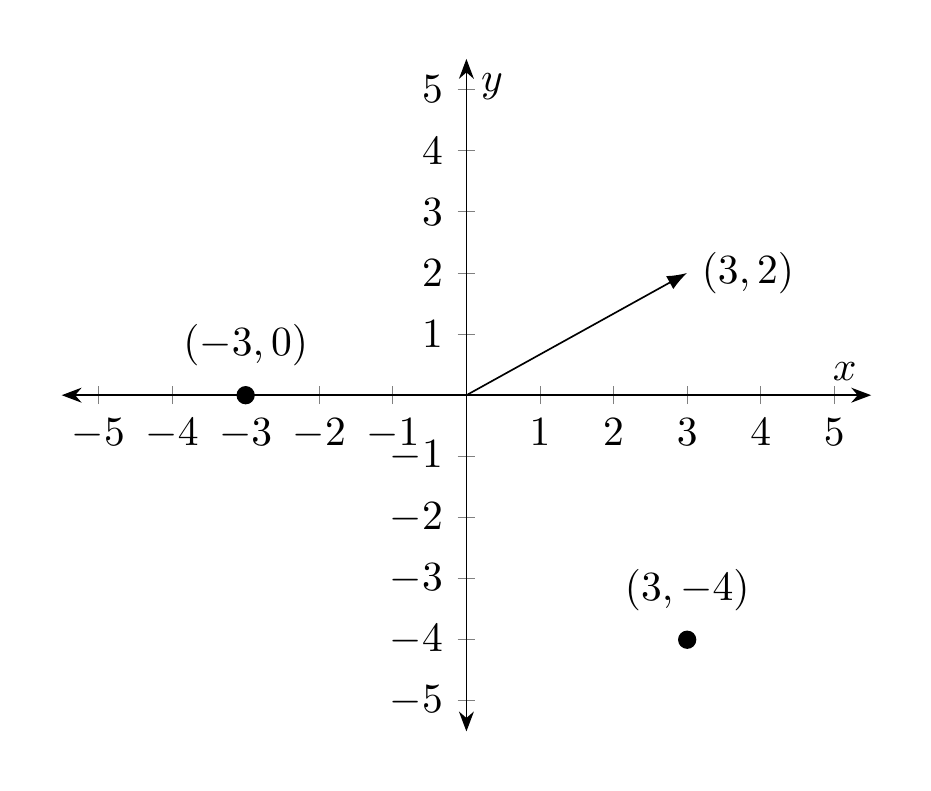

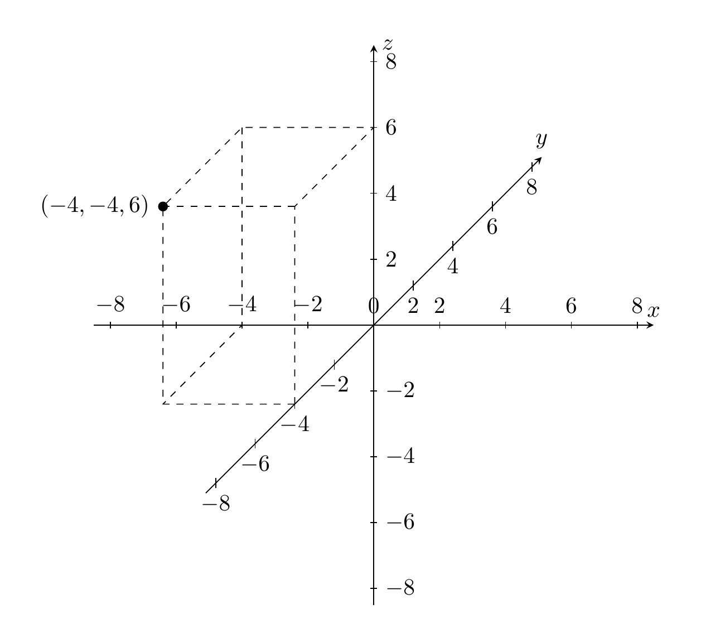

This visualization also helps explain some of the fundamental features of ${\bf R}^n$.

### Addition of vectors

<strong>Definition 3.3</strong>

 Given two vectors (in the same ${\bf R}^n$, i.e., having the same number of components)

\[
x = (x_1, \dots, x_n) \text{ and } y = (y_1, \dots, y_n) \in {\bf R}^n,
\]

their *sum* is the vector

\[
(x_1 + y_1, x_2 + y_2, \dots, x_n + y_n).
\]

<strong>Example 3.4</strong>

 What is the sum of $(1,1)$ and $(-2, 1)$? Visualize that sum graphically!

<strong>Remark 3.5</strong>

 The sum of two vectors is only defined if they belong to the *same* ${\bf R}^n$: a sum such as $(1,2) + (3, 4, 5)$ is undefined, i.e. is a meaningless expression.

The sum of vectors has the following crucial properties:

<strong>Lemma 3.6</strong>

 For $x = (x_1, \dots, x_n), y = (y_1, \dots, y_n)$ and $z = (z_1, \dots, z_n) \in {\bf R}^n$ the following rules hold:

- $x + y = y + x$ (*commutativity of addition*)

- $x + 0 = x$ (adding the zero vector does not change the vector in question)

- $x + (y+z) = (x+y) + z$ (*associativity of addition*)

These identities are easy to prove since they quickly boil down to similar identities for the sum of real numbers. Here is a visual intuition for the commutativity of addition, which is also called the *parallelogram law*.

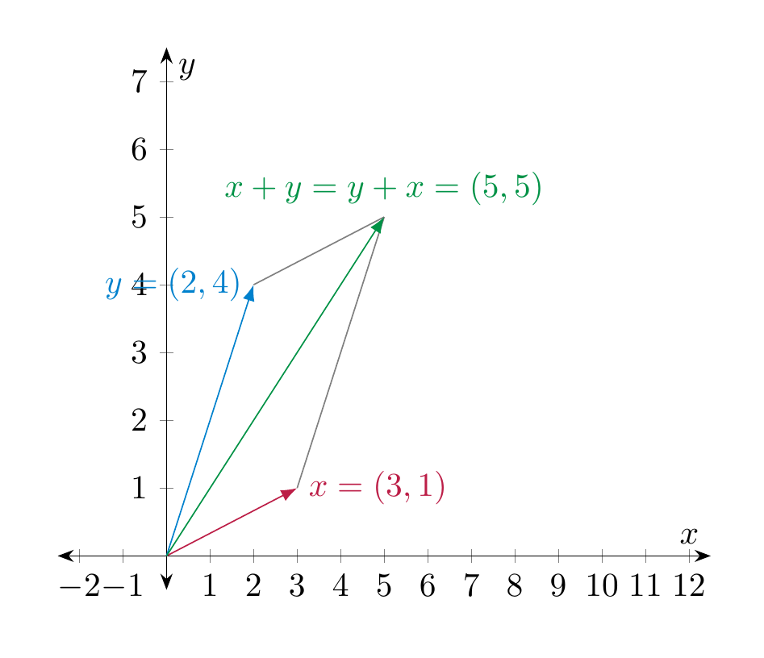

### Scalar multiplication of vectors

<strong>Definition 3.7</strong>

 Given a vector $x = (x_1, \dots, x_n) \in {\bf R}^n$ and a real number $r \in {\bf R}$, the *scalar multiplication* of $x$ by $r$ is the vector

\[
r \cdot x := (r \cdot x_1, \dots, r \cdot x_n).
\]

I.e., every component of $x$ gets multiplied by the number $r$. Often one just writes $rx$ instead of $r \cdot x$.

Geometrically, the scalar multiplication corresponds to stretching the vector $x$ by the factor $r$ (i.e., if $r > 1$ it is stretching, for $0 < r < 1$ it compresses the vector, for $r < 0$ it additionally flips the direction of the vector).

<strong>Example 3.8</strong>

 What is $4 \cdot (-1, 3)$? What is $(- \frac 14) \cdot (-1,3)$? Visualize the vector $(-1,3)$ and these results graphically!

Note that in contrast to the sum of vectors the scalar multiplication combines two different entities: a real number and a vector. The scalar multiplication has the following key properties:

<strong>Lemma 3.9</strong>

 For two real numbers $r, s \in {\bf R}$ and two vectors $x, y \in {\bf R}^n$, the following identities hold:

1.  $r(x+y) = rx+ry$ (*distributivity law*)

2.  $(r+s)x = rx + sy$ (*distributivity law*)

3.  $(rs)x = r(sx)$ (scalar multiplication with a product $rs$ of two real numbers can be computed by first multiplying with $s$ and then with $r$)

4.  $1 x = x$ (scalar multiplication by 1 does not change the vector)

5.  $0 x = 0$ (scalar multiplication by 0 gives the zero vector)

Again, these identities are easy to check using that the same rules hold if $x, y$ were just real numbers.

### Definition of vector spaces

<strong>Definition 3.10</strong>

 A *vector space* is a set $V$ that is equipped with two functions called the *sum* and the *scalar multiplication*:

\[
\begin{align*}
+ : & \  V \times V \to V, (v, w) \mapsto v + w,\\
\cdot : & \ {\bf R} \times V \to V, (r, v) \mapsto rv \text{ (or }r\cdot v \text{)}
\end{align*}
\]

satisfying the following conditions. Below $r, s \in {\bf R}$ are arbitrary real numbers and $u, v, w \in V$ arbitrary elements of $V$ (also referred to as *vectors*):

1.  $v+ w= w+v$ (*commutativity of addition*),

2.  $u+(v+w) = (u+v)+w$,

3.  there is a vector $0 \in V$, called the *zero vector*, such that $0 + v = v$ for all $v \in V$,

4.   $r(v+w) = rv+rw$ (*distributive law*),

5.  $(r+s)v = rv+sv$,

6.   $(rs)v = r(sv)$,

7.  $1 v = v$,

8.   $0 v = 0$ (at the left 0 denotes the real number zero, at the right it denotes the zero vector)

<strong>Example 3.11</strong>

 The sets ${\bf R} = {\bf R}^1$, ${\bf R}^2$, and in general ${\bf R}^n$ are vector spaces (where the function $+$ is given by vector addition and $\cdot$ is scalar multiplication). Indeed, the conditions in <a href="#def-vector-space" data-reference-type="ref+Label" data-reference="def:vector-space">Definition 3.10</a> are precisely the properties of vector addition and scalar multiplication noted before in <a href="#lem-properties-vector-addition" data-reference-type="ref+Label" data-reference="lem:properties-vector-addition">Lemma 3.6</a> and <a href="#lem-properties-scalar-multiplication" data-reference-type="ref+Label" data-reference="lem:properties-scalar-multiplication">Lemma 3.9</a>.

<strong>Remark 3.12</strong>

 Recall from §<a href="../appendix/#sect-notation" data-reference-type="ref" data-reference="sect--notation">Chapter A</a> that the notation appearing in

\[
+ : V \times V \to V, (v, w) \mapsto v + w
\]

means that $+$ is a function that takes as an input two elements in $V$, which here are denoted $v$ and $w$, and produces as an output another element in $V$. That element is denoted $v + w$. Likewise

\[
\cdot : {\bf R} \times V, (r, v) \mapsto rv \text{ (or }r\cdot v \text{)}
\]

means that $\cdot$ is a function whose input is a pair consisting of a real number, here denoted $r$, and an element in $V$, and produces as an output an element in $V$ that is denoted $rv$ or $r \cdot v$.

Some authors distinguish notationally between vectors and numbers by writing $\vec v$ for vectors and $r$ for numbers. In these notes, we usually do not use that convention.

<strong>Example 3.13</strong>

 The following subsets of ${\bf R}^n$ are *not vector spaces*. In each case, draw the set and point out precisely which of the above condition(s) fails.

- $\{(x_1, x_2) \in {\bf R}^2 \text{ with }x_1 \ge 0\}$,

- $\{(x_1, x_2) \in {\bf R}^2 \text{ with }x_1 \ne 0\}$,

- The solution set of the equation

\[
  3x_1 + 2x_2 = 3.
\]

- $\{(x_1, x_2) \in {\bf R}^2 \text { with }x_1 = 0 \text{ or } x_2 = 0 \}$.

## Solution sets of homogeneous linear systems

Recall from <a href="../systems-linear-systems/#def-homogeneous-linear-system" data-reference-type="ref+Label" data-reference="def:homogeneous-linear-system">Definition 2.13</a> that a *homogeneous linear system* is one on which the constant terms are all zero, i.e., one of the form

\[
\begin{align}
a_{11} x_1 + a_{12} x_2 + \dots + a_{1n} x_n & = 0 \\
a_{21} x_1 + a_{22} x_2 + \dots + a_{2n} x_n & = 0 \nonumber \\
\vdots  \nonumber\\
a_{m1} x_1 + a_{m2} x_2 + \dots + a_{mn} x_n & = 0  \nonumber
\end{align}
\]

<strong>(3.14)</strong>

In this section, we will see that the solution sets to homogeneous linear systems are vector spaces, which is an extremely important class of examples. We begin by looking at homogeneous linear equations, i.e., a linear system consisting of a single (homogeneous) equation.

<strong>Example 3.15</strong>

 The homogeneous linear equation

\[
3x + 4y - 2z = 0
\]

has the solution set

\[
\{(x, y, \frac{3x+4y}2) \ | \ x, y \in {\bf R} \}.
\]

Indeed, a triple $(x,y,z)$ is a solution to the equation above precisely if $z = \frac{3x+4y}2$, and $x$ and $y$ can be arbitrary real numbers. A few concrete elements in this solution set, drawn below, are the points $(0,0,0)$, $(2,0,3)$, $(0,1,2)$. Slightly more generally, triples of the form $(0, y, 2y)$ and $(x, 0, \frac 32 x)$, for arbitrary $y$, resp. $x$, are elements in the solution set. These lines (which lie in the $y-z$-plane, resp. in the $x-y$-plane) are also drawn below. Of course, the solution set contains further elements such as the point $(2,1,5)$. The green shape is meant to illustrate further elements of the solution set, but of course this is not bounded by the lines in the illustration, instead it stretches out in all directions.

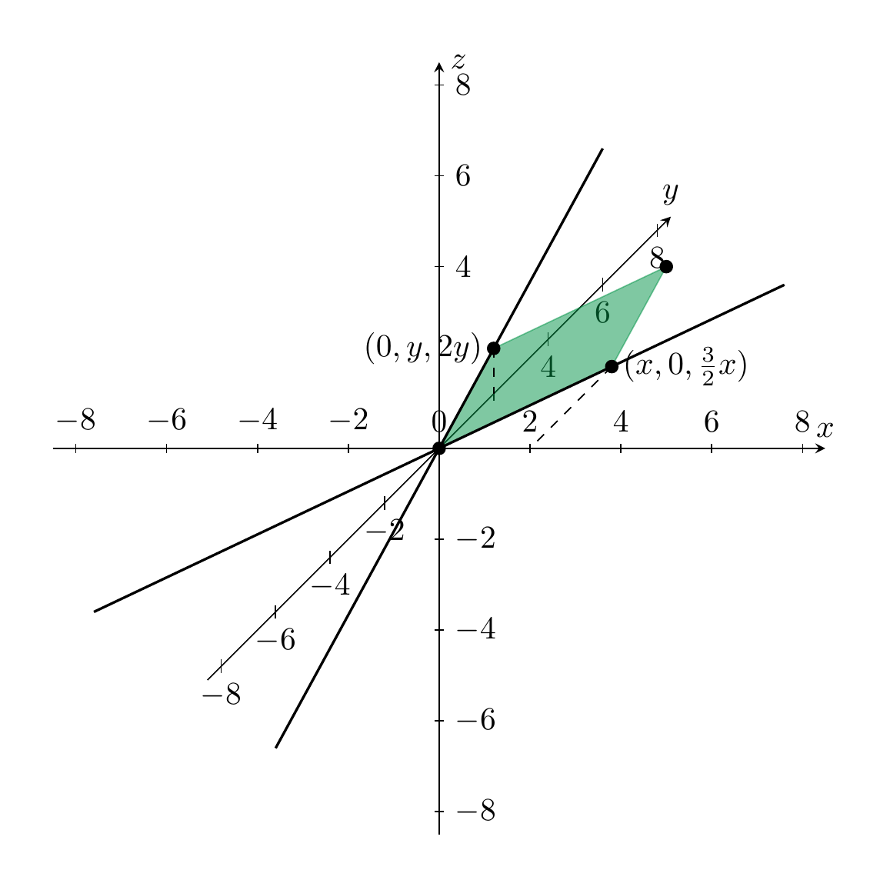

<strong>Example 3.16</strong>

 What equation (in the three variables $x$, $y$ and $z$) has the following solution set? Again the picture only shows the solution set partly, it is meant to be extended to the left and below.

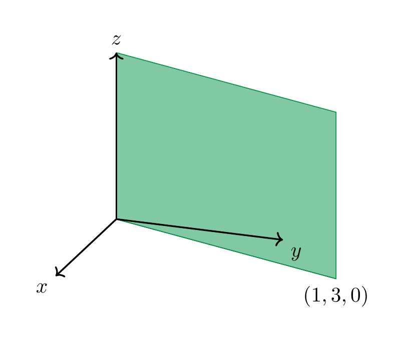

We note that both equations have a solution set which is a plane passing through the *origin*, i.e., the point $(0,0,0)$. We will want to articulate that this plane is a vector space that lies inside the larger ambient vector space ${\bf R}^3$.

<strong>Definition 3.17</strong>

 A *subspace* (or sub-vector space, or vector subspace) $V$ of ${\bf R}^n$ is a subset that is – in its own right – a vector space. I.e.,

1.  it contains the zero vector,

2.  for *all* vectors $v, w \in V$, the sum $v+w$ is an element of $V$, and

3.  for all $v \in V$ and *all* real numbers $r \in {\bf R}$, the scalar multiple $r \cdot v$ is required to be an element of $V$.

More generally, a subset $V$ of another vector space $W$ is a subspace if $V$ satisfies the three preceeding conditions.

We have seen in <a href="#ex-non-vector-spaces" data-reference-type="ref+Label" data-reference="ex:non-vector-spaces">Example 3.13</a> a number of sub*sets* of ${\bf R}^2$ that fail to be sub*spaces*. In particular, the solution set of the equation $3x_1 + 2x_2 = 3$ is not a vector space since the zero vector $(0,0)$ is not a solution of this equation. This is not a homogeneous equation (the constant term is 3, but not 0). The next proposition tells us that this is the cause of the failure:

<strong>Proposition 3.18</strong>

 Consider a *homogeneous* linear system in $n$ variables $x_1, \dots, x_n$, and $m$ equations, as in <a href="#homogeneous-system" data-reference-type="eqref" data-reference="homogeneous.system">Equation (3.14)</a>. Its solution set is a subspace of ${\bf R}^n$.

*Proof.* Let us call $S$ the solution set of the system. I.e., an element $x = (x_1, \dots, x_n)$ belongs to $S$ precisely if it is a solution of the linear system <a href="#homogeneous-system" data-reference-type="eqref" data-reference="homogeneous.system">Equation (3.14)</a>.

We check the three conditions in <a href="#def-subspace" data-reference-type="ref+Label" data-reference="def:subspace">Definition 3.17</a>:

- $(0, \dots, 0) \in S$, i.e. the zero vector in ${\bf R}^n$ is a solution. Indeed, plugging in zero in all the $x_i$ gives $0 = 0$ for all the $m$ equations, which holds.

- Let $v = (v_1, \dots, v_n)$ and $w = (w_1, \dots, w_n)$ be elements of $S$. We need to check that $v + w$ is also in $S$. Recall from <a href="#def-vector-sum" data-reference-type="ref+Label" data-reference="def:vector-sum">Definition 3.3</a> that $v + w = (v_1 + w_1, \dots, v_n + w_n)$. The $m$ equations of the linear system read

\[
  a_{i1} x_1 + a_{i2} x_2 + \dots + a_{in} x_n  = 0,
\]

  where $i = 1, \dots, m$. Inserting $v_1 + w_1$ for $x_1$ etc., we get

\[
  \begin{align*}
      & a_{i1} (v_1 + w_1) + a_{i2} (v_2 + w_2) + \dots + a_{in} (v_n + w_n) \\ 
      = & a_{i1} v_1 + a_{i1} w_1 + a_{i2} v_2 + a_{i2} w_2 + \dots + a_{in} v_n + a_{in} w_n \\ 
      = & \underbrace{a_{i1} v_1 + a_{i2} v_2 + \dots + a_{in} v_n}_{=0} + \underbrace{a_{i1} w_1 + a_{i2} w_2 + \dots + a_{in} w_n}_{=0} \\
      = & 0 + 0 \\
      = & 0.
  \end{align*}
\]

  This shows that $v + w \in S$.

- In a similar manner, one shows (do it!) that for any $r \in {\bf R}$ and $v = (v_1, \dots, v_n) \in S$ the scalar multiple $rv = (r v_1, \dots, rv_n)$ is again in $S$.

 ◻

## Intersection of subspaces

<strong>Lemma 3.19</strong>

 Let $V$ be a vector space and $A, B \subset V$ be two subspaces. Then the *intersection*

\[
A \cap B := \{ v \in V \ | \ v \in A \text{ and } v \in B \}
\]

is also a subspace of $V$. More generally, this holds true for any number of subspaces, i.e., if $A_1, A_2 \dots, A_n \subset V$ are subspaces, then so is their joint intersection

\[
A_1 \cap \dots \cap A_n = \{ v \in V \ | \ v \in A_1, v \in A_2, \dots, v \in A_n \}.
\]

*Proof.* We need to make sure that $A \cap B$ satisfies the conditions in <a href="#def-subspace" data-reference-type="ref+Label" data-reference="def:subspace">Definition 3.17</a>. This is easy enough. For example, the zero vector $0 \in A \cap B$ since $0 \in A$ (since $A$ is a sub*space*) and also $0 \in B$ (since $B$ is also a subspace). Here is a visualization for sums: if $x, y \in A \cap B$, then $x + y \in A \cap B$ since it is both contained in $A$ and also in $B$.

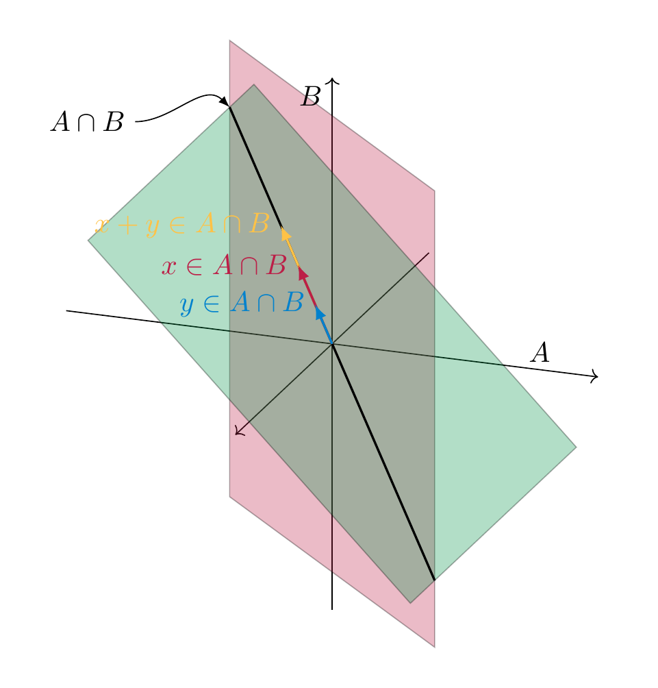

 ◻

Intersections of subspaces are hugely important to us because of the following example.

<strong>Example 3.20</strong>

 Consider once again a homogenous system as in <a href="#homogeneous-system" data-reference-type="eqref" data-reference="homogeneous.system">Equation (3.14)</a>. Then, of course, each individual equation of that system is in its own right a homogeneous linear equation, for example

\[
\begin{align*}
a_{11} x_1 + a_{12} x_2 + \dots + a_{1n} x_n & = 0
\end{align*}
\]

By the above, the solution set of that equation is a subspace of ${\bf R}^n$, that we denote by $S_1 (\subset {\bf R}^n)$. Likewise this is true for all the other individual equations, so we get some subspaces $S_1, \dots, S_m$, one for each equation. The solution set of the *whole* system is then just

\[
S_1 \cap S_2 \cap \dots \cap S_m.
\]

(Indeed, a vector $(r_1, \dots, r_n) \in {\bf R}^n$ is a solution for the whole system precisely if it is one for the individual equations.)

An important question that we will eventually be able to make more precise and to answer is this:

<strong>Question 3.21</strong>

 Given two subspaces $A, B$ in some vector space $V$, how “much smaller” can $A \cap B$ be than $A$ and $B$?

In the above illustration, we will want to articulate the idea that the ambient vector space $V$ is “3-dimensional”, $A$ and $B$ are 2-dimensional (i.e., a plane) and $A \cap B$ is 1-dimensional (i.e., a line). Note that this need not be the case: if $A = B$ is the *same* plane, for example, then certainly $A \cap B = A$ is also 2-dimensional. This relates to the discussion about the intersections of lines in ${\bf R}^2$ in <a href="../systems-linear-systems/#sum-intersection-lines" data-reference-type="ref+Label" data-reference="sum:intersection-lines">Summary 2.12</a>: if $A, B \subset {\bf R}^2$ are “1-dimensional” (i.e., lines), their intersection may still be a line, namely if $A = B$. If the ambient vector space $V$ is even larger, for example $V = {\bf R}^4$ (which has “dimension 4”), then it is no longer reasonable to write down all possible constellations of how $A, B$ lie in $V$.

## Further examples of vector spaces

### Polynomials

We introduce a number of further examples of vector spaces. Recall that a function $f : {\bf R} \to {\bf R}$ (i.e., cf. §<a href="../appendix/#sect-notation" data-reference-type="ref" data-reference="sect--notation">Chapter A</a>, a function that takes as an input a real number $x$ and whose output $f(x)$ is another real number) is called a *polynomial* if it is of the form

\[
f(x) = a_n x^n + a_{n-1} x^{n-1} + \dots + a_1 x + a_0,
\]

where $a_n, a_{n-1}, \dots, a_0$ are real numbers. These numbers are called the *coefficients* of $f$. The *degree* of $f$ is the largest exponent $n$ appearing in $f$ (provided that the coefficient $a_n \ne 0$). Recall from §<a href="../appendix/#sect-notation" data-reference-type="ref" data-reference="sect--notation">Chapter A</a> that such an expression is abbreviated as

\[
f(x) = \sum_{i = 0}^n a_i x^i.
\]

In increasing complexity, a *constant function*

\[
f(x) = a
\]

is a polynomial of degree 0 (note $a = a \cdot x^0$);

\[
f(x) = a_1 x + a_0
\]

is a *linear polynomial* (also known as *linear function*). Its degree is 1 (provided $a_1 \ne 0$). Next,

\[
f(x) = a_2 x^2 + a_1 x + a_0
\]

is called a *quadratic polynomial* (or *quadratic function*). Its degree is 2 (provided $a_2 \ne 0$; if $a_2 = 0$ then it is a linear polynomial). These types of functions are familiar from high-school.

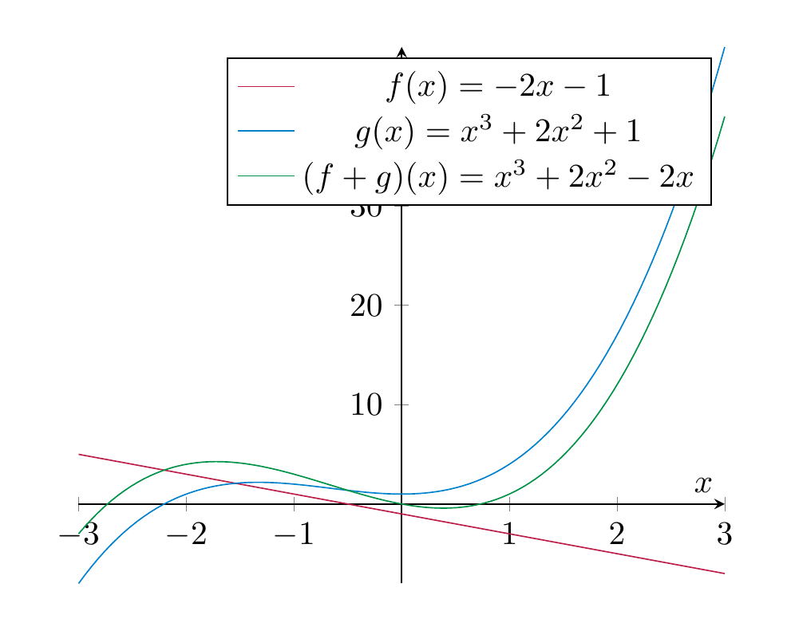

<strong>Definition and Lemma 3.22</strong>

 The set

\[
{\bf R}[x] := \{ f : {\bf R} \to {\bf R} \ | \ f \text{ is a polynomial} \}
\]

is a vector space, where we define the sum and scalar multiplication as follows: given two polynomials $f, g \in P$, their *sum* is the function $f + g : {\bf R} \to {\bf R}$defined by

\[
(f + g)(x) := f(x) + g(x),
\]

and given a real number $r \in {\bf R}$, the scalar multiple is the function $r f : {\bf R} \to {\bf R}$ defined by

\[
(r f)(x) := r \cdot f(x).
\]

The set

\[
{\bf R}[x]^{\le d} := \{ \sum_{i = 0}^d a_i x^i \ | a_0, \dots, a_d \in {\bf R}\} (\subset {\bf R}[x])
\]

of polynomials of *degree* at most $d$ is a subspace of ${\bf R}[x]$.

*Proof.* We have to check the conditions on a vector space (<a href="#def-vector-space" data-reference-type="ref+Label" data-reference="def:vector-space">Definition 3.10</a>). As it also happens often in other examples, the most notable condition to check is that the sum and scalar multiple is again an element of the vector space. Here, we need to check that for $f, g \in P$ the function $f + g$ defined above is again a polynomial. Fortunately, this is easy: if $f(x) = a_n x^n + a_{n-1} x^{n-1} + \dots + a_1 x + a_0$ and $g(x) = b_n x^n + b_{n-1} x^{n-1} + \dots + b_0$, then, by definition

\[
\begin{align*}
(f+g)(x) & =  a_n x^n + a_{n-1} x^{n-1} + \dots + a_0 + b_n x^n + b_{n-1} x^{n-1} + \dots + b_0 \\
& = a_n x^n + b_n x^n + a_{n-1} x^{n-1} + b_{n-1} x^{n-1} + \dots + a_0 + b_0 \\
& = \underbrace{(a_n + b_n)}_{=:c_n} x^n + \underbrace{(a_{n-1}+b_{n-1})}_{=:c_{n-1}} x^{n-1} + \dots + \underbrace{(a_0 + b_0)}_{=:c_0} \\
& = c_n x^n + c_{n-1} x^{n-1} + \dots + c_0.
\end{align*}
\]

Thus, the sum of $f$ and $g$ is another polynomial. Similarly, one verifies that the scalar multiple $r \cdot f$ is a polynomial (check this! what are its coefficients?). With these checks done, one can proceed checking the remaining conditions in <a href="#def-vector-space" data-reference-type="ref+Label" data-reference="def:vector-space">Definition 3.10</a>. Checking this is comparatively uninsightful, and will be skipped.

Checking that ${\bf R}[x]^{\le d}$ is a subspace amounts to asserting that the 0 polynomial $f(x) = 0$ has degree at most $d$, and that sums and *scalar* (!) multiples of polynomials of degree $\le d$ have again degree $\le d$. This is clear. ◻

<strong>Remark 3.23</strong>

 It is also true that the *product* of two polynomials is again a polynomial, but this is not part of what it takes to be a vector space, so we disregard that property at this point.

<strong>Remark 3.24</strong>

 Instead of just polynomials, one can consider more general functions:

\[
\begin{align*}
{\bf R}[x] & \subset  \{ f : {\bf R} \to {\bf R} \ | \  f \text{ is differentiable } \} \\ 
& \subset \{ f : {\bf R} \to {\bf R} \ | \  \text{ is continuous } \}  \\
& \subset\{ f : {\bf R} \to {\bf R} \text{ is any function} \}
\end{align*}
\]

are increasingly large vector spaces, cf. <a href="#differentiable-functions" data-reference-type="ref+Label" data-reference="differentiable functions">Exercise 3.3</a>. The (huge!) space of all differentiable functions is a key player in analysis.

### Direct sums

<strong>Definition and Lemma 3.25</strong>

 Let $V, W$ be two vector spaces. Their *direct sum* is the set

\[
V \oplus W := \{ (v, w) \ | \ v \in V, w \in W \}.
\]

It is endowed with the addition given by

\[
(v, w) + (v', w') := (v+v', w+w')
\]

and scalar multiplication given by

\[
r \cdot (v, w) := (rv, rw).
\]

These operations turn $V \oplus W$ into a vector space.

More generally, the same definition works for finitely many[^1] vector spaces $V_1, \dots, V_n$, giving rise to the direct sum $V_1 \oplus \dots \oplus V_n$.

This is easy to check: revisit the definition of a vector space and see how checking each of the 8 axioms for $V \oplus W$ reduces to using the precise same axioms for $V$ and $W$. In particular, the zero vector in $V \oplus W$ is the pair $(0_V, 0_W)$, where for clarity $0_V$ denotes the zero vector in $V$ and $0_W$ the one in $W$.

<strong>Example 3.26</strong>

 We have ${\bf R}^2 = {\bf R} \oplus {\bf R}$ and in general

\[
{\bf R}^n = \underbrace{ {\bf R} \oplus \dots \oplus {\bf R}}_{n \text{ summands}}.
\]

This is clear from the definition of the sum of vectors in ${\bf R}^n$ (<a href="#def-vector-sum" data-reference-type="ref+Label" data-reference="def:vector-sum">Definition 3.3</a>) and the scalar multiplication (<a href="#def-scalar-multiplication" data-reference-type="ref+Label" data-reference="def:scalar-multiplication">Definition 3.7</a>).

Note that $V \subset V \oplus W$, by regarding a vector $v \in V$ as the vector $(v, 0_W)$. Likewise we can regard some $w \in W$ as the vector $(0_V, w) \in V \oplus W$. This way, $V \oplus W$ is a vector space that naturally contains both $V$ and $W$.

<strong>Example 3.27</strong>

 The direct sum ${\bf R}^2 \oplus {\bf R}$ consists of pairs $(v, w)$ with $v  = (x, y) \in {\bf R}^2$ and $w \in {\bf R}$. Thus, ${\bf R}^2 \oplus {\bf R} = \{((x,y), w) \ | \ x, y, w \in {\bf R}\}$. We can identify such a pair (consisting of a pair $(x,y)$ and a number $w$) with a triple $(x,y,w)$. Therefore, ${\bf R}^2 \oplus {\bf R}$ can be identified with ${\bf R}^3$. The sum and scalar multiple on ${\bf R}^2 \oplus {\bf R}$ as defined in <a href="#dlm-direct-sum" data-reference-type="ref+Label" data-reference="dlm:direct-sum">Definition and Lemma 3.25</a> then reduce to the usual sum and scalar multiple in ${\bf R}^3$ as defined in <a href="#def-vector-sum" data-reference-type="ref+Label" data-reference="def:vector-sum">Definition 3.3</a> and <a href="#def-scalar-multiplication" data-reference-type="ref+Label" data-reference="def:scalar-multiplication">Definition 3.7</a>.

### Quotient spaces

All the examples of vector spaces that we have encountered so far were subspaces of an already given vector space, beginning with some ambient ${\bf R}^n$. However, not all vector spaces embed (naturally) in some ${\bf R}^n$. To illustrate this, we consider an example of a so-called quotient space. Since a full treatment of this would require a few more basic notions, we only discuss this in a special case:

<strong>Definition 3.28</strong>

 Consider $V = {\bf R}^2$, the plane, and a line $L \subset W$ through the origin. We define a set

\[
V / L := \{ \text{ all lines that are parallel to } L \ \}.
\]

(This is read “$V$ modulo $L$.”) For example, $L_1$ and $L_2$ are *elements* in that set $V / L$ in the illustration below.

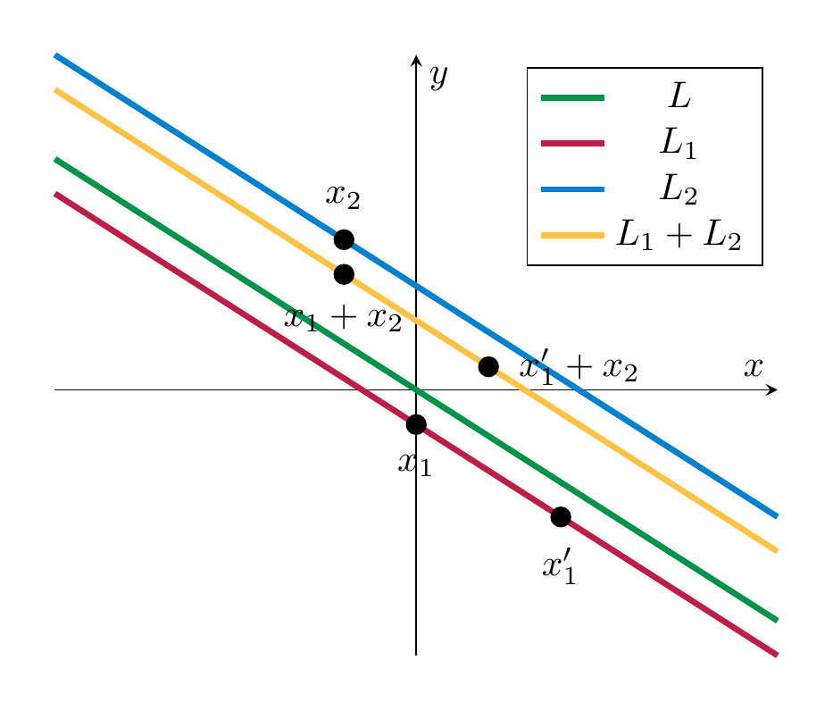

How to define the sum and scalar multiplication on that set $V/L$? Given $L_1, L_2 \in V/L$, take *any* $x_1 \in L_1$ and any $x_2 \in L_2$. (These are both vectors in $V = {\bf R}^2$.) Form the unique line that passes through $x_1 + x_2$ and is parallel to $L$. Call this line $L_1 + L_2$. Similarly, the scalar multiple $r \dot L_1$ is the line passing through $r \cdot x_1$ and parallel to $L$. What is remarkable is that makes sense, i.e., that the resulting lines do not depent on the choices of $x_1, x_2$ above. In the illustration below, we indicate two choices for $x_1$ (the second one being denoted $x_1'$). The sum $x_1 + x_2$ is clearly different from $x'_1 + x_2$, but they do lie on the same line (that is parallel to $L$). This holds since $x'_1 - x_1$ lies in $L$. Thus

\[
(x'_1 + x_2) - (x_1 + x_2) = x'_1 - x_1
\]

also lies in $L$, and therefore $x'_1 + x_2$ and $x_1 + x_2$ lie on the same line that is parallel to $L$.

With this settled, one can show (withouth much head-ache) that $V/L$ is indeed a vector space. (What is the zero vector in $V/L$?)

A conceptually important insight is that there is *no natural way* in which this $V/L$ is a subspace of ${\bf R}^2$. E.g., one may assign to an element $L_1 \in V/L$, say, the $y$-coordinate of the intersection of $L_1$ with the $y$-axis. But, this idea is ad-hoc and problem-laden (why not take the $x$-axis instead, and what is worse, what happens if $L$ is in fact the $y$-axis...).

## Linear combinations

In the sequel, $V$ will always denote a vector space, for example $V = {\bf R}^n$.

<strong>Definition 3.29</strong>

 A *linear combination* of vectors $v_1, \dots, v_m \in V$ is a vector of the form

\[
a_1 v_1 + \dots + a_m v_m,
\]

where the $a_1, \dots, a_m$ are arbitrary real numbers.

<strong>Example 3.30</strong>

 If $m = 1$ in the above definition, there is only one vector $v := v_1$. A linear combination of a single vector $v$ is therefore any vector of the form $a v$, with an arbitrary $a \in {\bf R}$. In other words it is an arbitrary scalar multiple of that vector.

<strong>Example 3.31</strong>

 More interesting things start happening for two vectors and more. As an example, consider $v_1 = (1, 0, 0)$ and $v_2 = (0, 1, 0)$ in the vector space ${\bf R}^3$. Then $(3, 2, 0)$ is a linear combination of these since

\[
(3, 2, 0) = 3 \cdot (1,0,0) + 2 \cdot (0, 1, 0).
\]

On the other hand, $(0, 0, 1)$ is *not* a linear combination of $v_1$ and $v_2$: for arbitrary $a_1, a_2 \in {\bf R}$, we compute

\[
a_1 v_1 + a_2 v_2 = (a_1, 0,0) + (0, a_2, 0) = (a_1, a_2, 0).
\]

No matter how we choose $a_1$ and $a_2$, we always have

\[
(a_1, a_2, 0) \ne (0, 0, 1),
\]

since the third components of these two vectors are always different. In fact, the linear combinations of $v_1$ and $v_2$ are *precisely* the vectors $(x, y, z)$ that satisfy $z = 0$.

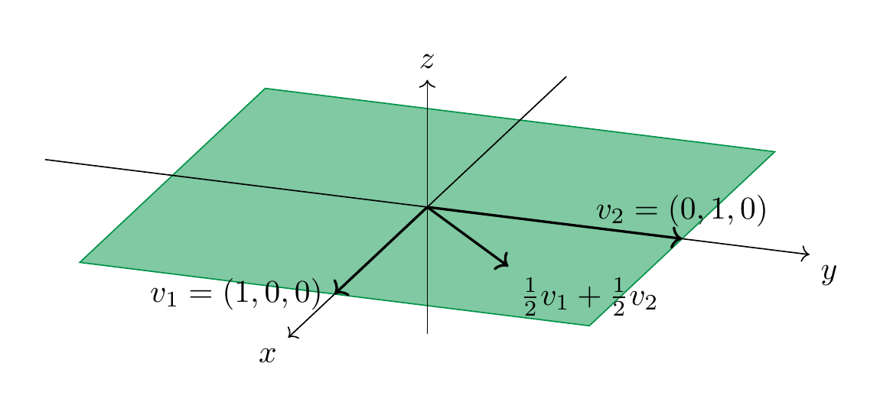

Given two vectors $v_1, v_2 \in {\bf R}^3$, we will see later (<a href="#thm-basis-theorem" data-reference-type="ref+Label" data-reference="thm:basis-theorem">Theorem 3.68</a>) that there will always be some vector $w \in {\bf R}^3$ (in fact infinitely many) that is *not* a linear combination of $v_1$ and $v_2$. In the above example any vector $w = (x,y,z)$ with $z \ne 0$ has that property. Continuing with that example, the $x-y$-plane inside ${\bf R}^3$, i.e., $V := \{(x,y,z) \ | \ x, y \in {\bf R}, z = 0\} = \{(x,y,0) \ | \ x, y \in {\bf R} \}$ is a subspace of ${\bf R}^3$: it contains $(0,0,0)$ and given any two vectors $v, w \in V$ we have $v+w \in V$ and given $r \in {\bf R}$, $r v \in V$ (convince yourself this is true!). We can alternatively use <a href="#prop-homogeneous-system-subspace" data-reference-type="ref+Label" data-reference="prop:homogeneous-system-subspace">Proposition 3.18</a> to see this is a subspace: $V$ is the solution space of the equation $z = 0$ (in the three variables $x, y, z$), which is a homogeneous linear equation. The following statement asserts that we always obtain a subspace in this manner.

<strong>Lemma 3.32</strong>

 Let $V$ be a vector space and $v_1, \dots, v_m \in V$ be any vectors. The set

\[
L(v_1, \dots, v_m) := \{ a_1 v_1 + \dots + a_m v_m \ | \ a_1, \dots, a_m \in {\bf R}\}
\]

of *all* linear combinations of $v_1, \dots, v_m$ is a subspace of $V$. It is called the *span* (or sometimes also the *linear hull*) of these vectors.

*Proof.* We check the three conditions in <a href="#def-subspace" data-reference-type="ref+Label" data-reference="def:subspace">Definition 3.17</a>. Let us abbreviate $L := L(v_1, \dots, v_m)$.

1.  The zero vector $0 \in L$ since $0 \cdot v_1 + \dots 0 \cdot v_m = 0 \cdot (v_1 + \dots + v_m) = 0$, using properties <a href="#item-distributive-law" data-reference-type="ref" data-reference="item--distributive law">4.</a> and <a href="#item-product-0" data-reference-type="ref" data-reference="item--product 0">8.</a> in the definitions of a vector space.

2.  Given two vectors $w, u \in L$, we check $w+u \in L$. Since $w \in L$ there are some real numbers $a_1, \dots, a_m$ such that $w = a_1 v_1 + \dots + a_m v_m = \sum_{i=1}^m a_i v_i$. Likewise there are real numbers $b_1, \dots, b_m$ with $u = \sum_{i=1}^m b_i v_i$. This implies

\[
    \begin{align*}
    w+u & = \sum_{i=1}^m a_i v_i + \sum_{i=1}^m b_i v_i \\
     & = \sum_{i=1}^m (a_i + b_i) v_i \\ 
     & \in L.
    \end{align*}
\]

3.  Given $w \in L$ and $r \in {\bf R}$, one checks similarly that $rw \in L$ (, verify that!).

 ◻

<strong>Example 3.33</strong>

 In <a href="#ex-span-2" data-reference-type="ref+Label" data-reference="ex:span-2">Example 3.31</a>, we have

\[
L((1,0,0), (0,1,0)) = \{(x,y,0) \ | \ x, y, \in {\bf R} \}.
\]

<a href="#ex-poly-span-1" data-reference-type="ref+Label" data-reference="ex poly span 1">Exercise 3.10</a> and <a href="#ex-poly-span-2" data-reference-type="ref+Label" data-reference="ex poly span 2">Exercise 3.11</a> discuss linear combinations in the vector space ${\bf R}[x]^{\le 3}$. The span is closely related to another construction that produces new vector spaces out of given ones:

<strong>Definition 3.34</strong>

 Let $V$ be a vector space and $A, B \subset V$ be two subspaces. The *sum* of $A$ and $B$ is defined as

\[
A + B := \{ v+ w \ | \ v \in A, w \in B \}.
\]

I.e., it consists of *all* possible ways to sum an element in $A$ and an element in $B$. More generally, given subspaces $A_1, \dots, A_n$ of $V$, their sum is defined as

\[
A_1 + \dots + A_n := \{ v_1 + \dots + v_n \ | v_1 \in A_1, \dots, v_n \in A_n \}.
\]

<strong>Lemma 3.35</strong>

 The sum $A+B$ is then again a subspace of $V$.

The proof of this is very similar to the one of <a href="#lem-span-subspace" data-reference-type="ref+Label" data-reference="lem:span-subspace">Lemma 3.32</a> and will be omitted.

<strong>Remark 3.36</strong>

 Given some vectors $v_1, \dots, v_n \in V$, we have

\[
L(v_1, \dots, v_n) = L(v_1) + \dots + L(v_n).
\]

Indeed, both sets are precisely the vectors of the form $a_1 v_1 + \dots + a_n v_n$ for arbitrary $a_i \in {\bf R}$.

<strong>Remark 3.37</strong>

 The sum is *completely different* from the union $A \cup B$ of the two subspaces. We have seen in <a href="#ex-non-vector-spaces" data-reference-type="ref+Label" data-reference="ex:non-vector-spaces">Example 3.13</a> that the union is (in general) not even a subspace (just a subset). We have

\[
A \cup B \subset A + B,
\]

but these two subsets are distinct (unless $A$ or $B$ only consists of the zero vector). To see this inclusion, note that $A \subset A + B$. Indeed, the zero vector $0 \in B$ (since it is a subspace!), and for any $v \in A$, we have $v = v + 0 \in A + B$. Similarly, $B \subset A + B$, and therefore $A \cup B \subset A + B$.

<strong>Remark 3.38</strong>

 The sum $A+B$ is *different* from the direct sum $A \oplus B$. This is already clear from the definition: while the sum makes use of the ambient vector space $V$, the direct sum $A \oplus B$ is insensitive to $A$ and $B$ both lying in $V$. Also, it does not “see” to what extent $A$ and $B$ may overlap.

In a spirit similar to <a href="#q-dimension-intersection" data-reference-type="ref+Label" data-reference="q:dimension-intersection">Question 3.21</a> we can ask the following question:

<strong>Question 3.39</strong>

 Given two subspaces $A, B \subset V$ of some larger vector space, how much “bigger” than $A$ and $B$ is the sum $A + B$?

It turns out that <a href="#q-dimension-intersection" data-reference-type="ref+Label" data-reference="q:dimension-intersection">Question 3.21</a> are closely related. Loosely speaking, one can say that $A + B$ “gets bigger” the same way as $A \cap B$ “gets smaller”. To give a precise meaning to this one needs the concept of the dimension of a vector space. Understanding the dimension of a vector space requires combining two preliminary notions, that of a generating system and that of linear independence below (<a href="#def-linearly-independent" data-reference-type="ref+Label" data-reference="def:linearly-independent">Definition 3.46</a>).

<strong>Definition 3.40</strong>

 A collection $v_1, \dots, v_n$ of vectors is a *generating system* if

\[
L(v_1, \dots, v_n) = V
\]

or, equivalently, if *every* vector $w \in V$ is an appropriate linear combination of these vectors. We also say that these vectors *span* $V$ if this is the case.

<strong>Example 3.41</strong>

 The vectors $e_1 := (1, 0, \dots, 0)$, $e_2 = (0, 1, 0, \dots, 0)$ up to $e_n = (0, \dots, 0, 1)$ are a generating system. Indeed, each vector $x = (x_1, \dots, x_n) \in {\bf R}^n$ is a linear combination of these, namely

\[
x = x_1 \cdot e_1 + \dots + x_n \cdot e_n.
\]

<strong>Example 3.42</strong>

 We have observed in <a href="#ex-span-2" data-reference-type="ref+Label" data-reference="ex:span-2">Example 3.31</a> that the vectors $e_1 = (1, 0, 0)$ and $e_2 = (0, 1, 0)$ in ${\bf R}^3$ are *not* a generating system since they only span the subspace

\[
L(e_1, e_2) = \{ (x, y, 0) \ | \ x, y \in {\bf R} \}
\]

which is not the entire ${\bf R}^3$ (e.g., $(0,0,1)$ is missing).

The following example shows that three arbitrary vectors in ${\bf R}^3$ need not form a generating set.

<strong>Example 3.43</strong>

 Consider the vectors $v_1 := e_1 = (1, 0, 0)$, $v_2 = (0, 1, 1)$ and $v_3 = (2, 1, 1)$. These three vectors do *not* form a generating set of ${\bf R}^3$. In order to show this and to also understand which vectors are precisely in the span $L(v_1, v_2, v_3)$, we consider the following equation, where $w = (x, y, z) \in {\bf R}^3$ is a vector and $a_1, a_2, a_3 \in {\bf R}$:

\[
w = a_1 v_1 + a_2 v_2 + a_3 v_3.
\]

Those vectors $w$ that can be written in such a form are in the span, those where no such equation holds are not in the span! This is an equation between two vectors in ${\bf R}^3$, i.e., ordered triples. Two such triples are the same precisely if their three components are the same. This leads to the following linear system:

\[
\begin{align*}
a_1 \cdot 1 + a_2 \cdot 0 + a_3 \cdot 2 & = x, \\
a_1 \cdot 0 + a_2 \cdot 1 + a_3 \cdot 1 & = y, \\
a_1 \cdot 0 + a_2 \cdot 1 + a_3 \cdot 1 & = z.
\end{align*}
\]

In this system $a_1, a_2, a_3$ are the variables, and $x, y, z$ are parameters (on which the solutions of the system will depend). We form the matrix associated to this linear system, which is

\[
\left ( \begin{array}{ccc|c} 1 & 0 & 2 & x \\ 0 & 1 & 1 & y \\ 0 & 1 & 1 & z \end{array} \right ).
\]

We apply Gaussian elimination to that matrix, i.e., subtract the second row from the third:

\[
\left ( \begin{array}{ccc|c} 1 & 0 & 2 & x \\ 0 & 1 & 1 & y \\ 0 & 0 & 0 & z-y \end{array} \right ).
\]

We now distinguish two cases:

- $z-y = 0$ (i.e., $y=z$): in this case the matrix is already in reduced row echelon form (<a href="../systems-gaussian-elimination/#def-row-echelon-form" data-reference-type="ref+Label" data-reference="def:row-echelon-form">Definition 2.27</a>). The system has solutions, namely the variable $a_3$ is a free variable, so its value be chosen arbitrarily. Then $a_1$ and $a_2$ are uniquely determined by $a_3$ by the equations

\[
  \begin{align*}
  a_1 + 2 a_3 & = x, \\
  a_2 + a_3 & = y, \\
  \end{align*}
\]

  which gives $a_1 = x - 2a_3$ and $a_2 = y - a_3$. Therefore, for arbitrary $x, y \in {\bf R}$, the vectors

\[
  w = (x, y, y) \in L(v_1, v_2, v_3)
\]

  are in the span. They can be expressed as linear combinations

\[
  w = (x - 2a) v_1 + (y-a) v_2 + a v_3,
\]

  for an arbitrary $a \in {\bf R}$ (this was the $a_3$ before).

- $z - y \ne 0$ (i.e., $y \ne z$). In this case, we can divide the last equation by $z-y$, which gives the following reduced row-echelon matrix

\[
  \left ( \begin{array}{ccc|c} 1 & 0 & 2 & x \\ 0 & 1 & 1 & y \\ 0 & 0 & 0 & 1 \end{array} \right ).
\]

  According to <a href="../systems-gaussian-elimination/#met-gaussian-elimination-solve" data-reference-type="ref+Label" data-reference="met:gaussian-elimination-solve">Method 2.31</a>, the system has *no* solution in this case. Thus, vectors of the form

\[
  w = (x, y, z) \ \text{ with } y \ne z
\]

  are *not* in the span: $w \notin L(v_1, v_2, v_3)$.

The following method gives a criterion to check whether a given set of vectors generates ${\bf R}^n$. We will prove this statement later (<a href="../maps/#thm-invertible-elimination" data-reference-type="ref+Label" data-reference="thm:invertible-elimination">Theorem 4.80</a>).

<strong>Method 3.44</strong>

 Let $v_1, \dots, v_m \in {\bf R}^n$ be some vectors. Form the matrix

\[
A = \left ( \begin{array}{c} v_1 \\ v_2 \\ \vdots \\ v_m \end{array} \right )
\]

(i.e., each the $i$-th row of $A$ is precisely the vector $v_i$, so that $A = (v_{ij})$ if $v_i = (v_{i1}, \dots, v_{in})$.) Bring this matrix into row-echelon form by Gaussian elimination (<a href="../systems-gaussian-elimination/#met-gaussian-algorithm" data-reference-type="ref+Label" data-reference="met:gaussian-algorithm">Method 2.29</a>). Call this resulting matrix $B$. If $B$ contains $n$ leading ones, then $v_1, \dots, v_m$ span ${\bf R}^n$. Otherwise, they don’t span ${\bf R}^n$.

<strong>Corollary 3.45</strong>

 Fewer than $n$ vectors can *never* span ${\bf R}^n$ (since in any event $B$ can at most contain $m$ leading ones).

## Linear independence

Let $v_1, \dots, v_m \in V$ be $m$ vectors in some vector space. Then we have

\[
0 \cdot v_1 + \dots + 0 \cdot v_m = 0 \cdot (v_1 + \dots + v_m) = 0.
\]

This follows from the distributive law and the scalar multiplication of any vector with 0, cf. <a href="#item-distributive-law" data-reference-type="ref" data-reference="item--distributive law">4.</a> and <a href="#item-product-0" data-reference-type="ref" data-reference="item--product 0">8.</a> in <a href="#def-vector-space" data-reference-type="ref+Label" data-reference="def:vector-space">Definition 3.10</a>. So, there is always a “trivial” way to obtain the zero vector from $v_1, \dots, v_m$. We can ask if there are other ways of achieving the zero vector.

<strong>Definition 3.46</strong>

 We say $v_1, \dots, v_m$ are *linearly dependent* if there is a *non-zero* linear combination of these that gives the zero vector. I.e., if there are $a_1, \dots, a_m \in {\bf R}$ of *which at least one is non-zero*, such that

\[
a_1 v_1 + \dots + a_m v_m = 0.
\]

<strong>(3.47)</strong>

If this is not the case, then we say the vectors are *linearly independent*.

Thus, they are linearly independent if the zero linear combination in <a href="#0-combiniation" data-reference-type="eqref" data-reference="0.combiniation">Section 3.6</a> is the *only* way to obtain the zero vector as a linear combination of $v_1, \dots, v_m$.

<strong>Example 3.48</strong>

 The vectors $e_1 = (1, 0, 0)$, $e_2 = (0,1,0)$ and $e_3=(0,0,1) \in {\bf R}^3$ are linearly independent. To see this, suppose some linear combination equals the zero vector: if

\[
a_1 e_1 + a_2 e_2 + a_3 e_3  = (0,0,0)
\]

then we compute the left hand side as

\[
(a_1, 0,0 ) + (0, a_2, 0) + (0,0,a_3) = (a_1, a_2, a_3),
\]

so the above equation forces $a_1 = a_2 = a_3 = 0$. This shows that the vectors are linearly independent.

More generally, the same argument shows that

\[
e_1 = (1, 0, \dots, 0), e_2 = (0, 1, 0, \dots 0), \dots, e_n = (0, \dots, 0,  1) \in {\bf R}^n
\]

are linearly independent.

<strong>Example 3.49</strong>

 We revisit the vectors $v_1 := e_1 = (1, 0, 0)$, $v_2 = (0, 1, 1)$ and $v_3 = (2, 1, 1) \in {\bf R}^3$ of <a href="#ex-three-vectors-no-span" data-reference-type="ref+Label" data-reference="ex:three-vectors-no-span">Example 3.43</a>. These vectors are *not* linearly independent. Indeed, we observe that $v_3 = 2 v_1 + v_2$, so that

\[
2 v_1 + v_2 - v_3 = 0.
\]

<strong>Example 3.50</strong>

 The polynomials $1 + x$, $3x+x^2$, $2+x-x^2$ are linearly independent vectors in ${\bf R}[x]^{\le 2}$. To see this, suppose that a linear combination of them equals the zero vector (i.e., the constant polynomial 0):

\[
\begin{align*}
0 & = a_1 (1+x) + a_2 (3x+x^2) + a_3 (2+x-x^2) \\
 & = a_1 + 2 a_3 + (a_1 + 3a_2 + a_3) x + (a_2 - a_3) x^2.
\end{align*}
\]

Since this must hold for all $x \in {\bf R}$, this forces the following homogeneous linear system:

\[
\begin{align*}
0 & = a_1 + 2 a_3 \\
0 & = a_1 + 3a_2 + a_3 \\
0 & = a_2 - a_3.
\end{align*}
\]

Solving this system (do it ) one sees that this only has the trivial solution $a_1 = a_2 = a_3 = 0$. Thus, the polynomials are linearly independent.

The following statement says in some sense that a family of vectors is linearly independent if there is no redundancy among them.

<strong>Lemma 3.51</strong>

 Let $v_1, \dots, v_m \in V$ be some vectors. They are linearly dependent exactly if (at least) *one* of these vectors can be expressed as a linear combination of the others, i.e., some

\[
v_i = a_1 v_1 + \dots + a_{i-1} v_{i-1} + a_{i+1} v_{i+1} + \dots + a_m v_m
\]

<strong>(3.52)</strong>

 for an appropriate $i$ and appropriate coefficients $a_1$ etc.

*Proof.* If holds, then

\[
a_1 v_1 + \dots + a_{i-1} v_{i-1} + (-1) v_i + a_{i+1} v_{i+1} + \dots + a_m v_m =0,
\]

so they are linearly dependent.

Conversely, if holds, then pick some $i$ such that $a_i \ne 0$ (by assumption this is possible). Then one can subtract $a_i v_i$ and divide by $- a_i$ (which is nonzero, crucially!), giving

\[
v_i = \frac{-a_1}{a_i} v_1 + \dots + \frac{-a_{i-1}}{a_i} v_{i-1} + \frac{-a_{i+1}}{a_i}  v_{i+1} + \dots + \frac{-a_m}{a_i} v_m.
\]

This is an equation of the form . ◻

The following method decides whether a given set of vectors is linearly independent in ${\bf R}^n$. A proof is conveniently done using later results, such as <a href="../maps/#lem-row-product-invertible" data-reference-type="ref+Label" data-reference="lem:row-product-invertible">Lemma 4.76</a>.

<strong>Method 3.53</strong>

 Let $v_1, \dots, v_m \in {\bf R}^n$ be some vectors. Form the matrix

\[
A = \left ( \begin{array}{c} v_1 \\ v_2 \\ \vdots \\ v_m \end{array} \right )
\]

(i.e., each the $i$-th row of $A$ is precisely the vector $v_i$, so that $A = (v_{ij})$ if $v_i = (v_{i1}, \dots, v_{in})$.) Bring this matrix into row-echelon form using Gaussian elimination (<a href="../systems-gaussian-elimination/#met-gaussian-algorithm" data-reference-type="ref+Label" data-reference="met:gaussian-algorithm">Method 2.29</a>). Call this resulting matrix $B$. If $B$ contains $m$ leading ones, then $v_1, \dots, v_m$ are linearly independent. Otherwise, they are linearly dependent.

<strong>Corollary 3.54</strong>

 More than $n$ vectors can *never* be linearly independent in ${\bf R}^n$ (i.e., for $m > n$, any vectors $v_1, \dots, v_m$ will be linearly dependent, since the matrix $B$ can contain at most $n$ leading ones, being in reduced row-echelon form).

<strong>Remark 3.55</strong>

 This method is very similar to <a href="#met-check-generating-system" data-reference-type="ref+Label" data-reference="met:check-generating-system">Method 3.44</a>, except that there we asked $B$ to contain $n$ leading ones: this guarantees that $v_1, \dots, v_m$ span ${\bf R}^n$. Having as many leading ones as there are vectors, i.e., $m$ leading ones, instead guarantees that the vectors are linearly independent.

<strong>Example 3.56</strong>

 We revisit the vectors $v_1 := e_1 = (1, 0, 0)$, $v_2 = (0, 1, 1)$ and $v_3 = (2, 1, 1) \in {\bf R}^3$ of <a href="#ex-three-vectors-linearly-dependent-02" data-reference-type="ref+Label" data-reference="ex:three-vectors-linearly-dependent-02">Example 3.56</a>. The matrix having these vectors as rows is

\[
\left ( \begin{array}{ccc} 1 & 0 & 0 \\ 0 & 1 & 1 \\ 2 & 1 & 1 \end{array} \right ) .
\]

We bring it into reduced row echelon form like so:

\[
\left ( \begin{array}{ccc} 1 & 0 & 0 \\ 0 & 1 & 1 \\ 2 & 1 & 1 \end{array} \right ) \leadsto \left ( \begin{array}{ccc} 1 & 0 & 0 \\ 0 & 1 & 1 \\ 0 & 1 & 1 \end{array} \right ) \leadsto \left ( \begin{array}{ccc} 1 & 0 & 0 \\ 0 & 1 & 1 \\ 0 & 0 & 0 \end{array} \right ).
\]

This reduced row-echelon matrix has only 2 leading ones, so the vectors are *not* linearly independent, i.e., they are linearly dependent.

The importance of linearly independent vectors comes from the following result:

<strong>Proposition 3.57</strong>

 Let $v_1, \dots, v_m$ be linearly independent vectors in a vector space $V$. If some vector $v$ can be expressed as an (ostensibly different) linear combination of those, these presentations must be the same. I.e., if

\[
\begin{align*}
v & = a_1 v_1 + \dots + a_m v_m \text{ and }\\
v & = b_1 v_1 + \dots + b_m v_m
\end{align*}
\]

for appropriate real numbers $a_1, \dots, a_m, b_1, \dots, b_m$, then necessarily we have

\[
a_1 = b_1, a_2 = b_2, \dots, a_m = b_m.
\]

*Proof.* Subtracting these two equations from one another (and using the commutativity of addition, and the law of distributivity, cf. <a href="#def-vector-space" data-reference-type="ref+Label" data-reference="def:vector-space">Definition 3.10</a>), we obtain

\[
\begin{align*}
0 & = v - v \\
& = (a_1 - b_1) v_1 + \dots + (a_m - b_m) v_m.
\end{align*}
\]

Since the vectors are linearly independent, this implies $a_1 - b_1 = 0$ etc., so that $a_1 = b_1$ etc. ◻

## The dimension of a vector space

We are all used to referring to the space surrounding us as “3-dimensional”, and refer to a plane as “2-dimensional”. In this section, which is crucial to linear algebra and, by extension to all applications of linear algebra in physics, engineering and mathematics itself, we make this statement precise.

<strong>Theorem 3.62</strong>

 Let $V$ be a vector space with a basis $v_1, \dots, v_n$. Then any other basis of $V$ also consists of $n$ vectors.

In other words, the number of vectors in a basis does *not* depend on the basis. (Recall from <a href="#ex-three-vectors-basis" data-reference-type="ref+Label" data-reference="ex:three-vectors-basis">Example 3.60</a> that the vectors that form a basis may very well be different.)

<strong>Definition 3.63</strong>

  We say that a vector space $V$ has *dimension* $n$ if there is a basis of $V$ with $n$ elements.

<strong>Example 3.64</strong>

 The standard basis of ${\bf R}^n$ consists of $n$ elements (<a href="#ex-standard-basis" data-reference-type="ref+Label" data-reference="ex:standard-basis">Example 3.59</a>), so that

\[
\dim {\bf R}^n = n.
\]

The space of polynomials of degree at most $d$ has a basis $1, x, x^2, \dots, x^d$. These are $d+1$ polynomials so that

\[
\dim {\bf R}[x]^{\le d} = d + 1.
\]

<strong>Remark 3.65</strong>

 If $V$ has a basis $v_1, \dots, v_n$ (so that $\dim V = n$) and another vector space $W$ has a basis $w_1, \dots, w_m$ (and $\dim W = m)$, then a basis of the direct sum $V \oplus W$ is given by

\[
(v_1, 0), \dots, (v_n, 0), (0, w_1), \dots, (0, w_m).
\]

These are $n+m$ vectors, so that

\[
\dim (V \oplus W) = \dim V + \dim W.
\]

<strong>Theorem 3.66</strong>

 Every vector space has a basis.

<strong>Remark 3.67</strong>

 In this course, we only consider vector spaces with a basis consisting of finitely many vectors, as in <a href="#def-basis" data-reference-type="ref+Label" data-reference="def:basis">Definition 3.58</a>. We call such vector spaces *finite-dimensional*.

An example of a vector space not having a finite basis (i.e., an *infinite-dimensional* vector space) is ${\bf R}[x]$ (for which a basis is given by the polynomials $1, x, x^2, x^3, \dots$).

The following theorem addresses the question how linearly independent sets can be extended to a basis.

<strong>Theorem 3.68</strong>

1.   Suppose that some vector space $V$ is spanned by $m$ vectors $v_1, \dots, v_m$ (<a href="#def-generating-system" data-reference-type="ref+Label" data-reference="def:generating-system">Definition 3.40</a>). Then a basis of $V$ can be obtained by removing certain vectors among the $v_1, \dots, v_m$. In particular, this says that $V$ *has* a basis and that

\[
    \dim V \le m
\]

    (and so, in particular that $V$ is finite-dimensional.)

2.   Every linearly independent set of vectors can be enlarged to a basis by adding appropriate vectors from any given basis of $V$. (I.e., if $v_1, \dots, v_n$ are linearly independent, and $w_1, \dots, w_m$ is any basis of $V$, then the $v_1, \dots, v_n$ together with certain vectors among the $w_1, \dots, w_m$ form a basis.) In particular, if $v_1, \dots, v_n$ are linearly independent, then

\[
    \dim V \ge n.
\]

3.   If $W \subset V$ is a subspace, then $\dim W \le \dim V$. (In particular, if $V$ is finite-dimensional, then so is $W$.) Moreover, we have $\dim W = \dim V$ precisely if $W = V$.

4.  For a subspace $W \subset V$, any basis of $W$ can be extended to a basis of $V$.

*Proof.* This is proved in any linear algebra textbook, e.g., or . ◻

<strong>Example 3.69</strong>

 In $V = {\bf R}^3$, consider the four vectors $v_1 = (1,1,-1)$, $v_2 = (2,0,1)$, $v_3= (-1,1,-2)$, $v_4 = (1,2,1)$. We apply <a href="#met-check-generating-system" data-reference-type="ref+Label" data-reference="met:check-generating-system">Method 3.44</a> and <a href="#met-check-linear-independence" data-reference-type="ref+Label" data-reference="met:check-linear-independence">Method 3.53</a> by forming the associated matrix and bringing it into row echelon form:

\[
\begin{align*}
\left ( \begin{array}{c} v_1 \\ v_2 \\ v_3 \\ v_4 \end{array} \right ) & = \left ( \begin{array}{ccc} 1 & 1 & -1 \\ 2 & 0 & 1 \\ -1 & 1 & -2 \\ 1 & 2 & 1 \end{array} \right ) \leadsto 
\left ( \begin{array}{ccc} 1 & 1 & -1 \\ 0 & -2 & 3 \\ 0 & 2 & -3 \\ 0 & 1 & 2 \end{array} \right ) 
\\ & \leadsto
\left ( \begin{array}{ccc} 1 & 1 & -1 \\ 0 & 1 & -\frac 32 \\ 0 & 0 & 0 \\ 0 & 0 & \frac 72 \end{array} \right ) \leadsto
\left ( \begin{array}{ccc} 1 & 1 & -1 \\ 0 & 1 & -\frac 32 \\ 0 & 0 & 0 \\ 0 & 0 & 1 \end{array} \right )
\end{align*}
\]

(First step: add certain multiples of the first row to the others, second step: multiply second row by $- \frac 12$ and add multiples to the third and last row, third step: divide the last row by $\frac 72$.) We can swap the last two rows and obtain a row echelon matrix. This matrix has *three* leading ones, so that the four vectors generate ${\bf R}^3$ but are not linearly independent. (We also know $\dim V = 3$, so these four vectors can not be linearly independent by <a href="#thm-basis-theorem" data-reference-type="ref+Label" data-reference="thm:basis-theorem">Theorem 3.68</a><a href="#item-independent-add" data-reference-type="ref" data-reference="item--independent.add">2.</a>.) According to <a href="#thm-basis-theorem" data-reference-type="ref+Label" data-reference="thm:basis-theorem">Theorem 3.68</a><a href="#item-generators-remove" data-reference-type="ref" data-reference="item--generators.remove">1.</a>, we can obtain a basis by removing certain vectors among these. Notice that one may not (in general) remove just any arbitrary of the four vectors. In this example,

- the first three vectors $v_1, v_2, v_3$ do *not* form a basis,

- however $v_1, v_2, v_4$ *do* form a basis.

Indeed, this holds since in the above matrix, we remove either the last row, which brings us to

\[
\left ( \begin{array}{c} v_1 \\ v_2 \\ v_3 \end{array} \right ) \leadsto \left ( \begin{array}{ccc} 1 & 1 & -1 \\ 0 & 1 & -\frac 32 \\ 0 & 0 & 0 \end{array} \right ).
\]

This tells us that these three vectors are (still) not linearly independent (and don’t span ${\bf R}^3$). By contrast, removing the third row, gives

\[
\left ( \begin{array}{c} v_1 \\ v_2 \\ v_4 \end{array} \right ) \leadsto \left ( \begin{array}{ccc} 1 & 1 & -1 \\ 0 & 1 & -\frac 32 \\ 0 & 0 & 1 \end{array} \right )
\]

which has three leading ones, so these three vectors form a basis of ${\bf R}^3$.

<strong>Corollary 3.70</strong>

 Let $V$ be a vector space with $\dim V = n$. Let $n$ vectors be given: $v_1, \dots, v_n$. These vectors are linearly independent if and only if they span $V$.

*Proof.* This follows from the theorem above. For example, suppose they span $V$. If they are not linearly independent, then some $v_i$ lies in the span of the remaining vectors. Thus $V$ is the span of all vectors but $v_i$ so that $n-1 \ge \dim V$ by <a href="#thm-basis-theorem" data-reference-type="ref+Label" data-reference="thm:basis-theorem">Theorem 3.68</a><a href="#item-generators-remove" data-reference-type="ref" data-reference="item--generators.remove">1.</a>. This is a contradiction to our assumption.

The converse implication is proved similarly. ◻

<strong>Remark 3.71</strong>

 If $V = {\bf R}^n$, then <a href="#cor-indep-span" data-reference-type="ref+Label" data-reference="cor:indep-span">Corollary 3.70</a> aligns well with <a href="#met-check-generating-system" data-reference-type="ref+Label" data-reference="met:check-generating-system">Method 3.44</a> vs. <a href="#met-check-linear-independence" data-reference-type="ref+Label" data-reference="met:check-linear-independence">Method 3.53</a>: we consider the matrix

\[
A = \left ( \begin{array}{c} v_1 \\ v_2 \\ \vdots \\ v_m \end{array} \right ) \leadsto B
\]

and bring it into row echelon form, denoted $B$. Note that ($A$ and) $B$ are $n \times n$-matrices. Thus, the vectors $v_1, \dots, v_n$ span ${\bf R}^n$ if and only if $B$ has $n$ leading ones, which happens if and only if $v_1, \dots, v_n$ are linearly independent.

<strong>Example 3.72</strong>

 Let $a \in {\bf R}$ be a fixed real number. Consider the vector space ${\bf R}[x]^{\le d}$. The polynomials

\[
v_0 (x) = (x-a)^0 = 1, v_1 (x) = (x-a), \dots, v_{d} (x) = (x-a)^{d}
\]

are linearly independent. To see this, suppose

\[
0 = a_0 v_0 + a_1 v_1 + \dots + a_{d} v_{d}.
\]

Note that $v_{d}$ has degree $d$, all the remaining ones have degree $\le d-1$. Thus, looking at the coefficient for $x^d$, we see $a_{d} = 0$. Continuing this, we note that

\[
0 = a_0 v_0 + a_1 v_1 + \dots + a_{d-1} v_{d-1}
\]

forces $a_{d-1}=0$ (by looking at the coefficient of $x^{d-1}$). Repeating this argument, one sees that $a_0 = \dots = a_d = 0$.

We know $\dim {\bf R}[x]^{\le d} = d+1$ (<a href="#ex-dimensions-examples" data-reference-type="ref+Label" data-reference="ex:dimensions-examples">Example 3.64</a>). Thus, by <a href="#cor-indep-span" data-reference-type="ref+Label" data-reference="cor:indep-span">Corollary 3.70</a>, these polynomials $v_0, \dots, v_d$ form a basis. According to <a href="#prop-basis-coordinate-system" data-reference-type="ref+Label" data-reference="prop:basis-coordinate-system">Proposition 3.61</a>, *any* polynomial $f(x)$ of degree $\le d$ therefore can be *uniquely* written as

\[
f(x) = a_0 + a_1(x-a) + \dots + a_d(x-a)^d.
\]

Thus, every polynomial can be expressed as a sum of powers of $x-a$. (By definition of a polynomial, it can certainly be expressed as a sum of powers of $x-0 = x$.) The precise values of $a_d$ are closely related to the *Taylor series* familiar from analysis.

### Dimensions of sums and intersections

In this section, we give an answer to <a href="#q-dimension-intersection" data-reference-type="ref+Label" data-reference="q:dimension-intersection">Question 3.21</a> and <a href="#q-dimension-sum" data-reference-type="ref+Label" data-reference="q:dimension-sum">Question 3.39</a>. Colloquially, the possible failure of $A + B$ being “as large as possible” (i.e., having the maximum possible dimension, namely $\dim A + \dim B$) is closely related to the possible failure of $A \cap B$ being “as small as possible.” Before stating that, we note another consequence of <a href="#thm-basis-theorem" data-reference-type="ref+Label" data-reference="thm:basis-theorem">Theorem 3.68</a>.

<strong>Corollary 3.73</strong>

 Suppose $A, B \subset V$ are two subspaces with $\dim A = m$ and $\dim B = n$. Then

\[
\dim (A + B) \le \dim A + \dim B.
\]

(Here, at the left + denotes the sum of the two subspaces (<a href="#def-sum-of-vector-spaces" data-reference-type="ref+Label" data-reference="def:sum-of-vector-spaces">Definition 3.34</a>), while at the right it is the sum of the two dimensions.)

*Proof.* If $v_1, \dots, v_m$ is a basis of $A$ and $w_1, \dots, w_n$ is a basis of $B$, then they in particular span $A$, resp. $B$. Thus, $A + B$ is spanned by

\[
v_1, \dots, v_m, w_1, \dots, w_n.
\]

These are $m+n$ vectors. According to <a href="#thm-basis-theorem" data-reference-type="ref+Label" data-reference="thm:basis-theorem">Theorem 3.68</a><a href="#item-generators-remove" data-reference-type="ref" data-reference="item--generators.remove">1.</a>, this implies

\[
\dim (A+B) \le m+n.
\]

 ◻

<strong>Theorem 3.74</strong>

 Suppose $A, B \subset V$ are two subspaces of a vector space. Then

\[
\dim (A \cap B) + \dim (A + B) = \dim A + \dim B.
\]

This is a special case of a more general theorem, the so-called *rank-nullity theorem* (<a href="../maps/#thm-rank-nullity-theorem" data-reference-type="ref+Label" data-reference="thm:rank-nullity-theorem">Theorem 4.26</a>). We illustrate it at the hand of subspaces in $V = {\bf R}^2$. If $A \subset V$ is a subspace, then exactly one of the following three cases occurs:

- $\dim A = 0$. This means that $A$ just consists of the zero vector: $A = \{ 0 \}$.

- $\dim A = 1$. This means that there is a basis of $A$ consisting of a single vector $v \in A$. Since $v$ is linearly independent, we have $v \ne 0$ (otherwise $1 \cdot v = 0$ is a non-trivial linear combination giving the zero vector). Since $v$ spans $A$, this means $A = \{ a v \ | \ a \in {\bf R}\}$. Thus, $A$ is the line spanned by the (non-zero) vector $v$.

- $\dim A = 2$. In this case we necessarily have $A = {\bf R}^2$ by <a href="#thm-basis-theorem" data-reference-type="ref+Label" data-reference="thm:basis-theorem">Theorem 3.68</a><a href="#item-dim-subspace" data-reference-type="ref" data-reference="item--dim.subspace">3.</a>.

Of course, for another subspace $B$ the same three cases apply. If $A = \{0\}$, then $A \cap B = \{0 \}$ and $A + B = B$, so in this case the dimension formula <a href="#eqn-dim-cap-sum" data-reference-type="eqref" data-reference="eqn.dim.cap.sum">Theorem 3.74</a> just reads

\[
\dim (\{0\}) + \dim B = \dim (\{0\}) + \dim B,
\]

which does not give anything interesting. Similarly, if $A = {\bf R}^2$, then $A \cap B = B$ and $A + B = {\bf R}^2$, so the dimension formula reads

\[
\dim B + \dim {\bf R}^2 = \dim {\bf R}^2 + \dim B.
\]

Again, this is tautological. The interesting case is therefore when $\dim A = 1$ and, by symmetry, $\dim B = 1$. Thus both $A$ and $B$ are lines, passing through the origin, in ${\bf R}^2$. We distinguish two cases:

- $A = B$. In this case $A \cap B = A$, $A + B = A$, so the formula reads

\[
  1 + 1 = 1 + 1,
\]

  which is true.

- $A \ne B$. In this case $A \cap B = \{ 0 \}$, since the lines are distinct and therefore only interesect at the origin. Then the formula says

\[
  0 + \dim (A + B) = 1 + 1 = 2.
\]

  Thus $\dim (A+B) = 2$, which means that $A + B = {\bf R}^2$, again using <a href="#thm-basis-theorem" data-reference-type="ref+Label" data-reference="thm:basis-theorem">Theorem 3.68</a><a href="#item-dim-subspace" data-reference-type="ref" data-reference="item--dim.subspace">3.</a>.

Here is a picture of the two cases:

|  |  |
|:--:|:--:|
| $A = B$ | $A \ne B$ |
| 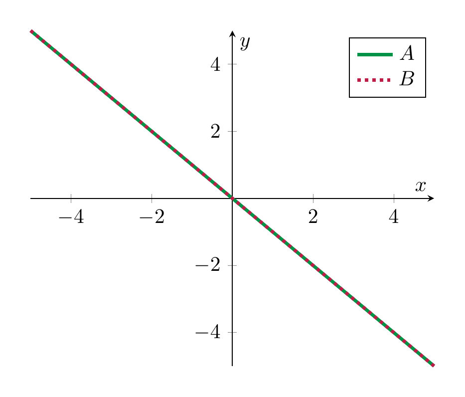 | 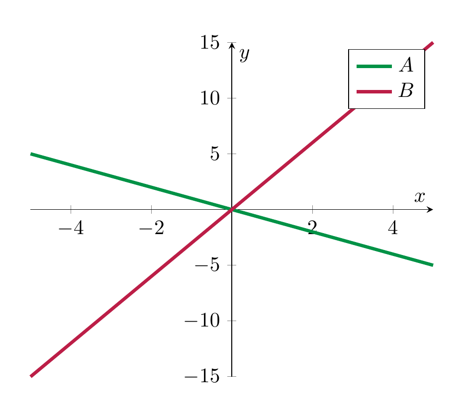 |

<strong>Definition 3.75</strong>

 Let $A, B \subset V$ be two subspaces. We say “the sum $A + B$ is a direct sum” if $\dim A + \dim B = \dim A + B$.

In other words, $\dim (A + B)$ needs to be as large as possible. In the example of two lines, i.e., $\dim A = \dim B = 1$, the sum is direct precisely if $A + B = {\bf R}^2$.

<strong>Example 3.76</strong>

 In $V = {\bf R}^3$, consider subspaces $A, B \subset {\bf R}^3$ with $\dim A =1$ and $\dim B = 2$. Thus, geometrically, $A$ is a line passing through the origin and $B$ is a plane passing through the origin. We have

\[
0 \subset A \cap B \subset A.
\]

This means that

\[
0 \le \dim (A \cap B) \le \dim A = 1.
\]

We distinguish two cases:

- $A \subset B$. Equivalently, $A \cap B = A$ or, yet equivalently,

\[
  \dim (A \cap B) = 1.
\]

- $A \nsubset B$. In this case $A \cap B \subsetneq A$. Since $A \cap B$ is a subspace of strictly smaller dimension, this implies $A \cap B = \{ 0\}$. Thus,

\[
  \dim (A \cap B) = 0.
\]

To summarize, a line $A$ and a plane $B$ (both passing through the origin) in ${\bf R}^3$ intersect either in a point or in a line.

<strong>Example 3.77</strong>

 Consider $V={\bf R}^3$ and two subspaces $A, B \subset {\bf R}^3$ of dimension 2. Then the formula reads

\[
\dim (A \cap B) = 2 + 2 - \dim (A + B).
\]

We have in any event $A, B \subset A + B \subset {\bf R}^3$, which implies

\[
2 \le \dim (A+B) \le 3.
\]

We consider two cases:

- $A = B$. In this case $A \cap B = A$ and $A + B = A$, which both have dimension 2.

- $A \ne B$. In this case $A \cap B \subsetneq A$, so $A \cap B$ has dimension $< 2$. This means that $\dim (A+B) = 3$, and therefore

\[
  \dim (A \cap B) = 1.
\]

We summarize this as follows: two planes $A$, $B$ passing through the origin in ${\bf R}^3$ intersect either in a plane (this happens precisely if $A = B$), or they interesect in a line (this happens precisely if $A \ne B$).

If the ambient vector space has dimension $\ge 4$, and $\dim A, \dim B \ge 2$, then the possible dimensions of $\dim (A \cap B)$ and $\dim (A +B)$ are more varied, so we refrain from making a similar list.

## Exercises

<strong>Exercise 3.1</strong>

 Let $V = \{ (x, y, z) \ | \ x, y, z \in {\bf R} \}$. (Thus, $V = {\bf R}^3$.) We use the regular addition of vectors. However, in contrast to the regular scalar multiplication (<a href="#def-scalar-multiplication" data-reference-type="ref+Label" data-reference="def:scalar-multiplication">Definition 3.7</a>), we now use the following. Decide in each case whether this turns $V$ into a vector space:

- $r \cdot (x, y, z) = (rx, y, rz)$,

- $r \cdot (x, y, z) = (0,0,0)$,

- $r \cdot (x,y,z) = (r^2x, r^2y, r^2z)$.

Let $V \subset {\bf R}^2$ be a subspace. Which of the following statements are correct?

1.  $V$ contains at least one element.

2.  $V$ contains at least two elements.

3.  $V$ contains the zero vector $(0,0)$.

4.  If $v, w \in V$ then also $v - w \in V$.

<strong>Exercise 3.3</strong>

 Using basic properties of differentiable functions from your calculus class, show that the space

\[
\{ f : {\bf R} \to {\bf R} \ | \ f \text{ is differentiable }\}
\]

is a vector space (with the sum and scalar multiple defined as in <a href="#sum-functions" data-reference-type="eqref" data-reference="sum functions">Definition and Lemma 3.22</a> and <a href="#scalar-multiple-functions" data-reference-type="eqref" data-reference="scalar multiple functions">Definition and Lemma 3.22</a>).

Hint: structure your thinking as in <a href="#dlm-polynomials-vector-space" data-reference-type="ref+Label" data-reference="dlm:polynomials-vector-space">Definition and Lemma 3.22</a>.

Give an example of two subspaces $V, W \subset {\bf R}^2$ such that their *union*

\[
V \cup W = \{ x = (x_1, x_2) \in {\bf R}^2 \ | \ x \in V \text{ or } x \in W \}
\]

is *not* a subspace.

Hint: <a href="#ex-non-vector-spaces" data-reference-type="ref+Label" data-reference="ex:non-vector-spaces">Example 3.13</a>.

Also give an example of two subspaces $V, W \subset {\bf R}^2$, where the union $V \cup W$ is a subspace.

Hint: be very lazy and minimalistic. What is the smallest subspace you can come up with?

Determine in each case whether $w \in {\bf R}^4$ lies in the span of $v_1$ and $v_2$. If so, name at least one linear combination of $v_1$ and $v_2$ that equals $w$; otherwise explain why there is no such linear combination.

1.  $w = (2, -1,0,1)$, $v_1 = (1,0,0,1)$, $v_2 = (0,1,0,1)$

2.  $w = (1,2,15,11)$, $v_1 = (2,-1,0,2)$, $v_2=(1,-1,-3,1)$

3.  $w = (2,5,8,3)$, $v_1 = (2,-1,0,5)$, $v_2 = (-1, 2, 2, -3)$

Determine whether the following vectors span ${\bf R}^4$:

1.  $(1,1,1,1)$, $(0,1,1,1)$, $(0,0,1,1)$, $(0,0,0,1)$

2.  $(1,3,-5,0)$, $(-2, 1,0,0)$, $(0,2,1,-1)$, $(1, -4, 5, 0)$

Determine whether the following vectors are linearly independent:

1.  $v_1 = (1, -1, 0)$, $v_2=(3,2,-1)$, $v_3 = (3,5,-2)$ in $V = {\bf R}^3$,

2.  $v_1 = (1,1,1)$, $v_2 = (1,-1,1)$, $v_3 = (0,0,1)$ in $V = {\bf R}^3$,

3.  $(1,-,1,1,-1)$, $(2,0,1,0)$, $0,-2,1,-2)$ in ${\bf R}^4$,

4.  $(1,1,0,0)$, $(1,0,1,0)$, $(0,0,1,1)$ and $(0,1,0,1)$ in ${\bf R}^4$.

Name three vectors $v_1, v_2, v_3 \in {\bf R}^2$ such that:

- $v_1, v_2$ are linearly independent,

- $v_1, v_3$ are linearly independent, and

- $v_2, v_3$ are linearly independent, but

- $v_1, v_2, v_3$ are *not* linearly independent.

Consider the vector space $V = {\bf R}[x]^{\le 3}$ of polynomials of degree at most 3. Decide which of the following subsets of $V$ is a subspace:

1.  $\{ f \ | \ f \in V, f(2) = 1 \}$,

2.  $\{ x \cdot f \ | \ f \in {\bf R}[x]^{\le 2} \}$,

3.  $\{ x \cdot f + (1-x) g \ | \ f, g \in {\bf R}[x]^{\le 2} \}$,

4.  $\{ f \ | \ f\in {\bf R}[x]^{\le 3}, f(0) = 0\}$.

<strong>Exercise 3.10</strong>

 Express the following polynomials as linear combinations of $x+1$, $x-1$ and $x^2-1$ (in ${\bf R}[x]^{\le 2})$: $x^2 + 4x-2$, $x$, $40-x^2$.

<strong>Exercise 3.11</strong>

 Is the following sentence correct? “In ${\bf R}[x]^{\le 3}$, the polynomial $f(x) = \frac 1 4 x^3 + 3x +1$ is a linear combination of the polynomials $x^2$, $x$ and $1$ since $f(x) = \frac x 4 \cdot x^2 + 3 \cdot x + 1$.”

<strong>Exercise 3.12</strong>

 Express each of the three standard basis vectors $e_1, e_2, e_3$ as a linear combination of the basis vectors in <a href="#ex-three-vectors-basis" data-reference-type="ref+Label" data-reference="ex:three-vectors-basis">Example 3.60</a>.

<strong>Exercise 3.13</strong>

 (See <a href="#sol-ex-spaces-2-1" data-reference-type="ref+Label" data-reference="sol--ex:spaces-2-1">Solution 3.10.2</a>.) Consider $A = \left ( \begin{array}{cc} 1 & 1 \\ 2 & 2 \end{array} \right )$ and $B = \left ( \begin{array}{cc} 3 & 2 \\ 3 & 5 \end{array} \right )$ in the vector space of $2 \times 2$-matrices. Is $C = \left ( \begin{array}{cc} -1 & 0 \\ 2 & 4 \end{array} \right )$ a linear combination of $A$ and $B$?

In the vector space ${\mathrm {Mat}}_{2 \times 3}$ of $2 \times 3$-matrices, we consider the set

\[
T = \left \{ \left ( \begin{array}{ccc} x_1 & x_2 & x_3 \\ x_4 & x_5 & x_6 \end{array} \right ) \ | \ x_1 + x_4 + x_6 = 0, x_1 + x_4 + x_3 + x_5 = 0 \right \}.
\]

1.  Decide whether $T$ is a subspace of ${\mathrm {Mat}}_{2 \times 3}$.

2.  Find all the vectors (i.e., matrices) in $T$.

3.  Find some vectors such that $T = L(v_1, v_2, v_3, v_4)$.

<strong>Exercise 3.15</strong>

 (See <a href="#sol-ex-spaces-2-2" data-reference-type="ref+Label" data-reference="sol--ex:spaces-2-2">Solution 3.10.3</a>.) In ${\bf R}^4$ consider the subset

\[
S = \{(x,y,z,t) \ | \ x+y+z+t = 0 \}.
\]

1.  Decide whether $S$ is a subspace of ${\bf R}^4$.

2.  Find all the vectors in $S$.

3.  Find some vectors such that $S = L(v_1, v_2, v_3)$.

<strong>Exercise 3.16</strong>

 (See <a href="#sol-ex-spaces-2-3" data-reference-type="ref+Label" data-reference="sol--ex:spaces-2-3">Solution 3.10.4</a>.) Consider the following two subspaces of ${\bf R}^4$:

\[
S = L((1,-1,0,1), (2,1,-2,0),(0,0,1,1))
\]

and $T$, which is the solution set of the system

\[
\begin{align*}
2x_1-x_2-3x_4 & = 0 \\
2x_1 + x_3 + x_4 & = 0.
\end{align*}
\]

Determine $S \cap T$.

Consider the following two subspaces of ${\bf R}^4$:

\[
W = L((1,0,1,0), (2,0,0,0), (0,-3,-1,-1))
\]

and $T$ given by the solution set of the system

\[
\begin{align*}
x_1-x_2 & = 0 \\
x_1+x_2+x_3&= 0.
\end{align*}
\]

Determine $T \cap W$.

Show that

- ${\bf R}^2 = L((1,1), (2,-1))$,

- ${\bf R}^2 = L((0,-2), (1,1))$.

Is $(1,5,0) \in {\bf R}^3$ a linear combination of $v_1 = (1,1,0)$, $v_2 = (2,0,1)$ and $v_3 = (0,3,-1)$?

(I.e., are there $a_1, a_2, a_3 \in {\bf R}$ such that $\alpha_1 v_1 + a_2 v_2 + a_3 v_3 = (1,5,0)$?)

Express the following polynomials as $f(x) = \sum_{i=0}^4 a_i (x-1)^4$:

1.  $f(x) = x^4$,

2.  $f(x) = x^3$,

3.  $f(x) = x^3 - 3x^2 + 4x+2$.

Let $a, b \in {\bf R}$ be two *distinct* numbers. Show that the polynomials $x-a$ and $x-b$ are a basis of ${\bf R}[x]^{\le 1}$.

In ${\bf R}^4 = \{(x,y,z,t) \ | \ x,y,z,t \in {\bf R} \}$ consider the subspace $W_1 \subset {\bf R}^4$ given by the solutions of the system

\[
\begin{align*}
y+t&=0, \\
y+z&=0.
\end{align*}
\]

Also consider the subspace $W_2 = L((0,1,-1,0))$.

Determine a basis and the dimension of $W_1$. Describe $W_1 \cap W_2$.

Let $k \in {\bf R}$ be an arbitrary real number. Consider the subspace

\[
W_k := L((1,0,-1,0), (1,1,0,1), (1,2,k,1)) \subset {\bf R}^4.
\]

1.  For all $k \in {\bf R}$, find a basis of $W_k$ and determine $\dim W_k$.

2.  For which $k \in {\bf R}$ is $(-1,1,1,1) \in W_k$?

Recall that the dimension of the space ${\mathrm {Mat}}_{2 \times 3}$ of $2 \times 3$-matrices is 6.

1.  Consider $W = \left \{ \left ( \begin{array}{ccc} a & a+b & b \\ 0 & 0 & b \end{array} \right ) \ | \ a, b \in {\bf R} \right \}$. Confirm that $W$ is a subspace of ${\mathrm {Mat}}_{2 \times 3}$. Determine $\dim W$.

2.  Let $V := \left \{ \left ( \begin{array}{ccc} c & 0 & -c \\ 0 & 0 & -c \end{array} \right ) \ | \ c \in {\bf R} \right \}$. Determine (i.e., determine a basis and the dimension of) $V \cap W$.

<strong>Exercise 3.25</strong>

 (See <a href="#sol-ex-spaces-2-4" data-reference-type="ref+Label" data-reference="sol--ex:spaces-2-4">Solution 3.10.5</a>.) Consider the following subspaces of ${\bf R}^3$:

\[
\begin{align*}
W_1 & := L((1,0,1), (2,1,0)) \\
W_2 & := L((-1,1,1), (0,3,0)).
\end{align*}
\]

1.  Determine (i.e., determine a basis and the dimension of) $W_1 \cap W_2$.

2.  Determine $W_1 + W_2$.

Consider the following subspaces of ${\bf R}^4$:

\[
\begin{align*}
W_1 & := L((1,1,1,2), (2,0,3,5)) \\
W_2 & := L((1,1,0,1),(0,2,-2,-2)).
\end{align*}
\]

As in the previous exercise, determine $W_1 \cap W_2$ and $W_1 + W_2$.

<strong>Exercise 3.27</strong>

 (See <a href="#sol-ex-spaces-2-5" data-reference-type="ref+Label" data-reference="sol--ex:spaces-2-5">Solution 3.10.6</a>.) Consider the subspace

\[
W = L(\underbrace{(1,0,1,0)}_{=v_1}, \underbrace{(2,0,1,1)}_{=v_2}, \underbrace{(0,0,1,3)}_{=v_3}).
\]

1.  Find a basis of $W$ and determine $\dim W$.

2.  Find a vector $v \in {\bf R}^4$ such that

\[
    W \subsetneq L(v_1, v_2, v_3, v).
\]

    What is $\dim L(v_1, v_2, v_3, v)$?

<strong>Exercise 3.28</strong>

 (See <a href="#sol-ex-spaces-2-6" data-reference-type="ref+Label" data-reference="sol--ex:spaces-2-6">Solution 3.10.7</a>.) Consider the vectors in ${\bf R}^4$, where $t \in {\bf R}$:

\[
\begin{align*}
u_1 &= (1,0,-1,2) \\
u_2 &=(1,0,0,1) \\
u_3&=(2,0,-1,3)\\
u_4&=(4,t,-2,6).
\end{align*}
\]

1.  Let $U_t = L(u_1, u_2, u_3, u_4)$ be the subspace spanned by these vectors (where the last vector depends on $t \in {\bf R}$). Find the values of $t$ such that

\[
    \dim U_t = 2.
\]

2.  Consider $t = 1$ from now on. Verify $\dim U_1 = 3$ and find a basis of $U_1$.

3.  Let $W \subset {\bf R}^4$ be the subspace given by the equations

\[
    \begin{align*}
    x_1+x_2+x_3 &= 0 \\times_1 - 3x_4 &= 0.
    \end{align*}
\]

    Determine $\dim W$ and $\dim U_1 \cap W$.

Consider the subspace $U_t \subset {\bf R}^4$ spanned by the four vectors

\[
\begin{align*}
v_1 & = (1,0, 0, 1) \\
v_2 &= (-1,1,2,3) \\
v_3 &=(0,1,2,4) \\
v_4 &=(t,2,4,8).
\end{align*}
\]

Here, $t \in {\bf R}$ is an arbitrary real number.

1.  Find the values of $t$, such that $\dim U_t = 2$.

2.  Consider from now on $t = 1$. Determine $\dim U_1$.

3.  Let $W \subset {\bf R}^4$ be the subspace given by the equations

\[
    \begin{align*}
    x_1 - x_2 & =0\\ x_2 - x_3 & = 0.
    \end{align*}
\]

    Determine a basis and the dimension of $W$ and of $W \cap U_1$.

## Solutions to the exercises

<strong>Solution 3.10.1</strong>

 (See <a href="#ex-exotic-scalar-multiplication" data-reference-type="ref+Label" data-reference="ex:exotic-scalar-multiplication">Exercise 3.1</a>.) To decide whether we get a vector space, we check axioms from <a href="#def-vector-space" data-reference-type="ref+Label" data-reference="def:vector-space">Definition 3.10</a>, especially

- $(r+s)v=rv+sv$ (<a href="#def-vector-space" data-reference-type="ref+Label" data-reference="def:vector-space">Definition 3.10</a><a href="#item-distributive-law" data-reference-type="ref" data-reference="item--distributive law">4.</a>),

- $(rs)v=r(sv)$ (<a href="#def-vector-space" data-reference-type="ref+Label" data-reference="def:vector-space">Definition 3.10</a><a href="#item-multiplication-law" data-reference-type="ref" data-reference="item--multiplication.law">6.</a>),

- and $1v=v$ (item 7 in <a href="#def-vector-space" data-reference-type="ref+Label" data-reference="def:vector-space">Definition 3.10</a>).

1.  $r\cdot(x,y,z)=(rx,y,rz)$. Let $v=(x,y,z)$. Then

\[
    (r+s)\cdot v=((r+s)x,y,(r+s)z),
\]

    while

\[
    r\cdot v+s\cdot v=(rx,y,rz)+(sx,y,sz)=((r+s)x,2y,(r+s)z).
\]

    In general these are different (e.g. if $y\neq 0$), so

\[
    (r+s)v\neq rv+sv.
\]

    Thus axiom <a href="#def-vector-space" data-reference-type="ref+Label" data-reference="def:vector-space">Definition 3.10</a><a href="#item-distributive-law" data-reference-type="ref" data-reference="item--distributive law">4.</a> fails. Hence this is *not* a vector space structure.

2.  $r\cdot(x,y,z)=(0,0,0)$.

    For any nonzero $v\in V$,

\[
    1\cdot v=(0,0,0)\neq v.
\]

    So the identity axiom $1v=v$ from <a href="#def-vector-space" data-reference-type="ref+Label" data-reference="def:vector-space">Definition 3.10</a> fails. Hence this is *not* a vector space structure.

3.  $r\cdot(x,y,z)=(r^2x,r^2y,r^2z)$.

    Here, for every $v=(x,y,z)\in V$,

\[
    1\cdot v=(1^2x,1^2y,1^2z)=(x,y,z)=v,
\]

    so the axiom $1v=v$ (item 7 in <a href="#def-vector-space" data-reference-type="ref+Label" data-reference="def:vector-space">Definition 3.10</a>) is satisfied. Also,

\[
    (r+s)\cdot v=((r+s)^2x,(r+s)^2y,(r+s)^2z),
\]

    while

\[
    r\cdot v+s\cdot v=(r^2x,r^2y,r^2z)+(s^2x,s^2y,s^2z)=((r^2+s^2)x,(r^2+s^2)y,(r^2+s^2)z).
\]

    In general these are different (e.g. $r=s=1$ and $v\neq 0$), so

\[
    (r+s)v\neq rv+sv.
\]

    Hence <a href="#def-vector-space" data-reference-type="ref+Label" data-reference="def:vector-space">Definition 3.10</a><a href="#item-distributive-law" data-reference-type="ref" data-reference="item--distributive law">4.</a> fails. (By contrast, <a href="#def-vector-space" data-reference-type="ref+Label" data-reference="def:vector-space">Definition 3.10</a><a href="#item-multiplication-law" data-reference-type="ref" data-reference="item--multiplication.law">6.</a> does hold here.) Hence this is *not* a vector space structure.

Therefore, in all three cases, $V$ is *not* a vector space.

<strong>Solution 3.10.2</strong>

 (See <a href="#ex-spaces-2-1" data-reference-type="ref+Label" data-reference="ex:spaces-2-1">Exercise 3.13</a>.) A linear combination of $A$ and $B$ is of the form

\[
\alpha A + \beta B = \alpha \left ( \begin{array}{cc} 1 & 1 \\ 2 & 2 \end{array} \right ) + \beta \left ( \begin{array}{cc} 3 & 2 \\ 3 & 5 \end{array} \right )
\]

with $\alpha, \beta \in {\bf R}$. Computing the left hand side, we need to find $\alpha$ and $\beta$ such that

\[
\left ( \begin{array}{cc} \alpha & \alpha \\ 2 \alpha & 2 \alpha \end{array} \right ) + \left ( \begin{array}{cc} 3 \beta & 2 \beta \\ 3 \beta & 5 \beta \end{array} \right ) = \left ( \begin{array}{cc} \alpha + 3\beta & \alpha + 2 \beta \\ 2\alpha+3\beta & 2\alpha+5\beta \end{array} \right ) = \left ( \begin{array}{cc} -1 & 0 \\ 2 & 4 \end{array} \right ).
\]

Comparing the entries of the matrix, this gives the linear system

\[
\begin{align*}
\alpha + 3 \beta & = -1 \\
\alpha + 2 \beta & = 0\\
2\alpha + 3\beta & = 2\\
2\alpha + 5 \beta & = 4.
\end{align*}
\]

The second gives $\alpha = -2\beta$, inserting into the first gives $-2 \beta+3 \beta = -1$, which means $\beta = -1$. However, inserting into the third equation gives $-4\beta + 3 \beta = 2$, so that $\beta = -2$, contradicting the previous equation. Thus, there is no solution, so $C$ is *not* a linear combination of $A$ and $B$.

<strong>Solution 3.10.3</strong>

 (See <a href="#ex-spaces-2-2" data-reference-type="ref+Label" data-reference="ex:spaces-2-2">Exercise 3.15</a>.) The system $x + y + z+t=0$ corresponds to the matrix

\[
( 1 \ 1 \ 1 \ 1 ).
\]

This matrix is already in reduced row echelon form: the leading one is for the variable $x$, the variables $y, z, t$ are free variables. Thus,

\[
S = \{(-\alpha - \beta - \gamma , \alpha, \beta, \gamma) \ | \ \alpha, \beta, \gamma \in {\bf R} \}.
\]

We have

\[
\begin{align*}
S & = \{(-\alpha, \alpha, 0,0) + (-\beta, 0, \beta, 0) + (-\gamma, 0, 0, \gamma) \ | \ \alpha, \beta, \gamma \in {\bf R}\}  \\
& = \{\alpha(-1, 1, 0,0) + \beta (-1, 0, 1, 0) + \gamma(-1, 0, 0, 1) \ | \ \alpha, \beta, \gamma \in {\bf R}\}  \\
& = L((-1,1,0,0), (-1,0,1,0), (-1,0,0,1)).
\end{align*}
\]

<strong>Solution 3.10.4</strong>

 (See <a href="#ex-spaces-2-3" data-reference-type="ref+Label" data-reference="ex:spaces-2-3">Exercise 3.16</a>.) By definition, $S$ consists of all the linear combinations of the three given vectors. These can be written as

\[
a (1,-1,0,1) + b(2,1,-2,0)+c(0,0,1,1) = (a+2b,-a+b,-2b+c,a+c)
\]

for arbitrary $a,b,c \in {\bf R}$. The intersection is given by vectors as above satisfying the linear system determining $T$, i.e.,

\[
\begin{align*}
x_1 &= a+2b\\
x_2 & = -a+b \\
x_3 &= -2b+c \\
x_4 & = a+c
\end{align*}
\]

such that

\[
\begin{align*}
2(a+2b)-(-a+b)-3(a+c) & = 0\\
2(a+2b)+(-2b+c)+(a+c) & = 0.
\end{align*}
\]

Simplifying these equations gives

\[
\begin{align*}
3b-3c & = 0\\
3a+2b+2c & = 0.
\end{align*}
\]

Thus $b=c$ and $3a+4c=0$, i.e., $a = -\frac 43c$, and $c$ is a free variable. (Alternatively, the above system is associated to the matrix $\left ( \begin{array}{ccc} 0 & 3 & -3 \\ 3 & 2 & 2 \end{array} \right )$, which can be brought into reduced row echelon form.) Thus,

\[
\begin{align*}
S \cap T & = \{-\frac 43 c(1,-1,0,1) + c(2,1,-2,0)+c(0,0,1,1) \ | \ c \in {\bf R} \} \\
& = \{ c \left ( (-\frac 43, \frac 43, 0, -\frac 43) + (2,1,-2,0)+(0,0,1,1) \right ) \ | \ c \in {\bf R} \} \\
& = \{ c ( \frac 23, \frac 73, -1, - \frac 13) \ | \ c \in {\bf R} \} \\
& = L(( \frac 23, \frac 73, -1, - \frac 13)).
\end{align*}
\]

<strong>Solution 3.10.5</strong>

 (See <a href="#ex-spaces-2-4" data-reference-type="ref+Label" data-reference="ex:spaces-2-4">Exercise 3.25</a>.) We have to find a vector $v \in W_1$ that is also contained in $W_2$. This means that

\[
v = a (1,0,1)+b(2,1,0) = (a+2b,b,a)
\]

<strong>(3.78)</strong>

 for some $a, b \in {\bf R}$ and at the same time

\[
v = \alpha(-1,-1,1) + \beta(0,3,0) = (-\alpha, -\alpha + 3 \beta, \alpha)
\]

for some $\alpha, \beta \in {\bf R}$. Comparing the two vectors gives the following linear system, where $a, b, \alpha, \beta$ are the unknowns:

\[
\begin{align*}
a + 2 b & = -\alpha \\
b & = -\alpha + 3\beta \\
a & = \alpha.
\end{align*}
\]

We solve this system: the last equation gives $a = \alpha$ and, from the first equation, $b = -\alpha$. The second equation implies $\beta = 0$. There is no condition on $\alpha$, this $\alpha = r$ for an arbitrary real number $r \in {\bf R}$.

Instead of solving the above system by hand, we may also use Gaussian elimination to solve this linear system. The matrix is the following (where the columns are for $a, b, \alpha, \beta$, in that order):

\[
\begin{align*}
\left ( \begin{array}{cccc} 1 & 2 & 1 & 0 \\ 0 & 1 & 1 & -3 \\ 1 & 0 & -1 & 0 \end{array} \right ) \leadsto
& \left ( \begin{array}{cccc} 1 & 2 & 1 & 0 \\ 0 & 1 & 1 & -3 \\ 0 & -2 & -2 & 0 \end{array} \right ) \leadsto
\left ( \begin{array}{cccc} 1 & 2 & 1 & 0 \\ 0 & 1 & 1 & -3 \\ 0 & 0 & 0 & -6 \end{array} \right ) \\ & \leadsto 
\left ( \begin{array}{cccc} 1 & 2 & 1 & 0 \\ 0 & 1 & 1 & -3 \\ 0 & 0 & 0 & 1 \end{array} \right ).
\end{align*}
\]

The three leading ones are for the variables $a, b, \beta$, and $\alpha$ is a free variable, so let $\alpha = r$, where $r \in {\bf R}$ is an arbitrary real number. This gives again $\beta = 0$, $b + r - 3\beta = 0$, so that $b = - r$ and $a = r$.

Thus the intersection $W_1 \cap W_2$ consists of the vectors

\[
v = \alpha (1,0,1) + (-\alpha)(2,1,0) = \alpha(-1,-1,1) + 0 (0,3,0) = (-\alpha, -\alpha, \alpha).
\]

Thus,

\[
W_1 \cap W_2 = L((1,-1,1)),
\]

so a basis of $W_1 \cap W_2$ consists of (the single vector) $(1,-1,1)$, and in particular

\[
\dim W_1 \cap W_2 = 1.
\]

We now consider $W_1 + W_2$. According to <a href="#def-sum-of-vector-spaces" data-reference-type="ref+Label" data-reference="def:sum-of-vector-spaces">Definition 3.34</a>,

\[
W_1 + W_2 = \{w_1 + w_2 \ | \ w_1 \in W_1, w_2 \in W_2 \},
\]

i.e., of arbitrary sums whose two summands are in $W_1$, respectively $W_2$.

As was noted in the proof of <a href="#cor-dim-sum-inequality" data-reference-type="ref+Label" data-reference="cor:dim-sum-inequality">Corollary 3.73</a>, if $V_1 = L(v_1, \dots, v_n)$ and $V_2 = L(w_1, \dots, w_m)$ are two subspaces of a vector space $V$, then the sum

\[
V_1 + V_2 = L(v_1, \dots, v_n, w_1, \dots, w_m).
\]

For the subspaces $W_1, W_2$ above, this means that we determine the span

\[
L(\underbrace{(1,0,1)}_{v_1}, \underbrace{(2,1,0)}_{v_2}, \underbrace{(-1,-1,1)}_{w_1}, \underbrace{(0,3,0)}_{w_2}).
\]

By <a href="#def-basis" data-reference-type="ref+Label" data-reference="def:basis">Definition 3.58</a><a href="#item-generators-remove" data-reference-type="ref" data-reference="item--generators.remove">1.</a>, we obtain a basis of $W_1 + W_2$ by (possibly) removing several of these four vectors. To determine which ones these are, we apply <a href="#met-check-linear-independence" data-reference-type="ref+Label" data-reference="met:check-linear-independence">Method 3.53</a> and <a href="#met-check-generating-system" data-reference-type="ref+Label" data-reference="met:check-generating-system">Method 3.44</a>. The matrix built out of the four vectors is

\[
\left ( \begin{array}{c} v_1 \\ v_2 \\ w_1 \\ w_2 \end{array} \right ) = \left ( \begin{array}{ccc} 1 & 0 & 1 \\ 2 & 1 & 0 \\ \hline -1 & -1 & 1 \\ 0 & 3 & 0 \end{array} \right ) \leadsto \left ( \begin{array}{ccc} 1 & 0 & 1 \\ 0 & 1 & -2 \\ \hline 0 & -1 & 2 \\ 0 & 3 & 0 \end{array} \right ) \leadsto
\left ( \begin{array}{ccc} 1 & 0 & 1 \\ 0 & 1 & -2 \\ \hline \underline{0} & \underline{0} & \underline{0} \\ 0 & 0 & 6 \end{array} \right ).
\]

Note that in this process we only added multiples of some rows to another row, but did not interchange any rows. Since we have the zero vector (underlined) in the third row, the vector $w_1$ is a linear combination of $v_1$ and $v_2$. The vectors $v_1, v_2, w_2$ are however linearly independent. Thus, they form a basis of $W_1 + W_2$. In particular, $\dim (W_1 + W_2) = 3$.

An alternative way to determine at least the dimension of $W_1 + W_2$ is to use <a href="#thm-dim-cap-sum" data-reference-type="ref+Label" data-reference="thm:dim-cap-sum">Theorem 3.74</a>:

\[
\dim (W_1 + W_2) = \dim W_1 + \dim W_2 - \dim (W_1 \cap W_2).
\]

Using again <a href="#met-check-linear-independence" data-reference-type="ref+Label" data-reference="met:check-linear-independence">Method 3.53</a>, one can check that $v_1, v_2$ is a basis of $W_1$, so that $\dim W_1 = 2$ and similarly that $w_1, w_2$ form a basis of $W_2$, so that $\dim W_2 = 2$. Thus, using the first part of the exercise, we confirm $\dim (W_1 + W_2) = 3$.

<strong>Solution 3.10.6</strong>

 (See <a href="#ex-spaces-2-5" data-reference-type="ref+Label" data-reference="ex:spaces-2-5">Exercise 3.27</a>.) We will show that $v_1, v_2, v_3$ are linearly independent (in ${\bf R}^4$ and therefore also in the subspace $W$) and therefore form a basis of $W$. We use <a href="#met-check-linear-independence" data-reference-type="ref+Label" data-reference="met:check-linear-independence">Method 3.53</a>:

\[
\begin{align*}
\left ( \begin{array}{c} v_1 \\ v_2 \\ v_3 \end{array} \right ) = & \left ( \begin{array}{cccc} 1 & 0 & 1 & 0 \\ 2 & 0 & 1 & 1 \\ 0 & 0 & 1 & 3 \end{array} \right ) \leadsto \left ( \begin{array}{cccc} 1 & 0 & 1 & 0 \\ 0 & 0 & -1 & 1 \\ 0 & 0 & 1 & 3 \end{array} \right ) 
\leadsto \left ( \begin{array}{cccc} 1 & 0 & 1 & 0 \\ 0 & 0 & 1 & -1 \\ 0 & 0 & 0 & 4 \end{array} \right )\\
\leadsto & \left ( \begin{array}{cccc} 1 & 0 & 1 & 0 \\ 0 & 0 & 1 & -1 \\ 0 & 0 & 0 & 1 \end{array} \right )
\end{align*}
\]

This matrix has three leading ones, so the vectors are linearly independent as claimed.

We “guess” $v = (1, 2, 3, 4)$ and check that these vectors $v_1, v_2, v_3, v$ are linearly independent. By <a href="#lem-independent-linear-combination" data-reference-type="ref+Label" data-reference="lem:independent-linear-combination">Lemma 3.51</a>, this will then imply that $v$ is not a linear combination of the other vectors, so that $W \subsetneq L(v_1, v_2, v_3, v)$. We use <a href="#met-check-linear-independence" data-reference-type="ref+Label" data-reference="met:check-linear-independence">Method 3.53</a>:

\[
\begin{align*}
\left ( \begin{array}{cccc} 1 & 0 & 1 & 0 \\ 2 & 0 & 1 & 1 \\ 0 & 0 & 1 & 3 \\ 1 & 2 & 3 & 4 \end{array} \right ) & \leadsto
\left ( \begin{array}{cccc} 1 & 0 & 1 & 0 \\ 0 & 0 & -1 & 1 \\ 0 & 0 & 1 & 3 \\ 0 & 2 & 2 & 4 \end{array} \right ) \leadsto
\left ( \begin{array}{cccc} 1 & 0 & 1 & 0 \\ 0 & 0 & -1 & 1 \\ 0 & 0 & 1 & 3 \\ 0 & 1 & 1 & 2 \end{array} \right ) \\
& \leadsto
\left ( \begin{array}{cccc} \underline1 & 0 & 1 & 0 \\ 0 & 0 & 0 & \underline4 \\ 0 & 0 & \underline1 & 3 \\ 0 & \underline1 & 1 & 2 \end{array} \right )
\end{align*}
\]

After dividing the second row by 4, we can interchange rows and get a row echelon matrix with four leading ones (underlined). Thus, $v_1, v_2, v_3, v$ are linearly independent. Therefore, they form in fact a basis of ${\bf R}^4$, and we know by <a href="#def-basis" data-reference-type="ref+Label" data-reference="def:basis">Definition 3.58</a><a href="#item-dim-subspace" data-reference-type="ref" data-reference="item--dim.subspace">3.</a> that therefore

\[
W \subsetneq {\bf R}^4 = L(v_1, v_2, v_3, v).
\]

<strong>Remark 3.79</strong>

 A more systematic way of solving the second part of the exercise, without guessing, is to use <a href="#def-basis" data-reference-type="ref+Label" data-reference="def:basis">Definition 3.58</a>: we can take the standard basis of ${\bf R}^4$, and for (at least) one of the four standard basis vectors $e_1, e_2, e_3, e_4$ we will have that this standard basis vector together with $v_1, v_2, v_3$ form a basis of ${\bf R}^4$. We can then use <a href="#met-check-linear-independence" data-reference-type="ref+Label" data-reference="met:check-linear-independence">Method 3.53</a> to see that, for example, $v_1, v_2, v_3, e_1$ are linearly independent and therefore form a basis of ${\bf R}^4$, so that in particular $W \subsetneq L(v_1, v_2, v_3, e_1)$.

<strong>Solution 3.10.7</strong>

 (See <a href="#ex-spaces-2-6" data-reference-type="ref+Label" data-reference="ex:spaces-2-6">Exercise 3.28</a>.) We bring the matrix formed by these vectors in row-echelon form:

\[
\begin{align*}
\left ( \begin{array}{cccc} 1 & 0 & -1 & 2 \\ 1 & 0 & 0 & 1 \\ 2 & 0 & -1 & 3 \\ 4 & t & -2 & 6 \end{array} \right ) & \leadsto
\left ( \begin{array}{cccc} 1 & 0 & -1 & 2 \\ 0 & 0 & 1 & -1 \\ 0 & 0 & 1 & -1 \\ 0 & t & 2 & -2 \end{array} \right ) \\
&\leadsto \left ( \begin{array}{cccc} 1 & 0 & -1 & 2 \\ 0 & t & 2 & -2 \\ 0 & 0 & 1 & -1 \\ 0 & 0 & 1 & -1 \end{array} \right ) \\
& \leadsto \left ( \begin{array}{cccc} 1 & 0 & -1 & 2 \\ 0 & t & 2 & -2 \\ 0 & 0 & 1 & -1 \\ 0 & 0 & 0 & 0 \end{array} \right ).
\end{align*}
\]

If $t \ne 0$, we can divide by $t$, which gives a matrix with three leading ones. Thus, the space $U_t$ which is spanned by these vectors has dimension 3 in this case. If $t = 0$, we continue simplifying the matrix into row echelon form:

\[
\begin{align*}
\left ( \begin{array}{cccc} 1 & 0 & -1 & 2 \\ 0 & t & 2 & -2 \\ 0 & 0 & 1 & -1 \\ 0 & 0 & 0 & 0 \end{array} \right ) & = 
\left ( \begin{array}{cccc} 1 & 0 & -1 & 2 \\ 0 & 0 & 2 & -2 \\ 0 & 0 & 1 & -1 \\ 0 & 0 & 0 & 0 \end{array} \right ) \\
& \leadsto \left ( \begin{array}{cccc} 1 & 0 & -1 & 2 \\ 0 & 0 & 1 & -1 \\ 0 & 0 & 0 & 0 \\ 0 & 0 & 0 & 0 \end{array} \right ).
\end{align*}
\]

This has two leading ones, thus $\dim U_t = 2$ in this case.

We now consider $t = 1$. The subspace $U := U_1$ then has a basis consisting of the non-zero rows if the matrix above, i.e., it has a basis consisting of the vectors

\[
(1,0,-1,2), (0,1,2,-2), (0,0,1,-1).
\]

In order to determine a basis of $W$, we form the matrix associated to these homogeneous equations, which is

\[
\left ( \begin{array}{cccc} 1 & 1 & 1 & 0 \\ 1 & 0 & 0 & -3 \end{array} \right ) \leadsto \left ( \begin{array}{cccc} 1 & 1 & 1 & 0 \\ 0 & -1 & -1 & -3 \end{array} \right ).
\]

This has two columns not having a leading one, namely the last two. These are the free variables, say $x_3 = a$, $x_4 = b$ for $a , b \in {\bf R}$. To determine a basis of $W$, we therefore have to consider the system

\[
\begin{align*}
x_1 + x_2 + a & = 0\\
x_2 + a + 3b & = 0
\end{align*}
\]

This gives $x_2 = -a-3b$, and $x_1 - 3b=0$ so that $x_1 = 3b$. Thus, a basis of $W$ is given by the two vectors

\[
(0,-1,1,0) \text{ and }(3,-3,0,1).
\]

In order to determine $U \cap W$, consider a generic vector of $U$, i.e., one of the form

\[
\begin{align*}
v & = a(1,0,-1,2) + b(0,1,2,-2) + c(0,0,1,-1) \\
&= (a,b,-a+2b+c,2a-2b-c).
\end{align*}
\]

We require it to satisfy the equations describing $W$:

\[
\begin{align*}
a+b+(-a+2b+c) & = 0\\
a-3(2a-2b-c) & = 0.
\end{align*}
\]

Simplifying these expressions gives the system

\[
\begin{align*}
3b+c & = 0\\
-5a+6b+3c & = 0.
\end{align*}
\]

Therefore $c = -3b$, plugging this into the second equation gives, after simplifying, $-5a-3b = 0$ or $a = -\frac35b$. Thus, our vector $v \in U$ belongs to $W$ precisely if it can be written as

\[
\begin{align*}
-\frac 35 b(1,0,-1,2)+b(0,1,2,-2)+(-3b)(0,0,1,-1) & = (-\frac 3bb, b, \frac35b+2b-3b,-\frac 65b-2b+3b) \\
&= b(-\frac 35, 1, -\frac25, -\frac15),
\end{align*}
\]

where $b \in {\bf R}$ is arbitrary. Thus, a basis of $U \cap W$ is this vector

\[
(-\frac 35, 1, -\frac 25, -\frac 15).
\]

In particular, $\dim U \cap W = 1$.

[^1]: or even infinitely many
