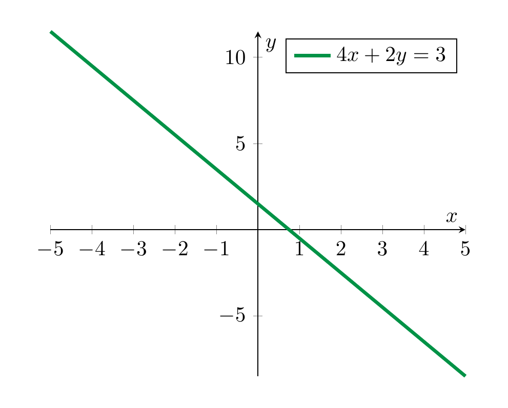

# Systems of Linear Equations

## Linear equations

<strong>Definition 2.1</strong>

 Let $a, b, c \in {\bf R}$ be fixed real numbers. An equation of the form

\[
ax+by=c
\]

is called a *linear equation* in the *variables* (or *unknowns*) $x$ and $y$.

More generally, an equation of the form

\[
a_1 x_1 + \dots + a_n x_n = b
\]

is called a *linear equation* in the *variables* $x_1, \dots, x_n$. The real numbers $a_1, \dots, a_n$ are called the *coefficients* and $b$ is the *constant term* of the equation. The *solution set* consists precisely of those collections (more formally, ordered tuples) of numbers $r_1$, $r_2$, up to $r_n$ such that substituting the variables $x_1, \dots, x_n$ by $r_1, \dots, r_n$ respectively, the equation holds, i.e., such that

\[
a_1 r_1  + \dots + a_n r_n = b.
\]

The name “linear” stems from the geometry of the solution sets, as the following example shows:

<strong>Example 2.2</strong>

 The equation

\[
4 x + 2 y = 3
\]

<strong>(2.3)</strong>

 is a linear equation (with coefficients $4$ and $2$ and constant term 3).

We can solve this equation by subtracting $4x$ from both sides, which gives

\[
2 y = -4x + 3
\]

and dividing by 2, which gives

\[
y = -2 x + \frac 3 2.
\]

<strong>(2.4)</strong>

 In each of these steps, one equation holds precisely if the next one holds. Thus the solution set of is the same as the solution set of the equation . That solution set is therefore the following set:

\[
\{(x, -2x+\frac 3 2) \text{ with } x \in {\bf R} \}.
\]

Here we use standard set-theoretic notation, cf. §<a href="../appendix/#sect-notation" data-reference-type="ref" data-reference="sect--notation">Chapter A</a>. Thus, the above means the set of all pairs $(x, -2x + \frac 3 2)$, where $x$ is an *arbitrary* real number. In particular, since there are infinitely many real numbers $x$, this is an infinite set.

Graphically, the solution set is the set of points as depicted below:

In general, any equation of the form

\[
ax+by=c
\]

with $a \ne 0$ or $b \ne 0$ will have a line as a solution set (what happens if $a=b=0$?, cf. <a href="../systems-gaussian-elimination/#ex-equation-no-solutions" data-reference-type="ref+Label" data-reference="ex:equation-no-solutions">Exercise 2.6</a>).

<strong>Remark 2.5</strong>

 In the computation above it was critical that we were able to *divide* 3 by 2, i.e., have the rational number $\frac 3 2$ at our disposal. The real numbers ${\bf R}$ (and also the rational numbers ${ {\bf Q}}$) form a so-called *field*, which among other properties means that one can divide by non-zero numbers. Another example of a field are the complex numbers ${ {\bf C}}$. The integers ${ {\bf Z}} = \{ \dots, -2, -1, 0, 1, 2, \dots \}$ do *not* form a field. Solving linear systems in the integers is somewhat harder than it is in the rationals or reals. This course will focus on discussing linear algebra over the real numbers, with the exception of the discussion of eigenvalues, where the consideration of complex numbers is unavoidable.

<strong>Remark 2.6</strong>

 A great number of equations arising in physics, biology, chemistry and of course mathematics itself are linear. *Nonlinear equations* such as

\[
\begin{align*}
x^2 + 4 y^3 &= 5 \\
\log (x) - 4 \sin(x) & = 0
\end{align*}
\]

are not primarily studied in linear algebra. For such more complicated equations, linear algebra is still useful, however. This is accomplished by replacing such equations by *linear approximations*. The first idea in that direction is the derivative of a function $f$, which serves as a best linear approximation of a differentiable function. Such linearization techniques are beyond the scope of this lecture.

