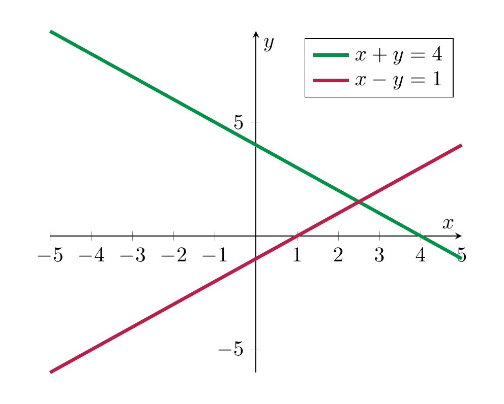
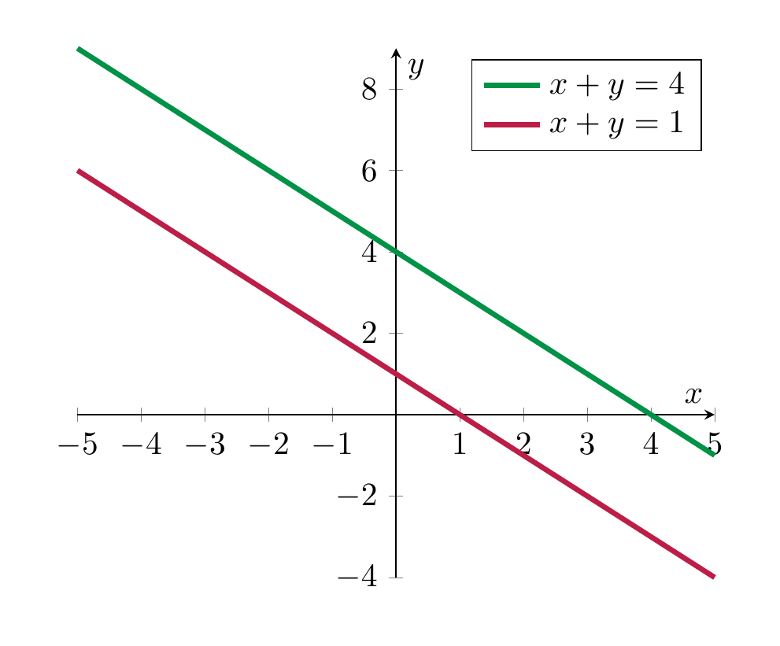
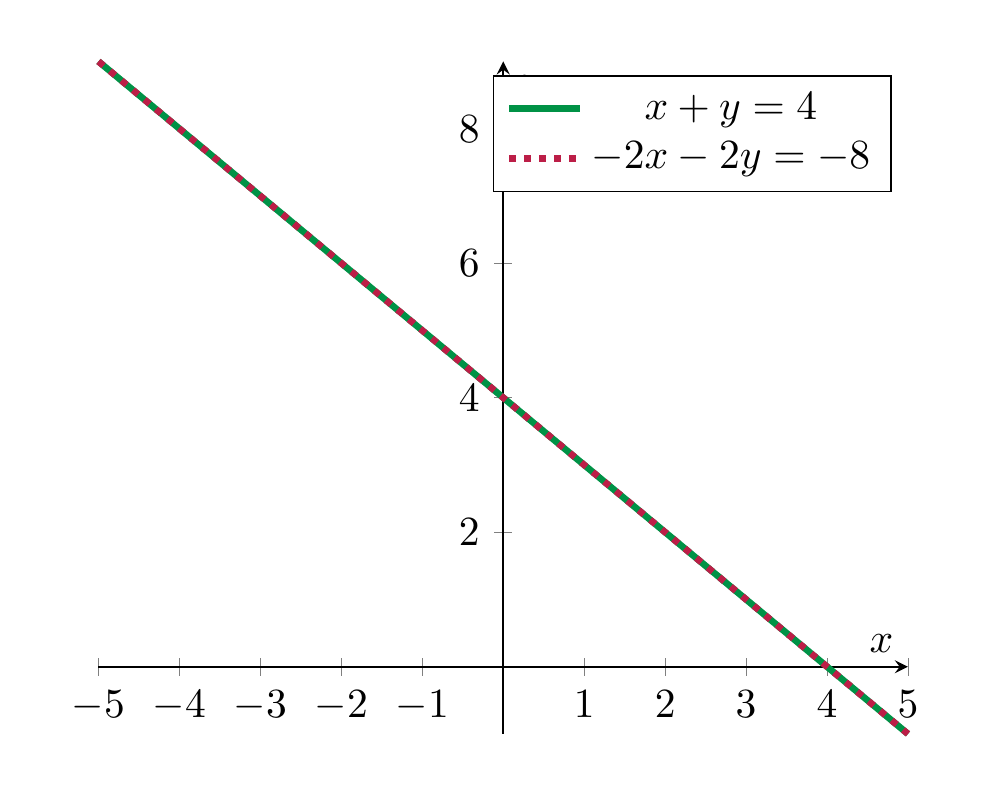

# Systems of linear equations

<strong>Definition 2.7</strong>

 A *system of linear equations* is a collection of linear equations (involving the same variables). It is also sometimes called a *linear system* or even just a *system*.

The interest in linear systems lies in finding those tuples of numbers satisfying *all* equations at once (as opposed to just one of them, say). We will start with two equations in two variables.

<strong>Example 2.8</strong>

 The equations

\[
\begin{align}
x+y&=4 \\
x-y&=1. \nonumber
\end{align}
\]

<strong>(2.9)</strong>

 form a system of linear equations (in the variables $x$ and $y$).

We solve this system algebraically by subtracting $y$ in the first equation, which gives

\[
x = -y + 4,
\]

and substituting this into the second equation, which gives

\[
(-y+4)-y=1,
\]

or

\[
-2y+4=1
\]

or

\[
-2y=-3
\]

or finally

\[
y = \frac 3 2.
\]

Inserting this back above, gives

\[
x = - \frac 3 2 + 4 = \frac 5 2.
\]

Note that again each equation holds (for given values of $x$ and $y$) precisely if the preceding one holds. Thus, the original system has the same solution set as the last two equation (together). This system of equations therefore has a *unique* solution, namely

\[
(x = \frac 5 2, y = \frac 3 2).
\]

To say the same using different symbols: the solution set of the system <a href="#system-2-unique-eqn" data-reference-type="eqref" data-reference="system.2.unique.eqn">Equation (2.9)</a> is a set consisting of a single element:

\[
\{(\frac 5 2, \frac 3 2) \}
\]

It is very useful to also understand this process geometrically, which we do by plotting the two lines that are the solutions of the individual equations:

The algebraic computation of having precisely one solution is matched by the fact that two non-parallel lines in the plane (which are the solution sets of the individual equations) exact in precisely one point.

The above linear system <a href="#system-2-unique-eqn" data-reference-type="eqref" data-reference="system.2.unique.eqn">Equation (2.9)</a> had exactly one solution. This need not always be the case, as the following examples show:

<strong>Example 2.10</strong>

 The system

\[
\begin{align*}
x + y & = 4\\
x + y & = 1
\end{align*}
\]

has *no solution*. This can be seen algebraically  and also geometrically:

The system has no solution, which is paralleled by the fact that two *parallel, but distinct* lines in the plane do not intersect.

<strong>Example 2.11</strong>

 The system

\[
\begin{align*}
x + y & = 4 \\
-2x -2y & = -8
\end{align*}
\]

has infinitely many solutions, namely all pairs of the form

\[
(x, y = 4-x),
\]

with an arbitrary real number $x$. Geometrically, this is explained by taking the “intersection” of the same line twice.

In other words, even though there are two equations above, they both have the same solution set. Thus, in some sense one of the equations is redundant, i.e., the solution set of the entire system equals the solution set of either of the equations individually.

<strong>Summary 2.12</strong>

 The solution set of an equation of the form

\[
ax+by = c
\]

is a line (unless both $a$ and $b$ are zero).

The solution set of a system of equations of the form

\[
ax+by = c
\]

\[
dx+ey = f
\]

can take three forms:\

| number of solutions | geometric explanation |
|:---|:---|
| exactly one solution | the unique intersection point of two non-parallel lines |
| no solution | two distinct parallel lines don’t intersect |
| infinitely many solutions | a line intersects itself in infinitely many points |

<strong>Definition 2.13</strong>

 A *homogeneous linear system* is one in which the constant terms in all equations are zero. (I.e., in the notation in below, $b_1 = \dots = b_n = 0$.)

<strong>Remark 2.14</strong>

 For a homogeneous linear system, there is always *at least* one solution namely

\[
(x_1 = 0, \dots, x_n = 0).
\]

This solution is called the *trivial solution*.

