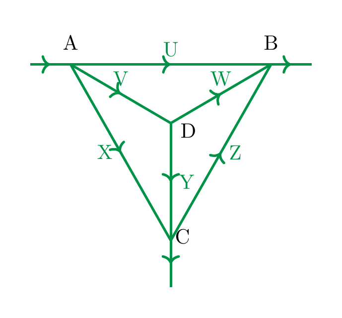

# Systems of Linear Equations

## Linear equations

<strong>Definition 2.1</strong>

 Let $a, b, c \in {\bf R}$ be fixed real numbers. An equation of the form

\[
ax+by=c
\]

is called a *linear equation* in the *variables* (or *unknowns*) $x$ and $y$.

More generally, an equation of the form

\[
a_1 x_1 + \dots + a_n x_n = b
\]

is called a *linear equation* in the *variables* $x_1, \dots, x_n$. The real numbers $a_1, \dots, a_n$ are called the *coefficients* and $b$ is the *constant term* of the equation. The *solution set* consists precisely of those collections (more formally, ordered tuples) of numbers $r_1$, $r_2$, up to $r_n$ such that substituting the variables $x_1, \dots, x_n$ by $r_1, \dots, r_n$ respectively, the equation holds, i.e., such that

\[
a_1 r_1  + \dots + a_n r_n = b.
\]

The name “linear” stems from the geometry of the solution sets, as the following example shows:

<strong>Example 2.2</strong>

 The equation

\[
4 x + 2 y = 3
\]

<strong>(2.3)</strong>

 is a linear equation (with coefficients $4$ and $2$ and constant term 3).

We can solve this equation by subtracting $4x$ from both sides, which gives

\[
2 y = -4x + 3
\]

and dividing by 2, which gives

\[
y = -2 x + \frac 3 2.
\]

<strong>(2.4)</strong>

 In each of these steps, one equation holds precisely if the next one holds. Thus the solution set of is the same as the solution set of the equation . That solution set is therefore the following set:

\[
\{(x, -2x+\frac 3 2) \text{ with } x \in {\bf R} \}.
\]

Here we use standard set-theoretic notation, cf. §<a href="../appendix/#sect-notation" data-reference-type="ref" data-reference="sect--notation">Chapter A</a>. Thus, the above means the set of all pairs $(x, -2x + \frac 3 2)$, where $x$ is an *arbitrary* real number. In particular, since there are infinitely many real numbers $x$, this is an infinite set.

Graphically, the solution set is the set of points as depicted below:

In general, any equation of the form

\[
ax+by=c
\]

with $a \ne 0$ or $b \ne 0$ will have a line as a solution set (what happens if $a=b=0$?, cf. <a href="#ex-equation-no-solutions" data-reference-type="ref+Label" data-reference="ex:equation-no-solutions">Exercise 2.6</a>).

<strong>Remark 2.5</strong>

 In the computation above it was critical that we were able to *divide* 3 by 2, i.e., have the rational number $\frac 3 2$ at our disposal. The real numbers ${\bf R}$ (and also the rational numbers ${ {\bf Q}}$) form a so-called *field*, which among other properties means that one can divide by non-zero numbers. Another example of a field are the complex numbers ${ {\bf C}}$. The integers ${ {\bf Z}} = \{ \dots, -2, -1, 0, 1, 2, \dots \}$ do *not* form a field. Solving linear systems in the integers is somewhat harder than it is in the rationals or reals. This course will focus on discussing linear algebra over the real numbers, with the exception of the discussion of eigenvalues, where the consideration of complex numbers is unavoidable.

<strong>Remark 2.6</strong>

 A great number of equations arising in physics, biology, chemistry and of course mathematics itself are linear. *Nonlinear equations* such as

\[
\begin{align*}
x^2 + 4 y^3 &= 5 \\
\log (x) - 4 \sin(x) & = 0
\end{align*}
\]

are not primarily studied in linear algebra. For such more complicated equations, linear algebra is still useful, however. This is accomplished by replacing such equations by *linear approximations*. The first idea in that direction is the derivative of a function $f$, which serves as a best linear approximation of a differentiable function. Such linearization techniques are beyond the scope of this lecture.

## Systems of linear equations

<strong>Definition 2.7</strong>

 A *system of linear equations* is a collection of linear equations (involving the same variables). It is also sometimes called a *linear system* or even just a *system*.

The interest in linear systems lies in finding those tuples of numbers satisfying *all* equations at once (as opposed to just one of them, say). We will start with two equations in two variables.

<strong>Example 2.8</strong>

 The equations

\[
\begin{align}
x+y&=4 \\
x-y&=1. \nonumber
\end{align}
\]

<strong>(2.9)</strong>

 form a system of linear equations (in the variables $x$ and $y$).

We solve this system algebraically by subtracting $y$ in the first equation, which gives

\[
x = -y + 4,
\]

and substituting this into the second equation, which gives

\[
(-y+4)-y=1,
\]

or

\[
-2y+4=1
\]

or

\[
-2y=-3
\]

or finally

\[
y = \frac 3 2.
\]

Inserting this back above, gives

\[
x = - \frac 3 2 + 4 = \frac 5 2.
\]

Note that again each equation holds (for given values of $x$ and $y$) precisely if the preceding one holds. Thus, the original system has the same solution set as the last two equation (together). This system of equations therefore has a *unique* solution, namely

\[
(x = \frac 5 2, y = \frac 3 2).
\]

To say the same using different symbols: the solution set of the system <a href="#system-2-unique-eqn" data-reference-type="eqref" data-reference="system.2.unique.eqn">Equation (2.9)</a> is a set consisting of a single element:

\[
\{(\frac 5 2, \frac 3 2) \}
\]

It is very useful to also understand this process geometrically, which we do by plotting the two lines that are the solutions of the individual equations:

The algebraic computation of having precisely one solution is matched by the fact that two non-parallel lines in the plane (which are the solution sets of the individual equations) exact in precisely one point.

The above linear system <a href="#system-2-unique-eqn" data-reference-type="eqref" data-reference="system.2.unique.eqn">Equation (2.9)</a> had exactly one solution. This need not always be the case, as the following examples show:

<strong>Example 2.10</strong>

 The system

\[
\begin{align*}
x + y & = 4\\
x + y & = 1
\end{align*}
\]

has *no solution*. This can be seen algebraically  and also geometrically:

The system has no solution, which is paralleled by the fact that two *parallel, but distinct* lines in the plane do not intersect.

<strong>Example 2.11</strong>

 The system

\[
\begin{align*}
x + y & = 4 \\
-2x -2y & = -8
\end{align*}
\]

has infinitely many solutions, namely all pairs of the form

\[
(x, y = 4-x),
\]

with an arbitrary real number $x$. Geometrically, this is explained by taking the “intersection” of the same line twice.

In other words, even though there are two equations above, they both have the same solution set. Thus, in some sense one of the equations is redundant, i.e., the solution set of the entire system equals the solution set of either of the equations individually.

<strong>Summary 2.12</strong>

 The solution set of an equation of the form

\[
ax+by = c
\]

is a line (unless both $a$ and $b$ are zero).

The solution set of a system of equations of the form

\[
ax+by = c
\]

\[
dx+ey = f
\]

can take three forms:\

| number of solutions | geometric explanation |
|:---|:---|
| exactly one solution | the unique intersection point of two non-parallel lines |
| no solution | two distinct parallel lines don’t intersect |
| infinitely many solutions | a line intersects itself in infinitely many points |

<strong>Definition 2.13</strong>

 A *homogeneous linear system* is one in which the constant terms in all equations are zero. (I.e., in the notation in below, $b_1 = \dots = b_n = 0$.)

<strong>Remark 2.14</strong>

 For a homogeneous linear system, there is always *at least* one solution namely

\[
(x_1 = 0, \dots, x_n = 0).
\]

This solution is called the *trivial solution*.

## Elementary operations

The combination of geometric intuition with algebraic computations is very useful. However, the former is of limited use when it comes to systems with three variables, and hardly useful anymore for systems involving four or more variables. We will therefore develop notions and techniques that enable us to handle linear systems more systematically.

<strong>Definition 2.15</strong>

 We say that two linear systems are *equivalent* if they have the same solution sets.

<strong>Example 2.16</strong>

 In <a href="#ex-system-2-unique" data-reference-type="ref+Label" data-reference="ex:system-2-unique">Example 2.8</a>, we considered the system

\[
\begin{align*}
x+y & = 4 \\
x-y & =1
\end{align*}
\]

and found that it has a unique solution, namely

\[
(x = \frac 5 2, y = \frac 3 2).
\]

Thus the previous system is equivalent to the system

\[
\begin{align*}
x&=\frac 5 2 \\
y&=\frac 3 2.
\end{align*}
\]

Of course, in comparison to the original system, the latter system is much easier to understand, since one can simply read off the solution without any effort. The purpose of elementary operations is to transform a given system into an equivalent system of which the solutions can be read off.

<strong>Definition 2.17</strong>

 Given a linear system, the following operations are called *elementary operations*:

1.   interchange two equations,

2.   multiply one equation by a *non-zero* (!) number,

3.   add a multiple of one equation to a *different* (!) equation.

These operations are called “elementary” since they are so simple to perform. Their utility comes partly from the following fact:

<strong>Theorem 2.18</strong>

 Consider a linear system. This linear system is equivalent to (i.e., has the same solutions as) any linear system obtained by performing any number of elementary operations.

This theorem, which we will prove later on (<a href="../maps/#cor-equivalent-systems" data-reference-type="ref+Label" data-reference="cor:equivalent-systems">Corollary 4.77</a>) when we have more tools at our disposal may sound a little abstract at first sight. It is however actually simple to comprehend and, very importantly, extremely useful in practice.

<strong>Example 2.19</strong>

 Consider the system

\[
\begin{align*}
x + 2z & = -1 \\
-2x - 3z & = 1 \\
2 y & = -2.\\
\end{align*}
\]

We add twice the first equation to the second (elementary operation <a href="#item-add" data-reference-type="ref" data-reference="item--add">3.</a>):

\[
\begin{align*}
x + 2z & = -1 \\
z & = -1 \\
2 y & = -2.\\
\end{align*}
\]

We interchange the second and third equation (elementary operation <a href="#item-change" data-reference-type="ref" data-reference="item--change">1.</a>):

\[
\begin{align*}
x + 2z & = -1 \\
2 y & = -2\\
z & = -1. \\
\end{align*}
\]

We multiply the second equation by $\frac 1 2$ (in other words, we divide it by 2; elementary operation <a href="#item-multiply" data-reference-type="ref" data-reference="item--multiply">2.</a>):

\[
\begin{align*}
x + 2z & = -1 \\
 y & = -1\\
z & = -1. \\
\end{align*}
\]

We add $(-2)$ times the third equation to the first (elementary operation <a href="#item-add" data-reference-type="ref" data-reference="item--add">3.</a>)

\[
\begin{align*}
x & = 1 \\
 y & = -1\\
z & = -1. \\
\end{align*}
\]

These steps are combinations of elementary operations. According to <a href="#thm-elementary-equivalent" data-reference-type="ref+Label" data-reference="thm:elementary-equivalent">Theorem 2.18</a>, the original system is equivalent (i.e., has the same solutions) as the final one. The benefit is, of course, that the solutions of the final system are trivial to comprehend: it has exactly one solution, the triple

\[
(x = 1, y = -1, z = -1).
\]

Thus, the original system also has exactly that one solution.

## Matrices

It is time to use some better tools to do the bookkeeping needed to solve linear systems. Matrices help doing that. Later on (§<a href="../maps/#sect-linear-maps" data-reference-type="ref" data-reference="sect--linear-maps">Chapter 4</a>), we will use matrices in a much more profound way.

<strong>Definition 2.20</strong>

 A *matrix* is a rectangular array of numbers. We speak of an $m \times n$-matrix (or $m$-by-$n$ matrix) if it has $m$ rows and $n$ columns, respectively. If $m=n$, we also call it a *square matrix*.

An $1 \times n$-matrix (i.e., $m=1$ and $n$ is arbitrary) is called a *row vector*. Similarly, an $m \times 1$-matrix is called a *column vector*.

<strong>Example 2.21</strong>

 It is customary to denote matrices by capital letters. For example,

\[
A = \left ( \begin{array}{cc} 3 & 4 \\ 0 & -7 \end{array} \right )
\]

is a $2 \times 2$-matrix (or square matrix of size 2).

\[
B = \left ( \begin{array}{ccc} 1 & -2 & 0 \\ 1 & 0 & 3 \end{array} \right )
\]

is a $2 \times 3$-matrix and

\[
C = \left ( \begin{array}{cc} 1 & -2 \\ 0 & 1 \\ 0 & -3 \end{array} \right )
\]

is a $3 \times 2$-matrix.

The entries of a matrix may also be variables. For example

\[
\left ( \begin{array}{c} x_1 \\ x_2 \end{array} \right )
\]

is a column vector (or a $2 \times 1$-matrix), whose entries are two variables; $\left ( \begin{array}{cc} x_1 & x_2 \end{array} \right )$ is a row vector (or a $1 \times 2$-matrix).

<strong>Notation 2.22</strong>

 A matrix whose entries are unspecified numbers is denoted like so:

\[
A = \left ( \begin{array}{ccccc} a_{11} & a_{12} & a_{13} & \dots & a_{1n} \\ a_{21} & a_{22} & a_{23} & \dots & a_{2n} \\ \vdots & \vdots & \vdots & \ddots & \vdots \\ a_{m1} & a_{m2} & a_{m3} & \dots & a_{mn}\\ \end{array} \right ).
\]

Thus, the number $a_{ij}$ is the entry in the $i$-th row and the $j$-th column. A more compressed notation expressing the same is

\[
A = (a_{ij})_{i=1, \dots, m, j = 1, \dots, n}
\]

or even just

\[
A = (a_{ij}).
\]

<strong>Definition 2.23</strong> (Related exercises: <a href="../maps/#ex-maps-partial-2026-1">Exercise 4.46</a>)

 Let

\[
\begin{align}
a_{11} x_1 + a_{12} x_2 + \dots + a_{1n} x_n & = b_1 \\
a_{21} x_1 + a_{22} x_2 + \dots + a_{2n} x_n & = b_2 \nonumber \\
\vdots  \nonumber\\
a_{m1} x_1 + a_{m2} x_2 + \dots + a_{mn} x_n & = b_m  \nonumber
\end{align}
\]

<strong>(2.24)</strong>

 be a linear system (consisting of $m$ equations, in the unknowns $x_1, \dots, x_n$; the numbers $a_{ij}$ are the coefficients, the numbers $b_1, \dots, b_n$ are the constants).

The *matrix associated to this system* is the following $m \times (n+1)$-matrix (the vertical bar is just there to remind ourselves that the last column corresponds to the constants in the equations above; one also speaks of an *augmented matrix*)

\[
A = \left ( \begin{array}{cccc|c} a_{11} & a_{12} & \dots & a_{1n} & b_1 \\ a_{21} & a_{22} & \dots & a_{2n} & b_2 \\ \vdots & \vdots & \ddots & \vdots & \vdots \\ a_{m1} & a_{m2} & \dots & a_{mn} & b_m \\ \end{array} \right ).
\]

<strong>(2.25)</strong>

 In other words, the matrix is the rectangular array containing the coefficients and the constants of the individual equations, and suppresses the mention of the variables.

<strong>Example 2.26</strong>

 The matrix associated to the system

\[
\begin{align*}
x+y&=4 \\
x-y&=1
\end{align*}
\]

is the $2 \times 3$-matrix

\[
\left ( \begin{array}{cc|c} 1 & 1 & 4 \\ 1 & -1 & 1 \end{array} \right ).
\]

Of course, the process of associating a matrix to a linear system can be reversed since any $m \times (n+1)$-matrix gives rise to a linear system: the matrix gives rise to the linear system . For example, the $2 \times 3$- matrix

\[
\left ( \begin{array}{cc|c} 1 & -2 & 0 \\ 1 & 0 & 3 \end{array} \right )
\]

gives rise to the linear sytem

\[
\begin{align*}
x - 2y & = 0 \\
x & = 3.
\end{align*}
\]

## Gaussian elimination

<a href="#thm-elementary-equivalent" data-reference-type="ref+Label" data-reference="thm:elementary-equivalent">Theorem 2.18</a> is a useful insight, but it lacks an important feature: it does not directly instruct us how to simplify any given linear system. (In <a href="#ex-example-elementary-operations" data-reference-type="ref+Label" data-reference="ex:example-elementary-operations">Example 2.19</a>, we did end up with a particularly simple linear system, but we did not have any a priori guarantee for this to happen. If we had chosen some “stupid” elementary operations instead, we would not have simplified the system.) *Gaussian elimination* is an algorithmic process that does just that: it is a simple procedure that is guaranteed to yield the simplest possible equivalent form of any given linear system.

In view of the correspondence between linear systems and matrices, we will first phrase this process in terms of matrices, and then translate it back to the problem of solving linear systems.

Among the myriad of all possible matrices, the following matrices are the “nice guys”.

<strong>Definition 2.27</strong>

 A matrix is in *row-echelon form* (or is called a *row-echelon matrix*) if the following conditions are satisfied:

1.  If there are any zero rows (i.e., consisting only of zeros), then these are at the bottom of the matrix.

2.  In a non-zero row, the first non-zero (starting from the left) is a 1. (It is called the *leading 1*.)

3.  Each leading 1 is to the right of all the leading 1’s in the rows above it.

If, *in addition* to the above conditions, each leading 1 is the *only* non-zero entry in its column, then the matrix is in *reduced row-echelon form*.

Maybe saying more than a thousand words is this picture of a row-echelon form. Here, the asterisks indicate an arbitrary number. If, in addition, all the underlined asterisks are zero, then the matrix is a reduced row-echelon matrix.

\[
\left ( \begin{array}{ccccccc} 0 & 1 & * & \underline * & \underline * & * & \underline * \\ 0 & 0 & 0 & 1 & \underline * & * & \underline * \\ 0 & 0 & 0 & 0 & 1 & * & \underline * \\ 0 & 0 & 0 & 0 & 0 & 0 & 1 \\ 0 & 0 & 0 & 0 & 0 & 0 & 0 \\ 0 & 0 & 0 & 0 & 0 & 0 & 0 \\ \end{array} \right ).
\]

In view of the correspondence between linear systems and matrices, we transport the language of elementary operations (<a href="#def-elementary-operations-system" data-reference-type="ref+Label" data-reference="def:elementary-operations-system">Definition 2.17</a>) to matrices as follows.

<strong>Definition 2.28</strong> (Related exercises: <a href="../maps/#ex-maps-exercise-004">Exercise 4.4</a>, <a href="../maps/#ex-maps-exercise-007">Exercise 4.7</a>, <a href="#ex-maps-exercise-008">Exercise 2.25</a>, <a href="../maps/#ex-maps-partial-2026-2">Exercise 4.47</a>)

 The following operations on a given matrix $A$ are called *elementary row operations*:

1.  interchange any two rows,

2.  multiply any row by a *non-zero* (!) number,

3.  add a multiple of any row to a *different* (!) row.

<strong>Method 2.29</strong> (Related exercises: <a href="../maps/#ex-maps-exercise-004">Exercise 4.4</a>, <a href="../maps/#ex-maps-partial-2026-2">Exercise 4.47</a>, <a href="#ex-systems-1-b">Exercise 2.12</a>)

 (*Gaussian algorithm* or *Gaussian eliminiation*) Every matrix can be brought to reduced row-echelon form by a sequence of elementary row operations. This can be achieved using the following algorithmic process:

1.  If the matrix consists only of zeros, stop: then the matrix is in reduced row-echelon form.

2.  Otherwise, find the first column from the left having a non-zero entry. Call this entry $a$. Interchange this row (elementary operation <a href="#item-change" data-reference-type="ref" data-reference="item--change">1.</a>) so that it is in the top position.

3.  Multiply the new top row by $\frac 1 a$ (elementary operation <a href="#item-multiply" data-reference-type="ref" data-reference="item--multiply">2.</a>; note this is possible since $a \ne 0$, see also <a href="#rem-field" data-reference-type="ref+Label" data-reference="rem:field">Remark 2.5</a>). Thus the first row has a leading 1.

4.  By adding appropriate multiples of the first row to the remaining rows (elementary operation <a href="#item-add" data-reference-type="ref" data-reference="item--add">3.</a>), ensure that the entry between the leading 1 are all zero.

From this point on, the first row is not touched anymore, and the four steps above are applied to the matrix consisting of the remaining rows.

This produces a (possibly not reduced) row-echelon form. It can be finally brought into reduced row-echelon form by adding appropriate multiples of rows with leading 1’s to the rows above them (elementary operation <a href="#item-add" data-reference-type="ref" data-reference="item--add">3.</a>), beginning at the bottom.

<strong>Example 2.30</strong>

 We apply the Gaussian algorithm to the matrix

\[
\left ( \begin{array}{cccc} 1 & 2 & 5 & 7 \\ 2 & 1 & 4 & 2 \\ 5 & 4 & 13 & 11 \end{array} \right ).
\]

The first three steps don’t change the matrix (since the top-left entry is already 1). Step (4): add $-2$ times the first row to the second row; and add $-5$ times the first row to the third, which gives

\[
\left ( \begin{array}{cccc} 1 & 2 & 5 & 7 \\ 0 & \underline{-3} & -6 & -12 \\ 0 & -6 & -12 & -24 \end{array} \right )
\]

The remaining steps only affect the second and third row. Step (2) picks the second row, and $a = -3$ (underlined). It is already in the top position (the first row being discarded for the remainder of the algorithm), so Step (2) does not change the matrix. Step (3) gives the matrix

\[
\left ( \begin{array}{cccc} 1 & 2 & 5 & 7 \\ 0 & 1 & 2 & 4 \\ 0 & -6 & -12 & -24 \end{array} \right )
\]

Step (4) adds $-6$ times the second row to the third, which gives

\[
\left ( \begin{array}{cccc} 1 & 2 & 5 & 7 \\ 0 & 1 & 2 & 4 \\ 0 & 0 & 0 & 0 \end{array} \right ).
\]

At this point also the second row is discarded, which leaves only the last row, which consists of zeros. By Step (1), the algorithm stops at this point.

This matrix is in row-echelon form, but not yet reduced. To reduce it, add $-2$ times the second row to the first, which gives

\[
\left ( \begin{array}{cccc} 1 & 0 & 1 & -1 \\ 0 & 1 & 2 & 4 \\ 0 & 0 & 0 & 0 \end{array} \right )
\]

When applied to matrices associated to linear systems, Gaussian eliminiation becomes very useful for solving linear systems:

<strong>Method 2.31</strong> (Related exercises: <a href="../maps/#ex-maps-3-2">Exercise 4.9</a>, <a href="../maps/#ex-maps-3-6">Exercise 4.16</a>, <a href="../euclid/#ex-euclid-6-2">Exercise 7.4</a>, <a href="../euclid/#ex-euclid-6-22">Exercise 7.26</a>, <a href="../maps/#ex-maps-exercise-003">Exercise 4.3</a>, <a href="../maps/#ex-maps-exercise-004">Exercise 4.4</a>, <a href="#ex-maps-exercise-008">Exercise 2.25</a>, <a href="../maps/#ex-maps-exercise-010">Exercise 4.9</a>, <a href="../maps/#ex-maps-partial-2026-1">Exercise 4.46</a>, <a href="../maps/#ex-maps-partial-2026-2">Exercise 4.47</a>, <a href="#ex-systems-1-b">Exercise 2.12</a>)

1.  Form the augmented matrix corresponding to the given linear system.

2.  Perform Gaussian elimination to that matrix (<a href="#met-gaussian-algorithm" data-reference-type="ref+Label" data-reference="met:gaussian-algorithm">Method 2.29</a>), giving a reduced row-echelon matrix.

3.  If a row of the form

\[
    0 \ 0 \ \dots \ 0 \ 1
\]

    occurs, the system has *no* solutions.

4.  Otherwise, we call the variables corresponding to the columns *not* containing a leading 1 *free variables*. The values of these variables can be chosen to be *arbitrary* real numbers. The variables that correspond to columns that do contain a leading 1 are uniquely specified by these free variables. Their values can be determined by solving the equations corresponding to the row-echelon matrix for the leading variables.

<strong>Example 2.32</strong>

 Consider the system

\[
\begin{align*}
x + 2y + 5 z & =  7 \\
2x + y + 4 z & = 2 \\
5 x + 4 y + 13 z & = 11.
\end{align*}
\]

The augmented matrix associated to this is the one in <a href="#ex-43-matrix" data-reference-type="ref+Label" data-reference="ex:43-matrix">Example 2.30</a>. Gaussian algorithm brings it into the reduced row-echelon form

\[
\left ( \begin{array}{cccc} 1 & 0 & 1 & -1 \\ 0 & 1 & 2 & 4 \\ 0 & 0 & 0 & 0 \end{array} \right ).
\]

This matrix corresponds to the linear system

\[
\begin{align*}
x + z & =  -1 \\
y + 2z & = 4 \\
0 & = 0.
\end{align*}
\]

According to <a href="#thm-elementary-equivalent" data-reference-type="ref+Label" data-reference="thm:elementary-equivalent">Theorem 2.18</a>, this linear system has the same solution set as the original one.

The leading variables are $x$ and $y$, so that $z$ is a free variable. Solving the second equation for $y$ then gives

\[
y = 4-2z,
\]

and similarly

\[
x = -1-z.
\]

We obtain that the solution set to the original linear system consists of triples of the form

\[
(x = -1-z, y = 4-2z, z),
\]

in which $z$ is an arbitrary number (and $x$ and $y$ are determined by $z$ as indicated).

## Exercises

Describe all the solutions of the equation

\[
x + y = 3.
\]

Draw a picture of that solution set. Is it a homogeneous equation?

Consider the equation

\[
x = 3.
\]

What is its solution set?

Consider the same equation, but now with two variables $x$ and $y$ being present (so we could rewrite the equation as $x + 0 \cdot y = 3$ in order to emphasize the presence of $y$). What is the solution set this time?

Consider the system

\[
\begin{align*}
2x_1 - x_2 + x_3 + x_4 & = 1 \\
5x_2 - 3 x_3 - 5 x_4 & = -3 \\
3x_1 - 4 x_2 +3x_3 + 4x_4 &=  3.
\end{align*}
\]

What is the matrix associated to that system? Using <a href="#met-gaussian-elimination-solve" data-reference-type="ref+Label" data-reference="met:gaussian-elimination-solve">Method 2.31</a>, find all solutions of that system.

Consider the (augmented) matrix

\[
A := \left ( \begin{array}{cccccc|c} 1 & 0 & 3 & 0 & 0 & 0 & 1 \\ 0 & 1 & 2 & 4 & 1 & 0 & 0 \\ 0 & 0 & 0 & 2 & 1 & 0 & 2 \\ 0 & 0 & 0 & 0 & 0 & 1 & 3 \\ 0 & 0 & 0 & 0 & 0 & 0 & 0 \end{array} \right ).
\]

What type of matrix is that? (I.e., what $m \times n$-matrix.) If $A = (a_{ij})$, what is $a_{13}$ and $a_{31}$? What is the linear system associated to that matrix? (Hint: one equation reads “$\dots = 3$”. For consistency, call the variables $x_1, x_2, \dots, x_6$.)

Is the matrix in row-echelon form? Is it in reduced row-echelon form? If not, use the Gaussian algorithm (<a href="#met-gaussian-algorithm" data-reference-type="ref+Label" data-reference="met:gaussian-algorithm">Method 2.29</a>) in order to transform it into reduced row-echelon form. Name the columns which contain a leading 1 (Hint: there are 4 of them). Which variables are free, which variables are not free? Use <a href="#met-gaussian-elimination-solve" data-reference-type="ref+Label" data-reference="met:gaussian-elimination-solve">Method 2.31</a> and solve the linear system associated to that augmented matrix.

Using <a href="#met-gaussian-elimination-solve" data-reference-type="ref+Label" data-reference="met:gaussian-elimination-solve">Method 2.31</a>, find all solutions of the following systems

\[
\begin{align*}
x + y - z & = 1 \\
3x-y+2z & = 5 \\
4x + z & = 6.
\end{align*}
\]

and

\[
\begin{align*}
x+y-z & = 1 \\
3x-y+2z & = 0 \\
x + y - 2 z & = 2.
\end{align*}
\]

<strong>Exercise 2.6</strong>

 (See <a href="#sol-ex-equation-no-solutions" data-reference-type="ref+Label" data-reference="sol--ex:equation-no-solutions">Solution 2.7.1</a>.) Let

\[
ax+by=c
\]

be a linear equation. For which values of $a$, $b$ and $c$ does this equation have no solution? For which values of $a$, $b$ and $c$ does it have infinitely many solutions?

Compute the reduced row-echelon form of the matrices associated to the linear systems in <a href="#ex-system-2-unique" data-reference-type="ref+Label" data-reference="ex:system-2-unique">Example 2.8</a>, <a href="#ex-system-2-no" data-reference-type="ref+Label" data-reference="ex:system-2-no">Example 2.10</a> and <a href="#ex-system-2-infinite" data-reference-type="ref+Label" data-reference="ex:system-2-infinite">Example 2.11</a>.

Consider the system

\[
\begin{align*}
x + y & = 1 \\
x - y & = b,
\end{align*}
\]

where $b$ is a real number. What is its solution set? Illustrate the system geometrically for $b = 0$ and for $b=1$.

Consider the system

\[
\begin{align*}
ax + by & = 1 \\
x - y & = 2.
\end{align*}
\]

Here $x$ and $y$ are the variables and $a$ and $b$ are the coefficients.

1.  For which values of $a$ and $b$ does the system above have no solution?

2.  For which values does it have exactly one solution?

3.  For which values does it have infinitely many solutions?

Explain your findings algebraically and geometrically.

<strong>Exercise 2.10</strong>

 (See <a href="#sol-ex-systems-1-a" data-reference-type="ref+Label" data-reference="sol--ex:systems-1-a">Solution 2.7.2</a>.) Find the solutions of the system

\[
\begin{align*}
x_1 + 2x_2 - x_3 & = 0 \\
-2x_1 - 3 x_2 + x_3 & = 1 \\
x_2 - x_3 & = 1.
\end{align*}
\]

The linear system in the variables $x_1, x_2, x_3, x_4$ associated to the matrix

\[
\left ( \begin{array}{cccc|c} 2 & -1 & 1 & -1 & 1 \\ 0 & 1 & -3 & 1 & 3 \\ 2 & 1 & -4 & 1 & 6 \\ 2 & 0 & -2 & 1 & 2 \\ \end{array} \right )
\]

has only one solution. Find it!

<strong>Exercise 2.12</strong>

 (See <a href="#sol-ex-systems-1-b" data-reference-type="ref+Label" data-reference="sol--ex:systems-1-b">Solution 2.7.3</a>.) Find the solutions of the following linear system in the variables $x_1, \dots, x_4$:

\[
\begin{align*}
x_1 - x_2 + x_3 & = -2 \\
x_3 - x_4 & = 1 \\
x_1 - x_2 + x_4 & = -3 \\
x_1 - x_2 + 3 x_3 - 2 x_4 & = 0.
\end{align*}
\]

Solve the following linear system, where $h$ is a parameter, and $x, y$ are the unknowns:

\[
\begin{align*}
x + h y & = 4 \\
3x+6y & = 8.
\end{align*}
\]

For selected values of $h$, illustrate the solution set graphically.

<strong>Exercise 2.14</strong>

 (See <a href="#sol-ex-systems-1-c" data-reference-type="ref+Label" data-reference="sol--ex:systems-1-c">Solution 2.7.4</a>.) Solve the following linear system, where $h$ is a parameter and $x,y,z$ are the unknowns:

\[
\begin{align*}
(4-h) x - 2 y - z & = 1\\
-2x + (1-h) y+2z & = 2 \\
-x + 2 y + (4-h) z & = 1.
\end{align*}
\]

For any $t \in {\bf R}$ consider the homogeneous linear system associated to the matrix

\[
\left ( \begin{array}{cccc|c} 2 & 0 & 1 & -t & 0 \\ 1 & -2 & 0 & 3 & 0 \\ 4 & -4 & t & 5 & 0 \end{array} \right ).
\]

1.  Solve the system for $t = 0$.

2.  Solve the system for all $t \in {\bf R}$.

Solve the system

\[
\begin{align*}
x_1 - x_3 + 2 x_4 & = 0 \\
x_2 + 2 x_3 - 2 x_4 & = 0 \\
x_1 + x_2 + x_3 &= 0.
\end{align*}
\]

<strong>Exercise 2.17</strong>

 (See <a href="#sol-ex-systems-1-d" data-reference-type="ref+Label" data-reference="sol--ex:systems-1-d">Solution 2.7.5</a>.) Consider the linear system (in the unknowns $x_1, x_2, x_3$):

\[
\begin{align*}
x_1 + x_2 + x_3 & = 1 \\
x_1 - x_3 & = 0.
\end{align*}
\]

Is there any $t \in {\bf R}$ such that $(1-t,2+3t,4t)$ is a solution of that system?

Consider the following linear system (in the unknowns $x_1, x_2, x_3$):

\[
\begin{align*}
x_1 - x_2 + 3 x_3 & = 0 \\
x_1 - x_2 & = 1.
\end{align*}
\]

Show that there is exactly one $t \in {\bf R}$ such that the vector $(3+t, 2+t, \frac 23 + t)$ is a solution of that system.

<strong>Exercise 2.19</strong>

 (See <a href="#sol-ex-systems-1-e" data-reference-type="ref+Label" data-reference="sol--ex:systems-1-e">Solution 2.7.6</a>.) Do there exist $q, t \in {\bf R}$ such that the vector

\[
(x_1, x_2, x_3) = (1+t, t+q, -t+2q+1)
\]

satisfies

\[
3x_1 + 2x_2 -x_3 = 5?
\]

<strong>Exercise 2.20</strong>

 (See <a href="#sol-ex-systems-1-f" data-reference-type="ref+Label" data-reference="sol--ex:systems-1-f">Solution 2.7.7</a>.) Find a polynomial

\[
p(x) = a_0 + a_1x+a_2 x^2 + a_3 x^3
\]

such that $p(1) = 0$ and $p(2) = 3$. Is there a unique such polynomial?

Find the solution of the linear system associated to the following augmented matrix:

\[
\left ( \begin{array}{cccc|c} 1 & 1 & 2 & 3 & 1 \\ 2 & 0 & 1 & 2 & 1 \\ 1 & 3 & 5 & 7 & 2 \end{array} \right ).
\]

For any $\alpha \in {\bf R}$ find the solutions of the system associated to the matrix

\[
\left ( \begin{array}{cccc|c} 1 & 1 & 2 & 3 & -1 \\ 2 & 0 & 1 & 2 & \alpha \\ 1 & 3 & 5 & 7 & 0 \end{array} \right ).
\]

Consider the following linear system in the unknowns $x, y, z$, which depends on the parameter $\alpha \in {\bf R}$:

\[
\begin{align*}
2x-y+z & = 1 \\
(\alpha+2) x - 2y+\alpha z & = -\alpha.
\end{align*}
\]

Determine the solution set of this system for each value of $\alpha$.

The following extended exercise showcases the usage of linear algebra in network analysis. An idealized city consists of the following streets $U$ to $Z$, with four intersection points $A$ to $D$. The streets are all one-way streets:

At the point labelled $A$, 500 cars per hour drive into the city, and at $B$, 400 cars exit the city, while at $C$ 100 cars exit the city per hour.

Describe the possible scenarios regarding the numbers of cars driving through the streets $U$, $V$, $W$, $X$, $Y$ and $Z$.

<strong>Exercise 2.25</strong>

 (See <a href="#sol-ex-maps-exercise-008" data-reference-type="ref+Label" data-reference="sol--ex:maps-exercise-008">Solution 2.7.8</a>.) For any $\lambda \in {\bf R}$ solve the system (in the unknowns $x_1, x_2, x_3$)

\[
\begin{align*}
\lambda x_1 & = 0 \\
\lambda x_2 + (1+\lambda) x_3 & = 1 \\
\lambda x_1 + x_2 + 2x_3 & = 3.
\end{align*}
\]

## Solutions to the exercises

<strong>Solution 2.7.1</strong>

 (See <a href="#ex-equation-no-solutions" data-reference-type="ref+Label" data-reference="ex:equation-no-solutions">Exercise 2.6</a>.) If $a \ne 0$ *or* $b \ne 0$, then the equation $ax+by = c$ has infinitely many solutions. Indeed, if, say $a \ne 0$, we can subtract $by$ and divide by $a$, which gives $x = \frac{c-by}a$. Thus, for any $y \in {\bf R}$, the pair $(x=\frac{c-by}a, y)$ is a solution. A similar analysis works if $b \ne 0$. It remains to consider the case in which $a=0$ and $b=0$. In this case the solution set of the equation depends on $c$:

- If $c = 0$, then *any* pair $(x,y)$ is a solution. Indeed: $0 x + 0y= 0$ holds true then. Thus, if $a=b=c=0$, there are infinitely many solutions.

- If $c \ne 0$, the equation $0x+0y = c$ has no solution, since the left hand side is always 0, while the right hand side is nonzero. So, in the case $a=b=0$ but $c \ne 0$, there is *no* solution.

<strong>Solution 2.7.2</strong>

 (See <a href="#ex-systems-1-a" data-reference-type="ref+Label" data-reference="ex:systems-1-a">Exercise 2.10</a>.) The matrix associated to the system is as follows, and we bring it to reduced row echelon form:

\[
\begin{align*}
\left ( \begin{array}{ccc|c} 1 & 2 & -1 & 0 \\ -2 & -3 & 1 & 1 \\ 0 & 1 & -1 & 1 \end{array} \right ) \leadsto & 
\left ( \begin{array}{ccc|c} 1 & 2 & -1 & 0 \\ 0 & 1 & -1 & 1 \\ 0 & 1 & -1 & 1 \end{array} \right ) \\
\leadsto & 
\left ( \begin{array}{ccc|c} 1 & 2 & -1 & 0 \\ 0 & 1 & -1 & 1 \\ 0 & 0 & 0 & 0 \end{array} \right ) 
\leadsto 
\left ( \begin{array}{ccc|c} \underline 1 & 0 & +1 & -2 \\ 0 & \underline 1 & -1 & 1 \\ 0 & 0 & 0 & 0 \end{array} \right )
\end{align*}
\]

We have two leading ones (underlined), so the third unknown $x_3$ is a free variable and $x_1$ and $x_2$ are non-free, and we have $x_2 = 1+x_3$ and $x_1 = -2 -x_3$. Thus, the solution set is

\[
\{(-2-x_3, 1+x_3, x_3) \ | \ x_3 \in {\bf R} \}.
\]

<strong>Solution 2.7.3</strong>

 (See <a href="#ex-systems-1-b" data-reference-type="ref+Label" data-reference="ex:systems-1-b">Exercise 2.12</a>.) We apply <a href="#met-gaussian-elimination-solve" data-reference-type="ref+Label" data-reference="met:gaussian-elimination-solve">Method 2.31</a>. The matrix associated to the system is

\[
\left ( \begin{array}{cccc|c} 1 & -1 & 1 & 0 & -2 \\ 0 & 0 & 1 & -1 & 1 \\ 1 & -1 & 0 & 1 & -3 \\ 1 & -1 & 3 & -2 & 0 \end{array} \right ).
\]

We compute the reduced row-echelon form of that matrix using Gaussian eliminiation (<a href="#met-gaussian-algorithm" data-reference-type="ref+Label" data-reference="met:gaussian-algorithm">Method 2.29</a>): we subtract the first row from the third, which gives

\[
\left ( \begin{array}{cccc|c} 1 & -1 & 1 & 0 & -2 \\ 0 & 0 & 1 & -1 & 1 \\ 0 & 0 & -1 & 1 & -1 \\ 1 & -1 & 3 & -2 & 0 \end{array} \right ).
\]

We then subtract the first row from the fourth:

\[
\left ( \begin{array}{cccc|c} 1 & -1 & 1 & 0 & -2 \\ 0 & 0 & 1 & -1 & 1 \\ 0 & 0 & -1 & 1 & -1 \\ 0 & 0 & 2 & -2 & 2 \end{array} \right ).
\]

We add the second line to the third:

\[
\left ( \begin{array}{cccc|c} 1 & -1 & 1 & 0 & -2 \\ 0 & 0 & 1 & -1 & 1 \\ 0 & 0 & 0 & 0 & 0 \\ 0 & 0 & 2 & -2 & 2 \end{array} \right ).
\]

We then add $(-2)$ times the second line to the fourth (equivalently, subtract $2$ times the second line from the fourth):

\[
\left ( \begin{array}{cccc|c} {\underline 1} & -1 & 1 & 0 & -2 \\ 0 & 0 & {\underline 1} & -1 & 1 \\ 0 & 0 & 0 & 0 & 0 \\ 0 & 0 & 0 & 0 & 0 \end{array} \right ).
\]

This matrix is in row-echelon form, with the leading 1’s being underlined above. We finally bring it into reduced row-echelon form by subtracting the second from the first line, which gives

\[
\left ( \begin{array}{cccc|c} {\underline 1} & -1 & 0 & 1 & -3 \\ 0 & 0 & {\underline 1} & -1 & 1 \\ 0 & 0 & 0 & 0 & 0 \\ 0 & 0 & 0 & 0 & 0 \end{array} \right ).
\]

The matrix has no entry of the form $0 \ \dots \ 0 \ 1$, so the system does have a solution. The first column of the matrix corresponds to the variable $x_1$ etc., so that the free variables are $x_2$ and $x_4$. We let $x_2 = \alpha$, $x_4 = \beta$, where $\alpha$ and $\beta$ are arbitrary real numbers. The non-free variables $x_1$ and $x_3$ are uniquely determined by $\alpha$ and $\beta$. To compute them, we use the equations obtained by the matrix

\[
\begin{align*}
x_3 - \beta & = 1 \\
x_1 -\alpha + \beta & = -3
\end{align*}
\]

which we solve as $x_3 = 1 + \beta$ and $x_1 = \alpha-\beta-3$. Thus, the solution set is

\[
\{(\alpha - \beta - 3, \alpha, 1+\beta, \beta) \ | \ \alpha, \beta \in {\bf R}\}.
\]

<strong>Solution 2.7.4</strong>

 (See <a href="#ex-systems-1-c" data-reference-type="ref+Label" data-reference="ex:systems-1-c">Exercise 2.14</a>.) Hint: we will apply Gaussian elimination, but it simplifies the calculations to do a certain change of rows first. (Why is that allowed?)

<strong>Solution 2.7.5</strong>

 (See <a href="#ex-systems-1-d" data-reference-type="ref+Label" data-reference="ex:systems-1-d">Exercise 2.17</a>.) Suppose $x_1 = 1-t$, $x_2 = 2+3t$ and $x_3 = 4t$. We have to determine whether there is some $t\in {\bf R}$ such that for these choices of $x_1, x_2, x_3$, we have a solution of the given system, i.e., whether

\[
\begin{align*}
x_1 + x_2 + x_3 & = (1-t)+(2+3t)+4t & = 1 \\
x_1 - x_3 & = 1-t-4t & = 0.
\end{align*}
\]

Simplifying these equations gives the system

\[
\begin{align*}
6t + 3 & = 0 \\
1-5t & = 0.
\end{align*}
\]

This system has no solutions, so there is no $t \in {\bf R}$ such that the vector $(1-t, 2+3t, 4t)$ is a solution to the original system.

<strong>Solution 2.7.6</strong>

 (See <a href="#ex-systems-1-e" data-reference-type="ref+Label" data-reference="ex:systems-1-e">Exercise 2.19</a>.) We substitute $x_1 = 1+t$, $x_2 = t+q$ and $x_3 = -t+2q+1$ into the given equation and get the equation

\[
3(1+t)+2(t+q)-(-t+2q+1)=5.
\]

This simplifies to

\[
6t+2=5
\]

which has the solution $t = -\frac 12$. Since the variable $q$ does not appear in that equation it is a free variable. Thus, for all $q \in {\bf R}$, the vector

\[
(x_1 = 1-\frac 12, x_2 = -\frac 12 + q, x_3 = \frac 12 + 2q+1) = (\frac 12, -\frac 12+q, \frac 32 + 2q)
\]

satisfies the requested conditions. Note that these are infinitely many solutions.

<strong>Solution 2.7.7</strong>

 (See <a href="#ex-systems-1-f" data-reference-type="ref+Label" data-reference="ex:systems-1-f">Exercise 2.20</a>.) We have to find $a_0, \dots, a_3$, so these are the unknowns. The conditions amount to the linear (!) system

\[
\begin{align*}
p(1) & = a_0 + a_1 + a_2 + a_3 & = 0 \\
p(2) & = a_0 + a_1 \cdot 2+ a_2 \cdot 2^2 + a_3 \cdot 2^3 & = 3.
\end{align*}
\]

This can be rewritten as

\[
\begin{align*}
a_0 + a_1 + a_2 + a_3 & = 0 \\
a_0 + 2 a_1 + 4 a_2 + 8 a_3 & = 3.
\end{align*}
\]

Using Gaussian elimination to solve this: the associated matrix is

\[
\left ( \begin{array}{cccc|c} 1 & 1 & 1 & 1 & 0 \\ 1 & 2 & 4 & 8 & 3 \end{array} \right ).
\]

Subtracting the first from the second row gives

\[
\left ( \begin{array}{cccc|c} 1 & 1 & 1 & 1 & 0 \\ 0 & 1 & 3 & 7 & 3 \end{array} \right ).
\]

Subtracting the second from the first yields a reduced row echelon matrix:

\[
\left ( \begin{array}{cccc|c} 1 & 0 & -2 & -6 & -3 \\ 0 & 1 & 3 & 7 & 3 \end{array} \right ).
\]

The variables $a_0$ and $a_1$ correspond to the leading 1’s, the variables $a_2$ and $a_3$ are therefore free variables. Thus, there are infintely many solutions. One solution, for $a_2 = a_3 = 0$ is

\[
a_0 = -3, \ a_1 = 3,
\]

so that

\[
p(x) = -3 + 3x
\]

is a solution to the problem. Another solution would be $a_2 = a_3 = 1$, which gives $a_1 = -7$ and $a_0 = 5$, i.e.,

\[
p(x) = 5 - 7 x + x^2 + x^3.
\]

<strong>Solution 2.7.8</strong>

 (See <a href="#ex-maps-exercise-008" data-reference-type="ref+Label" data-reference="ex:maps-exercise-008">Exercise 2.25</a>.) We solve, for each $\lambda\in\mathbf R$, the system by Gaussian elimination (<a href="#met-gaussian-elimination-solve" data-reference-type="ref+Label" data-reference="met:gaussian-elimination-solve">Method 2.31</a>):

\[
\left ( \begin{array}{ccc|c} \lambda & 0 & 0 & 0\\ 0 & \lambda & 1+\lambda & 1\\ \lambda & 1 & 2 & 3 \end{array} \right )
\xrightarrow{R_3\leftarrow R_3-R_1}
\left ( \begin{array}{ccc|c} \lambda & 0 & 0 & 0\\ 0 & \lambda & 1+\lambda & 1\\ 0 & 1 & 2 & 3 \end{array} \right ).
\]

We would like to divide the first row by $\lambda$, which however is only a legitimate row operation (<a href="#def-elementary-row-operations" data-reference-type="ref+Label" data-reference="def:elementary-row-operations">Definition 2.28</a>) if $\lambda \ne 0$. So we distinguish two cases:

- *Case $\lambda=0$.* The matrix becomes

\[
  \left ( \begin{array}{ccc|c} 0 & 0 & 0 & 0\\ 0 & 0 & 1 & 1\\ 0 & 1 & 2 & 3 \end{array} \right ),
\]

  so $x_3=1$, $x_2=1$, and $x_1$ is free. Hence the solution set is $\{(t, 1, 1) \mid t \in \mathbf R\}$.

- *Case $\lambda\neq0$.* Divide row 2 by $\lambda$ and eliminate the $1$ in row 3, column 2:

\[
  \left ( \begin{array}{ccc|c} \lambda & 0 & 0 & 0\\ 0 & 1 & \frac{1+\lambda}{\lambda} & \frac1\lambda\\ 0 & 1 & 2 & 3 \end{array} \right )
      \xrightarrow{R_3\leftarrow R_3-R_2}
      \left ( \begin{array}{ccc|c} \lambda & 0 & 0 & 0\\ 0 & 1 & \frac{1+\lambda}{\lambda} & \frac1\lambda\\ 0 & 0 & \frac{\lambda-1}{\lambda} & \frac{3\lambda-1}{\lambda} \end{array} \right ).
\]

  The next possible division is by $\lambda-1$, so we split again:

  - If $\lambda=1$, the last row is $0\;0\;0\mid2$, so there is no solution.

  - If $\lambda\neq1$, then

\[
    x_1=0,\qquad x_3=\frac{3\lambda-1}{\lambda-1}=\frac{1-3\lambda}{1-\lambda},\qquad x_2=3-2x_3.
\]

    So the solution is unique.

*Summary:*

- If $\lambda=0$: infinitely many solutions, namely $(t,1,1)$ with $t\in\mathbf R$.

- If $\lambda=1$: no solution.

- If $\lambda\neq0,1$: unique solution $\left(0,\,3-2\frac{1-3\lambda}{1-\lambda},\,\frac{1-3\lambda}{1-\lambda}\right)$.

